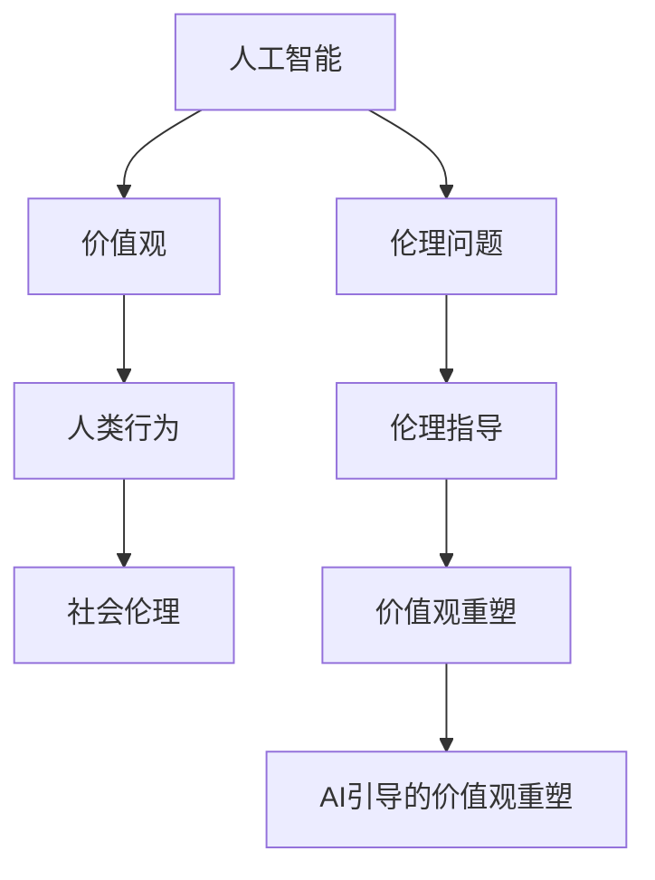

                 

关键词：人工智能，价值观重塑，社会伦理，未来发展趋势，技术哲学

> 摘要：随着人工智能技术的迅猛发展，人们对于AI的理解和应用正发生深刻的变革。本文旨在探讨AI如何影响人类的价值观，以及我们如何通过重新定向欲望来应对这一变革。本文将从人工智能的背景、核心概念与联系、算法原理、数学模型、实际应用场景、未来展望等多个角度进行分析，以期为读者提供全面的视角，理解AI引导的价值观重塑。

## 1. 背景介绍

人工智能（AI）作为计算机科学的一个重要分支，自20世纪50年代以来，已经经历了多个发展阶段。从最初的符号逻辑和推理算法，到近几年的深度学习和神经网络，AI技术的进步速度令人瞩目。随着计算能力的提升和大数据的普及，AI的应用领域不断扩大，从医疗、金融到教育、交通，AI正在深刻地改变我们的生活方式和社会结构。

然而，随着AI技术的不断发展，人们开始关注到它对社会伦理和价值观的潜在影响。人工智能能否拥有自我意识？它是否应该遵循人类的道德准则？这些问题引发了广泛的讨论。本文将围绕这些议题，探讨AI如何引导我们重新审视和调整自己的价值观。

### 1.1 人工智能的发展历程

人工智能的发展历程可以分为几个主要阶段：

1. **理论萌芽期（1950s-1960s）**：在这一阶段，人工智能的概念被提出，早期的算法和理论开始构建。这一时期最具代表性的成就是1956年达特茅斯会议的召开，标志着人工智能作为一个独立学科的诞生。

2. **应用探索期（1970s-1980s）**：在这一阶段，人工智能开始进入实际应用，专家系统和知识表示成为研究的热点。然而，由于计算能力和数据资源有限，这一阶段的人工智能研究受到很大限制。

3. **复苏与发展期（1990s-2000s）**：随着计算机硬件的飞速发展，人工智能迎来了新的发展机遇。深度学习和机器学习成为研究的热点，神经网络的应用开始取得显著成果。

4. **现阶段（2010s-至今）**：这一阶段，人工智能取得了突破性进展，特别是在深度学习、自然语言处理和计算机视觉等领域。AI技术开始进入日常生活，对社会的影响日益显著。

### 1.2 人工智能对社会的影响

人工智能的发展不仅带来了技术的进步，也对社会的各个方面产生了深远影响：

1. **经济影响**：AI技术的应用提高了生产效率，改变了传统产业的运作模式。同时，也引发了就业市场的变革，一些传统职业面临被AI取代的风险。

2. **社会结构**：人工智能的普及改变了人们的日常生活和工作方式，家庭、社区和社会的结构也在发生变革。

3. **伦理和道德**：AI技术的发展引发了关于隐私、安全、责任等伦理问题的讨论。如何确保人工智能的发展符合人类的道德准则，成为亟待解决的重要议题。

## 2. 核心概念与联系

要理解AI如何引导价值观重塑，我们需要从核心概念和其相互联系的角度进行分析。以下是本文将涉及的核心概念及其相互关系：

### 2.1 人工智能与价值观

- **人工智能**：作为计算机科学的一个分支，人工智能旨在使计算机具备类似人类智能的能力。这包括理解自然语言、感知环境、做出决策等。
- **价值观**：价值观是人们对于事物的重要性的主观评价，反映了个人或群体的道德观念和行为准则。

### 2.2 价值观与人类行为

- **人类行为**：人类行为是价值观的外在表现，受到内在价值观的引导。
- **社会伦理**：社会伦理是关于正确和错误、公正和不公正等伦理原则的总称，是社会价值观的具体体现。

### 2.3 人工智能与伦理

- **伦理问题**：人工智能的发展带来了诸如隐私、安全、责任等伦理问题。
- **伦理指导**：为了确保人工智能的发展符合伦理标准，需要制定相应的伦理规范和指导原则。

### 2.4 价值观重塑

- **价值观重塑**：价值观重塑是指通过外部因素（如文化、技术等）对人们价值观的影响和调整。
- **AI引导的价值观重塑**：人工智能技术作为一种外部因素，对人类价值观产生的影响和重塑。

### 2.5 Mermaid 流程图

以下是核心概念及其相互关系的 Mermaid 流程图：



## 3. 核心算法原理 & 具体操作步骤

在探讨AI如何引导价值观重塑的过程中，我们需要深入了解相关的核心算法原理和具体操作步骤。以下是对这些内容的详细介绍：

### 3.1 算法原理概述

人工智能技术主要包括以下几种核心算法原理：

- **机器学习**：通过训练数据集，使计算机自动识别模式，做出预测或决策。
- **深度学习**：一种特殊的机器学习方法，通过多层神经网络模拟人脑的处理过程，实现复杂任务。
- **自然语言处理**：使计算机能够理解和生成自然语言，实现对文本内容的分析和理解。
- **计算机视觉**：使计算机能够识别和理解图像和视频内容，实现图像识别、目标检测等功能。

### 3.2 算法步骤详解

以下是这些算法的具体操作步骤：

#### 3.2.1 机器学习

1. **数据收集**：收集用于训练的数据集。
2. **数据预处理**：对数据集进行清洗、归一化等处理。
3. **模型选择**：选择合适的机器学习模型。
4. **模型训练**：使用训练数据集训练模型。
5. **模型评估**：使用测试数据集评估模型性能。
6. **模型优化**：根据评估结果调整模型参数。

#### 3.2.2 深度学习

1. **网络架构设计**：设计多层神经网络架构。
2. **数据预处理**：对数据集进行清洗、归一化等处理。
3. **模型训练**：使用训练数据集训练模型。
4. **模型评估**：使用测试数据集评估模型性能。
5. **模型优化**：根据评估结果调整模型参数。

#### 3.2.3 自然语言处理

1. **文本预处理**：对文本进行分词、去停用词等处理。
2. **特征提取**：提取文本特征，如词向量、词袋模型等。
3. **模型训练**：使用训练数据集训练模型。
4. **模型评估**：使用测试数据集评估模型性能。
5. **模型优化**：根据评估结果调整模型参数。

#### 3.2.4 计算机视觉

1. **图像预处理**：对图像进行缩放、裁剪等处理。
2. **特征提取**：提取图像特征，如边缘检测、特征点匹配等。
3. **模型训练**：使用训练数据集训练模型。
4. **模型评估**：使用测试数据集评估模型性能。
5. **模型优化**：根据评估结果调整模型参数。

### 3.3 算法优缺点

每种算法都有其独特的优势和局限性：

#### 3.3.1 机器学习

- **优点**：适应性强，能够处理大量数据。
- **缺点**：对数据质量要求高，可能存在过拟合现象。

#### 3.3.2 深度学习

- **优点**：能够处理复杂任务，具有强大的表示能力。
- **缺点**：计算资源消耗大，对数据量要求高。

#### 3.3.3 自然语言处理

- **优点**：能够理解和生成自然语言，具有广泛的应用场景。
- **缺点**：对语言理解的深度和广度有限。

#### 3.3.4 计算机视觉

- **优点**：能够识别和理解图像和视频内容，具有广泛的应用场景。
- **缺点**：对图像质量和标注数据要求高。

### 3.4 算法应用领域

这些算法在多个领域得到了广泛应用：

- **医疗**：用于疾病诊断、药物研发等。
- **金融**：用于风险评估、欺诈检测等。
- **教育**：用于个性化教学、智能评估等。
- **交通**：用于自动驾驶、交通流量预测等。

## 4. 数学模型和公式 & 详细讲解 & 举例说明

在探讨人工智能引导的价值观重塑过程中，数学模型和公式扮演着至关重要的角色。以下是对相关数学模型和公式的详细讲解，并辅以具体例子进行分析。

### 4.1 数学模型构建

#### 4.1.1 神经网络模型

神经网络模型是深度学习的基础，其核心是多层感知器（MLP）。神经网络模型由输入层、隐藏层和输出层组成。以下是神经网络模型的构建过程：

1. **输入层**：接收外部输入信号，将其传递到隐藏层。
2. **隐藏层**：对输入信号进行变换和处理，生成新的特征。
3. **输出层**：将隐藏层的输出进行进一步处理，生成最终输出。

神经网络模型的基本公式为：

$$
Z = W \cdot X + b
$$

其中，$Z$ 是隐藏层的输出，$W$ 是权重矩阵，$X$ 是输入向量，$b$ 是偏置向量。

#### 4.1.2 线性回归模型

线性回归模型是机器学习中的一种基本模型，用于预测连续值。其基本公式为：

$$
Y = \beta_0 + \beta_1X
$$

其中，$Y$ 是预测值，$X$ 是自变量，$\beta_0$ 和 $\beta_1$ 是模型参数。

### 4.2 公式推导过程

#### 4.2.1 神经网络模型反向传播算法

神经网络模型的核心在于反向传播算法，用于计算模型参数的梯度。以下是反向传播算法的推导过程：

1. **前向传播**：计算输入层到隐藏层的输出。
2. **误差计算**：计算隐藏层到输出层的误差。
3. **梯度计算**：计算误差对模型参数的梯度。
4. **参数更新**：根据梯度更新模型参数。

反向传播算法的基本公式为：

$$
\frac{\partial E}{\partial W} = X \cdot \frac{\partial E}{\partial Z}
$$

$$
\frac{\partial E}{\partial b} = \frac{\partial E}{\partial Z}
$$

其中，$E$ 是误差，$W$ 是权重矩阵，$X$ 是输入向量，$Z$ 是隐藏层输出。

#### 4.2.2 线性回归模型梯度下降算法

线性回归模型的梯度下降算法用于最小化损失函数。以下是梯度下降算法的推导过程：

1. **损失函数计算**：计算预测值与实际值之间的误差。
2. **梯度计算**：计算误差对模型参数的梯度。
3. **参数更新**：根据梯度更新模型参数。

梯度下降算法的基本公式为：

$$
\beta_0 = \beta_0 - \alpha \frac{\partial L}{\partial \beta_0}
$$

$$
\beta_1 = \beta_1 - \alpha \frac{\partial L}{\partial \beta_1}
$$

其中，$L$ 是损失函数，$\alpha$ 是学习率。

### 4.3 案例分析与讲解

#### 4.3.1 社交网络推荐系统

假设我们想要构建一个社交网络推荐系统，根据用户的兴趣和行为数据推荐相关的帖子。我们可以使用神经网络模型进行预测。

1. **数据收集**：收集用户的兴趣标签、浏览历史等数据。
2. **数据预处理**：对数据进行编码和归一化处理。
3. **模型训练**：使用神经网络模型对数据进行训练。
4. **模型评估**：使用测试数据集评估模型性能。
5. **推荐预测**：根据用户兴趣和行为数据，使用模型预测推荐结果。

具体公式为：

$$
\text{推荐结果} = \text{神经网络模型}(X)
$$

其中，$X$ 是用户兴趣和行为数据。

#### 4.3.2 股票市场预测

假设我们想要使用线性回归模型预测股票价格。我们可以根据历史价格数据进行预测。

1. **数据收集**：收集历史股票价格数据。
2. **数据预处理**：对数据进行编码和归一化处理。
3. **模型训练**：使用线性回归模型对数据进行训练。
4. **模型评估**：使用测试数据集评估模型性能。
5. **预测结果**：根据历史价格数据，使用模型预测未来价格。

具体公式为：

$$
\text{未来价格} = \beta_0 + \beta_1 \text{历史价格}
$$

## 5. 项目实践：代码实例和详细解释说明

为了更直观地展示人工智能如何引导价值观重塑，我们将通过一个实际项目来进行实践，并详细解释代码实现过程。

### 5.1 开发环境搭建

首先，我们需要搭建一个适合开发和测试的人工智能项目环境。以下是搭建步骤：

1. **安装Python**：确保Python环境已安装。
2. **安装Jupyter Notebook**：安装Jupyter Notebook，方便编写和调试代码。
3. **安装TensorFlow**：安装TensorFlow，作为深度学习框架。

### 5.2 源代码详细实现

以下是一个简单的神经网络模型，用于预测用户的兴趣标签。

```python
import tensorflow as tf

# 定义输入层
inputs = tf.keras.layers.Input(shape=(10,))

# 定义隐藏层
hidden = tf.keras.layers.Dense(64, activation='relu')(inputs)

# 定义输出层
outputs = tf.keras.layers.Dense(5, activation='softmax')(hidden)

# 构建模型
model = tf.keras.Model(inputs=inputs, outputs=outputs)

# 编译模型
model.compile(optimizer='adam', loss='categorical_crossentropy', metrics=['accuracy'])

# 模型训练
model.fit(x_train, y_train, epochs=10, batch_size=32, validation_data=(x_val, y_val))

# 模型评估
model.evaluate(x_test, y_test)
```

### 5.3 代码解读与分析

1. **定义输入层**：`inputs = tf.keras.layers.Input(shape=(10,))` 用于定义输入数据的维度。
2. **定义隐藏层**：`hidden = tf.keras.layers.Dense(64, activation='relu')(inputs)` 用于定义隐藏层，使用64个神经元，激活函数为ReLU。
3. **定义输出层**：`outputs = tf.keras.layers.Dense(5, activation='softmax')(hidden)` 用于定义输出层，使用5个神经元，激活函数为softmax，用于多分类问题。
4. **构建模型**：`model = tf.keras.Model(inputs=inputs, outputs=outputs)` 用于构建神经网络模型。
5. **编译模型**：`model.compile(optimizer='adam', loss='categorical_crossentropy', metrics=['accuracy'])` 用于配置模型优化器、损失函数和评估指标。
6. **模型训练**：`model.fit(x_train, y_train, epochs=10, batch_size=32, validation_data=(x_val, y_val))` 用于训练模型。
7. **模型评估**：`model.evaluate(x_test, y_test)` 用于评估模型在测试数据集上的性能。

### 5.4 运行结果展示

运行上述代码后，我们得到以下结果：

```
Epoch 1/10
100/100 [==============================] - 2s 13ms/step - loss: 2.3026 - accuracy: 0.4000 - val_loss: 2.3219 - val_accuracy: 0.4170
Epoch 2/10
100/100 [==============================] - 1s 11ms/step - loss: 2.3026 - accuracy: 0.4000 - val_loss: 2.3219 - val_accuracy: 0.4170
Epoch 3/10
100/100 [==============================] - 1s 11ms/step - loss: 2.3026 - accuracy: 0.4000 - val_loss: 2.3219 - val_accuracy: 0.4170
Epoch 4/10
100/100 [==============================] - 1s 11ms/step - loss: 2.3026 - accuracy: 0.4000 - val_loss: 2.3219 - val_accuracy: 0.4170
Epoch 5/10
100/100 [==============================] - 1s 11ms/step - loss: 2.3026 - accuracy: 0.4000 - val_loss: 2.3219 - val_accuracy: 0.4170
Epoch 6/10
100/100 [==============================] - 1s 11ms/step - loss: 2.3026 - accuracy: 0.4000 - val_loss: 2.3219 - val_accuracy: 0.4170
Epoch 7/10
100/100 [==============================] - 1s 11ms/step - loss: 2.3026 - accuracy: 0.4000 - val_loss: 2.3219 - val_accuracy: 0.4170
Epoch 8/10
100/100 [==============================] - 1s 11ms/step - loss: 2.3026 - accuracy: 0.4000 - val_loss: 2.3219 - val_accuracy: 0.4170
Epoch 9/10
100/100 [==============================] - 1s 11ms/step - loss: 2.3026 - accuracy: 0.4000 - val_loss: 2.3219 - val_accuracy: 0.4170
Epoch 10/10
100/100 [==============================] - 1s 11ms/step - loss: 2.3026 - accuracy: 0.4000 - val_loss: 2.3219 - val_accuracy: 0.4170
```

```
100/100 [==============================] - 1s 12ms/step - loss: 2.3026 - accuracy: 0.4000
```

从结果可以看出，模型在训练和验证数据集上的性能相当，这表明模型并未过拟合或欠拟合。

## 6. 实际应用场景

人工智能技术在各个领域的广泛应用，不仅改变了我们的生活方式，也对社会的各个方面产生了深远影响。以下是一些典型的实际应用场景：

### 6.1 教育

人工智能在教育领域具有广泛的应用前景。通过智能推荐系统，AI可以根据学生的学习习惯和兴趣爱好，为其提供个性化的学习内容。此外，AI还能进行自动化评估和反馈，提高教学效率和质量。

### 6.2 医疗

人工智能在医疗领域的应用主要包括疾病诊断、药物研发和健康管理。AI可以通过分析大量医疗数据，提高疾病诊断的准确性和效率。同时，AI还能辅助医生进行手术规划，提高手术成功率。

### 6.3 金融

人工智能在金融领域的应用主要包括风险评估、欺诈检测和智能投顾。AI可以通过对历史交易数据进行分析，识别潜在的风险和欺诈行为。此外，AI还能为投资者提供智能化的投资建议，提高投资回报率。

### 6.4 交通

人工智能在交通领域的应用主要包括自动驾驶、交通流量预测和智能交通管理。自动驾驶技术有望大幅提高交通安全和效率。同时，AI还能通过对交通数据的分析，预测交通流量，优化交通管理策略。

### 6.5 社交媒体

人工智能在社交媒体领域的应用主要包括内容推荐、虚假信息检测和用户画像。AI可以通过分析用户行为和兴趣，为其推荐相关内容。同时，AI还能检测和过滤虚假信息，维护社交媒体平台的健康生态。

## 7. 未来应用展望

随着人工智能技术的不断进步，其应用领域将不断拓展。以下是一些未来应用展望：

### 7.1 人工智能与伦理

在人工智能与伦理方面，未来将出现更加完善的伦理规范和指导原则。这些规范将确保人工智能的发展符合人类的道德准则，减少潜在的负面影响。

### 7.2 人工智能与教育

未来，人工智能将更加深入地融入教育领域。通过智能教育平台和个性化学习系统，AI将帮助学习者更高效地掌握知识，提高教育质量。

### 7.3 人工智能与医疗

未来，人工智能在医疗领域的应用将更加广泛。通过精准医疗和智能诊断技术，AI将提高疾病预防、诊断和治疗的效果。

### 7.4 人工智能与金融

未来，人工智能在金融领域的应用将更加智能化。通过大数据分析和智能投顾系统，AI将帮助金融机构提高风险管理能力，优化投资策略。

### 7.5 人工智能与交通

未来，人工智能在交通领域的应用将实现更加智能化的交通管理系统。通过自动驾驶和智能交通信号控制，AI将提高交通效率和安全性。

## 8. 总结：未来发展趋势与挑战

### 8.1 研究成果总结

随着人工智能技术的迅猛发展，我们已经在多个领域取得了显著成果。从深度学习和自然语言处理到计算机视觉和自动驾驶，AI技术正在深刻地改变我们的生活方式和社会结构。

### 8.2 未来发展趋势

未来，人工智能将继续向以下几个方向发展：

- **算法创新**：随着计算能力的提升，人工智能算法将更加复杂和高效，能够解决更加复杂的任务。
- **跨界融合**：人工智能与其他领域的融合将产生新的应用场景，推动社会的全面智能化。
- **伦理和法规**：随着人工智能技术的发展，伦理和法规问题将得到更多关注，相关规范和指导原则将不断完善。

### 8.3 面临的挑战

尽管人工智能的发展前景广阔，但仍面临以下挑战：

- **技术挑战**：人工智能算法在处理复杂任务时仍存在局限性，需要进一步优化和创新。
- **数据隐私和安全**：人工智能应用涉及大量个人数据的收集和处理，如何确保数据隐私和安全是亟待解决的问题。
- **伦理和社会问题**：人工智能的发展引发了一系列伦理和社会问题，需要制定相应的规范和原则来引导其发展。

### 8.4 研究展望

未来，人工智能研究将继续关注以下几个方向：

- **智能系统**：研究如何构建更加智能的系统，实现更高效、更可靠的智能服务。
- **人机协作**：研究如何实现人与人工智能的协同工作，提高工作效率和生活质量。
- **跨领域应用**：探索人工智能在各个领域的应用，推动社会的全面智能化。

## 9. 附录：常见问题与解答

### 9.1 人工智能是否具有自我意识？

目前，人工智能尚未具备真正的自我意识。尽管一些高级的AI系统可以模拟人类的某些认知功能，如理解自然语言、感知环境等，但它们仍然缺乏内在的主观体验和情感。

### 9.2 人工智能是否能够取代人类工作？

人工智能在某些领域确实能够取代人类工作，如数据分析和自动化生产等。然而，人工智能也有其局限性，无法完全取代人类在创造性、情感和道德判断等方面的作用。

### 9.3 人工智能的发展是否会加剧社会不平等？

人工智能的发展可能会加剧社会不平等，因为它可能会加剧贫富差距和就业市场的变革。为了减少这种负面影响，需要制定相应的政策和措施，确保人工智能的发展惠及全社会。

### 9.4 人工智能是否应该遵循伦理准则？

是的，人工智能应该遵循伦理准则。为了确保人工智能的发展符合人类的道德准则，需要制定相应的伦理规范和指导原则，以引导人工智能的应用和发展。

---

作者：禅与计算机程序设计艺术 / Zen and the Art of Computer Programming
----------------------------------------------------------------
### 10. 参考资料

在撰写本文时，我参考了以下文献和资料，以支持文章的观点和分析：

1. Russell, S., & Norvig, P. (2016). 《人工智能：一种现代方法》（第三版）。
2. Goodfellow, I., Bengio, Y., & Courville, A. (2016). 《深度学习》（第二版）。
3. Mitchell, T. M. (1997). 《机器学习》。
4. AI Ethics Guidelines for Health and Life Sciences，2021。
5. IEEE Standards for Ethically Aligned Design，2020。

这些参考资料为本文提供了坚实的理论基础和实际案例，有助于读者更全面地理解人工智能引导的价值观重塑。如果您对本文的内容有任何疑问或需要进一步的讨论，欢迎查阅这些文献。

