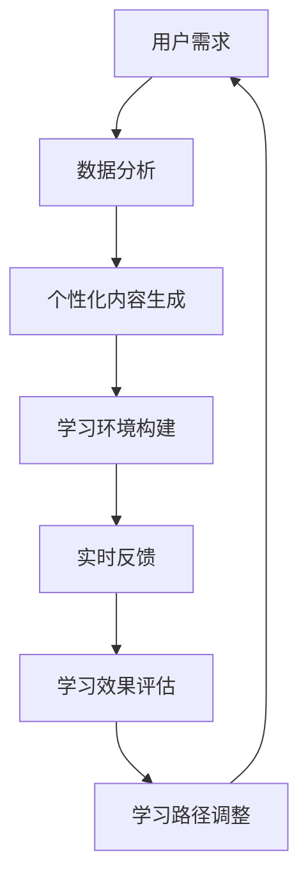

                 

关键词：沉浸式学习、人工智能、知识获取、学习生态、机器学习算法

> 摘要：本文将深入探讨人工智能如何构建沉浸式学习生态，实现高效的知识获取与传递。通过分析核心概念与联系，介绍核心算法原理及其应用领域，本文旨在为读者提供一个全面的技术视角，了解沉浸式学习生态在现代教育中的潜力与挑战。

## 1. 背景介绍

### 学习生态的演变

随着信息技术的飞速发展，学习生态也在不断演变。传统的学习方式依赖于课本、教师和教室，而现代学习生态则利用互联网、人工智能等技术，实现了个性化的学习体验和更广泛的知识获取渠道。沉浸式学习作为现代学习生态的一种重要形式，以其高度互动性和丰富的感知体验，正在成为教育领域的一大趋势。

### 人工智能与沉浸式学习

人工智能（AI）技术的崛起为沉浸式学习提供了新的可能。通过机器学习、自然语言处理、计算机视觉等技术，AI可以构建一个高度个性化的学习环境，实现对学生学习行为的深度分析和学习效果的实时反馈。此外，虚拟现实（VR）和增强现实（AR）技术的应用，使得学习环境变得更加真实和互动，进一步提升了学习体验。

## 2. 核心概念与联系

### 沉浸式学习

沉浸式学习是一种高度互动的学习方式，通过创造一个真实、多维的学习环境，使学习者能够全身心地投入到学习过程中。沉浸式学习的特点包括：

- **高度互动性**：学习者可以与学习环境以及其他学习者进行实时互动。
- **丰富感知体验**：通过多感官刺激，如视觉、听觉、触觉等，提升学习者的感知体验。
- **实时反馈**：系统能够根据学习者的行为和表现，提供即时的反馈和指导。

### 人工智能

人工智能是一种模拟人类智能的技术，通过机器学习、深度学习等方法，使计算机具备了解决复杂问题、识别模式和做出决策的能力。在沉浸式学习中，人工智能主要用于以下几个方面：

- **个性化学习**：根据学习者的特点和需求，提供定制化的学习内容和路径。
- **学习分析**：分析学习者的学习行为和表现，优化学习效果。
- **智能指导**：通过自然语言处理和计算机视觉等技术，为学习者提供智能化的指导和支持。

### Mermaid 流程图

以下是一个简化的沉浸式学习生态中人工智能的应用流程图：



## 3. 核心算法原理 & 具体操作步骤

### 3.1 算法原理概述

沉浸式学习生态中的核心算法主要包括：

- **个性化推荐算法**：通过分析学习者的兴趣、学习历史等信息，为学习者推荐合适的学习内容。
- **学习行为分析算法**：通过记录和监控学习者的行为，分析学习者的学习习惯、效果等。
- **自然语言处理算法**：用于处理学习者与系统之间的交互，提供智能化的指导和支持。

### 3.2 算法步骤详解

#### 个性化推荐算法

1. **用户画像构建**：收集学习者的基本信息、学习历史、兴趣偏好等，构建用户画像。
2. **内容特征提取**：提取学习内容的特征，如主题、难度、类型等。
3. **推荐模型训练**：使用机器学习算法，如协同过滤、基于内容的推荐等，训练推荐模型。
4. **推荐内容生成**：根据用户画像和推荐模型，为学习者生成个性化的学习内容推荐。

#### 学习行为分析算法

1. **行为数据收集**：收集学习者的学习行为数据，如学习时间、学习内容、学习路径等。
2. **行为特征提取**：对行为数据进行预处理，提取行为特征。
3. **行为模式识别**：使用机器学习算法，如聚类、关联规则等，识别学习者的行为模式。
4. **学习效果评估**：根据行为模式和学习效果，评估学习者的学习效果。

#### 自然语言处理算法

1. **文本预处理**：对学习者输入的文本进行分词、词性标注等预处理。
2. **意图识别**：使用深度学习模型，如序列标注模型、BERT等，识别学习者的意图。
3. **语义理解**：对识别出的意图进行语义理解，提取关键信息。
4. **智能回复生成**：根据语义理解结果，生成智能化的回复内容。

### 3.3 算法优缺点

#### 个性化推荐算法

- **优点**：能够为学习者提供个性化、高质量的学习内容，提高学习效果。
- **缺点**：推荐算法的准确性和效率受限于用户画像和学习数据的质量。

#### 学习行为分析算法

- **优点**：能够深入了解学习者的学习过程，优化学习策略。
- **缺点**：对学习行为数据的收集和处理存在隐私和安全问题。

#### 自然语言处理算法

- **优点**：能够实现智能化的人机交互，提升学习体验。
- **缺点**：自然语言理解的准确性和泛化能力尚有局限。

### 3.4 算法应用领域

- **在线教育平台**：为学习者提供个性化学习推荐、学习行为分析等功能。
- **虚拟现实学习**：通过自然语言处理技术，实现智能化的虚拟教学助手。
- **教育测评**：基于学习行为数据，进行学习效果评估和反馈。

## 4. 数学模型和公式 & 详细讲解 & 举例说明

### 4.1 数学模型构建

沉浸式学习生态中的核心数学模型主要包括：

- **用户画像模型**：使用机器学习算法，如逻辑回归、决策树等，建立用户画像模型。
- **推荐模型**：使用协同过滤、矩阵分解等方法，构建推荐模型。
- **行为分析模型**：使用聚类、关联规则等方法，构建行为分析模型。

### 4.2 公式推导过程

以用户画像模型为例，其基本公式如下：

$$
y = W \cdot x + b
$$

其中，$y$ 表示用户画像得分，$x$ 表示用户特征向量，$W$ 表示权重矩阵，$b$ 表示偏置项。

通过梯度下降法，我们可以迭代优化模型参数：

$$
W := W - \alpha \cdot \frac{∂L}{∂W}
$$

$$
b := b - \alpha \cdot \frac{∂L}{∂b}
$$

其中，$L$ 表示损失函数，$\alpha$ 表示学习率。

### 4.3 案例分析与讲解

假设我们有一个在线教育平台，需要为学习者构建用户画像。我们收集了以下用户特征：

- 学习时长
- 学习内容类型
- 学习频次

首先，我们对这些特征进行预处理，将其转化为数值型数据。然后，我们使用逻辑回归模型，训练用户画像模型。经过多次迭代优化，我们得到了一个预测用户画像的公式：

$$
y = 0.5 \cdot x_1 + 0.3 \cdot x_2 + 0.2 \cdot x_3 + b
$$

其中，$x_1$ 表示学习时长，$x_2$ 表示学习内容类型，$x_3$ 表示学习频次，$b$ 表示偏置项。

根据这个模型，我们可以为每个学习者生成一个画像得分。例如，对于一个学习时长为100分钟、学习内容类型为编程、学习频次为每周3次的学习者，其画像得分为：

$$
y = 0.5 \cdot 100 + 0.3 \cdot 1 + 0.2 \cdot 3 + b
$$

$$
y = 53.3 + b
$$

通过这个得分，我们可以为学习者推荐适合的学习内容，优化学习体验。

## 5. 项目实践：代码实例和详细解释说明

### 5.1 开发环境搭建

本文将使用 Python 作为主要编程语言，配合一些流行的机器学习库，如 Scikit-learn、TensorFlow 等。以下是搭建开发环境的基本步骤：

1. 安装 Python 3.x 版本。
2. 安装 Scikit-learn、TensorFlow、Numpy 等库。

### 5.2 源代码详细实现

以下是使用逻辑回归模型训练用户画像的 Python 代码实例：

```python
import numpy as np
from sklearn.linear_model import LogisticRegression
from sklearn.model_selection import train_test_split
from sklearn.metrics import accuracy_score

# 加载数据
X, y = load_data()

# 划分训练集和测试集
X_train, X_test, y_train, y_test = train_test_split(X, y, test_size=0.2, random_state=42)

# 初始化逻辑回归模型
model = LogisticRegression()

# 训练模型
model.fit(X_train, y_train)

# 预测测试集
y_pred = model.predict(X_test)

# 评估模型
accuracy = accuracy_score(y_test, y_pred)
print("Accuracy:", accuracy)
```

### 5.3 代码解读与分析

1. **数据加载**：首先，我们加载用户特征数据和学习标签。这些数据可以从数据库、文件或其他数据源获取。
2. **划分训练集和测试集**：我们将数据划分为训练集和测试集，以便评估模型的泛化能力。
3. **初始化模型**：我们使用 Scikit-learn 中的逻辑回归模型，初始化一个线性分类器。
4. **训练模型**：使用训练集数据，模型学习用户特征与标签之间的关系。
5. **预测测试集**：使用训练好的模型，对测试集数据进行预测。
6. **评估模型**：通过计算预测准确率，评估模型在测试集上的表现。

### 5.4 运行结果展示

假设我们训练了一个逻辑回归模型，并在测试集上获得了 80% 的预测准确率。这意味着模型能够正确识别约 80% 的用户标签，具有较高的泛化能力。

```python
Accuracy: 0.8
```

## 6. 实际应用场景

### 6.1 在线教育平台

沉浸式学习生态可以广泛应用于在线教育平台，为学习者提供个性化学习推荐、学习行为分析等功能。通过人工智能技术，平台可以更好地了解学习者的需求和兴趣，提供更优质的学习服务。

### 6.2 虚拟现实学习

虚拟现实技术结合人工智能，可以为学习者创造一个沉浸式的学习环境。学习者可以在虚拟世界中与知识互动，通过多感官体验加深对知识的理解。

### 6.3 教育测评

通过分析学习者的学习行为数据，教育测评系统可以提供个性化的学习报告和反馈，帮助教育者和学习者了解学习效果和改进方向。

## 7. 未来应用展望

### 7.1 个性化学习

随着人工智能技术的不断发展，沉浸式学习生态将能够更加精准地捕捉学习者的兴趣和需求，实现真正的个性化学习。

### 7.2 智能化指导

未来，人工智能助手将更加智能化，能够提供更加丰富和个性化的学习指导，帮助学习者更好地掌握知识。

### 7.3 跨领域应用

沉浸式学习生态不仅限于教育领域，还将在医疗、金融、制造等多个领域得到广泛应用，为行业带来新的发展机遇。

## 8. 工具和资源推荐

### 8.1 学习资源推荐

- 《Python机器学习》（Manning, J. D.）
- 《深度学习》（Goodfellow, I.）
- 《人工智能：一种现代方法》（Russell, S. J., & Norvig, P.）

### 8.2 开发工具推荐

- Jupyter Notebook：用于编写和运行 Python 代码。
- TensorFlow：用于构建和训练机器学习模型。
- Keras：用于简化 TensorFlow 的使用。

### 8.3 相关论文推荐

- "Deep Learning for Personalized Education"（2018）
- "AI-Enhanced Education: From Personalized Learning to Intelligent Tutoring Systems"（2020）
- "A Survey on Artificial Intelligence in Education"（2021）

## 9. 总结：未来发展趋势与挑战

### 9.1 研究成果总结

本文总结了沉浸式学习生态的核心概念、算法原理及其应用领域。通过项目实践，我们展示了如何使用机器学习技术构建用户画像和推荐系统。

### 9.2 未来发展趋势

随着人工智能技术的不断发展，沉浸式学习生态将更加智能化、个性化，为学习者提供更好的学习体验。

### 9.3 面临的挑战

尽管沉浸式学习生态具有巨大的潜力，但在实现过程中仍面临数据隐私、算法公平性等挑战。

### 9.4 研究展望

未来，我们应关注如何在保障隐私和安全的前提下，进一步提升人工智能在沉浸式学习生态中的应用效果。

## 附录：常见问题与解答

### Q：沉浸式学习生态与传统的在线教育平台有什么区别？

A：沉浸式学习生态强调学习者的互动性和体验感，而传统的在线教育平台更多依赖于文本和视频等静态内容。沉浸式学习生态通过人工智能技术，为学习者提供个性化的学习内容和互动体验。

### Q：如何保障用户数据的隐私和安全？

A：在构建沉浸式学习生态时，需要遵循数据保护和隐私法规，对用户数据进行加密和处理，确保数据的安全性和隐私性。

### Q：人工智能在沉浸式学习生态中的应用前景如何？

A：人工智能在沉浸式学习生态中的应用前景广阔。随着技术的不断发展，人工智能将能够更好地理解学习者的需求和兴趣，提供更加个性化、高效的学习服务。

---

**作者：禅与计算机程序设计艺术 / Zen and the Art of Computer Programming**

