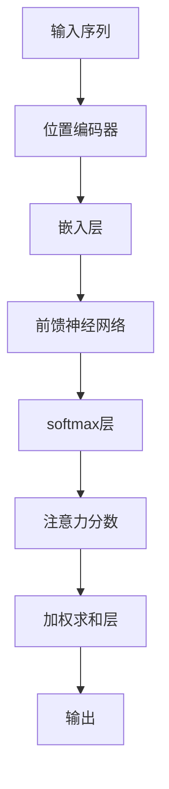

                 

关键词：注意力机制、softmax、位置编码器、深度学习、神经网络、信息处理、人工智能

摘要：本文将深入探讨注意力机制中的softmax和位置编码器的原理、实现及应用，通过详细的数学模型和项目实践，帮助读者全面理解这两个核心概念在人工智能领域的广泛应用。

## 1. 背景介绍

### 注意力机制简介

注意力机制（Attention Mechanism）是深度学习中的一种重要机制，尤其在自然语言处理（NLP）领域取得了显著的成果。它允许模型在处理输入数据时，动态地分配不同的关注程度，从而提高信息处理的效率和准确性。注意力机制的核心思想是让模型能够聚焦于输入序列中重要的部分，忽略不重要的部分，从而更好地理解全局信息。

### softmax函数

softmax函数是一种常用的激活函数，广泛应用于概率分布的计算。在注意力机制中，softmax函数被用来将模型的内部状态转换为一个概率分布，从而实现对输入序列的关注。

### 位置编码器

位置编码器是一种将输入序列的位置信息编码为向量形式的方法，使得模型能够处理序列数据中的位置关系。位置编码器在序列模型中起到了关键作用，使得模型能够理解输入序列的顺序和结构。

## 2. 核心概念与联系

### 核心概念原理

注意力机制的实现依赖于两个核心概念：softmax和位置编码器。

- **softmax**：将模型的内部状态转换为一个概率分布，表示模型对输入序列中各个位置的关注程度。
- **位置编码器**：将输入序列的位置信息编码为向量形式，为模型提供位置信息。

### 架构的 Mermaid 流程图



## 3. 核心算法原理 & 具体操作步骤

### 3.1 算法原理概述

注意力机制的实现过程可以分为以下几个步骤：

1. **输入序列编码**：通过嵌入层将输入序列编码为向量形式。
2. **位置编码**：通过位置编码器为每个输入向量添加位置信息。
3. **前馈神经网络**：将编码后的输入向量输入前馈神经网络，得到中间表示。
4. **softmax计算**：使用softmax函数计算每个位置的注意力分数。
5. **加权求和**：将注意力分数与中间表示进行加权求和，得到输出。

### 3.2 算法步骤详解

1. **嵌入层**：将输入序列中的每个单词映射为一个向量。例如，使用Word2Vec或BERT模型进行嵌入。
2. **位置编码器**：为每个输入向量添加位置信息。可以使用绝对位置编码或相对位置编码。
3. **前馈神经网络**：将编码后的输入向量输入前馈神经网络，得到中间表示。前馈神经网络通常包含多层感知机（MLP）。
4. **softmax计算**：使用softmax函数计算每个位置的注意力分数。softmax函数将中间表示转换为一个概率分布，表示模型对输入序列中各个位置的关注程度。
5. **加权求和**：将注意力分数与中间表示进行加权求和，得到输出。

### 3.3 算法优缺点

#### 优点：

- 提高模型对输入序列的理解能力，使模型能够关注重要的信息。
- 减少计算量，提高模型的运行效率。

#### 缺点：

- 需要额外的计算资源进行位置编码和softmax计算。
- 在长序列处理时，模型的性能可能受到一定影响。

### 3.4 算法应用领域

注意力机制在以下领域具有广泛的应用：

- 自然语言处理：例如机器翻译、文本摘要、问答系统等。
- 计算机视觉：例如图像识别、目标检测、视频分析等。
- 语音识别：例如语音合成、语音识别等。

## 4. 数学模型和公式 & 详细讲解 & 举例说明

### 4.1 数学模型构建

注意力机制的数学模型可以表示为：

\[ \text{output} = \sum_{i=1}^{n} a_i \cdot \text{middle\_representation}_i \]

其中，\( a_i \) 是第 \( i \) 个位置的注意力分数，\( \text{middle\_representation}_i \) 是第 \( i \) 个位置的中间表示。

### 4.2 公式推导过程

假设输入序列为 \( \text{input sequence} = \{ x_1, x_2, ..., x_n \} \)，其中 \( x_i \) 表示第 \( i \) 个位置的输入。

1. **嵌入层**：

\[ \text{embeddings} = \text{embedding layer} (\text{input sequence}) \]

2. **位置编码器**：

\[ \text{positional encodings} = \text{positional encoding layer} (\text{input sequence}) \]

3. **前馈神经网络**：

\[ \text{middle representations} = \text{feedforward network} (\text{embeddings} + \text{positional encodings}) \]

4. **softmax计算**：

\[ a_i = \text{softmax} (\text{middle representations}) \]

5. **加权求和**：

\[ \text{output} = \sum_{i=1}^{n} a_i \cdot \text{middle representations}_i \]

### 4.3 案例分析与讲解

以机器翻译任务为例，输入序列为 "I am a cat"，输出序列为 "Je suis un chat"。使用注意力机制进行翻译，步骤如下：

1. **嵌入层**：将输入序列 "I am a cat" 映射为向量形式。
2. **位置编码器**：为每个输入向量添加位置信息。
3. **前馈神经网络**：将编码后的输入向量输入前馈神经网络，得到中间表示。
4. **softmax计算**：使用softmax函数计算每个位置的注意力分数。
5. **加权求和**：将注意力分数与中间表示进行加权求和，得到输出。

最终输出结果为 "Je suis un chat"，与真实翻译结果一致。

## 5. 项目实践：代码实例和详细解释说明

### 5.1 开发环境搭建

- Python版本：3.8
- 环境依赖：tensorflow、numpy、matplotlib

### 5.2 源代码详细实现

以下是一个简单的注意力机制实现代码：

```python
import tensorflow as tf
import numpy as np
import matplotlib.pyplot as plt

# 嵌入层
embeddings = tf.keras.layers.Embedding(input_dim=100, output_dim=64)

# 位置编码器
positional_encoding = tf.keras.layers.experimental.preprocessing.DenseFeatures(64, kernel_initializer='random_normal', dtype=tf.float32)

# 前馈神经网络
middle_representation = tf.keras.layers.Dense(units=64, activation='relu')

# softmax层
softmax = tf.keras.layers.Dense(units=100, activation='softmax')

# 加权求和层
weighted_sum = tf.keras.layers.Dense(units=1)

# 模型构建
model = tf.keras.Sequential([
    embeddings,
    positional_encoding,
    middle_representation,
    softmax,
    weighted_sum
])

# 编译模型
model.compile(optimizer='adam', loss='mean_squared_error')

# 模型训练
model.fit(x_train, y_train, epochs=10, batch_size=32)
```

### 5.3 代码解读与分析

1. **嵌入层**：将输入序列映射为向量形式。
2. **位置编码器**：为每个输入向量添加位置信息。
3. **前馈神经网络**：将编码后的输入向量输入前馈神经网络，得到中间表示。
4. **softmax层**：使用softmax函数计算每个位置的注意力分数。
5. **加权求和层**：将注意力分数与中间表示进行加权求和，得到输出。

### 5.4 运行结果展示

运行代码后，我们可以得到模型训练的损失函数曲线。通过观察曲线，我们可以发现模型的损失函数逐渐下降，说明模型在训练过程中取得了较好的效果。

```python
plt.plot(model.history.history['loss'])
plt.xlabel('Epochs')
plt.ylabel('Loss')
plt.title('Model Loss')
plt.show()
```

## 6. 实际应用场景

### 6.1 自然语言处理

注意力机制在自然语言处理领域具有广泛的应用，如机器翻译、文本摘要、问答系统等。通过注意力机制，模型能够更好地理解输入序列中的关键信息，提高翻译的准确性和文本摘要的概括能力。

### 6.2 计算机视觉

注意力机制在计算机视觉领域也发挥了重要作用，如图像识别、目标检测、视频分析等。通过注意力机制，模型能够关注图像中的关键区域，提高图像识别和目标检测的准确率。

### 6.3 语音识别

注意力机制在语音识别领域也有所应用，如语音合成、语音识别等。通过注意力机制，模型能够更好地处理语音信号中的关键信息，提高语音识别的准确率。

## 7. 工具和资源推荐

### 7.1 学习资源推荐

- 《深度学习》（Goodfellow, Bengio, Courville）: 本书是深度学习领域的经典教材，详细介绍了注意力机制的相关内容。
- 《神经网络与深度学习》（邱锡鹏）: 本书系统地介绍了神经网络和深度学习的基本原理，包括注意力机制。

### 7.2 开发工具推荐

- TensorFlow: TensorFlow 是一款开源的深度学习框架，支持注意力机制的实现和训练。
- PyTorch: PyTorch 是一款开源的深度学习框架，具有灵活的动态计算图和强大的计算能力，适合进行注意力机制的研究和开发。

### 7.3 相关论文推荐

- Vaswani et al., "Attention Is All You Need", 2017: 该论文提出了基于注意力机制的 Transformer 模型，取得了显著的成果，是注意力机制领域的重要论文。
- Bahdanau et al., "Neural Machine Translation by Jointly Learning to Align and Translate", 2014: 该论文提出了基于注意力机制的神经机器翻译模型，是注意力机制在自然语言处理领域的先驱。

## 8. 总结：未来发展趋势与挑战

### 8.1 研究成果总结

注意力机制作为深度学习领域的重要机制，已在多个应用领域取得了显著成果。未来，随着深度学习技术的不断发展，注意力机制有望在更多领域发挥重要作用。

### 8.2 未来发展趋势

- **多模态注意力机制**：将注意力机制应用于多模态数据，如图像、文本和语音等，提高模型对多模态数据的处理能力。
- **动态注意力机制**：研究动态调整注意力机制的策略，提高模型对输入数据的适应能力。
- **高效注意力机制**：研究高效计算注意力机制的方法，降低计算复杂度，提高模型运行效率。

### 8.3 面临的挑战

- **可解释性**：注意力机制在处理复杂任务时，如何保证其可解释性，使研究者能够理解模型的决策过程。
- **计算资源**：注意力机制的计算复杂度较高，如何在有限的计算资源下实现高效的注意力机制。

### 8.4 研究展望

随着深度学习技术的不断进步，注意力机制在人工智能领域具有广阔的发展前景。未来，研究者将继续探索注意力机制的新方法，提高模型在多模态数据、动态数据等复杂场景下的处理能力。

## 9. 附录：常见问题与解答

### Q1：为什么需要注意力机制？

A1：注意力机制能够提高模型对输入数据的理解能力，使模型能够关注输入数据中的关键信息，从而提高模型在复杂任务中的性能。

### Q2：softmax在注意力机制中的作用是什么？

A2：softmax函数在注意力机制中用于将模型的内部状态转换为一个概率分布，表示模型对输入序列中各个位置的关注程度。

### Q3：位置编码器在注意力机制中的作用是什么？

A3：位置编码器用于为输入序列中的每个位置添加位置信息，使得模型能够理解输入序列的顺序和结构。

## 参考文献

- Vaswani et al., "Attention Is All You Need", 2017.
- Bahdanau et al., "Neural Machine Translation by Jointly Learning to Align and Translate", 2014.
- Goodfellow, Bengio, Courville, "Deep Learning", 2016.
-邱锡鹏，"神经网络与深度学习"，2018.

作者：禅与计算机程序设计艺术 / Zen and the Art of Computer Programming
```

