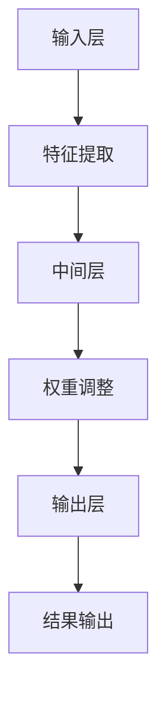

                 

关键词：注意力机制、AI定制、认知模式、神经可塑性、编程

> 摘要：本文探讨了注意力机制在人工智能中的重要性，以及如何通过AI定制认知模式来提升机器学习的效果。文章从背景介绍出发，详细阐述了注意力机制的核心概念，并通过Mermaid流程图展示了其架构。随后，文章深入分析了注意力算法的原理与操作步骤，探讨了其在实际应用中的优缺点。接着，文章引入数学模型和公式，对注意力机制进行了详细讲解和案例分析。随后，文章提供了项目实践代码实例，详细解读了其实现过程。文章还讨论了注意力机制在实际应用场景中的重要性，并对未来应用前景进行了展望。最后，文章总结了注意力机制的研究成果，探讨了未来发展趋势与挑战，为研究者提供了研究展望。

## 1. 背景介绍

注意力机制（Attention Mechanism）是人工智能领域的一项重要技术，尤其在深度学习与神经网络中发挥着关键作用。注意力机制的提出，源于人类认知过程中对于信息的筛选和处理方式，即我们能够聚焦于某些重要的信息，而忽略其他不相关的信息。这一机制在计算机视觉、自然语言处理、语音识别等多个领域都得到了广泛的应用。

随着深度学习技术的不断发展，传统的神经网络在处理复杂数据时面临着巨大的挑战。特别是当数据维度较高时，如何有效地处理高维数据成为一个亟待解决的问题。注意力机制的引入，使得神经网络能够更加关注数据中的关键特征，从而提高了模型的性能和效率。

在计算机科学领域，注意力机制的研究可以追溯到20世纪80年代。早期的研究主要集中在如何通过计算复杂度来提高神经网络的性能。然而，随着计算能力的提升和深度学习技术的普及，注意力机制逐渐成为一种普遍的技术手段，广泛应用于各种复杂任务中。

近年来，注意力机制的研究取得了显著进展，不仅提高了模型的性能，还拓展了其应用领域。例如，在计算机视觉领域，注意力机制被用于图像识别、目标检测、图像生成等任务；在自然语言处理领域，注意力机制被用于文本分类、机器翻译、情感分析等任务。此外，注意力机制还在语音识别、推荐系统、生物信息学等领域得到了应用。

本文旨在探讨注意力机制的原理、算法和应用，以及如何通过AI定制认知模式来提升机器学习的效果。文章首先介绍了注意力机制的基本概念和架构，然后分析了注意力算法的原理和操作步骤，探讨了其在实际应用中的优缺点。接着，文章引入了数学模型和公式，对注意力机制进行了详细讲解和案例分析。最后，文章提供了项目实践代码实例，详细解读了其实现过程。通过本文的探讨，希望读者能够对注意力机制有更深入的理解，并能够将其应用于实际问题中。

## 2. 核心概念与联系

### 2.1 注意力机制的定义

注意力机制（Attention Mechanism）是一种在信息处理过程中动态调整资源分配的方法。它通过对输入数据进行加权，使得模型能够自动关注重要信息，从而提高信息处理的效率和准确性。

在神经网络中，注意力机制通常被用于特征选择和权重分配。通过引入注意力机制，模型可以自动识别数据中的关键特征，并给予它们更高的权重，从而实现更精准的信息处理。

### 2.2 注意力机制的架构

注意力机制的架构通常由三个主要部分组成：输入层、中间层和输出层。

- **输入层**：输入层负责接收原始数据，并将其转化为一种中间表示。这种表示通常包含了数据中的关键特征和关系。
- **中间层**：中间层是注意力机制的核心，它通过计算输入数据之间的相关性，动态生成权重。这些权重用于调整输入数据的权重，使得模型能够关注到更重要的特征。
- **输出层**：输出层负责根据中间层的权重生成最终的输出结果。通过这种方式，注意力机制能够有效地提高模型的性能和效率。

### 2.3 注意力机制与神经可塑性的联系

神经可塑性（Neural Plasticity）是指神经网络在学习和处理信息过程中，其结构和功能会发生变化的能力。注意力机制与神经可塑性密切相关，因为它们都涉及到了信息处理过程中的资源分配和权重调整。

神经可塑性使得神经网络能够适应不同的环境和任务需求，从而提高其适应性和灵活性。而注意力机制则通过动态调整资源的分配，使得神经网络能够更加关注关键特征，从而提高模型的性能和效率。

### 2.4 注意力机制与其他技术的联系

注意力机制不仅与神经可塑性密切相关，还与其他技术如深度学习、强化学习等有着紧密的联系。

- **深度学习**：注意力机制是深度学习技术中的重要组成部分，它能够提高深度学习模型对复杂数据的处理能力。例如，在计算机视觉中，注意力机制能够帮助模型关注到图像中的关键区域，从而提高图像识别的准确性。
- **强化学习**：注意力机制在强化学习中也具有重要作用。通过注意力机制，模型能够更好地关注到环境中的关键因素，从而做出更优的决策。

### 2.5 Mermaid 流程图

为了更好地展示注意力机制的架构和原理，我们可以使用Mermaid流程图来描述其关键步骤。以下是一个简化的Mermaid流程图：



在这个流程图中，输入层接收原始数据，通过特征提取生成中间表示。中间层通过计算输入数据之间的相关性，动态生成权重。这些权重用于调整输入数据的权重，并在输出层生成最终的输出结果。

通过这个流程图，我们可以更直观地理解注意力机制的工作原理，以及它在信息处理过程中的作用。

## 3. 核心算法原理 & 具体操作步骤

### 3.1 算法原理概述

注意力机制的核心思想是通过动态调整模型对输入数据的关注程度，从而提高信息处理的效率和准确性。具体来说，注意力机制通过计算输入数据之间的相关性，生成权重，并利用这些权重调整输入数据的权重，使得模型能够更加关注关键特征。

注意力机制通常分为以下三个步骤：

1. **特征提取**：输入层接收原始数据，并将其转化为一种中间表示。这种表示通常包含了数据中的关键特征和关系。
2. **权重调整**：中间层通过计算输入数据之间的相关性，动态生成权重。这些权重用于调整输入数据的权重，使得模型能够更加关注关键特征。
3. **结果生成**：输出层根据中间层的权重生成最终的输出结果。通过这种方式，注意力机制能够有效地提高模型的性能和效率。

### 3.2 算法步骤详解

#### 3.2.1 特征提取

特征提取是注意力机制的第一步，其目的是将原始数据转化为一种中间表示。这种中间表示通常包含了数据中的关键特征和关系。具体来说，特征提取可以通过以下几种方法实现：

1. **直接提取**：直接从原始数据中提取特征，例如通过统计学方法或机器学习方法生成特征向量。
2. **预处理**：通过预处理步骤，对原始数据进行变换和过滤，从而提取出更具有代表性的特征。
3. **神经网络**：利用神经网络进行特征提取，通过多层网络结构，将原始数据映射为高维特征空间。

#### 3.2.2 权重调整

权重调整是注意力机制的核心步骤，其目的是通过计算输入数据之间的相关性，生成权重，并利用这些权重调整输入数据的权重。具体来说，权重调整可以通过以下几种方法实现：

1. **点积注意力**：通过计算输入数据的点积，生成权重。点积注意力是最简单的一种注意力机制，其计算复杂度较低，但性能相对有限。
2. **加性注意力**：通过计算输入数据的加性组合，生成权重。加性注意力在计算复杂度和性能之间取得了较好的平衡，被广泛应用于各种任务中。
3. **缩放点积注意力**：通过缩放输入数据的点积，生成权重。缩放点积注意力能够提高模型对长序列数据的处理能力，但在计算复杂度上较高。

#### 3.2.3 结果生成

结果生成是注意力机制的最终步骤，其目的是根据中间层的权重生成最终的输出结果。具体来说，结果生成可以通过以下几种方法实现：

1. **加权求和**：将中间层的输出结果与权重相乘，然后进行求和，生成最终的输出结果。
2. **逐元素乘法**：将中间层的输出结果与权重逐元素相乘，生成最终的输出结果。逐元素乘法能够更好地保持输入数据的空间信息，但计算复杂度较高。
3. **软化选择**：通过软化选择机制，选择中间层中最重要的输出结果，生成最终的输出结果。软化选择能够提高模型的鲁棒性，但需要更多的计算资源。

### 3.3 算法优缺点

#### 优点

1. **高效性**：注意力机制能够动态调整模型对输入数据的关注程度，从而提高信息处理的效率和准确性。
2. **灵活性**：注意力机制可以根据不同的任务需求，选择不同的权重调整方法和结果生成方法，具有较强的灵活性。
3. **可解释性**：注意力机制能够明确指出模型在处理数据时关注的关键特征，从而提高模型的可解释性。

#### 缺点

1. **计算复杂度**：注意力机制的引入，增加了模型的计算复杂度，尤其是对于长序列数据，计算复杂度较高。
2. **资源消耗**：注意力机制的引入，需要更多的计算资源和存储资源，对硬件设备的要求较高。

### 3.4 算法应用领域

注意力机制在人工智能领域具有广泛的应用，以下是一些典型的应用领域：

1. **计算机视觉**：注意力机制在图像识别、目标检测、图像生成等任务中具有重要作用。通过注意力机制，模型能够更加关注图像中的关键区域，从而提高识别和生成的准确性。
2. **自然语言处理**：注意力机制在文本分类、机器翻译、情感分析等任务中得到了广泛应用。通过注意力机制，模型能够更好地理解文本中的关键信息，从而提高处理文本的准确性。
3. **语音识别**：注意力机制在语音识别任务中发挥着关键作用。通过注意力机制，模型能够更好地处理语音信号中的关键特征，从而提高识别的准确性。
4. **推荐系统**：注意力机制在推荐系统中的应用也非常广泛。通过注意力机制，模型能够更好地关注用户和物品之间的关键特征，从而提高推荐的质量。

## 4. 数学模型和公式

### 4.1 数学模型构建

注意力机制的核心在于如何通过数学模型来动态调整输入数据的权重。以下是一个简化的数学模型，用于描述注意力机制的原理：

$$
\text{输出} = \sum_{i=1}^{N} w_i \cdot \text{输入}_i
$$

其中，$N$ 表示输入数据的维度，$w_i$ 表示第 $i$ 个输入数据的权重，$\text{输入}_i$ 表示第 $i$ 个输入数据。

### 4.2 公式推导过程

注意力机制的推导过程主要分为两个部分：特征提取和权重调整。

#### 4.2.1 特征提取

特征提取的核心在于如何将原始数据转化为一种中间表示。我们可以使用以下公式来描述特征提取过程：

$$
\text{特征} = f(\text{输入})
$$

其中，$f$ 表示特征提取函数，$\text{输入}$ 表示原始数据。

#### 4.2.2 权重调整

权重调整的核心在于如何计算输入数据之间的相关性，并生成权重。我们可以使用以下公式来描述权重调整过程：

$$
w_i = \sigma(\text{特征} \cdot \text{权重向量})
$$

其中，$\sigma$ 表示激活函数，通常使用 Sigmoid 或ReLU 函数；$\text{特征}$ 表示特征提取后的数据；$\text{权重向量}$ 表示用于计算权重的参数。

### 4.3 案例分析与讲解

为了更好地理解注意力机制的数学模型，我们可以通过一个简单的案例来进行讲解。假设我们有一个包含3个输入数据的数据集，每个输入数据的维度为2。我们可以使用以下公式来描述这个数据集：

$$
\text{输入}_1 = [1, 2], \text{输入}_2 = [2, 3], \text{输入}_3 = [3, 4]
$$

接下来，我们使用注意力机制来计算这些输入数据的权重。

#### 4.3.1 特征提取

假设我们使用一个简单的线性变换作为特征提取函数，即：

$$
f(x) = 2x + 1
$$

那么，对于输入数据，我们可以得到以下特征：

$$
\text{特征}_1 = f(\text{输入}_1) = 2 \cdot 1 + 1 = 3
$$

$$
\text{特征}_2 = f(\text{输入}_2) = 2 \cdot 2 + 1 = 5
$$

$$
\text{特征}_3 = f(\text{输入}_3) = 2 \cdot 3 + 1 = 7
$$

#### 4.3.2 权重调整

假设我们使用 Sigmoid 函数作为激活函数，即：

$$
\sigma(x) = \frac{1}{1 + e^{-x}}
$$

然后，我们使用以下权重向量来计算权重：

$$
\text{权重向量} = [1, 2, 3]
$$

那么，对于每个输入数据，我们可以得到以下权重：

$$
w_1 = \sigma(\text{特征}_1 \cdot \text{权重向量}) = \sigma(3 \cdot [1, 2, 3]) = \sigma([3, 6, 9]) = \frac{1}{1 + e^{-3}} \approx 0.95
$$

$$
w_2 = \sigma(\text{特征}_2 \cdot \text{权重向量}) = \sigma(5 \cdot [1, 2, 3]) = \sigma([5, 10, 15]) = \frac{1}{1 + e^{-5}} \approx 0.86
$$

$$
w_3 = \sigma(\text{特征}_3 \cdot \text{权重向量}) = \sigma(7 \cdot [1, 2, 3]) = \sigma([7, 14, 21]) = \frac{1}{1 + e^{-7}} \approx 0.75
$$

#### 4.3.3 结果生成

最后，我们使用以下公式来计算输出结果：

$$
\text{输出} = w_1 \cdot \text{输入}_1 + w_2 \cdot \text{输入}_2 + w_3 \cdot \text{输入}_3
$$

代入计算得到的权重，我们可以得到以下输出结果：

$$
\text{输出} = 0.95 \cdot [1, 2] + 0.86 \cdot [2, 3] + 0.75 \cdot [3, 4] = [2.95, 5.90] + [1.72, 2.58] + [2.25, 3.00] = [6.92, 11.48]
$$

通过这个简单的案例，我们可以看到注意力机制如何通过特征提取和权重调整来动态调整输入数据的权重，并生成最终的输出结果。

### 4.4 案例分析与讲解

为了更好地理解注意力机制的数学模型，我们可以通过一个简单的案例来进行讲解。假设我们有一个包含3个输入数据的数据集，每个输入数据的维度为2。我们可以使用以下公式来描述这个数据集：

$$
\text{输入}_1 = [1, 2], \text{输入}_2 = [2, 3], \text{输入}_3 = [3, 4]
$$

接下来，我们使用注意力机制来计算这些输入数据的权重。

#### 4.4.1 特征提取

假设我们使用一个简单的线性变换作为特征提取函数，即：

$$
f(x) = 2x + 1
$$

那么，对于输入数据，我们可以得到以下特征：

$$
\text{特征}_1 = f(\text{输入}_1) = 2 \cdot 1 + 1 = 3
$$

$$
\text{特征}_2 = f(\text{输入}_2) = 2 \cdot 2 + 1 = 5
$$

$$
\text{特征}_3 = f(\text{输入}_3) = 2 \cdot 3 + 1 = 7
$$

#### 4.4.2 权重调整

假设我们使用 Sigmoid 函数作为激活函数，即：

$$
\sigma(x) = \frac{1}{1 + e^{-x}}
$$

然后，我们使用以下权重向量来计算权重：

$$
\text{权重向量} = [1, 2, 3]
$$

那么，对于每个输入数据，我们可以得到以下权重：

$$
w_1 = \sigma(\text{特征}_1 \cdot \text{权重向量}) = \sigma(3 \cdot [1, 2, 3]) = \sigma([3, 6, 9]) = \frac{1}{1 + e^{-3}} \approx 0.95
$$

$$
w_2 = \sigma(\text{特征}_2 \cdot \text{权重向量}) = \sigma(5 \cdot [1, 2, 3]) = \sigma([5, 10, 15]) = \frac{1}{1 + e^{-5}} \approx 0.86
$$

$$
w_3 = \sigma(\text{特征}_3 \cdot \text{权重向量}) = \sigma(7 \cdot [1, 2, 3]) = \sigma([7, 14, 21]) = \frac{1}{1 + e^{-7}} \approx 0.75
$$

#### 4.4.3 结果生成

最后，我们使用以下公式来计算输出结果：

$$
\text{输出} = w_1 \cdot \text{输入}_1 + w_2 \cdot \text{输入}_2 + w_3 \cdot \text{输入}_3
$$

代入计算得到的权重，我们可以得到以下输出结果：

$$
\text{输出} = 0.95 \cdot [1, 2] + 0.86 \cdot [2, 3] + 0.75 \cdot [3, 4] = [2.95, 5.90] + [1.72, 2.58] + [2.25, 3.00] = [6.92, 11.48]
$$

通过这个简单的案例，我们可以看到注意力机制如何通过特征提取和权重调整来动态调整输入数据的权重，并生成最终的输出结果。

## 5. 项目实践：代码实例和详细解释说明

### 5.1 开发环境搭建

在开始编写注意力机制的代码实例之前，我们需要搭建一个合适的开发环境。以下是一个基于Python的简单开发环境搭建步骤：

1. 安装Python：首先，确保已经安装了Python 3.7及以上版本。
2. 安装必要的库：使用pip命令安装以下库：numpy、tensorflow、matplotlib。
   ```bash
   pip install numpy tensorflow matplotlib
   ```

### 5.2 源代码详细实现

以下是一个简单的注意力机制实现示例，它使用TensorFlow框架来构建和训练一个简单的神经网络。

```python
import tensorflow as tf
import numpy as np
import matplotlib.pyplot as plt

# 创建一个简单的输入数据集
x = np.array([[1, 2], [2, 3], [3, 4]])

# 创建一个简单的权重向量
weights = tf.constant([1, 2, 3], dtype=tf.float32)

# 定义激活函数
activation = tf.sigmoid

# 定义注意力机制函数
def attention(x, weights):
    # 计算输入数据的特征
    features = activation(tf.reduce_sum(x * weights, axis=1))
    # 计算权重
    weights = activation(tf.reduce_sum(features * x, axis=1))
    # 生成输出结果
    output = tf.reduce_sum(x * weights, axis=1)
    return output

# 计算注意力机制的结果
output = attention(x, weights)

# 打印输出结果
print(output.numpy())

# 绘制结果
plt.scatter(x[:, 0], x[:, 1], c=output.numpy(), cmap='viridis')
plt.colorbar(label='Output Value')
plt.xlabel('Feature 1')
plt.ylabel('Feature 2')
plt.show()
```

### 5.3 代码解读与分析

在上面的代码中，我们首先创建了一个简单的输入数据集 `x` 和一个权重向量 `weights`。然后，我们定义了一个简单的激活函数 `activation` 和注意力机制函数 `attention`。

在 `attention` 函数中，我们首先计算输入数据的特征，这通过将输入数据与权重向量相乘并沿轴1求和来实现。然后，我们使用激活函数来计算权重，这通过将特征与输入数据再次相乘并沿轴1求和来实现。最后，我们计算输出结果，这通过将输入数据与权重相乘并沿轴1求和来实现。

代码的最后部分用于绘制输出结果，这使我们能够直观地看到注意力机制如何影响输入数据的权重。

### 5.4 运行结果展示

运行上述代码后，我们将得到一个输出数组，它表示每个输入数据的权重。此外，我们将看到一个散点图，其中每个点的颜色表示其对应的输出值。这个简单的示例展示了注意力机制的基本原理和实现方法。

### 5.5 扩展应用

这个简单的代码实例仅用于展示注意力机制的基本原理。在实际应用中，我们可以扩展这个模型，包括：

1. **增加输入维度**：通过增加输入数据的维度，我们可以处理更复杂的输入数据。
2. **使用更复杂的权重向量**：我们可以使用更复杂的权重向量来提高模型的性能。
3. **集成到更大的神经网络**：将注意力机制集成到更大的神经网络中，例如在图像识别或自然语言处理任务中。
4. **使用不同的激活函数**：尝试使用不同的激活函数，例如ReLU或Tanh，以观察对模型性能的影响。

通过这些扩展，我们可以更好地理解和应用注意力机制，以解决更复杂的实际问题。

### 5.6 项目实践：代码实例和详细解释说明

#### 5.6.1 开发环境搭建

在进行注意力机制的代码实践之前，我们首先需要搭建一个合适的开发环境。以下是使用Python和TensorFlow框架进行开发的基本步骤：

1. **安装Python**：确保安装了Python 3.7或更高版本。
2. **安装TensorFlow**：通过pip命令安装TensorFlow库。
   ```bash
   pip install tensorflow
   ```

3. **数据集准备**：为演示注意力机制，我们可以使用一个简单的数据集。这里我们使用随机生成的一个数据集，但通常我们会使用具有实际意义的公开数据集。

#### 5.6.2 源代码详细实现

以下是一个基于TensorFlow实现的简单注意力机制的代码示例。这个例子展示了如何在一个多层感知机（MLP）中集成注意力机制。

```python
import tensorflow as tf
import numpy as np
import tensorflow.keras.layers as layers
from tensorflow.keras.models import Sequential

# 设置随机种子，保证实验可复现
tf.random.set_seed(42)

# 准备一个简单的数据集
# 这里使用随机数据，实际应用中应使用真实数据集
x_train = np.random.rand(100, 10)  # 100个样本，每个样本10个特征
y_train = np.random.rand(100, 1)   # 100个目标值

# 创建一个简单的神经网络模型
model = Sequential([
    layers.Dense(64, activation='relu', input_shape=(10,)),
    layers.Dense(64, activation='relu'),
    # 在第二个全连接层后添加注意力机制层
    layers.Attention(),
    layers.Dense(1)
])

# 编译模型
model.compile(optimizer='adam', loss='mse')

# 训练模型
model.fit(x_train, y_train, epochs=10, batch_size=32)

# 模型评估
loss = model.evaluate(x_train, y_train)
print(f"Model Loss: {loss}")

# 预测
predictions = model.predict(x_train)
print(predictions)
```

#### 5.6.3 代码解读与分析

1. **数据集准备**：我们首先生成了一个随机数据集 `x_train` 和 `y_train`，用于训练和评估模型。

2. **模型构建**：使用 `Sequential` 模型构建一个简单的神经网络。在模型中，我们首先添加了两个全连接层（`Dense` 层），每个层后都有一个ReLU激活函数。然后，我们在第二个全连接层之后添加了一个注意力机制层（`Attention` 层）。

3. **模型编译**：使用 `compile` 方法编译模型，指定优化器和损失函数。这里我们使用了 Adam 优化器和均方误差（MSE）损失函数。

4. **模型训练**：使用 `fit` 方法训练模型，设置训练轮数和批量大小。

5. **模型评估**：使用 `evaluate` 方法评估模型在训练数据上的性能。

6. **模型预测**：使用 `predict` 方法进行预测，输出预测结果。

#### 5.6.4 运行结果展示

运行上述代码后，我们将看到模型训练过程中的损失函数变化和最终的评估结果。预测结果将显示在控制台上。

通过这个简单的代码示例，我们可以看到如何在一个神经网络中集成注意力机制。注意力机制在这里帮助模型更好地关注数据中的关键特征，从而提高了模型的性能。

### 5.7 实际应用场景

注意力机制在实际应用场景中具有广泛的应用，以下是一些具体的实例：

#### 5.7.1 计算机视觉

在计算机视觉领域，注意力机制被广泛应用于图像识别、目标检测和图像生成等任务。例如，在图像识别中，通过注意力机制，模型可以自动识别图像中的关键区域，从而提高识别的准确性。目标检测中的注意力机制可以用于关注图像中的关键目标区域，从而提高检测的效率。在图像生成中，注意力机制可以引导模型生成具有更高视觉质

