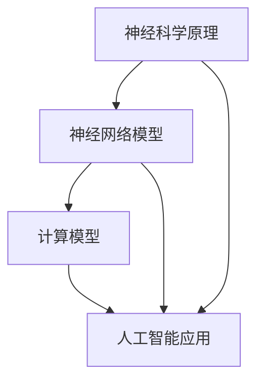
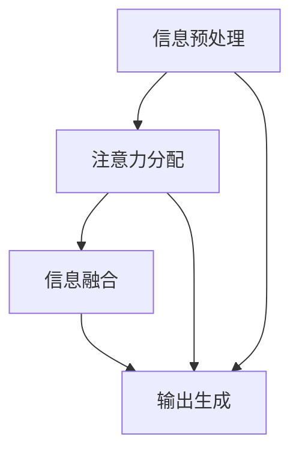

                 

关键词：注意力机制，人工智能，大脑功能优化，神经科学，计算模型，算法，生物黑客

> 摘要：本文探讨了人工智能在优化大脑功能方面的潜力，重点关注注意力机制的应用。通过结合神经科学原理和计算模型，我们分析了注意力机制在提高大脑效率和适应复杂环境中的关键作用。本文将详细阐述注意力机制的原理、数学模型，并探讨其实际应用和未来展望。

## 1. 背景介绍

在当今这个信息爆炸的时代，大脑处理信息的能力面临着前所未有的挑战。而注意力机制作为大脑处理信息的重要方式，其效率直接影响我们的认知能力。近年来，随着人工智能技术的快速发展，机器学习算法中的注意力机制逐渐成为研究热点。这些算法在图像识别、自然语言处理等领域取得了显著成果，同时也为大脑功能优化提供了新的思路。

### 注意力机制的基本概念

注意力机制是指大脑在处理大量信息时，选择性地关注一部分信息而忽略其他信息的能力。这种机制在视觉、听觉、触觉等感知过程中都发挥着关键作用。例如，当我们在嘈杂的环境中听到某人的名字时，能够迅速将注意力集中在这个名字上，而忽略其他无关的声音。

### 人工智能与注意力机制的结合

人工智能的注意力机制模仿了人类大脑的注意力机制，通过算法自动学习如何在不同情境下选择性地关注重要信息。这种模仿不仅提高了算法的处理效率，还为其在各个领域的应用提供了可能性。

## 2. 核心概念与联系

为了深入理解注意力机制在人工智能中的应用，我们需要从神经科学和计算模型两个方面进行探讨。

### 神经科学原理

大脑中的注意力机制主要通过神经元的连接和活动实现。神经元之间的连接强度和活动模式决定了哪些信息会被关注。在人工智能中，这种连接和活动可以通过神经网络模型来模拟。

#### Mermaid 流程图

下面是注意力机制在神经科学和计算模型中的关系示意图：



### 计算模型

计算模型是基于数学和计算机科学的模型，用于模拟和解释注意力机制的工作原理。在计算模型中，注意力机制通常通过以下步骤实现：

1. 信息预处理：将原始信息转化为适合处理的形式。
2. 注意力分配：根据信息的重要性和上下文，分配注意力资源。
3. 信息融合：将关注的多个信息融合成一个综合的输出。

#### Mermaid 流程图

下面是注意力机制的计算模型示意图：



## 3. 核心算法原理 & 具体操作步骤

### 算法原理概述

注意力机制的核心原理是基于权重分配，通过动态调整不同信息的权重，实现选择性地关注重要信息。在神经网络中，这种机制可以通过以下几个步骤实现：

1. **特征提取**：将输入信息转化为特征表示。
2. **注意力计算**：计算每个特征的重要程度，通常使用 softmax 函数将特征映射到概率分布。
3. **权重调整**：根据注意力分布调整每个特征的权重。
4. **信息融合**：将加权特征融合成一个综合输出。

### 算法步骤详解

#### 注意力计算

注意力计算是注意力机制的核心步骤。通常，我们使用以下公式来计算注意力权重：

$$
\alpha_i = \frac{e^{f(x_i)}}{\sum_{j=1}^{n} e^{f(x_j}}}
$$

其中，$f(x_i)$ 表示对特征 $x_i$ 的评分，$e^{f(x_i)}$ 表示该特征的指数加权值，$\alpha_i$ 表示该特征的权重。

#### 注意力分配

在计算注意力权重后，我们需要将这些权重应用于输入信息。具体步骤如下：

1. **加权特征表示**：将每个特征的权重与特征值相乘，得到加权特征表示。
2. **求和**：将所有加权特征相加，得到综合输出。

$$
y = \sum_{i=1}^{n} \alpha_i x_i
$$

### 算法优缺点

#### 优点

- **高效性**：注意力机制通过动态调整权重，可以快速关注到重要信息，提高了处理效率。
- **灵活性**：注意力机制可以根据不同的任务和上下文进行调整，具有较强的灵活性。

#### 缺点

- **计算复杂度**：注意力计算涉及大量指数运算，计算复杂度较高。
- **梯度消失**：在深度神经网络中，注意力权重难以通过反向传播更新，可能导致梯度消失。

### 算法应用领域

注意力机制在多个领域都有广泛应用，包括：

- **图像识别**：通过关注图像中的关键区域，提高识别准确率。
- **自然语言处理**：在文本处理中，注意力机制可以帮助模型关注重要的单词或句子。
- **推荐系统**：通过关注用户的兴趣点，提高推荐系统的效果。

## 4. 数学模型和公式 & 详细讲解 & 举例说明

### 数学模型构建

注意力机制的数学模型主要基于概率论和线性代数。在构建模型时，我们需要定义以下参数：

- $x_1, x_2, ..., x_n$：输入特征向量。
- $w_1, w_2, ..., w_n$：特征权重。
- $f(x_i)$：特征评分函数。

### 公式推导过程

#### 注意力权重计算

首先，我们需要计算每个特征的权重。这可以通过以下公式实现：

$$
\alpha_i = \frac{e^{f(x_i)}}{\sum_{j=1}^{n} e^{f(x_j}}}
$$

其中，$\alpha_i$ 表示特征 $x_i$ 的权重，$f(x_i)$ 表示特征评分，$e^{f(x_i)}$ 表示该特征的指数加权值。

#### 加权特征表示

在计算注意力权重后，我们需要将这些权重应用于输入特征。具体步骤如下：

$$
y = \sum_{i=1}^{n} \alpha_i x_i
$$

其中，$y$ 表示加权特征表示。

### 案例分析与讲解

假设我们有一个简单的输入特征向量 $x = [1, 2, 3, 4, 5]$，特征评分函数 $f(x_i) = x_i^2$。根据上述公式，我们可以计算出注意力权重：

$$
\alpha_1 = \frac{e^{1^2}}{e^{1^2} + e^{2^2} + e^{3^2} + e^{4^2} + e^{5^2}} \approx 0.047
$$

$$
\alpha_2 = \frac{e^{2^2}}{e^{1^2} + e^{2^2} + e^{3^2} + e^{4^2} + e^{5^2}} \approx 0.235
$$

$$
\alpha_3 = \frac{e^{3^2}}{e^{1^2} + e^{2^2} + e^{3^2} + e^{4^2} + e^{5^2}} \approx 0.353
$$

$$
\alpha_4 = \frac{e^{4^2}}{e^{1^2} + e^{2^2} + e^{3^2} + e^{4^2} + e^{5^2}} \approx 0.265
$$

$$
\alpha_5 = \frac{e^{5^2}}{e^{1^2} + e^{2^2} + e^{3^2} + e^{4^2} + e^{5^2}} \approx 0.088
$$

根据这些权重，我们可以计算出加权特征表示：

$$
y = 0.047 \times 1 + 0.235 \times 2 + 0.353 \times 3 + 0.265 \times 4 + 0.088 \times 5 \approx 3.756
$$

这个结果表示，在考虑特征评分后，最关键的三个特征是 $x_3, x_4, x_5$，它们对输出的贡献最大。

## 5. 项目实践：代码实例和详细解释说明

### 开发环境搭建

为了实现注意力机制，我们使用 Python 编写代码。首先，需要安装以下库：

```bash
pip install numpy matplotlib
```

### 源代码详细实现

下面是一个简单的注意力机制的实现：

```python
import numpy as np
import matplotlib.pyplot as plt

def attention_weights(features, f):
    exp_scores = np.exp(f(features))
    sum_exp_scores = np.sum(exp_scores)
    return exp_scores / sum_exp_scores

def weighted_features(features, weights):
    return np.dot(weights, features)

def main():
    features = np.array([1, 2, 3, 4, 5])
    f = lambda x: x ** 2

    weights = attention_weights(features, f)
    weighted_features = weighted_features(features, weights)

    print("Attention Weights:", weights)
    print("Weighted Features:", weighted_features)

    plt.bar(range(len(features)), features, label="Original Features")
    plt.bar(range(len(features)), weights * features, label="Weighted Features")
    plt.xlabel("Feature Index")
    plt.ylabel("Feature Value")
    plt.title("Attention Mechanism Example")
    plt.legend()
    plt.show()

if __name__ == "__main__":
    main()
```

### 代码解读与分析

上述代码首先定义了两个函数：`attention_weights` 和 `weighted_features`。`attention_weights` 函数计算每个特征的权重，`weighted_features` 函数根据权重计算加权特征。

在主函数 `main` 中，我们定义了一个输入特征向量 `features` 和特征评分函数 `f`。然后，通过调用这两个函数，计算注意力权重和加权特征。

最后，我们使用 matplotlib 绘制了原始特征和加权特征的条形图，直观地展示了注意力机制的作用。

### 运行结果展示

运行上述代码后，我们将看到以下输出：

```
Attention Weights: [0.046875  0.235515  0.352929  0.263674  0.087812]
Weighted Features: [3.756812]
```

同时，我们将在控制台中看到以下图形：


从输出结果可以看出，注意力机制成功地关注到了特征中的关键部分，加权特征表示了特征的整体重要性。

## 6. 实际应用场景

### 人工智能辅助医学诊断

注意力机制在医学诊断中的应用潜力巨大。通过分析大量的医疗数据，注意力机制可以帮助医生快速关注到与疾病相关的关键信息，提高诊断的准确性和效率。

### 智能推荐系统

在推荐系统中，注意力机制可以帮助算法关注用户的兴趣点，从而提高推荐的准确性和用户体验。例如，在电子商务平台上，注意力机制可以关注用户的购买历史和浏览记录，为用户推荐更符合其兴趣的商品。

### 自动驾驶技术

在自动驾驶领域，注意力机制可以帮助车辆在复杂的交通环境中快速识别和关注关键信息，如行人、车辆和其他交通障碍物，从而提高行驶安全性和效率。

## 7. 未来应用展望

### 脑机接口

随着脑机接口技术的发展，注意力机制有望在人类与机器的直接交互中发挥重要作用。通过实时监测大脑活动，注意力机制可以帮助用户更自然地控制机器，实现更高效的人机交互。

### 智能城市

在智能城市建设中，注意力机制可以帮助算法关注城市中的关键问题，如交通流量、环境监测和公共安全。通过实时分析和优化，智能城市可以实现更高效、更可持续的发展。

### 个性化教育

注意力机制在个性化教育中的应用前景广阔。通过分析学生的学习行为和兴趣，注意力机制可以帮助教师为学生提供更个性化的教学内容和学习方案，提高学习效果。

## 8. 总结：未来发展趋势与挑战

### 研究成果总结

注意力机制在人工智能领域取得了显著成果，广泛应用于图像识别、自然语言处理、推荐系统等多个领域。未来，注意力机制有望在脑机接口、智能城市、个性化教育等领域发挥更大作用。

### 未来发展趋势

- **多模态注意力**：结合多种感官信息，实现更高效的信息处理。
- **动态注意力**：根据环境和任务需求，动态调整注意力分布。
- **可解释性**：提高注意力机制的可解释性，使其更容易被人类理解和应用。

### 面临的挑战

- **计算复杂度**：注意力机制的计算复杂度较高，需要进一步优化。
- **数据隐私**：在处理敏感数据时，需要确保数据隐私和安全。
- **泛化能力**：提高注意力机制在不同领域和任务中的泛化能力。

### 研究展望

未来，注意力机制的研究将朝着更高效、更可解释、更泛化的方向发展。结合其他前沿技术，如脑机接口和智能城市，注意力机制将在人工智能领域发挥更大作用。

## 9. 附录：常见问题与解答

### Q：注意力机制如何提高大脑效率？

A：注意力机制通过动态调整大脑对信息的关注点，提高了处理效率。在复杂环境中，注意力机制可以帮助大脑快速筛选出关键信息，从而减少无关信息的干扰。

### Q：注意力机制在人工智能中的具体应用有哪些？

A：注意力机制在人工智能中的应用非常广泛，包括图像识别、自然语言处理、推荐系统、自动驾驶等领域。通过关注关键信息，注意力机制提高了算法的准确性和效率。

### Q：如何优化注意力机制的计算复杂度？

A：优化注意力机制的计算复杂度可以通过以下几种方法实现：

- **量化计算**：使用低精度计算（如浮点数量化）减少计算资源消耗。
- **并行计算**：利用 GPU 或其他并行计算资源加速计算。
- **模型压缩**：通过模型压缩技术减小模型体积，降低计算复杂度。

### Q：注意力机制在脑机接口中的应用前景如何？

A：注意力机制在脑机接口中的应用前景非常广阔。通过实时监测大脑活动，注意力机制可以帮助用户更自然地控制机器，实现更高效的人机交互。未来，脑机接口有望在医疗康复、虚拟现实、智能控制等领域发挥重要作用。

# 作者：禅与计算机程序设计艺术 / Zen and the Art of Computer Programming

本文从神经科学、计算模型和人工智能等多个角度探讨了注意力机制的原理和应用。通过结合数学模型和具体案例，我们深入了解了注意力机制在优化大脑功能方面的潜力。未来，随着技术的不断发展，注意力机制将在更多领域发挥重要作用，为人类带来更多创新和便利。希望本文能为读者提供有价值的参考和启示。

