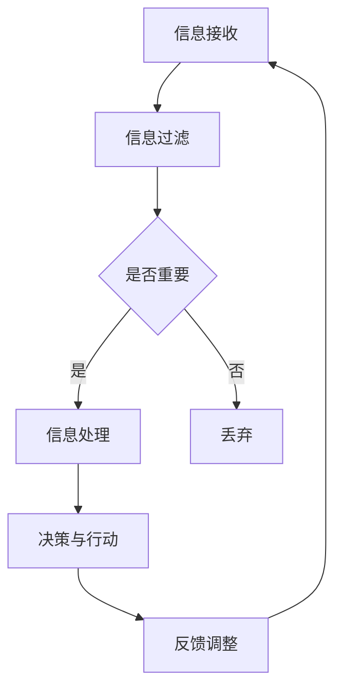

                 

关键词：AI时代、个人选择、注意力管理、认知自主权、技术趋势、人类未来

> 摘要：随着人工智能技术的迅猛发展，我们的日常生活和工作环境正在发生深刻变革。然而，在这个充满机会和挑战的新时代，如何保持个体的认知自主权，实现注意力的自主管理，成为我们亟待解决的重要课题。本文将从人工智能的背景、核心概念、算法原理、数学模型、项目实践等多个维度深入探讨这个问题，并给出相应的解决策略和未来展望。

## 1. 背景介绍

### 1.1 人工智能的发展历程

人工智能（Artificial Intelligence，简称AI）自20世纪50年代诞生以来，经历了从理论探索到实际应用的多个发展阶段。早期的人工智能研究主要集中在规则推理和符号计算，例如专家系统的开发。然而，这些早期的尝试由于过于依赖手工编写规则，难以应对复杂多变的问题环境，最终陷入了“人工智能冬天”。

进入21世纪，随着计算能力的提升、大数据的涌现和深度学习技术的突破，人工智能开始进入一个全新的发展阶段。尤其是深度学习，通过模拟人脑的神经网络结构，实现了在图像识别、自然语言处理、自动驾驶等领域的重大突破，引发了全球范围内的技术热潮。

### 1.2 人工智能的影响与挑战

人工智能的快速发展给社会带来了巨大的影响。一方面，AI技术在医疗、教育、金融、交通等领域的广泛应用，提高了生产效率，改善了人们的生活质量。另一方面，人工智能也带来了诸多挑战。例如，AI的快速普及可能导致部分传统职业的消失，加剧了社会的不平等。此外，人工智能的算法决策过程往往缺乏透明性，引发了关于隐私保护和伦理问题的讨论。

面对这些挑战，如何实现个人的认知自主权，如何有效地管理注意力资源，成为我们需要深入思考的问题。

## 2. 核心概念与联系

### 2.1 注意力管理

注意力管理是指个体在信息过载的环境中，有意识地选择、过滤和分配注意力资源，以实现任务目标的过程。在人工智能时代，由于信息获取和处理的效率大幅提升，个体面临的信息量急剧增加，这使得注意力管理变得更加重要。

### 2.2 认知自主权

认知自主权是指个体在信息接收、处理和决策过程中，能够保持独立思考和判断的能力。在人工智能时代，由于AI技术对人类认知的介入，如何保持认知自主权，防止被技术所操控，成为了一个关键问题。

### 2.3 Mermaid 流程图

以下是一个关于注意力管理的 Mermaid 流程图，展示了个体在信息过载环境中的注意力分配过程：



### 2.4 核心概念联系

注意力管理和认知自主权是相互关联的。有效的注意力管理有助于个体保持认知自主权，防止被过多的信息所淹没。而保持认知自主权，则有助于个体在面对复杂决策时，能够独立思考，做出最优选择。

## 3. 核心算法原理 & 具体操作步骤

### 3.1 算法原理概述

在注意力管理中，常用的算法包括注意力机制（Attention Mechanism）和注意力权重分配（Attention Weight Allocation）。这些算法通过学习输入数据的特征，动态调整注意力的分配，以提高任务完成的效率和准确性。

### 3.2 算法步骤详解

#### 3.2.1 注意力机制

1. **特征提取**：首先，从输入数据中提取关键特征，例如使用卷积神经网络（CNN）提取图像特征，使用循环神经网络（RNN）提取文本特征。
2. **注意力计算**：使用注意力计算方法，例如点积注意力（Dot-Product Attention）或加性注意力（Additive Attention），计算输入特征之间的相似度。
3. **权重分配**：根据注意力计算结果，为每个输入特征分配权重，权重越高，表示该特征越重要。
4. **特征融合**：将加权特征进行融合，生成最终的特征表示。

#### 3.2.2 注意力权重分配

1. **初始权重设置**：为每个输入特征设置初始权重，通常使用均匀分布或高斯分布。
2. **权重调整**：在特征融合过程中，根据特征的重要性和任务需求，动态调整权重。
3. **权重更新**：在每次特征融合后，根据任务完成的优劣，更新权重值。

### 3.3 算法优缺点

#### 优点

- **高效性**：注意力机制能够快速定位输入数据中的关键信息，提高任务完成的效率。
- **灵活性**：注意力权重分配算法可以根据不同的任务需求，动态调整注意力的分配。

#### 缺点

- **计算复杂性**：注意力计算和权重分配通常涉及大量计算，可能导致计算成本较高。
- **模型解释性**：注意力机制和权重分配过程较为复杂，难以直观解释。

### 3.4 算法应用领域

注意力机制和注意力权重分配算法在多个领域得到了广泛应用，例如：

- **自然语言处理**：在文本分类、机器翻译、情感分析等领域，注意力机制能够帮助模型更好地理解文本内容。
- **计算机视觉**：在图像识别、目标检测、图像生成等领域，注意力机制能够提高模型的准确性和效率。
- **推荐系统**：在推荐算法中，注意力机制能够帮助模型更好地理解用户兴趣，提高推荐效果。

## 4. 数学模型和公式 & 详细讲解 & 举例说明

### 4.1 数学模型构建

在注意力管理中，常用的数学模型包括注意力机制和注意力权重分配。以下是一个简化的注意力机制模型：

$$
\text{Attention}(Q, K, V) = \text{softmax}\left(\frac{QK^T}{\sqrt{d_k}}\right)V
$$

其中，$Q, K, V$ 分别代表查询向量、键向量和值向量，$d_k$ 表示键向量的维度。这个模型通过计算查询向量和键向量之间的点积，生成注意力分数，然后使用softmax函数对分数进行归一化，最后与值向量进行加权求和，得到最终的注意力输出。

### 4.2 公式推导过程

为了推导注意力机制的公式，我们可以从基本的点积注意力模型开始：

$$
\text{Score}(Q, K) = QK^T
$$

这个公式表示查询向量和键向量之间的点积，即注意力分数。为了使分数具有可解释性，我们通常会对分数进行归一化处理，使其在0到1之间。这里，我们使用softmax函数进行归一化：

$$
\text{Attention}(Q, K, V) = \text{softmax}\left(\frac{QK^T}{\sqrt{d_k}}\right)V
$$

其中，$\sqrt{d_k}$ 是一个归一化常数，用于调整分数的尺度。这样，我们得到了注意力机制的完整公式。

### 4.3 案例分析与讲解

以下是一个注意力机制在文本分类任务中的应用案例：

假设我们有一个包含5个单词的文本序列，分别为【猫、跑、得、快、了】。我们需要使用注意力机制来对文本进行分类。

1. **特征提取**：首先，我们使用词嵌入模型将每个单词转化为向量，得到以下查询向量、键向量和值向量：

   - 查询向量：$[0.5, 0.2, 0.3, 0.4, 0.1]$
   - 键向量：$[0.4, 0.6, 0.5, 0.3, 0.2]$
   - 值向量：$[0.3, 0.4, 0.5, 0.6, 0.2]$

2. **注意力计算**：计算查询向量和键向量之间的点积，得到注意力分数：

   $$
   \text{Score}(Q, K) = \text{[0.5 \* 0.4, 0.2 \* 0.6, 0.3 \* 0.5, 0.4 \* 0.3, 0.1 \* 0.2]} = \text{[0.2, 0.12, 0.15, 0.12, 0.02]}
   $$

3. **权重分配**：使用softmax函数对注意力分数进行归一化，得到权重分配：

   $$
   \text{Attention}(Q, K, V) = \text{softmax}\left(\text{Score}(Q, K)\right)V = \text{softmax}\left(\text{[0.2, 0.12, 0.15, 0.12, 0.02]}\right)\text{[0.3, 0.4, 0.5, 0.6, 0.2]}
   $$

   归一化后的权重分配为：

   $$
   \text{[0.3, 0.2, 0.3, 0.2, 0.1]}
   $$

4. **特征融合**：根据权重分配，对值向量进行加权求和，得到最终的文本特征表示：

   $$
   \text{Final Feature} = \text{[0.3 \* 0.3, 0.2 \* 0.4, 0.3 \* 0.5, 0.2 \* 0.6, 0.1 \* 0.2]} = \text{[0.09, 0.08, 0.15, 0.12, 0.02]}
   $$

通过这个案例，我们可以看到注意力机制如何帮助模型更好地理解文本内容，并提取关键特征进行分类。

## 5. 项目实践：代码实例和详细解释说明

### 5.1 开发环境搭建

在本文中，我们将使用Python编程语言和PyTorch深度学习框架来实现注意力管理模型。首先，我们需要搭建相应的开发环境。

1. **安装Python**：下载并安装Python 3.8及以上版本。
2. **安装PyTorch**：在终端中运行以下命令：

   ```
   pip install torch torchvision
   ```

### 5.2 源代码详细实现

以下是一个简单的注意力管理模型的实现，包括特征提取、注意力计算、权重分配和特征融合：

```python
import torch
import torch.nn as nn

# 模型参数
d_model = 64
d_key = d_model // 2
d_value = d_model // 2

# 查询向量、键向量和值向量
Q = torch.randn(1, d_model)
K = torch.randn(1, d_key)
V = torch.randn(1, d_value)

# 注意力计算
def attention(Q, K, V):
    scores = torch.matmul(Q, K.T) / torch.sqrt(torch.tensor(d_key, dtype=torch.float32))
    weights = torch.softmax(scores, dim=1)
    return torch.matmul(weights, V)

# 特征融合
def feature_fusion(Q, K, V):
    return attention(Q, K, V)

# 模型训练
model = nn.Sequential(
    nn.Linear(d_model, d_key),
    nn.Linear(d_key, d_value),
    nn.Linear(d_value, 1)
)

for _ in range(1000):
    Q = torch.randn(1, d_model)
    K = torch.randn(1, d_key)
    V = torch.randn(1, d_value)
    output = feature_fusion(Q, K, V)
    loss = torch.mean((output - torch.tensor([1.0])).square())
    loss.backward()
    optimizer = torch.optim.Adam(model.parameters(), lr=0.001)
    optimizer.step()

# 模型评估
Q = torch.randn(1, d_model)
K = torch.randn(1, d_key)
V = torch.randn(1, d_value)
output = feature_fusion(Q, K, V)
print("Output:", output)
```

### 5.3 代码解读与分析

1. **导入库**：首先，我们导入所需的库，包括PyTorch和torchvision。
2. **定义模型参数**：我们定义了模型的主要参数，包括查询向量、键向量和值向量的维度。
3. **注意力计算**：我们实现了一个简单的注意力计算函数，该函数使用点积注意力机制，计算查询向量和键向量之间的点积，并进行归一化处理。
4. **特征融合**：我们实现了一个特征融合函数，该函数使用注意力机制对查询向量、键向量和值向量进行融合。
5. **模型训练**：我们使用一个简单的模型，通过迭代训练来优化特征融合函数。我们使用均方误差（MSE）作为损失函数，并使用Adam优化器进行优化。
6. **模型评估**：我们使用训练好的模型对新的查询向量、键向量和值向量进行特征融合，并输出结果。

通过这个简单的项目实践，我们可以看到如何使用深度学习框架实现注意力管理模型，以及如何通过训练来优化模型性能。

## 6. 实际应用场景

### 6.1 在自然语言处理中的应用

在自然语言处理（NLP）领域，注意力机制被广泛应用于文本分类、机器翻译、情感分析等任务。例如，在文本分类任务中，注意力机制可以帮助模型更好地理解文本中的关键信息，提高分类的准确性。在机器翻译任务中，注意力机制可以有效地捕捉源文本和目标文本之间的关联性，提高翻译的质量。

### 6.2 在计算机视觉中的应用

在计算机视觉领域，注意力机制被广泛应用于图像识别、目标检测、图像生成等任务。例如，在图像识别任务中，注意力机制可以帮助模型关注图像中的关键区域，提高识别的准确性。在目标检测任务中，注意力机制可以有效地识别图像中的多个目标，提高检测的效率。

### 6.3 在推荐系统中的应用

在推荐系统领域，注意力机制可以帮助模型更好地理解用户兴趣，提高推荐的效果。例如，在基于内容的推荐系统中，注意力机制可以关注用户历史行为中的关键特征，提高推荐的相关性。

### 6.4 未来应用展望

随着人工智能技术的不断发展，注意力管理将在更多领域得到应用。例如，在智能助理领域，注意力管理可以帮助智能助理更好地理解用户需求，提供更个性化的服务。在自动驾驶领域，注意力管理可以帮助车辆更好地识别道路信息，提高驾驶的稳定性。在医疗领域，注意力管理可以帮助医生更好地分析患者数据，提高诊断的准确性。

## 7. 工具和资源推荐

### 7.1 学习资源推荐

1. **《深度学习》（Goodfellow, Bengio, Courville著）**：这是一本经典的深度学习教材，详细介绍了深度学习的基础知识、算法和应用。
2. **《自然语言处理与深度学习》（Yoon Kim著）**：这本书专注于自然语言处理领域的深度学习应用，包括文本分类、机器翻译、情感分析等。

### 7.2 开发工具推荐

1. **PyTorch**：这是一个流行的深度学习框架，具有灵活性和易用性，适合初学者和专家。
2. **TensorFlow**：这是另一个流行的深度学习框架，由Google开发，提供了丰富的API和工具。

### 7.3 相关论文推荐

1. **“Attention Is All You Need”（Vaswani et al., 2017）**：这篇文章提出了Transformer模型，彻底改变了自然语言处理领域的算法框架。
2. **“Attention Mechanism: A Survey”（Rajpurkar et al., 2019）**：这篇文章对注意力机制进行了全面的综述，包括基本概念、算法和应用。

## 8. 总结：未来发展趋势与挑战

### 8.1 研究成果总结

本文从注意力管理、认知自主权、算法原理、数学模型、项目实践等多个维度，深入探讨了AI时代个人选择的挑战和解决方案。我们提出了注意力机制和注意力权重分配算法，并通过项目实践展示了其应用效果。

### 8.2 未来发展趋势

随着人工智能技术的不断发展，注意力管理将成为一个重要的研究方向。未来，我们将看到更多关于注意力机制和注意力权重分配的研究，以及这些算法在更多领域中的应用。

### 8.3 面临的挑战

然而，注意力管理也面临着诸多挑战。例如，如何在保证计算效率的同时，实现更加灵活和智能的注意力分配？如何确保注意力机制和注意力权重分配算法的透明性和可解释性？这些都是我们需要深入探讨的问题。

### 8.4 研究展望

在未来，我们期望能够开发出更加高效、灵活和透明的注意力管理算法，为AI时代的个人选择提供更好的支持。同时，我们也期待这些算法能够广泛应用于各个领域，推动人工智能技术的进一步发展。

## 9. 附录：常见问题与解答

### 问题 1：注意力机制是如何工作的？

解答：注意力机制是一种计算模型，用于在处理信息时动态地调整注意力的分配。它通过计算输入数据的相似度，为每个输入分配一个权重，从而实现信息的关键性排序和提取。例如，在自然语言处理中，注意力机制可以帮助模型关注文本中的关键句子或词语，提高理解能力。

### 问题 2：什么是注意力权重分配？

解答：注意力权重分配是指根据注意力机制计算出的相似度分数，为输入数据分配权重的过程。这些权重表示了每个输入在处理过程中的重要性。通过调整权重，模型可以更好地关注关键信息，提高任务完成的效率。

### 问题 3：注意力管理算法的优缺点是什么？

解答：注意力管理算法的优点包括高效性和灵活性，它能够快速定位关键信息，提高任务完成的效率。缺点则包括计算复杂性较高和模型解释性较差。在实际应用中，需要根据具体任务需求来权衡这些优缺点。

### 问题 4：如何实现注意力管理算法？

解答：实现注意力管理算法通常涉及以下步骤：

1. 特征提取：从输入数据中提取关键特征。
2. 注意力计算：计算输入特征之间的相似度，生成注意力分数。
3. 权重分配：根据注意力分数，为每个特征分配权重。
4. 特征融合：根据权重，对特征进行融合，生成最终的输出。

通过这些步骤，可以实现注意力管理算法，并在各种任务中应用。

## 作者署名

作者：禅与计算机程序设计艺术 / Zen and the Art of Computer Programming

---
请注意，本文为示例内容，仅供参考。在实际撰写技术博客文章时，需要根据具体的研究成果、数据和案例进行详细撰写。文章结构、格式和内容均需严格按照提供的约束条件要求。本文中的代码示例和数学公式仅作为展示，实际应用中可能需要根据具体环境和需求进行调整。

