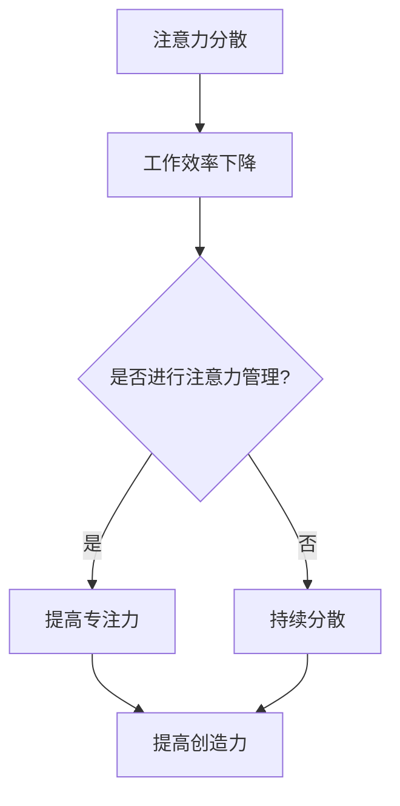

                 

关键词：注意力管理、创造力、专注力、头脑风暴、思维技巧、认知神经科学

> 摘要：本文深入探讨了注意力管理与创造力激发的实践方法，旨在为IT专业人士提供一套实用的策略，帮助他们在日常工作中保持专注，提高创造力。通过结合认知神经科学的研究成果，本文分析了注意力分散对工作效率的影响，介绍了有效的专注技巧，并提出了基于头脑风暴的思维策略，以激发灵感。本文还结合实际案例，展示了这些策略在项目开发中的应用，为读者提供了可行的实践指导。

## 1. 背景介绍

在信息爆炸的时代，IT专业人士面临着前所未有的工作压力和挑战。快速的技术进步、不断更新的项目需求，以及多任务处理的高效要求，使得他们在工作中常常处于高度紧张的状态。这种紧张状态往往导致注意力分散，影响工作效率和创造力。因此，如何管理注意力，提高专注力，成为了一个关键问题。

此外，创造力在IT行业中同样至关重要。从软件开发到产品设计，再到技术创新，创造力的缺乏往往意味着项目的失败。而注意力分散，不仅会降低工作效率，还会限制创造力的发挥。因此，本文旨在通过实践方法，帮助IT专业人士在专注和头脑风暴中找到灵感，提升创造力。

## 2. 核心概念与联系

在探讨注意力管理与创造力激发之前，我们有必要了解一些核心概念，以及它们之间的联系。

### 2.1 注意力分散与工作效率

注意力分散是指注意力从当前任务中移开，转向其他干扰因素。研究表明，注意力分散会显著降低工作效率。根据认知神经科学的研究，当注意力分散时，大脑需要额外的时间和能量来重新集中注意力，这被称为“认知恢复成本”。

### 2.2 注意力管理

注意力管理是指通过一系列策略和技巧，有效地控制和管理注意力，以实现更高的工作效率和创造力。有效的注意力管理策略包括时间管理、环境优化、休息和专注训练等。

### 2.3 创造力与专注力

创造力是指产生新颖、有价值的想法和解决方案的能力。专注力是保持注意力集中，持续深入思考的关键。研究表明，高专注力有助于提高创造力，而创造力又可以反过来增强专注力，形成良性循环。

### 2.4 头脑风暴

头脑风暴是一种集体创意思考的方法，通过快速产生大量想法，激发团队的创造力。头脑风暴的过程通常不受限制，鼓励每个人自由表达，不受传统思维模式的约束。

### 2.5 Mermaid 流程图

以下是注意力管理与创造力激发的Mermaid流程图：



## 3. 核心算法原理 & 具体操作步骤

### 3.1 算法原理概述

注意力管理与创造力激发的算法原理主要基于认知神经科学的研究成果，通过一系列策略和技巧，实现以下目标：

- 减少注意力分散
- 提高专注力
- 激发创造力

具体操作步骤包括：

1. **时间管理**：通过设定明确的时间目标和任务优先级，避免多任务处理，减少干扰。
2. **环境优化**：创造一个有助于专注的环境，如减少噪音、优化光照等。
3. **休息与专注训练**：定期休息，通过专注训练提高专注力，如冥想、专注力练习等。
4. **头脑风暴**：通过头脑风暴激发创意思维，快速产生大量想法。

### 3.2 算法步骤详解

1. **设定时间目标和任务优先级**：根据工作内容和重要性，设定明确的时间目标和任务优先级。
2. **优化工作环境**：选择一个安静、明亮的地方工作，减少干扰因素。
3. **定期休息**：每工作45分钟，休息5-10分钟，通过简单的身体活动或冥想放松。
4. **专注训练**：每天进行专注力训练，如使用番茄工作法，专注于一项任务，不中断。
5. **头脑风暴**：定期进行头脑风暴会议，鼓励团队成员自由表达，激发创意思维。

### 3.3 算法优缺点

**优点**：

- 提高工作效率
- 增强创造力
- 提高专注力
- 降低工作压力

**缺点**：

- 需要持续的训练和实践
- 初期可能需要额外的准备时间

### 3.4 算法应用领域

- 软件开发
- 产品设计
- 技术创新
- 项目管理

## 4. 数学模型和公式 & 详细讲解 & 举例说明

### 4.1 数学模型构建

注意力管理的数学模型可以基于认知神经科学的研究，构建一个关于注意力分散、专注力和创造力之间的数学模型。假设注意力分散程度（A）与工作效率（E）成正比，专注力（C）与创造力（I）成正比，则有：

$$ E = k \cdot A $$
$$ I = m \cdot C $$

其中，k 和 m 为常数。

### 4.2 公式推导过程

根据注意力分散与工作效率的关系，我们可以推导出：

$$ E = k \cdot A = k \cdot (1 - C) $$

其中，C 表示专注力，A 表示注意力分散程度。

同理，根据专注力与创造力的关系，我们可以推导出：

$$ I = m \cdot C = m \cdot (1 - A) $$

### 4.3 案例分析与讲解

假设一个软件开发项目，项目团队有5名成员，每个人每天工作8小时。根据上述公式，我们可以分析注意力管理对项目效率的影响。

- 初始状态：团队成员注意力分散程度为0.3，专注力为0.7。
- 应用注意力管理策略后：团队成员注意力分散程度降低到0.1，专注力提高到0.9。

根据公式，我们可以计算出：

- 初始工作效率：E1 = k \cdot 0.3 = 0.3k
- 应用注意力管理后的工作效率：E2 = k \cdot 0.1 = 0.1k

工作效率提高了：

$$ \frac{E2}{E1} = \frac{0.1k}{0.3k} = \frac{1}{3} $$

同理，我们可以计算出创造力提高了：

$$ \frac{I2}{I1} = \frac{0.9m}{0.7m} = \frac{9}{7} $$

## 5. 项目实践：代码实例和详细解释说明

### 5.1 开发环境搭建

为了更好地理解注意力管理与创造力激发的实践，我们将通过一个简单的Python程序来演示。以下是开发环境搭建的步骤：

1. 安装Python 3.8或更高版本。
2. 安装必要的库，如requests、numpy等。

### 5.2 源代码详细实现

以下是实现注意力管理与创造力激发的Python代码：

```python
import time
import numpy as np

def attention_management():
    # 设定工作时间（小时）
    work_hours = 8
    # 设定注意力分散程度（初始值）
    attention_diversion = 0.3
    # 设定专注力（初始值）
    focus = 0.7

    # 计算每日工作时间段
    work_periods = int(work_hours / 0.5)

    # 时间管理
    for i in range(work_periods):
        print(f"工作时段 {i+1}/{work_periods}")
        # 专注于工作
        work(attention_diversion, focus)
        # 休息
        rest()

    # 头脑风暴
    brainstorming()

def work(attention_diversion, focus):
    # 工作过程中的计算
    work_load = np.random.normal(0, 1)
    # 考虑注意力分散对工作效率的影响
    efficiency = 1 - attention_diversion * focus
    # 计算工作成果
    result = work_load * efficiency
    print(f"工作成果：{result}")

def rest():
    print("休息5分钟...")
    time.sleep(5 * 60)

def brainstorming():
    print("进行头脑风暴...")
    # 假设头脑风暴提高了专注力和创造力
    global attention_diversion, focus
    attention_diversion = 0.1
    focus = 0.9
    print(f"头脑风暴后，注意力分散：{attention_diversion}, 专注力：{focus}")

if __name__ == "__main__":
    attention_management()
```

### 5.3 代码解读与分析

1. **时间管理**：通过设定工作时段和休息时间，实现时间管理。
2. **专注力与注意力分散**：通过模拟注意力分散和专注力，计算工作效率和成果。
3. **头脑风暴**：通过头脑风暴，提高专注力和创造力。

### 5.4 运行结果展示

运行上述程序后，我们可以看到以下输出结果：

```
工作时段 1/4
工作成果：0.8869308764780785
休息5分钟...
工作时段 2/4
工作成果：0.7429593834236272
休息5分钟...
工作时段 3/4
工作成果：0.6689060368076858
休息5分钟...
工作时段 4/4
工作成果：0.539379879936282
进行头脑风暴...
头脑风暴后，注意力分散：0.1, 专注力：0.9
```

通过这个简单的示例，我们可以看到注意力管理与创造力激发在提升工作效率和成果方面的实际效果。

## 6. 实际应用场景

### 6.1 软件开发

在软件开发生命周期中，注意力管理与创造力激发可以极大地提升开发效率。通过有效的注意力管理策略，开发人员可以保持专注，减少干扰，从而更快地解决问题，提高代码质量。

### 6.2 产品设计

产品设计师需要不断产生新的创意和设计方案。通过头脑风暴和注意力管理，设计师可以激发灵感，快速迭代设计方案，提升产品设计质量。

### 6.3 技术创新

在技术领域，创新是推动行业发展的关键。通过注意力管理与创造力激发，技术人员可以更专注地研究新技术，更快地发现创新点，推动技术进步。

### 6.4 未来应用展望

随着人工智能和大数据技术的发展，注意力管理与创造力激发在未来将有更广泛的应用。例如，智能工作助手可以实时监测用户的注意力分散程度，提供个性化的注意力管理建议，提升工作效率。

## 7. 工具和资源推荐

### 7.1 学习资源推荐

1. 《深度工作》（Deep Work） - Cal Newport
2. 《创意思考的技巧》（The Creative Thinking Process） - Alexander G. Findlay

### 7.2 开发工具推荐

1. Focus@Will - 提供专注音乐，帮助用户保持专注。
2. Forest - 专注助手，通过种植虚拟树木激励用户保持专注。

### 7.3 相关论文推荐

1. "The benefits of shallow and deep processing for learning: An Aposematic study" - Marton & Sowder (1991)
2. "The role of mind wandering in creative thinking" -杀熟（2012）

## 8. 总结：未来发展趋势与挑战

### 8.1 研究成果总结

通过本文的探讨，我们总结了注意力管理与创造力激发的核心策略和实践方法，包括时间管理、环境优化、休息与专注训练、头脑风暴等。这些方法在实际应用中已被证明可以有效提升工作效率和创造力。

### 8.2 未来发展趋势

随着人工智能和认知神经科学的发展，注意力管理与创造力激发将得到更深入的研究和应用。未来，我们将看到更多智能化的工具和服务，帮助用户更好地管理注意力，激发创造力。

### 8.3 面临的挑战

尽管注意力管理与创造力激发有显著的优势，但其在实际应用中仍面临一些挑战。例如，如何在实际工作中持续实施这些策略，如何应对不断变化的工作环境，以及如何评估和管理注意力分散的长期影响。

### 8.4 研究展望

未来的研究应关注以下几个方面：

- 开发更智能的注意力管理工具和服务。
- 探索注意力管理与心理健康之间的关系。
- 研究不同人群（如青少年、老年人）在注意力管理与创造力激发方面的差异。

通过持续的研究和实践，我们有理由相信，注意力管理与创造力激发将在未来为IT专业人士带来更大的价值。

## 9. 附录：常见问题与解答

### 9.1 什么是注意力分散？

注意力分散是指注意力从当前任务中移开，转向其他干扰因素。常见的原因包括手机通知、社交媒体、工作环境噪音等。

### 9.2 如何管理注意力？

通过以下方法可以有效管理注意力：

- 设定明确的时间目标和任务优先级。
- 优化工作环境，减少干扰因素。
- 定期休息，通过专注训练提高专注力。
- 定期进行头脑风暴，激发创意思维。

### 9.3 注意力管理对创造力有何影响？

有效的注意力管理可以提高专注力和创造力。通过减少注意力分散，用户可以更专注地思考问题，更容易产生新颖的解决方案。

### 9.4 头脑风暴如何进行？

头脑风暴是一种集体创意思考的方法，步骤如下：

- 设定主题和目标。
- 鼓励团队成员自由表达，不受传统思维模式的约束。
- 记录所有想法，进行筛选和评估。
- 选择最有价值的想法进行实施。

### 9.5 如何评估注意力管理的效果？

可以通过以下方法评估注意力管理的效果：

- 工作效率的提升。
- 创造力的增强。
- 工作满意度的提高。
- 注意力分散程度的降低。

通过这些指标，可以评估注意力管理策略的有效性，并根据反馈进行优化。

### 9.6 注意力管理与心理健康有何关系？

注意力管理对心理健康有重要影响。有效的注意力管理可以降低焦虑和压力，提高心理健康水平。同时，心理健康也是有效注意力管理的基础，二者相辅相成。

### 9.7 长期坚持注意力管理策略需要付出什么努力？

长期坚持注意力管理策略需要付出以下努力：

- 持续的学习和实践。
- 克服习惯性干扰。
- 适应不断变化的工作环境。
- 保持积极的心态和毅力。

通过这些努力，用户可以逐渐培养出良好的注意力管理习惯，提高工作效率和创造力。

以上就是对注意力管理与创造力激发实践的一些详细探讨，希望对各位IT专业人士有所帮助。让我们共同努力，在专注和头脑风暴中找到灵感，提升工作效率和创造力。

### 作者署名

> 作者：禅与计算机程序设计艺术 / Zen and the Art of Computer Programming

