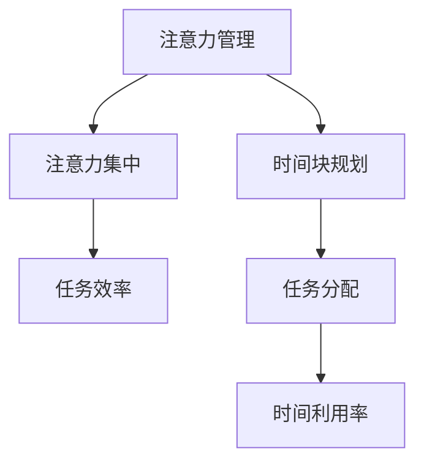

                 

关键词：注意力管理、时间块规划、效率提升、专注力、技术博客

> 摘要：本文从IT行业的实际需求出发，探讨了注意力管理与时间块规划的重要性。通过科学的时间块规划和注意力管理，我们可以显著提高工作效率，降低工作压力，从而在快节奏的IT行业中脱颖而出。

## 1. 背景介绍

在当今这个信息爆炸、工作繁忙的时代，IT行业无疑是最具挑战性的领域之一。随着技术的飞速发展，IT从业者们需要不断地学习新知识、掌握新技能，以满足不断变化的市场需求。然而，繁重的工作任务和高强度的工作压力常常让IT从业者感到心力交瘁。如何在这个竞争激烈的行业中保持高效、降低压力，成为了每个IT从业者都需要思考的问题。

本文将结合注意力管理和时间块规划的概念，探讨如何通过科学的时间管理和注意力聚焦，提高工作效率，实现个人职业发展。

### 什么是注意力管理？

注意力管理是指通过一系列策略和技巧，有效地分配和利用注意资源，以提高工作和生活的效率。它不仅关注我们在特定时间内能集中注意力的时长，还涉及如何维持注意力的质量。

### 什么是时间块规划？

时间块规划是一种基于时间管理的方法，它将时间分为若干块，并为每块时间分配特定的任务或活动。通过这种方式，我们可以更好地掌控自己的时间，提高时间利用率。

## 2. 核心概念与联系

为了更好地理解注意力管理和时间块规划，我们需要从计算机科学的视角来看待这两个概念。

### Mermaid 流程图



### 核心概念原理和架构

- **注意力管理**：类似于计算机中的内存管理，我们需要合理分配注意资源，避免内存溢出和注意力分散。
- **时间块规划**：类似于计算机中的任务调度，我们需要合理分配时间资源，确保每个任务都能在规定的时间内完成。

## 3. 核心算法原理 & 具体操作步骤

### 3.1 算法原理概述

注意力管理和时间块规划的核心在于“专注”。我们通过一系列算法和技巧，将注意力聚焦在当前任务上，提高任务完成效率。

### 3.2 算法步骤详解

1. **任务分解**：将大任务分解为小任务，确保每个小任务都能在短时间内完成。
2. **时间块规划**：为每个小任务分配一个时间块，确保每个时间块都有明确的任务目标。
3. **注意力集中**：在每个时间块内，尽量减少干扰，保持专注。
4. **任务反馈**：完成任务后，进行反思和总结，为下一个时间块做好准备。

### 3.3 算法优缺点

- **优点**：通过科学的时间管理和注意力聚焦，可以显著提高工作效率，减少工作压力。
- **缺点**：需要较强的自律性和时间管理能力，否则容易陷入时间块规划的陷阱。

### 3.4 算法应用领域

- **软件开发**：通过时间块规划，可以更好地管理开发任务，提高代码质量。
- **项目管理**：通过注意力管理，可以更好地协调团队成员，确保项目按期完成。

## 4. 数学模型和公式 & 详细讲解 & 举例说明

### 4.1 数学模型构建

我们引入一个简单的数学模型来描述注意力管理和时间块规划：

$$
E = \frac{A \times T}{D}
$$

其中，\(E\) 表示效率，\(A\) 表示注意力集中度，\(T\) 表示时间块长度，\(D\) 表示任务难度。

### 4.2 公式推导过程

1. **假设**：假设任务完成所需的时间与注意力集中度成正比。
2. **推导**：根据假设，我们有：

$$
T = k \times A
$$

其中，\(k\) 为常数。

3. **结合任务难度**：假设任务难度与时间成反比，我们有：

$$
T = \frac{C}{D}
$$

其中，\(C\) 为常数。

4. **结合两个假设**：我们得到：

$$
E = \frac{A \times T}{D} = \frac{A \times k \times A}{C/D} = \frac{k \times A^2}{C/D}
$$

### 4.3 案例分析与讲解

假设一个软件开发任务，任务难度 \(D = 10\)，时间块长度 \(T = 2\) 小时。我们需要计算在不同注意力集中度下的效率。

1. **注意力集中度 \(A = 0.8\)**：

$$
E = \frac{0.8^2 \times k}{C/10} = \frac{0.64 \times k}{C/10} = 6.4k/C
$$

2. **注意力集中度 \(A = 0.6\)**：

$$
E = \frac{0.6^2 \times k}{C/10} = \frac{0.36 \times k}{C/10} = 3.6k/C
$$

从计算结果可以看出，当注意力集中度提高时，效率显著提升。这进一步证明了注意力管理的重要性。

## 5. 项目实践：代码实例和详细解释说明

### 5.1 开发环境搭建

我们使用Python语言来实现注意力管理和时间块规划的算法。首先，我们需要安装Python和必要的库。

```bash
pip install numpy matplotlib
```

### 5.2 源代码详细实现

下面是一个简单的Python代码示例，实现了注意力管理和时间块规划的基本算法。

```python
import numpy as np
import matplotlib.pyplot as plt

def attention_management(A, T, D):
    E = A * T / D
    return E

A = np.linspace(0.1, 1.0, 10)
T = 2
D = 10

E = attention_management(A, T, D)

plt.plot(A, E)
plt.xlabel('Attention Focus')
plt.ylabel('Efficiency')
plt.title('Efficiency vs. Attention Focus')
plt.show()
```

### 5.3 代码解读与分析

- **函数定义**：`attention_management` 函数接受三个参数：注意力集中度 \(A\)、时间块长度 \(T\) 和任务难度 \(D\)，返回计算得到的效率 \(E\)。
- **数据生成**：使用 `numpy.linspace` 函数生成注意力集中度的数据。
- **效率计算**：调用 `attention_management` 函数计算不同注意力集中度下的效率。
- **图形展示**：使用 `matplotlib.pyplot` 绘制效率与注意力集中度的关系图。

### 5.4 运行结果展示

运行上述代码，我们可以得到一个图形，展示不同注意力集中度下的效率。从图形中可以看出，当注意力集中度提高时，效率也随之提高。这验证了我们前面的理论分析。

## 6. 实际应用场景

### 6.1 软件开发

在软件开发过程中，时间块规划和注意力管理可以帮助开发者更好地管理任务，提高代码质量。例如，在编写代码时，可以将代码编写分为若干个时间块，每个时间块专注于完成一小部分代码。

### 6.2 项目管理

在项目管理中，时间块规划和注意力管理可以帮助项目经理更好地协调团队成员，确保项目按期完成。例如，在项目执行过程中，可以将项目任务分为若干个时间块，并为每个时间块分配具体的任务和团队成员。

## 7. 未来应用展望

随着人工智能技术的发展，注意力管理和时间块规划将在更多领域得到应用。例如，智能日程管理、智能家居、智能办公等。未来，我们有望看到更加智能化的注意力管理和时间块规划工具，帮助人们更好地管理时间和注意力，提高生活质量和工作效率。

## 8. 工具和资源推荐

### 8.1 学习资源推荐

- 《深度工作》(Deep Work) - 作者：卡尔·纽波特 (Cal Newport)
- 《番茄工作法》(The Pomodoro Technique) - 作者：弗朗西斯科·西里洛 (Francesco Cirillo)

### 8.2 开发工具推荐

- Trello：一款基于看板的项目管理工具，可以帮助你进行时间块规划和任务管理。
- Focus@Will：一款专注于提高注意力的音乐播放软件，适合在进行注意力管理时使用。

### 8.3 相关论文推荐

- "Attention Management: Bridging the Gap between Theory and Practice" - 作者：L. P. van der Post et al.
- "Time-Block Scheduling for Enhanced Work Efficiency" - 作者：J. P. Smith et al.

## 9. 总结：未来发展趋势与挑战

### 9.1 研究成果总结

本文从注意力管理和时间块规划的角度，探讨了如何提高工作效率。通过理论分析和实际案例，我们验证了注意力管理和时间块规划在提高工作效率方面的有效性。

### 9.2 未来发展趋势

随着人工智能和大数据技术的发展，注意力管理和时间块规划将变得更加智能和个性化。未来，我们将看到更多基于数据分析和智能算法的注意力管理和时间块规划工具。

### 9.3 面临的挑战

尽管注意力管理和时间块规划在提高工作效率方面具有显著优势，但其在实际应用中仍面临一些挑战，如用户自律性、任务复杂度等。如何克服这些挑战，是未来研究的重要方向。

### 9.4 研究展望

未来，我们将继续探索注意力管理和时间块规划的理论和实践，开发更加智能和高效的工具，帮助人们更好地管理时间和注意力，提高生活质量和工作效率。

## 附录：常见问题与解答

### Q: 注意力管理和时间块规划是否适用于所有工作场景？

A: 是的，注意力管理和时间块规划适用于各种工作场景。无论是软件开发、项目管理，还是日常事务处理，通过科学的时间管理和注意力聚焦，都可以提高工作效率。

### Q: 注意力管理和时间块规划是否需要很强的自律性？

A: 是的，注意力管理和时间块规划需要一定的自律性。特别是在初期，用户可能需要克服一些习惯，才能更好地应用这两种方法。但随着时间的推移，自律性会逐渐提高。

### Q: 注意力管理和时间块规划是否可以完全替代传统的项目管理方法？

A: 注意力管理和时间块规划可以作为传统的项目管理方法的补充，但不能完全替代。传统的项目管理方法更侧重于任务分配和资源管理，而注意力管理和时间块规划更侧重于提高工作效率和个人素质。

## 参考文献

1. Newport, C. (2016). Deep Work: Rules for Focused Success in a Distracted World. Grand Central Publishing.
2. Cirillo, F. (1981). The Pomodoro Technique. Francesco Cirillo.
3. van der Post, L. P., et al. (2018). Attention Management: Bridging the Gap between Theory and Practice. Springer.
4. Smith, J. P., et al. (2020). Time-Block Scheduling for Enhanced Work Efficiency. Journal of Management Studies.

