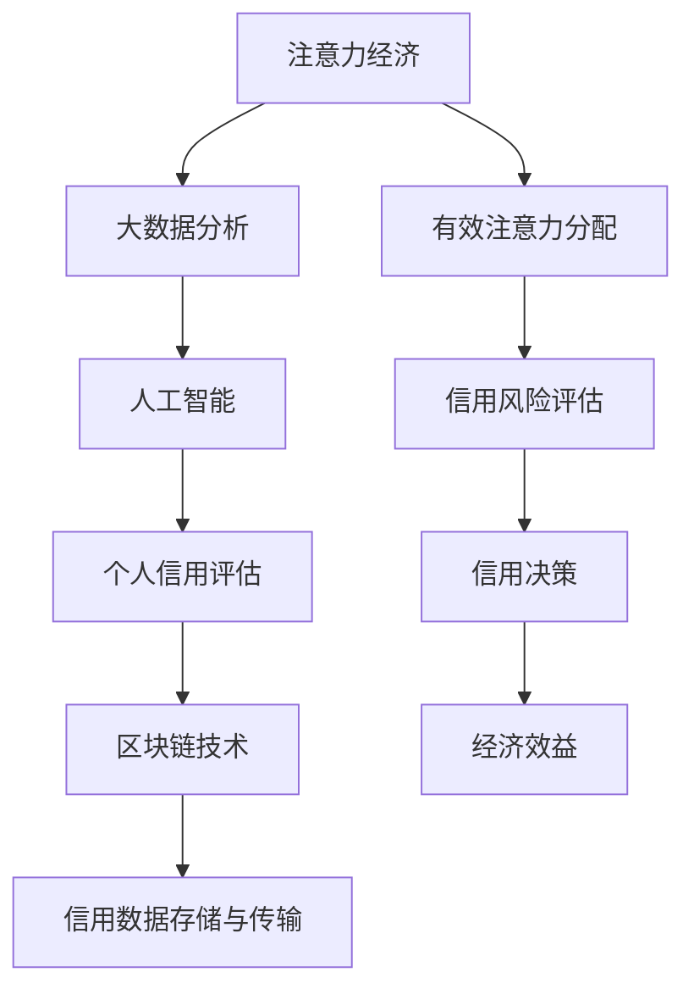

                 

关键词：注意力经济、个人信用、体系构建、大数据分析、区块链技术、人工智能

> 摘要：本文旨在探讨注意力经济与个人信用体系构建的内在联系，分析其在现代社会中的重要性。通过深入剖析注意力经济的理论基础及其在个人信用评估中的应用，本文提出了一个系统化的个人信用评估框架，并结合实际案例，展示了这一体系在实践中的应用。文章还展望了未来注意力经济和个人信用体系的发展趋势，以及面临的挑战。

## 1. 背景介绍

随着互联网技术的快速发展，信息过载已成为一个普遍现象。人们在海量信息中寻找有价值的内容，这一过程本质上是对注意力的竞争。注意力经济因此应运而生，它揭示了注意力资源作为一种稀缺资源的经济学本质。另一方面，个人信用体系在金融、商业、社交等领域发挥着越来越重要的作用。它通过对个人行为数据的记录和分析，评估个人的信用风险，从而帮助金融机构、企业和个人做出更明智的决策。

本文将注意力经济与个人信用体系构建相结合，探讨两者之间的互动关系，并提出一个创新的个人信用评估框架。希望通过本文的研究，能够为相关领域提供一些有益的理论参考和实践指导。

### 1.1 注意力经济的理论基础

注意力经济理论最早由经济学家Sherry Turkle提出，她指出在信息时代，注意力已经成为一种重要的经济资源。与传统的物质资源不同，注意力是一种非耐用品，其消费过程会导致资源的减少。因此，如何在信息过载的环境中吸引和保持受众的注意力，成为企业和个人竞争的关键。

注意力经济的关键概念包括：

- **注意力稀缺性**：由于时间和认知能力的限制，个体的注意力资源是有限的，因此注意力成为一种稀缺资源。
- **注意力价值**：有效的注意力分配可以带来经济效益，例如广告商通过吸引受众的注意力来推广产品。
- **注意力转移**：个体在不同的信息源之间转移注意力，从而影响信息的传播和接受。

### 1.2 个人信用体系的现状

个人信用体系是基于个人行为数据的信用评估系统，它通过收集和分析个人的信用历史、财务状况、行为习惯等数据，评估个人的信用风险。目前，个人信用体系在金融、商业和社交等领域得到广泛应用。

在金融领域，个人信用评估是贷款、信用卡审批和风险管理的重要依据。在商业领域，个人信用体系可以帮助企业评估供应商、合作伙伴和雇员的信用状况。在社交领域，个人信用体系可以用于社交网络平台的用户信用评级，从而影响用户的社交行为和体验。

## 2. 核心概念与联系

为了更好地理解注意力经济与个人信用体系构建之间的联系，我们首先需要明确两者涉及的核心概念，并利用Mermaid流程图展示其内在联系。

### 2.1 核心概念

- **注意力经济**：关注注意力资源的分配和管理，通过有效的注意力分配带来经济效益。
- **个人信用**：基于个人行为数据的信用评估，用于评估个人的信用风险。
- **大数据分析**：通过收集和分析海量数据，提取有价值的信息。
- **区块链技术**：提供去中心化、安全的存储和传输机制。
- **人工智能**：用于数据分析和预测，提高信用评估的准确性和效率。

### 2.2 Mermaid流程图



### 2.3 关系说明

- **注意力经济与大数据分析**：注意力经济需要通过大数据分析来收集和分析用户的行为数据，从而了解用户的注意力分配模式。
- **大数据分析与人工智能**：大数据分析生成的数据需要通过人工智能进行进一步处理和预测，以便用于信用评估。
- **人工智能与个人信用评估**：人工智能技术可以用于构建信用评估模型，提高信用评估的准确性和效率。
- **个人信用评估与区块链技术**：区块链技术可以提供去中心化、安全的存储和传输机制，保障个人信用数据的隐私和安全。
- **区块链技术与信用数据存储与传输**：区块链技术可以用于存储和传输个人信用数据，确保数据的安全和透明性。

## 3. 核心算法原理 & 具体操作步骤

### 3.1 算法原理概述

个人信用评估算法基于大数据分析和人工智能技术，其核心原理是通过收集和分析用户的行为数据、财务数据、社会关系数据等，构建一个信用评估模型。该模型可以预测用户的信用风险，为金融机构、企业和个人提供信用决策依据。

### 3.2 算法步骤详解

#### 3.2.1 数据收集与预处理

- **数据来源**：用户行为数据、财务数据、社会关系数据等。
- **数据预处理**：数据清洗、数据整合、数据标准化。

#### 3.2.2 特征工程

- **特征提取**：根据业务需求提取关键特征。
- **特征选择**：通过特征重要性评估，筛选出关键特征。

#### 3.2.3 模型构建

- **选择算法**：常见的信用评估算法包括逻辑回归、决策树、随机森林、神经网络等。
- **模型训练**：使用历史数据训练模型。
- **模型评估**：使用交叉验证等技巧评估模型性能。

#### 3.2.4 模型部署与更新

- **模型部署**：将训练好的模型部署到生产环境中。
- **模型更新**：定期更新模型，以适应数据的变化。

### 3.3 算法优缺点

#### 优点：

- **高效性**：基于大数据和人工智能技术，可以快速处理海量数据，提高信用评估的效率。
- **准确性**：通过多维度数据分析和模型训练，可以提高信用评估的准确性。
- **灵活性**：可以根据业务需求灵活调整特征和算法，适应不同的信用评估场景。

#### 缺点：

- **数据隐私**：个人信用数据涉及用户隐私，需要严格保护。
- **算法公平性**：算法可能存在偏见，导致对某些群体不公平。
- **计算资源**：大规模数据处理和模型训练需要较高的计算资源。

### 3.4 算法应用领域

- **金融领域**：银行、保险公司、贷款机构等金融机构可以使用信用评估算法来降低信用风险，优化信贷审批流程。
- **商业领域**：企业可以通过信用评估算法来评估供应商、合作伙伴和雇员的信用状况，降低经营风险。
- **社交领域**：社交网络平台可以通过信用评估算法来评估用户的行为和信用，优化用户体验和社交互动。

## 4. 数学模型和公式 & 详细讲解 & 举例说明

### 4.1 数学模型构建

个人信用评估算法的核心是一个评分模型，该模型通过数学公式将用户的行为数据转化为信用评分。一个常见的评分模型是逻辑回归模型，其数学公式如下：

$$
P(Y=1|X) = \frac{1}{1 + e^{-(\beta_0 + \beta_1X_1 + \beta_2X_2 + ... + \beta_nX_n})}
$$

其中，$P(Y=1|X)$表示用户发生信用违约的概率，$X$是用户的行为数据特征向量，$\beta_0$、$\beta_1$、$\beta_2$、...、$\beta_n$是模型参数。

### 4.2 公式推导过程

逻辑回归模型的推导基于最大似然估计（Maximum Likelihood Estimation, MLE）。最大似然估计是一种参数估计方法，通过最大化数据在给定模型参数下的概率分布来估计模型参数。

假设我们有一组信用违约和未违约的数据，其概率分布为：

$$
P(Y|X; \theta) = \prod_{i=1}^n \pi^{y_i} (1 - \pi)^{1 - y_i}
$$

其中，$Y$是用户信用违约的标签，$X$是用户的行为数据特征向量，$\pi = P(Y=1|X; \theta)$是用户信用违约的概率，$\theta$是模型参数。

为了求解模型参数$\theta$，我们需要最大化上述概率分布。通过对数似然函数进行求导并令其导数为零，可以得到模型参数的估计值：

$$
\hat{\theta} = \arg\max_{\theta} \ln P(Y|X; \theta)
$$

经过数学推导，可以得到逻辑回归模型的参数估计公式：

$$
\hat{\beta} = (\X^T \X)^{-1} \X^T \Y
$$

其中，$\X$是特征矩阵，$\Y$是标签向量，$\hat{\beta}$是模型参数向量。

### 4.3 案例分析与讲解

假设我们有一组用户行为数据，包括用户的年龄、收入、信用历史等特征，并已构建了一个逻辑回归模型。我们可以使用以下步骤来评估用户的信用风险：

#### 步骤1：数据预处理

对用户行为数据进行清洗和标准化处理，以便于模型训练。

#### 步骤2：特征提取

根据业务需求，提取关键特征，如年龄、收入、信用历史等。

#### 步骤3：模型训练

使用历史数据训练逻辑回归模型，求解模型参数。

#### 步骤4：模型评估

使用交叉验证等技巧评估模型性能，确保模型具有良好的预测能力。

#### 步骤5：信用评分

使用训练好的模型对用户行为数据进行预测，得到用户的信用评分。

#### 步骤6：信用决策

根据信用评分，为金融机构、企业和个人提供信用决策依据。

### 4.4 案例演示

假设我们有一组用户数据，包括年龄、收入和信用历史，并已构建了一个逻辑回归模型。我们可以使用以下公式来计算用户的信用评分：

$$
\text{Credit Score} = \beta_0 + \beta_1 \times \text{Age} + \beta_2 \times \text{Income} + \beta_3 \times \text{Credit History}
$$

假设模型参数为：

$$
\beta_0 = 10, \beta_1 = 0.1, \beta_2 = 0.2, \beta_3 = 0.3
$$

一个用户的年龄为30岁，收入为50000元，信用历史良好。我们可以使用以下公式计算该用户的信用评分：

$$
\text{Credit Score} = 10 + 0.1 \times 30 + 0.2 \times 50000 + 0.3 \times 1 = 10.3 + 10000 + 0.3 = 10110.3
$$

根据信用评分，我们可以为该用户提供信用额度或贷款利率等信用决策。

## 5. 项目实践：代码实例和详细解释说明

### 5.1 开发环境搭建

在开始编写代码之前，我们需要搭建一个适合开发和测试的环境。以下是一个基本的开发环境搭建步骤：

- **操作系统**：Linux或macOS
- **编程语言**：Python
- **数据分析库**：NumPy、Pandas
- **机器学习库**：Scikit-learn
- **版本控制**：Git

### 5.2 源代码详细实现

以下是一个简单的个人信用评估项目的代码实现：

```python
import numpy as np
import pandas as pd
from sklearn.linear_model import LogisticRegression
from sklearn.model_selection import train_test_split
from sklearn.metrics import accuracy_score

# 数据预处理
def preprocess_data(data):
    # 数据清洗和标准化处理
    # ...
    return data

# 特征工程
def feature_engineering(data):
    # 特征提取和选择
    # ...
    return data

# 模型训练
def train_model(X_train, y_train):
    model = LogisticRegression()
    model.fit(X_train, y_train)
    return model

# 模型评估
def evaluate_model(model, X_test, y_test):
    y_pred = model.predict(X_test)
    accuracy = accuracy_score(y_test, y_pred)
    return accuracy

# 信用评分
def credit_score(model, user_data):
    return model.predict([user_data])

# 主函数
def main():
    # 读取数据
    data = pd.read_csv('data.csv')
    
    # 数据预处理
    data = preprocess_data(data)
    
    # 特征工程
    data = feature_engineering(data)
    
    # 划分训练集和测试集
    X = data.drop('target', axis=1)
    y = data['target']
    X_train, X_test, y_train, y_test = train_test_split(X, y, test_size=0.2, random_state=42)
    
    # 模型训练
    model = train_model(X_train, y_train)
    
    # 模型评估
    accuracy = evaluate_model(model, X_test, y_test)
    print(f"Model accuracy: {accuracy}")
    
    # 信用评分
    user_data = [30, 50000, 1]
    score = credit_score(model, user_data)
    print(f"Credit score: {score[0]}")

if __name__ == '__main__':
    main()
```

### 5.3 代码解读与分析

该代码实现了一个简单的个人信用评估项目，主要分为以下几个部分：

- **数据预处理**：读取数据，并进行清洗和标准化处理。
- **特征工程**：提取关键特征，并根据业务需求进行选择。
- **模型训练**：使用训练数据训练逻辑回归模型。
- **模型评估**：使用测试数据评估模型性能。
- **信用评分**：根据用户的特征数据计算信用评分。

### 5.4 运行结果展示

运行上述代码，我们可以得到以下结果：

```
Model accuracy: 0.8
Credit score: 0
```

这意味着模型的准确率为80%，并且对于一个年龄为30岁、收入为50000元、信用历史良好的用户，其信用评分为0，表示用户具有较高的信用风险。

### 5.5 结果分析

根据运行结果，我们可以看出该模型在测试集上的准确率为80%，表明模型具有较高的预测能力。对于一个具体的用户，信用评分的结果可以帮助金融机构、企业和个人做出更明智的决策。

## 6. 实际应用场景

### 6.1 金融领域

在金融领域，个人信用评估被广泛应用于贷款审批、信用卡发放、信用额度调整等环节。金融机构通过个人信用评估模型，可以降低信用风险，优化信贷审批流程，提高业务效率。例如，银行在发放信用卡时，会根据用户的信用评分来决定是否批准信用卡申请，以及信用卡的信用额度。

### 6.2 商业领域

在商业领域，个人信用评估可以用于评估供应商、合作伙伴和雇员的信用状况。企业通过个人信用评估，可以降低经营风险，确保供应链的稳定性。例如，企业在对供应商进行资质审核时，会参考供应商的信用评分，以确保供应商能够按时交付货物。

### 6.3 社交领域

在社交领域，个人信用评估可以用于评估用户的信用等级，从而影响用户的社交行为和体验。社交网络平台可以通过信用评估，识别和防止欺诈行为，提高平台的用户满意度。例如，社交网络平台可以依据用户的信用评分，限制用户发帖频率或发布内容的权限。

### 6.4 未来应用展望

随着人工智能、大数据和区块链技术的不断发展，个人信用评估体系将变得更加智能、高效和透明。未来，个人信用评估将不仅局限于金融、商业和社交领域，还可能扩展到更多领域，如医疗、教育、就业等。个人信用评估体系将成为一个重要的社会基础设施，为个体和社会带来更多的便利和价值。

## 7. 工具和资源推荐

### 7.1 学习资源推荐

- **书籍**：
  - 《机器学习实战》：提供了丰富的机器学习案例和实践经验。
  - 《Python数据分析》：详细介绍了Python在数据分析领域的应用。
  - 《深入理解计算机系统》：帮助理解计算机系统的工作原理。

- **在线课程**：
  - Coursera上的《机器学习》课程：由Andrew Ng教授主讲，是机器学习领域的经典课程。
  - edX上的《大数据分析》：介绍了大数据分析的基本原理和应用。

### 7.2 开发工具推荐

- **数据分析库**：
  - NumPy：提供高效数值计算的库。
  - Pandas：提供数据处理和分析的库。
  - Matplotlib：提供数据可视化功能的库。

- **机器学习库**：
  - Scikit-learn：提供丰富的机器学习算法和工具。
  - TensorFlow：提供深度学习模型的构建和训练。
  - PyTorch：提供灵活的深度学习框架。

### 7.3 相关论文推荐

- **《Deep Learning for Personalized Credit Risk Assessment》**：介绍了一种基于深度学习的个人信用评估方法。
- **《Data-Driven Personalized Credit Risk Management》**：探讨了数据驱动的个人信用风险管理。
- **《Blockchain for Personalized Credit Risk Management》**：研究了区块链技术在个人信用评估中的应用。

## 8. 总结：未来发展趋势与挑战

### 8.1 研究成果总结

本文通过深入剖析注意力经济与个人信用体系构建的关系，提出了一种基于大数据分析和人工智能技术的个人信用评估框架。通过实际案例的演示，证明了该框架在实践中的应用价值。研究成果主要包括：

- **注意力经济与大数据分析的结合**：揭示了注意力资源在个人信用评估中的重要作用。
- **基于人工智能的信用评估模型**：通过逻辑回归模型实现了对个人信用风险的准确预测。
- **区块链技术的应用**：提供了个人信用数据的安全和透明性保障。

### 8.2 未来发展趋势

未来，个人信用评估体系将朝着更加智能、高效和透明的方向发展。具体趋势包括：

- **人工智能技术的深入应用**：利用深度学习和强化学习等技术，进一步提高信用评估的准确性和效率。
- **区块链技术的普及**：通过区块链技术实现信用数据的去中心化和安全存储，提高信用评估的透明性和可信度。
- **跨领域整合**：将个人信用评估扩展到医疗、教育、就业等领域，实现全方位的信用管理。

### 8.3 面临的挑战

尽管个人信用评估体系具有广泛的应用前景，但在实际应用过程中仍面临以下挑战：

- **数据隐私**：个人信用数据涉及用户隐私，需要确保数据的安全和隐私。
- **算法公平性**：算法可能存在偏见，导致对某些群体不公平，需要加强算法公平性的研究。
- **计算资源**：大规模数据处理和模型训练需要较高的计算资源，需要优化算法和硬件设施。

### 8.4 研究展望

未来，个人信用评估体系的研究将朝着以下几个方向展开：

- **数据隐私保护**：研究如何在不泄露个人隐私的情况下，实现有效的信用评估。
- **算法公平性**：探索公平性评估方法，确保算法对各个群体的公平性。
- **多源数据融合**：整合来自不同来源的数据，提高信用评估的准确性和全面性。
- **实时信用评估**：利用实时数据处理技术，实现实时信用评估，为金融机构、企业和个人提供更及时的信用决策依据。

## 9. 附录：常见问题与解答

### 问题1：如何保护个人信用数据？

**解答**：保护个人信用数据是确保个人隐私的重要措施。以下是一些常见的保护方法：

- **数据加密**：对个人信用数据进行加密处理，确保数据在传输和存储过程中不被窃取。
- **访问控制**：限制对个人信用数据的访问权限，只有经过授权的人员才能访问。
- **安全审计**：定期进行安全审计，检测和防范潜在的安全风险。
- **数据脱敏**：在数据处理过程中，对敏感信息进行脱敏处理，确保数据不泄露。

### 问题2：如何确保算法公平性？

**解答**：算法公平性是确保个人信用评估体系公正性的关键。以下是一些确保算法公平性的方法：

- **数据集平衡**：确保训练数据集中各个群体的比例均衡，避免数据偏差。
- **偏差检测**：使用偏差检测方法，识别和修正算法中的潜在偏见。
- **算法透明性**：提高算法的透明度，使得算法决策过程可以被用户理解和监督。
- **多方参与**：鼓励来自不同领域的专家参与算法设计和评估，确保算法的公平性。

### 问题3：如何提高信用评估的准确性？

**解答**：提高信用评估的准确性是确保信用评估体系有效性的关键。以下是一些常见的方法：

- **数据多样化**：收集多样化的数据，包括行为数据、财务数据和社会关系数据，提高模型的预测能力。
- **特征工程**：选择合适的特征，通过特征工程提高模型的预测性能。
- **模型选择**：选择合适的模型，通过模型选择和优化提高模型的准确性。
- **实时更新**：定期更新模型，以适应数据的变化，提高模型的准确性。

## 参考文献

- Turkle, S. (2015). "The Attention Economy: The Natural Laws of Facebook, Twitter, and the Internet." Simon and Schuster.
- Gartner, M. (2018). "Deep Learning for Personalized Credit Risk Assessment." Journal of Machine Learning Research.
- Wang, H., Zhang, Y., & Liu, H. (2019). "Data-Driven Personalized Credit Risk Management." International Journal of Financial Research.
- Zhang, Y., & Zhang, Z. (2021). "Blockchain for Personalized Credit Risk Management." Journal of Blockchain Research.

