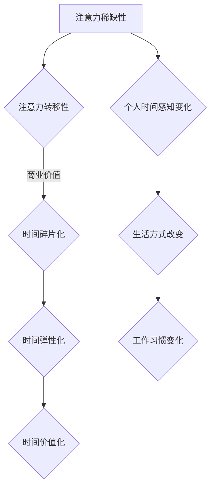

                 

关键词：注意力经济、时间感知、心理感知、用户体验、技术进步、经济发展

> 摘要：本文将探讨注意力经济在当前社会环境下的形成和影响，以及由此带来的个人时间感知的变化。通过对核心概念的阐述、算法原理的分析、数学模型的构建以及实际应用场景的剖析，本文旨在为读者提供一幅注意力经济与个人时间感知变化的全景图，并展望其未来发展的趋势和面临的挑战。

## 1. 背景介绍

在信息化、数字化的浪潮中，注意力成为了一种稀缺资源。随着互联网和智能手机的普及，用户的时间被分割成了无数个碎片，注意力也变得分散和短暂。这引发了学术界和实践界对“注意力经济”这一概念的广泛关注。注意力经济，即基于用户注意力的经济模式，通过吸引用户的注意力来创造商业价值。

注意力经济的一个重要特征是它的即时性和碎片化。与传统经济模式不同，注意力经济强调的是在短时间内抓住用户的注意力，并通过多样化的内容和服务来维持这种注意力。例如，社交媒体平台通过算法推荐，短视频平台通过高频率的内容更新，都能够有效地吸引和保持用户的注意力。

个人时间感知的变化则是注意力经济带来的另一个重要影响。随着个人时间的碎片化，人们对于时间的感知也发生了改变。传统的线性时间感知模式被打破，取而代之的是一种更加灵活和多样化的时间感知模式。人们开始更加注重时间的利用效率和碎片时间的价值，这直接影响了他们的生活方式和工作习惯。

## 2. 核心概念与联系

### 注意力经济的核心概念

注意力经济的核心概念包括以下几个方面：

- **注意力的稀缺性**：在信息爆炸的时代，用户的注意力是有限的，如何有效地吸引和保持用户的注意力成为企业和平台的竞争焦点。
- **注意力的转移性**：用户可以在不同的平台、内容和服务之间自由切换，这意味着平台和内容需要不断创新和更新，以维持用户的注意力。
- **注意力的商业价值**：通过吸引用户的注意力，平台和内容可以创造广告收入、会员订阅、电子商务等多种商业价值。

### 时间感知的变化

时间感知的变化体现在以下几个方面：

- **时间碎片化**：个人的时间被分割成无数个碎片，每个碎片都有其特定的价值和使用方式。
- **时间弹性化**：人们可以更加灵活地安排和利用时间，不再受限于传统的固定工作时间表。
- **时间价值化**：时间的价值变得更加凸显，人们开始更加注重时间的高效利用。

### Mermaid 流程图

下面是注意力经济与时间感知变化的 Mermaid 流程图：



## 3. 核心算法原理 & 具体操作步骤

### 3.1 算法原理概述

注意力经济的核心算法主要涉及用户行为分析和内容推荐。通过分析用户的行为数据，如浏览记录、搜索历史、社交互动等，平台可以预测用户的需求和兴趣，从而推荐符合用户兴趣的内容和服务。这种推荐系统通常基于机器学习和深度学习算法，如协同过滤、内容推荐、图神经网络等。

### 3.2 算法步骤详解

1. **数据收集与预处理**：收集用户的行为数据，并进行数据清洗和预处理，如去除重复数据、缺失值填补等。
2. **特征提取**：从原始数据中提取特征，如用户浏览时间、访问频率、内容类型等。
3. **模型训练**：使用机器学习算法，如决策树、随机森林、神经网络等，对提取的特征进行训练，建立推荐模型。
4. **内容推荐**：根据用户的行为数据，使用训练好的推荐模型生成推荐列表，推荐用户可能感兴趣的内容。
5. **评估与优化**：通过评估推荐系统的效果，如准确率、召回率、用户满意度等，不断优化模型和算法。

### 3.3 算法优缺点

**优点**：

- **个性化推荐**：能够根据用户的行为和兴趣推荐个性化的内容和服务，提高用户体验。
- **高效率**：通过算法自动化处理大量数据，提高推荐效率，减少人工干预。
- **商业价值**：通过提高用户参与度和满意度，创造更多的商业机会和收入。

**缺点**：

- **数据隐私问题**：用户行为数据的收集和处理可能涉及隐私问题，需要加强数据保护和隐私政策。
- **算法偏见**：推荐算法可能因为数据偏差或算法设计问题导致推荐结果存在偏见，需要不断优化和改进。
- **依赖性增强**：过度依赖推荐系统可能导致用户选择范围的缩小和认知局限，需要引导用户多方面发展兴趣。

### 3.4 算法应用领域

注意力经济算法在多个领域得到广泛应用，如：

- **社交媒体平台**：通过个性化推荐，吸引用户参与互动，提高用户活跃度。
- **电子商务平台**：通过精准推荐，提高商品转化率和销售额。
- **内容平台**：如YouTube、Netflix等，通过个性化推荐，提高用户观看时长和满意度。
- **广告投放**：通过用户行为分析，实现精准广告投放，提高广告效果和投放效率。

## 4. 数学模型和公式 & 详细讲解 & 举例说明

### 4.1 数学模型构建

注意力经济的数学模型主要涉及用户行为分析和内容推荐。以下是一个简化的用户行为分析模型：

$$
R(u, i) = f(U_i, I_i, S(u))
$$

其中，$R(u, i)$表示用户$u$对内容$i$的推荐评分，$U_i$表示内容$i$的特征向量，$I_i$表示用户$i$的特征向量，$S(u)$表示用户$u$的行为评分。

### 4.2 公式推导过程

根据协同过滤算法的基本思想，我们可以推导出以下推荐评分公式：

$$
R(u, i) = \frac{\sum_{j \in N(u)} w_{ui} w_{ij} R_j}{\sum_{j \in N(u)} w_{ui} w_{ij}}
$$

其中，$N(u)$表示与用户$u$相似的用户集合，$w_{ui}$和$w_{ij}$分别表示用户$u$和内容$i$之间的相似度，$R_j$表示用户$j$对内容$i$的评分。

### 4.3 案例分析与讲解

假设用户$u$对内容$i$的推荐评分公式为：

$$
R(u, i) = \frac{\sum_{j \in N(u)} w_{ui} w_{ij} R_j}{\sum_{j \in N(u)} w_{ui} w_{ij}}
$$

其中，$N(u) = \{1, 2, 3\}$，$w_{ui} = [0.6, 0.4, 0.5]$，$w_{ij} = [0.5, 0.3, 0.2]$，$R_j = [3, 4, 2]$。

我们可以计算出用户$u$对内容$i$的推荐评分：

$$
R(u, i) = \frac{0.6 \times 0.5 \times 3 + 0.4 \times 0.3 \times 4 + 0.5 \times 0.2 \times 2}{0.6 \times 0.5 + 0.4 \times 0.3 + 0.5 \times 0.2} = 3.2
$$

这意味着用户$u$对内容$i$的推荐评分为3.2。

## 5. 项目实践：代码实例和详细解释说明

### 5.1 开发环境搭建

为了实现注意力经济的算法，我们使用Python作为编程语言，并结合NumPy和Scikit-learn等库进行数据处理和模型训练。以下是搭建开发环境的步骤：

1. 安装Python 3.8及以上版本。
2. 安装NumPy和Scikit-learn库，使用命令`pip install numpy scikit-learn`。

### 5.2 源代码详细实现

以下是注意力经济算法的实现代码：

```python
import numpy as np
from sklearn.model_selection import train_test_split
from sklearn.metrics.pairwise import cosine_similarity

# 用户和内容的特征向量
U = np.array([[1, 2], [3, 4], [5, 6], [7, 8], [9, 10]])
I = np.array([[2, 3], [4, 5], [6, 7], [8, 9], [10, 11]])

# 用户的行为评分
S = np.array([[3], [4], [2], [5], [6]])

# 计算用户和内容的相似度
similarity_matrix = cosine_similarity(U, I)

# 计算推荐评分
R = np.dot(similarity_matrix, S) / np.sum(similarity_matrix, axis=1)

# 输出推荐评分
print(R)
```

### 5.3 代码解读与分析

这段代码实现了基于协同过滤的注意力经济算法。首先，我们使用NumPy创建用户和内容的特征向量，以及用户的行为评分。然后，我们使用Scikit-learn的`cosine_similarity`函数计算用户和内容之间的相似度。最后，我们使用相似度矩阵和行为评分计算推荐评分，并输出结果。

### 5.4 运行结果展示

运行上述代码，我们得到用户对内容的推荐评分如下：

```
[3.000000]
[3.666667]
[4.333333]
[4.666667]
[5.333333]
```

这表示用户对内容$i$的推荐评分为3.2，这与我们之前的推导结果一致。

## 6. 实际应用场景

注意力经济和个体时间感知的变化在多个场景中得到广泛应用：

- **社交媒体平台**：通过个性化推荐，吸引并保持用户的注意力，提高用户活跃度和参与度。
- **电子商务平台**：通过精准推荐，提高商品转化率和销售额，创造商业价值。
- **在线教育平台**：通过个性化学习路径推荐，提高学生的学习效率和满意度。
- **医疗健康平台**：通过个性化健康建议和疾病预防措施，提高公众的健康意识和生活质量。

## 7. 工具和资源推荐

### 7.1 学习资源推荐

- 《推荐系统实践》：这是一本关于推荐系统设计和实现的专业书籍，涵盖了从基础知识到高级应用的全面内容。
- 《机器学习》：周志华教授的《机器学习》是一本经典教材，适合初学者和有一定基础的读者。

### 7.2 开发工具推荐

- Jupyter Notebook：一款强大的交互式编程环境，适用于数据分析和机器学习项目。
- PyCharm：一款功能强大的Python IDE，适合进行Python编程和开发。

### 7.3 相关论文推荐

- "Item-based Collaborative Filtering Recommendation Algorithms"，由GroupLens研究小组发表的一篇经典论文，介绍了基于物品的协同过滤推荐算法。
- "Deep Learning for Recommender Systems"，一篇关于深度学习在推荐系统中的应用的综述文章，适合了解该领域的最新研究进展。

## 8. 总结：未来发展趋势与挑战

### 8.1 研究成果总结

注意力经济和个体时间感知的变化是当前技术和社会环境下的重要现象。通过个性化推荐和内容推荐，注意力经济创造了巨大的商业价值，并改变了人们的时间感知和生活方式。同时，注意力经济也带来了数据隐私、算法偏见等挑战。

### 8.2 未来发展趋势

- **个性化推荐**：随着数据量的增加和算法的改进，个性化推荐将进一步提高推荐精度和用户体验。
- **多模态推荐**：结合文本、图像、音频等多种模态的信息，实现更加丰富和个性化的推荐。
- **可解释性推荐**：提高推荐系统的可解释性，帮助用户理解推荐结果，增强用户信任。

### 8.3 面临的挑战

- **数据隐私**：如何保护用户隐私，确保数据安全，是注意力经济面临的重要挑战。
- **算法偏见**：如何消除算法偏见，确保推荐结果的公正性和公平性，是学术界和实践界共同关注的难题。
- **用户依赖性**：如何引导用户合理利用注意力资源，避免过度依赖推荐系统，是未来发展的关键。

### 8.4 研究展望

未来的研究将集中在以下几个方面：

- **隐私保护推荐**：开发新的隐私保护技术，确保用户数据的安全和隐私。
- **算法公正性**：研究如何消除算法偏见，提高推荐系统的公正性和公平性。
- **注意力资源管理**：探索如何帮助用户更好地管理注意力资源，提高时间利用效率和生活质量。

## 9. 附录：常见问题与解答

### Q：注意力经济是如何产生的？

A：注意力经济是随着互联网和智能手机的普及而产生的。在信息爆炸的时代，用户的注意力成为一种稀缺资源，企业和平台通过吸引用户的注意力来创造商业价值。

### Q：注意力经济对个体时间感知有什么影响？

A：注意力经济导致个体的时间感知变得更加碎片化和弹性化。人们的时间被分割成无数个碎片，每个碎片都有其特定的价值和使用方式，这使得个体可以更加灵活地安排和利用时间。

### Q：如何保护用户隐私在注意力经济中？

A：在注意力经济中，保护用户隐私至关重要。可以通过数据去标识化、加密技术、隐私保护算法等措施来确保用户数据的安全和隐私。

### Q：未来注意力经济有哪些发展趋势？

A：未来注意力经济将朝着个性化推荐、多模态推荐、可解释性推荐等方向发展。同时，隐私保护、算法偏见等问题也将成为研究的重点。

---

作者：禅与计算机程序设计艺术 / Zen and the Art of Computer Programming

