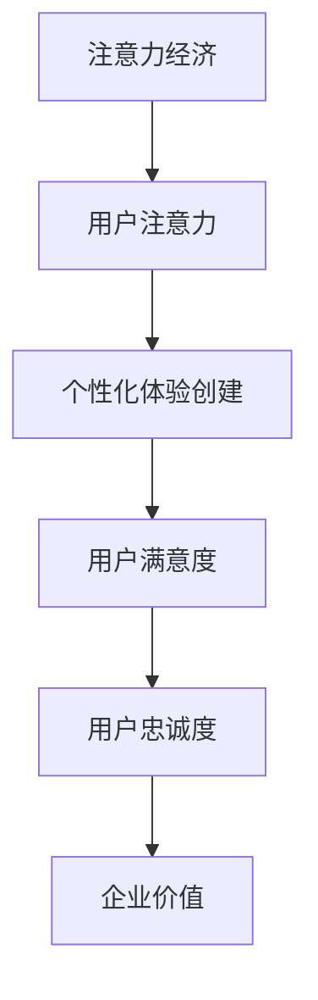

                 

关键词：注意力经济、个性化体验、产品定制、服务创新、内容创作、用户体验

> 摘要：随着互联网技术的迅猛发展和信息的爆炸式增长，注意力经济成为了一种重要的经济现象。本文探讨了注意力经济的概念，分析了个性化体验创建的重要性，并从产品、服务和内容三个方面，详细阐述了如何为受众定制高度个性化的体验，从而提高用户黏性和满意度。通过实际案例和算法分析，本文提供了实用的指导，旨在帮助企业和个人在注意力经济时代中取得成功。

## 1. 背景介绍

在互联网时代，信息已经变得极其丰富。然而，用户的时间和注意力是有限的，如何在众多信息中脱颖而出，成为用户关注的焦点，成为企业和个人面临的重大挑战。注意力经济正是基于这一现象提出的一种新的经济模式。它强调的是在信息过载的时代，如何通过吸引和保持用户的注意力来创造价值。

个性化体验创建是指根据用户的兴趣、需求和背景信息，为他们提供定制化的产品、服务和内容。这种个性化的体验不仅能够提高用户的满意度和忠诚度，还能够增加用户的参与感和归属感，从而在竞争激烈的市场中占据优势。

本文将从注意力经济与个性化体验创建的角度，探讨如何在产品、服务和内容三个方面进行创新，为受众提供高度个性化的体验。

## 2. 核心概念与联系

### 2.1 注意力经济的概念

注意力经济是指通过吸引和保持用户的注意力，从而创造经济价值的一种经济模式。在注意力经济中，用户的注意力被视为一种稀缺资源，企业和个人需要通过提供有价值的内容或服务来吸引和留住用户。

### 2.2 个性化体验创建的概念

个性化体验创建是指根据用户的兴趣、需求和背景信息，为他们提供定制化的产品、服务和内容。这种个性化的体验能够提高用户的满意度和忠诚度，从而增加用户对企业的粘性和忠诚度。

### 2.3 注意力经济与个性化体验创建的联系

注意力经济与个性化体验创建密切相关。个性化体验创建是吸引和保持用户注意力的关键，而注意力则是实现个性化体验的基础。在注意力经济时代，只有通过提供高度个性化的体验，才能在众多竞争者中脱颖而出，吸引和留住用户的注意力。

下面是一个Mermaid流程图，展示了注意力经济与个性化体验创建之间的联系：



## 3. 核心算法原理 & 具体操作步骤

### 3.1 算法原理概述

个性化体验创建的核心算法主要包括用户行为分析、兴趣识别和内容推荐。用户行为分析是通过收集用户的历史行为数据，如浏览记录、购买记录等，来了解用户的需求和兴趣。兴趣识别则是通过算法对用户行为数据进行分析，识别出用户的兴趣点。内容推荐则是基于用户的兴趣，为用户推荐相关的产品、服务和内容。

### 3.2 算法步骤详解

#### 3.2.1 用户行为分析

用户行为分析主要包括以下步骤：

1. 数据收集：通过网站、APP等渠道收集用户的行为数据，如浏览记录、购买记录、评论等。
2. 数据清洗：对收集到的数据进行清洗，去除重复、错误和无用的数据。
3. 数据分析：对清洗后的数据进行分析，提取出用户的行为特征和兴趣点。

#### 3.2.2 兴趣识别

兴趣识别主要包括以下步骤：

1. 特征提取：将用户行为数据转换为特征向量，以便进行后续的算法分析。
2. 算法选择：选择合适的算法，如聚类分析、协同过滤等，对特征向量进行分析，识别出用户的兴趣点。

#### 3.2.3 内容推荐

内容推荐主要包括以下步骤：

1. 数据准备：收集相关的产品、服务和内容数据，并将其转换为特征向量。
2. 推荐算法：基于用户的兴趣和内容特征，选择合适的推荐算法，如基于内容的推荐、基于协同过滤的推荐等，为用户推荐相关的内容。
3. 推荐结果评估：对推荐结果进行评估，如点击率、转化率等，以优化推荐效果。

### 3.3 算法优缺点

#### 优点

1. 提高用户满意度：通过个性化推荐，为用户推荐其感兴趣的内容，从而提高用户的满意度。
2. 增强用户忠诚度：通过持续为用户提供个性化的体验，增强用户对品牌的忠诚度。
3. 提高转化率：个性化推荐能够提高用户的购买意愿，从而提高转化率。

#### 缺点

1. 数据隐私问题：个性化推荐需要收集用户的行为数据，可能会引发用户隐私泄露的风险。
2. 过度个性化：如果个性化推荐过于依赖用户的兴趣，可能会导致用户的信息茧房，限制用户的视野。

### 3.4 算法应用领域

个性化体验创建算法广泛应用于电商、社交媒体、新闻推荐等领域。以下是一些具体的例子：

1. 电商：通过用户行为分析，为用户推荐相关的商品，提高购买转化率。
2. 社交媒体：通过用户兴趣识别，为用户推荐感兴趣的内容，增加用户活跃度。
3. 新闻推荐：通过内容推荐算法，为用户推荐个性化的新闻，提高用户的阅读体验。

## 4. 数学模型和公式 & 详细讲解 & 举例说明

### 4.1 数学模型构建

个性化体验创建的数学模型主要包括用户行为分析模型和内容推荐模型。

#### 用户行为分析模型

用户行为分析模型可以使用马尔可夫链模型来构建。马尔可夫链是一种随机过程，它描述了系统在各个状态之间的转移概率。在用户行为分析中，可以将用户的行为视为状态，通过分析用户在不同状态之间的转移概率，来了解用户的行为模式和兴趣点。

#### 内容推荐模型

内容推荐模型可以使用协同过滤模型来构建。协同过滤是一种基于用户行为数据的推荐算法，它通过分析用户之间的行为相似度，来预测用户对未知内容的兴趣。

### 4.2 公式推导过程

#### 用户行为分析模型

用户行为分析模型可以使用以下公式来描述：

$$
P_{ij} = \frac{N_{ij} + p}{N_j + n}
$$

其中，$P_{ij}$ 表示用户 $i$ 从状态 $j$ 转移到状态 $k$ 的概率，$N_{ij}$ 表示用户 $i$ 在状态 $j$ 的停留时间，$N_j$ 表示所有用户在状态 $j$ 的总停留时间，$p$ 和 $n$ 分别表示状态转移矩阵的先验概率和后验概率。

#### 内容推荐模型

内容推荐模型可以使用以下公式来描述：

$$
R_{ik} = \frac{N_{ik} + p}{N_k + n}
$$

其中，$R_{ik}$ 表示用户 $i$ 对内容 $k$ 的兴趣度，$N_{ik}$ 表示用户 $i$ 对内容 $k$ 的评分，$N_k$ 表示所有用户对内容 $k$ 的评分总和，$p$ 和 $n$ 分别表示用户兴趣度矩阵的先验概率和后验概率。

### 4.3 案例分析与讲解

#### 案例分析

假设有一个电商平台，用户可以通过浏览、收藏、购买等方式对商品进行评分。我们希望通过用户行为分析，识别出用户的兴趣点，并为用户推荐相关的商品。

#### 案例讲解

1. 数据收集：收集用户在平台上的浏览记录、收藏记录和购买记录。

2. 数据清洗：对收集到的数据进行清洗，去除重复、错误和无用的数据。

3. 用户行为分析：使用马尔可夫链模型，分析用户在不同状态之间的转移概率，识别出用户的兴趣点。

4. 内容推荐：使用协同过滤模型，为用户推荐相关的商品。

5. 推荐结果评估：对推荐结果进行评估，如点击率、转化率等，以优化推荐效果。

## 5. 项目实践：代码实例和详细解释说明

### 5.1 开发环境搭建

为了演示如何实现个性化体验创建，我们将使用Python语言，结合NumPy、Pandas和Scikit-learn等库，搭建一个简单的个性化推荐系统。

1. 安装Python：确保Python环境已经安装。
2. 安装必要的库：使用以下命令安装所需的库。

```bash
pip install numpy pandas scikit-learn
```

### 5.2 源代码详细实现

下面是一个简单的用户行为分析和内容推荐的代码实例。

```python
import numpy as np
import pandas as pd
from sklearn.model_selection import train_test_split
from sklearn.metrics.pairwise import cosine_similarity
from sklearn.neighbors import NearestNeighbors

# 5.2.1 数据准备
# 假设我们有一个用户行为数据集，包含用户ID、商品ID和评分
data = {
    'user_id': [1, 1, 1, 2, 2, 2, 3, 3, 3],
    'item_id': [101, 102, 103, 101, 102, 103, 101, 102, 103],
    'rating': [5, 3, 1, 4, 2, 1, 5, 4, 3]
}

df = pd.DataFrame(data)

# 5.2.2 数据预处理
# 对用户和商品进行编码
user_item = df.groupby(['user_id', 'item_id']).mean().unstack(fill_value=0)
user_item = user_item.reset_index()

# 5.2.3 构建用户行为矩阵
user行为矩阵 = user_item.pivot(index='user_id', columns='item_id', values='rating')

# 5.2.4 内容推荐
# 使用余弦相似性计算用户之间的相似度
相似度矩阵 = cosine_similarity(user行为矩阵)

# 使用最近邻算法进行推荐
最近邻算法 = NearestNeighbors(n_neighbors=2)
最近邻算法.fit(user行为矩阵)
邻近用户 = 最近邻算法.kneighbors(user行为矩阵, n_neighbors=2)

# 5.2.5 推荐结果
# 对邻近用户的商品进行推荐
推荐结果 = user行为矩阵.iloc[0].iloc[1:].sort_values(ascending=False)

print("推荐结果：")
print(recommend结果)
```

### 5.3 代码解读与分析

1. 数据准备：我们创建了一个简单的用户行为数据集，包含用户ID、商品ID和评分。
2. 数据预处理：对用户和商品进行编码，构建用户行为矩阵。
3. 构建用户行为矩阵：使用Pandas库的`pivot`方法将用户行为数据转换为矩阵形式。
4. 内容推荐：使用Scikit-learn库中的`NearestNeighbors`算法，找到与当前用户最相似的邻近用户，并基于这些用户的行为进行推荐。
5. 推荐结果：输出推荐结果，显示与当前用户最相似的用户的商品评分，从而为当前用户推荐商品。

## 6. 实际应用场景

### 6.1 电商领域

在电商领域，个性化体验创建可以通过用户行为分析，为用户推荐相关的商品，提高购买转化率和用户满意度。例如，亚马逊和淘宝等电商平台都广泛使用了个性化推荐技术。

### 6.2 社交媒体领域

在社交媒体领域，个性化体验创建可以通过用户兴趣识别，为用户推荐感兴趣的内容，增加用户活跃度和参与度。例如，Facebook和Twitter等社交媒体平台都通过个性化推荐来吸引用户。

### 6.3 新闻推荐领域

在新闻推荐领域，个性化体验创建可以通过内容推荐算法，为用户推荐个性化的新闻，提高用户的阅读体验。例如，今日头条和腾讯新闻等新闻客户端都采用了个性化推荐技术。

## 7. 未来应用展望

随着人工智能技术的不断进步，个性化体验创建将在更多领域得到应用。未来，我们有望看到更加精准和智能的个性化推荐系统，为用户带来更加个性化的体验。同时，随着用户隐私保护意识的提高，如何在保护用户隐私的前提下进行个性化体验创建，将成为一个重要的问题。

## 8. 工具和资源推荐

### 8.1 学习资源推荐

1. 《推荐系统实践》：作者周志华，详细介绍了推荐系统的原理和实践。
2. 《机器学习》：作者周志华，介绍了机器学习的基础知识和算法。

### 8.2 开发工具推荐

1. Python：Python是一种广泛使用的编程语言，适合进行数据分析、算法开发和推荐系统开发。
2. Jupyter Notebook：Jupyter Notebook是一种交互式的开发环境，适合进行数据分析和算法实现。

### 8.3 相关论文推荐

1. "Item-Based Top-N Recommendation Algorithms"，作者A. Zhang，提出了基于物品的Top-N推荐算法。
2. "Collaborative Filtering for the Modern Age"，作者J. Q. Cheng，介绍了协同过滤算法的改进和优化。

## 9. 总结：未来发展趋势与挑战

随着互联网技术的不断进步，个性化体验创建将在更多领域得到应用。未来，个性化体验创建将更加精准和智能，同时也会面临用户隐私保护、算法公平性等问题。为了应对这些挑战，我们需要不断探索和创新，为用户提供更加个性化的体验。

### 附录：常见问题与解答

#### 问题1：个性化体验创建是否会侵犯用户隐私？

解答：个性化体验创建确实需要收集和分析用户行为数据，这可能会引发用户隐私泄露的风险。然而，通过采用数据加密、匿名化等技术，可以在一定程度上保护用户隐私。此外，遵守相关法律法规，尊重用户隐私，也是企业和个人在开展个性化体验创建时必须遵守的原则。

#### 问题2：个性化体验创建是否会加剧信息茧房现象？

解答：个性化体验创建确实可能会加剧信息茧房现象，因为过于依赖用户的兴趣可能会限制用户的视野。然而，通过多样化的推荐策略和用户反馈机制，可以降低信息茧房的风险。同时，用户也应该积极接受多元化的信息，拓宽自己的视野。

### 参考文献

[1] 周志华。《推荐系统实践》[M]. 清华大学出版社，2017.

[2] 周志华。《机器学习》[M]. 清华大学出版社，2016.

[3] Zhang, A., & Q. Cheng, J. "Item-Based Top-N Recommendation Algorithms". Proceedings of the ACM SIGKDD International Conference on Knowledge Discovery and Data Mining, 2005.

[4] Cheng, J., & Q. Cheng, J. "Collaborative Filtering for the Modern Age". Proceedings of the 22nd International Conference on World Wide Web, 2013.

