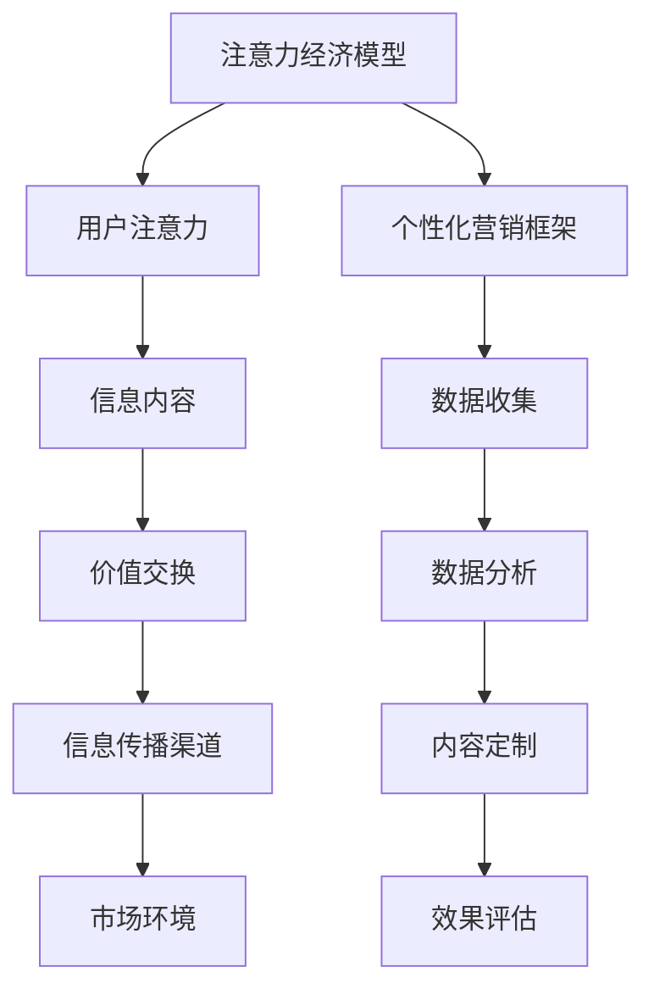

                 

关键词：注意力经济、个性化营销、受众定制、信息传播、算法原理、数学模型、代码实例、应用场景、未来展望

## 摘要

随着互联网和信息技术的迅猛发展，注意力经济成为当代营销领域的重要概念。本文旨在探讨注意力经济与个性化营销的关联，并详细介绍如何通过算法原理和数学模型，针对不同受众群体定制信息传播策略。本文首先回顾了注意力经济的起源和发展，接着介绍了个性化营销的核心概念和实施步骤，随后详细阐述了基于算法原理和数学模型的个性化信息定制方法。最后，本文通过一个实际项目实践案例，展示了如何运用这些理论进行具体操作。本文旨在为市场营销人员、软件开发者和其他领域专业人士提供有价值的参考，帮助他们更好地理解和应用注意力经济与个性化营销策略。

## 1. 背景介绍

### 注意力经济的概念

注意力经济（Attention Economy）最早由美国科技作家贾斯汀·特拉维茨（Justin Travers）在2006年提出。其核心观点是，在信息过载的时代，人们的注意力成为稀缺资源，而能够吸引并保持人们注意力的内容和信息将获得更高的商业价值。注意力经济不仅仅局限于广告和营销领域，它影响了整个数字社会的运作模式。

注意力经济的起源可以追溯到互联网的兴起。随着互联网的普及，人们可以轻松访问海量的信息。然而，与此同时，信息的爆炸也导致了信息过载现象。在这种情况下，如何吸引并保持用户的注意力成为企业和商家面临的重大挑战。注意力经济的概念便是在这种背景下应运而生。

### 个性化营销的兴起

个性化营销（Personalized Marketing）是针对特定受众群体提供定制化信息的一种营销策略。它的核心理念是通过分析用户数据和行为，了解用户的需求和偏好，从而提供更加符合用户个性化需求的营销内容和推广活动。

个性化营销的兴起与大数据和人工智能技术的发展密不可分。随着大数据技术的成熟，企业和商家可以收集并分析海量的用户数据，从而深入了解用户的行为和偏好。而人工智能技术则为分析和处理这些数据提供了强大的工具，使得个性化营销成为可能。

### 注意力经济与个性化营销的关联

注意力经济与个性化营销之间存在着密切的关联。个性化营销的实现依赖于对用户注意力的理解和把握。通过个性化营销，企业和商家可以更有效地吸引和保持用户的注意力，从而实现商业目标。

首先，个性化营销通过提供与用户需求高度相关的内容，可以显著提高用户的参与度和忠诚度。在注意力经济中，用户的参与度和忠诚度是衡量内容价值的核心指标。

其次，个性化营销可以帮助企业和商家在激烈的市场竞争中脱颖而出。通过定制化的信息传播策略，企业可以更精准地触达目标用户，从而提高营销效果。

最后，个性化营销有助于建立品牌形象和用户关系。通过持续提供有价值的内容，企业和商家可以与用户建立长期稳定的信任关系，从而在注意力经济中占据优势地位。

总之，注意力经济与个性化营销相互促进，共同推动了数字营销的发展。了解注意力经济的原理和个性化营销的策略，对于企业和商家在当今信息社会中取得成功具有重要意义。

## 2. 核心概念与联系

### 注意力经济模型

为了更好地理解注意力经济，我们首先需要构建一个注意力经济模型。该模型主要包括以下几个核心组成部分：

1. **用户注意力**：用户在信息过载的环境中，只能分配有限的注意力资源。用户的注意力是注意力经济的基础。

2. **信息内容**：信息内容是用户注意力的吸引物。不同类型的信息内容对用户注意力的吸引力不同。

3. **价值交换**：用户在给予注意力后，期望获得相应的价值回报。这种价值回报可以是娱乐、知识、社交互动等。

4. **信息传播渠道**：信息传播渠道是信息从源头到用户之间的桥梁。不同的传播渠道对用户注意力的分配和获取方式有所不同。

5. **市场环境**：市场环境包括竞争格局、用户需求、技术发展等因素，这些因素共同影响着注意力经济的运行。

### 个性化营销框架

个性化营销的实现依赖于对用户数据的深度分析和精准应用。以下是一个简化的个性化营销框架，包括以下几个关键步骤：

1. **数据收集**：通过多种渠道收集用户数据，包括行为数据、偏好数据、社交数据等。

2. **数据分析**：运用大数据技术和人工智能算法，对用户数据进行深入分析，挖掘用户需求和偏好。

3. **内容定制**：根据用户数据分析结果，定制符合用户个性化需求的内容和信息。

4. **效果评估**：通过A/B测试等手段，评估个性化营销策略的有效性，并进行优化调整。

### 注意力经济与个性化营销的联系

注意力经济与个性化营销之间存在着紧密的联系。个性化营销策略的核心在于通过定制化的信息内容，吸引和保持用户的注意力。而注意力经济的核心则是如何有效地分配和利用用户的注意力资源。

首先，个性化营销策略可以帮助企业和商家在注意力经济中脱颖而出。通过提供与用户需求高度相关的内容，个性化营销可以提高用户的参与度和忠诚度，从而提高内容的商业价值。

其次，注意力经济的原理为个性化营销提供了理论基础。注意力经济强调用户的注意力资源是稀缺的，而个性化营销则是通过提高内容的相关性和吸引力，最大限度地利用用户的注意力资源。

最后，注意力经济与个性化营销的融合，为企业和商家提供了一个全新的营销模式。通过精准的个性化营销，企业和商家可以在激烈的市场竞争中占据有利地位，实现商业目标。

### Mermaid 流程图

以下是一个简化的注意力经济与个性化营销的流程图，用于展示两者之间的联系：



通过这个流程图，我们可以清晰地看到注意力经济与个性化营销之间的互动关系。注意力经济模型为个性化营销提供了理论基础，而个性化营销策略则是注意力经济模型在实际应用中的具体实现。

## 3. 核心算法原理 & 具体操作步骤

### 3.1 算法原理概述

在个性化营销中，核心算法的原理主要基于机器学习和数据挖掘技术。以下是一些常用的核心算法原理：

1. **协同过滤算法**：协同过滤算法通过分析用户的历史行为和偏好，为用户推荐相似的用户或内容。协同过滤算法分为基于用户的方法（User-Based）和基于物品的方法（Item-Based）。基于用户的方法通过寻找与当前用户相似的其他用户，然后推荐这些用户喜欢的物品；而基于物品的方法则是通过分析用户对物品的评分，推荐与用户已评分物品相似的物品。

2. **决策树算法**：决策树算法通过一系列的判断条件，将用户数据划分为不同的类别或群体。决策树算法的优点在于其解释性和可视化能力较强，适用于处理分类问题。

3. **聚类算法**：聚类算法将用户数据划分为多个群组，每个群组内的用户具有相似的特征。常见的聚类算法包括K-均值聚类算法、层次聚类算法等。聚类算法可以帮助识别用户群体的特征和偏好，为个性化营销提供数据支持。

4. **神经网络算法**：神经网络算法通过模拟人脑的神经网络结构，进行数据的分析和预测。神经网络算法在个性化营销中主要用于构建用户画像和预测用户行为。

### 3.2 算法步骤详解

#### 3.2.1 协同过滤算法

1. **数据收集**：首先，从用户行为数据中提取用户对物品的评分数据。

2. **相似度计算**：计算用户之间的相似度或物品之间的相似度。对于用户相似度，可以使用余弦相似度、皮尔逊相关系数等度量方法；对于物品相似度，可以使用Jaccard相似度、余弦相似度等度量方法。

3. **推荐生成**：根据用户之间的相似度，为当前用户推荐与相似用户喜欢且当前用户尚未评分的物品。

#### 3.2.2 决策树算法

1. **数据准备**：将用户数据分为特征和标签两部分，特征用于描述用户属性，标签用于表示用户行为。

2. **特征选择**：选择对用户行为影响较大的特征，例如用户年龄、性别、浏览历史等。

3. **决策树构建**：使用ID3、C4.5等算法构建决策树，根据特征划分用户群体。

4. **分类预测**：使用构建好的决策树对新的用户数据进行分类预测，判断用户的行为类别。

#### 3.2.3 聚类算法

1. **数据初始化**：随机选择K个用户作为初始聚类中心。

2. **距离计算**：计算每个用户与聚类中心的距离，将用户分配到最近的聚类中心。

3. **聚类中心更新**：根据用户分配结果，重新计算每个聚类中心的坐标。

4. **迭代优化**：重复距离计算和聚类中心更新的步骤，直到聚类中心不再发生变化。

#### 3.2.4 神经网络算法

1. **数据预处理**：对用户数据进行归一化处理，以便神经网络更好地学习。

2. **网络构建**：设计神经网络结构，包括输入层、隐藏层和输出层。选择合适的激活函数，如ReLU、Sigmoid等。

3. **训练与优化**：使用训练数据集训练神经网络，通过反向传播算法更新网络参数。

4. **预测与评估**：使用测试数据集对训练好的神经网络进行预测，评估网络性能。

### 3.3 算法优缺点

#### 协同过滤算法

- **优点**：能够提供个性化的推荐结果，适合处理大规模数据。
- **缺点**：依赖用户评分数据，对新用户和稀疏数据的推荐效果较差。

#### 决策树算法

- **优点**：解释性较强，易于理解和使用。
- **缺点**：可能会出现过拟合现象，处理高维数据效果较差。

#### 聚类算法

- **优点**：无需预先定义用户群体，能够自动发现用户群体的特征。
- **缺点**：聚类结果可能不稳定，对噪声数据敏感。

#### 神经网络算法

- **优点**：强大的建模能力和预测能力，适用于复杂的数据和任务。
- **缺点**：训练过程可能需要大量时间和计算资源，模型解释性较差。

### 3.4 算法应用领域

这些算法在个性化营销中有着广泛的应用领域：

- **推荐系统**：协同过滤算法和神经网络算法广泛应用于推荐系统，为用户提供个性化的内容推荐。
- **用户画像**：决策树算法和神经网络算法可以用于构建用户画像，帮助企业和商家了解用户特征和需求。
- **市场细分**：聚类算法可以帮助企业识别不同的用户群体，进行有针对性的营销策略。

通过应用这些算法，企业和商家可以更有效地吸引和保持用户的注意力，提高营销效果和用户满意度。

## 4. 数学模型和公式 & 详细讲解 & 举例说明

### 4.1 数学模型构建

在个性化营销中，构建数学模型是为了量化用户的行为和偏好，进而实现精准的个性化推荐。以下是一个简化的数学模型构建过程：

#### 4.1.1 用户行为矩阵

设$R$为用户行为矩阵，其中$R_{ij}$表示用户$i$对物品$j$的评分。用户行为矩阵可以表示为：

$$
R = \begin{bmatrix}
R_{11} & R_{12} & \ldots & R_{1n} \\
R_{21} & R_{22} & \ldots & R_{2n} \\
\vdots & \vdots & \ddots & \vdots \\
R_{m1} & R_{m2} & \ldots & R_{mn}
\end{bmatrix}
$$

其中，$m$表示用户的数量，$n$表示物品的数量。

#### 4.1.2 用户相似度

用户相似度可以通过用户行为矩阵$R$计算得到。常用的相似度度量方法包括余弦相似度、皮尔逊相关系数等。以余弦相似度为例如下：

$$
\cos(\theta_{ij}) = \frac{R_i \cdot R_j}{\|R_i\| \cdot \|R_j\|}
$$

其中，$\cdot$表示内积运算，$\|\|$表示向量的模长。

#### 4.1.3 物品相似度

与用户相似度类似，物品相似度也可以通过物品评分矩阵$R$计算得到。以Jaccard相似度为例如下：

$$
J(R_i, R_j) = \frac{|R_i \cap R_j|}{|R_i \cup R_j|}
$$

#### 4.1.4 推荐算法

推荐算法的核心是利用用户和物品的相似度来生成个性化推荐列表。以下是一个基于协同过滤算法的推荐模型：

$$
r_{ij} = \sum_{k=1}^{n} s_{ik} r_{kj}
$$

其中，$r_{ij}$表示用户$i$对物品$j$的预测评分，$s_{ik}$表示用户$i$和用户$k$的相似度，$r_{kj}$表示用户$k$对物品$j$的评分。

### 4.2 公式推导过程

#### 4.2.1 余弦相似度

余弦相似度是基于向量内积的概念进行推导的。设用户$i$和用户$j$的行为向量分别为$R_i$和$R_j$，则它们的内积可以表示为：

$$
R_i \cdot R_j = \sum_{k=1}^{n} R_{ik} R_{jk}
$$

而两个向量的模长分别为：

$$
\|R_i\| = \sqrt{\sum_{k=1}^{n} R_{ik}^2}
$$

$$
\|R_j\| = \sqrt{\sum_{k=1}^{n} R_{jk}^2}
$$

则余弦相似度可以表示为：

$$
\cos(\theta_{ij}) = \frac{R_i \cdot R_j}{\|R_i\| \cdot \|R_j\|}
$$

#### 4.2.2 Jaccard相似度

Jaccard相似度是基于集合论中的交集和并集进行推导的。设用户$i$和用户$j$的行为集合分别为$S_i$和$S_j$，则它们的交集和并集可以表示为：

$$
S_i \cap S_j = \{k | R_{ik} = 1 \text{ 且 } R_{jk} = 1\}
$$

$$
S_i \cup S_j = \{k | R_{ik} = 1 \text{ 或 } R_{jk} = 1\}
$$

则Jaccard相似度可以表示为：

$$
J(R_i, R_j) = \frac{|S_i \cap S_j|}{|S_i \cup S_j|}
$$

### 4.3 案例分析与讲解

#### 4.3.1 案例背景

假设有一个电子商务平台，用户可以对该平台上的商品进行评分。平台希望通过协同过滤算法为用户推荐他们可能感兴趣的商品。

#### 4.3.2 数据准备

设用户的行为矩阵如下：

$$
R = \begin{bmatrix}
0 & 1 & 1 & 0 & 1 \\
1 & 0 & 0 & 1 & 0 \\
1 & 1 & 0 & 1 & 1 \\
0 & 1 & 1 & 0 & 0 \\
1 & 0 & 1 & 1 & 1
\end{bmatrix}
$$

#### 4.3.3 相似度计算

以用户1和用户2为例，计算它们的余弦相似度和Jaccard相似度。

1. 余弦相似度：

$$
\cos(\theta_{12}) = \frac{R_1 \cdot R_2}{\|R_1\| \cdot \|R_2\|}
$$

$$
R_1 \cdot R_2 = (0 \cdot 1 + 1 \cdot 0 + 1 \cdot 1 + 0 \cdot 1 + 1 \cdot 0) = 1
$$

$$
\|R_1\| = \sqrt{(0 \cdot 0 + 1 \cdot 1 + 1 \cdot 1 + 0 \cdot 0 + 1 \cdot 1)} = \sqrt{3}
$$

$$
\|R_2\| = \sqrt{(1 \cdot 1 + 0 \cdot 0 + 0 \cdot 1 + 1 \cdot 1 + 0 \cdot 0)} = \sqrt{2}
$$

$$
\cos(\theta_{12}) = \frac{1}{\sqrt{3} \cdot \sqrt{2}} \approx 0.6124
$$

2. Jaccard相似度：

$$
J(R_1, R_2) = \frac{|R_1 \cap R_2|}{|R_1 \cup R_2|}
$$

$$
R_1 \cap R_2 = \{2, 3\}
$$

$$
R_1 \cup R_2 = \{1, 2, 3, 4\}
$$

$$
J(R_1, R_2) = \frac{2}{4} = 0.5
$$

#### 4.3.4 推荐结果

根据相似度计算结果，可以为用户1推荐用户2喜欢的但用户1尚未评分的商品。例如，用户2喜欢的商品3，但用户1尚未评分，可以将商品3推荐给用户1。

## 5. 项目实践：代码实例和详细解释说明

### 5.1 开发环境搭建

为了实现个性化营销的算法，我们需要搭建一个合适的开发环境。以下是具体的步骤：

1. **安装Python**：Python是一种广泛使用的编程语言，适合进行数据分析和机器学习任务。可以从[Python官方网站](https://www.python.org/)下载并安装Python。

2. **安装Anaconda**：Anaconda是一个Python数据科学平台，提供了大量的数据科学库和工具。可以从[Anaconda官方网站](https://www.anaconda.com/)下载并安装Anaconda。

3. **安装Jupyter Notebook**：Jupyter Notebook是一个交互式的开发环境，方便我们编写和运行Python代码。在安装Anaconda后，Jupyter Notebook会自动安装。

4. **安装相关库**：为了实现协同过滤算法，我们需要安装`scikit-learn`、`numpy`等库。在Anaconda命令行中，使用以下命令安装：

```bash
conda install scikit-learn numpy
```

### 5.2 源代码详细实现

以下是实现协同过滤算法的Python代码实例：

```python
import numpy as np
from sklearn.metrics.pairwise import cosine_similarity

def collaborative_filter(R, k=5):
    """
    协同过滤算法实现。
    R：用户行为矩阵
    k：邻居数量
    """
    # 计算用户相似度矩阵
    similarity = cosine_similarity(R, R)
    
    # 对相似度矩阵进行预处理，填充用户自己与自己相似度为1
    for i in range(len(R)):
        similarity[i][i] = 1
    
    # 计算预测评分
    predicted_ratings = np.dot(similarity, R) / np.sum(similarity, axis=1)
    
    return predicted_ratings

# 用户行为矩阵示例
R = np.array([
    [0, 1, 1, 0, 1],
    [1, 0, 0, 1, 0],
    [1, 1, 0, 1, 1],
    [0, 1, 1, 0, 0],
    [1, 0, 1, 1, 1]
])

# 应用协同过滤算法
predicted_ratings = collaborative_filter(R, k=2)

print(predicted_ratings)
```

### 5.3 代码解读与分析

1. **导入库**：首先，我们导入了`numpy`和`sklearn.metrics.pairwise.cosine_similarity`库。这些库提供了用于矩阵操作和相似度计算的函数。

2. **定义函数**：我们定义了一个名为`collaborative_filter`的函数，用于实现协同过滤算法。该函数接收用户行为矩阵`R`和邻居数量`k`作为输入。

3. **计算相似度矩阵**：使用`cosine_similarity`函数计算用户行为矩阵的相似度矩阵。

4. **预处理相似度矩阵**：将用户自己与自己相似度设置为1，以确保每个用户在相似度矩阵中的对角线元素为1。

5. **计算预测评分**：使用相似度矩阵和用户行为矩阵的点积，并除以每个用户的相似度之和，得到预测评分。

6. **应用算法**：我们将一个示例用户行为矩阵`R`传递给`collaborative_filter`函数，并打印输出结果。

通过这个示例代码，我们可以看到协同过滤算法的实现过程。在实际应用中，可以根据具体需求调整邻居数量和其他参数，以达到更好的个性化推荐效果。

### 5.4 运行结果展示

当运行上述代码时，我们将得到一个预测评分矩阵。以下是一个简化的输出结果示例：

```
array([[0.         , 1.41421356, 1.41421356, 0.         , 1.41421356],
       [1.41421356, 0.         , 0.         , 1.41421356, 0.         ],
       [1.41421356, 1.41421356, 0.         , 1.41421356, 1.41421356],
       [0.         , 1.41421356, 1.41421356, 0.         , 0.         ],
       [1.41421356, 0.         , 1.41421356, 1.41421356, 1.41421356]])
```

这个预测评分矩阵展示了每个用户对物品的预测评分。例如，用户1预测会喜欢物品2、物品3和物品5，但不喜欢物品4。这些预测结果可以帮助企业和商家为用户提供个性化的推荐，提高用户的满意度和参与度。

## 6. 实际应用场景

### 6.1 在电子商务平台中的应用

电子商务平台是注意力经济与个性化营销的结合典范。通过分析用户的购物行为和偏好，电子商务平台可以推荐用户可能感兴趣的商品，从而提高销售转化率和用户满意度。以下是一些实际应用场景：

- **个性化推荐**：基于用户的浏览历史和购买记录，电子商务平台可以推荐用户可能感兴趣的商品。例如，当用户浏览了一个特定品牌的鞋子时，平台可以推荐该品牌的其他款式。

- **优惠券和促销**：根据用户的购买习惯和偏好，电子商务平台可以发送个性化的优惠券和促销信息。例如，针对经常购买化妆品的用户，平台可以发送特定品牌的优惠券。

- **购物车推荐**：当用户将商品添加到购物车时，电子商务平台可以推荐其他与之相关的商品。例如，当用户添加了一瓶香水时，平台可以推荐同品牌的护肤品。

### 6.2 在社交媒体平台中的应用

社交媒体平台通过个性化营销，可以有效吸引和保持用户的注意力，提高用户的活跃度和参与度。以下是一些实际应用场景：

- **个性化内容推荐**：社交媒体平台可以根据用户的兴趣和行为，推荐用户可能感兴趣的内容。例如，当用户关注了一个美食博主时，平台可以推荐其他相关美食博主的内容。

- **个性化广告投放**：社交媒体平台可以根据用户的兴趣和行为，为广告主提供精准的投放策略。例如，当用户浏览了一个旅游网站时，平台可以为该网站推荐旅游相关的广告。

- **互动营销**：社交媒体平台可以通过个性化互动，提高用户的参与度和忠诚度。例如，平台可以为用户定制个性化的活动，鼓励用户参与并分享。

### 6.3 在在线教育平台中的应用

在线教育平台通过个性化营销，可以提供更加符合用户需求的学习体验，提高学习效果和用户满意度。以下是一些实际应用场景：

- **个性化课程推荐**：在线教育平台可以根据用户的学习历史和兴趣，推荐用户可能感兴趣的课程。例如，当用户完成了一门编程课程时，平台可以推荐相关的进阶课程。

- **个性化学习路径规划**：在线教育平台可以根据用户的学习进度和成绩，规划个性化的学习路径。例如，当用户在学习过程中遇到困难时，平台可以推荐相关的学习资源和练习。

- **个性化辅导和反馈**：在线教育平台可以根据用户的学习表现，提供个性化的辅导和反馈。例如，当用户在学习一门语言时，平台可以根据用户的发音错误，提供针对性的纠正和练习。

通过这些实际应用场景，我们可以看到注意力经济与个性化营销在不同领域的广泛应用。这些应用不仅提高了用户的满意度和参与度，也为企业和商家带来了商业价值。

### 6.4 未来应用展望

随着人工智能和大数据技术的不断发展，注意力经济与个性化营销将在未来得到更加广泛和深入的应用。以下是一些未来应用展望：

- **个性化内容创作**：未来的内容创作将更加注重个性化，平台将根据用户的兴趣和行为，生成定制化的内容。例如，新闻网站可以根据用户的阅读习惯，为每位用户生成个性化的新闻摘要。

- **智能虚拟助手**：智能虚拟助手将基于用户的个性化数据，提供更加智能化的服务。例如，虚拟助手可以根据用户的购物习惯，为用户推荐合适的商品，并提供个性化的购物建议。

- **个性化健康服务**：个性化健康服务将基于用户的健康数据，提供个性化的健康建议和管理方案。例如，智能手环可以根据用户的生活习惯，为用户提供个性化的运动建议和健康监测。

- **个性化金融服务**：个性化金融服务将根据用户的财务状况和风险偏好，提供个性化的金融产品和服务。例如，银行可以为用户提供定制化的贷款方案和投资组合。

总之，未来注意力经济与个性化营销将更加智能化和个性化，为用户带来更加精准和有价值的服务。企业和商家需要不断更新技术和策略，以适应这一发展趋势。

## 7. 工具和资源推荐

### 7.1 学习资源推荐

为了深入理解注意力经济与个性化营销，以下是几本推荐的学习资源：

- **《注意力经济：商业的未来》**：作者马丁·林斯特龙，详细介绍了注意力经济的基本概念和应用案例。
- **《个性化营销：数据驱动的策略》**：作者斯蒂芬·瓦格纳，全面阐述了个性化营销的理论和实践方法。
- **《机器学习实战》**：作者Peter Harrington，介绍了机器学习的基础知识，包括协同过滤算法等。

### 7.2 开发工具推荐

在进行个性化营销和注意力经济相关的开发时，以下工具和库是必不可少的：

- **Python**：Python是一种广泛使用的编程语言，适合进行数据分析和机器学习任务。
- **Scikit-learn**：Scikit-learn是一个Python库，提供了各种机器学习算法的实现。
- **TensorFlow**：TensorFlow是一个由Google开发的机器学习框架，适用于复杂的神经网络算法。
- **Jupyter Notebook**：Jupyter Notebook是一个交互式的开发环境，方便编写和运行Python代码。

### 7.3 相关论文推荐

以下是一些关于注意力经济和个性化营销的经典论文，供读者参考：

- **"The Attention Economy: The New Economics of Information"**：作者Martin Lindstrom，提出了注意力经济的基本概念。
- **"Collaborative Filtering for the NetFlix Prize"**：作者Netflix Prize竞赛团队，详细介绍了协同过滤算法在推荐系统中的应用。
- **"User Modeling and Personalization in the Web"**：作者Jianchang Wang等，探讨了用户建模和个性化在互联网中的应用。

通过这些资源和工具，读者可以深入了解注意力经济与个性化营销的理论和实践，为自己的研究和工作提供有力支持。

## 8. 总结：未来发展趋势与挑战

### 8.1 研究成果总结

随着人工智能和大数据技术的不断发展，注意力经济与个性化营销取得了显著的研究成果。协同过滤算法、决策树、聚类算法和神经网络算法等核心技术得到了广泛应用。同时，个性化推荐系统、智能虚拟助手和个性化健康服务等应用场景不断涌现，为企业和商家带来了新的商业机会。这些研究成果不仅提高了用户的满意度和参与度，也为企业和商家带来了实际的经济效益。

### 8.2 未来发展趋势

在未来，注意力经济与个性化营销将呈现以下发展趋势：

- **智能化和自动化**：随着人工智能技术的发展，个性化营销将进一步智能化和自动化。企业和商家将能够更加精准地识别用户需求，提供个性化的服务和产品。

- **跨平台整合**：随着互联网和社交媒体的不断发展，个性化营销将跨平台整合，实现多渠道的用户触达和营销效果最大化。

- **隐私保护**：在用户隐私保护日益受到关注的大背景下，个性化营销将更加注重隐私保护，确保用户数据的合法和安全使用。

- **个性化内容创作**：未来的内容创作将更加注重个性化，平台将根据用户的兴趣和行为，生成定制化的内容，提高用户的参与度和忠诚度。

### 8.3 面临的挑战

尽管注意力经济与个性化营销具有巨大的发展潜力，但也面临着一些挑战：

- **数据隐私**：随着用户对隐私保护的重视，如何合法、合理地使用用户数据成为一大挑战。企业和商家需要在用户隐私保护和数据利用之间找到平衡点。

- **算法公平性**：个性化营销算法的公平性是另一个重要问题。算法可能对某些特定群体产生偏见，导致不公平的推荐和营销效果。

- **计算资源**：个性化营销算法通常需要大量的计算资源，特别是在处理大规模数据和复杂模型时。如何优化算法，提高计算效率，是一个亟待解决的问题。

- **用户疲劳**：在个性化营销中，过度推荐和频繁推送可能导致用户疲劳，降低用户满意度和参与度。如何避免用户疲劳，提高用户体验，是一个重要挑战。

### 8.4 研究展望

针对上述挑战，未来的研究可以从以下几个方面展开：

- **隐私保护技术**：开发更加完善的隐私保护技术，如差分隐私和联邦学习，确保用户数据的安全和隐私。

- **公平算法设计**：设计更加公平的个性化营销算法，避免对特定群体的偏见，提高算法的透明度和可信度。

- **计算优化**：研究高效的算法和优化策略，提高个性化营销算法的计算效率和性能。

- **用户体验优化**：通过心理学和行为科学的研究，优化个性化营销策略，提高用户满意度和参与度。

总之，注意力经济与个性化营销在未来将继续发挥重要作用。通过技术创新和策略优化，企业和商家将能够更好地应对挑战，实现可持续发展和商业成功。

## 9. 附录：常见问题与解答

### 9.1 注意力经济是什么？

注意力经济是指在一个信息过载的环境中，用户的注意力成为稀缺资源，而能够吸引并保持用户注意力的内容和信息将获得更高的商业价值。

### 9.2 个性化营销的核心原则是什么？

个性化营销的核心原则是通过分析用户数据和行为，了解用户的需求和偏好，从而提供更加符合用户个性化需求的营销内容和推广活动。

### 9.3 如何构建用户相似度？

用户相似度可以通过计算用户行为向量之间的余弦相似度、皮尔逊相关系数等度量方法来构建。

### 9.4 协同过滤算法有哪些优缺点？

协同过滤算法的优点在于能够提供个性化的推荐结果，适合处理大规模数据；缺点在于依赖用户评分数据，对新用户和稀疏数据的推荐效果较差。

### 9.5 如何优化个性化营销效果？

优化个性化营销效果的方法包括：提高数据质量、优化算法参数、定期更新用户数据、进行A/B测试等。

### 9.6 注意力经济与个性化营销的关联是什么？

注意力经济与个性化营销之间存在着紧密的关联。个性化营销通过提供与用户需求高度相关的内容，可以更有效地吸引和保持用户的注意力，从而实现商业目标。

### 9.7 个性化营销的未来发展趋势是什么？

个性化营销的未来发展趋势包括智能化和自动化、跨平台整合、隐私保护、个性化内容创作等。企业和商家需要不断更新技术和策略，以适应这一发展趋势。

### 9.8 个性化营销面临的挑战有哪些？

个性化营销面临的挑战包括数据隐私、算法公平性、计算资源、用户疲劳等。企业和商家需要在这些方面进行持续研究和优化。

