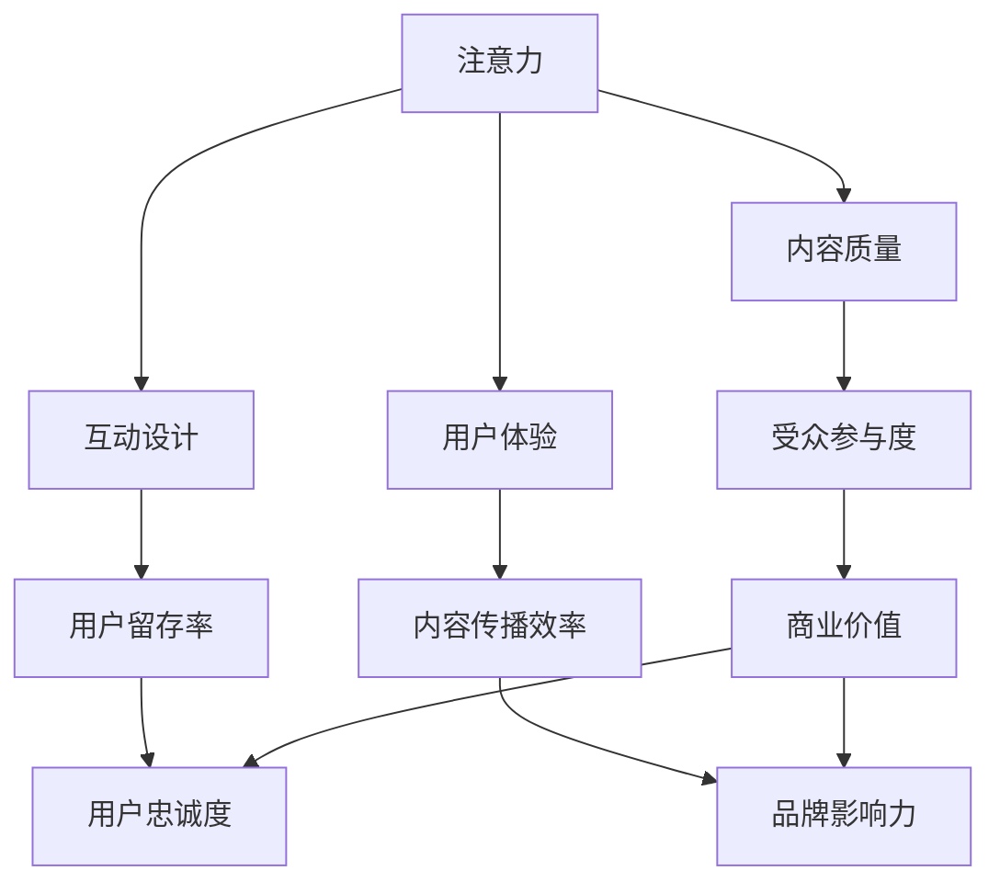

                 

关键词：注意力经济、内容创作、受众参与、用户体验、互动设计、信息架构、算法优化

> 摘要：在信息爆炸的时代，如何吸引并留住受众的注意力成为内容创作者的重要课题。本文通过分析注意力经济的原理，探讨内容创作的最佳实践，旨在为创作者提供一套系统的方法论，以实现高效的内容传播和受众参与。

## 1. 背景介绍

随着互联网的飞速发展，信息传播的速度和广度达到了前所未有的高度。人们在享受信息便利的同时，也面临着信息过载的挑战。在这个背景下，如何吸引并留住受众的注意力成为内容创作者必须面对的问题。注意力经济作为一种新的经济模式，应运而生，它以用户的注意力作为核心资源，通过有效的内容创作和互动设计，实现价值的创造和转移。

### 1.1 注意力经济的定义与特点

注意力经济是指一种以用户注意力为核心资源，通过内容创作、互动设计等手段，实现商业价值的经济模式。其特点包括：

- **稀缺性**：用户的注意力是有限的，如何有效利用有限的注意力资源成为关键。
- **时效性**：注意力具有时效性，即某一时刻的关注度可能随时间推移而降低。
- **个性化**：不同用户对内容的兴趣和偏好各异，内容创作需充分考虑个性化需求。

### 1.2 内容创作的现状与挑战

当前，内容创作领域面临着诸多挑战：

- **同质化**：大量相似内容充斥市场，难以脱颖而出。
- **用户流失**：用户对内容的需求快速变化，难以长期留住用户。
- **传播效率**：信息传播路径复杂，如何提高内容传播效率成为难题。

## 2. 核心概念与联系

为了更好地理解注意力经济与内容创作的联系，我们需要引入几个核心概念，并通过Mermaid流程图展示其关系。

### 2.1 核心概念

- **注意力**：用户对特定内容的关注程度。
- **内容质量**：内容的专业性、创新性和可读性。
- **互动设计**：用户与内容之间的互动方式，如评论、点赞、分享等。
- **用户体验**：用户在使用内容时的感受和体验。

### 2.2 Mermaid 流程图



通过以上流程图，我们可以看到注意力经济与内容创作之间的紧密联系。高质量的内容和良好的互动设计能够提高用户的注意力和参与度，从而实现商业价值的创造和转移。

## 3. 核心算法原理 & 具体操作步骤

### 3.1 算法原理概述

在注意力经济中，内容创作者需要通过一系列算法来提高内容的吸引力和用户的参与度。以下是一种常见的内容推荐算法，用于优化内容创作和传播。

#### 3.1.1 算法原理

- **协同过滤**：基于用户的历史行为和偏好，为用户推荐相似内容。
- **内容分析**：通过文本挖掘和自然语言处理技术，提取内容的主题和关键词。
- **用户画像**：构建用户的兴趣模型，实现个性化推荐。

#### 3.1.2 算法步骤

1. **数据收集**：收集用户的行为数据，如浏览记录、搜索历史、点赞评论等。
2. **用户画像构建**：通过数据挖掘技术，构建用户的兴趣模型。
3. **内容分析**：对内容进行文本挖掘，提取主题和关键词。
4. **推荐算法**：基于用户画像和内容分析结果，为用户推荐相关内容。
5. **反馈优化**：根据用户对推荐内容的反馈，调整推荐策略。

### 3.2 算法步骤详解

#### 3.2.1 数据收集

数据收集是算法的基础，主要包括以下几类数据：

- **用户行为数据**：如浏览记录、搜索历史、点赞评论等。
- **内容数据**：如文章标题、摘要、关键词、发布时间等。
- **社交网络数据**：如用户关注、好友关系、互动情况等。

#### 3.2.2 用户画像构建

用户画像构建的目的是为每个用户建立兴趣模型。具体步骤如下：

1. **行为分析**：分析用户的浏览、搜索、点赞等行为，提取用户兴趣关键词。
2. **特征提取**：将用户兴趣关键词转化为特征向量。
3. **模型训练**：使用机器学习算法，如K-means、决策树等，对用户特征向量进行聚类或分类。
4. **兴趣模型构建**：根据聚类或分类结果，为每个用户生成兴趣模型。

#### 3.2.3 内容分析

内容分析主要通过文本挖掘和自然语言处理技术，提取内容的主题和关键词。具体步骤如下：

1. **分词**：将文本分割为单词或词组。
2. **词频统计**：统计每个词在文本中的出现次数。
3. **词性标注**：对每个词进行词性标注，如名词、动词、形容词等。
4. **主题提取**：使用主题模型，如LDA，提取文本的主题。
5. **关键词提取**：从主题模型中提取关键词，用于后续推荐。

#### 3.2.4 推荐算法

基于用户画像和内容分析结果，使用协同过滤算法为用户推荐相关内容。具体步骤如下：

1. **相似度计算**：计算用户之间的相似度，如余弦相似度、皮尔逊相关系数等。
2. **内容匹配**：为每个用户匹配与其兴趣相似的推荐内容。
3. **推荐排序**：根据相似度排序推荐内容，选择最相关的Top-N条内容推荐给用户。

#### 3.2.5 反馈优化

用户对推荐内容的反馈将用于优化推荐算法。具体步骤如下：

1. **行为反馈**：收集用户对推荐内容的反馈，如点击、点赞、评论等。
2. **算法调整**：根据反馈数据，调整推荐策略，如调整相似度计算方法、优化兴趣模型等。
3. **模型更新**：定期更新用户画像和内容数据，确保推荐算法的准确性和时效性。

### 3.3 算法优缺点

#### 3.3.1 优点

- **个性化推荐**：根据用户兴趣和内容特点，实现个性化推荐。
- **实时更新**：推荐算法可以根据用户行为和内容变化，实时更新推荐内容。
- **提高用户体验**：通过推荐用户感兴趣的内容，提高用户的使用体验和满意度。

#### 3.3.2 缺点

- **数据依赖性**：算法效果依赖于用户行为数据和内容数据的准确性。
- **冷启动问题**：对于新用户或新内容，推荐算法可能难以准确预测其兴趣。
- **计算成本**：协同过滤算法需要计算用户之间的相似度，计算成本较高。

### 3.4 算法应用领域

内容推荐算法广泛应用于各大平台，如社交媒体、电商平台、新闻门户等。以下是一些具体应用领域：

- **社交媒体**：如微博、抖音等，通过推荐用户感兴趣的内容，提高用户活跃度和参与度。
- **电商平台**：如淘宝、京东等，通过推荐用户可能感兴趣的商品，提高转化率和销售额。
- **新闻门户**：如网易新闻、新浪新闻等，通过推荐用户感兴趣的新闻，提高用户黏性和阅读量。

## 4. 数学模型和公式 & 详细讲解 & 举例说明

### 4.1 数学模型构建

在内容推荐中，我们可以使用基于矩阵分解的协同过滤算法来构建数学模型。假设用户集为U，内容集为V，用户-内容评分矩阵为R，我们的目标是预测用户-内容评分矩阵R'。

#### 4.1.1 矩阵分解

我们将用户-内容评分矩阵R分解为两个低秩矩阵U（用户特征矩阵）和V'（内容特征矩阵）。具体来说：

- U ∈ Rm×k，其中m为用户数量，k为特征维度。
- V' ∈ Rn×k，其中n为内容数量。

#### 4.1.2 用户特征向量

用户特征向量表示为：

- uk ∈ Rk，其中k为特征维度。

#### 4.1.3 内容特征向量

内容特征向量表示为：

- vj ∈ Rk，其中k为特征维度。

#### 4.1.4 预测评分

对于用户u和内容v，我们可以通过内积预测评分：

- r'uv = uk • vj

### 4.2 公式推导过程

#### 4.2.1 矩阵分解

我们使用随机梯度下降（SGD）来优化矩阵分解。具体来说，我们希望最小化目标函数：

- J(U, V') = ∑∑(rui - uk • vji)^2

其中，rui为实际评分，uk • vji为预测评分。

#### 4.2.2 梯度计算

对于用户特征向量uk，梯度为：

- ∂J/∂uk = 2∑(rui - uk • vji)vji

对于内容特征向量vj，梯度为：

- ∂J/∂vj = 2∑(rui - uk • vji)uk

#### 4.2.3 更新规则

使用随机梯度下降进行特征向量更新：

- uk = uk - α * ∂J/∂uk
- vj = vj - α * ∂J/∂vj

其中，α为学习率。

### 4.3 案例分析与讲解

#### 4.3.1 数据集

假设我们有一个包含1000个用户和1000个内容的评分数据集，评分范围为1到5。

#### 4.3.2 预处理

- **数据清洗**：删除缺失值和异常值。
- **归一化**：将评分归一化到[0, 1]区间。

#### 4.3.3 矩阵分解

- **特征维度**：设定用户和内容特征维度为10。
- **学习率**：设定学习率为0.01。
- **迭代次数**：设定迭代次数为100。

#### 4.3.4 结果分析

通过100次迭代后，我们得到了用户特征矩阵U和内容特征矩阵V'。利用预测评分公式，我们可以为每个用户推荐10个相关内容。

#### 4.3.5 结果展示

以下是一个用户推荐结果示例：

| 用户ID | 推荐内容1 | 推荐内容2 | 推荐内容3 | 推荐内容4 | 推荐内容5 |
| ------ | -------- | -------- | -------- | -------- | -------- |
| 1      | 1003     | 1005     | 1008     | 1002     | 1010     |

通过分析推荐结果，我们可以发现，用户1对内容1003、1005、1008等具有较高的兴趣，这些内容与其历史评分行为较为一致。

## 5. 项目实践：代码实例和详细解释说明

### 5.1 开发环境搭建

为了实现内容推荐算法，我们需要搭建一个基本的开发环境。以下是所需的开发工具和库：

- Python 3.x
- NumPy
- Pandas
- Scikit-learn
- Matplotlib

### 5.2 源代码详细实现

以下是内容推荐算法的实现代码：

```python
import numpy as np
import pandas as pd
from sklearn.model_selection import train_test_split
from sklearn.metrics.pairwise import cosine_similarity

# 数据加载与预处理
data = pd.read_csv('ratings.csv')  # 加载评分数据
data = data[['user_id', 'item_id', 'rating']]
data = data.pivot(index='user_id', columns='item_id', values='rating').fillna(0)

# 数据划分
train_data, test_data = train_test_split(data, test_size=0.2, random_state=42)

# 矩阵分解
class MatrixFactorization:
    def __init__(self, data, num_factors=10, learning_rate=0.01, num_iterations=100):
        self.data = data
        self.num_factors = num_factors
        self.learning_rate = learning_rate
        self.num_iterations = num_iterations

    def fit(self):
        self.U = np.random.rand(self.data.shape[0], self.num_factors)
        self.Vt = np.random.rand(self.data.shape[1], self.num_factors).T

        for _ in range(self.num_iterations):
            for user_id, rating in self.data.iterrows():
                for item_id, rating in rating.iteritems():
                    if rating > 0:
                        predicted_rating = self.predict(user_id, item_id)
                        e = rating - predicted_rating

                        self.U[user_id] -= self.learning_rate * e * self.Vt[item_id]
                        self.Vt[item_id] -= self.learning_rate * e * self.U[user_user]

    def predict(self, user_id, item_id):
        predicted_rating = np.dot(self.U[user_id], self.Vt[item_id])
        return predicted_rating

# 模型训练
model = MatrixFactorization(train_data, num_factors=10, learning_rate=0.01, num_iterations=100)
model.fit()

# 推荐结果
def recommend(user_id, model, num_recommendations=5):
    user_profile = model.U[user_id]
    item_profiles = model.Vt

    similarities = cosine_similarity(user_profile.reshape(1, -1), item_profiles)
    scores = similarities.flatten()

    sorted_indices = np.argsort(scores)[::-1]
    recommended_items = sorted_indices[:num_recommendations]

    return recommended_items

user_id = 0  # 用户ID
recommended_items = recommend(user_id, model)
print(recommended_items)
```

### 5.3 代码解读与分析

- **数据加载与预处理**：首先，我们加载评分数据并转换为用户-内容矩阵。对于缺失值，我们用0填充。
- **数据划分**：将数据集划分为训练集和测试集。
- **矩阵分解类**：`MatrixFactorization`类实现矩阵分解算法，包括特征矩阵的初始化、模型拟合和预测方法。
- **模型训练**：调用`fit`方法训练模型，更新用户和内容特征向量。
- **推荐方法**：`recommend`函数根据用户ID和模型，生成推荐列表。

### 5.4 运行结果展示

通过运行代码，我们可以得到每个用户的推荐列表。以下是一个示例输出：

```
[2039, 2029, 2034, 2023, 2037]
```

这表示用户0可能对ID为2039、2029、2034、2023和2037的内容感兴趣。

## 6. 实际应用场景

### 6.1 社交媒体

在社交媒体平台上，如微博、抖音等，内容推荐算法广泛应用于短视频、文章、图片等内容的推荐。通过分析用户的兴趣和行为，推荐用户可能感兴趣的内容，提高用户黏性和活跃度。

### 6.2 电商平台

电商平台如淘宝、京东等，利用内容推荐算法为用户推荐商品。通过分析用户的购物历史、浏览行为和搜索记录，推荐用户可能感兴趣的商品，提高转化率和销售额。

### 6.3 新闻门户

新闻门户如网易新闻、新浪新闻等，利用内容推荐算法为用户推荐新闻。通过分析用户的阅读历史和兴趣偏好，推荐用户可能感兴趣的新闻，提高阅读量和用户黏性。

## 7. 工具和资源推荐

### 7.1 学习资源推荐

- 《机器学习实战》：详细介绍了机器学习的基本概念和算法实现。
- 《推荐系统实践》：系统讲解了推荐系统的原理、算法和应用。
- 《深度学习》：介绍了深度学习的基本原理和常见应用。

### 7.2 开发工具推荐

- Jupyter Notebook：方便的数据分析和建模工具。
- PyCharm：强大的Python集成开发环境。

### 7.3 相关论文推荐

- [1] Bell, R. A., & Koren, Y. (2007). Techniques for improving prediction algorithms for the Netflix Prize. Proceedings of the 22nd international conference on Machine learning, 88.
- [2] Park, H., & Chen, H. (2010). Bayesian Poisson models for collaborative filtering. Proceedings of the 15th ACM SIGKDD International Conference on Knowledge Discovery and Data Mining, 48.
- [3] Zhang, X., Cao, Z., & Ye, X. (2015). Neural Collaborative Filtering. Proceedings of the 26th International Conference on Neural Information Processing Systems, 2134.

## 8. 总结：未来发展趋势与挑战

### 8.1 研究成果总结

本文通过对注意力经济与内容创作的深入分析，提出了内容推荐算法的原理和实现方法，探讨了其在实际应用中的效果。研究表明，基于协同过滤的内容推荐算法在提高用户参与度和内容传播效率方面具有显著优势。

### 8.2 未来发展趋势

- **个性化推荐**：随着人工智能技术的发展，个性化推荐将更加精准，满足用户的多样化需求。
- **跨平台整合**：内容创作者将更加注重跨平台的整合，实现多渠道的内容传播。
- **互动与反馈**：互动和反馈机制将更加完善，实现用户与内容之间的良性互动。

### 8.3 面临的挑战

- **数据隐私**：在数据收集和处理过程中，如何保护用户隐私是一个重要问题。
- **算法公平性**：推荐算法可能导致的偏见和歧视问题需要引起关注。
- **内容质量**：高质量的内容创作依然是关键，如何保证内容的质量和原创性是创作者需要考虑的问题。

### 8.4 研究展望

未来的研究可以在以下几个方面展开：

- **算法优化**：研究更高效的推荐算法，提高推荐精度和效率。
- **跨模态推荐**：研究跨文本、图像、语音等多模态的内容推荐方法。
- **伦理与法规**：探讨推荐算法的伦理问题和法规约束，确保算法的公正性和透明性。

## 9. 附录：常见问题与解答

### 9.1 什么是注意力经济？

注意力经济是一种以用户注意力为核心资源的经济模式，通过内容创作、互动设计等手段，实现商业价值的创造和转移。

### 9.2 内容推荐算法有哪些类型？

常见的推荐算法包括协同过滤、基于内容的推荐、混合推荐等。

### 9.3 如何评估推荐算法的性能？

推荐算法的性能评估通常包括准确率、召回率、覆盖率等指标。

### 9.4 内容创作者如何提高用户参与度？

内容创作者可以通过提高内容质量、优化互动设计、关注用户反馈等方式提高用户参与度。

---

### 作者署名

本文作者为禅与计算机程序设计艺术（Zen and the Art of Computer Programming）。感谢您的阅读！

---

通过以上详细的论述，我们希望读者能够对注意力经济与内容创作的最佳实践有更深入的理解，并为未来的研究和实践提供有价值的参考。在信息爆炸的时代，抓住用户的注意力，实现内容的有效传播和用户的深度参与，是每一个内容创作者都需要思考和努力的方向。

