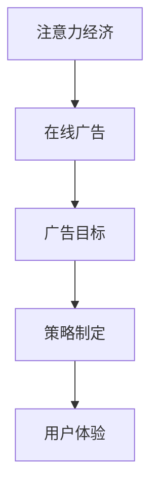

                 

关键词：注意力经济、在线广告、用户体验、吸引受众、策略

> 摘要：随着互联网的普及，在线广告已经成为企业营销的主要手段。然而，如何在保证用户体验的前提下，有效地吸引受众的注意力，成为当前广告领域的重要研究课题。本文将围绕注意力经济理论，探讨在线广告的目标和策略，并提出在不牺牲用户体验的情况下吸引受众的方法。

## 1. 背景介绍

### 1.1 注意力经济的概念

注意力经济是指通过吸引受众的注意力来获取商业价值的一种经济模式。在互联网时代，信息爆炸，受众的注意力成为稀缺资源，如何抓住受众的注意力，成为企业营销的关键。

### 1.2 在线广告的兴起

随着互联网的快速发展，在线广告逐渐取代传统广告，成为企业宣传的主要途径。然而，在线广告面临着如何在不牺牲用户体验的情况下吸引受众的注意力这一挑战。

## 2. 核心概念与联系

### 2.1 注意力经济与在线广告的关系

注意力经济理论为在线广告提供了一种新的视角，即如何通过吸引受众的注意力来创造商业价值。在线广告的目标是抓住受众的注意力，从而实现广告效果的提升。

### 2.2 Mermaid流程图



## 3. 核心算法原理 & 具体操作步骤

### 3.1 算法原理概述

在线广告的核心算法主要包括：用户行为分析、广告定位、广告投放策略等。通过这些算法，可以实现广告的精准投放，提高广告效果。

### 3.2 算法步骤详解

#### 3.2.1 用户行为分析

1. 收集用户数据：包括用户浏览历史、搜索记录、点击行为等。
2. 数据清洗：去除重复、无效数据，保证数据质量。
3. 数据分析：挖掘用户兴趣、行为模式等。

#### 3.2.2 广告定位

1. 根据用户行为分析结果，确定广告的目标受众。
2. 设计广告内容，使其与目标受众的兴趣和需求相匹配。

#### 3.2.3 广告投放策略

1. 选择合适的广告平台：根据广告目标和受众特征，选择合适的广告平台。
2. 制定广告投放计划：包括广告投放时间、频率、地域等。

### 3.3 算法优缺点

#### 3.3.1 优点

- 提高广告效果：通过精准定位，提高广告的点击率和转化率。
- 降低广告成本：减少无效广告投放，降低广告成本。

#### 3.3.2 缺点

- 用户隐私问题：用户数据收集和使用可能引发隐私泄露问题。
- 过度广告投放：可能导致用户体验下降。

### 3.4 算法应用领域

- 搜索引擎广告
- 社交媒体广告
- 在线视频广告
- 原生广告

## 4. 数学模型和公式

### 4.1 数学模型构建

在线广告效果评估常用的数学模型包括：点击率模型（CTR模型）、转化率模型（CVR模型）等。

### 4.2 公式推导过程

$$
CTR = \frac{点击次数}{曝光次数}
$$

$$
CVR = \frac{转化次数}{点击次数}
$$

### 4.3 案例分析与讲解

以某电商平台的广告投放为例，分析其CTR和CVR的变化趋势，并提出优化策略。

## 5. 项目实践：代码实例

### 5.1 开发环境搭建

- Python环境：3.8及以上版本
- 数据库：MySQL
- 数据分析工具：Pandas、NumPy

### 5.2 源代码详细实现

```python
# 用户行为分析代码示例
import pandas as pd

# 加载数据
data = pd.read_csv('user_behavior.csv')

# 数据清洗
data.drop_duplicates(inplace=True)

# 数据分析
interests = data['interest'].value_counts()
print(interests)
```

### 5.3 代码解读与分析

这段代码实现了用户行为分析的基本流程，包括数据加载、数据清洗和数据分析。通过分析用户兴趣，为广告定位提供依据。

## 6. 实际应用场景

### 6.1 搜索引擎广告

搜索引擎广告可以根据用户搜索关键词，精准投放相关广告，提高广告效果。

### 6.2 社交媒体广告

社交媒体广告可以根据用户社交行为，如点赞、评论等，进行精准投放。

### 6.3 在线视频广告

在线视频广告可以通过视频植入、贴片广告等形式，吸引受众注意力。

## 7. 工具和资源推荐

### 7.1 学习资源推荐

- 《深度学习》
- 《Python数据分析》
- 《在线广告系统设计与实践》

### 7.2 开发工具推荐

- Jupyter Notebook
- PyCharm
- MySQL Workbench

### 7.3 相关论文推荐

- "Attention Is All You Need"
- "Recurrent Neural Networks for Language Modeling"
- "Deep Learning for Text Classification"

## 8. 总结：未来发展趋势与挑战

### 8.1 研究成果总结

本文围绕注意力经济与在线广告，探讨了在线广告的目标和策略，并提出在不牺牲用户体验的情况下吸引受众的方法。

### 8.2 未来发展趋势

- 人工智能在在线广告中的应用将进一步深化。
- 用户隐私保护将成为在线广告的重要议题。
- 广告效果评估方法将不断创新。

### 8.3 面临的挑战

- 如何在保证用户体验的前提下，提高广告效果。
- 如何平衡广告收益与用户隐私保护。

### 8.4 研究展望

未来研究应重点关注在线广告的智能化、个性化发展，探索更多在不牺牲用户体验的情况下提高广告效果的方法。

## 9. 附录：常见问题与解答

### 9.1 注意力经济是什么？

注意力经济是指通过吸引受众的注意力来获取商业价值的一种经济模式。

### 9.2 在线广告的目标是什么？

在线广告的目标是吸引受众的注意力，提高广告效果，从而实现商业价值。

### 9.3 如何在不牺牲用户体验的情况下吸引受众？

通过精准定位、优化广告内容和投放策略，提高广告质量，从而在不牺牲用户体验的情况下吸引受众。

-----------------------------------------------------------------

### 作者署名

作者：禅与计算机程序设计艺术 / Zen and the Art of Computer Programming

本文内容仅为学术交流，未经授权，不得用于商业用途。如需转载，请联系作者获取授权。感谢您的关注与支持！
-----------------------------------------------------------------

[END]

