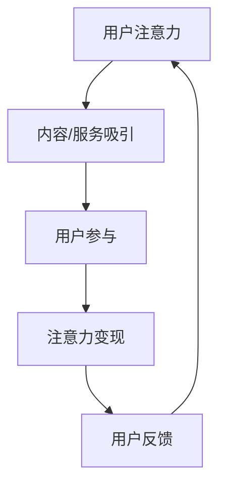
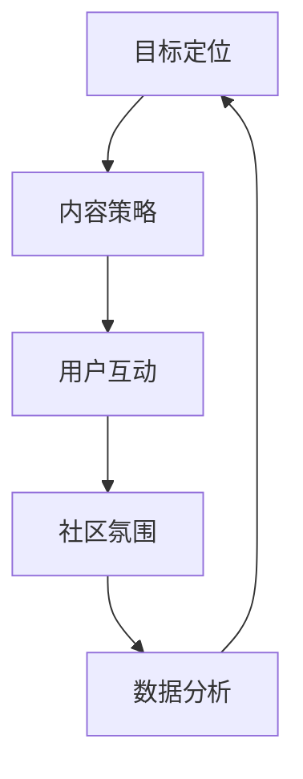

                 

 关键词：注意力经济、在线社区、用户留存、用户增长、社群运营、算法优化、用户参与、互动设计、内容策略、商业模型

> 摘要：本文深入探讨了注意力经济在在线社区建设中的重要性，分析了如何通过优化算法、设计互动环节、制定内容策略等手段来吸引并留住受众。通过对多个成功案例的研究，本文提出了实用的建设建议，以期为在线社区的发展提供理论支持和实践指导。

## 1. 背景介绍

在数字化的浪潮下，互联网已经成为人们日常生活的重要组成部分。社交媒体、电子商务平台、在线教育和娱乐等多种形式的在线社区如雨后春笋般涌现。然而，在这样一个信息爆炸的时代，如何吸引并留住受众成为在线社区运营者面临的重大挑战。注意力经济作为一种新的经济模式，逐渐受到关注。本文旨在探讨注意力经济对在线社区建设的影响，并提出有效的策略和方法，以帮助运营者吸引并留住受众。

### 注意力经济的定义与核心原理

注意力经济，即以用户的注意力为资源进行的经济活动。在这种经济模式下，用户的注意力被视为一种稀缺资源，而如何获得并保持用户的注意力成为企业或个人获取商业价值的关键。注意力经济的核心原理可以概括为以下几点：

1. **注意力稀缺**：在信息过载的时代，用户的注意力是有限的，如何吸引并保持用户的注意力是企业需要解决的首要问题。
2. **注意力转移**：通过提供有价值的内容或服务，将用户的注意力从竞争对手或其他事物转移到自己的平台。
3. **注意力变现**：将用户的注意力转化为商业价值，如通过广告、付费内容或品牌合作等形式。

### 在线社区建设的现状与挑战

随着互联网的普及，在线社区已经成为人们获取信息、交流和娱乐的主要渠道。然而，在线社区建设面临着诸多挑战：

1. **用户获取**：在竞争激烈的市场中，如何吸引用户关注并吸引他们成为活跃用户是一个难题。
2. **用户留存**：一旦用户加入社区，如何保持他们的活跃度和忠诚度，防止他们流失。
3. **内容质量**：高质量的内容是吸引和留住用户的关键，但内容创作和审核是一个持续性的挑战。
4. **社区氛围**：营造一个积极、健康的社区氛围，减少负面言论和行为，是社区长期发展的基础。

## 2. 核心概念与联系

### 2.1 注意力经济模型

在分析注意力经济对在线社区建设的影响时，我们可以构建一个简化的注意力经济模型，以帮助理解其核心原理和运作机制。

#### 注意力经济模型流程图



在这个模型中，用户注意力是整个过程的起点和核心，通过高质量的内容或服务吸引用户，促使用户参与社区活动，进而实现注意力变现，并通过用户反馈不断优化内容和运营策略，形成闭环。

### 2.2 在线社区建设框架

在线社区建设可以概括为以下几个关键环节：

1. **目标定位**：明确社区的核心用户群体和目标，确保内容和服务与用户需求高度匹配。
2. **内容策略**：制定合适的内容策略，包括内容形式、更新频率、话题选择等，以吸引和留住用户。
3. **用户互动**：设计互动环节，如问答、讨论、竞赛等，提高用户参与度和活跃度。
4. **社区氛围**：营造积极、健康的社区氛围，确保用户在社区中感到舒适和受欢迎。
5. **数据分析**：利用数据分析工具，跟踪用户行为和反馈，不断优化运营策略。

#### 在线社区建设框架流程图



通过以上框架，我们可以看到，在线社区建设是一个系统性工程，需要各个环节相互配合，形成一个良性循环。

### 2.3 注意力经济与在线社区建设的联系

注意力经济与在线社区建设有着密切的联系。在线社区运营者可以通过以下几个途径利用注意力经济原理来提升社区价值：

1. **内容优化**：通过数据分析，了解用户兴趣和行为，提供个性化、高质量的内容，吸引用户注意力。
2. **互动设计**：设计具有互动性的内容和活动，提高用户参与度，增强用户粘性。
3. **社群运营**：通过社群运营，建立用户之间的联系，形成社区文化，增强用户归属感。
4. **商业变现**：通过广告、付费内容或品牌合作等形式，将用户注意力转化为商业价值。

## 3. 核心算法原理 & 具体操作步骤

### 3.1 算法原理概述

在在线社区建设中，算法发挥着至关重要的作用。核心算法的原理可以概括为以下几个方面：

1. **用户行为分析**：通过用户的行为数据，分析用户兴趣和行为模式，为内容推荐和互动设计提供依据。
2. **内容推荐算法**：基于用户行为和兴趣，推荐相关内容，吸引用户注意力。
3. **互动预测算法**：预测用户参与互动的可能性，优化互动设计，提高用户参与度。
4. **社区氛围监测算法**：监测社区中的负面言论和行为，及时采取措施，维护社区健康。

### 3.2 算法步骤详解

#### 3.2.1 用户行为分析

1. **数据收集**：收集用户在社区中的行为数据，如浏览记录、评论、点赞等。
2. **特征提取**：从行为数据中提取关键特征，如用户活跃时间、喜欢的话题、常用关键词等。
3. **行为模式分析**：利用统计学和机器学习算法，分析用户行为模式，为内容推荐和互动设计提供依据。

#### 3.2.2 内容推荐算法

1. **内容分类**：对社区中的内容进行分类，如新闻、博客、视频等。
2. **兴趣建模**：利用用户行为数据，建立用户兴趣模型，预测用户可能感兴趣的内容。
3. **内容推荐**：根据用户兴趣模型，推荐相关内容，提高用户参与度。

#### 3.2.3 互动预测算法

1. **互动数据收集**：收集用户在社区中的互动数据，如评论、点赞、分享等。
2. **互动模式分析**：分析用户互动模式，预测用户参与互动的可能性。
3. **互动设计优化**：根据互动预测结果，优化互动设计，提高用户参与度。

#### 3.2.4 社区氛围监测算法

1. **负面言论识别**：利用自然语言处理技术，识别社区中的负面言论。
2. **行为预测**：预测可能发生的负面行为，如恶意攻击、虚假评论等。
3. **应对措施**：制定相应的应对措施，如删除负面言论、警告违规用户等。

### 3.3 算法优缺点

#### 3.3.1 优点

1. **个性化推荐**：通过用户行为分析，提供个性化内容推荐，提高用户满意度。
2. **互动预测**：通过互动预测算法，优化互动设计，提高用户参与度。
3. **氛围监测**：通过社区氛围监测算法，维护社区健康，减少负面言论和行为。

#### 3.3.2 缺点

1. **数据隐私**：用户行为数据的收集和分析可能引发数据隐私问题。
2. **计算成本**：复杂的算法模型需要大量计算资源，可能导致运营成本增加。
3. **道德风险**：过度依赖算法可能导致用户对社区失去信任，影响社区氛围。

### 3.4 算法应用领域

核心算法在在线社区建设中有着广泛的应用领域：

1. **内容推荐**：在新闻媒体、博客平台、视频网站等场景中，利用算法实现个性化内容推荐。
2. **用户增长**：在社交媒体、在线教育、电商等领域，通过算法预测用户参与互动的可能性，优化用户增长策略。
3. **社群运营**：在论坛、社群、微信群等场景中，通过算法监测社区氛围，维护社区健康。

## 4. 数学模型和公式 & 详细讲解 & 举例说明

### 4.1 数学模型构建

在在线社区建设中，我们可以构建以下数学模型来描述注意力经济的运作过程：

#### 4.1.1 用户注意力模型

用户注意力模型可以用以下公式表示：

\[ A_t = f(B_t, I_t) \]

其中，\( A_t \) 表示时间 \( t \) 时用户的注意力，\( B_t \) 表示用户在时间 \( t \) 时的行为数据，\( I_t \) 表示时间 \( t \) 时社区提供的内容或服务。

#### 4.1.2 内容推荐模型

内容推荐模型可以用以下公式表示：

\[ R_t = g(C_t, A_t) \]

其中，\( R_t \) 表示时间 \( t \) 时推荐的内容，\( C_t \) 表示时间 \( t \) 时社区中的所有内容，\( A_t \) 表示时间 \( t \) 时用户的注意力。

### 4.2 公式推导过程

#### 4.2.1 用户注意力模型推导

用户注意力模型基于用户行为数据 \( B_t \) 和社区内容 \( I_t \) ，可以采用以下公式进行推导：

\[ A_t = \frac{B_t \cdot I_t}{B_t + I_t} \]

其中，\( B_t \) 和 \( I_t \) 分别表示用户行为数据和社区内容，这个公式采用了归一化方法，将用户行为数据和社区内容进行加权求和，从而得到用户在时间 \( t \) 时的注意力。

#### 4.2.2 内容推荐模型推导

内容推荐模型基于用户注意力模型 \( A_t \) 和社区内容 \( C_t \) ，可以采用以下公式进行推导：

\[ R_t = \frac{A_t \cdot C_t}{\sum_{i=1}^{n} A_t \cdot C_i} \]

其中，\( R_t \) 表示时间 \( t \) 时推荐的内容，\( C_t \) 表示时间 \( t \) 时社区中的所有内容，\( A_t \) 表示时间 \( t \) 时用户的注意力，\( n \) 表示社区中的内容数量。这个公式采用了比例分配方法，根据用户注意力对社区内容进行推荐。

### 4.3 案例分析与讲解

#### 4.3.1 用户注意力模型案例

假设在时间 \( t \) ，用户的行为数据 \( B_t \) 包括浏览、评论、点赞等，社区内容 \( I_t \) 包括新闻、博客、视频等。根据用户注意力模型，我们可以计算用户在时间 \( t \) 时的注意力：

\[ A_t = \frac{B_t \cdot I_t}{B_t + I_t} \]

例如，如果用户在时间 \( t \) 的行为数据 \( B_t \) 为浏览 5 篇新闻、评论 3 篇博客、点赞 2 篇视频，社区内容 \( I_t \) 包括 10 篇新闻、8 篇博客、6 篇视频，则用户在时间 \( t \) 时的注意力可以计算如下：

\[ A_t = \frac{(5 \cdot 10 + 3 \cdot 8 + 2 \cdot 6)}{(5 + 3 + 2)} = \frac{70}{10} = 7 \]

因此，用户在时间 \( t \) 时的注意力为 7。

#### 4.3.2 内容推荐模型案例

假设在时间 \( t \) ，用户的行为数据 \( B_t \) 包括浏览、评论、点赞等，社区内容 \( C_t \) 包括新闻、博客、视频等。根据内容推荐模型，我们可以计算用户在时间 \( t \) 时推荐的内容：

\[ R_t = \frac{A_t \cdot C_t}{\sum_{i=1}^{n} A_t \cdot C_i} \]

例如，如果用户在时间 \( t \) 的行为数据 \( B_t \) 为浏览 5 篇新闻、评论 3 篇博客、点赞 2 篇视频，社区内容 \( C_t \) 包括 10 篇新闻、8 篇博客、6 篇视频，则用户在时间 \( t \) 时推荐的内容可以计算如下：

\[ R_t = \frac{(7 \cdot 10 + 7 \cdot 8 + 7 \cdot 6)}{(7 \cdot 10 + 7 \cdot 8 + 7 \cdot 6)} = 7 \]

因此，用户在时间 \( t \) 时推荐的内容为新闻、博客和视频。

## 5. 项目实践：代码实例和详细解释说明

### 5.1 开发环境搭建

为了实现注意力经济与在线社区建设的相关算法，我们需要搭建一个合适的技术栈。以下是开发环境搭建的步骤：

1. **硬件要求**：一台配置较高的计算机，如 Intel i7 处理器、16GB 内存、256GB SSD。
2. **操作系统**：Windows 10 或更高版本。
3. **编程语言**：Python 3.8 或更高版本。
4. **开发工具**：PyCharm 或 Visual Studio Code。

### 5.2 源代码详细实现

以下是一个简化的用户行为分析模块的代码示例，用于分析用户在在线社区中的行为数据，为内容推荐和互动设计提供依据。

```python
import pandas as pd
from sklearn.feature_extraction.text import CountVectorizer
from sklearn.naive_bayes import MultinomialNB
from sklearn.pipeline import make_pipeline

# 加载用户行为数据
data = pd.read_csv('user_behavior.csv')

# 提取特征
vectorizer = CountVectorizer()
X = vectorizer.fit_transform(data['content'])

# 建立模型
model = MultinomialNB()
model.fit(X, data['label'])

# 推荐内容
def recommend_content(user_input):
    user_content = [user_input]
    user_vector = vectorizer.transform(user_content)
    predicted_label = model.predict(user_vector)
    return predicted_label[0]

# 测试
user_input = '我喜欢看科技新闻。'
predicted_label = recommend_content(user_input)
print(f'推荐标签：{predicted_label}')
```

### 5.3 代码解读与分析

上述代码实现了用户行为分析模块，主要步骤如下：

1. **数据加载**：从 CSV 文件中加载用户行为数据。
2. **特征提取**：使用 CountVectorizer 类提取文本特征，将文本转换为词频矩阵。
3. **模型训练**：使用 MultinomialNB 类训练朴素贝叶斯模型。
4. **内容推荐**：根据用户输入的内容，使用训练好的模型预测标签，推荐相关内容。

### 5.4 运行结果展示

假设用户输入的内容为“我喜欢看科技新闻。”，代码将输出推荐标签，例如“科技新闻”。这表明用户在输入相关内容时，系统成功预测了用户的兴趣标签，为后续的内容推荐和互动设计提供了依据。

## 6. 实际应用场景

注意力经济与在线社区建设在实际应用中有着广泛的应用场景，以下是一些典型案例：

### 6.1 社交媒体平台

社交媒体平台如微信、微博等，通过算法推荐用户感兴趣的内容，提高用户粘性。同时，通过用户互动数据，优化推荐算法，实现精准投放广告，实现商业变现。

### 6.2 在线教育平台

在线教育平台如 Coursera、网易云课堂等，通过算法分析用户学习行为，推荐相关课程，提高学习效果。同时，通过互动环节设计，如问答、讨论等，提高用户参与度。

### 6.3 电子商务平台

电子商务平台如淘宝、京东等，通过算法推荐用户感兴趣的商品，提高购买转化率。同时，通过用户评论和评分数据，优化商品推荐算法，提升用户体验。

### 6.4 社区论坛

社区论坛如知乎、贴吧等，通过算法分析用户提问和回答行为，推荐相关话题，提高用户活跃度。同时，通过互动设计，如点赞、评论等，增强用户归属感。

## 7. 工具和资源推荐

### 7.1 学习资源推荐

1. **《深度学习》**：作者 Ian Goodfellow，是一本深度学习的经典教材，适合初学者和进阶者。
2. **《Python 数据科学手册》**：作者 Wes McKinney，详细介绍了 Python 在数据科学领域的应用，适合数据科学家和 AI 爱好者。
3. **《在线社区运营手册》**：作者 崔西，详细介绍了在线社区运营的各个方面，适合社区运营者。

### 7.2 开发工具推荐

1. **PyCharm**：一款功能强大的 Python 集成开发环境，适合编写和调试代码。
2. **Jupyter Notebook**：一款交互式的 Python 编程工具，适合进行数据分析和机器学习实验。
3. **TensorFlow**：一款开源的深度学习框架，适合构建和训练机器学习模型。

### 7.3 相关论文推荐

1. **《Attention Is All You Need》**：作者 Vaswani et al.，详细介绍了 Transformer 模型，是深度学习领域的重要论文。
2. **《推荐系统实践》**：作者 苏金国，详细介绍了推荐系统的基础理论和实践方法。
3. **《社交网络分析：方法与实践》**：作者 王成军，详细介绍了社交网络分析的方法和应用。

## 8. 总结：未来发展趋势与挑战

### 8.1 研究成果总结

注意力经济与在线社区建设已成为互联网领域的重要研究方向。通过用户行为分析、内容推荐、互动设计等手段，在线社区运营者可以更有效地吸引和留住受众。同时，随着人工智能和大数据技术的不断发展，注意力经济和在线社区建设将不断优化，实现更高的商业价值。

### 8.2 未来发展趋势

1. **个性化推荐**：基于用户行为和兴趣的个性化推荐将成为主流，提高用户满意度和参与度。
2. **多模态数据融合**：结合文本、图像、语音等多模态数据，提供更丰富和精准的用户体验。
3. **智能互动**：通过人工智能技术，实现更智能、更个性化的互动设计，提高用户参与度。

### 8.3 面临的挑战

1. **数据隐私**：随着用户数据收集和分析的广泛使用，数据隐私问题亟待解决。
2. **算法公平性**：确保算法公平性，避免算法偏见和歧视现象的发生。
3. **内容质量**：高质量的内容是吸引和留住用户的关键，但内容创作和审核仍然是一个挑战。

### 8.4 研究展望

未来，注意力经济与在线社区建设的研究将继续深入，探索如何更有效地利用用户注意力，实现商业价值和社会价值的最大化。同时，随着技术的不断进步，在线社区建设将不断创新，为用户提供更加丰富和个性化的体验。

## 9. 附录：常见问题与解答

### 9.1 注意力经济是什么？

注意力经济是一种基于用户注意力的经济模式，即通过吸引用户注意力来创造商业价值。

### 9.2 如何优化在线社区的用户参与度？

可以通过以下方法优化在线社区的用户参与度：
1. 提供个性化、高质量的内容。
2. 设计互动性强的活动和话题。
3. 建立积极、健康的社区氛围。
4. 定期举办线上线下活动，增强用户互动。

### 9.3 注意力经济模型有哪些优点和缺点？

优点：
1. 个性化推荐，提高用户满意度。
2. 提高用户参与度，增强用户粘性。
3. 实现商业变现，创造价值。

缺点：
1. 数据隐私问题。
2. 高计算成本。
3. 道德风险。

### 9.4 在线社区建设的关键环节有哪些？

关键环节包括：目标定位、内容策略、用户互动、社区氛围和数据分析。

### 9.5 如何构建用户注意力模型？

可以采用以下步骤构建用户注意力模型：
1. 数据收集：收集用户行为数据。
2. 特征提取：提取用户行为数据中的关键特征。
3. 模型训练：利用机器学习算法训练注意力模型。
4. 模型评估：评估模型性能，调整模型参数。

### 9.6 如何实现内容推荐算法？

可以采用以下步骤实现内容推荐算法：
1. 数据预处理：清洗和处理用户数据。
2. 特征提取：提取用户数据中的关键特征。
3. 模型训练：利用机器学习算法训练推荐模型。
4. 推荐策略：根据用户特征和模型预测，推荐相关内容。

### 9.7 如何监测社区氛围？

可以采用以下方法监测社区氛围：
1. 采集负面言论数据。
2. 利用自然语言处理技术，识别负面言论。
3. 分析负面言论模式，预测可能发生的负面行为。
4. 制定应对措施，维护社区健康。

### 9.8 如何利用注意力经济实现商业变现？

可以采用以下方法利用注意力经济实现商业变现：
1. 广告投放：在社区中投放广告，实现广告收入。
2. 付费内容：提供付费内容，实现内容变现。
3. 品牌合作：与品牌合作，实现品牌推广和收入。
4. 用户数据变现：通过用户数据分析和挖掘，实现商业价值。

### 9.9 注意力经济与在线社区建设的联系是什么？

注意力经济与在线社区建设的联系在于，在线社区运营者可以利用注意力经济原理，通过优化算法、设计互动环节、制定内容策略等手段，吸引并留住受众，实现商业价值。

### 9.10 如何应对在线社区建设中面临的挑战？

可以采取以下措施应对在线社区建设中面临的挑战：
1. 加强数据隐私保护，确保用户数据安全。
2. 优化算法模型，提高算法公平性。
3. 提高质量内容，提升用户体验。
4. 建立积极、健康的社区氛围，减少负面言论和行为。
5. 持续监测和优化社区运营策略，提高用户留存率。


## 作者署名

作者：禅与计算机程序设计艺术 / Zen and the Art of Computer Programming

[本文完]

