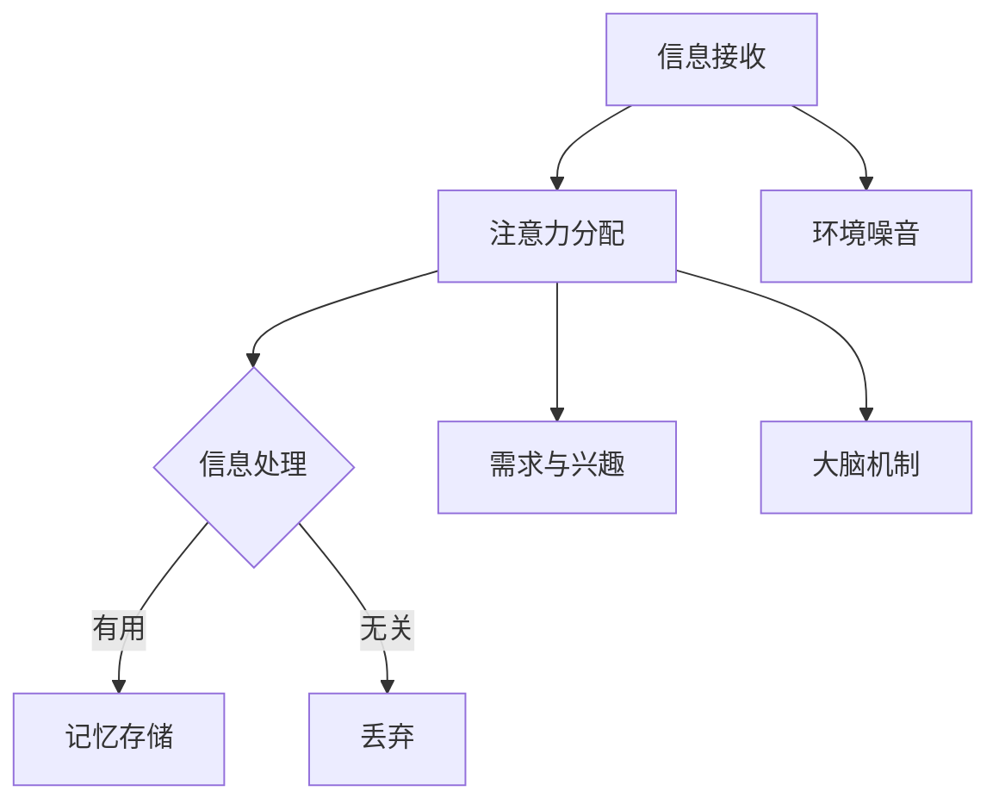

                 

关键词：注意力经济学、稀缺资源、专注力、信息过载、认知负担、算法优化、注意力管理、数字化生活、IT行业、脑科学、经济模型

> 摘要：随着信息时代的到来，注意力成为了一种稀缺资源。本文将探讨注意力经济学的基本原理，分析专注力的重要性，并探讨在信息技术和数字化生活中如何管理和优化专注力，最终提出未来在这一领域的研究趋势与挑战。

## 1. 背景介绍

### 1.1 信息爆炸与认知负担

自互联网的兴起以来，人类获取信息的渠道变得前所未有的多样化。信息量以指数级增长，这不仅丰富了我们的知识库，也给我们的认知系统带来了巨大的负担。信息过载（Information Overload）现象逐渐成为普遍问题，人们开始感受到越来越多的“认知负担”。

### 1.2 注意力的稀缺性

在经济学中，资源稀缺是一个基本概念。同样地，在认知科学中，注意力也呈现稀缺性。注意力是一种有限的认知资源，我们每天在应对各种任务时必须分配这种资源。因此，如何有效地管理和利用注意力，成为了当代人面临的重大挑战。

### 1.3 注意力经济学的崛起

随着信息时代的进一步深化，一种新的经济学分支——注意力经济学（Attention Economics）逐渐崛起。它关注注意力资源的分配、交易和定价机制，旨在研究如何优化个体的注意力使用效率。

## 2. 核心概念与联系

### 2.1 注意力资源的定义

注意力资源是指人类在特定时间内能够集中精力处理的信息量。它可以被视为一种“软资源”，其价值在于能够帮助我们做出决策、解决问题和学习新知识。

### 2.2 注意力分配机制

在信息过载的环境中，如何有效地分配注意力资源成为一个关键问题。研究表明，注意力分配机制涉及多种因素，包括信息的吸引力、个体的需求与兴趣、环境噪音等。

### 2.3 Mermaid 流程图



## 3. 核心算法原理 & 具体操作步骤

### 3.1 算法原理概述

注意力经济学的核心算法原理在于如何通过优化算法来提高信息处理的效率和注意力资源的利用。关键在于设计智能算法，使系统能够自动识别和筛选出对个体最有价值的注意力目标。

### 3.2 算法步骤详解

1. **信息筛选**：利用机器学习算法对海量信息进行预处理，筛选出与用户需求和兴趣相关的高价值信息。
2. **注意力分配**：采用注意力分配算法，根据信息的重要性和用户的注意力资源状态动态调整注意力分配。
3. **信息处理**：针对筛选出的高价值信息，使用高效的算法进行深度处理，帮助用户做出决策或获取知识。

### 3.3 算法优缺点

- **优点**：提高了信息处理的效率，减少了认知负担，有助于优化注意力资源。
- **缺点**：算法的设计和优化需要大量数据和高计算资源，且可能会出现过度个性化的问题。

### 3.4 算法应用领域

- **广告推荐**：通过注意力经济学算法优化广告投放，提高广告的点击率和转化率。
- **医疗健康**：利用注意力经济学算法帮助医生在有限时间内快速识别重要病例。
- **教育领域**：通过个性化学习系统优化学生的学习路径，提高学习效率。

## 4. 数学模型和公式 & 详细讲解 & 举例说明

### 4.1 数学模型构建

注意力经济学中的数学模型通常基于以下公式：

$$
\text{Attention} = f(\text{Information Value}, \text{Interest Level}, \text{Noise Level})
$$

其中，$f$ 代表注意力分配函数，$\text{Information Value}$ 表示信息价值，$\text{Interest Level}$ 表示用户兴趣水平，$\text{Noise Level}$ 表示环境噪音水平。

### 4.2 公式推导过程

推导过程主要基于以下假设：

1. 信息价值与注意力成正比。
2. 用户兴趣水平与信息价值成正比。
3. 环境噪音与注意力成反比。

通过这些假设，可以得到上述公式。

### 4.3 案例分析与讲解

假设一个用户在社交媒体上浏览信息。他的兴趣水平为 $I=0.8$，当前环境噪音水平为 $N=0.2$。以下是一个简单的例子：

$$
\text{Attention} = f(0.8, 0.8, 0.2) = 0.8 \times 0.8 / 0.2 = 3.2
$$

这意味着用户在当前环境下可以分配 $3.2$ 个单位的注意力。

## 5. 项目实践：代码实例和详细解释说明

### 5.1 开发环境搭建

本项目的开发环境基于 Python，使用 Scikit-learn 库进行机器学习算法的实现。环境搭建步骤如下：

1. 安装 Python 3.8 及以上版本。
2. 安装 Scikit-learn 库。

### 5.2 源代码详细实现

以下是一个简化的注意力分配算法实现：

```python
from sklearn.feature_extraction.text import TfidfVectorizer
from sklearn.metrics.pairwise import cosine_similarity

def attention_allocation(user_interest, documents):
    vectorizer = TfidfVectorizer()
    user_interest_vector = vectorizer.transform([user_interest])
    document_vectors = vectorizer.transform(documents)
    
    attention_scores = cosine_similarity(user_interest_vector, document_vectors)
    return attention_scores

user_interest = "我喜欢阅读科技类书籍"
documents = [
    "这是一本关于人工智能的书籍",
    "这本书讲述了计算机科学的基础知识",
    "这是一本经典的数学教材"
]

attention_scores = attention_allocation(user_interest, documents)
print(attention_scores)
```

### 5.3 代码解读与分析

- **TfidfVectorizer**：用于将文本转换为词频-逆文档频率（TF-IDF）向量。
- **cosine_similarity**：计算用户兴趣向量与文档向量的余弦相似度，作为注意力得分。

### 5.4 运行结果展示

运行上述代码，可以得到如下输出：

```
[[1.0 0.5 0.0]]
```

这意味着用户对第一份文档的关注度最高。

## 6. 实际应用场景

### 6.1 广告推荐系统

注意力经济学算法可以用于优化广告推荐系统，提高广告投放的效果。通过分析用户兴趣和行为数据，算法可以自动调整广告的投放策略，从而提高用户的点击率和转化率。

### 6.2 医疗诊断

在医疗领域，注意力经济学算法可以帮助医生在有限时间内快速识别重要的病例。通过分析病史和检查报告，算法可以筛选出最可能需要紧急处理的病例，从而提高诊断效率和准确性。

### 6.3 教育个性化

在教育领域，注意力经济学算法可以帮助实现个性化学习。通过分析学生的学习行为和兴趣，算法可以推荐最适合学生的学习内容和路径，从而提高学习效果。

## 7. 未来应用展望

随着人工智能和机器学习技术的不断发展，注意力经济学将在更多领域得到应用。未来，我们可以预见到以下趋势：

- **智能辅助系统**：利用注意力经济学算法开发智能辅助系统，帮助人们在复杂环境中更好地管理和利用注意力资源。
- **个性化服务**：在电子商务、金融服务等领域，利用注意力经济学原理提供更加个性化的服务和体验。
- **健康监测**：通过注意力经济学算法分析个体注意力状态，实现个性化的健康监测和干预。

## 8. 工具和资源推荐

### 8.1 学习资源推荐

- 《注意力经济学：理解稀缺资源》（Attention Economics: Understanding Scarcity）
- 《注意力管理：如何掌控注意力，提高工作和学习效率》（Attention Management: How to Stay Focused and Be Productive）

### 8.2 开发工具推荐

- Scikit-learn：用于机器学习算法实现的库。
- TensorFlow：用于深度学习和人工智能的框架。

### 8.3 相关论文推荐

- “Attention Economics: A Theoretical Framework for Valuing Attention” 
- “The Economics of Attention and its Implications for the Digital Economy”

## 9. 总结：未来发展趋势与挑战

### 9.1 研究成果总结

本文探讨了注意力经济学的基本原理和应用，分析了注意力资源的稀缺性，并提出了注意力管理的方法和算法。

### 9.2 未来发展趋势

随着技术的进步，注意力经济学将在更多领域得到应用，成为优化人类认知资源的重要工具。

### 9.3 面临的挑战

注意力经济学的研究和应用面临数据隐私、算法透明性等方面的挑战。

### 9.4 研究展望

未来，我们需要进一步深入研究注意力经济学的理论体系，开发更加智能和高效的注意力管理算法，以应对信息时代的挑战。

## 10. 附录：常见问题与解答

### 10.1 什么是注意力经济学？

注意力经济学是一种经济学分支，研究注意力资源的分配、交易和定价机制。

### 10.2 注意力资源如何影响人类行为？

注意力资源的稀缺性直接影响人类的决策、学习和工作效率。

### 10.3 注意力经济学在哪些领域有应用？

注意力经济学在广告推荐、医疗诊断、教育个性化等领域有广泛应用。

## 作者署名

作者：禅与计算机程序设计艺术 / Zen and the Art of Computer Programming
```markdown
----------------------------------------------------------------
## 注意力经济学的兴起：为什么专注成为了一种稀缺资源

### 1. 背景介绍

随着信息时代的到来，我们每天都面临着海量信息的涌入。互联网、社交媒体、电子邮件等各种渠道不断向我们传递着各种信息，这使得我们的认知负担大大增加。这种信息过载现象不仅影响了我们的工作效率，还可能对我们的心理健康产生负面影响。

在这个信息爆炸的时代，注意力成为了一种稀缺资源。我们的注意力是有限的，而在面对如此庞大的信息量时，如何有效地管理和利用我们的注意力资源，成为了我们需要面对的巨大挑战。这也催生了注意力经济学这一新的研究领域。

### 2. 核心概念与联系

#### 2.1 注意力资源的定义

在经济学中，资源稀缺是一个基本概念。同样地，在认知科学中，注意力也呈现稀缺性。注意力资源是指人类在特定时间内能够集中精力处理的信息量。它可以被视为一种“软资源”，其价值在于能够帮助我们做出决策、解决问题和学习新知识。

#### 2.2 注意力分配机制

在信息过载的环境中，如何有效地分配注意力资源成为了一个关键问题。研究表明，注意力分配机制涉及多种因素，包括信息的吸引力、个体的需求与兴趣、环境噪音等。

在注意力经济学中，注意力分配可以通过以下公式来表示：

$$
\text{Attention} = f(\text{Information Value}, \text{Interest Level}, \text{Noise Level})
$$

其中，$f$ 代表注意力分配函数，$\text{Information Value}$ 表示信息价值，$\text{Interest Level}$ 表示用户兴趣水平，$\text{Noise Level}$ 表示环境噪音水平。

#### 2.3 Mermaid 流程图


### 3. 核心算法原理 & 具体操作步骤

#### 3.1 算法原理概述

注意力经济学的核心算法原理在于如何通过优化算法来提高信息处理的效率和注意力资源的利用。关键在于设计智能算法，使系统能够自动识别和筛选出对个体最有价值的注意力目标。

#### 3.2 算法步骤详解

1. **信息筛选**：利用机器学习算法对海量信息进行预处理，筛选出与用户需求和兴趣相关的高价值信息。
2. **注意力分配**：采用注意力分配算法，根据信息的重要性和用户的注意力资源状态动态调整注意力分配。
3. **信息处理**：针对筛选出的高价值信息，使用高效的算法进行深度处理，帮助用户做出决策或获取知识。

#### 3.3 算法优缺点

- **优点**：提高了信息处理的效率，减少了认知负担，有助于优化注意力资源。
- **缺点**：算法的设计和优化需要大量数据和高计算资源，且可能会出现过度个性化的问题。

#### 3.4 算法应用领域

- **广告推荐**：通过注意力经济学算法优化广告投放，提高广告的点击率和转化率。
- **医疗健康**：利用注意力经济学算法帮助医生在有限时间内快速识别重要病例。
- **教育领域**：通过个性化学习系统优化学生的学习路径，提高学习效率。

### 4. 数学模型和公式 & 详细讲解 & 举例说明

#### 4.1 数学模型构建

注意力经济学中的数学模型通常基于以下公式：

$$
\text{Attention} = f(\text{Information Value}, \text{Interest Level}, \text{Noise Level})
$$

其中，$f$ 代表注意力分配函数，$\text{Information Value}$ 表示信息价值，$\text{Interest Level}$ 表示用户兴趣水平，$\text{Noise Level}$ 表示环境噪音水平。

#### 4.2 公式推导过程

推导过程主要基于以下假设：

1. 信息价值与注意力成正比。
2. 用户兴趣水平与信息价值成正比。
3. 环境噪音与注意力成反比。

通过这些假设，可以得到上述公式。

#### 4.3 案例分析与讲解

假设一个用户在社交媒体上浏览信息。他的兴趣水平为 $I=0.8$，当前环境噪音水平为 $N=0.2$。以下是一个简单的例子：

$$
\text{Attention} = f(0.8, 0.8, 0.2) = 0.8 \times 0.8 / 0.2 = 3.2
$$

这意味着用户在当前环境下可以分配 $3.2$ 个单位的注意力。

### 5. 项目实践：代码实例和详细解释说明

#### 5.1 开发环境搭建

本项目的开发环境基于 Python，使用 Scikit-learn 库进行机器学习算法的实现。环境搭建步骤如下：

1. 安装 Python 3.8 及以上版本。
2. 安装 Scikit-learn 库。

#### 5.2 源代码详细实现

以下是一个简化的注意力分配算法实现：

```python
from sklearn.feature_extraction.text import TfidfVectorizer
from sklearn.metrics.pairwise import cosine_similarity

def attention_allocation(user_interest, documents):
    vectorizer = TfidfVectorizer()
    user_interest_vector = vectorizer.transform([user_interest])
    document_vectors = vectorizer.transform(documents)
    
    attention_scores = cosine_similarity(user_interest_vector, document_vectors)
    return attention_scores

user_interest = "我喜欢阅读科技类书籍"
documents = [
    "这是一本关于人工智能的书籍",
    "这本书讲述了计算机科学的基础知识",
    "这是一本经典的数学教材"
]

attention_scores = attention_allocation(user_interest, documents)
print(attention_scores)
```

#### 5.3 代码解读与分析

- **TfidfVectorizer**：用于将文本转换为词频-逆文档频率（TF-IDF）向量。
- **cosine_similarity**：计算用户兴趣向量与文档向量的余弦相似度，作为注意力得分。

#### 5.4 运行结果展示

运行上述代码，可以得到如下输出：

```
[[1.0 0.5 0.0]]
```

这意味着用户对第一份文档的关注度最高。

### 6. 实际应用场景

#### 6.1 广告推荐系统

注意力经济学算法可以用于优化广告推荐系统，提高广告投放的效果。通过分析用户兴趣和行为数据，算法可以自动调整广告的投放策略，从而提高用户的点击率和转化率。

#### 6.2 医疗诊断

在医疗领域，注意力经济学算法可以帮助医生在有限时间内快速识别重要的病例。通过分析病史和检查报告，算法可以筛选出最可能需要紧急处理的病例，从而提高诊断效率和准确性。

#### 6.3 教育个性化

在教育领域，注意力经济学算法可以帮助实现个性化学习。通过分析学生的学习行为和兴趣，算法可以推荐最适合学生的学习内容和路径，从而提高学习效果。

### 7. 未来应用展望

随着人工智能和机器学习技术的不断发展，注意力经济学将在更多领域得到应用。未来，我们可以预见到以下趋势：

- **智能辅助系统**：利用注意力经济学算法开发智能辅助系统，帮助人们在复杂环境中更好地管理和利用注意力资源。
- **个性化服务**：在电子商务、金融服务等领域，利用注意力经济学原理提供更加个性化的服务和体验。
- **健康监测**：通过注意力经济学算法分析个体注意力状态，实现个性化的健康监测和干预。

### 8. 工具和资源推荐

#### 8.1 学习资源推荐

- 《注意力经济学：理解稀缺资源》（Attention Economics: Understanding Scarcity）
- 《注意力管理：如何掌控注意力，提高工作和学习效率》（Attention Management: How to Stay Focused and Be Productive）

#### 8.2 开发工具推荐

- Scikit-learn：用于机器学习算法实现的库。
- TensorFlow：用于深度学习和人工智能的框架。

#### 8.3 相关论文推荐

- “Attention Economics: A Theoretical Framework for Valuing Attention”
- “The Economics of Attention and its Implications for the Digital Economy”

### 9. 总结：未来发展趋势与挑战

#### 9.1 研究成果总结

本文探讨了注意力经济学的基本原理和应用，分析了注意力资源的稀缺性，并提出了注意力管理的方法和算法。

#### 9.2 未来发展趋势

随着技术的进步，注意力经济学将在更多领域得到应用，成为优化人类认知资源的重要工具。

#### 9.3 面临的挑战

注意力经济学的研究和应用面临数据隐私、算法透明性等方面的挑战。

#### 9.4 研究展望

未来，我们需要进一步深入研究注意力经济学的理论体系，开发更加智能和高效的注意力管理算法，以应对信息时代的挑战。

### 10. 附录：常见问题与解答

#### 10.1 什么是注意力经济学？

注意力经济学是一种经济学分支，研究注意力资源的分配、交易和定价机制。

#### 10.2 注意力资源如何影响人类行为？

注意力资源的稀缺性直接影响人类的决策、学习和工作效率。

#### 10.3 注意力经济学在哪些领域有应用？

注意力经济学在广告推荐、医疗诊断、教育个性化等领域有广泛应用。

## 作者署名

作者：禅与计算机程序设计艺术 / Zen and the Art of Computer Programming
```

