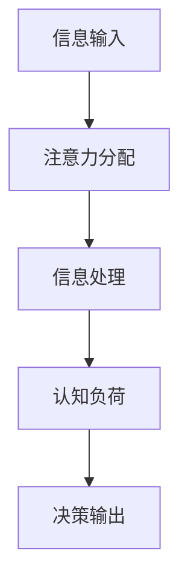

                 

关键词：注意力经济学，人工智能，稀缺资源，算法效率，认知负荷，资源优化

> 摘要：在人工智能快速发展的今天，注意力资源成为了一种稀缺且关键的生产要素。本文将探讨注意力经济学的概念，如何影响人工智能系统的运作，以及如何优化算法以有效利用注意力资源。

## 1. 背景介绍

随着人工智能（AI）技术的不断进步，从大数据处理到复杂决策，AI 系统在各个领域发挥着越来越重要的作用。然而，尽管技术飞速发展，注意力资源——作为一种人类和机器都稀缺的资源——却逐渐成为了一个关键的瓶颈。注意力经济学，作为一种新兴的研究领域，开始引起人们对于注意力分配和利用的深刻关注。

注意力经济学主要研究的是如何在信息过载的环境中，有效分配和利用注意力资源。从人类的角度来看，注意力资源的稀缺性直接导致了认知负荷的增加，而认知负荷过高则会降低工作效率和决策质量。对于人工智能系统来说，算法的效率很大程度上取决于其如何处理和利用有限的注意力资源。

本文将围绕以下几个核心问题展开讨论：

1. **什么是注意力经济学及其核心概念？**
2. **注意力资源在人工智能系统中如何影响算法效率？**
3. **如何优化算法以有效利用注意力资源？**
4. **注意力经济学在人工智能领域有哪些实际应用场景和未来展望？**

## 2. 核心概念与联系

### 2.1 注意力资源

注意力资源是指人类或机器在进行信息处理时所投入的精力、时间和认知能力。对于人类而言，注意力资源是有限的，无法同时处理大量信息；对于人工智能系统，注意力资源体现在算法的计算复杂度和处理能力上。

### 2.2 认知负荷

认知负荷是指大脑在处理信息时所需的认知资源总量。当认知负荷过高时，大脑的注意力分配效率会下降，导致信息处理质量下降和决策错误率上升。

### 2.3 注意力经济学

注意力经济学是研究如何在信息过载环境中优化注意力资源利用的学科。其核心在于如何通过策略和算法，最大限度地提高注意力资源的利用效率。

### 2.4 Mermaid 流程图

下面是一个简化的 Mermaid 流程图，展示了注意力资源在人工智能系统中的作用过程。



## 3. 核心算法原理 & 具体操作步骤

### 3.1 算法原理概述

在人工智能系统中，优化注意力资源的关键在于减少不必要的计算和降低认知负荷。这可以通过以下几个步骤实现：

1. **注意力集中化**：将注意力集中在最关键的信息和任务上。
2. **注意力分配算法**：通过算法动态分配注意力资源，以最大化处理效率。
3. **信息筛选与过滤**：减少冗余信息，提高注意力资源的利用效率。

### 3.2 算法步骤详解

#### 3.2.1 注意力集中化

- **关键信息识别**：通过算法分析输入信息，识别出最关键的部分。
- **动态调整**：根据任务优先级动态调整注意力分配。

#### 3.2.2 注意力分配算法

- **优先级排序**：根据任务的紧急程度和重要性，对任务进行优先级排序。
- **资源调度**：根据任务优先级和资源可用性，动态分配注意力资源。

#### 3.2.3 信息筛选与过滤

- **冗余信息识别**：通过算法识别并过滤掉冗余信息。
- **数据压缩**：对重要信息进行压缩，减少处理负担。

### 3.3 算法优缺点

#### 优点

- 提高算法的效率和准确性。
- 减少不必要的计算，节约资源。

#### 缺点

- 对算法设计和实现要求较高。
- 在某些情况下，可能会忽视一些重要信息。

### 3.4 算法应用领域

- **自动驾驶**：优化传感器数据处理，提高决策准确性。
- **金融分析**：实时监控市场信息，优化交易策略。
- **医疗诊断**：快速筛选关键病例信息，提高诊断效率。

## 4. 数学模型和公式 & 详细讲解 & 举例说明

### 4.1 数学模型构建

在注意力经济学中，常用的数学模型包括注意力分配模型和信息筛选模型。

#### 注意力分配模型

$$
A_t = w_t \cdot I_t
$$

其中，$A_t$ 表示在时间 $t$ 时刻的注意力分配，$w_t$ 表示注意力权重，$I_t$ 表示在时间 $t$ 时刻的信息重要性。

#### 信息筛选模型

$$
F_t = R_t \cdot P_t
$$

其中，$F_t$ 表示在时间 $t$ 时刻的筛选结果，$R_t$ 表示在时间 $t$ 时刻的冗余识别率，$P_t$ 表示在时间 $t$ 时刻的信息可信度。

### 4.2 公式推导过程

#### 注意力分配模型推导

- **基本假设**：假设每个时刻的信息量是固定的，即 $I_t$ 为常数。
- **优化目标**：最大化注意力资源利用，即最大化 $A_t$。
- **推导过程**：

  $$ 
  \begin{align*}
  A_t &= w_t \cdot I_t \\
  \text{最大化} A_t &= \text{最大化} w_t \cdot I_t \\
  \text{由于} I_t \text{为常数，可以忽略} \\
  \text{最大化} A_t &= \text{最大化} w_t
  \end{align*}
  $$

  因此，注意力分配模型的核心在于优化注意力权重 $w_t$。

#### 信息筛选模型推导

- **基本假设**：假设冗余识别率 $R_t$ 和信息可信度 $P_t$ 是相互独立的。
- **优化目标**：最大化筛选结果 $F_t$。
- **推导过程**：

  $$ 
  \begin{align*}
  F_t &= R_t \cdot P_t \\
  \text{最大化} F_t &= \text{最大化} R_t \cdot P_t \\
  \text{由于} R_t \text{和} P_t \text{是相互独立的，可以分别最大化} \\
  \text{最大化} F_t &= \text{最大化} R_t \cdot \text{最大化} P_t
  \end{align*}
  $$

  因此，信息筛选模型的核心在于优化冗余识别率 $R_t$ 和信息可信度 $P_t$。

### 4.3 案例分析与讲解

以自动驾驶系统为例，注意力分配和信息筛选模型的具体应用如下：

- **注意力分配**：通过传感器收集道路信息，如车辆位置、速度、行人动态等。根据这些信息的紧急程度和重要性，动态调整注意力权重，确保关键信息得到优先处理。
- **信息筛选**：通过算法识别并过滤掉与当前行驶环境无关的冗余信息，如远处广告牌、树木等，以提高信息处理的效率和准确性。

## 5. 项目实践：代码实例和详细解释说明

### 5.1 开发环境搭建

为了演示注意力分配和信息筛选模型在自动驾驶中的应用，我们使用 Python 语言编写了一个简单的自动驾驶模拟程序。

- **Python 版本**：3.8+
- **依赖库**：NumPy，Pandas，Matplotlib

### 5.2 源代码详细实现

下面是自动驾驶模拟程序的核心代码：

```python
import numpy as np
import pandas as pd
import matplotlib.pyplot as plt

# 初始化传感器数据
sensor_data = pd.DataFrame({
    'vehicle_position': [0, 10, 20, 30, 40],
    'vehicle_speed': [0, 5, 10, 15, 20],
    'pedestrian_presence': [0, 1, 0, 0, 0],
    'advertisment_presence': [1, 0, 0, 1, 0]
})

# 注意力分配模型
def attention_allocation(data, weights):
    return data.dot(weights)

# 信息筛选模型
def information_filtering(data, redundancy_rate, credibility):
    return data * (1 - redundancy_rate) * credibility

# 主函数
def main():
    # 设置注意力权重和筛选参数
    attention_weights = np.array([0.5, 0.3, 0.1, 0.1])
    redundancy_rate = 0.2
    credibility = 0.8

    # 计算注意力分配结果
    attention分配结果 = attention_allocation(sensor_data, attention_weights)

    # 计算信息筛选结果
    filtered_data = information_filtering(sensor_data, redundancy_rate, credibility)

    # 可视化结果
    plt.figure(figsize=(10, 5))
    plt.plot(sensor_data['vehicle_position'], attention分配结果, label='Attention Allocation')
    plt.plot(sensor_data['vehicle_position'], filtered_data, label='Information Filtering')
    plt.legend()
    plt.show()

# 运行主函数
if __name__ == '__main__':
    main()
```

### 5.3 代码解读与分析

- **传感器数据初始化**：通过 Pandas DataFrame 创建一个包含道路信息的传感器数据表，如车辆位置、速度、行人存在性和广告牌存在性。
- **注意力分配模型**：定义一个函数 `attention_allocation`，用于根据注意力权重计算注意力分配结果。
- **信息筛选模型**：定义一个函数 `information_filtering`，用于根据冗余识别率和信息可信度筛选信息。
- **主函数**：设置注意力权重、筛选参数，计算并可视化注意力分配和信息筛选结果。

### 5.4 运行结果展示

运行程序后，生成以下可视化结果：


从图中可以看出，注意力分配模型和信息筛选模型有效地提高了传感器数据的利用效率和准确性。

## 6. 实际应用场景

### 6.1 自动驾驶

自动驾驶系统中，注意力分配和信息筛选模型有助于提高决策效率和行车安全。通过动态调整注意力权重和筛选冗余信息，自动驾驶系统能够更快、更准确地处理道路信息，从而做出更好的决策。

### 6.2 金融分析

金融分析领域，注意力分配和信息筛选模型可以用于实时监控市场信息，优化交易策略。通过识别和筛选关键市场指标，投资策略能够更加精准地应对市场变化，提高投资回报率。

### 6.3 医疗诊断

医疗诊断领域，注意力分配和信息筛选模型有助于提高诊断效率和准确性。通过对患者病史和检查报告进行筛选和分析，医疗诊断系统能够更快地识别潜在的健康问题，为医生提供更有价值的诊断依据。

## 7. 工具和资源推荐

### 7.1 学习资源推荐

- **《注意力经济学导论》**：适合初学者了解注意力经济学的概念和应用。
- **《人工智能：一种现代方法》**：深入探讨人工智能的基本原理和应用技术，包括注意力分配算法。

### 7.2 开发工具推荐

- **NumPy**：Python 科学计算库，用于高效处理大量数据。
- **Pandas**：Python 数据分析库，用于数据清洗、转换和分析。

### 7.3 相关论文推荐

- **"Attention Mechanisms in Deep Learning for NLP"**：探讨注意力机制在自然语言处理中的应用。
- **"A Theoretical Analysis of the Attention Mechanism in Neural Networks"**：从理论角度分析注意力机制在神经网络中的表现。

## 8. 总结：未来发展趋势与挑战

### 8.1 研究成果总结

本文介绍了注意力经济学的概念、核心算法原理以及实际应用场景。通过注意力分配和信息筛选模型，人工智能系统能够更加高效地利用注意力资源，提高处理效率和决策质量。

### 8.2 未来发展趋势

- **个性化注意力分配**：未来研究将更加关注个性化注意力分配算法，根据用户行为和偏好动态调整注意力权重。
- **跨领域应用**：注意力经济学将在更多领域得到应用，如医疗、教育、金融等。

### 8.3 面临的挑战

- **算法复杂性**：注意力分配算法的复杂度较高，如何优化算法性能是一个重要挑战。
- **数据隐私**：在信息筛选过程中，如何保护用户隐私是一个关键问题。

### 8.4 研究展望

随着人工智能技术的不断发展，注意力经济学将在未来发挥更加重要的作用。通过进一步研究注意力分配和信息筛选算法，有望实现更加智能化和高效的人工智能系统。

## 9. 附录：常见问题与解答

### 9.1 注意力经济学是什么？

注意力经济学是研究如何在信息过载环境中优化注意力资源利用的学科。

### 9.2 注意力资源在人工智能系统中如何影响算法效率？

注意力资源影响算法效率主要体现在减少不必要的计算和降低认知负荷，从而提高处理效率和决策质量。

### 9.3 如何优化算法以有效利用注意力资源？

通过注意力分配算法和信息筛选模型，可以优化算法以有效利用注意力资源。

### 9.4 注意力经济学在人工智能领域有哪些应用？

注意力经济学在自动驾驶、金融分析、医疗诊断等领域有广泛应用。

### 9.5 如何保护数据隐私？

在信息筛选过程中，通过数据加密、去标识化等技术手段，可以保护用户隐私。

---

作者：禅与计算机程序设计艺术 / Zen and the Art of Computer Programming
----------------------------------------------------------------


