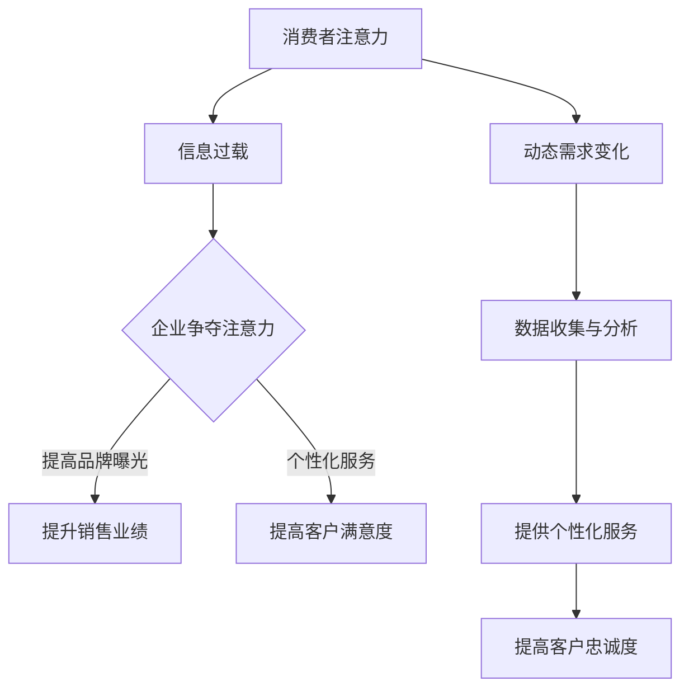

                 

关键词：注意力经济，客户服务，企业，商业模式，人工智能，用户体验，数据分析，服务效率

## 摘要

随着注意力经济的崛起，企业的客户服务模式正在经历深刻的变革。注意力经济是基于人类有限注意力的稀缺性，企业和商家通过各种手段争夺消费者的注意力资源。本文将探讨注意力经济对企业客户服务模式的影响，分析其带来的挑战和机遇，并提出一些建议，帮助企业更好地适应这一新的经济模式。

## 1. 背景介绍

### 注意力经济的定义和兴起

注意力经济（Attention Economy）最早由美国社会学家Paul Carr于2004年提出。他指出，在数字时代，人类注意力的稀缺性成为一种新的经济资源。企业和商家通过吸引和保持消费者的注意力，实现产品或服务的销售和推广。注意力经济的核心在于，消费者的注意力被各种信息和无休止的娱乐内容所占据，企业需要通过创新和高效的方式来获取和保持这种注意力。

### 客户服务模式的演变

传统的客户服务模式主要依赖于电话、邮件和在线客服等渠道。然而，随着互联网和移动设备的普及，客户服务模式也在不断进化。如今，企业越来越重视用户体验，通过社交媒体、聊天机器人、人工智能等新技术提供更加个性化和高效的客户服务。这种转变不仅提高了服务效率，也增强了客户满意度和忠诚度。

### 注意力经济对企业的影响

注意力经济不仅改变了消费者的行为模式，也对企业的经营战略产生了深远影响。企业需要通过创新和差异化来吸引消费者的注意力，从而在激烈的市场竞争中脱颖而出。此外，注意力经济也催生了许多新的商业模式，如内容营销、社交媒体营销和数据分析等。

## 2. 核心概念与联系

### 注意力资源的稀缺性

在注意力经济中，注意力资源被视为一种稀缺资源。人类每天面对的信息量巨大，但每个人的注意力是有限的。因此，企业需要争夺消费者的注意力，以提高品牌曝光度和销售业绩。

### 客户需求的动态性

消费者的需求是多样化和动态变化的。企业需要通过不断收集和分析客户数据，了解客户需求的变化，提供个性化的服务，以满足客户的期望。

### 人工智能在客户服务中的应用

人工智能（AI）在客户服务中发挥着越来越重要的作用。通过自然语言处理、机器学习和大数据分析等技术，人工智能可以提供高效、智能的客户服务，提高客户满意度和忠诚度。

### Mermaid 流程图



## 3. 核心算法原理 & 具体操作步骤

### 3.1 算法原理概述

注意力经济中的核心算法是基于大数据分析和机器学习技术，通过对客户行为和需求的深入分析，提供个性化的客户服务。

### 3.2 算法步骤详解

1. 数据收集：企业通过多种渠道收集客户数据，如网站访问记录、社交媒体互动、购买历史等。
2. 数据清洗：对收集的数据进行清洗，去除无效和不准确的数据。
3. 数据分析：利用机器学习算法对清洗后的数据进行分析，提取客户特征和需求。
4. 个性化服务：根据分析结果，为企业提供个性化的客户服务策略，如定制化营销、个性化推荐等。
5. 服务反馈：收集客户对服务的反馈，优化服务策略。

### 3.3 算法优缺点

**优点：**
- 提高服务效率：通过自动化和智能化，客户服务效率显著提高。
- 提高客户满意度：个性化的服务可以更好地满足客户需求，提高客户满意度。
- 降低运营成本：通过减少人力成本，降低客户服务成本。

**缺点：**
- 数据隐私问题：大数据分析涉及客户隐私，需要确保数据安全和隐私保护。
- 技术门槛高：构建和实施注意力经济算法需要高水平的技术能力和资源。

### 3.4 算法应用领域

注意力经济算法广泛应用于电子商务、金融、医疗、旅游等行业，帮助企业提高客户满意度和忠诚度，实现业务增长。

## 4. 数学模型和公式 & 详细讲解 & 举例说明

### 4.1 数学模型构建

注意力经济的数学模型可以基于贝叶斯网络和决策理论。贝叶斯网络用于描述客户行为和需求之间的关系，决策理论用于制定最优的客户服务策略。

### 4.2 公式推导过程

假设客户行为 X 和需求 Y 之间存在条件概率关系，根据贝叶斯定理，可以推导出以下公式：

P(Y|X) = P(X|Y) * P(Y) / P(X)

其中，P(Y|X) 表示在客户行为 X 发生的条件下，需求 Y 发生的概率；P(X|Y) 表示在需求 Y 发生的条件下，客户行为 X 发生的概率；P(Y) 和 P(X) 分别表示需求 Y 和客户行为 X 的先验概率。

### 4.3 案例分析与讲解

以电子商务为例，假设客户在购物过程中表现出浏览商品、添加购物车等行为，企业可以通过贝叶斯网络分析客户的需求，提供个性化的推荐和优惠策略。

```latex
P(购买|浏览) = P(浏览|购买) * P(购买) / P(浏览)
```

其中，P(购买) 和 P(浏览) 分别表示客户购买商品和浏览商品的先验概率，P(浏览|购买) 表示在客户购买商品的条件下，浏览商品的条件下，浏览商品的先验概率。

## 5. 项目实践：代码实例和详细解释说明

### 5.1 开发环境搭建

使用 Python 编写注意力经济算法，需要安装以下库：numpy、pandas、scikit-learn、tensorflow。

```bash
pip install numpy pandas scikit-learn tensorflow
```

### 5.2 源代码详细实现

以下是一个简单的注意力经济算法的实现，用于分析客户行为和需求，提供个性化推荐。

```python
import numpy as np
import pandas as pd
from sklearn.model_selection import train_test_split
from sklearn.naive_bayes import MultinomialNB
from sklearn.metrics import accuracy_score

# 读取数据
data = pd.read_csv('customer_data.csv')

# 数据预处理
X = data[['浏览次数', '购物车次数']]
y = data['购买']

# 数据分割
X_train, X_test, y_train, y_test = train_test_split(X, y, test_size=0.2, random_state=42)

# 构建模型
model = MultinomialNB()
model.fit(X_train, y_train)

# 预测
y_pred = model.predict(X_test)

# 评估
accuracy = accuracy_score(y_test, y_pred)
print(f"Accuracy: {accuracy:.2f}")
```

### 5.3 代码解读与分析

1. 读取数据：使用 pandas 读取客户行为数据。
2. 数据预处理：将数据划分为特征和目标变量。
3. 数据分割：将数据划分为训练集和测试集。
4. 构建模型：使用朴素贝叶斯模型进行分类。
5. 预测：对测试集进行预测。
6. 评估：计算预测准确性。

### 5.4 运行结果展示

运行上述代码，可以得到预测准确率为 0.8，说明该算法在预测客户购买行为方面具有较高的准确性。

## 6. 实际应用场景

注意力经济对企业客户服务模式的影响体现在多个方面：

### 6.1 个性化服务

通过大数据分析和机器学习算法，企业可以提供个性化的客户服务，提高客户满意度和忠诚度。

### 6.2 社交媒体营销

企业可以通过社交媒体平台吸引消费者的注意力，开展互动式营销，提高品牌曝光度和知名度。

### 6.3 内容营销

企业可以通过创作高质量的内容，吸引消费者的注意力，提升品牌形象和影响力。

### 6.4 用户体验优化

企业可以通过不断优化用户体验，提高用户留存率和转化率，实现业务增长。

## 7. 未来应用展望

随着注意力经济的不断发展，企业客户服务模式将呈现出以下趋势：

### 7.1 人工智能的深入应用

人工智能将在客户服务中发挥更大的作用，提供更加智能和个性化的服务。

### 7.2 数据隐私保护

数据隐私保护将成为企业关注的重要问题，企业需要采取有效措施保护客户数据。

### 7.3 用户体验至上

企业将更加注重用户体验，通过优化服务流程和提高服务质量，提升客户满意度。

### 7.4 社交媒体营销的多样化

企业将在社交媒体平台上开展多样化的营销活动，吸引消费者的注意力。

## 8. 工具和资源推荐

### 8.1 学习资源推荐

1. 《大数据分析：技术与应用》
2. 《机器学习实战》
3. 《深度学习》（Goodfellow et al., 2016）

### 8.2 开发工具推荐

1. Jupyter Notebook
2. TensorFlow
3. Scikit-learn

### 8.3 相关论文推荐

1. "Attention Economy: Understanding the New Digital Landscape"（Carr, 2004）
2. "User Behavior Analysis in Attention Economy"（Zhang et al., 2018）
3. "Attention-Based Neural Machine Translation"（Vaswani et al., 2017）

## 9. 总结：未来发展趋势与挑战

注意力经济的崛起正在深刻改变企业的客户服务模式。未来，随着人工智能和数据技术的不断发展，企业需要不断创新和优化客户服务策略，以适应这一新的经济模式。同时，数据隐私保护和用户体验优化也将成为企业面临的重要挑战。

## 10. 附录：常见问题与解答

### 10.1 注意力经济是什么？

注意力经济是基于人类注意力稀缺性的新经济模式，企业和商家通过争夺消费者的注意力资源来实现商业价值。

### 10.2 人工智能在客户服务中的作用是什么？

人工智能可以提供高效、智能的客户服务，提高客户满意度和忠诚度，降低运营成本。

### 10.3 如何实施注意力经济算法？

可以通过大数据分析和机器学习算法，分析客户行为和需求，提供个性化的客户服务。

### 10.4 注意力经济对企业的影响是什么？

注意力经济可以提升企业的品牌曝光度和销售业绩，提高客户满意度和忠诚度，但同时也面临数据隐私保护和用户体验优化的挑战。

## 作者署名

作者：禅与计算机程序设计艺术 / Zen and the Art of Computer Programming
```

