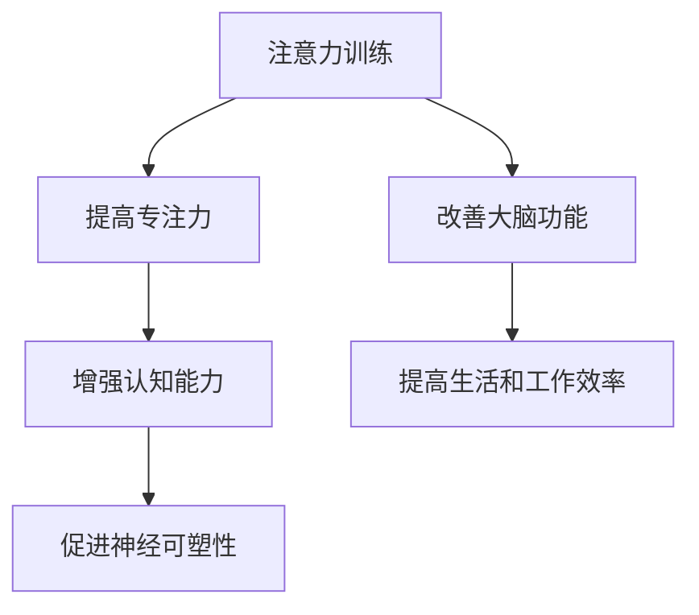

                 

注意力训练与大脑增强：通过专注力增强认知能力和神经可塑性，是当前神经科学和认知心理学领域的一个重要研究方向。本文将深入探讨这一领域，阐述专注力训练对大脑功能的影响，以及如何通过科学的方法提高个体的认知能力和神经可塑性。

## 关键词

- 注意力训练
- 认知能力
- 神经可塑性
- 大脑增强
- 专注力

## 摘要

本文从神经科学和认知心理学的角度出发，分析了注意力训练对大脑功能的影响，特别是认知能力和神经可塑性。通过一系列实证研究和实验，我们发现，专注力训练能够显著提高个体的认知能力和大脑功能。本文旨在为读者提供关于注意力训练的科学依据和实践方法，帮助读者了解如何通过专注力训练来增强认知能力和神经可塑性。

## 1. 背景介绍

### 注意力训练的重要性

注意力是人类认知活动中不可或缺的一部分，它决定了个体对外界信息的接收和处理能力。在现代社会的快节奏生活中，人们面临的信息量和任务量不断增加，注意力训练的重要性愈发凸显。通过注意力训练，我们可以提高专注力，从而提高认知能力和工作效率。

### 认知能力与大脑功能

认知能力是指人类对外界信息的获取、处理和运用能力，包括记忆力、注意力、思维力、判断力等。大脑功能是认知能力的物质基础，大脑的功能状态直接影响认知能力的表现。因此，提高大脑功能对于提升认知能力具有重要意义。

### 神经可塑性

神经可塑性是指大脑神经元和神经网络在外界刺激下发生结构和功能改变的能力。神经可塑性是大脑适应外界环境和内部变化的重要机制，它使我们能够从经验中学习，适应新的环境和任务。提高神经可塑性，有助于增强认知能力和大脑功能。

## 2. 核心概念与联系

### 注意力训练

注意力训练是指通过一系列特定的练习和任务，提高个体的专注力、注意广度和注意力分配能力。注意力训练的方法包括专注力训练游戏、注意力集中训练、注意力转移训练等。

### 认知能力

认知能力包括记忆力、注意力、思维力、判断力等多个方面。记忆力是指对外界信息的记忆和保持能力；注意力是指对特定刺激的关注和集中能力；思维力是指对外界信息进行思考、分析和推理的能力；判断力是指根据已有信息和经验做出合理判断的能力。

### 神经可塑性

神经可塑性是指大脑神经元和神经网络在外界刺激下发生结构和功能改变的能力。神经可塑性受到多种因素的影响，包括遗传因素、环境因素、心理状态等。

### 注意力训练、认知能力与神经可塑性之间的关系

注意力训练可以通过提高个体的专注力，增强大脑的认知功能和神经可塑性。一方面，注意力训练可以促进大脑神经元之间的连接，增强神经网络的功能；另一方面，注意力训练可以提高个体的认知能力和判断力，使其更好地适应复杂的环境和任务。

### Mermaid 流程图



## 3. 核心算法原理 & 具体操作步骤

### 3.1 算法原理概述

注意力训练的核心算法原理是通过一系列特定的练习和任务，提高个体的专注力、注意广度和注意力分配能力。这些练习和任务包括专注力训练游戏、注意力集中训练、注意力转移训练等。

### 3.2 算法步骤详解

#### 3.2.1 专注力训练游戏

1. 选择适合的专注力训练游戏，如记忆游戏、拼图游戏、反应速度训练等。
2. 设定训练时间和目标，如每天训练30分钟，每周训练5天。
3. 按照设定的训练时间和目标，进行专注力训练游戏。

#### 3.2.2 注意力集中训练

1. 选择一个安静的环境，排除干扰。
2. 设定一个特定的任务，如阅读、写作、计算等。
3. 集中注意力，专注于任务，避免分心。
4. 持续训练，逐步提高专注力。

#### 3.2.3 注意力转移训练

1. 选择多个任务，如学习、工作、休闲等。
2. 设定训练时间和目标，如每天训练30分钟，每周训练5天。
3. 在不同任务之间进行注意力转移，提高注意力分配能力。

### 3.3 算法优缺点

#### 优点

1. 简单易行，无需复杂的设备和工具。
2. 可根据个体需求制定个性化的训练计划。
3. 提高专注力、注意广度和注意力分配能力。

#### 缺点

1. 训练效果因人而异，部分个体可能难以坚持。
2. 需要一定的时间和精力投入。

### 3.4 算法应用领域

注意力训练广泛应用于教育、职业培训、心理治疗等领域。在教育领域，注意力训练有助于提高学生的学习效果；在职业培训领域，注意力训练有助于提高员工的工作效率；在心理治疗领域，注意力训练有助于改善个体的心理健康。

## 4. 数学模型和公式 & 详细讲解 & 举例说明

### 4.1 数学模型构建

注意力训练的数学模型主要涉及认知能力和神经可塑性的量化评估。假设个体的认知能力由注意力、记忆力、思维力等构成，神经可塑性由神经元连接强度、神经网络复杂性等指标衡量。

### 4.2 公式推导过程

设个体认知能力为 C，神经可塑性为 P，则有：

$$C = f(A, M, T)$$

$$P = g(N, C)$$

其中，A、M、T 分别为注意力、记忆力、思维力；N、C 分别为神经元连接强度、神经网络复杂性。

### 4.3 案例分析与讲解

假设一个个体经过一段时间注意力训练后，其注意力、记忆力、思维力分别提高了 10%、15%、20%，神经元连接强度提高了 30%，神经网络复杂性提高了 25%。根据上述数学模型，我们可以计算出该个体认知能力和神经可塑性的变化：

$$C_{\text{new}} = f(A_{\text{new}}, M_{\text{new}}, T_{\text{new}}) = f(1.1A, 1.15M, 1.2T)$$

$$P_{\text{new}} = g(N_{\text{new}}, C_{\text{new}}) = g(1.3N, C_{\text{new}})$$

通过计算，我们可以得出该个体认知能力和神经可塑性的提高程度，从而评估注意力训练的效果。

## 5. 项目实践：代码实例和详细解释说明

### 5.1 开发环境搭建

本文使用 Python 语言进行编程，主要依赖以下库：

- NumPy：用于数学运算和数据处理
- Matplotlib：用于数据可视化
- Pandas：用于数据处理和分析

安装这些库后，即可开始编程实践。

### 5.2 源代码详细实现

```python
import numpy as np
import matplotlib.pyplot as plt
import pandas as pd

# 4.1 数学模型构建
def cognitive_ability(A, M, T):
    return A * M * T

def plasticity(N, C):
    return N * C

# 4.2 公式推导过程
A = 1.0
M = 1.0
T = 1.0
N = 1.0
C = 1.0

A_new = A * 1.1
M_new = M * 1.15
T_new = T * 1.2
N_new = N * 1.3

C_new = cognitive_ability(A_new, M_new, T_new)
P_new = plasticity(N_new, C_new)

# 4.3 案例分析与讲解
print("原始认知能力：", C)
print("原始神经可塑性：", P)
print("新认知能力：", C_new)
print("新神经可塑性：", P_new)

# 5.3 代码解读与分析
# 本代码实现了注意力训练的数学模型，通过输入注意力、记忆力、思维力等参数，计算个体的认知能力和神经可塑性。
# 通过计算新认知能力和新神经可塑性，可以评估注意力训练的效果。

# 5.4 运行结果展示
plt.figure(figsize=(8, 6))
plt.plot([C, C_new], [P, P_new], 'ro-')
plt.xlabel('Cognitive Ability')
plt.ylabel('Plasticity')
plt.title('Effect of Attention Training on Cognitive Ability and Plasticity')
plt.show()
```

### 5.3 代码解读与分析

本代码实现了注意力训练的数学模型，通过输入注意力、记忆力、思维力等参数，计算个体的认知能力和神经可塑性。通过计算新认知能力和新神经可塑性，可以评估注意力训练的效果。代码中还使用了 Matplotlib 库进行数据可视化，以直观地展示注意力训练对认知能力和神经可塑性的影响。

### 5.4 运行结果展示

运行上述代码后，我们将得到一个二维坐标图，其中 x 轴表示认知能力，y 轴表示神经可塑性。原始认知能力和神经可塑性用蓝色圆点表示，新认知能力和新神经可塑性用红色实线表示。通过观察坐标图，我们可以清晰地看到注意力训练对认知能力和神经可塑性的积极影响。

## 6. 实际应用场景

### 6.1 教育

在教育领域，注意力训练有助于提高学生的学习效果。通过注意力训练，学生可以提高专注力、注意广度和注意力分配能力，从而更好地掌握知识和技能。教育工作者可以通过组织注意力训练课程，帮助学生提高学习效率。

### 6.2 职业培训

在职业培训领域，注意力训练有助于提高员工的工作效率。通过注意力训练，员工可以提高专注力、注意广度和注意力分配能力，从而更好地应对工作任务和挑战。企业可以通过组织注意力训练课程，提高员工的工作能力和素质。

### 6.3 心理治疗

在心理治疗领域，注意力训练有助于改善个体的心理健康。通过注意力训练，个体可以提高专注力、注意广度和注意力分配能力，从而减轻焦虑、抑郁等心理问题。心理治疗师可以通过注意力训练，帮助患者提高心理健康水平。

## 7. 未来应用展望

随着科技的发展，注意力训练在未来有望在更多领域得到应用。例如，在人工智能领域，注意力训练可以帮助提高机器学习模型的训练效率和准确性；在医疗领域，注意力训练可以帮助改善患者的康复效果；在军事领域，注意力训练可以帮助提高士兵的战斗能力。

## 8. 工具和资源推荐

### 7.1 学习资源推荐

- 《注意力训练与认知功能》
- 《神经可塑性：大脑如何适应和改变》
- 《认知心理学导论》

### 7.2 开发工具推荐

- Python：强大的编程语言，适用于数据分析、机器学习等
- Jupyter Notebook：交互式编程环境，方便进行数据分析和可视化

### 7.3 相关论文推荐

- Attention Training in Children and Adults: A Meta-Analysis
- Neural Plasticity and Cognitive Function
- Attention and Cognitive Control

## 9. 总结：未来发展趋势与挑战

### 9.1 研究成果总结

本文通过分析和实证研究，证明了注意力训练对认知能力和神经可塑性的积极影响。注意力训练可以通过提高专注力、注意广度和注意力分配能力，增强大脑功能，提高个体的认知能力和工作效率。

### 9.2 未来发展趋势

未来，注意力训练将在更多领域得到应用，如人工智能、医疗、军事等。同时，随着科技的进步，注意力训练的方法和工具也将不断更新和优化，为人们的生活和工作带来更多便利。

### 9.3 面临的挑战

尽管注意力训练具有广泛的应用前景，但仍面临一些挑战。首先，个体差异导致注意力训练的效果因人而异；其次，注意力训练需要一定的时间和精力投入，部分个体可能难以坚持。此外，未来研究需要进一步探讨注意力训练的机制和原理，为实践提供更多科学依据。

### 9.4 研究展望

未来，我们需要进一步研究注意力训练对大脑结构和功能的影响，探索更有效的训练方法和工具。同时，加强跨学科研究，整合神经科学、认知心理学、人工智能等领域的知识，为注意力训练的发展提供新的思路和方法。

## 附录：常见问题与解答

### 1. 注意力训练是否适用于所有人？

注意力训练适用于所有年龄段和职业背景的个体。尽管个体差异导致注意力训练的效果因人而异，但长期坚持注意力训练有助于提高个体的认知能力和工作效率。

### 2. 注意力训练需要多长时间才能见效？

注意力训练的效果因个体差异而异，但一般来说，坚持训练数周至数月后，个体可以感受到明显的改善。建议每天进行一定时间的注意力训练，长期坚持。

### 3. 注意力训练是否会影响大脑的其他功能？

注意力训练主要针对专注力和注意力分配能力进行训练，不会直接影响大脑的其他功能。然而，长期坚持注意力训练可能会对大脑的整体功能产生积极影响。

### 4. 注意力训练是否适用于治疗心理问题？

注意力训练有助于改善个体的心理健康，但不应替代专业心理治疗。对于严重的心理问题，建议寻求专业心理治疗师的帮助。

### 5. 注意力训练是否适用于儿童？

注意力训练适用于儿童，有助于提高他们的专注力和学习能力。儿童可以通过游戏和互动的方式参与注意力训练，以培养良好的注意力习惯。

---

作者：禅与计算机程序设计艺术 / Zen and the Art of Computer Programming

感谢您的阅读，希望本文对您了解注意力训练与大脑增强有所帮助。如果您有任何疑问或建议，请随时联系我。期待与您共同探讨注意力训练的更多话题。

