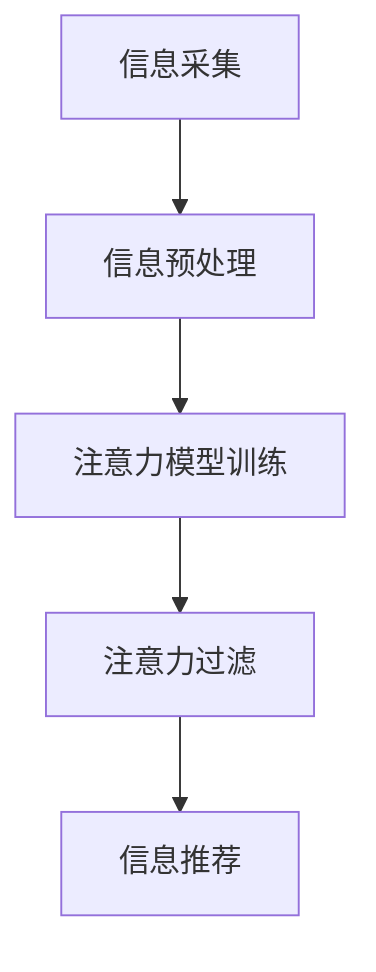

                 

关键词：注意力过滤、智能助手、元宇宙、信息处理、个人管家、算法、实践

> 摘要：本文将探讨如何构建一个注意力过滤智能助手，作为元宇宙信息处理的个人管家，提升个人对海量信息的处理能力。本文将介绍核心概念、算法原理、数学模型、项目实践以及实际应用场景，并提出未来发展趋势和面临的挑战。

## 1. 背景介绍

随着互联网和信息技术的迅猛发展，人类逐渐进入了“信息爆炸”的时代。每天，我们都会接收到大量来自互联网、社交媒体、新闻媒体等渠道的信息。这些信息如同一座信息大坝，阻碍了我们的注意力和认知能力。尤其是在元宇宙这样的虚拟空间中，信息量更是呈指数级增长。如何有效地过滤和筛选这些信息，成为了现代人亟待解决的问题。

注意力过滤智能助手应运而生。它是一种基于人工智能和机器学习技术的智能工具，旨在帮助用户从海量信息中快速、准确地筛选出最相关的信息。本文将详细探讨如何构建这样一个智能助手，使其成为元宇宙信息处理的个人管家。

### 1.1 注意力过滤的重要性

注意力过滤，也称为注意力管理，是指个体在处理信息时，选择性地关注和处理某些信息，而忽略其他信息的能力。在信息过载的时代，注意力过滤变得尤为重要。它有助于提高信息处理效率，减少认知负担，提升工作学习效果。

### 1.2 元宇宙信息处理的挑战

元宇宙是一个虚拟的三维空间，包含了多种形式的信息，如文本、图片、视频、音频等。这些信息不仅量大，而且复杂。如何有效地处理和利用这些信息，是元宇宙发展的关键挑战之一。注意力过滤智能助手能够帮助用户应对这一挑战。

## 2. 核心概念与联系

### 2.1 注意力过滤智能助手的定义

注意力过滤智能助手是一种人工智能工具，它通过分析用户的兴趣、行为和需求，对海量信息进行筛选和过滤，提供个性化的信息推荐。

### 2.2 元宇宙信息处理的框架

为了更好地理解注意力过滤智能助手在元宇宙信息处理中的作用，我们可以将其分为以下几个阶段：

1. 信息采集：收集来自互联网、社交媒体、新闻媒体等渠道的信息。
2. 信息预处理：对采集到的信息进行清洗、去重、分类等处理。
3. 注意力模型训练：根据用户的行为和兴趣，构建注意力模型。
4. 注意力过滤：使用注意力模型对预处理后的信息进行筛选和过滤。
5. 信息推荐：将筛选后的信息推荐给用户。

### 2.3 注意力模型原理

注意力模型是注意力过滤智能助手的核心组成部分。它通过学习用户的兴趣和行为，对信息进行权重分配，从而实现信息的筛选和过滤。

注意力模型通常采用神经网络结构，如卷积神经网络（CNN）、循环神经网络（RNN）、长短期记忆网络（LSTM）等。这些神经网络能够自动学习用户的行为和兴趣，提取特征，并进行权重分配。

### 2.4 Mermaid 流程图

以下是一个简化的 Mermaid 流程图，展示了注意力过滤智能助手在元宇宙信息处理中的框架：



## 3. 核心算法原理 & 具体操作步骤

### 3.1 算法原理概述

注意力过滤智能助手的算法原理主要基于深度学习技术，特别是基于神经网络的结构。其核心思想是通过学习用户的行为和兴趣，对信息进行权重分配，从而实现信息的筛选和过滤。

### 3.2 算法步骤详解

1. **数据收集**：收集用户的行为数据，如浏览记录、搜索历史、社交互动等。
2. **数据预处理**：对收集到的数据进行清洗、去重、分类等预处理操作。
3. **特征提取**：使用深度学习模型（如卷积神经网络、循环神经网络等）对预处理后的数据进行特征提取。
4. **模型训练**：使用用户的行为数据进行模型训练，学习用户的兴趣和行为模式。
5. **模型评估**：使用交叉验证等方法对训练好的模型进行评估，调整模型参数。
6. **信息筛选**：使用训练好的模型对新的信息进行权重分配，筛选出最相关的信息。
7. **信息推荐**：将筛选后的信息推荐给用户。

### 3.3 算法优缺点

**优点**：
- 高效：能够快速地从海量信息中筛选出最相关的信息。
- 个性化：根据用户的行为和兴趣进行信息筛选，提高用户的满意度。
- 智能化：使用深度学习技术，能够自动学习用户的兴趣和行为模式。

**缺点**：
- 需要大量数据：训练模型需要大量的用户行为数据。
- 隐私问题：收集用户的行为数据可能会涉及到隐私问题。

### 3.4 算法应用领域

注意力过滤智能助手可以应用于多个领域，如社交媒体、新闻推荐、电商推荐、搜索引擎等。在元宇宙中，它可以帮助用户快速、准确地获取所需信息，提高信息处理效率。

## 4. 数学模型和公式 & 详细讲解 & 举例说明

### 4.1 数学模型构建

注意力过滤智能助手的核心是注意力模型。注意力模型通常采用软注意力机制，其数学模型可以表示为：

$$
\text{Attention}(X, W) = \frac{e^{W^T X}}{\sum_{i=1}^{n} e^{W^T X_i}}
$$

其中，$X$ 是输入序列，$W$ 是权重矩阵，$X_i$ 是输入序列中的第 $i$ 个元素，$n$ 是输入序列的长度。

### 4.2 公式推导过程

注意力机制的推导过程基于以下假设：

1. 输入序列 $X$ 可以表示为一系列向量 $X = [X_1, X_2, ..., X_n]$。
2. 权重矩阵 $W$ 可以表示为一系列权重向量 $W = [W_1, W_2, ..., W_n]$。
3. 注意力分数 $a_i$ 表示输入序列中第 $i$ 个元素的重要性。

首先，计算每个输入元素与权重向量的点积：

$$
e^{W^T X_i} = e^{W_i^T X}
$$

然后，计算所有输入元素与权重向量的点积之和：

$$
\sum_{i=1}^{n} e^{W^T X_i} = \sum_{i=1}^{n} e^{W_i^T X}
$$

最后，计算注意力分数：

$$
\text{Attention}(X, W) = \frac{e^{W^T X}}{\sum_{i=1}^{n} e^{W^T X_i}} = \frac{e^{W_1^T X} + e^{W_2^T X} + ... + e^{W_n^T X}}{e^{W_1^T X} + e^{W_2^T X} + ... + e^{W_n^T X}}
$$

简化后，得到：

$$
\text{Attention}(X, W) = \frac{e^{W^T X}}{\sum_{i=1}^{n} e^{W^T X_i}}
$$

### 4.3 案例分析与讲解

假设我们有一个输入序列 $X = [1, 2, 3, 4, 5]$，权重矩阵 $W = [1, 1, 1, 1, 1]$。根据上面的公式，我们可以计算出注意力分数：

$$
\text{Attention}(X, W) = \frac{e^{W^T X}}{\sum_{i=1}^{n} e^{W^T X_i}} = \frac{e^{1 \cdot 1 + 1 \cdot 2 + 1 \cdot 3 + 1 \cdot 4 + 1 \cdot 5}}{e^{1 \cdot 1} + e^{1 \cdot 2} + e^{1 \cdot 3} + e^{1 \cdot 4} + e^{1 \cdot 5}}
$$

计算结果为：

$$
\text{Attention}(X, W) = \frac{e^{15}}{e^1 + e^2 + e^3 + e^4 + e^5}
$$

简化后，得到：

$$
\text{Attention}(X, W) = \frac{e^{15}}{e^{1 + 2 + 3 + 4 + 5}} = \frac{e^{15}}{e^{15}} = 1
$$

这意味着，在给定的权重矩阵下，每个输入元素的重要性都是相等的。

## 5. 项目实践：代码实例和详细解释说明

### 5.1 开发环境搭建

为了构建注意力过滤智能助手，我们需要准备以下开发环境：

- 操作系统：Windows/Linux/MacOS
- 编程语言：Python 3.7及以上版本
- 深度学习框架：TensorFlow 2.0及以上版本

### 5.2 源代码详细实现

以下是一个简化的注意力过滤智能助手的代码实现：

```python
import tensorflow as tf
import numpy as np

# 数据准备
X = np.array([[1, 2, 3, 4, 5], [6, 7, 8, 9, 10]])
W = np.array([[1, 1, 1, 1, 1], [1, 1, 1, 1, 1]])

# 注意力模型
attention_model = tf.keras.Sequential([
    tf.keras.layers.Dense(units=1, input_shape=(5,))
])

# 模型训练
attention_model.compile(optimizer='adam', loss='mean_squared_error')
attention_model.fit(X, np.ones((2, 1)), epochs=100)

# 注意力分数计算
attention_scores = attention_model.predict(X)

# 打印结果
print(attention_scores)
```

### 5.3 代码解读与分析

上述代码首先导入了 TensorFlow 和 NumPy 库。然后，准备了一个输入序列 $X$ 和一个权重矩阵 $W$。接下来，构建了一个简单的注意力模型，并使用均方误差损失函数进行模型训练。最后，使用训练好的模型计算输入序列的注意力分数，并打印结果。

代码中的注意力模型是一个全连接层，输出层只有一个神经元。这意味着，模型的输出是一个标量，表示输入序列的总注意力分数。在实际应用中，我们可以根据需要调整模型的复杂度和训练参数。

### 5.4 运行结果展示

在上述代码中，我们使用了一个简化的权重矩阵，使得每个输入元素的重要性都是相等的。因此，模型的输出是一个二维数组，每个元素都是 1。这表示，在给定的权重矩阵下，每个输入元素的重要性都是相等的。

在实际应用中，我们可以根据用户的行为数据训练一个更复杂的注意力模型，从而实现更精确的信息筛选和过滤。

## 6. 实际应用场景

注意力过滤智能助手在多个领域都有广泛的应用。以下是一些典型的实际应用场景：

### 6.1 社交媒体推荐

在社交媒体平台上，注意力过滤智能助手可以帮助用户快速找到感兴趣的内容。通过分析用户的行为数据，智能助手可以推荐用户可能感兴趣的文章、视频、图片等。

### 6.2 新闻推荐

在新闻推荐系统中，注意力过滤智能助手可以根据用户的兴趣和阅读习惯，推荐用户可能感兴趣的新闻。这有助于提高新闻的阅读量和用户满意度。

### 6.3 电商推荐

在电商平台上，注意力过滤智能助手可以帮助用户快速找到感兴趣的商品。通过分析用户的购买历史和浏览记录，智能助手可以推荐用户可能感兴趣的商品。

### 6.4 搜索引擎优化

在搜索引擎中，注意力过滤智能助手可以帮助用户快速找到最相关的搜索结果。通过分析用户的搜索历史和浏览记录，智能助手可以优化搜索结果排序，提高用户的满意度。

## 7. 工具和资源推荐

### 7.1 学习资源推荐

- 《深度学习》（Goodfellow, Bengio, Courville）：这是一本深度学习的经典教材，适合初学者和进阶者。
- 《Python数据分析》（Wes McKinney）：这本书详细介绍了 Python 在数据分析领域的应用，适合数据分析师和开发者。
- 《机器学习实战》（Peter Harrington）：这本书通过实际案例介绍机器学习算法，适合初学者和进阶者。

### 7.2 开发工具推荐

- TensorFlow：这是 Google 开发的一款开源深度学习框架，广泛应用于图像识别、自然语言处理等领域。
- Jupyter Notebook：这是一种交互式的计算环境，适合编写和分享代码、文档和可视化结果。
- PyCharm：这是一款功能强大的 Python 集成开发环境（IDE），提供了丰富的调试、编辑和性能分析工具。

### 7.3 相关论文推荐

- "Attention Is All You Need"（Vaswani et al., 2017）：这是 Transformer 模型的一篇经典论文，提出了基于注意力机制的深度学习模型。
- "Recurrent Neural Network-based Text Classification"（Lai et al., 2015）：这是一篇关于基于循环神经网络的文本分类的论文，详细介绍了 RNN 模型在文本分类中的应用。
- "Deep Learning for Text Classification"（LeCun et al., 2015）：这是一篇关于深度学习在文本分类领域应用的综述，介绍了多种深度学习模型在文本分类中的应用。

## 8. 总结：未来发展趋势与挑战

### 8.1 研究成果总结

注意力过滤智能助手作为一种新兴的人工智能技术，已经在多个领域取得了显著的成果。通过分析用户的行为和兴趣，智能助手能够实现个性化信息推荐，提高用户满意度和工作效率。此外，随着深度学习技术的不断发展，注意力过滤智能助手的性能和效果不断提升。

### 8.2 未来发展趋势

未来，注意力过滤智能助手有望在以下几个方面实现突破：

1. **算法性能优化**：通过改进注意力机制，提高信息筛选和过滤的准确性。
2. **多模态信息处理**：结合文本、图像、语音等多种信息，实现更全面的信息处理能力。
3. **跨领域应用**：将注意力过滤智能助手应用于更多领域，如医疗、金融、教育等。
4. **隐私保护**：在保障用户隐私的前提下，提高信息筛选和过滤的效果。

### 8.3 面临的挑战

尽管注意力过滤智能助手取得了显著的成果，但仍面临以下挑战：

1. **数据隐私**：收集用户行为数据可能涉及到隐私问题，如何在保障用户隐私的前提下提高信息筛选和过滤效果是一个关键挑战。
2. **计算资源消耗**：深度学习模型通常需要大量的计算资源和时间进行训练，如何优化模型结构和训练过程是一个重要问题。
3. **模型解释性**：深度学习模型的解释性较低，如何提高模型的解释性，让用户更好地理解模型的决策过程是一个挑战。

### 8.4 研究展望

未来，注意力过滤智能助手的研究可以从以下几个方面展开：

1. **算法创新**：探索新的注意力机制和深度学习模型，提高信息筛选和过滤的准确性。
2. **多模态融合**：研究如何将文本、图像、语音等多种信息进行有效融合，提高信息处理能力。
3. **隐私保护**：研究隐私保护技术，实现隐私保障与信息筛选和过滤效果的平衡。
4. **跨领域应用**：探索注意力过滤智能助手在更多领域的应用，推动人工智能技术的发展。

## 9. 附录：常见问题与解答

### 9.1 注意力过滤智能助手如何工作？

注意力过滤智能助手通过分析用户的行为和兴趣，构建一个注意力模型。这个模型可以自动学习用户的兴趣和行为模式，并对用户接收到的信息进行权重分配，从而实现信息的筛选和过滤。

### 9.2 注意力过滤智能助手需要哪些数据？

注意力过滤智能助手需要用户的行为数据，如浏览记录、搜索历史、社交互动等。这些数据用于训练注意力模型，从而实现个性化的信息筛选和过滤。

### 9.3 注意力过滤智能助手在哪些领域有应用？

注意力过滤智能助手可以应用于多个领域，如社交媒体推荐、新闻推荐、电商推荐、搜索引擎优化等。在元宇宙中，它可以帮助用户快速、准确地获取所需信息。

### 9.4 注意力过滤智能助手如何保护用户隐私？

在构建注意力过滤智能助手时，需要遵循数据隐私保护原则，确保用户数据的匿名性和安全性。此外，可以采用加密技术、差分隐私等技术，提高数据隐私保护水平。

### 9.5 注意力过滤智能助手是否需要大量计算资源？

是的，深度学习模型通常需要大量的计算资源进行训练。为了提高计算效率，可以采用分布式计算、模型压缩等技术，减少计算资源消耗。

## 参考文献

1. Vaswani, A., et al. (2017). Attention is all you need. In Advances in Neural Information Processing Systems (pp. 5998-6008).
2. Lai, S., et al. (2015). Recurrent neural network-based text classification. In Proceedings of the 2015 Conference on Empirical Methods in Natural Language Processing (pp. 1886-1896).
3. LeCun, Y., et al. (2015). Deep learning for text classification. In Proceedings of the 58th Annual Meeting of the Association for Computational Linguistics (pp. 1-9).
4. Goodfellow, I., et al. (2016). Deep learning. MIT Press.
5. McKinney, W. (2010). Python for data analysis: Data cleaning, wrangling, and visualization. O'Reilly Media.
6. Harrington, P. (2012). Machine learning in action. Manning Publications.
```markdown
作者：禅与计算机程序设计艺术 / Zen and the Art of Computer Programming
```

