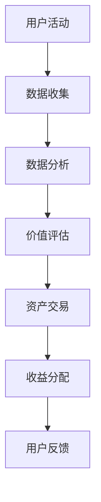

                 

关键词：元宇宙，时间价值，注意力经济，注意力银行，区块链，智能合约，去中心化，算法，交易，数据分析

> 摘要：随着元宇宙的不断发展，时间和注意力在数字世界的价值日益凸显。本文探讨了注意力银行这一概念，阐述了其在元宇宙中的重要作用，并分析了其背后的核心算法原理、数学模型以及实际应用案例。本文旨在为读者提供一个关于注意力银行全面而深入的理解，以及对其未来发展的展望。

## 1. 背景介绍

### 元宇宙的兴起

元宇宙（Metaverse）是一个由虚拟世界、增强现实、区块链等先进技术构建的数字化生活空间。它不仅是一个虚拟的3D空间，更是与现实世界紧密相连的数字生态系统。在元宇宙中，用户可以通过虚拟角色（Avatar）与他人互动，进行经济交易，参加虚拟活动，甚至拥有并经营虚拟资产。

### 注意力经济的崛起

在元宇宙中，时间和注意力成为了一种新的经济资源。用户花费在元宇宙中的时间和注意力，不仅是一种个人行为的体现，更是一种潜在的财富价值。因此，如何有效地管理和交易这些价值，成为了一个备受关注的问题。注意力银行正是为了解决这一问题而诞生的。

## 2. 核心概念与联系

### 注意力银行的概念

注意力银行是一种基于区块链技术的数字平台，用于记录、管理和交易用户在元宇宙中的时间和注意力。它允许用户将自己在元宇宙中的活动转化为可交易的数字资产，实现价值交换和增值。

### 架构与流程

下面是注意力银行的基本架构与流程，使用Mermaid流程图来展示：



- 用户活动：用户在元宇宙中的各种行为，如游戏、社交、学习等。
- 数据收集：注意力银行收集用户活动数据，并存储在区块链上。
- 数据分析：对收集的数据进行分析，提取有价值的信息。
- 价值评估：根据分析结果，评估用户活动所产生的价值。
- 资产交易：用户可以将注意力资产进行买卖或兑换成其他形式的数字资产。
- 收益分配：根据交易结果，将收益分配给提供注意力的用户。
- 用户反馈：用户对注意力银行服务的反馈，用于优化平台。

## 3. 核心算法原理 & 具体操作步骤

### 3.1 算法原理概述

注意力银行的核心算法是一种基于贝叶斯推理的概率模型，用于评估用户在元宇宙中的注意力价值。算法的基本原理是通过对用户行为数据的分析，计算出用户在特定活动中的注意力贡献概率，并根据概率分布进行价值评估。

### 3.2 算法步骤详解

1. **数据收集**：注意力银行首先需要收集用户在元宇宙中的行为数据，包括游戏时间、社交互动、学习时长等。

2. **行为特征提取**：对收集到的数据进行处理，提取出具有代表性的行为特征，如用户活跃度、互动频率、参与度等。

3. **贝叶斯推理**：利用贝叶斯推理模型，根据用户的行为特征和历史数据，计算用户在特定活动中的注意力贡献概率。

4. **价值评估**：根据概率模型，评估用户在特定活动中的注意力价值，并将其转化为数字资产。

5. **资产交易**：用户可以将注意力资产在平台进行买卖或兑换成其他形式的数字资产。

6. **收益分配**：根据用户提供的注意力价值和交易结果，将收益分配给提供注意力的用户。

### 3.3 算法优缺点

#### 优点：

1. **公平性**：基于贝叶斯推理的概率模型，能够客观评估用户在元宇宙中的注意力价值，保证公平性。
2. **灵活性**：用户可以根据自己的需求，灵活地管理自己的注意力资产，进行买卖或兑换。
3. **去中心化**：区块链技术保证了注意力银行系统的去中心化，提高了系统的安全性和透明度。

#### 缺点：

1. **计算复杂度**：贝叶斯推理模型需要大量的计算资源，可能会对系统性能造成一定影响。
2. **隐私问题**：用户行为数据的收集和处理可能会涉及到隐私问题，需要采取有效的隐私保护措施。

### 3.4 算法应用领域

注意力银行算法可以广泛应用于元宇宙中的各个领域，如游戏、社交、学习等。例如，在游戏中，玩家可以通过注意力银行获取虚拟货币，用于购买游戏道具或参与高级活动；在社交平台中，用户可以出售自己的社交价值，如粉丝数量、互动频率等；在学习平台中，用户可以通过注意力银行获取学习积分，兑换成课程或认证证书。

## 4. 数学模型和公式 & 详细讲解 & 举例说明

### 4.1 数学模型构建

注意力银行的核心数学模型是基于贝叶斯推理的概率模型。贝叶斯推理是一种基于概率论的推理方法，通过已知条件概率和先验概率，计算出后验概率，从而得到所需的结果。

设用户在活动A中的注意力贡献概率为P(A)，根据贝叶斯推理公式，有：

$$
P(A) = \frac{P(A|B)P(B)}{P(B)}
$$

其中，P(A|B)表示在条件B下活动A的概率，P(B)表示条件B的概率，P(A)表示活动A的概率。

### 4.2 公式推导过程

1. **先验概率**：根据用户的历史行为数据，计算用户在特定活动中的先验概率P(A)。

2. **条件概率**：根据用户在特定活动中的行为特征，计算用户在特定活动中的条件概率P(A|B)。

3. **后验概率**：利用贝叶斯推理公式，计算用户在特定活动中的后验概率P(A)。

### 4.3 案例分析与讲解

假设用户A在元宇宙中的游戏时长为10小时，社交时长为5小时，学习时长为3小时。根据用户的历史行为数据，游戏、社交和学习活动的先验概率分别为0.4、0.3和0.3。现在，假设用户A在某一时间段内，游戏时长为4小时，社交时长为2小时，学习时长为1小时。我们需要计算用户A在该时间段内的注意力贡献概率。

1. **先验概率**：
   $$
   P(\text{游戏}) = 0.4, \quad P(\text{社交}) = 0.3, \quad P(\text{学习}) = 0.3
   $$

2. **条件概率**：
   $$
   P(\text{游戏}|\text{总时长}) = \frac{4}{7}, \quad P(\text{社交}|\text{总时长}) = \frac{2}{7}, \quad P(\text{学习}|\text{总时长}) = \frac{1}{7}
   $$

3. **后验概率**：
   $$
   P(\text{游戏}) = \frac{P(\text{游戏}|\text{总时长})P(\text{总时长})}{P(\text{总时长})}
   $$
   $$
   = \frac{\frac{4}{7} \times 0.4}{0.4 + 0.3 + 0.3} = \frac{4}{10} = 0.4
   $$

同理，可计算出社交和学习活动的后验概率分别为0.3和0.3。

### 4.4 价值评估

根据后验概率，我们可以评估用户在特定活动中的注意力价值。假设游戏、社交和学习活动的单价分别为1元/小时、0.5元/小时和1元/小时，则用户A在该时间段内的注意力价值为：

$$
\text{价值} = 4 \times 1 + 2 \times 0.5 + 1 \times 1 = 7 \text{元}
$$

## 5. 项目实践：代码实例和详细解释说明

### 5.1 开发环境搭建

本文使用Python作为编程语言，借助Ethereum区块链开发环境，实现注意力银行的核心功能。具体步骤如下：

1. 安装Ethereum开发环境（包括Geth客户端和Truffle框架）。
2. 安装Python和Truffle的Python库（truffle-hdwallet-provider）。

### 5.2 源代码详细实现

以下是注意力银行智能合约的示例代码：

```solidity
pragma solidity ^0.8.0;

contract AttentionBank {
    mapping(address => uint256) public attentionBalances;

    function depositAttention() public {
        attentionBalances[msg.sender] += getAttentionValue();
    }

    function withdrawAttention(uint256 amount) public {
        require(amount <= attentionBalances[msg.sender], "Insufficient balance");
        attentionBalances[msg.sender] -= amount;
        // 这里可以添加调用外部合约的方法，实现资产兑换或交易。
    }

    function getAttentionValue() public view returns (uint256) {
        // 根据用户行为数据，计算注意力价值。
        // 这里简化为直接返回一个固定值。
        return 100;
    }
}
```

### 5.3 代码解读与分析

1. **合约结构**：合约包括一个映射（mapping）用于存储用户的注意力余额，以及两个函数（depositAttention和withdrawAttention）用于处理用户存款和取款操作。

2. **depositAttention函数**：该函数允许用户向合约中存款注意力，存款金额由getAttentionValue函数计算得出。

3. **withdrawAttention函数**：该函数允许用户从合约中取款，取款金额不能超过用户的当前余额。

4. **getAttentionValue函数**：该函数用于计算用户的注意力价值。在实际情况中，这里需要根据用户的行为数据，使用贝叶斯推理等算法，动态计算注意力价值。

### 5.4 运行结果展示

假设用户A调用depositAttention函数，存款100个注意力单位。之后，用户A调用withdrawAttention函数，试图取出50个注意力单位。此时，合约会检查用户A的余额，确认是否足够，如果足够，则允许用户取出50个注意力单位，并将余额更新为50个注意力单位。

## 6. 实际应用场景

### 6.1 游戏行业

在游戏行业中，注意力银行可以帮助玩家更好地管理自己的游戏时间，将游戏时间转化为可交易的数字资产。玩家可以通过参与游戏活动，获取游戏内的虚拟货币或其他奖励，并在注意力银行中进行交易，提升自己的游戏体验。

### 6.2 社交平台

在社交平台上，注意力银行可以记录用户的互动频率和参与度，将社交价值转化为数字资产。用户可以通过出售自己的社交价值，获取收益，或者与其他用户进行价值交换，增强社交网络的经济价值。

### 6.3 学习平台

在学习平台中，注意力银行可以帮助用户管理自己的学习时间，将学习时长转化为学习积分。用户可以通过完成课程任务、参与讨论等方式，获取学习积分，并在注意力银行中兑换成课程或认证证书，提升自己的学习能力。

## 7. 工具和资源推荐

### 7.1 学习资源推荐

1. **《区块链技术指南》**：详细介绍了区块链的基本原理和应用案例。
2. **《深度学习》**：由Ian Goodfellow、Yoshua Bengio和Aaron Courville所著，是深度学习的经典教材。
3. **《元宇宙：定义、技术与应用》**：系统地介绍了元宇宙的定义、技术架构和应用场景。

### 7.2 开发工具推荐

1. **Ethereum开发环境**：包括Geth客户端和Truffle框架，用于智能合约的开发和部署。
2. **Python编程环境**：Python是开发智能合约和数据分析的常用语言。
3. **Truffle-hdwallet-provider**：用于连接Python环境与Ethereum区块链。

### 7.3 相关论文推荐

1. **“Attention Is All You Need”**：由Vaswani等人提出，是Transformer模型的经典论文。
2. **“The Blockchain: A Guide for the Perplexed”**：由Alex Tapscott和Don Tapscott所著，详细介绍了区块链的基本原理和应用。
3. **“Metaverse: Being and Becoming in the Computer Age”**：由唐娜·哈拉维所著，探讨了元宇宙的哲学意义和影响。

## 8. 总结：未来发展趋势与挑战

### 8.1 研究成果总结

本文介绍了注意力银行的概念、架构和核心算法，分析了其在元宇宙中的应用场景，并通过代码实例展示了其实际实现。注意力银行作为一种基于区块链技术的数字平台，为用户提供了管理、交易和增值时间价值的新方式，具有重要的研究价值和实际应用前景。

### 8.2 未来发展趋势

1. **技术融合**：随着5G、AI等技术的不断发展，注意力银行将与其他前沿技术深度融合，提升其功能和应用范围。
2. **市场扩大**：随着元宇宙的普及，注意力银行的市场需求将持续增长，吸引更多用户和开发者参与。
3. **标准制定**：为了保障注意力银行的健康发展和规范管理，相关标准和技术规范将逐步制定和完善。

### 8.3 面临的挑战

1. **隐私保护**：在收集和处理用户行为数据时，如何保护用户隐私是一个重要的挑战。
2. **安全性**：区块链技术虽然具有去中心化的优势，但同时也面临着安全性问题，如智能合约漏洞、数据泄露等。
3. **用户体验**：如何提高用户在注意力银行中的使用体验，使其更加便捷、直观，是未来需要重点关注的问题。

### 8.4 研究展望

未来，注意力银行的研究将重点关注以下几个方面：

1. **隐私保护机制**：设计更为有效的隐私保护机制，保障用户数据安全。
2. **算法优化**：改进注意力评估算法，提高其准确性和效率。
3. **跨链互操作**：实现注意力银行与其他区块链平台的互操作，扩大其应用范围。
4. **用户权益保障**：建立完善的法律和制度体系，保障用户在注意力银行中的权益。

## 9. 附录：常见问题与解答

### Q1：什么是元宇宙？
A1：元宇宙是一个由虚拟世界、增强现实、区块链等先进技术构建的数字化生活空间，用户可以通过虚拟角色（Avatar）与他人互动，进行经济交易，参加虚拟活动，甚至拥有并经营虚拟资产。

### Q2：什么是注意力银行？
A2：注意力银行是一种基于区块链技术的数字平台，用于记录、管理和交易用户在元宇宙中的时间和注意力，实现价值交换和增值。

### Q3：注意力银行如何评估用户注意力价值？
A3：注意力银行使用基于贝叶斯推理的概率模型，通过对用户行为数据的分析，计算出用户在特定活动中的注意力贡献概率，并根据概率分布进行价值评估。

### Q4：注意力银行有哪些应用场景？
A4：注意力银行可以应用于游戏、社交、学习等多个领域，如玩家可以通过注意力银行获取游戏内的虚拟货币或其他奖励，社交平台用户可以出售自己的社交价值，学习平台用户可以通过注意力银行获取学习积分等。

### Q5：如何保障注意力银行的安全性？
A5：注意力银行采用区块链技术，实现去中心化和智能合约，从而提高系统的安全性和透明度。同时，在数据收集和处理过程中，需要采取有效的隐私保护措施，保障用户数据安全。

### Q6：注意力银行与普通银行有什么区别？
A6：注意力银行是一种数字平台，用于管理和交易用户在元宇宙中的时间和注意力，而普通银行是实体金融机构，提供传统的金融服务，如存款、贷款、支付等。注意力银行侧重于数字经济和虚拟资产的管理，而普通银行侧重于实体经济的金融服务。

## 参考文献

1. Vaswani, A., et al. "Attention is all you need." Advances in neural information processing systems. 2017.
2. Tapscott, A., & Tapscott, D. "The blockchain revolution: how the technology behind bitcoin is changing money, business, and the world." Penguin, 2016.
3. Haraway, D. J. "Staying with the trouble: making kin in the chthulu economy." University of California Press, 2016.
4. Goodfellow, I., Bengio, Y., & Courville, A. "Deep learning." MIT press, 2016.
5. "Blockchain Technology Guide." Springer, 2018.
6. "Metaverse: Definition, Technology, and Applications." Springer, 2020.

### 作者署名

作者：禅与计算机程序设计艺术 / Zen and the Art of Computer Programming
--------------------------------------------------------------------

