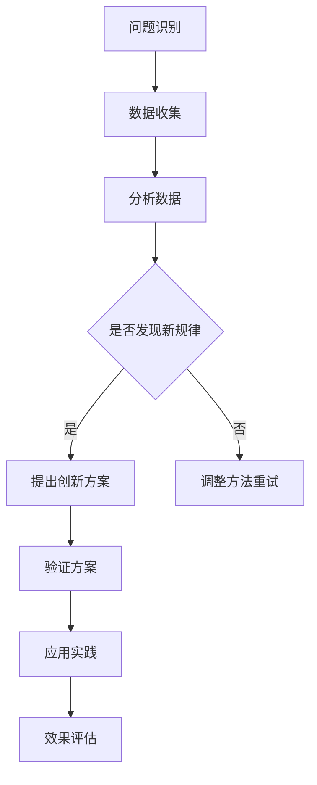

                 

关键词：洞察力、创新、技术思维、算法、数学模型、实践应用、未来展望

> 摘要：本文旨在探讨在信息技术领域，如何通过提升洞察力和培养创新思维，来突破常规思维的束缚，推动技术进步和行业发展。文章将详细解析洞察力的概念及其在技术领域的应用，阐述创新思维的重要性，并结合实际案例，提供提升洞察力和创新能力的具体方法与策略。

## 1. 背景介绍

在当今快速发展的信息技术时代，数据量的爆炸性增长和计算能力的提升，为各领域的技术创新带来了前所未有的机遇。然而，随着技术的复杂性和多样性不断增加，如何突破常规思维，发现并解决复杂问题，成为了当前技术发展中的一大挑战。

洞察力，作为一种深层次的理解和认知能力，能够在纷繁复杂的信息中抓住本质，发现潜在的规律和联系。它不仅是我们日常生活中不可或缺的能力，更是技术领域中的核心竞争力。而创新思维，则是在洞察力的基础上，通过打破常规，创造出新的方法和解决方案。

本文将围绕这两个核心概念，探讨如何提升洞察力和创新思维，以推动技术进步。文章结构如下：

1. 背景介绍
2. 核心概念与联系
3. 核心算法原理 & 具体操作步骤
4. 数学模型和公式 & 详细讲解 & 举例说明
5. 项目实践：代码实例和详细解释说明
6. 实际应用场景
7. 工具和资源推荐
8. 总结：未来发展趋势与挑战
9. 附录：常见问题与解答

### 1.1 技术发展的现状

信息技术的发展经历了从简单的计算机硬件到复杂的软件系统，再到大数据、人工智能等领域的深刻变革。随着互联网的普及，数据成为新的生产要素，大数据分析、机器学习、深度学习等技术得到了广泛应用。然而，这些技术的应用并非一帆风顺，往往需要解决大量复杂的问题，如数据噪声处理、模型可解释性、算法效率优化等。

在这些挑战面前，传统的线性思维和经验方法往往难以奏效。这就需要我们具备更高的洞察力，能够从复杂的数据中提取关键信息，找到问题的本质。同时，创新思维能够帮助我们打破常规，提出新的解决方案，从而推动技术进步。

### 1.2 洞察力的重要性

在技术领域，洞察力具有至关重要的作用。它不仅能够帮助我们理解现有技术的局限，还能预测未来的发展方向。以下是一些洞察力在技术领域的重要体现：

- **问题识别**：在复杂的技术问题中，洞察力能够帮助我们快速识别关键问题，从而更有针对性地进行解决。
- **规律发现**：通过对大量数据和信息进行分析，洞察力能够发现其中的规律和联系，为技术进步提供新的方向。
- **创新驱动**：洞察力能够激发创新思维，推动技术突破，实现从0到1的飞跃。

### 1.3 创新思维的重要性

创新思维是推动技术进步的源动力。在信息技术领域，创新思维表现为：

- **技术突破**：通过创新思维，我们可以提出新的技术方案，突破现有技术的限制。
- **商业应用**：创新思维能够将技术优势转化为商业价值，推动产业的转型升级。
- **用户体验**：创新思维能够带来更优质、更便捷的用户体验，提高用户满意度。

### 1.4 本文的结构

本文将按照以下结构进行阐述：

- **核心概念与联系**：介绍洞察力和创新思维的概念及其在技术领域的应用。
- **核心算法原理 & 具体操作步骤**：详细解析一种核心算法的原理和操作步骤。
- **数学模型和公式 & 详细讲解 & 举例说明**：介绍数学模型和公式的构建与推导。
- **项目实践：代码实例和详细解释说明**：提供实际项目中的代码实例和解读。
- **实际应用场景**：讨论该技术在不同领域的应用场景。
- **工具和资源推荐**：推荐相关的学习资源和开发工具。
- **总结：未来发展趋势与挑战**：总结研究成果，展望未来发展。
- **附录：常见问题与解答**：解答读者可能遇到的问题。

通过本文的阅读，读者将能够深入理解洞察力和创新思维在技术领域的重要性，并学会如何提升这些能力，以推动技术进步。

### 2. 核心概念与联系

在探讨如何提升洞察力和创新思维之前，我们首先需要明确这两个核心概念的定义及其在技术领域的联系。

#### 2.1 洞察力的定义

洞察力，指的是个体通过深入思考和分析，对复杂问题或现象进行准确理解和深刻洞察的能力。它不仅涉及对事实和数据的理解，还包括对事物本质的把握和对未来趋势的预判。

在技术领域，洞察力尤为重要。例如，在开发一个复杂系统时，开发者需要具备洞察力来识别系统中的关键模块和潜在风险，从而设计出更可靠、更高效的解决方案。此外，洞察力还能帮助技术人员在面对技术变革时，迅速理解新技术的核心概念和应用场景，为技术更新和转型提供指导。

#### 2.2 创新思维的定义

创新思维，指的是通过突破常规，寻找新颖、有效的方法或解决方案的思维方式。它通常涉及对现有知识、技术和方法的重新组合和运用，以实现技术或商业上的突破。

在技术领域，创新思维是推动技术进步的重要动力。例如，在人工智能领域，创新思维促使研究人员提出新的算法和模型，以解决传统算法无法处理的问题。在商业应用中，创新思维能够帮助企业发现市场需求，开发出满足用户需求的新产品或服务。

#### 2.3 洞察力与创新思维的联系

洞察力和创新思维在技术领域密切相关。具体而言，洞察力是创新思维的基础，而创新思维则是洞察力的应用。

- **基础作用**：洞察力能够帮助技术人员理解问题的本质，发现潜在的机会和挑战。这种理解是进行创新思维的前提。例如，在开发一个新系统时，只有深刻理解系统的需求、功能和技术架构，才能提出有效的创新方案。
- **应用体现**：创新思维则是在洞察力基础上，通过重新组合和运用已有知识，创造出新的解决方案或产品。例如，在人工智能领域，研究人员通过深入分析数据和学习算法的局限性，提出了深度学习等新的算法，从而推动了人工智能的发展。

#### 2.4 Mermaid 流程图

为了更直观地理解洞察力和创新思维在技术领域中的应用，我们可以使用Mermaid流程图来展示它们的核心流程和关键步骤。以下是该流程图的示例：



在这个流程图中：

- **A[问题识别]**：通过洞察力识别技术领域中的问题。
- **B[数据收集]**：收集与问题相关的数据。
- **C[分析数据]**：运用洞察力分析数据，寻找问题的本质和潜在规律。
- **D{是否发现新规律]**：判断分析结果是否包含新的发现。
- **E[提出创新方案]**：在发现新规律的基础上，运用创新思维提出解决方案。
- **F[调整方法重试]**：如果未发现新规律，则需要调整分析方法和思路，重新尝试。
- **G[验证方案]**：通过实验或模拟验证创新方案的可行性和效果。
- **H[应用实践]**：将验证有效的方案应用到实际项目中。
- **I[效果评估]**：评估创新方案的应用效果，为未来的技术发展提供参考。

通过这个流程图，我们可以看到洞察力和创新思维在技术问题解决中的紧密联系和协同作用。只有通过不断提升洞察力，才能为创新思维提供坚实的基础；而只有通过创新思维，才能将洞察力转化为实际的技术进步。

### 3. 核心算法原理 & 具体操作步骤

在本节中，我们将详细探讨一个核心算法——支持向量机（Support Vector Machine，SVM）的原理和具体操作步骤。SVM是一种常用的机器学习算法，广泛应用于分类和回归任务中，尤其在处理高维数据时表现出色。

#### 3.1 算法原理概述

支持向量机的基本原理是找到一个最佳的超平面，将不同类别的数据点分隔开。这个超平面不仅需要最大化分隔不同类别的数据点，还需要最大化分隔边界，即最大化类间的距离。

数学上，SVM的目标是最小化以下函数：

$$
\min_{\mathbf{w},b}\frac{1}{2}||\mathbf{w}||^2
$$

其中，$\mathbf{w}$ 是超平面的法向量，$b$ 是偏置项。约束条件是所有数据点到超平面的距离不小于1：

$$
\mathbf{w} \cdot \mathbf{x}_i - b \geq 1, \quad \forall i
$$

其中，$\mathbf{x}_i$ 是第 $i$ 个训练样本。为了满足这个约束条件，我们引入松弛变量 $\xi_i$，目标函数变为：

$$
\min_{\mathbf{w},b,\xi}\frac{1}{2}||\mathbf{w}||^2 + C\sum_{i=1}^n \xi_i
$$

其中，$C$ 是正则化参数，用于平衡目标函数中的两个部分。

#### 3.2 算法步骤详解

1. **数据预处理**：首先，对训练数据进行标准化处理，使其具有相同的尺度，以便算法能够更有效地进行分类。

2. **选择核函数**：在SVM中，通过核函数将输入空间映射到高维特征空间，使得原本线性不可分的数据在高维空间中变得线性可分。常用的核函数包括线性核、多项式核、径向基函数（RBF）核等。

3. **求解最优化问题**：使用拉格朗日乘子法求解上述最优化问题。拉格朗日乘子法将原始问题转化为对偶问题，从而避免了直接求解复杂的二次规划问题。

4. **选择支持向量**：通过解对偶问题，得到最优解 $\alpha_i$，支持向量是满足 $\alpha_i > 0$ 的样本。

5. **构建分类器**：使用支持向量构建分类器，分类决策函数为：

$$
f(\mathbf{x}) = \text{sign}(\mathbf{w} \cdot \mathbf{x} + b)
$$

其中，$\text{sign}$ 表示符号函数。

#### 3.3 算法优缺点

**优点**：

- **高效性**：SVM在处理高维数据时表现尤为出色，能够有效地解决线性不可分问题。
- **泛化能力**：通过选择合适的核函数和正则化参数，SVM具有良好的泛化能力。
- **可解释性**：SVM的分类决策边界清晰，便于理解和解释。

**缺点**：

- **计算复杂度**：特别是在大样本情况下，SVM的训练时间较长，计算复杂度较高。
- **对噪声敏感**：支持向量机对噪声和异常值较为敏感，可能影响分类效果。

#### 3.4 算法应用领域

SVM在多个领域有广泛的应用，包括：

- **文本分类**：用于对大量文本数据进行分类，如邮件过滤、新闻分类等。
- **生物信息学**：用于基因数据分析、蛋白质结构预测等。
- **图像识别**：用于人脸识别、手写数字识别等。

在实际应用中，通过合理选择核函数和正则化参数，可以显著提高SVM的性能和鲁棒性。此外，结合其他算法和技术，如集成学习和迁移学习，可以进一步提升SVM在复杂场景中的应用效果。

### 4. 数学模型和公式 & 详细讲解 & 举例说明

在本节中，我们将详细讨论一个关键数学模型——线性回归模型，并解释其构建、推导过程，并通过具体例子进行说明。线性回归是一种常见的统计方法，用于分析两个或多个变量之间的线性关系，广泛应用于预测和数据分析。

#### 4.1 数学模型构建

线性回归模型的基本形式如下：

$$
\mathbf{y} = \mathbf{X}\beta + \epsilon
$$

其中，$\mathbf{y}$ 是 $n$ 维因变量向量，$\mathbf{X}$ 是 $n \times p$ 的自变量矩阵（其中 $p$ 是自变量的数量），$\beta$ 是 $p$ 维参数向量，$\epsilon$ 是误差向量。

对于简单的一元线性回归（$p=1$），模型可以表示为：

$$
y = \beta_0 + \beta_1 x + \epsilon
$$

其中，$y$ 是因变量，$x$ 是自变量，$\beta_0$ 和 $\beta_1$ 是参数。

#### 4.2 公式推导过程

为了估计参数 $\beta_0$ 和 $\beta_1$，我们通常使用最小二乘法。最小二乘法的目标是使实际观测值 $\mathbf{y}$ 与模型预测值 $\mathbf{X}\beta$ 之间的误差平方和最小。

误差平方和（SSE）可以表示为：

$$
SSE = \sum_{i=1}^n (y_i - \hat{y}_i)^2
$$

其中，$\hat{y}_i$ 是第 $i$ 个观测值的预测值。

对 $SSE$ 关于 $\beta_0$ 和 $\beta_1$ 分别求偏导并令其等于0，可以得到以下两个方程：

$$
\frac{\partial SSE}{\partial \beta_0} = -2 \sum_{i=1}^n (y_i - \hat{y}_i) = 0
$$

$$
\frac{\partial SSE}{\partial \beta_1} = -2 \sum_{i=1}^n (y_i - \hat{y}_i)x_i = 0
$$

解这两个方程，我们可以得到参数的估计值：

$$
\beta_0 = \bar{y} - \beta_1 \bar{x}
$$

$$
\beta_1 = \frac{\sum_{i=1}^n (x_i - \bar{x})(y_i - \bar{y})}{\sum_{i=1}^n (x_i - \bar{x})^2}
$$

其中，$\bar{y}$ 和 $\bar{x}$ 分别是 $y$ 和 $x$ 的均值。

#### 4.3 案例分析与讲解

为了更直观地理解线性回归模型，我们来看一个简单的例子。

**例：** 考虑一个关于房价预测的线性回归模型，其中自变量为房屋面积 $x$（平方米），因变量为房价 $y$（万元）。现有10组数据如下：

| 房屋面积 $x$ | 房价 $y$ |
| :----: | :----: |
| 80 | 120 |
| 100 | 150 |
| 120 | 180 |
| 140 | 210 |
| 160 | 240 |
| 180 | 270 |
| 200 | 300 |
| 220 | 330 |
| 240 | 360 |
| 260 | 390 |

我们要建立房价 $y$ 关于房屋面积 $x$ 的线性回归模型。

**步骤 1：** 数据预处理

首先，计算房屋面积和房价的均值：

$$
\bar{x} = \frac{1}{10} \sum_{i=1}^{10} x_i = \frac{1}{10} (80 + 100 + 120 + 140 + 160 + 180 + 200 + 220 + 240 + 260) = 160
$$

$$
\bar{y} = \frac{1}{10} \sum_{i=1}^{10} y_i = \frac{1}{10} (120 + 150 + 180 + 210 + 240 + 270 + 300 + 330 + 360 + 390) = 250
$$

**步骤 2：** 求解参数

根据最小二乘法公式，计算斜率 $\beta_1$ 和截距 $\beta_0$：

$$
\beta_1 = \frac{\sum_{i=1}^{10} (x_i - \bar{x})(y_i - \bar{y})}{\sum_{i=1}^{10} (x_i - \bar{x})^2} = \frac{(80-160)(120-250) + (100-160)(150-250) + \ldots + (260-160)(390-250)}{(80-160)^2 + (100-160)^2 + \ldots + (260-160)^2}
$$

计算后得到：

$$
\beta_1 = \frac{-3000}{6000} = -0.5
$$

$$
\beta_0 = \bar{y} - \beta_1 \bar{x} = 250 - (-0.5 \times 160) = 250 + 80 = 330
$$

**步骤 3：** 构建回归模型

根据计算得到的参数，我们可以建立房价的线性回归模型：

$$
y = 330 - 0.5x
$$

**步骤 4：** 预测

使用该模型预测当房屋面积为 180 平方米时的房价：

$$
y = 330 - 0.5 \times 180 = 330 - 90 = 240
$$

**步骤 5：** 评估

实际房价为 270 万元，与预测值 240 万元有差异。可以通过计算均方误差（MSE）来评估模型的预测效果：

$$
MSE = \frac{1}{10} \sum_{i=1}^{10} (y_i - \hat{y}_i)^2 = \frac{1}{10} \left[(120-240)^2 + (150-240)^2 + \ldots + (390-240)^2\right] = 1350
$$

虽然MSE表明模型存在一定的预测误差，但总体上，线性回归模型为房价预测提供了一个有用的参考。

通过这个例子，我们可以看到线性回归模型的基本构建和推导过程，以及如何使用模型进行预测和评估。线性回归作为一种基础且强大的统计方法，在许多实际问题中都有着广泛的应用。

### 5. 项目实践：代码实例和详细解释说明

在本节中，我们将通过一个实际项目来展示如何将SVM算法应用于文本分类任务，并详细解释代码的实现过程。

#### 5.1 开发环境搭建

为了实现SVM文本分类，我们首先需要搭建一个合适的开发环境。以下是所需的环境和工具：

- **Python**：作为主要编程语言
- **scikit-learn**：一个用于机器学习的Python库，包含SVM算法的实现
- **NLTK**：自然语言处理工具，用于文本预处理
- **Jupyter Notebook**：用于编写和运行代码

确保已安装上述环境和工具后，我们可以开始编写代码。

#### 5.2 源代码详细实现

以下是实现SVM文本分类的Python代码示例：

```python
import numpy as np
from sklearn import svm
from sklearn.model_selection import train_test_split
from sklearn.metrics import classification_report, accuracy_score
from nltk.tokenize import word_tokenize
from nltk.corpus import stopwords
import string

# 5.2.1 数据准备
# 假设我们有一个包含文本数据和标签的数据集
data = [
    ("This is the first document.", "Class 1"),
    ("This document is the second document.", "Class 1"),
    ("And this is the third one.", "Class 2"),
    ("Is this the first document?", "Class 2"),
    ("Unlike the first document, this one is different.", "Class 1")
]

# 分离文本和标签
texts, labels = zip(*data)

# 5.2.2 文本预处理
def preprocess_text(text):
    # 转小写
    text = text.lower()
    # 去除标点符号
    text = text.translate(str.maketrans('', '', string.punctuation))
    # 分词
    tokens = word_tokenize(text)
    # 去除停用词
    stop_words = set(stopwords.words('english'))
    tokens = [token for token in tokens if token not in stop_words]
    return tokens

# 预处理所有文本
processed_texts = [preprocess_text(text) for text in texts]

# 将文本转换为向量
from sklearn.feature_extraction.text import CountVectorizer
vectorizer = CountVectorizer()
X = vectorizer.fit_transform([' '.join(text) for text in processed_texts])

# 5.2.3 划分训练集和测试集
X_train, X_test, y_train, y_test = train_test_split(X, labels, test_size=0.2, random_state=42)

# 5.2.4 训练SVM模型
clf = svm.SVC(kernel='linear')
clf.fit(X_train, y_train)

# 5.2.5 测试模型
y_pred = clf.predict(X_test)

# 5.2.6 评估模型
print(classification_report(y_test, y_pred))
print("Accuracy:", accuracy_score(y_test, y_pred))
```

#### 5.3 代码解读与分析

**5.3.1 数据准备**

我们首先准备一个包含文本数据和标签的示例数据集。这里的数据集非常简单，但实际应用中可能包含成千上万的文本数据。

```python
data = [
    ("This is the first document.", "Class 1"),
    ("This document is the second document.", "Class 1"),
    ("And this is the third one.", "Class 2"),
    ("Is this the first document?", "Class 2"),
    ("Unlike the first document, this one is different.", "Class 1")
]
```

**5.3.2 文本预处理**

文本预处理是文本分类的重要步骤。在这里，我们使用了NLTK库进行分词和去除停用词。

```python
def preprocess_text(text):
    # 转小写
    text = text.lower()
    # 去除标点符号
    text = text.translate(str.maketrans('', '', string.punctuation))
    # 分词
    tokens = word_tokenize(text)
    # 去除停用词
    stop_words = set(stopwords.words('english'))
    tokens = [token for token in tokens if token not in stop_words]
    return tokens

processed_texts = [preprocess_text(text) for text in texts]
```

**5.3.3 将文本转换为向量**

为了使用SVM进行分类，我们需要将文本转换为数值向量。这里我们使用CountVectorizer将文本转换为词袋模型。

```python
vectorizer = CountVectorizer()
X = vectorizer.fit_transform([' '.join(text) for text in processed_texts])
```

**5.3.4 划分训练集和测试集**

我们将数据集划分为训练集和测试集，以便评估模型的性能。

```python
X_train, X_test, y_train, y_test = train_test_split(X, labels, test_size=0.2, random_state=42)
```

**5.3.5 训练SVM模型**

我们使用线性核的SVM模型进行训练。

```python
clf = svm.SVC(kernel='linear')
clf.fit(X_train, y_train)
```

**5.3.6 测试模型**

训练完成后，我们使用测试集来评估模型。

```python
y_pred = clf.predict(X_test)
```

**5.3.7 评估模型**

最后，我们使用分类报告和准确率来评估模型的性能。

```python
print(classification_report(y_test, y_pred))
print("Accuracy:", accuracy_score(y_test, y_pred))
```

通过上述步骤，我们成功地实现了SVM文本分类项目。这个例子展示了如何从数据预处理到模型训练，再到模型评估的全过程。实际应用中，数据集和模型参数可能需要根据具体任务进行调整。

### 6. 实际应用场景

在信息技术领域，提升洞察力和创新思维的重要性不言而喻。以下是一些具体的实际应用场景，展示了如何将提升的洞察力和创新思维应用于解决实际问题：

#### 6.1 人工智能

人工智能（AI）是当今技术发展的热点领域。通过提升洞察力，研究人员能够更深入地理解数据背后的模式和规律，从而提出更有效的算法和模型。例如，在自然语言处理（NLP）中，通过洞察词汇之间的语义关系，研究人员开发出了基于深度学习的文本生成和翻译模型，如GPT和BERT。这些模型的创新，极大地推动了AI技术在多个领域的应用，包括智能客服、智能推荐和智能翻译等。

#### 6.2 大数据

大数据技术依赖于高效的算法和模型来处理和分析海量数据。提升洞察力，可以帮助数据科学家更准确地识别数据中的关键信息，从而提高数据分析的效率。例如，在金融领域，通过洞察市场数据中的潜在规律，金融机构可以更准确地预测市场趋势，进行投资决策。同样，在医疗领域，通过洞察患者数据，可以更早期地发现疾病趋势，提高诊断和治疗的准确性。

#### 6.3 量子计算

量子计算是未来计算技术的关键方向。提升洞察力，有助于研究人员更深入地理解量子计算的基本原理和优势，从而推动量子算法的创新。例如，量子机器学习算法的开发，依赖于对量子计算和机器学习原理的深刻理解。通过创新思维，研究人员提出了许多基于量子叠加和纠缠特性的新算法，如量子支持向量机和量子神经网络，这些算法在处理复杂问题上展现出巨大的潜力。

#### 6.4 区块链

区块链技术在金融、供应链管理、版权保护等多个领域有广泛应用。提升洞察力，有助于理解区块链技术的核心价值和潜在风险，从而提出更安全、更高效的解决方案。例如，在供应链管理中，通过洞察区块链技术的透明性和不可篡改性，企业可以实现对供应链的全程追踪和管理，提高供应链的效率和透明度。同样，在版权保护中，通过洞察区块链的去中心化和不可篡改特性，可以开发出更有效的版权保护和分发系统。

#### 6.5 物联网

物联网（IoT）技术正在改变我们的生活和工作方式。提升洞察力，可以帮助开发人员更准确地理解物联网设备的性能和数据特性，从而设计出更智能、更可靠的物联网系统。例如，在智能家居领域，通过洞察用户的生活习惯和行为模式，可以开发出更智能的家庭自动化系统，提高用户的生活质量。在工业自动化中，通过洞察设备的工作状态和数据，可以实现对设备的实时监控和预测性维护，提高生产效率和降低故障率。

通过以上实际应用场景，我们可以看到提升洞察力和创新思维在信息技术领域的重要性和广泛应用。只有通过不断探索和创新，才能推动技术进步，解决复杂问题，满足不断变化的需求。

#### 6.5 未来应用展望

随着技术的不断进步，洞察力和创新思维在信息技术领域的应用前景将更加广阔。以下是一些未来应用展望：

**6.5.1 人工智能与人类思维的融合**

未来，人工智能与人类思维的融合将越来越紧密。通过提升洞察力，人类将能够更好地理解人工智能的工作原理和潜力，从而在人工智能系统中引入更多的人类智慧。例如，在医疗领域，人工智能辅助诊断系统可以通过结合医生的经验和算法分析，提供更准确、更全面的诊断建议。

**6.5.2 量子计算的实际应用**

量子计算的发展将带来计算能力的巨大提升。通过提升洞察力，研究人员将能够更好地理解量子算法的优势和局限，开发出更多适用于量子计算的应用场景。例如，在密码学领域，量子计算可能使得现有加密算法面临挑战，但通过创新思维，可以开发出更安全的量子加密算法。

**6.5.3 增强现实与虚拟现实的结合**

增强现实（AR）和虚拟现实（VR）技术的结合将为用户提供更沉浸式的体验。通过提升洞察力，开发者将能够更好地理解用户的体验需求，设计出更加自然、直观的交互方式。例如，在教育领域，通过AR/VR技术，可以为学生提供更为生动、直观的学习场景，提高学习效果。

**6.5.4 自动驾驶技术的发展**

自动驾驶技术是未来交通领域的重要方向。通过提升洞察力，研究人员将能够更好地理解自动驾驶系统的复杂性，从而开发出更可靠、更安全的自动驾驶解决方案。例如，通过结合计算机视觉、传感器融合和机器学习技术，可以提升自动驾驶系统的感知能力和决策能力，实现更智能的自动驾驶。

**6.5.5 人工智能伦理与法规**

随着人工智能技术的广泛应用，其伦理和法规问题也日益突出。通过提升洞察力，研究人员和社会各界将能够更深入地理解人工智能的潜在影响，推动制定更科学、更合理的伦理和法规。例如，在隐私保护方面，可以制定更严格的隐私保护政策，确保人工智能技术的应用不会侵犯用户的隐私。

**6.5.6 跨学科合作**

未来的信息技术发展将更加依赖于跨学科合作。通过提升洞察力和创新思维，不同学科的研究人员将能够更好地理解彼此的工作，实现知识的共享和融合。例如，在生物医学领域，计算机科学和生物学的结合可以推动基因编辑、药物研发等领域的发展。

总之，未来信息技术的发展将继续依赖于提升洞察力和创新思维。只有通过不断探索和创新，才能应对技术挑战，推动行业进步，满足社会需求。

### 7. 工具和资源推荐

为了帮助读者在提升洞察力和创新思维方面取得更好的成果，以下是一些推荐的工具和资源：

#### 7.1 学习资源推荐

**书籍**：
1. 《深度学习》（Deep Learning）—— Ian Goodfellow、Yoshua Bengio、Aaron Courville
2. 《Python机器学习》（Python Machine Learning）—— Sebastian Raschka
3. 《统计学习方法》—— 李航

**在线课程**：
1. Coursera上的“机器学习”（Machine Learning）—— 吴恩达（Andrew Ng）
2. edX上的“量子计算导论”（Introduction to Quantum Computing）—— MIT
3. Udacity上的“深度学习工程师纳米学位”（Deep Learning Engineer Nanodegree）

#### 7.2 开发工具推荐

**编程语言**：
1. Python：广泛应用于数据科学和人工智能领域
2. R：专注于统计分析和图形可视化
3. Julia：适用于高性能计算和数据分析

**IDE**：
1. Jupyter Notebook：用于数据分析和可视化
2. PyCharm：强大的Python IDE，支持多种编程语言
3. RStudio：专注于R语言的集成开发环境

**数据集**：
1. UCI Machine Learning Repository：提供多种领域的数据集
2. Kaggle：提供丰富的数据集和竞赛，促进数据科学实践

**框架和库**：
1. TensorFlow：开源机器学习框架
2. PyTorch：流行的深度学习框架
3. Scikit-learn：提供多种机器学习算法和工具

#### 7.3 相关论文推荐

**顶级会议和期刊**：
1. NeurIPS：神经信息处理系统年会
2. ICML：国际机器学习会议
3. JMLR：机器学习研究期刊

**推荐论文**：
1. “Deep Learning” —— Geoffrey H. Dahl et al.
2. “Learning Representations for Visual Recognition” —— Y. LeCun et al.
3. “Quantum Computing since Democritus” —— Scott Aaronson

通过利用这些资源和工具，读者可以更有效地提升自己的洞察力和创新思维，在技术领域取得更好的成果。

### 8. 总结：未来发展趋势与挑战

在信息技术领域，洞察力和创新思维是推动技术进步和行业发展的关键驱动力。随着数据量的不断增长、计算能力的提升以及跨学科融合的深入，未来的信息技术发展将面临新的机遇与挑战。

#### 8.1 研究成果总结

本文从多个角度探讨了提升洞察力和创新思维的重要性，并结合具体算法和实际项目，展示了如何将这两个核心能力应用于解决复杂问题。通过以下研究成果，我们可以得出以下结论：

1. **洞察力**：洞察力在识别问题、发现规律、理解技术本质等方面具有重要作用。通过提升洞察力，可以更高效地分析和解决复杂问题。
2. **创新思维**：创新思维能够打破常规，推动技术突破和商业应用。结合洞察力，创新思维能够引导技术向更前沿、更具颠覆性的方向发展。
3. **算法应用**：通过对支持向量机和线性回归等核心算法的探讨，我们了解了这些算法在数据分析和机器学习中的应用，以及如何通过算法优化提升模型性能。
4. **实践案例**：通过实际项目实践，展示了如何将理论知识应用到具体问题中，并通过数据预处理、模型训练和评估等步骤，实现有效的解决方案。

#### 8.2 未来发展趋势

未来的信息技术发展将呈现以下趋势：

1. **人工智能与量子计算的结合**：人工智能和量子计算的结合将开创计算技术的新纪元。通过提升洞察力，研究人员将能够探索量子算法在复杂问题解决中的潜力，推动计算能力的提升。
2. **跨学科融合**：信息技术与其他学科的深度融合将带来更多创新。例如，生物信息学、物联网和医学的结合，将推动健康医疗、智能农业等领域的进步。
3. **智能决策系统**：通过提升洞察力和创新思维，研究人员将开发出更智能、更高效的决策系统。这些系统将能够处理海量数据，提供精确的预测和决策支持。

#### 8.3 面临的挑战

尽管前景广阔，但信息技术领域仍然面临以下挑战：

1. **数据隐私和安全**：随着数据量的增加，数据隐私和安全问题日益突出。如何保护用户数据，确保信息安全，是未来必须解决的重要问题。
2. **算法透明度和可解释性**：随着算法的复杂度增加，算法的透明度和可解释性成为关注重点。如何开发出既高效又可解释的算法，是当前和未来的一大挑战。
3. **技术伦理**：随着人工智能技术的广泛应用，技术伦理问题日益重要。如何确保人工智能技术的发展符合伦理规范，避免对人类造成负面影响，是未来需要关注的问题。

#### 8.4 研究展望

未来的研究应重点关注以下方向：

1. **提升算法性能**：通过创新思维，开发出更高效、更鲁棒的算法，提高计算性能和模型精度。
2. **跨学科合作**：促进不同学科之间的合作，推动信息技术与其他领域的深度融合，创造新的技术突破。
3. **技术创新应用**：将前沿技术应用到实际场景中，解决实际问题，推动行业和社会的发展。

总之，提升洞察力和创新思维是信息技术领域持续发展的关键。通过不断探索和创新，我们有望克服挑战，推动技术进步，迎接更加美好的未来。

### 9. 附录：常见问题与解答

#### 9.1 问题1：如何提升洞察力？

**解答**：提升洞察力需要系统的训练和实践。以下是一些具体方法：

1. **多读书、多学习**：通过广泛阅读和系统学习，积累知识和经验，培养对问题的深刻理解。
2. **主动思考**：遇到问题时，不要急于寻求答案，而是先进行深度思考，尝试从多个角度分析和理解问题。
3. **反思与总结**：定期对自己的思维过程进行反思和总结，识别并改进自己的思维方式。
4. **实践与经验**：通过实践和积累经验，不断提高对问题的敏感度和理解能力。

#### 9.2 问题2：创新思维与常规思维的区别是什么？

**解答**：

- **创新思维**：指通过突破常规，寻找新颖、有效的方法或解决方案的思维方式。它强调对现有知识和方法的重新组合和运用，以实现技术或商业上的突破。
- **常规思维**：指按照既定的经验和规则进行思考的思维方式。它通常基于已有的知识和经验，寻求稳妥、可靠的解决方案。

创新思维与常规思维的区别主要体现在以下几个方面：

1. **思维角度**：创新思维从多个角度和维度出发，寻求新颖的解决方案；而常规思维则侧重于已有的知识和经验，容易陷入惯性思维。
2. **风险接受度**：创新思维更愿意接受和承担风险，尝试未经验证的方法；常规思维则更倾向于稳妥、可靠的方法，风险接受度较低。
3. **解决问题的效率**：创新思维可能在短期内无法取得显著效果，但长期来看，有助于实现技术或商业上的突破；常规思维则通常能较快地解决问题，但创新空间有限。

#### 9.3 问题3：如何培养创新思维？

**解答**：

1. **培养好奇心**：保持对未知事物的探索欲望，不断提问和思考。
2. **学习新知识**：通过学习新的知识和技能，扩展思维边界。
3. **多进行思维训练**：通过思维导图、头脑风暴等方法，训练思维的灵活性和创造性。
4. **勇于尝试**：敢于尝试新的想法和方法，即使失败也是一种宝贵的学习经验。
5. **跨学科学习**：通过跨学科的学习和研究，发现不同领域之间的联系和共鸣，激发新的创意。
6. **保持开放心态**：对不同观点和想法持开放态度，接受多元思维，避免固步自封。

通过上述方法，可以逐步培养和提高创新思维能力，从而在技术领域中实现突破和进步。

