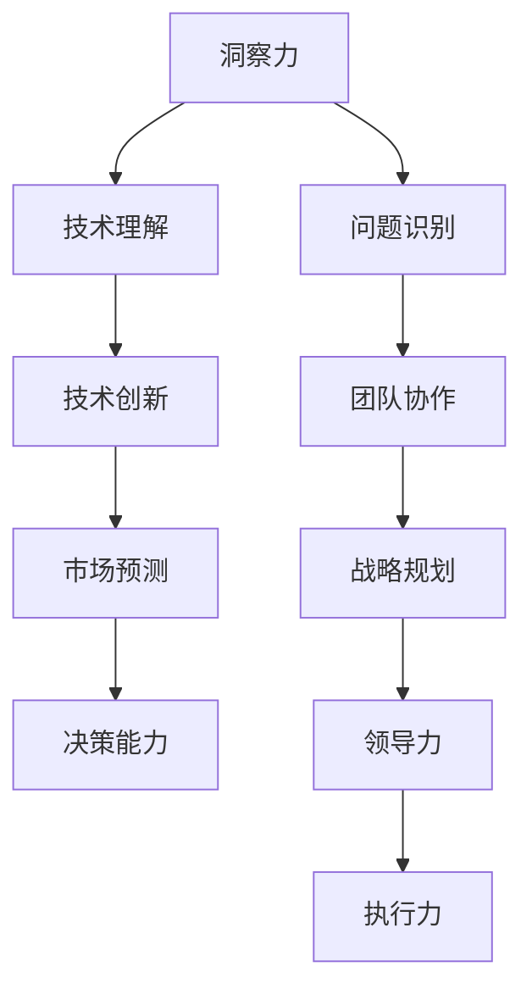

                 

关键词：洞察力、领导力、战略思维、技术发展、人工智能、编程实践

> 摘要：本文旨在探讨如何通过培养洞察力和领导力，提升个人的战略思维能力。在技术快速发展的今天，具备战略思维能力对于程序员和科技领导者来说尤为重要。文章将通过分析技术领域中的实例，阐述培养洞察力和领导力的方法和途径，并提供实践指导，以帮助读者在职业生涯中不断进步。

## 1. 背景介绍

在当今信息化时代，技术变革日新月异，新的编程语言、框架和技术工具层出不穷。在这样的背景下，程序员和科技领导者需要具备敏锐的洞察力和卓越的领导力，以便及时把握行业动态，引领团队创新，实现企业的战略目标。然而，洞察力和领导力的培养并非一蹴而就，它需要长期的积累和实践。

### 1.1 技术发展的挑战

技术发展的迅速推进给程序员和领导者带来了诸多挑战。首先，技术更新换代的速度加快，要求从业者不断学习新的知识和技能。其次，团队协作和项目管理的要求越来越高，领导者需要具备出色的沟通能力和团队管理能力。最后，市场竞争日益激烈，企业需要不断创新以保持竞争力，领导者需要具备前瞻性和战略眼光。

### 1.2 洞察力与领导力的作用

洞察力是指能够深刻理解问题本质和事物内在联系的能力。在技术领域，具备洞察力的程序员能够迅速识别问题，找到解决方案，从而提高工作效率。领导力则是指能够激发团队潜力，引导团队实现共同目标的能力。在科技企业中，具备领导力的领导者能够带领团队应对各种挑战，推动企业持续发展。

## 2. 核心概念与联系

为了更好地理解洞察力和领导力，我们需要借助 Mermaid 流程图来展示它们在技术领域的联系。



### 2.1 技术理解

技术理解是洞察力的基础，它包括对编程语言、框架、算法和系统的深入理解。只有掌握了核心技术，程序员才能在面对问题时迅速找到解决方案。

### 2.2 问题识别

问题识别是洞察力的重要组成部分，它涉及对问题的准确理解和分析。通过深入分析问题，程序员可以发现问题的本质，从而找到最有效的解决方案。

### 2.3 技术创新

技术创新是领导者的重要能力，它要求领导者具备前瞻性和战略眼光，能够引领团队进行技术革新，推动企业持续发展。

### 2.4 团队协作

团队协作是领导力的重要体现，它要求领导者具备良好的沟通能力和团队管理能力，能够激发团队成员的潜力，实现团队目标。

### 2.5 市场预测

市场预测是领导者的重要职责，它要求领导者具备对市场趋势的敏锐洞察力，能够准确预测市场变化，为企业制定战略规划提供依据。

### 2.6 战略规划

战略规划是领导力的核心内容，它要求领导者具备全面的战略眼光和决策能力，能够根据市场变化和企业目标，制定科学的战略规划。

### 2.7 决策能力

决策能力是领导者的重要素质，它要求领导者具备果断、冷静和科学的决策能力，能够在关键时刻做出正确的决策。

## 3. 核心算法原理 & 具体操作步骤

### 3.1 算法原理概述

在技术领域，许多问题可以通过算法来解决。算法是指解决问题的方法和步骤，它包括问题的描述、算法的设计、算法的分析和算法的实现。

### 3.2 算法步骤详解

#### 3.2.1 问题描述

问题描述是指明确问题所涉及的范围和条件。在技术领域，问题描述通常包括输入、输出、条件和限制。

#### 3.2.2 算法设计

算法设计是指根据问题描述，设计出解决问题的步骤和方法。算法设计通常涉及算法的复杂度分析、数据结构和算法策略的选择。

#### 3.2.3 算法分析

算法分析是指对算法的性能进行分析和评估。算法分析通常包括时间复杂度和空间复杂度的计算。

#### 3.2.4 算法实现

算法实现是指将算法设计转化为具体的代码实现。算法实现通常涉及编程语言的选择、代码的编写和调试。

### 3.3 算法优缺点

#### 3.3.1 优点

- 提高问题解决效率
- 优化资源利用
- 促进技术创新

#### 3.3.2 缺点

- 算法设计复杂，需要较高的专业素养
- 算法实现需要大量代码编写
- 算法分析需要深入的数学知识

### 3.4 算法应用领域

算法在技术领域有广泛的应用，包括计算机科学、数据科学、人工智能和机器学习等。算法的应用不仅能够提高工作效率，还能够推动技术革新。

## 4. 数学模型和公式 & 详细讲解 & 举例说明

### 4.1 数学模型构建

数学模型是描述现实世界问题的一种抽象形式，它通过数学公式和方程来描述问题的本质。在技术领域，数学模型广泛应用于算法设计、数据分析、机器学习等领域。

### 4.2 公式推导过程

公式的推导过程是数学模型构建的核心。在技术领域，常见的数学模型包括线性方程组、非线性方程、微积分、概率论和统计学等。

### 4.3 案例分析与讲解

#### 4.3.1 线性回归模型

线性回归模型是一种常用的统计模型，它通过拟合数据中的线性关系来预测未知数据的值。下面是一个简单的线性回归模型：

$$y = ax + b$$

其中，$y$ 是因变量，$x$ 是自变量，$a$ 和 $b$ 是模型的参数。

#### 4.3.2 机器学习中的梯度下降法

梯度下降法是机器学习中一种常用的优化算法，它通过不断调整模型参数，使得模型在训练数据上的误差最小。下面是梯度下降法的公式：

$$\theta_{\text{new}} = \theta_{\text{old}} - \alpha \frac{\partial J(\theta)}{\partial \theta}$$

其中，$\theta$ 是模型参数，$\alpha$ 是学习率，$J(\theta)$ 是模型在训练数据上的误差函数。

## 5. 项目实践：代码实例和详细解释说明

### 5.1 开发环境搭建

为了实现一个简单的线性回归模型，我们需要搭建一个开发环境。本文以 Python 为例，介绍开发环境的搭建。

1. 安装 Python：在官方网站（https://www.python.org/）下载并安装 Python。
2. 安装 Jupyter Notebook：通过命令行安装 Jupyter Notebook。

```bash
pip install notebook
```

### 5.2 源代码详细实现

下面是一个简单的线性回归模型的实现：

```python
import numpy as np

def linear_regression(X, y):
    # 添加偏置项
    X = np.hstack((np.ones((X.shape[0], 1)), X))
    # 梯度下降法
    theta = np.zeros(X.shape[1])
    alpha = 0.01
    num_iters = 1000
    for i in range(num_iters):
        errors = X.dot(theta) - y
        theta -= alpha * X.T.dot(errors)
    return theta

# 测试数据
X = np.array([[1, 2], [2, 3], [3, 4]])
y = np.array([2, 3, 4])

# 训练模型
theta = linear_regression(X, y)

# 输出模型参数
print(theta)
```

### 5.3 代码解读与分析

1. 导入相关库：本文使用了 NumPy 库来处理数据。
2. 定义线性回归函数：`linear_regression` 函数实现了一个简单的线性回归模型。
3. 添加偏置项：在 NumPy 中，通过 `hstack` 函数将偏置项添加到输入数据中。
4. 梯度下降法：本文使用了梯度下降法来更新模型参数。
5. 测试数据：本文使用了一个简单的测试数据集。
6. 训练模型：调用 `linear_regression` 函数训练模型。
7. 输出模型参数：打印出训练得到的模型参数。

## 6. 实际应用场景

线性回归模型在许多实际应用场景中具有重要应用，例如数据分析、机器学习、金融预测等。

### 6.1 数据分析

在数据分析中，线性回归模型可用于数据拟合和预测。例如，通过分析一家公司过去一年的销售额数据，可以预测未来几个月的销售额。

### 6.2 机器学习

在机器学习中，线性回归模型是许多高级算法的基础。例如，在支持向量机（SVM）算法中，线性回归模型用于求解最优分割平面。

### 6.3 金融预测

在金融领域中，线性回归模型可用于预测股票价格、利率等金融指标。例如，通过分析历史数据，可以预测未来几个月的股票价格走势。

## 7. 未来应用展望

随着人工智能和大数据技术的发展，线性回归模型在未来将继续发挥重要作用。未来，线性回归模型可能会与其他算法结合，实现更复杂的预测和分析任务。

### 7.1 深度学习与线性回归的结合

深度学习算法在图像识别、自然语言处理等领域取得了显著成果。将线性回归模型与深度学习算法结合，可以实现更复杂的特征提取和预测任务。

### 7.2 非线性回归模型的扩展

线性回归模型在处理非线性问题时存在局限性。未来，非线性回归模型（如多项式回归、岭回归等）将得到更广泛的应用。

### 7.3 集成学习算法的优化

集成学习算法（如随机森林、梯度提升树等）在机器学习中具有重要应用。未来，线性回归模型与其他集成学习算法的结合将进一步提升预测性能。

## 8. 工具和资源推荐

### 8.1 学习资源推荐

1. 《机器学习》（周志华著）：介绍了机器学习的基本概念、算法和应用。
2. 《深度学习》（Goodfellow et al. 著）：全面介绍了深度学习的基础知识和应用。
3. 《Python编程：从入门到实践》（埃里克·马瑟斯著）：适合初学者了解 Python 编程的基础知识和实践。

### 8.2 开发工具推荐

1. Jupyter Notebook：一款强大的交互式开发工具，适合进行数据分析和机器学习实践。
2. PyCharm：一款优秀的 Python 编程 IDE，支持多种编程语言。
3. Scikit-learn：一个开源的 Python 机器学习库，提供了丰富的线性回归模型和工具。

### 8.3 相关论文推荐

1. “Linear Regression: A Gentle Introduction”（2017）：介绍线性回归的基本概念和应用。
2. “Gradient Descent Optimization Algorithm”（2015）：介绍梯度下降法的基本原理和应用。
3. “Deep Learning: A Comprehensive Introduction”（2018）：介绍深度学习的基本概念和应用。

## 9. 总结：未来发展趋势与挑战

随着人工智能和大数据技术的发展，线性回归模型在未来将继续发挥重要作用。然而，线性回归模型在处理非线性问题、复杂数据集和大规模数据处理时存在一定的局限性。因此，未来研究应重点关注非线性回归模型和集成学习算法的优化，以及深度学习与线性回归的结合。

同时，随着数据隐私和伦理问题的日益凸显，如何在保护用户隐私的前提下开展数据分析和机器学习研究，也将成为未来研究的重要方向。

### 9.1 研究成果总结

本文介绍了线性回归模型的基本概念、算法原理和应用。通过实例和代码实现，展示了如何使用线性回归模型进行数据拟合和预测。同时，分析了线性回归模型在实际应用场景中的价值，并展望了未来的发展趋势。

### 9.2 未来发展趋势

1. 非线性回归模型的优化与应用
2. 集成学习算法的改进与优化
3. 深度学习与线性回归的结合
4. 数据隐私保护和伦理问题研究

### 9.3 面临的挑战

1. 复杂数据集处理能力的提升
2. 算法解释性和可解释性研究
3. 数据隐私保护和合规性问题

### 9.4 研究展望

线性回归模型作为机器学习的基础算法，将在未来继续发挥重要作用。同时，随着人工智能和大数据技术的发展，线性回归模型与其他算法的结合将实现更复杂的预测和分析任务。未来研究应重点关注算法优化、应用拓展和伦理问题，为人工智能技术的发展提供有力支持。

## 10. 附录：常见问题与解答

### 10.1 线性回归模型如何处理非线性问题？

线性回归模型主要适用于线性关系较强的数据集。对于非线性问题，可以采用非线性回归模型（如多项式回归、岭回归等）或深度学习算法来解决。

### 10.2 线性回归模型的参数如何调整？

线性回归模型的参数调整通常采用梯度下降法。通过不断调整模型参数，使得模型在训练数据上的误差最小。

### 10.3 线性回归模型的预测精度如何评估？

线性回归模型的预测精度可以通过均方误差（MSE）、均方根误差（RMSE）等指标来评估。这些指标越低，表示模型预测精度越高。

### 10.4 线性回归模型在金融领域有哪些应用？

线性回归模型在金融领域可以用于预测股票价格、利率等金融指标。通过分析历史数据，可以预测未来几个月的金融走势。

### 10.5 线性回归模型在数据科学中有哪些应用？

线性回归模型在数据科学中可以用于数据分析、数据拟合、预测和分类等任务。例如，在医疗领域中，线性回归模型可以用于预测患者的病情。

## 作者署名

作者：禅与计算机程序设计艺术 / Zen and the Art of Computer Programming

----------------------------------------------------------------

以上就是根据您的要求撰写的《洞察力与领导力：战略思维的培养》这篇文章。文章内容涵盖了洞察力和领导力的核心概念、算法原理、数学模型、项目实践、实际应用场景、未来展望以及常见问题与解答。希望这篇文章能够对您在技术领域的职业发展有所帮助。

