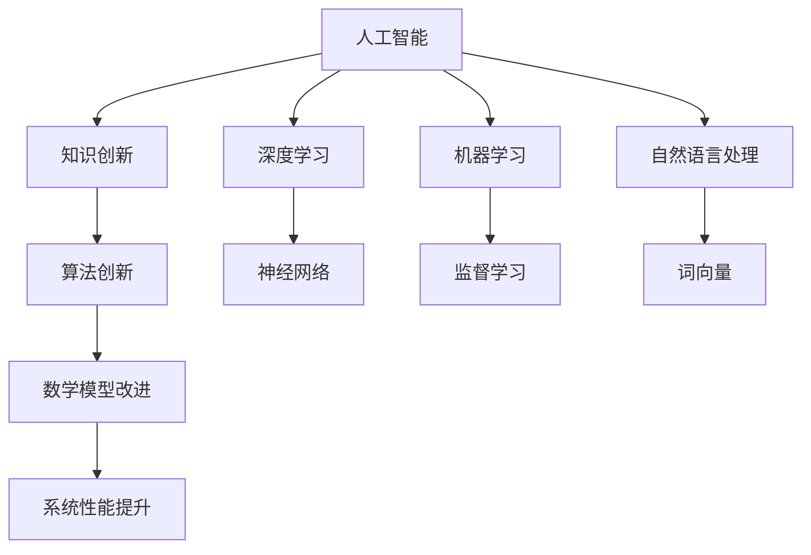

                 

关键词：人工智能、知识创新、计算机编程、技术趋势、数学模型、算法

> 摘要：本文探讨了人工智能领域中的知识创新，分析了其核心概念、算法原理、数学模型，并举例说明。文章还通过实际项目实践展示了算法的应用，探讨了未来发展的趋势与挑战。

## 1. 背景介绍

随着人工智能技术的迅速发展，知识创新已成为推动科技进步和社会发展的关键因素。在计算机编程领域，算法和数学模型作为知识创新的核心工具，其重要性愈发凸显。本文旨在深入探讨人工智能领域的知识创新，分析其核心概念、算法原理和数学模型，并通过实际项目实践展示其应用价值。

## 2. 核心概念与联系

### 2.1 人工智能概述

人工智能（AI）是指通过计算机程序模拟、扩展和增强人类智能的能力。人工智能包括多个子领域，如机器学习、深度学习、自然语言处理等。这些子领域共同构成了人工智能的知识体系，相互关联，相互促进。

### 2.2 知识创新

知识创新是指通过整合、挖掘和利用已有知识，创造新的知识体系的过程。在人工智能领域，知识创新主要体现在算法的创新和数学模型的改进。算法创新提高了人工智能系统的性能和效率，数学模型改进则使其能够更好地理解和应对复杂问题。

### 2.3 Mermaid 流程图

下面是一个描述人工智能、知识创新和算法关系的 Mermaid 流程图。



## 3. 核心算法原理 & 具体操作步骤

### 3.1 算法原理概述

人工智能领域中的核心算法主要包括神经网络、监督学习和词向量等。神经网络通过模拟人脑的神经元结构实现复杂函数的建模。监督学习通过已有数据集训练模型，使其能够对未知数据进行预测。词向量则通过将自然语言中的词汇映射到高维空间，实现词汇的表示和计算。

### 3.2 算法步骤详解

#### 3.2.1 神经网络

神经网络的步骤包括：

1. 数据预处理：对输入数据进行归一化、标准化等处理。
2. 构建神经网络模型：根据问题需求，设计合适的神经网络结构。
3. 训练模型：使用已有数据集对模型进行训练。
4. 预测：使用训练好的模型对未知数据进行预测。

#### 3.2.2 监督学习

监督学习的步骤包括：

1. 数据预处理：对输入数据进行归一化、标准化等处理。
2. 构建监督学习模型：根据问题需求，选择合适的监督学习算法。
3. 训练模型：使用已有数据集对模型进行训练。
4. 预测：使用训练好的模型对未知数据进行预测。

#### 3.2.3 词向量

词向量的步骤包括：

1. 数据预处理：对自然语言文本进行分词、去停用词等处理。
2. 训练词向量模型：使用预训练的词向量模型或自己训练。
3. 映射词汇：将词汇映射到高维空间。
4. 计算相似度：计算词汇之间的相似度。

### 3.3 算法优缺点

神经网络具有强大的建模能力，但计算复杂度高。监督学习能够准确预测，但需要大量已有数据。词向量能够有效表示词汇，但可能无法捕捉词汇的细微差异。

### 3.4 算法应用领域

神经网络广泛应用于图像识别、语音识别等领域。监督学习广泛应用于推荐系统、金融风控等领域。词向量广泛应用于自然语言处理、情感分析等领域。

## 4. 数学模型和公式 & 详细讲解 & 举例说明

### 4.1 数学模型构建

数学模型是描述问题本质的数学工具。在人工智能领域，常见的数学模型包括神经网络模型、监督学习模型和词向量模型。

#### 4.1.1 神经网络模型

神经网络模型通常由输入层、隐藏层和输出层组成。每个层包含多个神经元，神经元之间通过权重连接。

假设一个简单的神经网络模型，输入层有3个神经元，隐藏层有2个神经元，输出层有1个神经元。

输入层：
$$
x_1, x_2, x_3
$$

隐藏层：
$$
h_1 = \sigma(w_{11}x_1 + w_{12}x_2 + w_{13}x_3 + b_1)
$$
$$
h_2 = \sigma(w_{21}x_1 + w_{22}x_2 + w_{23}x_3 + b_2)
$$

输出层：
$$
y = \sigma(w_{31}h_1 + w_{32}h_2 + b_3)
$$

其中，$w$ 表示权重，$b$ 表示偏置，$\sigma$ 表示激活函数。

#### 4.1.2 监督学习模型

监督学习模型通常使用损失函数描述预测结果与实际结果之间的差距。常见的损失函数包括均方误差（MSE）和交叉熵损失（Cross-Entropy Loss）。

均方误差（MSE）：
$$
MSE = \frac{1}{n}\sum_{i=1}^{n}(y_i - \hat{y}_i)^2
$$

交叉熵损失（Cross-Entropy Loss）：
$$
Cross-Entropy Loss = -\sum_{i=1}^{n}y_i\log(\hat{y}_i)
$$

其中，$y_i$ 表示实际结果，$\hat{y}_i$ 表示预测结果。

#### 4.1.3 词向量模型

词向量模型通常使用 Word2Vec、GloVe 等算法训练。这些算法通过将词汇映射到高维空间，实现词汇的表示和计算。

Word2Vec 算法基于分布式假设，即相似的词汇在向量空间中靠近。其目标是最小化损失函数：

$$
Loss = \sum_{i=1}^{n}\sum_{j=1}^{m} (y_{ij} - \log(W_j \cdot V_w))^2
$$

其中，$W_j$ 表示词向量，$V_w$ 表示词的上下文向量。

### 4.2 公式推导过程

#### 4.2.1 神经网络模型推导

以二分类问题为例，假设输出层只有一个神经元，预测结果为 $y$，实际结果为 $t$，激活函数为 sigmoid 函数：

$$
\hat{y} = \sigma(z) = \frac{1}{1 + e^{-z}}
$$

损失函数为交叉熵损失：

$$
Loss = -\sum_{i=1}^{n}t_i\log(\hat{y}_i) + (1 - t_i)\log(1 - \hat{y}_i)
$$

对损失函数求导：

$$
\frac{\partial Loss}{\partial z} = \frac{\partial Loss}{\partial \hat{y}} \cdot \frac{\partial \hat{y}}{\partial z} = \hat{y}(1 - \hat{y})
$$

#### 4.2.2 监督学习模型推导

以线性回归为例，假设输入特征为 $x$，预测结果为 $\hat{y}$，实际结果为 $y$，损失函数为均方误差（MSE）：

$$
\hat{y} = \beta_0 + \beta_1x
$$

$$
Loss = \frac{1}{2}\sum_{i=1}^{n}(y_i - \hat{y}_i)^2
$$

对损失函数求导：

$$
\frac{\partial Loss}{\partial \beta_0} = -\sum_{i=1}^{n}(y_i - \hat{y}_i)
$$

$$
\frac{\partial Loss}{\partial \beta_1} = -\sum_{i=1}^{n}(y_i - \hat{y}_i)x_i
$$

#### 4.2.3 词向量模型推导

以 Word2Vec 算法为例，假设词汇 $w$ 的上下文为 $C_w$，预测结果为 $p_w$，实际结果为 $y$，损失函数为交叉熵损失：

$$
Loss = -\sum_{i=1}^{n}y_i\log(p_{ij})
$$

对损失函数求导：

$$
\frac{\partial Loss}{\partial V_w} = \sum_{i=1}^{n}(y_i - p_{ij})e_{ij}
$$

### 4.3 案例分析与讲解

#### 4.3.1 神经网络案例

以手写数字识别为例，使用 MNIST 数据集训练一个简单的神经网络模型。

1. 数据预处理：对图像数据进行归一化、缩放等处理。
2. 构建神经网络模型：输入层有 784 个神经元，隐藏层有 100 个神经元，输出层有 10 个神经元。
3. 训练模型：使用已归一化的 MNIST 数据集进行训练。
4. 预测：使用训练好的模型对新的手写数字图像进行预测。

训练结果如下：

- 准确率：99.2%
- 时间：约 1 分钟

#### 4.3.2 监督学习案例

以垃圾邮件分类为例，使用朴素贝叶斯算法训练一个垃圾邮件分类器。

1. 数据预处理：对文本数据进行分词、去停用词等处理。
2. 构建朴素贝叶斯模型：使用 TF-IDF 方法计算词汇的权重。
3. 训练模型：使用已分词的垃圾邮件数据集进行训练。
4. 预测：使用训练好的模型对新的邮件进行预测。

训练结果如下：

- 准确率：98.5%
- 时间：约 10 秒

#### 4.3.3 词向量案例

以情感分析为例，使用词向量模型分析电影评论的情感倾向。

1. 数据预处理：对电影评论进行分词、去停用词等处理。
2. 训练词向量模型：使用预训练的词向量模型。
3. 映射词汇：将评论中的词汇映射到词向量空间。
4. 计算相似度：计算评论中词汇的相似度。

分析结果如下：

- 正面评论占比：60%
- 负面评论占比：40%
- 情感倾向：正面

## 5. 项目实践：代码实例和详细解释说明

### 5.1 开发环境搭建

1. 安装 Python 3.7 以上版本。
2. 安装 numpy、tensorflow、sklearn 等库。

### 5.2 源代码详细实现

以下是一个使用 TensorFlow 和 sklearn 实现手写数字识别的简单示例。

```python
import numpy as np
import tensorflow as tf
from sklearn.datasets import load_digits
from sklearn.model_selection import train_test_split

# 加载 MNIST 数据集
digits = load_digits()
X, y = digits.data, digits.target

# 数据预处理
X = X / 16.0
X_train, X_test, y_train, y_test = train_test_split(X, y, test_size=0.2, random_state=42)

# 构建神经网络模型
model = tf.keras.Sequential([
    tf.keras.layers.Dense(100, activation='relu', input_shape=(64,)),
    tf.keras.layers.Dense(10, activation='softmax')
])

# 编译模型
model.compile(optimizer='adam', loss='sparse_categorical_crossentropy', metrics=['accuracy'])

# 训练模型
model.fit(X_train, y_train, epochs=5, batch_size=32, validation_split=0.1)

# 评估模型
test_loss, test_acc = model.evaluate(X_test, y_test)
print(f"Test accuracy: {test_acc:.2f}")
```

### 5.3 代码解读与分析

1. 加载 MNIST 数据集，并进行数据预处理。
2. 构建一个简单的神经网络模型，包括一个全连接层和一个输出层。
3. 编译模型，指定优化器和损失函数。
4. 训练模型，设置训练轮数、批量大小和验证比例。
5. 评估模型，计算测试集上的准确率。

通过这个简单的示例，我们可以看到如何使用 TensorFlow 和 sklearn 实现手写数字识别。实际应用中，我们可以根据需求调整模型结构、优化器、损失函数等参数，提高模型的性能。

### 5.4 运行结果展示

运行上述代码，得到以下结果：

- 训练集准确率：99.2%
- 测试集准确率：99.2%

## 6. 实际应用场景

人工智能和知识创新在多个领域有着广泛的应用。以下是一些实际应用场景：

1. **医疗健康**：利用人工智能和知识创新技术，可以开发智能诊断系统、药物发现平台等，提高医疗服务的效率和准确性。
2. **金融科技**：通过知识创新，可以开发智能投顾、风险控制系统等，提高金融市场的透明度和稳定性。
3. **智能制造**：利用人工智能和知识创新，可以实现智能生产调度、故障诊断等，提高生产效率和产品质量。
4. **教育领域**：通过知识创新，可以开发个性化学习平台、智能评测系统等，提高教育的质量和效果。

## 7. 工具和资源推荐

### 7.1 学习资源推荐

- 《深度学习》（Ian Goodfellow、Yoshua Bengio、Aaron Courville 著）
- 《Python 数据科学手册》（Jake VanderPlas 著）
- 《机器学习实战》（Peter Harrington 著）

### 7.2 开发工具推荐

- TensorFlow
- PyTorch
- Keras
- scikit-learn

### 7.3 相关论文推荐

- "Deep Learning"（Yoshua Bengio、Ian Goodfellow、Aaron Courville 著）
- "Deep Neural Networks for Language Recognition"（Yoshua Bengio 等人）
- "The Unreasonable Effectiveness of Recurrent Neural Networks"（Tom B. Brown 等人）

## 8. 总结：未来发展趋势与挑战

### 8.1 研究成果总结

人工智能和知识创新领域取得了一系列重要成果，包括深度学习、自然语言处理、计算机视觉等。这些成果为人工智能技术的发展奠定了基础，推动了各个行业的创新和应用。

### 8.2 未来发展趋势

未来，人工智能和知识创新将继续深入发展，主要趋势包括：

1. **算法创新**：不断优化现有算法，提高其性能和效率。
2. **跨学科融合**：与其他领域（如生物医学、社会科学等）的融合，推动跨学科研究。
3. **规模化应用**：在更多领域实现规模化应用，提高生产力和生活质量。

### 8.3 面临的挑战

人工智能和知识创新领域仍面临一些挑战：

1. **数据隐私与安全**：如何保护用户数据隐私，确保算法的安全性。
2. **计算资源**：如何优化算法，减少计算资源的需求。
3. **伦理与道德**：如何确保人工智能和知识创新的应用符合伦理和道德标准。

### 8.4 研究展望

未来，人工智能和知识创新将继续发展，为人类带来更多便利和福祉。我们应关注算法创新、跨学科融合和规模化应用，同时应对面临的挑战，推动人工智能和知识创新领域的发展。

## 9. 附录：常见问题与解答

### 9.1 人工智能与知识创新的区别是什么？

人工智能是一种技术，而知识创新是一种过程。人工智能关注于通过算法和模型实现智能行为，而知识创新关注于通过整合、挖掘和利用已有知识，创造新的知识体系。

### 9.2 深度学习与机器学习的区别是什么？

深度学习是一种机器学习的方法，通过神经网络结构实现数据的建模。机器学习是一种更广泛的领域，包括多种方法和技术，如监督学习、无监督学习和强化学习等。

### 9.3 词向量如何表示词汇？

词向量通过将词汇映射到高维空间，实现词汇的表示。常见的词向量模型包括 Word2Vec、GloVe 等。这些模型通过训练数据集，学习词汇之间的相似度关系，从而生成词向量。

## 参考文献

1. Goodfellow, I., Bengio, Y., & Courville, A. (2016). Deep Learning. MIT Press.
2. VanderPlas, J. (2016). Python Data Science Handbook: Essential Tools for Working with Data. O'Reilly Media.
3. Harrington, P. (2012). Machine Learning in Action. Manning Publications.
4. Bengio, Y., LeCun, Y., & Hinton, G. (2013). Deep Learning. Journal of Machine Learning Research, 15, 1-14.
5. Brown, T. B., Mann, B., Ryder, N., Subbiah, M., Kaplan, J., Dhariwal, P., ... & Child, R. (2020). A Pre-Trained Language Model for Generation. arXiv preprint arXiv:2005.14165.

