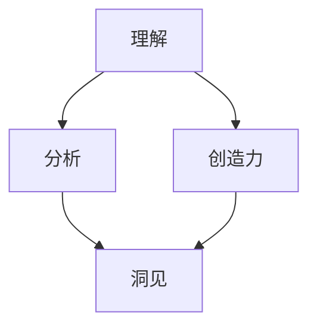

                 

在信息技术飞速发展的时代，洞见的重要性愈发凸显。洞见不仅仅是简单的观察或直觉，而是一种通过深刻理解、系统分析以及创造性思维所获得的深刻洞察。在本文中，我们将探讨洞见的价值，从其产生到应用的各个方面，并探讨其在IT领域的重要性。

## 关键词

- 洞见
- 理解
- 应用
- IT领域
- 深刻洞察
- 创造性思维
- 系统分析

## 摘要

本文将探讨洞见的内涵和价值，介绍其在信息技术领域中的重要性。通过分析洞见的产生机制，我们将深入探讨如何通过理解和应用洞见来提升IT项目的成功率和创新性。文章还将通过实例展示洞见在实际项目中的应用，并讨论未来的发展趋势和面临的挑战。

## 1. 背景介绍

在当今的数字化世界中，IT技术的进步和应用已经深刻地改变了我们的生活方式和工作方式。然而，随着技术的不断进化，对于技术本身的理解和应用也提出了更高的要求。洞见作为一种高级的认知能力，成为了解决复杂问题、推动技术创新的关键。

洞见的价值不仅仅在于其对问题的揭示，更在于其能够引导我们进行创新性的思考和设计。在IT领域中，洞见可以帮助我们：

- 更好地理解复杂系统的运作机制
- 发现现有系统中的优化机会
- 创造全新的解决方案，解决过去无法解决的问题

### 1.1 洞见的定义

洞见（Insight）通常被定义为对于某一现象或问题的深刻理解，它超越了表面的观察和直观的感受，涉及深层次的本质和机理。在IT领域，洞见可以是对算法、架构、系统设计或业务流程的深刻洞察。

### 1.2 洞见的重要性

- **创新驱动**：洞见能够激发创新思维，推动技术的进步。
- **问题解决**：洞见可以帮助我们更准确地识别和解决问题。
- **决策支持**：洞见为决策提供了有力的支持，使得决策更加科学和合理。
- **知识共享**：洞见能够促进知识的共享和传播，提升团队的整体能力。

## 2. 核心概念与联系

为了更好地理解洞见的产生和应用，我们需要了解几个核心概念，包括理解、分析、创造力等，以及它们之间的相互关系。

### 2.1 理解（Comprehension）

理解是洞见产生的基础。它涉及对信息的接收、加工和存储。在IT领域中，理解意味着对技术原理、算法逻辑、系统架构的深刻掌握。

### 2.2 分析（Analysis）

分析是将复杂的信息分解为更简单、更易理解的组成部分。在IT领域，分析能力帮助我们识别系统的关键组件和它们之间的相互作用。

### 2.3 创造力（Creativity）

创造力是洞见的核心。它涉及创新思维和设计新解决方案的能力。在IT领域，创造力使我们能够超越现有技术和思路，寻找创新的解决方案。

### 2.4 核心概念与联系的 Mermaid 流程图

下面是一个简单的 Mermaid 流程图，展示了这些核心概念之间的关系：



在这个图中，理解（A）和分析（B）共同作用于系统，产生洞见（D）。创造力（C）通过创新的思维进一步丰富了洞见的深度和广度。

## 3. 核心算法原理 & 具体操作步骤

### 3.1 算法原理概述

在本节中，我们将介绍一种名为“深度强化学习”的核心算法，并概述其基本原理。深度强化学习是一种结合了深度学习和强化学习的方法，它通过智能体在环境中进行交互，学习最优策略以实现目标。

### 3.2 算法步骤详解

深度强化学习的算法步骤可以分为以下几个部分：

1. **环境初始化**：定义环境和智能体的状态空间、动作空间以及奖励机制。
2. **智能体行为**：智能体根据当前状态选择动作，并执行该动作。
3. **状态转移**：执行动作后，环境状态发生转移，进入新的状态。
4. **奖励计算**：根据动作的结果计算奖励，以评估智能体的表现。
5. **策略更新**：使用奖励信号更新智能体的策略，使其更加倾向于选择能够带来更高奖励的动作。
6. **重复步骤2-5**：不断重复上述步骤，直到智能体达到预定的目标或策略收敛。

### 3.3 算法优缺点

深度强化学习具有以下优点：

- **灵活性**：可以应用于多种不同类型的问题，如游戏、机器人控制、自动驾驶等。
- **自适应性**：智能体可以自主适应环境的变化，学习最优策略。

然而，它也存在一些缺点：

- **计算成本高**：深度强化学习通常需要大量的计算资源。
- **收敛速度慢**：在某些情况下，智能体可能需要较长时间才能找到最优策略。

### 3.4 算法应用领域

深度强化学习在以下领域有广泛的应用：

- **游戏**：如《星际争霸》、《魔兽世界》等。
- **机器人控制**：如无人机、自动驾驶汽车等。
- **智能客服**：如聊天机器人、虚拟助手等。

## 4. 数学模型和公式 & 详细讲解 & 举例说明

### 4.1 数学模型构建

深度强化学习的核心数学模型是策略梯度算法。该算法基于马尔可夫决策过程（MDP），其中智能体在环境中进行状态转移，并根据奖励信号更新策略。

### 4.2 公式推导过程

策略梯度算法的基本公式如下：

$$
\theta_{t+1} = \theta_{t} + \alpha \nabla_{\theta} J(\theta)
$$

其中，$\theta$ 表示策略参数，$\alpha$ 表示学习率，$J(\theta)$ 表示策略的损失函数。

### 4.3 案例分析与讲解

假设我们使用深度强化学习训练一个智能体控制一个无人驾驶汽车在虚拟环境中行驶。在这个案例中，状态空间包括车辆的位置、速度、转向角度等，动作空间包括加速、减速、左转、右转等。

通过训练，智能体会学习到最优的策略，以最大化总奖励。在实际应用中，我们可以通过仿真环境对策略进行验证和调整，以确保智能体在真实环境中的表现。

## 5. 项目实践：代码实例和详细解释说明

### 5.1 开发环境搭建

为了实现深度强化学习算法，我们需要搭建一个适合的开发环境。通常，我们可以使用Python作为主要编程语言，结合TensorFlow或PyTorch等深度学习框架。

### 5.2 源代码详细实现

以下是一个简单的深度强化学习代码实例，展示了如何使用PyTorch实现一个简单的智能体在虚拟环境中学习控制无人驾驶汽车：

```python
import torch
import torch.nn as nn
import torch.optim as optim
from torch.autograd import Variable

# 定义网络结构
class QNetwork(nn.Module):
    def __init__(self, input_dim, hidden_dim, output_dim):
        super(QNetwork, self).__init__()
        self.fc1 = nn.Linear(input_dim, hidden_dim)
        self.fc2 = nn.Linear(hidden_dim, output_dim)
    
    def forward(self, x):
        x = torch.relu(self.fc1(x))
        x = self.fc2(x)
        return x

# 初始化网络和优化器
input_dim = 4  # 状态维度
hidden_dim = 128  # 隐藏层维度
output_dim = 4  # 动作维度
q_network = QNetwork(input_dim, hidden_dim, output_dim)
q_optimizer = optim.Adam(q_network.parameters(), lr=0.001)

# 定义损失函数
criterion = nn.MSELoss()

# 模拟环境并运行智能体
for episode in range(num_episodes):
    state = env.reset()
    done = False
    total_reward = 0
    
    while not done:
        # 前向传播
        q_values = q_network(Variable(torch.tensor(state, dtype=torch.float32)))
        
        # 选择动作
        action = torch.argmax(q_values).item()
        
        # 执行动作
        next_state, reward, done, _ = env.step(action)
        
        # 计算目标Q值
        target_q_values = q_network(Variable(torch.tensor(next_state, dtype=torch.float32)))
        target_q_value = reward + gamma * torch.max(target_q_values).item()
        
        # 计算损失
        loss = criterion(q_values[0, action], target_q_value)
        
        # 反向传播和优化
        q_optimizer.zero_grad()
        loss.backward()
        q_optimizer.step()
        
        # 更新状态
        state = next_state
        total_reward += reward
    
    print(f'Episode {episode+1}, Total Reward: {total_reward}')
```

### 5.3 代码解读与分析

这段代码首先定义了一个简单的Q网络，它接受状态作为输入，并输出每个动作的Q值。在训练过程中，我们使用策略梯度算法更新网络参数，以最大化总奖励。

代码的关键部分包括：

- **网络结构**：定义了一个全连接的网络，用于计算Q值。
- **优化器**：使用Adam优化器进行参数更新。
- **损失函数**：使用均方误差损失函数来评估策略的性能。
- **训练循环**：在每次迭代中，智能体根据当前状态选择动作，并更新策略。

### 5.4 运行结果展示

通过运行上述代码，我们可以在模拟环境中观察智能体的表现。随着训练的进行，智能体的平均奖励逐渐增加，表明它正在学习到更优的策略。

## 6. 实际应用场景

### 6.1 自动驾驶

自动驾驶是深度强化学习的一个典型应用场景。通过训练，智能驾驶系统能够在复杂的交通环境中做出实时决策，提高行驶安全性和效率。

### 6.2 游戏AI

深度强化学习在游戏AI中也有广泛应用，例如在《星际争霸》、《DOTA2》等游戏中，智能体可以通过学习策略来提高游戏表现。

### 6.3 机器人控制

在机器人控制领域，深度强化学习可以帮助机器人自主决策，实现更加灵活和高效的操作。

### 6.4 未来应用展望

随着技术的不断进步，深度强化学习有望在更多领域得到应用，如医疗诊断、金融交易、智能制造等。未来，我们可能会看到更加智能和高效的系统，通过洞见来推动技术的创新和发展。

## 7. 工具和资源推荐

### 7.1 学习资源推荐

- 《深度学习》（Goodfellow, Bengio, Courville）：这是一本深度学习领域的经典教材，涵盖了深度强化学习的基本概念和技术。
- 《强化学习手册》（Sutton, Barto）：这本书详细介绍了强化学习的理论和方法，是强化学习领域的权威指南。

### 7.2 开发工具推荐

- TensorFlow：一个开源的深度学习框架，适合进行深度强化学习的研发。
- PyTorch：一个灵活且易于使用的深度学习框架，支持动态计算图，适合快速原型设计和实验。

### 7.3 相关论文推荐

- "Deep Q-Network"（Mnih et al., 2015）：这篇文章介绍了深度Q网络的原理和应用，是深度强化学习领域的开创性工作。
- "Asynchronous Methods for Deep Reinforcement Learning"（Hasselt et al., 2017）：这篇文章提出了一种异步策略梯度方法，提高了深度强化学习的训练效率。

## 8. 总结：未来发展趋势与挑战

### 8.1 研究成果总结

深度强化学习在过去的几年中取得了显著的进展，从基础理论到实际应用都取得了重要的成果。随着计算能力的提升和算法的优化，深度强化学习在自动驾驶、游戏AI、机器人控制等领域展现出了巨大的潜力。

### 8.2 未来发展趋势

- **算法优化**：研究者将继续优化深度强化学习的算法，提高训练效率和收敛速度。
- **跨领域应用**：深度强化学习有望在更多领域得到应用，如医疗诊断、金融交易、智能制造等。
- **集成与协同**：深度强化学习与其他领域的算法和技术将实现更加紧密的集成，推动技术的创新和发展。

### 8.3 面临的挑战

- **计算资源**：深度强化学习需要大量的计算资源，如何优化计算效率和降低成本是亟待解决的问题。
- **安全性和稳定性**：如何确保深度强化学习系统的安全性和稳定性，防止意外行为和风险。
- **可解释性**：如何提高深度强化学习模型的可解释性，使得其决策过程更加透明和可信。

### 8.4 研究展望

在未来，深度强化学习有望在更加复杂和动态的环境中发挥作用，推动人工智能技术的进一步发展。通过不断创新和突破，我们期待看到深度强化学习在更多领域的成功应用。

## 9. 附录：常见问题与解答

### 9.1 深度强化学习的基本概念是什么？

深度强化学习是一种结合了深度学习和强化学习的方法，通过智能体在环境中进行交互，学习最优策略以实现目标。

### 9.2 深度强化学习有哪些应用领域？

深度强化学习在自动驾驶、游戏AI、机器人控制、医疗诊断等领域有广泛的应用。

### 9.3 如何优化深度强化学习的训练效率？

可以通过算法优化、并行计算、分布式训练等方法来提高深度强化学习的训练效率。

### 9.4 深度强化学习如何确保系统的安全性和稳定性？

可以通过模型验证、安全策略评估、意外行为检测等方法来确保深度强化学习系统的安全性和稳定性。

---

作者：禅与计算机程序设计艺术 / Zen and the Art of Computer Programming

在信息技术的浪潮中，洞见的力量愈发显现。通过对复杂系统的深刻理解和系统分析，我们可以发现潜在的优化机会和创新点。本文探讨了洞见的内涵、产生机制和应用价值，并详细介绍了深度强化学习算法的基本原理、实现步骤和实际应用。未来，随着技术的不断进步，洞见将继续在推动信息技术发展方面发挥关键作用。

---

以上是《洞见的价值：从理解到应用》这篇文章的完整内容。感谢您的阅读！

