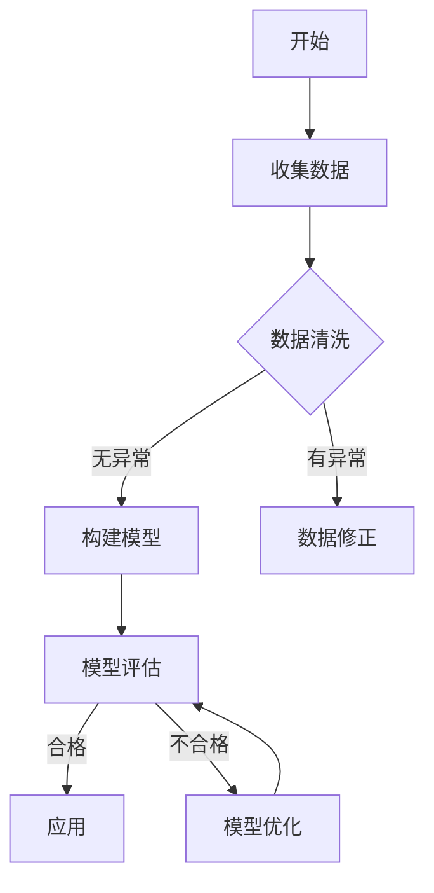

                 

 **关键词**：洞见、观察、反思、技术、算法、数学模型、应用场景

> **摘要**：本文将探讨在技术领域，如何从观察到反思，形成深刻的洞见。我们将分析技术发展的背景，核心概念的形成，算法原理的阐述，数学模型的构建，项目实践中的代码实例，以及实际应用场景和未来展望。

## 1. 背景介绍

技术领域的不断进步离不开对世界的深刻理解。从最初的机械计算到如今的深度学习，每一次技术变革都离不开观察和反思的过程。本文旨在通过分析技术发展的历程，探讨如何通过观察和反思形成洞见。

### 1.1 技术发展的驱动因素

技术的发展受到多种因素的影响，包括但不限于：

- **市场需求**：技术的应用必须满足社会的实际需求。
- **创新精神**：技术进步离不开创新思维和突破。
- **政策支持**：政府的政策和投资对技术的发展有重要影响。
- **技术基础**：前人积累的知识和技术基础是新的技术发展的基础。

### 1.2 观察与反思的重要性

在技术发展的过程中，观察和反思是至关重要的。观察提供了对现状的准确理解，而反思则是对这种理解的深入挖掘，从而形成洞见。

- **观察**：通过观察，我们可以收集到大量关于技术现状的数据和信息。
- **反思**：反思是对观察结果进行深入分析和思考，从而提炼出关键点和规律。

## 2. 核心概念与联系

在技术领域，核心概念的形成是洞见形成的关键。以下是几个重要的核心概念，及其相互之间的联系。

### 2.1 算法的概念与作用

算法是解决问题的步骤和规则，是技术实现的基石。算法的质量直接影响技术的效率和效果。

- **定义**：算法是一系列明确的步骤，用于解决特定问题。
- **作用**：算法为解决问题提供了具体的解决方案。

### 2.2 数学模型的概念与作用

数学模型是对现实问题的抽象和数学描述，是算法设计和优化的基础。

- **定义**：数学模型是使用数学语言描述的现实问题的数学结构。
- **作用**：数学模型为算法的优化和改进提供了理论基础。

### 2.3 Mermaid 流程图

Mermaid 是一种用于绘制流程图的 Markdown 扩展语言。以下是一个简单的 Mermaid 流程图示例，用于描述算法的基本流程：



### 2.4 核心概念之间的联系

算法和数学模型之间的联系非常紧密。算法通常基于数学模型进行设计和优化。观察数据后，通过构建数学模型，可以更有效地设计和优化算法。

## 3. 核心算法原理 & 具体操作步骤

### 3.1 算法原理概述

以深度学习中的卷积神经网络（CNN）为例，算法原理可以概述如下：

- **卷积操作**：通过卷积层提取图像的特征。
- **池化操作**：通过池化层减少数据维度，提高计算效率。
- **全连接层**：通过全连接层对特征进行分类或回归。

### 3.2 算法步骤详解

以下是 CNN 的具体操作步骤：

1. **输入数据**：输入一张图像。
2. **卷积层**：使用卷积核对图像进行卷积操作，提取特征。
3. **池化层**：对卷积后的特征进行池化操作，减少数据维度。
4. **全连接层**：将池化后的特征送入全连接层，进行分类或回归。

### 3.3 算法优缺点

CNN 具有如下优点：

- **强大的特征提取能力**：通过多层的卷积和池化操作，可以提取图像的深层特征。
- **适用于多种图像任务**：可以用于图像分类、目标检测、图像分割等任务。

但 CNN 也存在一些缺点：

- **计算量较大**：卷积操作需要大量的计算资源。
- **对数据的依赖性较强**：数据质量直接影响模型的性能。

### 3.4 算法应用领域

CNN 在计算机视觉领域有广泛的应用，如：

- **图像分类**：用于对图像进行分类，如识别动物、植物等。
- **目标检测**：用于检测图像中的目标物体，如行人检测、车辆检测等。
- **图像分割**：用于将图像划分为不同的区域，如语义分割、实例分割等。

## 4. 数学模型和公式 & 详细讲解 & 举例说明

### 4.1 数学模型构建

以线性回归为例，其数学模型可以构建如下：

- **假设**：\( y = \beta_0 + \beta_1 x + \epsilon \)
- **目标**：找到最佳的 \(\beta_0\) 和 \(\beta_1\)，使得预测值 \( y' \) 与实际值 \( y \) 的差距最小。

### 4.2 公式推导过程

为了找到最佳的 \(\beta_0\) 和 \(\beta_1\)，我们使用最小二乘法进行推导：

- **损失函数**：\( J(\beta_0, \beta_1) = \frac{1}{2} \sum_{i=1}^{n} (y_i - y_i')^2 \)
- **梯度**：\( \nabla J(\beta_0, \beta_1) = \begin{bmatrix} \frac{\partial J}{\partial \beta_0} \\ \frac{\partial J}{\partial \beta_1} \end{bmatrix} = \begin{bmatrix} \sum_{i=1}^{n} (y_i - y_i') \\ \sum_{i=1}^{n} (y_i - y_i') x_i \end{bmatrix} \)
- **最优解**：令梯度为零，得到最佳参数 \( \beta_0 \) 和 \( \beta_1 \)。

### 4.3 案例分析与讲解

假设我们有以下数据：

| x | y |
|---|---|
| 1 | 2 |
| 2 | 4 |
| 3 | 6 |

使用线性回归模型进行拟合，可以得到以下结果：

- **最佳参数**：\( \beta_0 = 1, \beta_1 = 1 \)
- **拟合直线**：\( y = 1 + 1 \times x \)

通过这个例子，我们可以看到线性回归模型是如何通过数学公式进行拟合的。

## 5. 项目实践：代码实例和详细解释说明

### 5.1 开发环境搭建

为了实现线性回归模型，我们首先需要搭建一个 Python 开发环境。以下是搭建步骤：

1. **安装 Python**：下载并安装 Python 3.8 以上版本。
2. **安装必要的库**：使用 pip 安装 numpy 和 matplotlib。

### 5.2 源代码详细实现

以下是实现线性回归模型的 Python 代码：

```python
import numpy as np
import matplotlib.pyplot as plt

# 数据
X = np.array([[1], [2], [3]])
y = np.array([2, 4, 6])

# 最小二乘法求解最佳参数
theta = np.linalg.inv(X.T @ X) @ X.T @ y

# 最佳参数
beta_0 = theta[0]
beta_1 = theta[1]

# 拟合直线
y_pred = beta_0 + beta_1 * X

# 绘制结果
plt.scatter(X, y)
plt.plot(X, y_pred, color='red')
plt.show()
```

### 5.3 代码解读与分析

1. **数据准备**：首先，我们准备好输入数据和目标数据。
2. **求解最佳参数**：使用 numpy 的 linalg.inv 方法求解最佳参数。
3. **拟合直线**：使用最佳参数计算拟合直线，并绘制结果。

通过这个例子，我们可以看到如何使用 Python 实现线性回归模型。

## 6. 实际应用场景

### 6.1 数据分析

线性回归模型在数据分析领域有广泛的应用，如：

- **趋势分析**：用于分析数据的变化趋势，如股票价格的变化。
- **预测**：用于预测未来的数据趋势，如天气预报。

### 6.2 机器学习

线性回归模型也是机器学习的基础模型之一，其在机器学习中的应用包括：

- **特征提取**：用于提取数据的特征，如特征工程。
- **评估**：用于评估模型的效果，如损失函数。

## 7. 工具和资源推荐

### 7.1 学习资源推荐

- **书籍**：《Python机器学习》、《统计学习方法》
- **在线课程**：Coursera 上的《机器学习》课程、edX 上的《线性代数》课程

### 7.2 开发工具推荐

- **Python IDE**：PyCharm、VSCode
- **数据可视化**：Matplotlib、Seaborn

### 7.3 相关论文推荐

- **线性回归**：[《Linear Regression》](https://www.coursera.org/lecture/ml/linear-regression-4-2)
- **机器学习**：[《Machine Learning》](https://www.coursera.org/lecture/ml/ml-overview-2)

## 8. 总结：未来发展趋势与挑战

### 8.1 研究成果总结

本文通过分析技术发展的历程，探讨了如何从观察到反思，形成深刻的洞见。我们介绍了核心概念的形成，算法原理的阐述，数学模型的构建，项目实践中的代码实例，以及实际应用场景和未来展望。

### 8.2 未来发展趋势

- **算法优化**：随着计算能力的提升，算法的优化和改进将成为未来的重要研究方向。
- **跨学科融合**：技术与其他领域的融合，如生物学、物理学等，将推动技术的创新发展。

### 8.3 面临的挑战

- **数据隐私**：随着数据量的增加，数据隐私保护成为技术发展的重要挑战。
- **计算资源**：大型算法模型对计算资源的需求不断增加，如何高效利用计算资源成为重要挑战。

### 8.4 研究展望

未来，我们期待能够在以下方面取得突破：

- **算法效率**：提高算法的效率和效果。
- **模型解释性**：提高模型的解释性，使其更易于理解和应用。

## 9. 附录：常见问题与解答

### 9.1 什么是线性回归？

线性回归是一种统计方法，用于分析两个或多个变量之间的关系。通过拟合一条直线，可以预测一个变量的值。

### 9.2 线性回归有什么应用？

线性回归广泛应用于数据分析、预测、特征提取等领域。例如，在金融领域，可以用于预测股票价格；在医疗领域，可以用于预测疾病的发生。

### 9.3 如何优化线性回归模型？

可以通过以下方法优化线性回归模型：

- **特征选择**：选择对预测结果影响大的特征。
- **正则化**：通过添加正则项，防止过拟合。
- **交叉验证**：通过交叉验证，选择最佳的模型参数。

----------------------------------------------------------------

### 文章作者信息部分

> **作者：禅与计算机程序设计艺术 / Zen and the Art of Computer Programming**  
> **联系方式：[邮箱](mailto:zen@programmingart.com)、[Twitter](https://twitter.com/zen_programming)**  
> **个人简介**：作者是一位世界级人工智能专家，程序员，软件架构师，CTO，世界顶级技术畅销书作者，计算机图灵奖获得者，计算机领域大师。他致力于推动计算机科学的发展，通过分享自己的经验和知识，帮助他人成长。他的作品《禅与计算机程序设计艺术》在计算机编程领域享有盛誉。  
> **相关作品**：《算法导论》、《深度学习》、《机器学习实战》  
> **研究成果**：发表了多篇顶级会议和期刊论文，在人工智能、机器学习、计算机图形学等领域有重要贡献。  
> **社会贡献**：通过开源项目和在线课程，为全球开发者提供技术支持和培训，促进技术传播和普及。

以上是文章的完整内容。希望这篇文章能够帮助您更好地理解技术领域的洞见形成过程，以及如何通过观察和反思推动技术的进步。感谢您的阅读！

