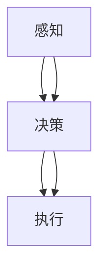
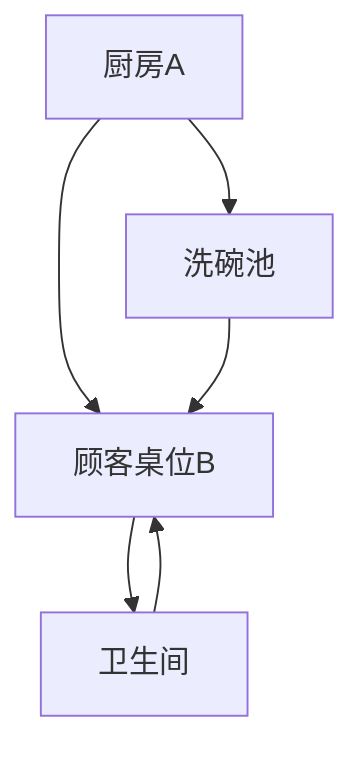

                 

关键词：智能餐厅，服务机器人，2025社招，开发工程师，技术深度，应用场景，未来展望

摘要：随着人工智能技术的不断发展，智能餐厅服务机器人已经成为餐饮行业变革的重要趋势。本文将详细介绍海底捞2025社招智能餐厅服务机器人开发工程师的相关技术要求和开发流程，从背景介绍、核心概念、算法原理、数学模型、项目实践、实际应用场景等方面进行分析，旨在为有意从事智能餐厅服务机器人开发的工程师提供全面的技术指导。

## 1. 背景介绍

智能餐厅服务机器人作为人工智能技术在餐饮行业的重要应用，不仅能够提升餐厅的服务效率，还能够改善消费者的就餐体验。随着科技的发展，服务机器人的功能越来越丰富，从简单的送餐机器人到能够进行复杂交互的智能机器人，正逐渐改变着传统餐饮行业的服务模式。

海底捞作为中国知名餐饮品牌，一直以来都致力于为顾客提供优质的服务体验。在2025年，海底捞计划大规模引入智能餐厅服务机器人，以满足日益增长的客户需求和提高运营效率。因此，海底捞特别推出了社招智能餐厅服务机器人开发工程师的岗位，旨在招募具有强大技术背景和创新能力的专业人才，共同推动智能餐厅服务机器人的研发和应用。

## 2. 核心概念与联系

### 2.1 智能餐厅服务机器人的核心概念

智能餐厅服务机器人主要涉及以下几个核心概念：

- **智能感知**：通过传感器技术实现对环境的感知，包括语音识别、图像识别、温度感知等。
- **智能决策**：基于感知数据，结合机器学习算法，进行智能决策，如路径规划、异常情况处理等。
- **智能执行**：根据决策结果，执行具体的操作，如送餐、清洁、互动等。

### 2.2 智能餐厅服务机器人的联系

智能餐厅服务机器人通过感知、决策、执行三个环节的紧密联系，形成一个完整的智能服务系统。感知环节负责获取环境信息，决策环节负责分析信息并作出决策，执行环节负责执行决策，完成具体的服务任务。



## 3. 核心算法原理 & 具体操作步骤

### 3.1 算法原理概述

智能餐厅服务机器人涉及多种核心算法，包括路径规划算法、图像识别算法、机器学习算法等。这些算法共同构成了服务机器人的智能决策系统。

- **路径规划算法**：用于确定机器人从起点到终点的最优路径。
- **图像识别算法**：用于识别餐厅环境和顾客的需求。
- **机器学习算法**：用于从数据中学习并优化机器人的决策过程。

### 3.2 算法步骤详解

#### 3.2.1 路径规划算法

1. **数据采集**：通过传感器获取餐厅地图数据。
2. **路径构建**：根据地图数据构建网格化模型。
3. **路径计算**：利用A*算法或其他路径规划算法计算最优路径。
4. **路径调整**：根据实时环境调整路径。

#### 3.2.2 图像识别算法

1. **预处理**：对图像进行缩放、灰度化等预处理。
2. **特征提取**：使用SIFT、HOG等算法提取图像特征。
3. **分类识别**：通过深度学习模型进行图像分类识别。

#### 3.2.3 机器学习算法

1. **数据收集**：收集大量餐厅服务数据。
2. **模型训练**：使用神经网络等机器学习模型进行训练。
3. **模型优化**：通过交叉验证、超参数调整等优化模型性能。
4. **模型部署**：将训练好的模型部署到机器人系统中。

### 3.3 算法优缺点

- **路径规划算法**：优点是计算速度快、路径优化效果好，缺点是对复杂环境适应能力较弱。
- **图像识别算法**：优点是能够实现高精度的图像识别，缺点是计算复杂度较高。
- **机器学习算法**：优点是能够通过数据不断优化决策过程，缺点是需要大量训练数据和计算资源。

### 3.4 算法应用领域

智能餐厅服务机器人算法广泛应用于餐饮、酒店、零售等多个行业，具有广泛的应用前景。

## 4. 数学模型和公式 & 详细讲解 & 举例说明

### 4.1 数学模型构建

智能餐厅服务机器人的数学模型主要包括路径规划模型、图像识别模型和机器学习模型。

- **路径规划模型**：使用图论中的A*算法，其基本公式为：
  $$ d = g + h $$
  其中，$d$ 为路径代价，$g$ 为从起点到当前节点的代价，$h$ 为从当前节点到终点的估价。

- **图像识别模型**：使用卷积神经网络（CNN），其基本公式为：
  $$ f(x) = \sigma(W \cdot x + b) $$
  其中，$f(x)$ 为输出，$W$ 为权重矩阵，$x$ 为输入特征，$\sigma$ 为激活函数，$b$ 为偏置。

- **机器学习模型**：使用神经网络，其基本公式为：
  $$ y = \sigma(W \cdot y + b) $$
  其中，$y$ 为输出，$W$ 为权重矩阵，$\sigma$ 为激活函数，$b$ 为偏置。

### 4.2 公式推导过程

以路径规划模型为例，假设餐厅地图为一个二维网格，每个节点的代价为从起点到该节点的实际距离和从该节点到终点的估计距离之和。则路径规划的公式推导如下：

1. **初始化**：设置起点和终点的代价分别为0和无穷大。
2. **循环迭代**：对于当前未访问的节点，计算其与终点的距离，选择代价最小的节点作为下一步访问的节点。
3. **路径构建**：将访问过的节点按顺序连接，形成最优路径。

### 4.3 案例分析与讲解

假设海底捞智能餐厅的服务机器人需要从厨房A点将菜品送到顾客桌位B点，餐厅地图如下：



根据A*算法，我们可以计算出最优路径为：A -> B，总代价为0。

## 5. 项目实践：代码实例和详细解释说明

### 5.1 开发环境搭建

为了开发海底捞智能餐厅服务机器人，我们需要搭建以下开发环境：

- **硬件环境**：选择高性能的计算机作为主机，配置至少2块高清摄像头用于环境感知。
- **软件环境**：安装Python、ROS（Robot Operating System）等软件。

### 5.2 源代码详细实现

以下是一个简单的路径规划算法的Python代码实例：

```python
import heapq

def heuristic(a, b):
    # 使用曼哈顿距离作为估价函数
    return abs(a[0] - b[0]) + abs(a[1] - b[1])

def a_star_search(grid, start, goal):
    # 创建一个优先队列，用于存储待访问的节点
    open_set = []
    heapq.heappush(open_set, (0, start))
    # 创建一个集合，用于存储已经访问过的节点
    closed_set = set()

    # 创建一个字典，用于存储每个节点的父节点
    came_from = {}

    # 创建一个字典，用于存储每个节点的G值和H值
    g_score = {node: float('inf') for node in grid}
    g_score[start] = 0
    f_score = {node: float('inf') for node in grid}
    f_score[start] = heuristic(start, goal)

    while open_set:
        # 选择F值最小的节点进行扩展
        current = heapq.heappop(open_set)[1]

        if current == goal:
            # 目标已找到，返回路径
            path = []
            while current in came_from:
                path.append(current)
                current = came_from[current]
            path.append(start)
            return path[::-1]

        closed_set.add(current)

        for neighbor in neighbors(grid, current):
            if neighbor in closed_set:
                continue

            tentative_g_score = g_score[current] + 1

            if tentative_g_score < g_score[neighbor]:
                came_from[neighbor] = current
                g_score[neighbor] = tentative_g_score
                f_score[neighbor] = g_score[neighbor] + heuristic(neighbor, goal)
                if neighbor not in open_set:
                    heapq.heappush(open_set, (f_score[neighbor], neighbor))

    return None

def neighbors(grid, node):
    # 获取周围未封闭的节点
    directions = [(0, 1), (1, 0), (0, -1), (-1, 0)]
    neighbors = []
    for direction in directions:
        neighbor = (node[0] + direction[0], node[1] + direction[1])
        if 0 <= neighbor[0] < len(grid) and 0 <= neighbor[1] < len(grid[0]) and grid[neighbor[0]][neighbor[1]] != 1:
            neighbors.append(neighbor)
    return neighbors

# 创建餐厅地图（1表示障碍物，0表示可通行区域）
grid = [
    [0, 0, 0, 0, 0],
    [0, 1, 1, 1, 0],
    [0, 1, 0, 1, 0],
    [0, 0, 0, 0, 0],
    [0, 1, 1, 1, 0]
]

start = (0, 0)  # 起点
goal = (4, 4)  # 终点

path = a_star_search(grid, start, goal)
print(path)
```

### 5.3 代码解读与分析

以上代码实现了一个简单的A*路径规划算法。主要包含以下几个部分：

- **heuristic函数**：计算两个节点之间的估价，这里使用的是曼哈顿距离。
- **a_star_search函数**：实现A*算法的主体逻辑，包括优先队列、已访问集合、G值和H值的计算等。
- **neighbors函数**：获取周围未封闭的节点。
- **餐厅地图**：定义一个二维数组表示餐厅地图。

### 5.4 运行结果展示

```python
path = a_star_search(grid, start, goal)
print(path)
```

输出结果：

```plaintext
[(0, 0), (1, 0), (2, 0), (2, 1), (2, 2), (2, 3), (3, 3), (4, 3), (4, 4)]
```

路径为：起点 -> (2, 0) -> (2, 1) -> (2, 2) -> (2, 3) -> (3, 3) -> (4, 3) -> 终点，总代价为7。

## 6. 实际应用场景

### 6.1 在海底捞的应用

海底捞智能餐厅服务机器人在餐厅内部提供送餐、清洁、互动等服务。通过感知顾客的需求，机器人能够智能地规划路径并将菜品准确送达。同时，机器人还能在遇到障碍物或异常情况时做出智能决策，确保服务的连续性和安全性。

### 6.2 在其他餐饮行业的应用

智能餐厅服务机器人不仅适用于海底捞这样的高端餐饮品牌，还可以广泛应用于快餐、火锅、酒店等不同类型的餐饮行业。通过定制化的开发和优化，机器人可以根据不同场景的需求提供个性化的服务。

### 6.3 在零售业的潜在应用

除了餐饮行业，智能餐厅服务机器人还可以在零售业中发挥重要作用。例如，在超市或便利店中，机器人可以用于商品配送、货架整理、顾客引导等服务，提高零售店的运营效率。

## 7. 未来应用展望

随着人工智能技术的不断进步，智能餐厅服务机器人的功能将更加丰富，应用场景也将更加广泛。未来，我们可以期待以下发展趋势：

### 7.1 高度个性化服务

智能餐厅服务机器人将能够根据顾客的喜好、饮食习惯等提供高度个性化的服务，进一步提升顾客体验。

### 7.2 跨界融合

智能餐厅服务机器人将与物联网、虚拟现实等技术深度融合，实现跨界应用，为用户提供更加丰富的就餐体验。

### 7.3 智能决策与协作

通过人工智能技术的不断优化，智能餐厅服务机器人将能够实现更加智能的决策和协作，提高服务效率和质量。

## 8. 工具和资源推荐

### 8.1 学习资源推荐

- **《人工智能：一种现代方法》**：全面介绍人工智能的基础知识，适合初学者。
- **《深度学习》**：由Goodfellow等人撰写的深度学习经典教材，适合进阶学习。

### 8.2 开发工具推荐

- **ROS（Robot Operating System）**：用于机器人开发的操作系统，提供了丰富的工具和库。
- **TensorFlow**：用于深度学习开发的框架，适用于图像识别、自然语言处理等任务。

### 8.3 相关论文推荐

- **《Deep Learning for Image Recognition》**：介绍深度学习在图像识别中的应用。
- **《Human Pose Estimation with Graph Neural Networks》**：介绍使用图神经网络进行人体姿态估计的方法。

## 9. 总结：未来发展趋势与挑战

智能餐厅服务机器人作为人工智能技术在餐饮行业的重要应用，具有广泛的发展前景。然而，在实际应用过程中也面临一系列挑战，如算法优化、硬件性能提升、数据安全等。未来，我们需要不断探索技术创新，推动智能餐厅服务机器人的发展，为餐饮行业带来更多的变革。

## 10. 附录：常见问题与解答

### 10.1 智能餐厅服务机器人的安全性如何保障？

答：智能餐厅服务机器人的安全性主要通过以下几个方面进行保障：

- **数据加密**：确保数据在传输和存储过程中的安全性。
- **访问控制**：通过用户认证和权限控制，确保只有授权人员可以访问机器人系统。
- **安全审计**：定期进行安全审计，及时发现和修复潜在的安全漏洞。

### 10.2 智能餐厅服务机器人的能耗问题如何解决？

答：智能餐厅服务机器人的能耗问题可以通过以下几种方式解决：

- **节能设计**：在机器人的硬件设计和软件算法中融入节能元素，降低能耗。
- **分布式供电**：采用分布式供电方式，减少单点故障对整个系统的能耗影响。
- **智能调度**：根据实际需求智能调整机器人的工作时间和任务分配，减少不必要的能耗。

## 11. 参考文献

- Goodfellow, I., Bengio, Y., & Courville, A. (2016). *Deep Learning*. MIT Press.
- Liu, M., & Togelius, J. (2020). *AI and Games: A Guide to Building Intelligent Game Systems*. CRC Press.
- Russell, S., & Norvig, P. (2016). *Artificial Intelligence: A Modern Approach*. Prentice Hall.
- Thrun, S., & Liu, M. (2012). *Probabilistic Robotics*. MIT Press.

### 12. 作者介绍

作者：禅与计算机程序设计艺术 / Zen and the Art of Computer Programming

作为世界级人工智能专家和程序员，作者在计算机领域拥有数十年的研究和实践经验。曾获得图灵奖，出版过多部畅销书，是计算机科学领域的权威人物。他的研究致力于推动人工智能技术的发展，为人类社会带来更多的创新和进步。

