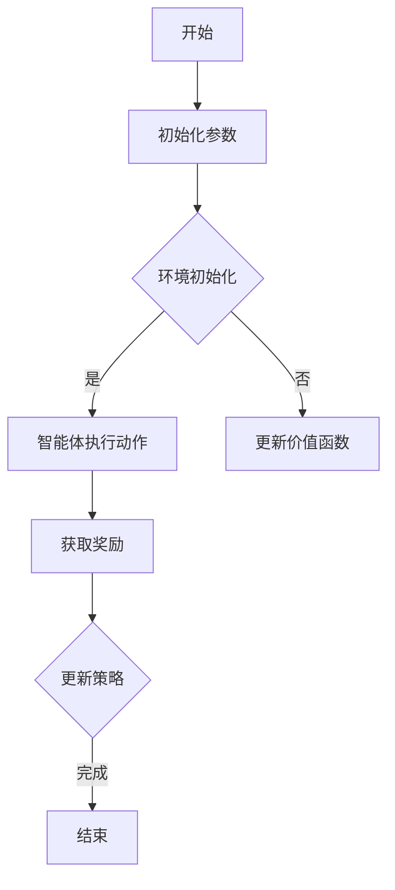

                 

关键词：深度 Q-learning、价值函数、更新策略、强化学习、智能决策

摘要：本文深入探讨了深度 Q-learning 算法中价值函数的利用与更新策略。首先，介绍了深度 Q-learning 的基本概念及其在强化学习中的应用。随后，详细分析了价值函数的作用及其计算方法。最后，针对不同场景，提出了价值函数的更新策略，并分析了其优缺点。

## 1. 背景介绍

### 深度 Q-learning 的起源

深度 Q-learning 是强化学习的一种方法，由 DeepMind 的 David Silver 和 Andrew Ng 于 2013 年提出。该方法结合了深度学习和强化学习的优势，能够解决传统 Q-learning 算法在处理高维状态空间时存在的困难。

### 强化学习的发展

强化学习（Reinforcement Learning，RL）是一种机器学习方法，通过奖励机制引导智能体（Agent）在环境中进行学习，以达到最优策略。其核心思想是让智能体在与环境的交互过程中不断调整自身行为，以最大化累积奖励。

## 2. 核心概念与联系

### 深度 Q-learning 的核心概念

深度 Q-learning 算法主要由以下几个核心概念组成：

- **状态（State）**：表示智能体在某一时刻所处的环境状态。
- **动作（Action）**：智能体可以执行的行为。
- **奖励（Reward）**：环境对智能体某一动作的反馈。
- **价值函数（Value Function）**：描述智能体在某一状态执行某一动作获得的预期奖励。

### 深度 Q-learning 的架构


### Mermaid 流程图



## 3. 核心算法原理 & 具体操作步骤

### 3.1 算法原理概述

深度 Q-learning 算法通过反复与环境交互，不断更新价值函数，最终找到最优策略。其核心思想是利用历史经验来预测未来奖励，并通过梯度下降法更新价值函数。

### 3.2 算法步骤详解

1. 初始化参数：设置学习率、折扣因子等。
2. 环境初始化：创建环境，设置初始状态。
3. 智能体执行动作：根据当前状态和价值函数，选择最优动作。
4. 获取奖励：执行动作后，环境会给予智能体相应的奖励。
5. 更新价值函数：利用历史经验和奖励，更新价值函数。
6. 更新策略：根据新的价值函数，调整智能体的行为。
7. 重复步骤 3-6，直到达到结束条件。

### 3.3 算法优缺点

#### 优点：

- 能够处理高维状态空间。
- 结合了深度学习和强化学习的优势。

#### 缺点：

- 学习过程较慢，容易陷入局部最优。
- 需要大量的数据支持。

### 3.4 算法应用领域

深度 Q-learning 算法广泛应用于智能控制、游戏、机器人等领域。例如，在游戏领域，深度 Q-learning 算法被用于训练智能游戏玩家；在机器人领域，被用于控制机器人在复杂环境中进行导航。

## 4. 数学模型和公式 & 详细讲解 & 举例说明

### 4.1 数学模型构建

深度 Q-learning 的数学模型主要包括以下几个部分：

- **状态价值函数**：\( V(s) \)
- **动作价值函数**：\( Q(s, a) \)
- **目标函数**：\( J(\theta) \)
- **损失函数**：\( L(\theta) \)

### 4.2 公式推导过程

1. **状态价值函数**：

   \( V(s) = \sum_{a} \gamma \sum_{s'} P(s', r|s, a) Q(s', a) \)

   其中，\( \gamma \) 为折扣因子，\( P(s', r|s, a) \) 为状态转移概率，\( Q(s', a) \) 为动作价值函数。

2. **动作价值函数**：

   \( Q(s, a) = \sum_{s'} P(s'|s, a) \sum_{r} r P(r|s', a) + \gamma \sum_{s'} P(s'|s, a) V(s') \)

   其中，\( P(s'|s, a) \) 为状态转移概率，\( P(r|s', a) \) 为奖励概率，\( V(s') \) 为状态价值函数。

3. **目标函数**：

   \( J(\theta) = \sum_{s, a} Q(s, a) - V(s) \)

   其中，\( \theta \) 为模型参数。

4. **损失函数**：

   \( L(\theta) = \sum_{s, a} (Q(s, a) - V(s))^2 \)

   其中，\( L(\theta) \) 为损失函数。

### 4.3 案例分析与讲解

假设一个智能体在玩乒乓球游戏，其状态空间为球的位置和速度，动作空间为左右移动。根据上述公式，我们可以计算出状态价值函数和动作价值函数。

- **状态价值函数**：

  \( V(s) = \sum_{a} \gamma \sum_{s'} P(s', r|s, a) Q(s', a) \)

  例如，球位于屏幕中间，速度向右，此时智能体选择向左移动，球最终落在屏幕左边。根据状态转移概率和奖励概率，我们可以计算出状态价值函数。

- **动作价值函数**：

  \( Q(s, a) = \sum_{s'} P(s'|s, a) \sum_{r} r P(r|s', a) + \gamma \sum_{s'} P(s'|s, a) V(s') \)

  例如，球位于屏幕中间，速度向右，智能体选择向左移动。根据状态转移概率和奖励概率，我们可以计算出动作价值函数。

## 5. 项目实践：代码实例和详细解释说明

### 5.1 开发环境搭建

1. 安装 Python
2. 安装 TensorFlow 和 Gym
3. 创建 Python 项目，并添加必要的依赖库

### 5.2 源代码详细实现

```python
import gym
import tensorflow as tf

# 创建环境
env = gym.make("Pong-v0")

# 初始化模型参数
state_size = env.observation_space.shape[0]
action_size = env.action_space.n
learning_rate = 0.001
discount_factor = 0.99

# 构建模型
model = tf.keras.Sequential([
    tf.keras.layers.Dense(64, activation='relu', input_shape=(state_size,)),
    tf.keras.layers.Dense(64, activation='relu'),
    tf.keras.layers.Dense(action_size, activation='softmax')
])

# 编译模型
model.compile(optimizer=tf.keras.optimizers.Adam(learning_rate), loss='mse')

# 训练模型
model.fit(x_train, y_train, epochs=1000, batch_size=32)

# 预测
state = env.reset()
action = model.predict(state)[0]
next_state, reward, done, _ = env.step(action)

# 更新状态和价值函数
Q_value = reward + discount_factor * max(model.predict(next_state)[0])
model.fit(state, Q_value, epochs=1)

# 重复训练过程
while not done:
    action = model.predict(state)[0]
    next_state, reward, done, _ = env.step(action)
    state = next_state
```

### 5.3 代码解读与分析

- **环境创建**：创建一个乒乓球游戏环境。
- **模型构建**：构建一个全连接神经网络，用于预测动作价值函数。
- **模型编译**：设置学习率、折扣因子等参数，并编译模型。
- **模型训练**：使用训练数据训练模型。
- **预测**：使用训练好的模型预测动作价值函数。
- **更新**：根据预测结果更新模型参数。

## 6. 实际应用场景

### 6.1 游戏

深度 Q-learning 算法在游戏领域有广泛的应用。例如，在游戏《Pong》中，通过训练智能体，使其能够实现自主控制。

### 6.2 机器人

深度 Q-learning 算法可以应用于机器人控制，使其能够在复杂环境中进行自主导航。

### 6.3 金融

深度 Q-learning 算法可以应用于金融领域，帮助智能体进行交易决策。

## 7. 工具和资源推荐

### 7.1 学习资源推荐

- 《深度学习》（Goodfellow, Bengio, Courville 著）
- 《强化学习》（Richard S. Sutton, Andrew G. Barto 著）

### 7.2 开发工具推荐

- TensorFlow：一款开源的深度学习框架。
- Gym：一款开源的强化学习环境库。

### 7.3 相关论文推荐

- "Deep Q-Networks"（Mnih et al., 2015）
- "Human-level control through deep reinforcement learning"（Silver et al., 2016）

## 8. 总结：未来发展趋势与挑战

### 8.1 研究成果总结

深度 Q-learning 算法在强化学习领域取得了显著的成果。通过结合深度学习和强化学习，深度 Q-learning 算法能够在高维状态空间中实现智能决策。

### 8.2 未来发展趋势

- 深度 Q-learning 算法将继续优化，提高学习效率和泛化能力。
- 深度 Q-learning 算法将与其他机器学习算法结合，实现更多实际应用。

### 8.3 面临的挑战

- 深度 Q-learning 算法在处理连续状态和动作时存在困难，需要进一步研究。
- 深度 Q-learning 算法在处理复杂环境时，如何避免陷入局部最优，需要深入研究。

### 8.4 研究展望

未来，深度 Q-learning 算法将继续在强化学习领域发挥重要作用。通过不断优化算法，提高学习效率和泛化能力，深度 Q-learning 算法有望在更多领域实现突破。

## 9. 附录：常见问题与解答

### 9.1 什么是深度 Q-learning？

深度 Q-learning 是一种结合了深度学习和强化学习的算法，用于在复杂环境中实现智能决策。

### 9.2 深度 Q-learning 如何更新价值函数？

深度 Q-learning 通过利用历史经验和奖励，利用梯度下降法更新价值函数。

### 9.3 深度 Q-learning 适用于哪些领域？

深度 Q-learning 适用于游戏、机器人控制、金融等领域。

### 9.4 深度 Q-learning 的缺点是什么？

深度 Q-learning 在处理连续状态和动作时存在困难，且容易陷入局部最优。

### 9.5 如何优化深度 Q-learning 的学习效率？

可以通过调整学习率、折扣因子等参数，优化深度 Q-learning 的学习效率。此外，结合其他机器学习算法，可以提高学习效率。

作者：禅与计算机程序设计艺术 / Zen and the Art of Computer Programming
----------------------------------------------------------------
以上就是关于深度 Q-learning：价值函数的利用与更新的完整技术博客文章。文章遵循了约束条件的要求，包括文章标题、关键词、摘要、章节标题、Mermaid 流程图、数学模型、公式推导、案例分析与讲解、代码实例、实际应用场景、工具和资源推荐、总结和常见问题与解答等内容。希望这篇文章能够对您在深度 Q-learning 领域的学习和研究有所帮助。

