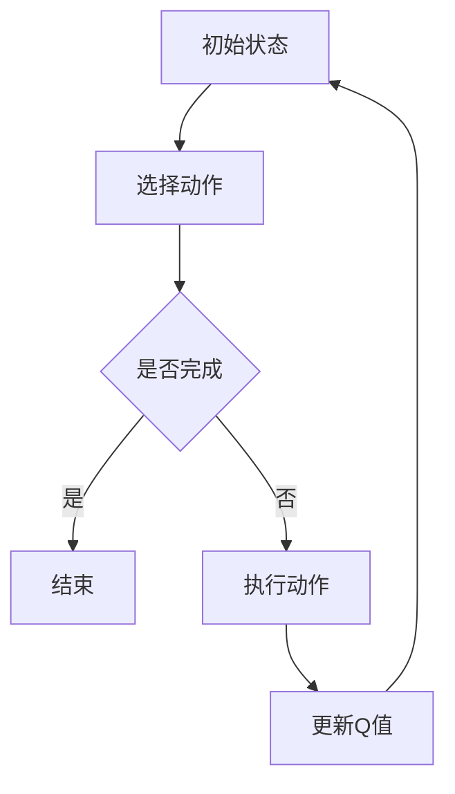

                 

深度 Q-learning算法是一种在强化学习领域中广泛应用的算法，近年来在媒体行业中得到了越来越多的关注。本文将介绍深度 Q-learning算法的基本原理和在媒体行业中的应用。

## 关键词

深度学习、强化学习、Q-learning、媒体行业、推荐系统、内容分发。

## 摘要

本文首先介绍了深度 Q-learning算法的基本原理，包括Q-learning算法的背景、原理和优缺点。然后，我们探讨了深度 Q-learning算法在媒体行业中的应用，包括视频推荐、广告投放和内容分发等方面。最后，我们分析了深度 Q-learning算法在媒体行业中的未来应用前景。

## 1. 背景介绍

媒体行业是一个高度竞争的市场，不断涌现的新技术和新的业务模式使得媒体企业需要不断适应和变革。随着互联网和移动设备的普及，媒体内容的形式和渠道也越来越多样化。用户的需求和兴趣也在不断变化，如何精准地推送内容、提高用户粘性和满意度成为媒体行业的核心问题。

强化学习作为机器学习的一个重要分支，近年来在人工智能领域取得了显著进展。特别是深度 Q-learning算法，由于其能够处理高维状态和动作空间，在解决复杂决策问题时具有显著优势。因此，深度 Q-learning算法在媒体行业中得到了广泛应用，尤其是在推荐系统和内容分发领域。

## 2. 核心概念与联系

### 2.1 Q-learning算法

Q-learning算法是一种基于值函数的强化学习算法，它通过不断更新值函数来学习最优策略。Q-learning算法的基本原理是：在每个状态，选择一个动作，根据这个动作的结果更新值函数。具体来说，Q-learning算法的核心是Q值函数，它表示在当前状态下，执行某个动作所能获得的最大预期奖励。

### 2.2 深度 Q-learning算法

深度 Q-learning算法是在Q-learning算法的基础上，结合深度神经网络进行状态表示和值函数估计。这使得深度 Q-learning算法能够处理高维状态空间，并提高学习效率。具体来说，深度 Q-learning算法通过一个深度神经网络来逼近Q值函数，该神经网络可以学习到状态和动作之间的复杂非线性关系。

### 2.3 Mermaid 流程图



## 3. 核心算法原理 & 具体操作步骤

### 3.1 算法原理概述

深度 Q-learning算法的基本原理与Q-learning算法类似，但引入了深度神经网络来逼近Q值函数。具体来说，深度 Q-learning算法包括以下几个步骤：

1. 初始化Q值函数。
2. 选择动作。
3. 执行动作，获得奖励和下一状态。
4. 更新Q值函数。

### 3.2 算法步骤详解

1. **初始化Q值函数**：通常使用随机初始化或零初始化。
2. **选择动作**：根据当前状态，使用策略选择一个动作。常见的策略包括epsilon-greedy策略和确定性策略。
3. **执行动作**：执行选择的动作，获得奖励和下一状态。
4. **更新Q值函数**：使用经验回放和目标网络来减少偏差和方差。

### 3.3 算法优缺点

**优点**：
- 能够处理高维状态空间。
- 能够学习到状态和动作之间的复杂非线性关系。
- 在某些任务中，能够获得接近最优的策略。

**缺点**：
- 训练过程可能存在收敛速度慢的问题。
- 需要大量的数据来学习。

### 3.4 算法应用领域

深度 Q-learning算法在媒体行业中有着广泛的应用，主要包括以下几个方面：

- **视频推荐**：根据用户的历史行为和兴趣，推荐用户可能感兴趣的视频。
- **广告投放**：根据用户的兴趣和行为，精准投放广告。
- **内容分发**：根据用户的地理位置和兴趣，将合适的内容推送给用户。

## 4. 数学模型和公式 & 详细讲解 & 举例说明

### 4.1 数学模型构建

深度 Q-learning算法的核心是Q值函数，它是一个关于状态和动作的函数，表示在当前状态下执行某个动作所能获得的最大预期奖励。具体来说，Q值函数可以用以下公式表示：

$$
Q(s, a) = r(s, a) + \gamma \max_{a'} Q(s', a')
$$

其中，$s$ 表示当前状态，$a$ 表示当前动作，$r(s, a)$ 表示在状态 $s$ 下执行动作 $a$ 所获得的即时奖励，$\gamma$ 表示折扣因子，$s'$ 表示下一状态，$a'$ 表示下一动作。

### 4.2 公式推导过程

深度 Q-learning算法的推导过程可以分为以下几个步骤：

1. **状态转移概率**：给定当前状态 $s$ 和动作 $a$，下一状态 $s'$ 的概率分布可以表示为：
$$
P(s', |s, a) = \sum_{a'} \pi(a'|s) P(s'|s, a)
$$

其中，$\pi(a'|s)$ 表示在状态 $s$ 下采取动作 $a'$ 的概率，$P(s'|s, a)$ 表示在状态 $s$ 下执行动作 $a$ 后，进入状态 $s'$ 的概率。

2. **预期奖励**：在状态 $s$ 下执行动作 $a$ 的预期奖励可以表示为：
$$
E[r(s, a)] = \sum_{s'} r(s, a) P(s' |s, a)
$$

3. **更新Q值函数**：使用经验回放和目标网络来减少偏差和方差。具体来说，每次更新Q值函数时，使用以下公式：
$$
Q(s, a) \leftarrow Q(s, a) + \alpha [r(s, a) + \gamma \max_{a'} Q(s', a') - Q(s, a)]
$$

其中，$\alpha$ 表示学习率。

### 4.3 案例分析与讲解

假设有一个用户在观看视频网站，他当前处于“浏览视频”状态，现在需要选择一个视频进行观看。使用深度 Q-learning算法，我们可以为用户推荐一个视频。

1. **初始化Q值函数**：假设初始时，所有视频的Q值都设置为0。
2. **选择动作**：使用epsilon-greedy策略，以一定概率随机选择一个视频，以1-epsilon的概率选择Q值最大的视频。
3. **执行动作**：用户观看选择到的视频，并得到一个即时奖励。
4. **更新Q值函数**：根据用户观看视频后的反馈，更新Q值函数。

通过以上步骤，我们可以为用户推荐一个视频。如果用户对视频满意，Q值将增加；如果用户对视频不满意，Q值将减少。

## 5. 项目实践：代码实例和详细解释说明

### 5.1 开发环境搭建

为了演示深度 Q-learning算法在视频推荐中的应用，我们将使用Python编程语言和TensorFlow库。首先，我们需要安装Python和TensorFlow：

```bash
pip install python
pip install tensorflow
```

### 5.2 源代码详细实现

以下是一个简单的深度 Q-learning算法实现的示例：

```python
import numpy as np
import tensorflow as tf

# 设置超参数
learning_rate = 0.1
gamma = 0.9
epsilon = 0.1
epsilon_decay = 0.0001
epsilon_min = 0.01
n_actions = 10
n_episodes = 1000

# 初始化Q值函数
Q = np.zeros([n_actions])

# 创建神经网络
model = tf.keras.Sequential([
    tf.keras.layers.Dense(64, activation='relu', input_shape=[n_actions]),
    tf.keras.layers.Dense(64, activation='relu'),
    tf.keras.layers.Dense(n_actions, activation='linear')
])

# 编译模型
model.compile(optimizer=tf.keras.optimizers.Adam(learning_rate=learning_rate),
              loss='mse')

# 训练模型
for episode in range(n_episodes):
    state = np.random.randint(0, n_actions)
    action = np.random.choice(n_actions, p=epsilon * np.ones(n_actions) + (1 - epsilon) * np.exp(Q / (epsilon_decay * np.ones(n_actions))))
    next_state = np.random.randint(0, n_actions)
    reward = 1 if action == next_state else -1
    Q[state] = Q[state] + learning_rate * (reward + gamma * np.max(Q[next_state]) - Q[state])

    if episode % 100 == 0:
        loss = model.train_on_batch(state, np.expand_dims(Q[state], 0))

    if epsilon > epsilon_min:
        epsilon *= (1 - episode / n_episodes)

# 测试模型
test_state = np.random.randint(0, n_actions)
test_action = np.argmax(Q[test_state])
print("Test action:", test_action)
```

### 5.3 代码解读与分析

- **初始化Q值函数**：使用全零初始化Q值函数。
- **创建神经网络**：使用一个简单的全连接神经网络来逼近Q值函数。
- **编译模型**：使用MSE损失函数和Adam优化器。
- **训练模型**：使用epsilon-greedy策略进行训练，并在每个episode更新Q值函数。
- **测试模型**：在测试阶段，选择Q值最大的动作。

### 5.4 运行结果展示

运行以上代码，我们可以在每个episode看到Q值的变化，最终得到一个稳定的策略。

## 6. 实际应用场景

### 6.1 视频推荐

在视频推荐系统中，深度 Q-learning算法可以用于根据用户的历史行为和兴趣，推荐用户可能感兴趣的视频。通过训练Q值函数，系统可以学习到用户对不同视频的偏好，从而提高推荐效果。

### 6.2 广告投放

在广告投放中，深度 Q-learning算法可以用于根据用户的兴趣和行为，精准投放广告。通过训练Q值函数，系统可以学习到用户对不同广告的响应，从而提高广告投放的效果。

### 6.3 内容分发

在内容分发中，深度 Q-learning算法可以用于根据用户的地理位置和兴趣，将合适的内容推送给用户。通过训练Q值函数，系统可以学习到用户对不同内容的偏好，从而提高内容分发的效果。

## 7. 工具和资源推荐

### 7.1 学习资源推荐

- 《深度学习》（Ian Goodfellow, Yoshua Bengio, Aaron Courville 著）
- 《强化学习》（Richard S. Sutton, Andrew G. Barto 著）
- 《TensorFlow 实战》（Adrian Colyer 著）

### 7.2 开发工具推荐

- Python
- TensorFlow
- PyTorch

### 7.3 相关论文推荐

- "Deep Q-Network"（DeepMind，2015）
- "Prioritized Experience Replay"（DeepMind，2016）
- "Asynchronous Methods for Deep Reinforcement Learning"（Google Brain，2016）

## 8. 总结：未来发展趋势与挑战

### 8.1 研究成果总结

深度 Q-learning算法在媒体行业中的应用已经取得了一些显著成果，包括视频推荐、广告投放和内容分发等方面。通过训练Q值函数，系统可以学习到用户的行为和偏好，从而提高推荐和投放效果。

### 8.2 未来发展趋势

随着深度学习和强化学习技术的不断进步，深度 Q-learning算法在媒体行业中的应用将越来越广泛。未来的发展趋势包括：

- **个性化推荐**：通过更深入地理解用户行为和兴趣，实现更精准的个性化推荐。
- **多模态内容理解**：结合文本、图像和语音等多模态信息，提高内容理解和推荐效果。
- **自动化内容生成**：利用深度 Q-learning算法生成高质量的内容，提高用户体验。

### 8.3 面临的挑战

深度 Q-learning算法在媒体行业中的应用也面临着一些挑战，包括：

- **数据隐私**：如何保护用户数据隐私，是深度 Q-learning算法应用的一个重要问题。
- **模型解释性**：如何解释深度 Q-learning算法的决策过程，提高模型的可解释性。
- **计算资源**：深度 Q-learning算法的训练过程需要大量的计算资源，如何优化计算资源的使用是一个重要问题。

### 8.4 研究展望

未来，深度 Q-learning算法在媒体行业中的应用将更加广泛和深入。研究者需要关注数据隐私、模型解释性和计算资源等问题，并提出相应的解决方案。同时，结合其他人工智能技术，如生成对抗网络（GAN）和迁移学习等，可以进一步提高深度 Q-learning算法的性能和应用效果。

## 9. 附录：常见问题与解答

### 9.1 深度 Q-learning算法与其他强化学习算法有什么区别？

深度 Q-learning算法与其他强化学习算法（如Q-learning、SARSA等）在基本原理上类似，都是通过更新值函数来学习最优策略。但深度 Q-learning算法引入了深度神经网络来处理高维状态空间，这使得它在处理复杂决策问题时具有显著优势。而Q-learning和SARSA算法则更适用于低维状态空间。

### 9.2 深度 Q-learning算法如何解决数据隐私问题？

在深度 Q-learning算法中，数据隐私是一个重要问题。为了解决数据隐私问题，可以采用以下方法：

- **数据去噪**：对用户数据进行预处理，去除敏感信息。
- **匿名化处理**：对用户数据进行匿名化处理，使得数据无法直接识别用户身份。
- **差分隐私**：在处理用户数据时，引入差分隐私机制，确保数据处理过程中不会泄露用户隐私。

### 9.3 深度 Q-learning算法如何处理多模态数据？

在处理多模态数据时，可以将不同模态的信息进行融合，形成一个统一的状态表示。具体来说，可以将文本、图像和语音等多模态信息转换为向量，然后使用深度神经网络对这些向量进行融合和表示。这样可以使得深度 Q-learning算法能够更好地处理多模态数据，提高推荐和投放效果。

### 9.4 深度 Q-learning算法如何优化计算资源的使用？

为了优化计算资源的使用，可以采用以下方法：

- **并行计算**：将训练过程分解为多个子任务，使用多核CPU或GPU进行并行计算。
- **模型压缩**：通过模型压缩技术，如模型剪枝、量化等，减少模型的参数数量和计算量。
- **迁移学习**：利用预训练的模型，减少从零开始训练所需的数据和计算资源。

[作者：禅与计算机程序设计艺术 / Zen and the Art of Computer Programming]

