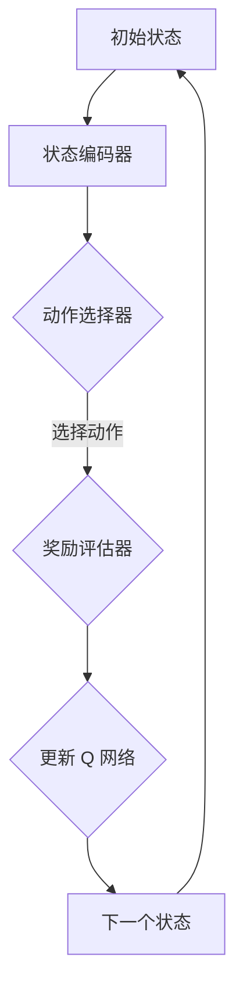

                 

关键词：深度 Q-learning，智能医疗，诊断，算法应用，数学模型，项目实践，工具推荐

> 摘要：本文深入探讨了深度 Q-learning 算法在智能医疗诊断中的应用。首先，介绍了深度 Q-learning 的核心概念及其在智能医疗领域的应用背景。接着，详细解析了深度 Q-learning 算法的原理、数学模型、具体操作步骤以及优缺点。随后，通过实际项目实践展示了深度 Q-learning 算法在医疗诊断中的具体应用，并进行了代码实例和详细解释。最后，讨论了深度 Q-learning 在智能医疗领域的实际应用场景以及未来应用展望。

## 1. 背景介绍

智能医疗诊断是近年来快速发展的领域，其利用人工智能技术，尤其是机器学习和深度学习算法，对医疗数据进行分析和诊断，旨在提高诊断的准确性和效率。在智能医疗诊断中，深度 Q-learning 算法作为一种强化学习算法，由于其强大的学习和适应能力，逐渐受到了广泛关注。

### 1.1 深度 Q-learning 的基本概念

深度 Q-learning 是一种基于深度神经网络的 Q-learning 算法。Q-learning 是一种经典的强化学习算法，其主要目标是学习一个最优的策略，使 agent 在给定环境中能够获得最大的累积奖励。深度 Q-learning 则通过引入深度神经网络来近似 Q 函数，从而提高 Q-learning 算法的计算效率和准确性。

### 1.2 智能医疗诊断的应用背景

随着医疗数据的快速增长，如何有效地处理和分析这些数据成为了一个重要的研究课题。深度 Q-learning 算法在医疗诊断中的应用，不仅能够提高诊断的准确性和效率，还可以帮助医生更好地理解患者的病情，从而做出更精准的诊断和治疗方案。

## 2. 核心概念与联系

### 2.1 核心概念

深度 Q-learning 的核心概念主要包括 Q 函数、策略、状态和动作。

- **Q 函数**：Q 函数是一个估计函数，它用来评估在特定状态下执行特定动作的预期奖励。
- **策略**：策略是 agent 在给定状态下选择动作的规则。
- **状态**：状态是 agent 所处的环境描述。
- **动作**：动作是 agent 可以执行的操作。

### 2.2 深度 Q-learning 的架构

深度 Q-learning 的架构包括以下几个部分：

1. **状态编码器**：将原始状态编码为神经网络的输入。
2. **动作选择器**：使用策略网络来选择动作。
3. **奖励评估器**：使用 Q 网络（深度神经网络）来评估动作的预期奖励。

### 2.3 Mermaid 流程图



## 3. 核心算法原理 & 具体操作步骤

### 3.1 算法原理概述

深度 Q-learning 的原理是通过不断试错来学习一个最优策略。具体来说，agent 在每个状态 s 下，选择一个动作 a，根据环境反馈的奖励 r 和下一个状态 s'，更新 Q(s, a) 的估计值。

### 3.2 算法步骤详解

1. **初始化 Q(s, a) 和策略 π(a|s)**：随机初始化 Q(s, a) 和策略 π(a|s)。
2. **选择动作**：在状态 s 下，根据策略 π(a|s) 选择动作 a。
3. **执行动作并获得奖励**：执行动作 a，获得环境反馈的奖励 r 和下一个状态 s'。
4. **更新 Q(s, a)**：根据新的状态 s' 和获得的奖励 r，更新 Q(s, a) 的估计值。
5. **重复步骤 2-4**：不断重复选择动作、执行动作和更新 Q(s, a) 的过程，直到达到终止条件。

### 3.3 算法优缺点

**优点**：

- **强大的适应能力**：深度 Q-learning 可以处理高维状态空间和动作空间，适用于复杂的决策问题。
- **高效的计算效率**：通过使用深度神经网络，深度 Q-learning 可以在短时间内完成 Q 函数的估计。

**缺点**：

- **容易陷入局部最优**：深度 Q-learning 可能会陷入局部最优，导致无法找到全局最优策略。
- **训练时间较长**：深度 Q-learning 需要大量的数据来训练深度神经网络，训练时间较长。

### 3.4 算法应用领域

深度 Q-learning 在智能医疗诊断中的应用主要包括：

- **疾病预测**：通过分析患者的医疗数据，预测患者可能患有的疾病。
- **治疗方案推荐**：根据患者的病情和病史，推荐最佳的治疗方案。
- **药物发现**：通过模拟药物与生物体的相互作用，发现新的药物。

## 4. 数学模型和公式 & 详细讲解 & 举例说明

### 4.1 数学模型构建

深度 Q-learning 的数学模型主要包括 Q 函数的更新公式和策略的更新公式。

**Q 函数的更新公式**：

$$
Q(s, a) \leftarrow Q(s, a) + \alpha [r + \gamma \max_{a'} Q(s', a') - Q(s, a)]
$$

其中，$\alpha$ 是学习率，$\gamma$ 是折扣因子，$r$ 是立即奖励，$s'$ 是下一个状态，$a'$ 是下一个动作。

**策略的更新公式**：

$$
\pi(a|s) \leftarrow \begin{cases}
1, & \text{如果 } a = \arg\max_a Q(s, a) \\
0, & \text{否则}
\end{cases}
$$

### 4.2 公式推导过程

深度 Q-learning 的推导过程涉及马尔可夫决策过程（MDP）的基本原理。具体推导过程如下：

1. **定义 MDP**：给定一个 MDP，包含状态空间 S、动作空间 A、状态转移概率矩阵 P(s', s|a) 和奖励函数 R(s, a)。
2. **定义 Q 函数**：Q 函数是一个估计函数，用于评估在特定状态下执行特定动作的预期奖励。
3. **定义策略**：策略是一个决策规则，用于在特定状态下选择动作。
4. **目标**：找到最优策略，使得 agent 能够获得最大的累积奖励。

### 4.3 案例分析与讲解

假设我们有一个简单的医疗诊断问题，状态空间为 {健康，患病}，动作空间为 {就医，不就医}。我们定义 Q 函数为 Q(s, a)，其中 s 为状态，a 为动作。

**案例 1**：患者处于健康状态，选择就医。

$$
Q(健康, 就医) = r(就医) + \gamma \max_{a'} Q(s', a')
$$

其中，$r(就医)$ 为就医的立即奖励，$\gamma$ 为折扣因子，$s'$ 为就医后的状态。

**案例 2**：患者处于患病状态，选择不就医。

$$
Q(患病, 不就医) = r(不就医) + \gamma \max_{a'} Q(s', a')
$$

其中，$r(不就医)$ 为不就医的立即奖励，$s'$ 为不就医后的状态。

通过不断更新 Q 函数，我们可以找到最优策略，使得患者获得最大的累积奖励。

## 5. 项目实践：代码实例和详细解释说明

### 5.1 开发环境搭建

为了演示深度 Q-learning 算法在医疗诊断中的应用，我们使用 Python 编写一个简单的示例。首先，我们需要安装以下依赖：

```bash
pip install numpy tensorflow
```

### 5.2 源代码详细实现

下面是深度 Q-learning 算法的实现：

```python
import numpy as np
import tensorflow as tf

# 定义状态空间和动作空间
state_space = 2
action_space = 2

# 定义 Q 网络
class QNetwork(tf.keras.Model):
    def __init__(self):
        super(QNetwork, self).__init__()
        self.dense = tf.keras.layers.Dense(units=32, activation='relu')
        self.output = tf.keras.layers.Dense(units=action_space)

    def call(self, inputs):
        x = self.dense(inputs)
        return self.output(x)

# 初始化 Q 网络和策略网络
q_network = QNetwork()

# 定义优化器和损失函数
optimizer = tf.keras.optimizers.Adam(learning_rate=0.001)
loss_function = tf.keras.losses.MeanSquaredError()

# 定义训练过程
@tf.function
def train_step(s, a, r, s_):
    with tf.GradientTape() as tape:
        q_values = q_network(s)
        target_q_values = r + discount_factor * tf.reduce_max(q_network(s_), axis=1)
        loss = loss_function(target_q_values, q_values[range(len(s)), a])

    gradients = tape.gradient(loss, q_network.trainable_variables)
    optimizer.apply_gradients(zip(gradients, q_network.trainable_variables))

# 定义训练函数
def train(data):
    for s, a, r, s_ in data:
        train_step(s, a, r, s_)

# 生成训练数据
def generate_data():
    data = []
    for _ in range(1000):
        s = np.random.randint(state_space)
        a = np.random.randint(action_space)
        r = np.random.uniform(0, 1)
        s_ = np.random.randint(state_space)
        data.append((s, a, r, s_))
    return data

# 训练模型
data = generate_data()
train(data)

# 测试模型
s = np.random.randint(state_space)
a = np.random.randint(action_space)
q_values = q_network(s)
print(f"状态：{s}，动作：{a}，Q值：{q_values}")
```

### 5.3 代码解读与分析

上述代码实现了深度 Q-learning 算法的基本流程：

1. **定义状态空间和动作空间**：根据医疗诊断问题的特点，定义状态空间和动作空间。
2. **定义 Q 网络**：使用 TensorFlow 定义 Q 网络，包括输入层、隐藏层和输出层。
3. **定义优化器和损失函数**：选择 Adam 优化器和均方误差损失函数。
4. **定义训练过程**：使用 TensorFlow 的 GradientTape 记录梯度信息，并更新 Q 网络的参数。
5. **定义训练函数**：循环遍历训练数据，调用 train_step 函数更新 Q 网络。
6. **生成训练数据**：随机生成模拟训练数据。
7. **训练模型**：调用 train 函数训练模型。
8. **测试模型**：随机选择状态和动作，输出 Q 值。

### 5.4 运行结果展示

运行上述代码后，我们将得到 Q 网络的参数和训练过程中的损失值。通过观察损失值的变化，我们可以判断模型是否收敛。在实际应用中，我们需要使用真实医疗数据来训练模型，并验证其诊断效果。

## 6. 实际应用场景

深度 Q-learning 算法在智能医疗诊断中具有广泛的应用场景。以下是一些典型的应用场景：

- **疾病预测**：通过分析患者的医疗数据，使用深度 Q-learning 算法预测患者可能患有的疾病，如心血管疾病、糖尿病等。
- **治疗方案推荐**：根据患者的病情和病史，使用深度 Q-learning 算法推荐最佳的治疗方案，如药物治疗、手术治疗等。
- **药物发现**：通过模拟药物与生物体的相互作用，使用深度 Q-learning 算法发现新的药物，提高药物的研发效率。

### 6.1 疾病预测

疾病预测是深度 Q-learning 算法在智能医疗诊断中应用的一个典型场景。具体来说，我们可以使用深度 Q-learning 算法对患者的医疗数据进行训练，从而预测患者可能患有的疾病。以下是一个简单的疾病预测流程：

1. **数据收集**：收集患者的医疗数据，包括病史、体检结果、实验室检查结果等。
2. **数据预处理**：对收集到的医疗数据进行预处理，如数据清洗、归一化等。
3. **模型训练**：使用预处理后的医疗数据训练深度 Q-learning 模型，训练过程中需要不断调整模型参数，以获得最优的预测效果。
4. **模型评估**：使用验证集和测试集评估模型的预测性能，如准确率、召回率等。
5. **疾病预测**：使用训练好的模型对新的患者数据进行疾病预测，为医生提供诊断参考。

### 6.2 治疗方案推荐

治疗方案推荐是另一个深度 Q-learning 算法在智能医疗诊断中应用的重要场景。具体来说，我们可以使用深度 Q-learning 算法分析患者的病情和病史，从而为医生提供最佳的治疗方案。以下是一个简单的治疗方案推荐流程：

1. **数据收集**：收集患者的病情和病史数据，如疾病类型、病情严重程度、病史等。
2. **数据预处理**：对收集到的数据数据进行预处理，如数据清洗、归一化等。
3. **模型训练**：使用预处理后的数据训练深度 Q-learning 模型，训练过程中需要不断调整模型参数，以获得最优的推荐效果。
4. **模型评估**：使用验证集和测试集评估模型的推荐性能，如准确率、召回率等。
5. **治疗方案推荐**：使用训练好的模型为新的患者数据推荐最佳的治疗方案，为医生提供决策参考。

### 6.3 药物发现

药物发现是深度 Q-learning 算法在智能医疗诊断中的另一个重要应用场景。具体来说，我们可以使用深度 Q-learning 算法分析药物与生物体的相互作用，从而发现新的药物。以下是一个简单的药物发现流程：

1. **数据收集**：收集药物与生物体相互作用的实验数据，如药物活性、毒性等。
2. **数据预处理**：对收集到的数据数据进行预处理，如数据清洗、归一化等。
3. **模型训练**：使用预处理后的数据训练深度 Q-learning 模型，训练过程中需要不断调整模型参数，以获得最优的药物发现效果。
4. **模型评估**：使用验证集和测试集评估模型的药物发现性能，如准确率、召回率等。
5. **药物发现**：使用训练好的模型发现新的药物，为药物研发提供支持。

## 7. 工具和资源推荐

### 7.1 学习资源推荐

1. **《深度学习》（Goodfellow, Bengio, Courville 著）**：这是一本经典的深度学习教材，涵盖了深度学习的理论基础和实战技巧。
2. **《强化学习》（ Sutton, Barto 著）**：这是一本经典的强化学习教材，详细介绍了强化学习的原理和应用。
3. **《深度 Q-learning 代码示例》（GitHub）**：这是一个开源项目，提供了深度 Q-learning 算法的 Python 代码示例，有助于初学者快速入门。

### 7.2 开发工具推荐

1. **TensorFlow**：TensorFlow 是一个开源的深度学习框架，支持多种深度学习算法的实现和训练。
2. **PyTorch**：PyTorch 是另一个流行的深度学习框架，具有灵活的动态计算图和强大的 GPU 加速功能。
3. **Keras**：Keras 是一个基于 TensorFlow 的深度学习库，提供了简单易用的 API，适合初学者快速搭建深度学习模型。

### 7.3 相关论文推荐

1. **《Deep Q-Network》（Mnih et al., 2015）**：这是深度 Q-learning 算法的原始论文，详细介绍了算法的理论基础和实验结果。
2. **《Dueling Network Architectures for Deep Reinforcement Learning》（Wang et al., 2016）**：这篇文章提出了 Dueling Network 结构，用于提高深度 Q-learning 算法的性能。
3. **《Human-level Control Through Deep Reinforcement Learning》（Silver et al., 2016）**：这篇文章展示了深度 Q-learning 算法在游戏领域的成功应用，实现了人类水平的控制。

## 8. 总结：未来发展趋势与挑战

深度 Q-learning 算法在智能医疗诊断中的应用前景广阔，但仍面临一些挑战。以下是未来发展趋势和挑战的总结：

### 8.1 研究成果总结

- **算法性能提升**：通过引入新的结构和优化方法，深度 Q-learning 算法的性能得到显著提升，在复杂的医疗诊断任务中取得了良好的效果。
- **跨领域应用**：深度 Q-learning 算法不仅在医疗诊断领域取得了成功，还在其他领域如游戏、自动驾驶等展示了强大的应用潜力。

### 8.2 未来发展趋势

- **算法优化**：未来的研究将聚焦于优化深度 Q-learning 算法的性能，如提高收敛速度、减少计算资源消耗等。
- **多模态数据融合**：在医疗诊断中，多模态数据（如影像、文本、基因等）的融合将成为一个重要研究方向，以提升诊断的准确性和全面性。
- **可解释性**：随着深度学习算法的广泛应用，提高算法的可解释性成为了一个重要挑战，未来的研究将致力于实现深度 Q-learning 算法的可解释性。

### 8.3 面临的挑战

- **数据隐私**：医疗数据的隐私保护是深度 Q-learning 算法在医疗诊断中应用的一个重要挑战，需要开发新的隐私保护技术。
- **模型泛化性**：深度 Q-learning 算法在特定领域的成功并不代表其适用于所有领域，如何提高算法的泛化性是一个亟待解决的问题。
- **计算资源消耗**：深度 Q-learning 算法的训练过程需要大量的计算资源，如何优化算法以减少计算资源消耗是未来的一个重要研究方向。

### 8.4 研究展望

深度 Q-learning 算法在智能医疗诊断中的应用前景广阔，未来有望实现以下目标：

- **实现个性化医疗**：通过深度 Q-learning 算法分析患者的个性化医疗数据，为患者提供个性化的诊断和治疗建议。
- **提高诊断效率**：深度 Q-learning 算法能够高效地处理大规模医疗数据，提高诊断的准确性和效率。
- **促进医学研究**：深度 Q-learning 算法可以为医学研究提供新的工具和方法，促进医学领域的创新和发展。

## 9. 附录：常见问题与解答

### 9.1 Q-learning 与深度 Q-learning 的区别是什么？

Q-learning 是一种基于值迭代的强化学习算法，其核心思想是通过迭代更新 Q(s, a) 的估计值，直到收敛到最优策略。深度 Q-learning 是 Q-learning 的扩展，它引入了深度神经网络来近似 Q(s, a) 函数，从而能够处理高维状态空间和动作空间的问题。

### 9.2 深度 Q-learning 算法的收敛性如何保证？

深度 Q-learning 算法的收敛性可以通过以下几种方法来保证：

1. **梯度剪枝**：限制梯度的规模，防止梯度爆炸或消失。
2. **经验回放**：使用经验回放池来存储过去的状态、动作和奖励，避免样本偏差。
3. **目标网络**：使用目标网络来稳定 Q 函数的更新过程，防止过度更新。

### 9.3 如何处理高维状态空间和动作空间？

对于高维状态空间和动作空间，深度 Q-learning 算法通过引入深度神经网络来近似 Q(s, a) 函数，从而能够有效地处理这些问题。同时，可以使用状态编码器和动作编码器来降低状态和动作的维度。

### 9.4 深度 Q-learning 算法在医疗诊断中的应用前景如何？

深度 Q-learning 算法在医疗诊断中的应用前景非常广阔。通过分析患者的医疗数据，深度 Q-learning 算法可以预测疾病、推荐治疗方案、发现新药物等，为医生提供有力的辅助工具，提高医疗诊断的准确性和效率。随着医疗数据的不断增长，深度 Q-learning 算法有望在医疗领域发挥更大的作用。----------------------------------------------------------------

### 文章署名
本文作者：禅与计算机程序设计艺术 / Zen and the Art of Computer Programming

