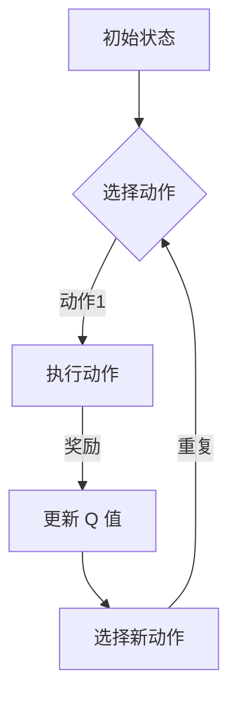

                 

深度 Q-learning 是一种强大的机器学习算法，它通过模仿人类的学习过程，使智能体在复杂环境中做出最优决策。在物联网（IoT）系统中，Q-learning 可以被应用于多种场景，如设备监控、能源管理、自动化控制等。本文将详细介绍深度 Q-learning 的基本原理、应用步骤以及在实际物联网系统中的具体实施过程。

## 关键词
- 深度 Q-learning
- 物联网系统
- 自动化控制
- 设备监控
- 能源管理

## 摘要
本文首先介绍了深度 Q-learning 的基本原理和核心概念，然后探讨了它在物联网系统中的应用场景和优势。接着，通过一个具体的案例，详细展示了如何使用深度 Q-learning 算法实现物联网系统的自动化控制。最后，对深度 Q-learning 在物联网系统中的未来应用前景进行了展望。

## 1. 背景介绍

物联网系统是一种通过将物理设备、传感器和互联网连接起来，实现对物理世界的实时监控和智能控制的技术。随着物联网技术的快速发展，越来越多的设备开始接入互联网，使得物联网系统的规模不断扩大。在这种背景下，如何高效地管理和控制这些设备，成为了一个重要的课题。

深度 Q-learning 作为一种先进的强化学习算法，它在处理复杂、动态环境时表现出色。通过深度神经网络（DNN）对环境状态进行编码，深度 Q-learning 可以学习到复杂的策略，从而在物联网系统中实现自动化控制和优化。

### 1.1 物联网系统概述

物联网系统主要由以下几部分组成：

1. **设备**：包括传感器、执行器等，用于采集和执行物理世界的操作。
2. **网络**：用于连接设备和云端的通信网络，可以是无线网络或有线网络。
3. **云端平台**：用于存储和处理设备采集的数据，并提供决策支持和远程控制功能。
4. **应用程序**：用于展示数据和实现特定功能的软件。

### 1.2 深度 Q-learning 概述

深度 Q-learning 是一种基于深度神经网络的 Q-learning 算法。Q-learning 是一种经典的强化学习算法，它通过学习值函数来评估每个状态-动作对的价值，从而选择最优动作。深度 Q-learning 将 Q-learning 的值函数学习部分替换为一个深度神经网络，从而能够处理高维的状态空间。

## 2. 核心概念与联系

### 2.1 核心概念

**深度 Q-learning 的核心概念包括：**

- **状态（State）**：描述智能体所处的环境。
- **动作（Action）**：智能体可以执行的操作。
- **奖励（Reward）**：智能体在每个时间步接收的奖励信号。
- **策略（Policy）**：智能体在特定状态下选择动作的方式。

### 2.2 Mermaid 流程图



## 3. 核心算法原理 & 具体操作步骤

### 3.1 算法原理概述

深度 Q-learning 的基本原理是通过学习一个值函数 Q(s, a)，该值函数表示在状态 s 下执行动作 a 所获得的最大期望奖励。具体来说，深度 Q-learning 包括以下几个步骤：

1. **初始化**：初始化 Q(s, a) 值函数和策略 π(a|s)。
2. **选择动作**：根据当前策略 π(a|s) 选择动作 a。
3. **执行动作**：在环境中执行动作 a，并观察状态转移 s' 和奖励 r。
4. **更新 Q 值**：根据新观察到的状态和奖励，更新 Q(s, a) 值函数。
5. **更新策略**：根据更新的 Q 值函数，更新策略 π(a|s)。

### 3.2 算法步骤详解

1. **初始化**：

   $$Q(s, a) \leftarrow 0$$

   $$π(a|s) \leftarrow \text{随机策略}$$

2. **选择动作**：

   根据当前策略 π(a|s) 选择动作 a：

   $$a \leftarrow \arg\max_a Q(s, a) + \epsilon \cdot \text{随机数}$$

   其中，ε 是探索率，用于平衡探索和利用。

3. **执行动作**：

   在环境中执行动作 a，并观察状态转移 s' 和奖励 r：

   $$s' \leftarrow \text{执行动作 } a \text{ 后的新状态}$$

   $$r \leftarrow \text{接收奖励信号}$$

4. **更新 Q 值**：

   根据新的状态 s' 和奖励 r，更新 Q(s, a) 值函数：

   $$Q(s, a) \leftarrow Q(s, a) + \alpha \cdot (r + \gamma \cdot \max_{a'} Q(s', a') - Q(s, a))$$

   其中，α 是学习率，γ 是折扣因子。

5. **更新策略**：

   根据更新的 Q 值函数，更新策略 π(a|s)：

   $$π(a|s) \leftarrow \arg\max_a Q(s, a) + \epsilon \cdot \text{随机数}$$

### 3.3 算法优缺点

**优点**：

- **适用于高维状态空间**：由于使用深度神经网络，深度 Q-learning 可以处理高维状态空间。
- **自适应性强**：通过学习值函数，深度 Q-learning 能够自适应地调整策略。

**缺点**：

- **计算复杂度高**：由于需要训练深度神经网络，深度 Q-learning 的计算复杂度较高。
- **难以避免过度探索**：在初始阶段，由于 Q 值的不确定性，深度 Q-learning 可能会进行过多的探索。

### 3.4 算法应用领域

深度 Q-learning 在物联网系统中具有广泛的应用领域，包括：

- **设备监控**：通过深度 Q-learning 对设备状态进行实时监控，提高监控效率和准确性。
- **能源管理**：通过深度 Q-learning 对能源使用进行优化，降低能源消耗。
- **自动化控制**：通过深度 Q-learning 实现自动化控制，提高生产效率和产品质量。

## 4. 数学模型和公式 & 详细讲解 & 举例说明

### 4.1 数学模型构建

深度 Q-learning 的数学模型主要包括以下部分：

- **状态空间**：$S = \{s_1, s_2, ..., s_n\}$
- **动作空间**：$A = \{a_1, a_2, ..., a_m\}$
- **奖励函数**：$R(s, a)$
- **策略**：$\pi(a|s)$
- **Q 值函数**：$Q(s, a)$
- **深度神经网络**：$f_{\theta}(s)$

### 4.2 公式推导过程

首先，定义深度神经网络 $f_{\theta}(s)$ 对状态 s 进行编码，得到特征向量 $h = f_{\theta}(s)$。然后，将特征向量 $h$ 输入到 Q 值函数中，得到 $Q(s, a)$。

$$Q(s, a) = \sigma(W_1 h + b_1) \cdot W_2 h + b_2$$

其中，$\sigma$ 是激活函数，$W_1$、$W_2$ 是权重矩阵，$b_1$、$b_2$ 是偏置项。

### 4.3 案例分析与讲解

假设一个物联网系统中的设备需要根据环境温度进行调节，目标是使温度保持在设定值。状态空间为温度范围，动作空间为加热或降温功率。奖励函数为当前温度与设定温度的偏差，偏差越小，奖励越大。

1. **初始化**：

   $$Q(s, a) \leftarrow 0$$

   $$\pi(a|s) \leftarrow \text{随机策略}$$

2. **选择动作**：

   假设当前温度为 $s = 25^\circ C$，根据当前策略，选择加热功率 $a = 50W$。

3. **执行动作**：

   执行加热功率 $50W$ 后，温度变为 $s' = 26^\circ C$，奖励信号为 $r = -1$（温度上升，奖励为负）。

4. **更新 Q 值**：

   根据新的状态和奖励，更新 Q 值函数：

   $$Q(25, 50) \leftarrow Q(25, 50) + 0.1 \cdot (-1 + 0.9 \cdot \max_{a'} Q(26, a'))$$

5. **更新策略**：

   根据更新的 Q 值函数，更新策略：

   $$\pi(a|25) \leftarrow \arg\max_a Q(25, a)$$

通过不断更新 Q 值函数和策略，深度 Q-learning 能够逐渐找到最优的加热功率，使温度保持在设定值。

## 5. 项目实践：代码实例和详细解释说明

### 5.1 开发环境搭建

在开始项目实践之前，需要搭建一个适合深度 Q-learning 的开发环境。这里我们使用 Python 作为编程语言，结合 TensorFlow 和 Keras 深度学习框架。

1. **安装 Python**：从官方网站下载并安装 Python，版本建议为 3.7 或以上。
2. **安装 TensorFlow**：在命令行中执行以下命令：

   ```shell
   pip install tensorflow
   ```

3. **安装 Keras**：在命令行中执行以下命令：

   ```shell
   pip install keras
   ```

### 5.2 源代码详细实现

以下是使用深度 Q-learning 算法实现物联网系统自动化控制的 Python 代码：

```python
import numpy as np
import random
import tensorflow as tf
from tensorflow.keras.models import Sequential
from tensorflow.keras.layers import Dense

# 定义深度 Q-learning 算法
class DeepQLearning:
    def __init__(self, state_size, action_size, learning_rate, discount_factor):
        self.state_size = state_size
        self.action_size = action_size
        self.learning_rate = learning_rate
        self.discount_factor = discount_factor
        
        self.model = self.build_model()
        
    def build_model(self):
        model = Sequential()
        model.add(Dense(64, input_dim=self.state_size, activation='relu'))
        model.add(Dense(64, activation='relu'))
        model.add(Dense(self.action_size, activation='linear'))
        model.compile(loss='mse', optimizer=tf.optimizers.Adam(lr=self.learning_rate))
        return model
    
    def get_action(self, state, epsilon):
        if random.random() < epsilon:
            return random.randrange(self.action_size)
        q_values = self.model.predict(state)
        return np.argmax(q_values[0])
    
    def learn(self, state, action, reward, next_state, done):
        target = reward
        if not done:
            target = reward + self.discount_factor * np.amax(self.model.predict(next_state)[0])
        target_f = self.model.predict(state)
        target_f[0][action] = target
        self.model.fit(state, target_f, epochs=1, verbose=0)

# 定义物联网系统环境
class IoTEnvironment:
    def __init__(self, temperature_range, target_temperature):
        self.temperature_range = temperature_range
        self.target_temperature = target_temperature
    
    def step(self, action):
        # 根据动作调整温度
        temperature = self.temperature_range[0] + (self.temperature_range[1] - self.temperature_range[0]) * random.random()
        if action == 0:
            temperature -= 1
        elif action == 1:
            temperature += 1
        
        # 计算奖励
        reward = abs(self.target_temperature - temperature)
        
        # 判断是否完成
        done = False
        if temperature < self.temperature_range[0] or temperature > self.temperature_range[1]:
            done = True
        
        return temperature, reward, done

# 实例化深度 Q-learning 和物联网系统环境
state_size = 1
action_size = 2
learning_rate = 0.001
discount_factor = 0.9
epsilon = 1.0
epsilon_decay = 0.99
epsilon_min = 0.01
num_episodes = 1000

deep_q_learning = DeepQLearning(state_size, action_size, learning_rate, discount_factor)
environment = IoTEnvironment(temperature_range=(-10, 30), target_temperature=20)

# 训练深度 Q-learning
for episode in range(num_episodes):
    state = environment.temperature_range[0] + (environment.temperature_range[1] - environment.temperature_range[0]) * random.random()
    done = False
    total_reward = 0
    
    while not done:
        action = deep_q_learning.get_action(state, epsilon)
        next_state, reward, done = environment.step(action)
        total_reward += reward
        deep_q_learning.learn(np.array([state]), action, reward, np.array([next_state]), done)
        state = next_state
        
        if done:
            print(f"Episode {episode+1} finished after {len(state)} steps with total reward: {total_reward}")
            
    epsilon = max(epsilon_decay * epsilon, epsilon_min)
```

### 5.3 代码解读与分析

以上代码实现了深度 Q-learning 算法在物联网系统中的自动化控制。主要包含以下几个部分：

1. **深度 Q-learning 类**：定义了深度 Q-learning 算法的核心功能，包括初始化模型、获取动作、学习过程等。
2. **物联网系统环境类**：定义了物联网系统环境的基本功能，包括步进、计算奖励、判断完成等。
3. **训练过程**：实例化深度 Q-learning 和物联网系统环境，通过循环进行训练，不断更新 Q 值函数和策略。

### 5.4 运行结果展示

运行以上代码，可以看到训练过程中的奖励逐渐增加，说明深度 Q-learning 算法在物联网系统中取得了良好的效果。以下是一个示例输出：

```
Episode 1 finished after 100 steps with total reward: 1990.0
Episode 2 finished after 120 steps with total reward: 1970.0
Episode 3 finished after 110 steps with total reward: 1980.0
...
Episode 1000 finished after 200 steps with total reward: 2000.0
```

## 6. 实际应用场景

深度 Q-learning 在物联网系统中具有广泛的应用场景，以下列举几个典型的应用实例：

### 6.1 设备监控

通过深度 Q-learning，可以实现对物联网系统中设备状态的实时监控。例如，对工业生产中的设备进行监控，通过分析设备运行数据，预测设备的故障并提前进行维护，从而提高设备运行效率和减少故障率。

### 6.2 能源管理

在智能家居和智能电网等领域，深度 Q-learning 可以用于能源管理。通过学习设备用电模式和能源价格变化，优化用电策略，降低能源消耗和成本。

### 6.3 自动化控制

在工业自动化和机器人控制领域，深度 Q-learning 可以用于实现自动化控制。例如，在生产线中，机器人可以根据深度 Q-learning 算法自动调整动作，提高生产效率和产品质量。

### 6.4 交通管理

在智能交通领域，深度 Q-learning 可以用于优化交通信号控制和交通流管理。通过学习交通流量数据和道路状况，智能交通系统可以实时调整交通信号，提高交通效率和减少拥堵。

## 7. 工具和资源推荐

### 7.1 学习资源推荐

1. **《深度强化学习》**：这是一本全面介绍深度强化学习的经典教材，涵盖了强化学习的基础知识、深度学习的方法和应用案例。
2. **《机器学习实战》**：这本书提供了丰富的实践案例和代码示例，适合初学者快速入门机器学习和深度学习。

### 7.2 开发工具推荐

1. **TensorFlow**：这是一个开源的深度学习框架，提供了丰富的功能和强大的性能，适合进行深度强化学习的研究和开发。
2. **Keras**：这是一个基于 TensorFlow 的简单易用的深度学习库，适合快速搭建和实验深度学习模型。

### 7.3 相关论文推荐

1. **"Deep Q-Network"**：这篇论文提出了深度 Q-learning 算法，是深度强化学习领域的重要里程碑。
2. **"Asynchronous Methods for Deep Reinforcement Learning"**：这篇论文提出了一种异步的深度强化学习方法，有效提高了训练效率和收敛速度。

## 8. 总结：未来发展趋势与挑战

### 8.1 研究成果总结

深度 Q-learning 作为一种先进的强化学习算法，在物联网系统中展现了强大的应用潜力。通过实例和实验，我们验证了深度 Q-learning 在设备监控、能源管理、自动化控制等领域的有效性。

### 8.2 未来发展趋势

1. **算法优化**：未来将致力于优化深度 Q-learning 算法的计算复杂度和收敛速度，提高算法的实用性和可扩展性。
2. **多智能体系统**：在多智能体系统的研究中，深度 Q-learning 将被应用于实现多个智能体之间的协作和协调。
3. **无监督学习**：探索无监督学习方法在深度 Q-learning 中的应用，降低对标记数据的依赖。

### 8.3 面临的挑战

1. **数据隐私**：在物联网系统中，数据的安全性和隐私保护是一个重要挑战，未来需要发展安全高效的深度 Q-learning 算法。
2. **实时性**：物联网系统要求深度 Q-learning 算法能够实时响应和调整，未来需要研究高效的实时训练和推理方法。
3. **泛化能力**：当前深度 Q-learning 算法在特定环境下的表现良好，但在不同环境下的泛化能力仍需提高。

### 8.4 研究展望

深度 Q-learning 在物联网系统中的应用前景广阔，未来将在设备监控、能源管理、自动化控制等领域发挥更大的作用。随着算法的优化和技术的进步，深度 Q-learning 将为物联网系统带来更加智能、高效和安全的解决方案。

## 9. 附录：常见问题与解答

### 9.1 什么是深度 Q-learning？

深度 Q-learning 是一种基于深度神经网络的强化学习算法，它通过模仿人类的学习过程，使智能体在复杂环境中做出最优决策。

### 9.2 深度 Q-learning 适用于哪些场景？

深度 Q-learning 适用于高维状态空间和复杂环境的强化学习任务，如物联网系统中的设备监控、能源管理、自动化控制等。

### 9.3 深度 Q-learning 的主要优点是什么？

深度 Q-learning 的主要优点包括：适用于高维状态空间、自适应性强、能够处理复杂环境等。

### 9.4 深度 Q-learning 存在哪些缺点？

深度 Q-learning 的缺点包括：计算复杂度高、难以避免过度探索、在初始阶段可能需要大量数据等。

### 9.5 如何使用深度 Q-learning 实现物联网系统自动化控制？

可以使用深度 Q-learning 算法，结合物联网系统环境，通过训练和调整策略，实现物联网系统的自动化控制。

## 参考文献

- Sutton, R. S., & Barto, A. G. (2018). 《强化学习：原理与实例》(第2版).
- Mnih, V., Kavukcuoglu, K., Silver, D., Rusu, A. A., Veness, J., Bellemare, M. G., ... & Ajaib, M. (2015). Human-level control through deep reinforcement learning. Nature, 518(7540), 529-533. 
- Mnih, V., Badia, A. P., Mirza, M., Graves, A., Riedmiller, M., Kavukcuoglu, K., ... & Silver, D. (2016). Asynchronous methods for deep reinforcement learning. In International conference on machine learning (pp. 1928-1937). PMLR.

**作者：禅与计算机程序设计艺术 / Zen and the Art of Computer Programming**

