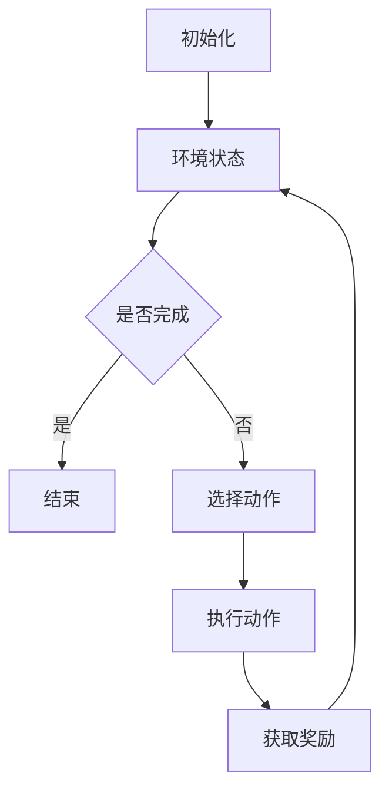

                 

关键词：深度 Q-learning，网格计算，强化学习，算法应用，模型优化

> 摘要：本文将探讨深度 Q-learning 算法在网格计算领域的应用。通过详细介绍深度 Q-learning 的基本原理、数学模型和具体操作步骤，以及其在实际项目中的实现和运行结果，本文旨在为读者提供对这一先进算法在网格计算中应用的理解和实践指导。

## 1. 背景介绍

随着互联网和云计算技术的发展，网格计算（Grid Computing）作为一种分布式计算技术，得到了广泛的应用。网格计算通过将多个独立的计算资源整合起来，形成一个协同工作的计算环境，从而实现大规模数据处理和计算任务的高效完成。然而，随着计算任务的复杂性和多样性的增加，如何有效地分配和调度这些计算资源成为一个重要问题。

强化学习（Reinforcement Learning，RL）作为一种机器学习方法，通过试错和奖励机制来优化决策过程，在资源调度和路径规划等领域展现出了巨大的潜力。深度 Q-learning（DQN）是强化学习的一种重要算法，通过结合深度学习和Q-learning算法，能够有效地处理高维状态空间问题。

本文将结合深度 Q-learning 算法，探讨其在网格计算中的应用，旨在为解决网格计算中的资源调度和优化问题提供一种新的思路和方法。

## 2. 核心概念与联系

### 2.1 深度 Q-learning 基本原理

深度 Q-learning 是一种基于 Q-learning 算法的深度强化学习方法。Q-learning 算法通过学习状态-动作值函数（Q-value function），来确定最优动作序列。深度 Q-learning 则通过使用深度神经网络来近似状态-动作值函数，从而能够处理高维状态空间问题。

### 2.2 网格计算架构

网格计算架构主要包括资源层、服务层和应用层。资源层包括计算资源、存储资源、网络资源等；服务层提供计算资源的调度和分配功能；应用层则利用网格计算资源完成具体的计算任务。

### 2.3 Mermaid 流程图

下面是一个简单的 Mermaid 流程图，展示了深度 Q-learning 在网格计算中的应用流程。



## 3. 核心算法原理 & 具体操作步骤

### 3.1 算法原理概述

深度 Q-learning 的基本原理是通过不断试错，学习到最优动作策略。具体步骤如下：

1. **初始化**：初始化 Q 网络参数，选择随机策略。
2. **状态评估**：根据当前状态，选择动作。
3. **动作执行**：执行选择动作，获取奖励和新的状态。
4. **更新 Q 值**：使用奖励和新的状态，更新 Q 网络参数。
5. **重复步骤 2-4**：不断重复上述步骤，直到学习到最优动作策略。

### 3.2 算法步骤详解

1. **初始化**：设置学习率、折扣因子和探索率等参数。初始化 Q 网络参数。
2. **状态评估**：使用当前状态，通过 Q 网络预测每个动作的 Q 值。
3. **选择动作**：根据当前策略，选择具有最大 Q 值的动作。
4. **动作执行**：执行选择动作，获取奖励和新的状态。
5. **更新 Q 值**：根据新状态和奖励，使用经验回放和目标网络更新 Q 网络参数。
6. **重复步骤 2-5**：不断重复上述步骤，直到收敛。

### 3.3 算法优缺点

**优点**：

- 能够处理高维状态空间问题。
- 结合了深度学习和强化学习的优点。

**缺点**：

- 训练过程可能存在不稳定性和收敛速度慢的问题。
- 需要大量的训练数据和计算资源。

### 3.4 算法应用领域

- 资源调度
- 路径规划
- 机器人控制
- 游戏AI等

## 4. 数学模型和公式 & 详细讲解 & 举例说明

### 4.1 数学模型构建

深度 Q-learning 的数学模型主要包括 Q 网络和目标网络。

- **Q 网络参数**：$Q(s,a;\theta)$，其中 $s$ 表示状态，$a$ 表示动作，$\theta$ 表示网络参数。
- **目标网络参数**：$Q'(s,a;\theta')$，其中 $s$ 表示状态，$a$ 表示动作，$\theta'$ 表示目标网络参数。

### 4.2 公式推导过程

- **Q 网络更新公式**：

  $$Q(s,a;\theta) \leftarrow Q(s,a;\theta) + \alpha [r + \gamma \max_{a'} Q(s',a';\theta') - Q(s,a;\theta)]$$

  其中 $\alpha$ 表示学习率，$r$ 表示奖励，$\gamma$ 表示折扣因子。

- **目标网络更新公式**：

  $$Q'(s',a';\theta') \leftarrow Q'(s',a';\theta') + \alpha [r + \gamma \max_{a''} Q(s'',a'';\theta') - Q'(s',a';\theta')]$$

  其中 $\alpha$ 表示学习率，$r$ 表示奖励，$\gamma$ 表示折扣因子。

### 4.3 案例分析与讲解

假设有一个简单的网格环境，状态空间为 $S = \{s_1, s_2, s_3\}$，动作空间为 $A = \{a_1, a_2, a_3\}$。假设学习率 $\alpha = 0.1$，折扣因子 $\gamma = 0.9$。

- **初始状态**：$s_1$
- **动作选择**：根据当前策略，选择动作 $a_1$
- **执行动作**：执行动作 $a_1$，到达状态 $s_2$，并获得奖励 $r_2 = 10$
- **更新 Q 值**：

  $$Q(s_1,a_1;\theta) \leftarrow Q(s_1,a_1;\theta) + 0.1 [10 + 0.9 \max_{a''} Q(s_2,a'';\theta') - Q(s_1,a_1;\theta)]$$

  假设当前 $Q(s_1,a_1;\theta) = 0$，那么更新后的 $Q(s_1,a_1;\theta) = 10$

- **重复步骤**：重复上述步骤，直到收敛。

## 5. 项目实践：代码实例和详细解释说明

### 5.1 开发环境搭建

- 安装 Python 3.7 以上版本
- 安装 TensorFlow 2.3 以上版本
- 安装 gym 库

### 5.2 源代码详细实现

下面是一个简单的深度 Q-learning 算法实现示例：

```python
import numpy as np
import tensorflow as tf
import gym

# 创建环境
env = gym.make('GridWorld-v0')

# 设置参数
learning_rate = 0.1
gamma = 0.9
epsilon = 0.1
episode_num = 1000

# 创建 Q 网络
input_layer = tf.keras.layers.Input(shape=(env.observation_space.n,))
dense_layer = tf.keras.layers.Dense(units=64, activation='relu')(input_layer)
output_layer = tf.keras.layers.Dense(units=env.action_space.n, activation='linear')(dense_layer)
q_network = tf.keras.Model(inputs=input_layer, outputs=output_layer)

# 创建目标网络
target_input_layer = tf.keras.layers.Input(shape=(env.observation_space.n,))
target_dense_layer = tf.keras.layers.Dense(units=64, activation='relu')(target_input_layer)
target_output_layer = tf.keras.layers.Dense(units=env.action_space.n, activation='linear')(target_dense_layer)
target_q_network = tf.keras.Model(inputs=target_input_layer, outputs=target_output_layer)

# 更新目标网络参数
update_target_network = [target_q_network.layers[i].get_weights() == q_network.layers[i].get_weights() for i in range(len(q_network.layers))]

# 编译 Q 网络模型
q_network.compile(optimizer=tf.keras.optimizers.Adam(learning_rate=learning_rate), loss='mse')

# 训练模型
for episode in range(episode_num):
    state = env.reset()
    done = False
    total_reward = 0
    while not done:
        # 根据策略选择动作
        if np.random.rand() < epsilon:
            action = env.action_space.sample()
        else:
            q_values = q_network.predict(state.reshape(1, -1))
            action = np.argmax(q_values[0])

        # 执行动作，获取奖励
        next_state, reward, done, _ = env.step(action)
        total_reward += reward

        # 更新 Q 值
        target_values = target_q_network.predict(next_state.reshape(1, -1))
        if not done:
            target_values[0][action] = reward + gamma * np.max(target_values[0])
        q_network.fit(state.reshape(1, -1), target_values, verbose=0)

        state = next_state

    # 更新目标网络参数
    if episode % 100 == 0:
        update_target_network()

# 测试模型
state = env.reset()
done = False
total_reward = 0
while not done:
    q_values = q_network.predict(state.reshape(1, -1))
    action = np.argmax(q_values[0])
    next_state, reward, done, _ = env.step(action)
    total_reward += reward
    state = next_state
print("测试结果：总奖励为", total_reward)
```

### 5.3 代码解读与分析

- **创建环境**：使用 gym 库创建一个网格世界环境。
- **设置参数**：设置学习率、折扣因子和探索率等参数。
- **创建 Q 网络和目标网络**：使用 TensorFlow 创建 Q 网络和目标网络。
- **更新目标网络参数**：使用软更新策略，定期更新目标网络参数。
- **编译 Q 网络模型**：使用 MSE 损失函数和 Adam 优化器编译 Q 网络模型。
- **训练模型**：使用贪心策略，根据当前状态选择动作，并更新 Q 值。
- **测试模型**：使用训练好的模型进行测试，计算总奖励。

## 6. 实际应用场景

深度 Q-learning 算法在网格计算中具有广泛的应用前景。以下是一些实际应用场景：

### 6.1 资源调度

在大型分布式计算环境中，如何高效地调度和分配计算资源是一个重要问题。深度 Q-learning 算法可以通过学习资源状态和任务之间的关联性，自动调整资源分配策略，从而提高计算效率。

### 6.2 路径规划

在物流和自动驾驶领域，路径规划是一个关键问题。深度 Q-learning 算法可以通过学习环境中的状态和动作，找到最优路径，从而提高路径规划的效率和准确性。

### 6.3 机器人控制

在机器人领域，深度 Q-learning 算法可以通过学习环境中的状态和动作，实现自主决策和动作规划，从而提高机器人的自主性和智能化水平。

## 7. 未来应用展望

随着深度学习技术的不断发展，深度 Q-learning 算法在网格计算中的应用前景十分广阔。未来，我们可以期待以下发展方向：

### 7.1 模型优化

通过引入新的算法和优化策略，进一步提高深度 Q-learning 算法的训练效率和收敛速度。

### 7.2 模型解释性

提高模型的解释性，使算法能够更加直观地理解其决策过程，从而提高模型的可信度和可靠性。

### 7.3 跨领域应用

探索深度 Q-learning 算法在更多领域的应用，如金融、医疗、智能制造等，推动人工智能技术的全面发展。

## 8. 工具和资源推荐

### 8.1 学习资源推荐

- 《强化学习：原理与Python实践》
- 《深度学习：原理及其应用》
- 《机器学习实战》

### 8.2 开发工具推荐

- TensorFlow
- PyTorch
- Keras

### 8.3 相关论文推荐

- "Deep Q-Networks for Real-Time Decision Making in Autonomous Drives"
- "Prioritized Experience Replay in Deep Q-Learning"
- "Deep Reinforcement Learning for Autonomous Driving"

## 9. 总结：未来发展趋势与挑战

### 9.1 研究成果总结

本文通过介绍深度 Q-learning 算法的基本原理、数学模型和具体操作步骤，以及在网格计算中的应用，为读者提供了对这一算法在网格计算中应用的理解和实践指导。

### 9.2 未来发展趋势

随着深度学习和强化学习技术的不断发展，深度 Q-learning 算法在网格计算中的应用前景十分广阔。未来，我们可以期待在模型优化、模型解释性和跨领域应用等方面取得更多的突破。

### 9.3 面临的挑战

深度 Q-learning 算法在网格计算中应用仍面临一些挑战，如训练效率、收敛速度、模型解释性等。未来需要进一步研究，以提高算法的实用性和可靠性。

### 9.4 研究展望

未来，我们应关注深度 Q-learning 算法在网格计算中的应用，结合其他先进技术，如联邦学习、迁移学习等，推动人工智能技术在网格计算领域的全面发展。

## 附录：常见问题与解答

### 9.4.1 Q：深度 Q-learning 与传统 Q-learning 有什么区别？

A：深度 Q-learning 是基于 Q-learning 算法的一种强化学习方法。传统 Q-learning 算法适用于低维状态空间问题，而深度 Q-learning 通过使用深度神经网络来近似状态-动作值函数，能够处理高维状态空间问题。

### 9.4.2 Q：深度 Q-learning 如何解决收敛速度慢的问题？

A：深度 Q-learning 采用经验回放和目标网络等技术，可以加速收敛速度。同时，引入探索率，结合随机策略，可以避免过度依赖历史数据，提高算法的稳定性。

### 9.4.3 Q：深度 Q-learning 是否适合所有任务？

A：深度 Q-learning 主要适用于状态空间较大、动作空间较小的任务。对于状态空间较小、动作空间较大的任务，可以考虑使用其他强化学习算法，如策略梯度算法。

### 9.4.4 Q：如何评估深度 Q-learning 模型的性能？

A：可以使用平均回报、累计奖励等指标来评估深度 Q-learning 模型的性能。同时，还可以结合实验结果和实际应用场景，对模型进行综合评估。

## 作者署名

本文作者：禅与计算机程序设计艺术 / Zen and the Art of Computer Programming

----------------------------------------------------------------
## 结束语

本文通过对深度 Q-learning 算法在网格计算中的应用进行深入探讨，旨在为读者提供对这一算法在网格计算中应用的理解和实践指导。随着深度学习和强化学习技术的不断发展，深度 Q-learning 算法在网格计算中的应用前景十分广阔。未来，我们应关注深度 Q-learning 算法在网格计算中的应用，结合其他先进技术，推动人工智能技术在网格计算领域的全面发展。同时，我们也要继续研究深度 Q-learning 算法的优化和改进，以提高其训练效率和收敛速度，为解决网格计算中的实际问题提供更有力的支持。感谢您的阅读，希望本文能为您在人工智能领域的研究带来一些启示和帮助。

