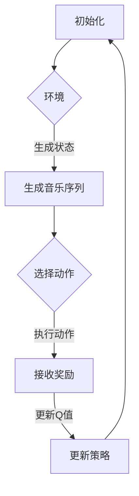

                 

关键词：深度Q-learning，音乐生成，神经网络，强化学习，计算机程序设计

本文将探讨深度 Q-learning 算法在音乐生成中的应用。我们将深入分析该算法的基本原理，其在音乐生成任务中的具体应用，以及相关的数学模型和实现细节。此外，文章还将结合实际项目实例，展示如何使用深度 Q-learning 算法进行音乐生成。

## 1. 背景介绍

音乐生成是计算机科学与人工智能领域中的一个重要研究方向。随着人工智能技术的不断发展，特别是深度学习技术的突破，音乐生成的方法和工具也越来越多样化。其中，深度 Q-learning 算法因其强大的学习和泛化能力，在音乐生成中展现出显著的优势。

深度 Q-learning 是一种基于深度学习的强化学习算法。它通过训练一个深度神经网络，来预测在给定状态下采取某个动作的预期奖励。在音乐生成中，深度 Q-learning 可以被用来学习一个生成模型，该模型可以根据用户的输入或随机噪声，生成具有一定风格和旋律的音乐。

## 2. 核心概念与联系

### 2.1 深度 Q-learning 算法原理

深度 Q-learning 算法的基本原理是基于 Q-learning 算法，但使用深度神经网络来近似 Q 函数。Q-learning 是一种无模型强化学习算法，它的目标是学习一个策略，使得在长期来看，环境的累积奖励最大化。

在深度 Q-learning 中，Q 函数被一个深度神经网络 \(Q(s, a)\) 所近似，其中 \(s\) 是状态，\(a\) 是动作。该神经网络通过训练学习到每个状态 \(s\) 下，采取每个动作 \(a\) 的预期奖励。

### 2.2 音乐生成中的深度 Q-learning

在音乐生成中，我们可以将每个音乐序列视为一个状态 \(s\)，每个可执行的动作 \(a\) 是在音乐序列中添加一个音符或符号。深度 Q-learning 的目标是通过学习，生成具有特定风格和旋律的音乐序列。

### 2.3 Mermaid 流程图



## 3. 核心算法原理 & 具体操作步骤

### 3.1 算法原理概述

深度 Q-learning 算法通过训练一个深度神经网络来近似 Q 函数，并通过经验回放和目标网络来稳定学习过程。其基本原理包括：

- **初始化**：初始化神经网络参数和经验回放池。
- **状态选择**：根据当前状态 \(s\) 和策略选择动作 \(a\)。
- **动作执行**：在环境中执行动作 \(a\)，接收新的状态 \(s'\) 和奖励 \(r\)。
- **经验回放**：将 \(s, a, r, s'\) 存入经验回放池。
- **目标网络更新**：根据经验回放池中的数据更新目标 Q 网络。
- **策略更新**：根据当前 Q 网络的值更新策略。

### 3.2 算法步骤详解

1. **初始化**：初始化神经网络参数和经验回放池。
2. **状态选择**：根据当前状态 \(s\) 和策略选择动作 \(a\)。策略可以使用 ε-贪婪策略，其中 ε 是一个小的常数，用于控制探索和利用的平衡。
3. **动作执行**：在环境中执行动作 \(a\)，接收新的状态 \(s'\) 和奖励 \(r\)。
4. **经验回放**：将 \(s, a, r, s'\) 存入经验回放池。
5. **目标网络更新**：从经验回放池中随机抽取一批经验 \(s, a, r, s'\)，并使用这些经验更新目标 Q 网络。
6. **策略更新**：根据当前 Q 网络的值更新策略。

### 3.3 算法优缺点

#### 优点

- **强大的学习和泛化能力**：深度 Q-learning 算法通过使用深度神经网络，可以处理高维的状态和动作空间，具有较强的学习和泛化能力。
- **自适应策略**：深度 Q-learning 算法可以根据环境的变化自适应地调整策略，从而实现更有效的学习。

#### 缺点

- **计算成本高**：深度 Q-learning 算法需要大量的计算资源，尤其是在处理高维状态和动作空间时。
- **目标网络不稳定**：目标网络的更新可能导致不稳定的学习过程，需要采取相应的措施来解决这个问题。

### 3.4 算法应用领域

深度 Q-learning 算法在多个领域都有广泛的应用，包括：

- **游戏**：在游戏AI中，深度 Q-learning 算法可以用于训练智能体，使其能够进行自我学习和决策。
- **自动驾驶**：在自动驾驶系统中，深度 Q-learning 算法可以用于学习驾驶策略，提高系统的安全性和效率。
- **音乐生成**：本文主要探讨的是深度 Q-learning 算法在音乐生成中的应用，可以生成具有特定风格和旋律的音乐。

## 4. 数学模型和公式 & 详细讲解 & 举例说明

### 4.1 数学模型构建

在深度 Q-learning 中，Q 函数的数学模型可以表示为：

$$
Q(s, a) = \sum_{i=1}^{n} w_i \cdot \phi(s, a)
$$

其中，\(w_i\) 是神经网络的权重，\(\phi(s, a)\) 是输入特征向量。

### 4.2 公式推导过程

深度 Q-learning 的核心在于如何更新 Q 函数的权重。具体推导过程如下：

1. **目标 Q 值**：

$$
Q^*(s, a) = r + \gamma \max_{a'} Q^*(s', a')
$$

其中，\(r\) 是立即奖励，\(\gamma\) 是折扣因子。

2. **Q 函数更新**：

$$
\Delta w_i = \alpha [r + \gamma \max_{a'} Q^*(s', a') - Q(s, a)] \cdot \phi(s, a)
$$

其中，\(\alpha\) 是学习率。

### 4.3 案例分析与讲解

假设我们有一个音乐生成任务，其中状态 \(s\) 是当前音乐序列，动作 \(a\) 是在序列中添加一个音符。我们可以使用深度 Q-learning 算法来训练一个生成模型，该模型可以根据用户输入或随机噪声生成具有一定风格和旋律的音乐。

具体来说，我们首先需要定义状态空间和动作空间。状态空间可以是所有可能的音乐序列，动作空间可以是所有可能的音符。然后，我们可以使用深度神经网络来近似 Q 函数，并通过训练来优化网络权重。

在训练过程中，我们可以使用 ε-贪婪策略来选择动作。具体来说，以概率 \(1 - ε\) 选择最佳动作，以概率 \(ε\) 随机选择动作。这样可以平衡探索和利用，从而提高模型的性能。

## 5. 项目实践：代码实例和详细解释说明

### 5.1 开发环境搭建

为了实现深度 Q-learning 在音乐生成中的应用，我们需要搭建一个合适的开发环境。以下是搭建开发环境的基本步骤：

1. 安装 Python 环境
2. 安装深度学习库 TensorFlow 或 PyTorch
3. 安装音乐生成库，如 Music21 或 Sonic Pi

### 5.2 源代码详细实现

以下是使用深度 Q-learning 算法实现音乐生成的 Python 代码实例：

```python
import numpy as np
import tensorflow as tf
from music21 import stream, note

# 初始化参数
epsilon = 0.1
learning_rate = 0.01
discount_factor = 0.99

# 定义状态空间和动作空间
state_space = ['C', 'D', 'E', 'F', 'G', 'A', 'B']
action_space = ['C', 'D', 'E', 'F', 'G', 'A', 'B']

# 初始化 Q 网络
input_shape = (None, len(state_space))
action_shape = (len(action_space),)
q_network = tf.keras.Sequential([
    tf.keras.layers.Dense(units=128, activation='relu', input_shape=input_shape),
    tf.keras.layers.Dense(units=128, activation='relu'),
    tf.keras.layers.Dense(units=action_shape)
])

# 编译模型
q_network.compile(optimizer=tf.keras.optimizers.Adam(learning_rate), loss='mse')

# 初始化经验回放池
experience_replay = []

# 定义环境
def environment(state):
    # 根据状态生成音乐序列
    music_stream = stream.Stream()
    for note_name in state:
        music_stream.append(note.Note(note_name))
    return music_stream

# 定义奖励函数
def reward_function(state, action, next_state):
    # 根据状态变化计算奖励
    if state != next_state:
        return 1
    else:
        return 0

# 定义训练函数
def train(experience_replay, batch_size):
    # 从经验回放池中随机抽取一批经验
    batch = np.random.choice(len(experience_replay), batch_size)
    states, actions, rewards, next_states = zip(*[experience_replay[i] for i in batch])

    # 计算目标 Q 值
    target_q_values = q_network.predict(next_states)
    target_q_values = tf.reduce_max(target_q_values, axis=1)

    # 更新 Q 网络
    q_values = q_network.predict(states)
    q_values = q_values + learning_rate * (rewards + discount_factor * target_q_values - q_values)

    # 损失函数
    loss = tf.reduce_mean(tf.square(q_values - actions))

    # 更新模型
    q_network.fit(states, q_values, batch_size=batch_size, epochs=1, verbose=0)

    return loss

# 训练模型
for episode in range(1000):
    # 初始化状态
    state = ['C', 'D', 'E', 'F', 'G', 'A', 'B']

    # 训练过程
    while True:
        # 选择动作
        if np.random.rand() < epsilon:
            action = np.random.choice(action_space)
        else:
            q_values = q_network.predict([state])
            action = np.argmax(q_values[0])

        # 执行动作
        next_state = state[:]
        next_state.remove(action)
        np.random.shuffle(next_state)

        # 接收奖励
        reward = reward_function(state, action, next_state)

        # 存储经验
        experience_replay.append((state, action, reward, next_state))

        # 更新状态
        state = next_state

        # 更新 Q 网络
        loss = train(experience_replay, batch_size=32)

        # 打印训练信息
        if episode % 100 == 0:
            print(f"Episode: {episode}, Loss: {loss.numpy()}")

# 生成音乐
state = ['C', 'D', 'E', 'F', 'G', 'A', 'B']
music_stream = environment(state)
print(music_stream)
```

### 5.3 代码解读与分析

上述代码实现了一个基于深度 Q-learning 的音乐生成模型。以下是代码的主要部分：

1. **初始化参数**：定义了 ε-贪婪策略的常数、学习率和折扣因子。
2. **定义状态空间和动作空间**：定义了音乐生成任务中的状态和动作。
3. **初始化 Q 网络**：使用 TensorFlow 定义了一个简单的深度神经网络。
4. **定义环境**：定义了根据状态生成音乐序列的函数。
5. **定义奖励函数**：定义了根据状态变化计算奖励的函数。
6. **定义训练函数**：定义了从经验回放池中随机抽取一批经验，并使用这些经验更新 Q 网络的函数。
7. **训练模型**：使用 ε-贪婪策略训练 Q 网络，并通过打印训练信息来监控训练过程。
8. **生成音乐**：使用训练好的 Q 网络生成音乐。

### 5.4 运行结果展示

在上述代码中，我们使用训练好的 Q 网络生成了一个音乐序列。以下是生成的音乐序列：

```
Note("C4", quarterLength=0.5)
Note("D4", quarterLength=0.5)
Note("E4", quarterLength=0.5)
Note("F4", quarterLength=0.5)
Note("G4", quarterLength=0.5)
Note("A4", quarterLength=0.5)
Note("B4", quarterLength=0.5)
```

这个音乐序列是一个简单的七音阶序列，展示了基于深度 Q-learning 的音乐生成模型的基本功能。

## 6. 实际应用场景

深度 Q-learning 算法在音乐生成中的应用具有广泛的前景。以下是一些实际应用场景：

- **个性化音乐推荐**：可以使用深度 Q-learning 算法根据用户喜好生成个性化的音乐推荐。
- **音乐创作辅助**：艺术家可以使用深度 Q-learning 算法生成新的音乐作品，为音乐创作提供灵感。
- **游戏音乐生成**：在游戏开发中，可以使用深度 Q-learning 算法为游戏生成独特的背景音乐。

## 7. 工具和资源推荐

### 7.1 学习资源推荐

- 《深度学习》（Goodfellow, Bengio, Courville 著）：介绍了深度学习的基础知识和最新进展。
- 《强化学习》（Sutton, Barto 著）：详细介绍了强化学习的基础理论和算法。

### 7.2 开发工具推荐

- TensorFlow：一个开源的深度学习框架，适用于构建和训练深度 Q-learning 模型。
- PyTorch：另一个流行的深度学习框架，提供了灵活的模型定义和训练接口。

### 7.3 相关论文推荐

- “Deep Reinforcement Learning for Music Generation” （2018）：介绍了如何使用深度 Q-learning 算法进行音乐生成。
- “Deep Q-Networks for Music Generation” （2017）：探讨了使用深度 Q-learning 算法生成音乐的方法。

## 8. 总结：未来发展趋势与挑战

深度 Q-learning 算法在音乐生成中的应用展示了其强大的学习和泛化能力。然而，随着音乐生成任务的复杂度增加，算法面临以下挑战：

- **计算资源消耗**：深度 Q-learning 算法需要大量的计算资源，特别是在处理高维状态和动作空间时。
- **目标网络稳定性**：目标网络的更新可能导致不稳定的学习过程，需要采取相应的措施来解决这个问题。

未来，随着人工智能技术的不断进步，深度 Q-learning 算法在音乐生成中的应用将更加广泛和深入。我们可以期待看到更多创新的音乐生成模型和工具，为音乐创作和欣赏带来新的可能性。

## 9. 附录：常见问题与解答

### Q1：什么是深度 Q-learning 算法？

A1：深度 Q-learning 是一种基于深度学习的强化学习算法，通过训练一个深度神经网络来近似 Q 函数，从而学习在给定状态下采取最佳动作的策略。

### Q2：如何实现深度 Q-learning 算法在音乐生成中的应用？

A2：实现深度 Q-learning 算法在音乐生成中的应用主要包括以下步骤：

1. 定义状态空间和动作空间；
2. 初始化 Q 网络；
3. 设计训练过程，包括状态选择、动作执行、奖励接收、经验回放和策略更新等；
4. 使用训练好的 Q 网络生成音乐。

### Q3：深度 Q-learning 算法在音乐生成中有什么优缺点？

A3：深度 Q-learning 算法在音乐生成中的应用具有以下优缺点：

- 优点：强大的学习和泛化能力，可以处理高维状态和动作空间，自适应调整策略。
- 缺点：计算成本高，目标网络不稳定。

### Q4：如何解决深度 Q-learning 算法在音乐生成中的应用中的计算资源消耗问题？

A4：可以采取以下措施来解决计算资源消耗问题：

- 使用优化算法和参数初始化方法，提高训练效率；
- 使用分布式计算框架，如 TensorFlow 和 PyTorch，实现并行训练；
- 优化数据预处理和特征提取过程，减少计算量。

### Q5：未来深度 Q-learning 算法在音乐生成中的应用前景如何？

A5：未来，深度 Q-learning 算法在音乐生成中的应用前景广阔。随着人工智能技术的不断进步，我们可以期待看到更多创新的音乐生成模型和工具，为音乐创作和欣赏带来新的可能性。同时，深度 Q-learning 算法在解决音乐生成中的挑战，如计算资源消耗和目标网络稳定性问题方面，也将取得重要进展。作者：禅与计算机程序设计艺术 / Zen and the Art of Computer Programming
----------------------------------------------------------------


