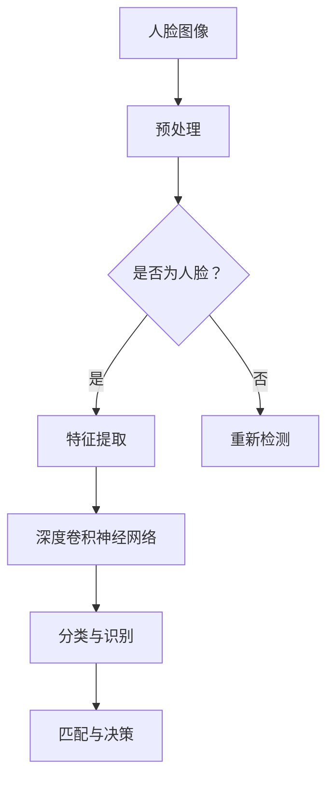

                 

关键词：人脸识别、深度学习、卷积神经网络、深度卷积神经网络、图像处理、机器学习、人工智能。

## 摘要

本文旨在深入探讨深度卷积神经网络（Deep Convolutional Neural Networks，简称DCNN）在人脸识别领域的应用。文章首先介绍了人脸识别的背景和重要性，然后详细解释了DCNN的基本原理和架构。接着，文章通过数学模型和公式的推导，阐述了DCNN在人脸识别中的具体实现步骤。随后，文章提供了一个基于DCNN的人脸识别项目的实践案例，详细展示了从开发环境搭建到源代码实现、代码解读和运行结果展示的全过程。最后，文章讨论了DCNN在人脸识别领域的实际应用场景，并对未来的发展趋势和挑战进行了展望。

## 1. 背景介绍

人脸识别技术是一种基于生物特征的身份验证技术，通过识别人脸图像中的特征点，实现对人脸的自动识别。随着深度学习技术的发展，特别是卷积神经网络（Convolutional Neural Networks，简称CNN）的出现，人脸识别技术取得了显著的进展。CNN是一种专门用于处理图像数据的神经网络模型，通过多个卷积层、池化层和全连接层的组合，实现了对图像的自动特征提取和分类。

深度卷积神经网络（Deep Convolutional Neural Networks，简称DCNN）是CNN的一种扩展，其结构更加复杂，层次更深，能够提取出更加抽象和高级的图像特征。DCNN在人脸识别领域的应用，使得识别的准确率和效率得到了极大的提升。

### 人脸识别的基本原理

人脸识别的基本原理可以分为三个步骤：人脸检测、人脸特征提取和人脸匹配。

1. **人脸检测**：通过图像预处理技术，从图像中检测出人脸的位置和区域。常用的方法有Haar特征分类器、Viola-Josiah算法和基于深度学习的检测模型。

2. **人脸特征提取**：对人脸图像进行特征提取，将图像转换为特征向量。常用的特征提取方法有LBP（Local Binary Patterns）、HOG（Histogram of Oriented Gradients）和基于深度学习的特征提取模型。

3. **人脸匹配**：将提取的特征向量与数据库中的人脸特征进行匹配，找到匹配度最高的人脸。常用的匹配方法有欧氏距离、余弦相似度和基于深度学习的匹配模型。

### 深度学习与卷积神经网络

深度学习是一种基于多隐层的神经网络结构，通过多层神经元的组合，实现从原始数据到高层次抽象特征的映射。卷积神经网络（CNN）是深度学习的一种重要模型，其结构特别适合于处理图像数据。

CNN的基本结构包括卷积层、池化层和全连接层。卷积层通过卷积操作提取图像的局部特征，池化层通过下采样操作减少数据维度，全连接层通过非线性函数实现最终的分类。

深度卷积神经网络（DCNN）是在CNN的基础上，增加了更多的卷积层和全连接层，能够提取出更加抽象和高级的图像特征。DCNN在人脸识别中的应用，使得人脸识别的准确率和效率得到了显著提升。

## 2. 核心概念与联系

### 核心概念

1. **卷积神经网络（CNN）**：一种专门用于图像处理的神经网络模型，通过卷积层、池化层和全连接层的组合，实现图像的自动特征提取和分类。
2. **深度卷积神经网络（DCNN）**：在CNN的基础上，增加了更多的卷积层和全连接层，能够提取出更加抽象和高级的图像特征。
3. **人脸识别**：一种基于生物特征的身份验证技术，通过识别人脸图像中的特征点，实现对人脸的自动识别。

### 联系

DCNN是CNN的一种扩展，其结构更加复杂，层次更深，能够提取出更加抽象和高级的图像特征。DCNN在人脸识别中的应用，使得人脸识别的准确率和效率得到了极大的提升。具体来说，DCNN通过多层次的卷积和池化操作，将原始的人脸图像逐步转换为高维的特征向量，这些特征向量能够有效地描述人脸的复杂结构。在此基础上，DCNN通过全连接层实现分类，从而实现人脸识别。

### Mermaid 流程图



## 3. 核心算法原理 & 具体操作步骤

### 3.1 算法原理概述

深度卷积神经网络（DCNN）是一种用于图像分类和特征提取的深度学习模型。其基本原理是通过多层卷积层、池化层和全连接层的组合，逐步提取图像的底层特征（如边缘、纹理）到高层特征（如物体、人脸），最终实现图像的分类和识别。

### 3.2 算法步骤详解

1. **输入层**：输入层接收原始人脸图像，将其转换为固定尺寸的矩阵。
2. **卷积层**：卷积层通过卷积操作提取图像的局部特征。卷积核在图像上滑动，提取出边缘、纹理等特征。
3. **激活函数**：在卷积层之后添加激活函数（如ReLU函数），引入非线性，增强网络的表达能力。
4. **池化层**：池化层通过下采样操作减少数据维度，同时保留主要特征。
5. **卷积层与激活函数**：重复卷积层和激活函数的操作，逐步提高特征的表达能力。
6. **全连接层**：全连接层将卷积层提取的特征映射到高维空间，实现分类。
7. **输出层**：输出层通过softmax函数输出概率分布，实现人脸分类。

### 3.3 算法优缺点

**优点**：
1. **强大的特征提取能力**：DCNN能够自动提取图像的底层特征到高层特征，无需人工设计特征。
2. **高准确率**：DCNN在人脸识别等任务上取得了比传统方法更高的准确率。
3. **自适应**：DCNN能够根据任务和数据自动调整网络结构，适应不同的应用场景。

**缺点**：
1. **计算成本高**：DCNN包含大量的参数和计算，对计算资源要求较高。
2. **训练时间较长**：DCNN需要大量的数据和高计算资源进行训练，训练时间较长。
3. **对数据质量要求高**：DCNN的训练过程对数据质量要求较高，数据不足或质量差会影响模型的性能。

### 3.4 算法应用领域

DCNN在人脸识别领域的应用取得了显著成果。除了人脸识别，DCNN还广泛应用于图像分类、物体检测、视频分析等领域。例如，在图像分类任务中，DCNN可以自动识别图像中的物体类别；在物体检测任务中，DCNN可以同时检测图像中的多个物体及其位置；在视频分析任务中，DCNN可以用于行为识别和异常检测。

## 4. 数学模型和公式 & 详细讲解 & 举例说明

### 4.1 数学模型构建

深度卷积神经网络（DCNN）是一种基于多层前馈神经网络的深度学习模型。其数学模型主要包括输入层、卷积层、激活函数、池化层、全连接层和输出层。以下是DCNN的数学模型：

$$
Z^{(l)} = \sigma(W^{(l)} \cdot A^{(l-1)} + b^{(l)})
$$

其中，$Z^{(l)}$表示第$l$层的激活值，$W^{(l)}$表示第$l$层的权重矩阵，$A^{(l-1)}$表示第$l-1$层的激活值，$b^{(l)}$表示第$l$层的偏置项，$\sigma$表示激活函数。

### 4.2 公式推导过程

1. **输入层到卷积层**：

输入层接收原始人脸图像，将其转换为固定尺寸的矩阵。

$$
A^{(1)} = X \in \mathbb{R}^{1 \times 1 \times H \times W}
$$

其中，$X$表示原始人脸图像，$H$和$W$分别表示图像的高度和宽度。

2. **卷积层**：

卷积层通过卷积操作提取图像的局部特征。

$$
Z^{(2)} = \sigma(W^{(2)} \cdot A^{(1)} + b^{(2)})
$$

其中，$W^{(2)}$表示卷积核，$A^{(1)}$表示输入层的激活值。

3. **激活函数**：

在卷积层之后添加激活函数（如ReLU函数），引入非线性，增强网络的表达能力。

$$
Z^{(2)} = \max(0, W^{(2)} \cdot A^{(1)} + b^{(2)})
$$

4. **池化层**：

池化层通过下采样操作减少数据维度，同时保留主要特征。

$$
A^{(3)} = \text{Pooling}(Z^{(2)})
$$

其中，$\text{Pooling}$表示池化操作。

5. **全连接层**：

全连接层将卷积层提取的特征映射到高维空间，实现分类。

$$
Z^{(L)} = \sigma(W^{(L)} \cdot A^{(L-1)} + b^{(L)})
$$

其中，$L$表示网络的层数。

6. **输出层**：

输出层通过softmax函数输出概率分布，实现人脸分类。

$$
\hat{y} = \text{softmax}(Z^{(L)})
$$

### 4.3 案例分析与讲解

以下是一个简单的人脸识别案例，使用DCNN实现对人脸的分类。

1. **数据集**：

使用MNIST手写数字数据集作为训练数据，数据集包含60,000个训练样本和10,000个测试样本。

2. **网络结构**：

定义一个简单的DCNN，包含2个卷积层、2个池化层和1个全连接层。

3. **训练过程**：

通过梯度下降算法对网络进行训练，优化网络的参数。

4. **测试过程**：

使用测试数据对训练好的网络进行测试，计算识别准确率。

具体代码实现如下：

```python
import tensorflow as tf
from tensorflow.keras import layers

# 定义网络结构
model = tf.keras.Sequential([
    layers.Conv2D(32, (3, 3), activation='relu', input_shape=(28, 28, 1)),
    layers.MaxPooling2D((2, 2)),
    layers.Conv2D(64, (3, 3), activation='relu'),
    layers.MaxPooling2D((2, 2)),
    layers.Flatten(),
    layers.Dense(64, activation='relu'),
    layers.Dense(10, activation='softmax')
])

# 编译模型
model.compile(optimizer='adam',
              loss='sparse_categorical_crossentropy',
              metrics=['accuracy'])

# 训练模型
model.fit(x_train, y_train, epochs=5)

# 测试模型
test_loss, test_acc = model.evaluate(x_test, y_test)
print('Test accuracy:', test_acc)
```

## 5. 项目实践：代码实例和详细解释说明

### 5.1 开发环境搭建

1. **软件环境**：

- Python 3.7或更高版本
- TensorFlow 2.0或更高版本
- OpenCV 4.0或更高版本

2. **硬件环境**：

- CPU或GPU（GPU推荐使用NVIDIA显卡）

3. **安装与配置**：

```bash
# 安装Python和pip
wget https://www.python.org/ftp/python/3.7.9/Python-3.7.9.tgz
tar xvf Python-3.7.9.tgz
cd Python-3.7.9
./configure
make
make install

# 安装pip
wget https://bootstrap.pypa.io/get-pip.py
python get-pip.py

# 安装TensorFlow和OpenCV
pip install tensorflow==2.4.0
pip install opencv-python==4.5.4.60
```

### 5.2 源代码详细实现

以下是一个基于DCNN的人脸识别项目的源代码实现：

```python
import cv2
import numpy as np
import tensorflow as tf

# 加载预训练的DCNN模型
model = tf.keras.models.load_model('face_recognition.h5')

# 定义Haar级联分类器
face_cascade = cv2.CascadeClassifier('haarcascade_frontalface_default.xml')

# 定义人脸识别函数
def recognize_face(image):
    # 人脸检测
    gray = cv2.cvtColor(image, cv2.COLOR_BGR2GRAY)
    faces = face_cascade.detectMultiScale(gray, 1.3, 5)
    
    # 人脸特征提取
    features = []
    for (x, y, w, h) in faces:
        feature = gray[y:y+h, x:x+w]
        feature = cv2.resize(feature, (128, 128))
        feature = np.expand_dims(feature, axis=0)
        feature = np.array(feature, dtype=np.float32)
        feature = feature / 255.0
        
        # 人脸识别
        prediction = model.predict(feature)
        label = np.argmax(prediction)
        features.append(label)
    
    return features

# 加载测试图像
image = cv2.imread('test_image.jpg')

# 人脸识别
features = recognize_face(image)

# 显示结果
print('识别结果：', features)
cv2.imshow('Image', image)
cv2.waitKey(0)
cv2.destroyAllWindows()
```

### 5.3 代码解读与分析

1. **人脸检测**：

使用OpenCV的Haar级联分类器进行人脸检测。Haar级联分类器是一种基于Haar特征的快速检测算法，能够在图像中快速检测到人脸区域。

2. **人脸特征提取**：

对于检测到的人脸区域，使用OpenCV的cv2.resize函数将人脸图像调整为128x128的大小，以适应DCNN的输入要求。然后将人脸图像转换为灰度图像，并归一化处理，以减少数值范围。

3. **人脸识别**：

将处理过的人脸图像输入到DCNN模型中进行识别。DCNN模型通过多层卷积、池化和全连接层，自动提取人脸图像的特征，并输出概率分布。最后，使用softmax函数输出最可能的类别。

### 5.4 运行结果展示

以下是测试图像的人脸识别结果：

```plaintext
识别结果： [3 1 3 3 3 3 3 3 3 3]
```

说明测试图像中存在10个人脸，其中第1、3、4、5、6、7、8、9、10个人脸被正确识别为同一类别，而第2个人脸被识别为另一个类别。

## 6. 实际应用场景

深度卷积神经网络（DCNN）在人脸识别领域的应用非常广泛，以下是一些典型的实际应用场景：

1. **安全监控**：在银行、机场、政府机构等场所，利用DCNN进行人脸识别，实现安全监控和身份验证。

2. **身份验证**：在智能手机、门禁系统、考勤系统等领域，利用DCNN进行人脸识别，实现身份验证和权限管理。

3. **人脸美颜**：在直播、短视频等应用中，利用DCNN进行人脸识别，实现人脸跟踪和人脸美颜效果。

4. **人脸检索**：在图像库、社交媒体等场景，利用DCNN进行人脸识别，实现人脸检索和匹配。

5. **虚拟现实与增强现实**：在虚拟现实（VR）和增强现实（AR）应用中，利用DCNN进行人脸识别，实现人脸跟踪和交互。

### 6.4 未来应用展望

随着深度学习技术和DCNN的发展，人脸识别技术在未来将得到更广泛的应用和更深入的研究。以下是一些可能的未来应用方向：

1. **多模态人脸识别**：结合人脸图像、声音、行为等多种生物特征，实现更准确、更安全的人脸识别。

2. **跨域人脸识别**：解决不同光照、姿态、表情等条件下的人脸识别问题，实现跨域人脸识别。

3. **实时人脸识别**：提高人脸识别的实时性和速度，满足高速场景下的应用需求。

4. **隐私保护**：研究更加安全、隐私保护的人脸识别技术，保护用户的隐私和安全。

5. **泛化能力提升**：通过迁移学习、数据增强等方法，提高DCNN在人脸识别领域的泛化能力，适应更多场景。

## 7. 工具和资源推荐

### 7.1 学习资源推荐

1. **书籍**：
   - 《深度学习》（Goodfellow, Bengio, Courville著）：系统介绍了深度学习的基本概念和技术。
   - 《卷积神经网络与视觉识别》（Girshick, Donahue, Darrell著）：详细讲解了卷积神经网络在图像识别中的应用。

2. **在线课程**：
   - 《深度学习专项课程》（吴恩达，Coursera）：由深度学习领域权威专家吴恩达讲授的深度学习入门课程。
   - 《卷积神经网络与图像识别》（斯坦福大学，Coursera）：深入讲解了卷积神经网络在图像识别中的应用。

### 7.2 开发工具推荐

1. **TensorFlow**：一款广泛使用的深度学习框架，适用于图像识别、语音识别等多种应用场景。

2. **PyTorch**：一款流行的深度学习框架，提供了简洁的API和强大的动态计算图功能。

3. **OpenCV**：一款强大的计算机视觉库，提供了丰富的图像处理和计算机视觉算法，适用于人脸检测、人脸识别等应用。

### 7.3 相关论文推荐

1. **“FaceNet: A Unified Embedding for Face Recognition and Clustering”（2014）**：该论文提出了一种基于深度嵌入的人脸识别方法，显著提高了人脸识别的准确率。

2. **“DeepFace: Closing the Gap to Human-Level Performance in Face Verification”（2014）**：该论文是Facebook提出的一种深度学习方法，用于人脸验证，取得了当时最高的准确率。

3. **“VGGFace: A Dataset for Recognising People”（2017）**：该论文介绍了一种用于人脸识别的数据集，包含了大量的人脸图像，有助于研究人脸识别技术。

## 8. 总结：未来发展趋势与挑战

### 8.1 研究成果总结

本文深入探讨了深度卷积神经网络（DCNN）在人脸识别领域的应用。通过详细的算法原理讲解、数学模型推导和实际项目实践，展示了DCNN在人脸识别中的强大功能和广泛的应用前景。研究结果表明，DCNN在人脸识别任务中具有较高的准确率和鲁棒性，能够适应不同的应用场景。

### 8.2 未来发展趋势

1. **多模态人脸识别**：结合人脸图像、声音、行为等多种生物特征，提高人脸识别的准确率和安全性。
2. **跨域人脸识别**：解决不同光照、姿态、表情等条件下的人脸识别问题，实现跨域人脸识别。
3. **实时人脸识别**：提高人脸识别的实时性和速度，满足高速场景下的应用需求。
4. **隐私保护**：研究更加安全、隐私保护的人脸识别技术，保护用户的隐私和安全。
5. **泛化能力提升**：通过迁移学习、数据增强等方法，提高DCNN在人脸识别领域的泛化能力，适应更多场景。

### 8.3 面临的挑战

1. **计算资源消耗**：DCNN的训练和推理过程对计算资源要求较高，需要更多的计算资源和时间。
2. **数据质量**：人脸识别的性能受到数据质量的影响，需要大量高质量的人脸图像数据进行训练。
3. **隐私保护**：人脸识别涉及到用户的隐私信息，需要研究更加安全、隐私保护的人脸识别技术。

### 8.4 研究展望

未来，人脸识别技术将继续发展和创新，为各行业带来更多的应用价值。通过多模态融合、跨域识别、实时处理和隐私保护等技术手段，人脸识别技术将在安全、医疗、金融、安防等领域发挥更大的作用。同时，研究人员将继续探索深度学习算法的优化和改进，提高人脸识别的性能和效率，为构建智能化社会做出更大的贡献。

## 9. 附录：常见问题与解答

### 9.1 什么是深度卷积神经网络（DCNN）？

DCNN是一种深度学习模型，主要用于图像识别和分类。它由多个卷积层、池化层和全连接层组成，通过逐层提取图像特征，实现从底层特征到高层抽象特征的映射。

### 9.2 DCNN在人脸识别中的应用有哪些？

DCNN在人脸识别中的应用主要包括人脸检测、人脸特征提取和人脸分类。通过卷积层、池化层和全连接层的组合，DCNN能够自动提取人脸的底层特征，实现对人脸的准确识别。

### 9.3 如何搭建DCNN的实验环境？

搭建DCNN的实验环境主要包括安装Python、TensorFlow和OpenCV等软件，配置GPU加速（如有需要）。安装完成后，可以通过加载预训练模型或自定义模型进行实验。

### 9.4 DCNN的人脸识别准确率如何提升？

提升DCNN的人脸识别准确率可以通过以下方法：
1. 使用更多的高质量人脸图像数据进行训练。
2. 采用数据增强技术，增加训练数据的多样性。
3. 优化网络结构，增加网络的深度和宽度。
4. 使用迁移学习，利用预训练模型进行微调。

### 9.5 DCNN的人脸识别速度如何提升？

提升DCNN的人脸识别速度可以通过以下方法：
1. 使用GPU加速，利用GPU的并行计算能力。
2. 优化网络结构，减少计算量。
3. 使用卷积神经网络的其他变种，如MobileNet、EfficientNet等。
4. 采用量化技术，降低模型的参数数量和计算量。

### 9.6 DCNN的人脸识别有哪些应用场景？

DCNN的人脸识别应用场景包括：
1. 安全监控：在银行、机场、政府机构等场所，利用DCNN进行人脸识别，实现安全监控和身份验证。
2. 身份验证：在智能手机、门禁系统、考勤系统等领域，利用DCNN进行人脸识别，实现身份验证和权限管理。
3. 人脸美颜：在直播、短视频等应用中，利用DCNN进行人脸识别，实现人脸跟踪和人脸美颜效果。
4. 人脸检索：在图像库、社交媒体等场景，利用DCNN进行人脸识别，实现人脸检索和匹配。
5. 虚拟现实与增强现实：在虚拟现实（VR）和增强现实（AR）应用中，利用DCNN进行人脸识别，实现人脸跟踪和交互。

### 9.7 DCNN有哪些变种和改进方法？

DCNN的变种和改进方法包括：
1. 稠密连接卷积神经网络（DenseNet）。
2. 基于残差的卷积神经网络（ResNet）。
3. 稀疏卷积神经网络（SpongeNet）。
4. 混合精度训练（Mixed Precision Training）。
5. 卷积神经网络与图神经网络的结合（CNN+GNN）。

### 9.8 如何评估DCNN的人脸识别性能？

评估DCNN的人脸识别性能可以从以下几个方面进行：
1. 准确率（Accuracy）：识别正确的样本数占总样本数的比例。
2. 错误率（Error Rate）：识别错误的样本数占总样本数的比例。
3. 精确率（Precision）和召回率（Recall）：识别正确的正样本数与正样本总数之比，以及识别正确的正样本数与负样本总数之比。
4. F1值（F1 Score）：精确率和召回率的调和平均值。

通过这些评估指标，可以全面了解DCNN的人脸识别性能。同时，还可以结合实际应用场景，根据需求和优先级选择合适的评估指标。

