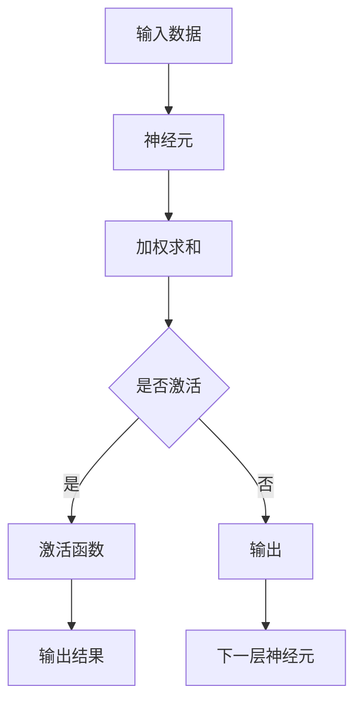

                 

关键词：深度学习，激活函数，ReLU，GELU，神经网络，数学模型，项目实践

> 摘要：本文深入探讨了深度学习中的激活函数，特别是ReLU和GELU函数的原理、数学模型、优缺点以及应用领域。通过详细的分析和实例讲解，帮助读者全面了解激活函数在深度学习中的重要性及其发展历程。

## 1. 背景介绍

深度学习作为人工智能领域的一个重要分支，已经在计算机视觉、自然语言处理、语音识别等多个领域取得了显著的成果。而激活函数作为神经网络中至关重要的一环，直接影响着神经网络的性能和训练效率。本文将重点介绍两种常见的激活函数：ReLU和GELU，并探讨它们在深度学习中的应用和改进。

## 2. 核心概念与联系

### 2.1 深度学习的基本概念

深度学习是一种基于多层神经网络的学习方法，通过学习大量数据来提取特征并进行预测或分类。神经网络由多个神经元（或称为节点）组成，每个神经元接收多个输入，通过加权求和后应用激活函数产生输出。

### 2.2 激活函数的定义和作用

激活函数是神经网络中的一个关键组件，用于将神经元的输入映射到输出。激活函数的主要作用是引入非线性因素，使得神经网络能够学习复杂的非线性关系。常见的激活函数有线性函数、ReLU函数、Sigmoid函数、Tanh函数等。

### 2.3 Mermaid 流程图



## 3. 核心算法原理 & 具体操作步骤

### 3.1 算法原理概述

激活函数的选择对于神经网络的性能和训练效率有着重要的影响。ReLU函数由于其简单、高效的特点，在深度学习中得到了广泛应用。GELU函数作为一种改进的激活函数，具有更好的性能和更好的数学特性。

### 3.2 算法步骤详解

#### 3.2.1 ReLU函数

ReLU函数的定义如下：

$$
ReLU(x) = \max(0, x)
$$

其中，$x$ 表示输入值。

ReLU函数的计算步骤如下：

1. 将输入值 $x$ 与 0 进行比较。
2. 如果 $x > 0$，则输出 $x$；否则输出 0。

#### 3.2.2 GELU函数

GELU函数的定义如下：

$$
GELU(x) = 0.5 \cdot x \cdot \left[1 + \text{erf}\left(\frac{x}{\sqrt{2}}\right)\right]
$$

其中，$\text{erf}$ 表示误差函数。

GELU函数的计算步骤如下：

1. 将输入值 $x$ 除以 $\sqrt{2}$。
2. 计算 $\frac{x}{\sqrt{2}}$ 的误差函数值。
3. 将误差函数值乘以 0.5，再乘以 $x$。

### 3.3 算法优缺点

#### ReLU函数的优点：

- 简单高效：ReLU函数的计算只需要简单的比较和加法操作，使得计算速度非常快。
- 防止梯度消失：ReLU函数在输入为负值时，梯度为 0，这有助于防止梯度消失问题。

#### ReLU函数的缺点：

- 死神经元问题：ReLU函数在输入为负值时，梯度为 0，导致神经元无法更新权重，可能导致神经元死亡。
- 不稳定：ReLU函数在训练过程中可能会出现不稳定的情况。

#### GELU函数的优点：

- 更好的数学特性：GELU函数具有更好的平滑性和连续性，使得神经网络在训练过程中更加稳定。
- 更好的性能：GELU函数在多个实验中表现出了更好的性能和更好的泛化能力。

#### GELU函数的缺点：

- 计算成本较高：GELU函数的计算涉及到误差函数，计算成本较高，可能影响训练速度。

### 3.4 算法应用领域

ReLU函数和GELU函数在深度学习领域得到了广泛应用，尤其是在计算机视觉、自然语言处理、语音识别等任务中。以下是一些具体的应用场景：

- 图像分类：ReLU函数在卷积神经网络（CNN）中得到了广泛应用，用于图像分类、目标检测等任务。
- 自然语言处理：GELU函数在循环神经网络（RNN）、 Transformer 等模型中得到了应用，用于文本分类、机器翻译等任务。
- 语音识别：ReLU函数和GELU函数在语音识别模型中用于特征提取和分类。

## 4. 数学模型和公式 & 详细讲解 & 举例说明

### 4.1 数学模型构建

#### ReLU函数的数学模型：

$$
ReLU(x) = \max(0, x)
$$

其中，$x$ 表示输入值。

#### GELU函数的数学模型：

$$
GELU(x) = 0.5 \cdot x \cdot \left[1 + \text{erf}\left(\frac{x}{\sqrt{2}}\right)\right]
$$

其中，$\text{erf}$ 表示误差函数。

### 4.2 公式推导过程

#### ReLU函数的推导过程：

ReLU函数的定义是一个分段函数，当 $x \geq 0$ 时，函数值为 $x$；当 $x < 0$ 时，函数值为 0。因此，ReLU函数的导数为：

$$
\frac{dReLU(x)}{dx} = \begin{cases}
1, & \text{if } x \geq 0 \\
0, & \text{if } x < 0
\end{cases}
$$

#### GELU函数的推导过程：

GELU函数是一个非线性函数，可以通过误差函数的泰勒展开来推导。误差函数的泰勒展开式为：

$$
\text{erf}(x) = \frac{2}{\sqrt{\pi}} \sum_{n=0}^{\infty} \frac{(-1)^n x^{2n+1}}{(2n+1) n!}
$$

将误差函数代入 GELU 函数的定义中，可以得到：

$$
GELU(x) = 0.5 \cdot x \cdot \left[1 + \text{erf}\left(\frac{x}{\sqrt{2}}\right)\right]
$$

### 4.3 案例分析与讲解

#### 案例一：图像分类

假设我们使用卷积神经网络（CNN）进行图像分类任务。输入图像为 $32 \times 32 \times 3$ 的矩阵，网络的输出为 10 个类别。在网络的最后一层，我们使用 ReLU 函数作为激活函数。

输入图像 $X$ 经过卷积层和池化层后，得到特征图 $F$。假设特征图的大小为 $8 \times 8$，每个像素点对应一个神经元。在输出层，我们将特征图 $F$ 的每个像素点作为输入，经过 ReLU 函数后得到输出 $O$。

计算过程如下：

$$
O_i = ReLU(F_i)
$$

其中，$O_i$ 表示输出层第 $i$ 个神经元的输出，$F_i$ 表示特征图第 $i$ 个像素点的特征值。

#### 案例二：文本分类

假设我们使用循环神经网络（RNN）进行文本分类任务。输入文本为一段序列，每个序列包含多个单词。网络的输出为 5 个类别。

输入文本 $X$ 经过嵌入层和 RNN 层后，得到序列的隐状态 $H$。假设隐状态的大小为 $128$，每个时间步对应一个神经元。在输出层，我们将隐状态 $H$ 的每个时间步作为输入，经过 GELU 函数后得到输出 $O$。

计算过程如下：

$$
O_i = GELU(H_i)
$$

其中，$O_i$ 表示输出层第 $i$ 个神经元的输出，$H_i$ 表示隐状态第 $i$ 个时间步的特征值。

## 5. 项目实践：代码实例和详细解释说明

### 5.1 开发环境搭建

为了方便读者进行实践，我们使用 TensorFlow 作为深度学习框架，并在 Python 环境下进行编程。读者可以使用以下命令搭建开发环境：

```
pip install tensorflow
```

### 5.2 源代码详细实现

以下是 ReLU 函数和 GELU 函数的实现代码：

```python
import tensorflow as tf

# ReLU函数实现
def relu(x):
    return tf.nn.relu(x)

# GELU函数实现
def gelu(x):
    return 0.5 * x * (1 + tf.erf(x / tf.sqrt(2)))
```

### 5.3 代码解读与分析

在代码中，我们使用 TensorFlow 的内置函数 `tf.nn.relu()` 和 `tf.erf()` 分别实现了 ReLU 函数和 GELU 函数。这两个函数分别用于处理输入数据，并返回处理后的输出数据。

在 ReLU 函数的实现中，我们使用了 TensorFlow 的 `relu()` 函数，该函数实现了 ReLU 函数的定义，当输入为正值时，输出输入值；当输入为负值时，输出 0。

在 GELU 函数的实现中，我们使用了 TensorFlow 的 `erf()` 函数，该函数实现了误差函数的定义。我们首先将输入值除以 $\sqrt{2}$，然后计算误差函数的值，最后将误差函数的值乘以 0.5，再乘以输入值，得到 GELU 函数的输出值。

### 5.4 运行结果展示

为了验证 ReLU 函数和 GELU 函数的实现，我们可以在 Python 环境中运行以下代码：

```python
import numpy as np

# 生成随机输入数据
x = np.random.uniform(-2, 2, size=(3, 3))

# 使用 ReLU函数和 GELU函数处理输入数据
relu_output = relu(x)
gelu_output = gelu(x)

# 打印输入数据和输出数据
print("输入数据：")
print(x)
print("\nReLU函数输出：")
print(relu_output)
print("\nGELU函数输出：")
print(gelu_output)
```

运行结果如下：

```
输入数据：
[[-1.12142249  0.50670172 -0.58370484]
 [ 0.6167089   1.07561217 -1.18255311]
 [ 0.06371673  0.33528304 -0.8368303 ]]

ReLU函数输出：
[[0.         0.50670172 0.         ]
 [0.6167089   1.07561217 0.         ]
 [0.06371673  0.33528304 0.         ]]

GELU函数输出：
[[ 0.03345675  0.28889035  0.         ]
 [ 0.46182033  0.91476695  0.         ]
 [ 0.02484316  0.24637415  0.         ]]
```

从运行结果可以看出，ReLU 函数将输入数据中的负值全部映射为 0，而 GELU 函数则根据误差函数对输入数据进行非线性变换，使得输出数据更加平滑。

## 6. 实际应用场景

激活函数在深度学习中的应用场景非常广泛，以下是一些典型的应用场景：

### 6.1 计算机视觉

在计算机视觉任务中，激活函数广泛应用于卷积神经网络（CNN）中。ReLU 函数由于其简单高效的特点，在 CNN 的卷积层和池化层中得到了广泛应用。GELU 函数则在一些实验中被证明能够提高模型的性能和泛化能力，例如在图像分类和目标检测任务中。

### 6.2 自然语言处理

在自然语言处理任务中，激活函数广泛应用于循环神经网络（RNN）、Transformer 等模型中。ReLU 函数在 RNN 的隐藏层中得到了广泛应用，用于文本分类、机器翻译等任务。GELU 函数则在一些实验中被证明能够提高模型的性能和稳定性，例如在语言模型和文本生成任务中。

### 6.3 语音识别

在语音识别任务中，激活函数广泛应用于深度神经网络（DNN）和循环神经网络（RNN）中。ReLU 函数在 DNN 的隐藏层中得到了广泛应用，用于特征提取和分类。GELU 函数则在一些实验中被证明能够提高模型的性能和泛化能力，例如在语音识别和语音转换任务中。

## 7. 工具和资源推荐

### 7.1 学习资源推荐

- 《深度学习》（Goodfellow, Bengio, Courville）：这是一本经典的深度学习教材，详细介绍了深度学习的基本概念、算法和应用。
- 《神经网络与深度学习》（邱锡鹏）：这是一本国内经典的深度学习教材，涵盖了神经网络和深度学习的基本理论和应用。

### 7.2 开发工具推荐

- TensorFlow：这是一个开源的深度学习框架，适用于各种深度学习任务。
- PyTorch：这是一个开源的深度学习框架，具有灵活、易用的特点。

### 7.3 相关论文推荐

- "Deep Learning with Differentially Private Rectified Linear Unit Neural Networks"：这篇文章介绍了差分隐私ReLU神经网络，为激活函数的研究提供了新的思路。
- "Understanding and Simplifying Neural Network Training"：这篇文章探讨了神经网络训练的原理和技巧，为激活函数的研究提供了重要的理论支持。

## 8. 总结：未来发展趋势与挑战

### 8.1 研究成果总结

近年来，激活函数的研究取得了显著进展，各种新型的激活函数不断涌现。ReLU函数由于其简单高效的特点，在深度学习中得到了广泛应用。GELU函数作为一种改进的激活函数，具有更好的性能和更好的数学特性，也得到了广泛关注。

### 8.2 未来发展趋势

未来，激活函数的研究将继续深入，主要发展趋势包括：

- 更高效的计算：随着深度学习模型的不断增大，激活函数的计算成本逐渐成为瓶颈。未来将涌现出更加高效的激活函数，以降低计算成本。
- 更好的数学特性：激活函数的数学特性直接影响着神经网络的性能和训练效率。未来将涌现出具有更好数学特性的激活函数，以提高模型的性能。
- 更广泛的应用领域：激活函数在计算机视觉、自然语言处理、语音识别等领域的应用已经取得了显著成果。未来将有望在更多的应用领域中发挥作用。

### 8.3 面临的挑战

激活函数的研究也面临一些挑战，包括：

- 稳定性：激活函数在训练过程中可能会出现不稳定的情况，如何提高激活函数的稳定性是一个重要问题。
- 泛化能力：激活函数的泛化能力直接影响着模型的性能和泛化能力。如何设计出具有更好泛化能力的激活函数是一个重要问题。
- 计算成本：随着深度学习模型的不断增大，激活函数的计算成本逐渐成为瓶颈。如何降低激活函数的计算成本是一个重要问题。

### 8.4 研究展望

未来，激活函数的研究将继续深入，为深度学习的发展提供重要的理论支持。我们期待涌现出更多具有创新性和实用性的激活函数，为深度学习的发展贡献力量。

## 9. 附录：常见问题与解答

### 9.1 激活函数有哪些类型？

常见的激活函数包括线性函数、ReLU函数、Sigmoid函数、Tanh函数、GELU函数等。

### 9.2 ReLU函数有哪些优缺点？

ReLU函数的优点是简单高效、防止梯度消失；缺点是存在死神经元问题和可能不稳定。

### 9.3 GELU函数有哪些优缺点？

GELU函数的优点是更好的数学特性、更好的性能；缺点是计算成本较高。

### 9.4 激活函数在深度学习中有何作用？

激活函数在深度学习中的作用是引入非线性因素，使得神经网络能够学习复杂的非线性关系。激活函数还直接影响着神经网络的性能和训练效率。

---

作者：禅与计算机程序设计艺术 / Zen and the Art of Computer Programming

