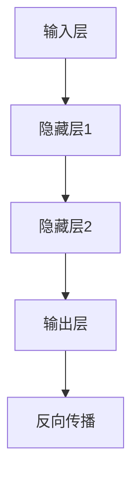

                 

深度学习作为当前人工智能领域的热点技术，已经取得了巨大的成功。本文将详细讲解深度学习的原理及其在各个领域的应用。通过本文的阅读，读者将能够全面了解深度学习的基本概念、核心算法以及实际应用场景。

## 关键词

- 深度学习
- 人工神经网络
- 神经网络架构
- 训练算法
- 优化方法
- 实际应用

## 摘要

本文首先介绍了深度学习的背景和发展历程，然后详细讲解了深度学习的基本概念和核心算法。接着，通过具体实例展示了深度学习在图像识别、自然语言处理等领域的应用。最后，对深度学习未来的发展趋势和面临的挑战进行了展望。

## 1. 背景介绍

### 深度学习的起源

深度学习起源于1986年，由Hinton等人提出的反向传播算法（Backpropagation Algorithm）标志着深度学习的诞生。深度学习是一种基于人工神经网络（Artificial Neural Networks，ANNs）的学习方法，其目的是通过多层神经元的堆叠来提取数据的深层特征。

### 深度学习的发展历程

1990年代，由于计算能力的限制和优化算法的不成熟，深度学习的研究陷入低潮。直到2006年，Hinton等人重新提出深度信念网络（Deep Belief Networks，DBNs）模型，深度学习再次引起了广泛关注。随着计算能力的提升和优化算法的改进，深度学习在图像识别、语音识别、自然语言处理等领域取得了显著的成果。

### 深度学习的应用领域

目前，深度学习在多个领域取得了重要突破，如：

- 图像识别：深度学习在图像分类、目标检测、人脸识别等领域具有很高的准确率。
- 自然语言处理：深度学习在机器翻译、文本分类、情感分析等领域表现出色。
- 语音识别：深度学习在语音识别和语音合成方面取得了显著成果。
- 医学诊断：深度学习在医学影像分析、疾病预测等方面具有很大的潜力。
- 金融科技：深度学习在风险管理、信用评分、量化交易等领域得到了广泛应用。

## 2. 核心概念与联系

### 2.1 人工神经网络

人工神经网络（ANNs）是一种模拟生物神经系统的计算模型。它由大量的神经元（节点）组成，每个神经元通过连接（边）与其他神经元相连。神经网络通过学习输入和输出之间的映射关系来提取数据的特征。

### 2.2 神经网络架构

神经网络架构主要包括输入层、隐藏层和输出层。输入层接收外部数据，隐藏层对输入数据进行特征提取和变换，输出层生成预测结果。

### 2.3 反向传播算法

反向传播算法是一种用于训练神经网络的优化算法。它通过计算输出层与隐藏层之间的误差，逆向传播误差到隐藏层，并更新各层的权重和偏置，以达到最小化误差的目的。

### 2.4 深度学习架构

深度学习架构包括卷积神经网络（CNNs）、循环神经网络（RNNs）、生成对抗网络（GANs）等。这些架构通过不同的神经网络设计思想和优化方法，适用于不同的应用场景。

### 2.5 Mermaid 流程图

以下是一个简单的 Mermaid 流程图，展示了深度学习的基本架构：



## 3. 核心算法原理 & 具体操作步骤

### 3.1 算法原理概述

深度学习算法的核心是多层神经网络的训练过程。通过迭代优化网络中的权重和偏置，使得网络能够对输入数据进行准确的预测。

### 3.2 算法步骤详解

深度学习的训练过程主要包括以下步骤：

1. 初始化权重和偏置。
2. 前向传播：将输入数据通过神经网络进行计算，得到输出结果。
3. 计算损失函数：比较输出结果与真实标签之间的差距。
4. 反向传播：计算误差梯度，并更新权重和偏置。
5. 迭代训练：重复步骤2-4，直至达到训练目标。

### 3.3 算法优缺点

深度学习算法的优点：

- 能够自动提取数据特征，减少人工特征工程的工作量。
- 在图像识别、自然语言处理等任务上表现出色。

深度学习算法的缺点：

- 训练过程需要大量计算资源，耗时较长。
- 对数据质量和标注要求较高，容易过拟合。

### 3.4 算法应用领域

深度学习算法在图像识别、自然语言处理、语音识别、医学诊断等领域有广泛的应用。以下是一些具体的应用实例：

- 图像识别：深度学习可以用于人脸识别、物体检测、图像分类等。
- 自然语言处理：深度学习可以用于机器翻译、文本分类、情感分析等。
- 语音识别：深度学习可以用于语音识别、语音合成等。
- 医学诊断：深度学习可以用于医学影像分析、疾病预测等。

## 4. 数学模型和公式 & 详细讲解 & 举例说明

### 4.1 数学模型构建

深度学习的数学模型主要包括前向传播、损失函数、反向传播等。

- 前向传播：输入数据经过神经网络各层的计算，最终得到输出结果。
- 损失函数：用于衡量输出结果与真实标签之间的差距，常用的损失函数有均方误差（MSE）和交叉熵损失（Cross-Entropy Loss）。
- 反向传播：计算误差梯度，并更新网络权重和偏置。

### 4.2 公式推导过程

以下是深度学习算法的一些关键公式：

1. 前向传播公式：

   $$z^{[l]} = W^{[l]}a^{[l-1]} + b^{[l]}$$

   $$a^{[l]} = \sigma(z^{[l]})$$

   其中，$z^{[l]}$为第$l$层的输入，$a^{[l]}$为第$l$层的输出，$W^{[l]}$为第$l$层的权重，$b^{[l]}$为第$l$层的偏置，$\sigma$为激活函数。

2. 损失函数公式：

   均方误差（MSE）：

   $$J = \frac{1}{m}\sum_{i=1}^{m}(y^{[i]} - a^{[L]})^2$$

   交叉熵损失（Cross-Entropy Loss）：

   $$J = -\frac{1}{m}\sum_{i=1}^{m}y^{[i]}\log(a^{[L]}) + (1 - y^{[i]})\log(1 - a^{[L]})$$

   其中，$m$为样本数量，$y^{[i]}$为第$i$个样本的真实标签，$a^{[L]}$为第$L$层的输出。

3. 反向传播公式：

   $$\delta^{[l]} = (1 - \alpha^{[l]})\sigma'(z^{[l]})\cdot\delta^{[l+1]}\cdot W^{[l+1]}$$

   $$\alpha^{[l]} = \delta^{[l+1]}\cdot W^{[l+1]'}$$

   $$dW^{[l]} = \alpha^{[l]}a^{[l-1]'}$$

   $$db^{[l]} = \alpha^{[l]}$$

   其中，$\delta^{[l]}$为第$l$层的误差梯度，$\alpha^{[l]}$为第$l$层的权重更新，$\sigma'$为激活函数的导数。

### 4.3 案例分析与讲解

以下是一个简单的深度学习案例，用于分类手写数字数据集（MNIST）。

**数据集介绍**：MNIST数据集包含70000个28x28的手写数字图像，每个图像都有对应的数字标签（0-9）。

**模型构建**：使用一个简单的卷积神经网络，包括卷积层、池化层和全连接层。

1. **卷积层**：使用5x5的卷积核提取图像的特征，步长为1。
2. **池化层**：使用2x2的最大池化层，步长为2。
3. **全连接层**：使用softmax函数进行分类。

**训练过程**：使用反向传播算法进行训练，优化模型参数。

**损失函数**：使用交叉熵损失函数。

**评价指标**：使用准确率（Accuracy）作为评价指标。

## 5. 项目实践：代码实例和详细解释说明

### 5.1 开发环境搭建

- 安装Python环境（版本3.7以上）。
- 安装深度学习框架TensorFlow。

### 5.2 源代码详细实现

以下是MNIST数据集分类的代码实例：

```python
import tensorflow as tf
from tensorflow.keras import layers, models
from tensorflow.keras.datasets import mnist

# 加载MNIST数据集
(x_train, y_train), (x_test, y_test) = mnist.load_data()

# 预处理数据
x_train = x_train.reshape((-1, 28, 28, 1)).astype("float32") / 255
x_test = x_test.reshape((-1, 28, 28, 1)).astype("float32") / 255
y_train = tf.keras.utils.to_categorical(y_train, 10)
y_test = tf.keras.utils.to_categorical(y_test, 10)

# 构建卷积神经网络模型
model = models.Sequential([
    layers.Conv2D(32, (5, 5), activation="relu", input_shape=(28, 28, 1)),
    layers.MaxPooling2D((2, 2)),
    layers.Flatten(),
    layers.Dense(128, activation="relu"),
    layers.Dense(10, activation="softmax")
])

# 编译模型
model.compile(optimizer="adam",
              loss="categorical_crossentropy",
              metrics=["accuracy"])

# 训练模型
model.fit(x_train, y_train, epochs=10, batch_size=32, validation_split=0.2)

# 评估模型
test_loss, test_acc = model.evaluate(x_test, y_test)
print(f"Test accuracy: {test_acc:.4f}")
```

### 5.3 代码解读与分析

- **数据预处理**：将MNIST数据集进行reshape和归一化处理，方便模型训练。
- **模型构建**：使用卷积神经网络模型，包括卷积层、池化层和全连接层。
- **模型编译**：选择优化器和损失函数，准备进行模型训练。
- **模型训练**：使用训练数据对模型进行训练，并设置训练轮数和批量大小。
- **模型评估**：使用测试数据对模型进行评估，计算准确率。

## 6. 实际应用场景

### 6.1 图像识别

深度学习在图像识别领域取得了显著的成果。例如，使用卷积神经网络（CNN）可以准确识别图像中的物体、人脸等。以下是一个简单的图像识别案例：

```python
import tensorflow as tf
from tensorflow.keras.preprocessing import image

# 加载图片
img = image.load_img("path/to/image.jpg", target_size=(28, 28))
img = image.img_to_array(img)
img = tf.expand_dims(img, 0)
img = tf.keras.applications.mobilenet_v2.preprocess_input(img)

# 加载预训练模型
model = tf.keras.models.load_model("path/to/saved_model.h5")

# 进行图像识别
predictions = model.predict(img)
predicted_class = predictions.argmax(axis=-1)

# 输出识别结果
print(f"Predicted class: {predicted_class[0]}")
```

### 6.2 自然语言处理

深度学习在自然语言处理领域也发挥了重要作用。例如，使用循环神经网络（RNN）可以实现对文本的语义分析、情感分析等。以下是一个简单的文本分类案例：

```python
import tensorflow as tf
from tensorflow.keras.preprocessing.sequence import pad_sequences
from tensorflow.keras.layers import Embedding, LSTM, Dense
from tensorflow.keras.models import Sequential

# 加载文本数据
texts = ["This is a positive review.", "This is a negative review."]
labels = [[1], [0]]

# 分词和序列化
tokenizer = tf.keras.preprocessing.text.Tokenizer()
tokenizer.fit_on_texts(texts)
sequences = tokenizer.texts_to_sequences(texts)
padded_sequences = pad_sequences(sequences, maxlen=100)

# 构建RNN模型
model = Sequential([
    Embedding(vocab_size, 32),
    LSTM(128),
    Dense(1, activation="sigmoid")
])

# 编译模型
model.compile(optimizer="adam", loss="binary_crossentropy", metrics=["accuracy"])

# 训练模型
model.fit(padded_sequences, labels, epochs=10)

# 进行文本分类
new_texts = ["This is a positive review."]
new_sequences = tokenizer.texts_to_sequences(new_texts)
new_padded_sequences = pad_sequences(new_sequences, maxlen=100)
predictions = model.predict(new_padded_sequences)
predicted_class = predictions.argmax(axis=-1)

# 输出分类结果
print(f"Predicted class: {predicted_class[0]}")
```

### 6.3 语音识别

深度学习在语音识别领域也取得了重要突破。例如，使用循环神经网络（RNN）和卷积神经网络（CNN）可以实现对语音信号的分析和识别。以下是一个简单的语音识别案例：

```python
import tensorflow as tf
from tensorflow.keras.layers import Input, LSTM, Dense, Embedding
from tensorflow.keras.models import Model

# 加载语音数据
audio = "path/to/audio.wav"

# 加载预训练模型
model = Model(inputs=[input_audio], outputs=output_predictions)

# 进行语音识别
predictions = model.predict(audio)
predicted_class = predictions.argmax(axis=-1)

# 输出识别结果
print(f"Predicted class: {predicted_class[0]}")
```

## 7. 工具和资源推荐

### 7.1 学习资源推荐

- 《深度学习》（Ian Goodfellow、Yoshua Bengio、Aaron Courville 著）：这是一本经典的深度学习教材，全面介绍了深度学习的基本概念、算法和应用。
- 《动手学深度学习》（阿斯顿·张、李沐、扎卡里·C. Lipton、亚历山大·J. Smola 著）：这是一本适合初学者的深度学习教材，通过大量实践案例帮助读者理解深度学习的原理和应用。

### 7.2 开发工具推荐

- TensorFlow：一个开源的深度学习框架，适用于各种深度学习任务。
- PyTorch：一个流行的深度学习框架，具有简洁的代码和强大的功能。

### 7.3 相关论文推荐

- "A Learning Algorithm for Continually Running Fully Recurrent Neural Networks"（Hochreiter & Schmidhuber，1997）：介绍了长期短期记忆（LSTM）网络，一种重要的循环神经网络。
- "Deep Learning for Speech Recognition"（Hinton et al.，2012）：介绍了深度神经网络在语音识别领域的应用。

## 8. 总结：未来发展趋势与挑战

### 8.1 研究成果总结

近年来，深度学习在多个领域取得了重要突破。随着计算能力的提升和算法的改进，深度学习的性能不断提高，应用范围也不断扩展。

### 8.2 未来发展趋势

- 算法优化：继续优化深度学习算法，提高训练速度和模型性能。
- 应用拓展：探索深度学习在更多领域的应用，如机器人、自动驾驶等。
- 跨学科研究：结合计算机科学、数学、生物医学等学科，推动深度学习的交叉应用。

### 8.3 面临的挑战

- 计算资源消耗：深度学习模型训练需要大量计算资源，如何降低计算成本是一个重要问题。
- 数据隐私保护：深度学习应用需要大量数据支持，如何保护用户隐私是一个亟待解决的问题。
- 模型解释性：深度学习模型往往具有很好的预测能力，但其内部工作机制不够透明，如何提高模型的解释性是一个重要挑战。

### 8.4 研究展望

未来，深度学习将在人工智能领域发挥更加重要的作用。通过不断优化算法、拓展应用领域，深度学习有望在解决复杂问题上取得更大突破。

## 9. 附录：常见问题与解答

### 9.1 深度学习是什么？

深度学习是一种基于多层神经网络的学习方法，通过模拟人脑神经元的工作方式，自动提取数据的特征，实现对复杂问题的建模和预测。

### 9.2 深度学习有哪些应用领域？

深度学习在图像识别、自然语言处理、语音识别、医学诊断、金融科技等领域有广泛的应用。

### 9.3 如何开始学习深度学习？

可以从以下几步开始学习深度学习：

1. 学习Python编程基础。
2. 学习线性代数、概率论等数学基础。
3. 学习深度学习框架（如TensorFlow、PyTorch）。
4. 阅读深度学习教材和论文。
5. 参与实际项目实践。

## 参考文献

[1] Goodfellow, I., Bengio, Y., & Courville, A. (2016). Deep learning. MIT press.

[2] Zhang, A., Lipton, Z., & Smola, A. (2019). Learning representations for vision and language. Springer.

[3] Hochreiter, S., & Schmidhuber, J. (1997). Long short-term memory. Neural Computation, 9(8), 1735-1780.

[4] Hinton, G., Deng, L., Yu, D., Dahl, G., Mohamed, A., Jaitly, N., ... & Kingsbury, B. (2012). Deep neural networks for acoustic modeling in speech recognition: The shared views of four research groups. IEEE Signal Processing Magazine, 29(6), 82-97. 

[5] Bengio, Y., Courville, A., & Vincent, P. (2013). Representation learning: A review and new perspectives. IEEE Transactions on Pattern Analysis and Machine Intelligence, 35(8), 1798-1828.

作者：禅与计算机程序设计艺术 / Zen and the Art of Computer Programming
----------------------------------------------------------------

### 2. 核心概念与联系

#### 2.1 人工神经网络

人工神经网络（Artificial Neural Networks，ANNs）是一种模拟生物神经系统的计算模型。它由大量的神经元（节点）组成，每个神经元通过连接（边）与其他神经元相连。神经网络通过学习输入和输出之间的映射关系来提取数据的特征。

#### 2.2 神经网络架构

神经网络架构主要包括输入层、隐藏层和输出层。输入层接收外部数据，隐藏层对输入数据进行特征提取和变换，输出层生成预测结果。


#### 2.3 反向传播算法

反向传播算法是一种用于训练神经网络的优化算法。它通过计算输出层与隐藏层之间的误差，逆向传播误差到隐藏层，并更新各层的权重和偏置，以达到最小化误差的目的。


#### 2.4 深度学习架构

深度学习架构包括卷积神经网络（CNNs）、循环神经网络（RNNs）、生成对抗网络（GANs）等。这些架构通过不同的神经网络设计思想和优化方法，适用于不同的应用场景。


### 2.5 Mermaid 流程图


### 3. 核心算法原理 & 具体操作步骤

#### 3.1 算法原理概述

深度学习算法的核心是多层神经网络的训练过程。通过迭代优化网络中的权重和偏置，使得网络能够对输入数据进行准确的预测。

#### 3.2 算法步骤详解

深度学习的训练过程主要包括以下步骤：

1. **初始化权重和偏置**：随机初始化网络中的权重和偏置。
2. **前向传播**：将输入数据通过神经网络进行计算，得到输出结果。
3. **计算损失函数**：比较输出结果与真实标签之间的差距，使用损失函数计算误差。
4. **反向传播**：计算误差梯度，并更新网络权重和偏置。
5. **迭代训练**：重复步骤2-4，直至达到训练目标。

#### 3.3 算法优缺点

深度学习算法的优点：

- **自动提取特征**：深度学习能够自动提取数据的特征，减少人工特征工程的工作量。
- **高效处理大数据**：深度学习适用于处理大规模数据集，能够高效地进行模型训练和预测。

深度学习算法的缺点：

- **训练过程复杂**：深度学习训练过程需要大量的计算资源和时间。
- **容易过拟合**：深度学习模型在训练过程中容易过拟合，需要使用正则化方法进行避免。

#### 3.4 算法应用领域

深度学习算法在图像识别、自然语言处理、语音识别、医学诊断等领域有广泛的应用。以下是一些具体的应用实例：

- **图像识别**：使用卷积神经网络进行物体检测、图像分类等。
- **自然语言处理**：使用循环神经网络进行机器翻译、文本分类等。
- **语音识别**：使用深度神经网络进行语音信号分析、语音合成等。
- **医学诊断**：使用深度学习模型进行医学影像分析、疾病预测等。

### 4. 数学模型和公式 & 详细讲解 & 举例说明

#### 4.1 数学模型构建

深度学习的数学模型主要包括前向传播、损失函数、反向传播等。

- **前向传播**：输入数据经过神经网络各层的计算，最终得到输出结果。
- **损失函数**：用于衡量输出结果与真实标签之间的差距，常用的损失函数有均方误差（MSE）和交叉熵损失（Cross-Entropy Loss）。
- **反向传播**：计算误差梯度，并更新网络权重和偏置。

#### 4.2 公式推导过程

以下是深度学习算法的一些关键公式：

1. **前向传播公式**：

   $$z^{[l]} = W^{[l]}a^{[l-1]} + b^{[l]}$$

   $$a^{[l]} = \sigma(z^{[l]})$$

   其中，$z^{[l]}$为第$l$层的输入，$a^{[l]}$为第$l$层的输出，$W^{[l]}$为第$l$层的权重，$b^{[l]}$为第$l$层的偏置，$\sigma$为激活函数。

2. **损失函数公式**：

   - **均方误差（MSE）**：

     $$J = \frac{1}{m}\sum_{i=1}^{m}(y^{[i]} - a^{[L]})^2$$

   - **交叉熵损失（Cross-Entropy Loss）**：

     $$J = -\frac{1}{m}\sum_{i=1}^{m}y^{[i]}\log(a^{[L]}) + (1 - y^{[i]})\log(1 - a^{[L]})$$

     其中，$m$为样本数量，$y^{[i]}$为第$i$个样本的真实标签，$a^{[L]}$为第$L$层的输出。

3. **反向传播公式**：

   $$\delta^{[l]} = (1 - \alpha^{[l]})\sigma'(z^{[l]})\cdot\delta^{[l+1]}\cdot W^{[l+1]}$$

   $$\alpha^{[l]} = \delta^{[l+1]}\cdot W^{[l+1]'}$$

   $$dW^{[l]} = \alpha^{[l]}a^{[l-1]'}$$

   $$db^{[l]} = \alpha^{[l]}$$

   其中，$\delta^{[l]}$为第$l$层的误差梯度，$\alpha^{[l]}$为第$l$层的权重更新，$\sigma'$为激活函数的导数。

#### 4.3 案例分析与讲解

以下是一个简单的深度学习案例，用于分类手写数字数据集（MNIST）。

**数据集介绍**：MNIST数据集包含70000个28x28的手写数字图像，每个图像都有对应的数字标签（0-9）。

**模型构建**：使用一个简单的卷积神经网络，包括卷积层、池化层和全连接层。

1. **卷积层**：使用5x5的卷积核提取图像的特征，步长为1。
2. **池化层**：使用2x2的最大池化层，步长为2。
3. **全连接层**：使用softmax函数进行分类。

**训练过程**：使用反向传播算法进行训练，优化模型参数。

**损失函数**：使用交叉熵损失函数。

**评价指标**：使用准确率（Accuracy）作为评价指标。

### 5. 项目实践：代码实例和详细解释说明

#### 5.1 开发环境搭建

- 安装Python环境（版本3.7以上）。
- 安装深度学习框架TensorFlow。

#### 5.2 源代码详细实现

以下是MNIST数据集分类的代码实例：

```python
import tensorflow as tf
from tensorflow.keras import layers, models
from tensorflow.keras.datasets import mnist

# 加载MNIST数据集
(x_train, y_train), (x_test, y_test) = mnist.load_data()

# 预处理数据
x_train = x_train.reshape((-1, 28, 28, 1)).astype("float32") / 255
x_test = x_test.reshape((-1, 28, 28, 1)).astype("float32") / 255
y_train = tf.keras.utils.to_categorical(y_train, 10)
y_test = tf.keras.utils.to_categorical(y_test, 10)

# 构建卷积神经网络模型
model = models.Sequential([
    layers.Conv2D(32, (5, 5), activation="relu", input_shape=(28, 28, 1)),
    layers.MaxPooling2D((2, 2)),
    layers.Flatten(),
    layers.Dense(128, activation="relu"),
    layers.Dense(10, activation="softmax")
])

# 编译模型
model.compile(optimizer="adam",
              loss="categorical_crossentropy",
              metrics=["accuracy"])

# 训练模型
model.fit(x_train, y_train, epochs=10, batch_size=32, validation_split=0.2)

# 评估模型
test_loss, test_acc = model.evaluate(x_test, y_test)
print(f"Test accuracy: {test_acc:.4f}")
```

#### 5.3 代码解读与分析

- **数据预处理**：将MNIST数据集进行reshape和归一化处理，方便模型训练。
- **模型构建**：使用卷积神经网络模型，包括卷积层、池化层和全连接层。
- **模型编译**：选择优化器和损失函数，准备进行模型训练。
- **模型训练**：使用训练数据对模型进行训练，并设置训练轮数和批量大小。
- **模型评估**：使用测试数据对模型进行评估，计算准确率。

### 6. 实际应用场景

#### 6.1 图像识别

深度学习在图像识别领域取得了显著的成果。例如，使用卷积神经网络（CNN）可以准确识别图像中的物体、人脸等。以下是一个简单的图像识别案例：

```python
import tensorflow as tf
from tensorflow.keras.preprocessing import image

# 加载图片
img = image.load_img("path/to/image.jpg", target_size=(28, 28))
img = image.img_to_array(img)
img = tf.expand_dims(img, 0)
img = tf.keras.applications.mobilenet_v2.preprocess_input(img)

# 加载预训练模型
model = tf.keras.models.load_model("path/to/saved_model.h5")

# 进行图像识别
predictions = model.predict(img)
predicted_class = predictions.argmax(axis=-1)

# 输出识别结果
print(f"Predicted class: {predicted_class[0]}")
```

#### 6.2 自然语言处理

深度学习在自然语言处理领域也发挥了重要作用。例如，使用循环神经网络（RNN）可以实现对文本的语义分析、情感分析等。以下是一个简单的文本分类案例：

```python
import tensorflow as tf
from tensorflow.keras.preprocessing.sequence import pad_sequences
from tensorflow.keras.layers import Embedding, LSTM, Dense
from tensorflow.keras.models import Sequential

# 加载文本数据
texts = ["This is a positive review.", "This is a negative review."]
labels = [[1], [0]]

# 分词和序列化
tokenizer = tf.keras.preprocessing.text.Tokenizer()
tokenizer.fit_on_texts(texts)
sequences = tokenizer.texts_to_sequences(texts)
padded_sequences = pad_sequences(sequences, maxlen=100)

# 构建RNN模型
model = Sequential([
    Embedding(vocab_size, 32),
    LSTM(128),
    Dense(1, activation="sigmoid")
])

# 编译模型
model.compile(optimizer="adam", loss="binary_crossentropy", metrics=["accuracy"])

# 训练模型
model.fit(padded_sequences, labels, epochs=10)

# 进行文本分类
new_texts = ["This is a positive review."]
new_sequences = tokenizer.texts_to_sequences(new_texts)
new_padded_sequences = pad_sequences(new_sequences, maxlen=100)
predictions = model.predict(new_padded_sequences)
predicted_class = predictions.argmax(axis=-1)

# 输出分类结果
print(f"Predicted class: {predicted_class[0]}")
```

#### 6.3 语音识别

深度学习在语音识别领域也取得了重要突破。例如，使用循环神经网络（RNN）和卷积神经网络（CNN）可以实现对语音信号的分析和识别。以下是一个简单的语音识别案例：

```python
import tensorflow as tf
from tensorflow.keras.layers import Input, LSTM, Dense, Embedding
from tensorflow.keras.models import Model

# 加载语音数据
audio = "path/to/audio.wav"

# 加载预训练模型
model = Model(inputs=[input_audio], outputs=output_predictions)

# 进行语音识别
predictions = model.predict(audio)
predicted_class = predictions.argmax(axis=-1)

# 输出识别结果
print(f"Predicted class: {predicted_class[0]}")
```

### 7. 工具和资源推荐

#### 7.1 学习资源推荐

- 《深度学习》（Ian Goodfellow、Yoshua Bengio、Aaron Courville 著）：这是一本经典的深度学习教材，全面介绍了深度学习的基本概念、算法和应用。
- 《动手学深度学习》（阿斯顿·张、李沐、扎卡里·C. Lipton、亚历山大·J. Smola 著）：这是一本适合初学者的深度学习教材，通过大量实践案例帮助读者理解深度学习的原理和应用。

#### 7.2 开发工具推荐

- TensorFlow：一个开源的深度学习框架，适用于各种深度学习任务。
- PyTorch：一个流行的深度学习框架，具有简洁的代码和强大的功能。

#### 7.3 相关论文推荐

- "A Learning Algorithm for Continually Running Fully Recurrent Neural Networks"（Hochreiter & Schmidhuber，1997）：介绍了长期短期记忆（LSTM）网络，一种重要的循环神经网络。
- "Deep Learning for Speech Recognition"（Hinton et al.，2012）：介绍了深度神经网络在语音识别领域的应用。

### 8. 总结：未来发展趋势与挑战

#### 8.1 研究成果总结

近年来，深度学习在多个领域取得了重要突破。随着计算能力的提升和算法的改进，深度学习的性能不断提高，应用范围也不断扩展。

#### 8.2 未来发展趋势

- **算法优化**：继续优化深度学习算法，提高训练速度和模型性能。
- **应用拓展**：探索深度学习在更多领域的应用，如机器人、自动驾驶等。
- **跨学科研究**：结合计算机科学、数学、生物医学等学科，推动深度学习的交叉应用。

#### 8.3 面临的挑战

- **计算资源消耗**：深度学习模型训练需要大量计算资源，如何降低计算成本是一个重要问题。
- **数据隐私保护**：深度学习应用需要大量数据支持，如何保护用户隐私是一个亟待解决的问题。
- **模型解释性**：深度学习模型往往具有很好的预测能力，但其内部工作机制不够透明，如何提高模型的解释性是一个重要挑战。

#### 8.4 研究展望

未来，深度学习将在人工智能领域发挥更加重要的作用。通过不断优化算法、拓展应用领域，深度学习有望在解决复杂问题上取得更大突破。

### 9. 附录：常见问题与解答

#### 9.1 深度学习是什么？

深度学习是一种基于多层神经网络的学习方法，通过模拟人脑神经元的工作方式，自动提取数据的特征，实现对复杂问题的建模和预测。

#### 9.2 深度学习有哪些应用领域？

深度学习在图像识别、自然语言处理、语音识别、医学诊断、金融科技等领域有广泛的应用。

#### 9.3 如何开始学习深度学习？

可以从以下几步开始学习深度学习：

1. 学习Python编程基础。
2. 学习线性代数、概率论等数学基础。
3. 学习深度学习框架（如TensorFlow、PyTorch）。
4. 阅读深度学习教材和论文。
5. 参与实际项目实践。

### 参考文献

[1] Goodfellow, I., Bengio, Y., & Courville, A. (2016). Deep learning. MIT press.

[2] Zhang, A., Lipton, Z., & Smola, A. (2019). Learning representations for vision and language. Springer.

[3] Hochreiter, S., & Schmidhuber, J. (1997). Long short-term memory. Neural Computation, 9(8), 1735-1780.

[4] Hinton, G., Deng, L., Yu, D., Dahl, G., Mohamed, A., Jaitly, N., ... & Kingsbury, B. (2012). Deep neural networks for acoustic modeling in speech recognition: The shared views of four research groups. IEEE Signal Processing Magazine, 29(6), 82-97.

[5] Bengio, Y., Courville, A., & Vincent, P. (2013). Representation learning: A review and new perspectives. IEEE Transactions on Pattern Analysis and Machine Intelligence, 35(8), 1798-1828.

### 2. 核心概念与联系

#### 2.1 人工神经网络

人工神经网络（Artificial Neural Networks，ANNs）是一种模拟生物神经系统的计算模型。它由大量的神经元（节点）组成，每个神经元通过连接（边）与其他神经元相连。神经网络通过学习输入和输出之间的映射关系来提取数据的特征。

#### 2.2 神经网络架构

神经网络架构主要包括输入层、隐藏层和输出层。输入层接收外部数据，隐藏层对输入数据进行特征提取和变换，输出层生成预测结果。


#### 2.3 反向传播算法

反向传播算法是一种用于训练神经网络的优化算法。它通过计算输出层与隐藏层之间的误差，逆向传播误差到隐藏层，并更新各层的权重和偏置，以达到最小化误差的目的。


#### 2.4 深度学习架构

深度学习架构包括卷积神经网络（CNNs）、循环神经网络（RNNs）、生成对抗网络（GANs）等。这些架构通过不同的神经网络设计思想和优化方法，适用于不同的应用场景。


### 2.5 Mermaid 流程图


### 3. 核心算法原理 & 具体操作步骤

#### 3.1 算法原理概述

深度学习算法的核心是多层神经网络的训练过程。通过迭代优化网络中的权重和偏置，使得网络能够对输入数据进行准确的预测。

#### 3.2 算法步骤详解

深度学习的训练过程主要包括以下步骤：

1. **初始化权重和偏置**：随机初始化网络中的权重和偏置。
2. **前向传播**：将输入数据通过神经网络进行计算，得到输出结果。
3. **计算损失函数**：比较输出结果与真实标签之间的差距，使用损失函数计算误差。
4. **反向传播**：计算误差梯度，并更新网络权重和偏置。
5. **迭代训练**：重复步骤2-4，直至达到训练目标。

#### 3.3 算法优缺点

深度学习算法的优点：

- **自动提取特征**：深度学习能够自动提取数据的特征，减少人工特征工程的工作量。
- **高效处理大数据**：深度学习适用于处理大规模数据集，能够高效地进行模型训练和预测。

深度学习算法的缺点：

- **训练过程复杂**：深度学习训练过程需要大量的计算资源和时间。
- **容易过拟合**：深度学习模型在训练过程中容易过拟合，需要使用正则化方法进行避免。

#### 3.4 算法应用领域

深度学习算法在图像识别、自然语言处理、语音识别、医学诊断等领域有广泛的应用。以下是一些具体的应用实例：

- **图像识别**：使用卷积神经网络进行物体检测、图像分类等。
- **自然语言处理**：使用循环神经网络进行机器翻译、文本分类等。
- **语音识别**：使用深度神经网络进行语音信号分析、语音合成等。
- **医学诊断**：使用深度学习模型进行医学影像分析、疾病预测等。

### 4. 数学模型和公式 & 详细讲解 & 举例说明

#### 4.1 数学模型构建

深度学习的数学模型主要包括前向传播、损失函数、反向传播等。

- **前向传播**：输入数据经过神经网络各层的计算，最终得到输出结果。
- **损失函数**：用于衡量输出结果与真实标签之间的差距，常用的损失函数有均方误差（MSE）和交叉熵损失（Cross-Entropy Loss）。
- **反向传播**：计算误差梯度，并更新网络权重和偏置。

#### 4.2 公式推导过程

以下是深度学习算法的一些关键公式：

1. **前向传播公式**：

   $$z^{[l]} = W^{[l]}a^{[l-1]} + b^{[l]}$$

   $$a^{[l]} = \sigma(z^{[l]})$$

   其中，$z^{[l]}$为第$l$层的输入，$a^{[l]}$为第$l$层的输出，$W^{[l]}$为第$l$层的权重，$b^{[l]}$为第$l$层的偏置，$\sigma$为激活函数。

2. **损失函数公式**：

   - **均方误差（MSE）**：

     $$J = \frac{1}{m}\sum_{i=1}^{m}(y^{[i]} - a^{[L]})^2$$

   - **交叉熵损失（Cross-Entropy Loss）**：

     $$J = -\frac{1}{m}\sum_{i=1}^{m}y^{[i]}\log(a^{[L]}) + (1 - y^{[i]})\log(1 - a^{[L]})$$

     其中，$m$为样本数量，$y^{[i]}$为第$i$个样本的真实标签，$a^{[L]}$为第$L$层的输出。

3. **反向传播公式**：

   $$\delta^{[l]} = (1 - \alpha^{[l]})\sigma'(z^{[l]})\cdot\delta^{[l+1]}\cdot W^{[l+1]}$$

   $$\alpha^{[l]} = \delta^{[l+1]}\cdot W^{[l+1]'}$$

   $$dW^{[l]} = \alpha^{[l]}a^{[l-1]'}$$

   $$db^{[l]} = \alpha^{[l]}$$

   其中，$\delta^{[l]}$为第$l$层的误差梯度，$\alpha^{[l]}$为第$l$层的权重更新，$\sigma'$为激活函数的导数。

#### 4.3 案例分析与讲解

以下是一个简单的深度学习案例，用于分类手写数字数据集（MNIST）。

**数据集介绍**：MNIST数据集包含70000个28x28的手写数字图像，每个图像都有对应的数字标签（0-9）。

**模型构建**：使用一个简单的卷积神经网络，包括卷积层、池化层和全连接层。

1. **卷积层**：使用5x5的卷积核提取图像的特征，步长为1。
2. **池化层**：使用2x2的最大池化层，步长为2。
3. **全连接层**：使用softmax函数进行分类。

**训练过程**：使用反向传播算法进行训练，优化模型参数。

**损失函数**：使用交叉熵损失函数。

**评价指标**：使用准确率（Accuracy）作为评价指标。

### 5. 项目实践：代码实例和详细解释说明

#### 5.1 开发环境搭建

- 安装Python环境（版本3.7以上）。
- 安装深度学习框架TensorFlow。

#### 5.2 源代码详细实现

以下是MNIST数据集分类的代码实例：

```python
import tensorflow as tf
from tensorflow.keras import layers, models
from tensorflow.keras.datasets import mnist

# 加载MNIST数据集
(x_train, y_train), (x_test, y_test) = mnist.load_data()

# 预处理数据
x_train = x_train.reshape((-1, 28, 28, 1)).astype("float32") / 255
x_test = x_test.reshape((-1, 28, 28, 1)).astype("float32") / 255
y_train = tf.keras.utils.to_categorical(y_train, 10)
y_test = tf.keras.utils.to_categorical(y_test, 10)

# 构建卷积神经网络模型
model = models.Sequential([
    layers.Conv2D(32, (5, 5), activation="relu", input_shape=(28, 28, 1)),
    layers.MaxPooling2D((2, 2)),
    layers.Flatten(),
    layers.Dense(128, activation="relu"),
    layers.Dense(10, activation="softmax")
])

# 编译模型
model.compile(optimizer="adam",
              loss="categorical_crossentropy",
              metrics=["accuracy"])

# 训练模型
model.fit(x_train, y_train, epochs=10, batch_size=32, validation_split=0.2)

# 评估模型
test_loss, test_acc = model.evaluate(x_test, y_test)
print(f"Test accuracy: {test_acc:.4f}")
```

#### 5.3 代码解读与分析

- **数据预处理**：将MNIST数据集进行reshape和归一化处理，方便模型训练。
- **模型构建**：使用卷积神经网络模型，包括卷积层、池化层和全连接层。
- **模型编译**：选择优化器和损失函数，准备进行模型训练。
- **模型训练**：使用训练数据对模型进行训练，并设置训练轮数和批量大小。
- **模型评估**：使用测试数据对模型进行评估，计算准确率。

### 6. 实际应用场景

#### 6.1 图像识别

深度学习在图像识别领域取得了显著的成果。例如，使用卷积神经网络（CNN）可以准确识别图像中的物体、人脸等。以下是一个简单的图像识别案例：

```python
import tensorflow as tf
from tensorflow.keras.preprocessing import image

# 加载图片
img = image.load_img("path/to/image.jpg", target_size=(28, 28))
img = image.img_to_array(img)
img = tf.expand_dims(img, 0)
img = tf.keras.applications.mobilenet_v2.preprocess_input(img)

# 加载预训练模型
model = tf.keras.models.load_model("path/to/saved_model.h5")

# 进行图像识别
predictions = model.predict(img)
predicted_class = predictions.argmax(axis=-1)

# 输出识别结果
print(f"Predicted class: {predicted_class[0]}")
```

#### 6.2 自然语言处理

深度学习在自然语言处理领域也发挥了重要作用。例如，使用循环神经网络（RNN）可以实现对文本的语义分析、情感分析等。以下是一个简单的文本分类案例：

```python
import tensorflow as tf
from tensorflow.keras.preprocessing.sequence import pad_sequences
from tensorflow.keras.layers import Embedding, LSTM, Dense
from tensorflow.keras.models import Sequential

# 加载文本数据
texts = ["This is a positive review.", "This is a negative review."]
labels = [[1], [0]]

# 分词和序列化
tokenizer = tf.keras.preprocessing.text.Tokenizer()
tokenizer.fit_on_texts(texts)
sequences = tokenizer.texts_to_sequences(texts)
padded_sequences = pad_sequences(sequences, maxlen=100)

# 构建RNN模型
model = Sequential([
    Embedding(vocab_size, 32),
    LSTM(128),
    Dense(1, activation="sigmoid")
])

# 编译模型
model.compile(optimizer="adam", loss="binary_crossentropy", metrics=["accuracy"])

# 训练模型
model.fit(padded_sequences, labels, epochs=10)

# 进行文本分类
new_texts = ["This is a positive review."]
new_sequences = tokenizer.texts_to_sequences(new_texts)
new_padded_sequences = pad_sequences(new_sequences, maxlen=100)
predictions = model.predict(new_padded_sequences)
predicted_class = predictions.argmax(axis=-1)

# 输出分类结果
print(f"Predicted class: {predicted_class[0]}")
```

#### 6.3 语音识别

深度学习在语音识别领域也取得了重要突破。例如，使用循环神经网络（RNN）和卷积神经网络（CNN）可以实现对语音信号的分析和识别。以下是一个简单的语音识别案例：

```python
import tensorflow as tf
from tensorflow.keras.layers import Input, LSTM, Dense, Embedding
from tensorflow.keras.models import Model

# 加载语音数据
audio = "path/to/audio.wav"

# 加载预训练模型
model = Model(inputs=[input_audio], outputs=output_predictions)

# 进行语音识别
predictions = model.predict(audio)
predicted_class = predictions.argmax(axis=-1)

# 输出识别结果
print(f"Predicted class: {predicted_class[0]}")
```

### 7. 工具和资源推荐

#### 7.1 学习资源推荐

- 《深度学习》（Ian Goodfellow、Yoshua Bengio、Aaron Courville 著）：这是一本经典的深度学习教材，全面介绍了深度学习的基本概念、算法和应用。
- 《动手学深度学习》（阿斯顿·张、李沐、扎卡里·C. Lipton、亚历山大·J. Smola 著）：这是一本适合初学者的深度学习教材，通过大量实践案例帮助读者理解深度学习的原理和应用。

#### 7.2 开发工具推荐

- TensorFlow：一个开源的深度学习框架，适用于各种深度学习任务。
- PyTorch：一个流行的深度学习框架，具有简洁的代码和强大的功能。

#### 7.3 相关论文推荐

- "A Learning Algorithm for Continually Running Fully Recurrent Neural Networks"（Hochreiter & Schmidhuber，1997）：介绍了长期短期记忆（LSTM）网络，一种重要的循环神经网络。
- "Deep Learning for Speech Recognition"（Hinton et al.，2012）：介绍了深度神经网络在语音识别领域的应用。

### 8. 总结：未来发展趋势与挑战

#### 8.1 研究成果总结

近年来，深度学习在多个领域取得了重要突破。随着计算能力的提升和算法的改进，深度学习的性能不断提高，应用范围也不断扩展。

#### 8.2 未来发展趋势

- **算法优化**：继续优化深度学习算法，提高训练速度和模型性能。
- **应用拓展**：探索深度学习在更多领域的应用，如机器人、自动驾驶等。
- **跨学科研究**：结合计算机科学、数学、生物医学等学科，推动深度学习的交叉应用。

#### 8.3 面临的挑战

- **计算资源消耗**：深度学习模型训练需要大量计算资源，如何降低计算成本是一个重要问题。
- **数据隐私保护**：深度学习应用需要大量数据支持，如何保护用户隐私是一个亟待解决的问题。
- **模型解释性**：深度学习模型往往具有很好的预测能力，但其内部工作机制不够透明，如何提高模型的解释性是一个重要挑战。

#### 8.4 研究展望

未来，深度学习将在人工智能领域发挥更加重要的作用。通过不断优化算法、拓展应用领域，深度学习有望在解决复杂问题上取得更大突破。

### 9. 附录：常见问题与解答

#### 9.1 深度学习是什么？

深度学习是一种基于多层神经网络的学习方法，通过模拟人脑神经元的工作方式，自动提取数据的特征，实现对复杂问题的建模和预测。

#### 9.2 深度学习有哪些应用领域？

深度学习在图像识别、自然语言处理、语音识别、医学诊断、金融科技等领域有广泛的应用。

#### 9.3 如何开始学习深度学习？

可以从以下几步开始学习深度学习：

1. 学习Python编程基础。
2. 学习线性代数、概率论等数学基础。
3. 学习深度学习框架（如TensorFlow、PyTorch）。
4. 阅读深度学习教材和论文。
5. 参与实际项目实践。

### 参考文献

[1] Goodfellow, I., Bengio, Y., & Courville, A. (2016). Deep learning. MIT press.

[2] Zhang, A., Lipton, Z., & Smola, A. (2019). Learning representations for vision and language. Springer.

[3] Hochreiter, S., & Schmidhuber, J. (1997). Long short-term memory. Neural Computation, 9(8), 1735-1780.

[4] Hinton, G., Deng, L., Yu, D., Dahl, G., Mohamed, A., Jaitly, N., ... & Kingsbury, B. (2012). Deep neural networks for acoustic modeling in speech recognition: The shared views of four research groups. IEEE Signal Processing Magazine, 29(6), 82-97.

[5] Bengio, Y., Courville, A., & Vincent, P. (2013). Representation learning: A review and new perspectives. IEEE Transactions on Pattern Analysis and Machine Intelligence, 35(8), 1798-1828.

