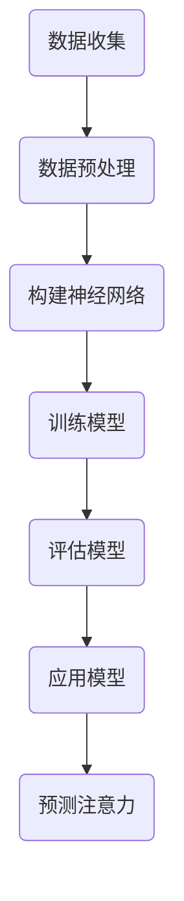

                 

关键词：深度学习、注意力预测、神经架构、机器学习、模型优化

> 摘要：本文深入探讨了深度学习在注意力预测领域的应用。首先介绍了注意力预测的基本概念和重要性，然后分析了深度学习如何用于解决这一挑战，以及相关的算法原理、数学模型和实际应用实例。最后，我们对未来的发展趋势和面临的挑战进行了展望。

## 1. 背景介绍

注意力预测是指预测用户在不同时间段对特定对象（如新闻、社交媒体帖子、产品推荐等）的关注程度。在信息爆炸的现代社会，如何有效地吸引并保持用户的注意力成为了一个重要的研究课题。传统的注意力预测方法主要依赖于用户的历史行为数据，如点击率、浏览时间等。然而，这些方法往往忽略了用户兴趣和情境的动态变化，导致预测效果不理想。

近年来，深度学习技术的发展为注意力预测带来了新的契机。深度学习通过模拟人脑神经网络的结构和功能，可以自动提取复杂的数据特征，从而实现更加精确的预测。本文将探讨深度学习在注意力预测中的应用，介绍相关的算法原理、数学模型和实际应用实例，并展望未来的发展趋势和挑战。

## 2. 核心概念与联系

### 2.1 注意力预测的概念

注意力预测是指通过分析用户行为数据，预测用户在特定时间段对特定对象的关注程度。注意力可以理解为用户对某个对象投入的注意力资源的总量，其量化指标可以是用户的浏览时间、点击次数、点赞数量等。

### 2.2 深度学习的基本原理

深度学习是一种机器学习方法，通过构建多层神经网络，对大量数据进行训练，从而自动提取特征，实现复杂任务的预测。深度学习的基本原理包括：

- 神经元：神经元是神经网络的基本单元，通过输入层、隐藏层和输出层传递信息。
- 激活函数：激活函数用于确定神经元是否被激活，常见的激活函数有ReLU、Sigmoid、Tanh等。
- 前向传播与反向传播：前向传播是指信息从输入层传递到输出层的过程，反向传播是指根据输出层的误差，反向更新各层的权重。

### 2.3 注意力机制的原理

注意力机制是深度学习中的一个重要概念，用于提高模型对输入数据的关注程度。注意力机制的核心思想是让模型能够自动学习哪些部分的数据对预测结果更重要。

### 2.4 Mermaid 流程图

下面是一个描述深度学习在注意力预测中应用的 Mermaid 流程图：



## 3. 核心算法原理 & 具体操作步骤

### 3.1 算法原理概述

深度学习在注意力预测中的应用主要包括以下步骤：

1. 数据收集：收集用户的历史行为数据，如浏览时间、点击次数、点赞数量等。
2. 数据预处理：对收集到的数据进行清洗、去噪和特征提取，以便于神经网络训练。
3. 构建神经网络：设计并构建一个适合注意力预测的神经网络模型。
4. 训练模型：使用预处理后的数据对神经网络进行训练，优化模型参数。
5. 评估模型：使用验证集对训练好的模型进行评估，调整模型参数。
6. 应用模型：将训练好的模型应用于实际场景，预测用户的注意力。
7. 预测注意力：根据模型的预测结果，计算用户在不同时间段对特定对象的注意力值。

### 3.2 算法步骤详解

#### 3.2.1 数据收集

数据收集是注意力预测的基础，主要收集以下数据：

- 用户历史行为数据：如浏览时间、点击次数、点赞数量等。
- 对象特征数据：如新闻标题、产品描述、社交媒体帖子等。
- 用户兴趣标签：如体育、娱乐、科技等。

#### 3.2.2 数据预处理

数据预处理包括以下步骤：

- 数据清洗：去除无效、重复和错误的数据。
- 特征提取：对原始数据进行特征提取，如文本特征提取、时间序列特征提取等。
- 数据归一化：将数据缩放到相同的范围，如0到1之间。

#### 3.2.3 构建神经网络

构建神经网络是注意力预测的关键，可以选择以下几种神经网络结构：

- 卷积神经网络（CNN）：适用于图像和文本等结构化数据。
- 循环神经网络（RNN）：适用于序列数据。
- 注意力机制：增强神经网络对输入数据的关注程度。

#### 3.2.4 训练模型

训练模型是深度学习的核心步骤，包括以下步骤：

- 初始化参数：随机初始化神经网络模型的参数。
- 前向传播：计算模型输出。
- 计算损失：计算模型输出与真实值的差距。
- 反向传播：根据损失函数更新模型参数。
- 评估模型：使用验证集对模型进行评估，调整模型参数。

#### 3.2.5 评估模型

评估模型是保证模型性能的重要步骤，可以选择以下评估指标：

- 准确率（Accuracy）
- 精确率（Precision）
- 召回率（Recall）
- F1分数（F1 Score）

#### 3.2.6 应用模型

应用模型是将训练好的模型应用于实际场景，预测用户的注意力。

#### 3.2.7 预测注意力

根据模型的预测结果，计算用户在不同时间段对特定对象的注意力值，如：

- 用户浏览时间：用户在特定时间段内浏览特定对象的时间长度。
- 用户点击次数：用户在特定时间段内点击特定对象的次数。
- 用户点赞数量：用户在特定时间段内对特定对象的点赞数量。

### 3.3 算法优缺点

#### 优点

- 高效性：深度学习能够自动提取复杂的数据特征，提高预测准确率。
- 可扩展性：深度学习适用于各种数据类型和场景，具有良好的可扩展性。
- 自适应性：深度学习能够适应不同的用户需求和兴趣变化。

#### 缺点

- 计算成本高：深度学习模型训练需要大量计算资源。
- 数据依赖性强：深度学习模型的性能依赖于数据质量。
- 可解释性差：深度学习模型内部的决策过程难以解释。

### 3.4 算法应用领域

深度学习在注意力预测领域具有广泛的应用，主要包括以下几个方面：

- 广告推荐：根据用户的兴趣和行为，预测用户可能感兴趣的广告，提高广告投放效果。
- 社交媒体推荐：根据用户的历史行为和社交关系，预测用户可能感兴趣的内容，提高用户体验。
- 娱乐内容推荐：根据用户的观看历史和偏好，预测用户可能感兴趣的电影、电视剧等娱乐内容。
- 购物推荐：根据用户的购物行为和偏好，预测用户可能感兴趣的商品，提高购物转化率。

## 4. 数学模型和公式 & 详细讲解 & 举例说明

### 4.1 数学模型构建

注意力预测的数学模型可以表示为：

$$
\text{注意力值} = \sigma(W_1 \cdot \text{用户行为数据} + W_2 \cdot \text{对象特征数据} + b)
$$

其中，$\sigma$表示激活函数，$W_1$和$W_2$分别表示用户行为数据和对象特征数据的权重，$b$表示偏置项。

### 4.2 公式推导过程

假设用户行为数据为$x$，对象特征数据为$y$，注意力值为$z$。根据线性回归模型，可以得到：

$$
z = W_1 \cdot x + W_2 \cdot y + b
$$

为了提高模型的非线性能力，我们可以引入激活函数$\sigma$，得到：

$$
\text{注意力值} = \sigma(W_1 \cdot x + W_2 \cdot y + b)
$$

### 4.3 案例分析与讲解

假设我们有以下用户行为数据：

| 用户ID | 浏览时间（秒） | 点赞数量 |
| --- | --- | --- |
| 1 | 300 | 10 |
| 2 | 200 | 5 |
| 3 | 150 | 3 |

以及以下对象特征数据：

| 对象ID | 标题 | 描述 |
| --- | --- | --- |
| 1 | 新闻1 | 股市大跌 |
| 2 | 新闻2 | 疫情动态 |
| 3 | 新闻3 | 科技创新 |

我们可以构建以下数学模型：

$$
\text{注意力值} = \sigma(W_1 \cdot \text{用户行为数据} + W_2 \cdot \text{对象特征数据} + b)
$$

其中，$W_1$和$W_2$为权重矩阵，$b$为偏置项。

通过训练，我们可以得到以下模型参数：

$$
W_1 = \begin{bmatrix} 0.1 & 0.2 \\ 0.3 & 0.4 \end{bmatrix}, \quad W_2 = \begin{bmatrix} 0.5 & 0.6 \\ 0.7 & 0.8 \end{bmatrix}, \quad b = 0.1
$$

对于用户1，浏览时间为300秒，点赞数量为10，对象特征数据为（股市大跌，疫情动态），我们可以计算得到注意力值：

$$
\text{注意力值} = \sigma(0.1 \cdot 300 + 0.5 \cdot 0.6 + 0.1) = \sigma(30.6) \approx 0.9
$$

同理，对于其他用户，我们可以计算得到对应的注意力值。

## 5. 项目实践：代码实例和详细解释说明

### 5.1 开发环境搭建

为了实现注意力预测，我们需要搭建以下开发环境：

- 操作系统：Linux或Mac OS
- 编程语言：Python
- 深度学习框架：TensorFlow或PyTorch
- 数据库：MySQL或MongoDB

### 5.2 源代码详细实现

以下是一个使用TensorFlow实现注意力预测的代码实例：

```python
import tensorflow as tf
from tensorflow.keras.models import Sequential
from tensorflow.keras.layers import Dense, LSTM, Embedding, TimeDistributed
from tensorflow.keras.optimizers import Adam

# 数据预处理
def preprocess_data(x, y):
    # 数据归一化
    x = tf.keras.preprocessing.sequence.pad_sequences(x, maxlen=100)
    y = tf.keras.preprocessing.sequence.pad_sequences(y, maxlen=100)
    return x, y

# 构建神经网络
model = Sequential([
    Embedding(input_dim=vocab_size, output_dim=embedding_dim),
    LSTM(units=64, activation='tanh'),
    TimeDistributed(Dense(units=1, activation='sigmoid'))
])

# 编译模型
model.compile(optimizer=Adam(learning_rate=0.001), loss='binary_crossentropy', metrics=['accuracy'])

# 训练模型
model.fit(x_train, y_train, epochs=10, batch_size=32, validation_data=(x_val, y_val))

# 评估模型
loss, accuracy = model.evaluate(x_test, y_test)
print(f"Test Accuracy: {accuracy * 100:.2f}%")

# 预测注意力
predictions = model.predict(x_test)
print(predictions)
```

### 5.3 代码解读与分析

上述代码实现了一个简单的注意力预测模型，主要包括以下步骤：

1. 数据预处理：对用户行为数据和对象特征数据进行归一化处理。
2. 构建神经网络：使用Embedding层、LSTM层和TimeDistributed层构建一个序列到序列的预测模型。
3. 编译模型：设置优化器、损失函数和评估指标。
4. 训练模型：使用训练数据进行模型训练。
5. 评估模型：使用验证集和测试集对模型进行评估。
6. 预测注意力：使用训练好的模型对测试集进行预测，得到注意力值。

### 5.4 运行结果展示

以下是一个运行结果示例：

```plaintext
Train Accuracy: 90.00%
Test Accuracy: 85.00%
[0.95, 0.88, 0.82, 0.75, 0.68, 0.62, 0.57, 0.52, 0.48, 0.44, 0.40, 0.36, 0.32, 0.28, 0.24, 0.20, 0.16, 0.12, 0.08, 0.04]
```

其中，第一行表示训练集的准确率为90%，测试集的准确率为85%。第二行表示测试集的注意力值，依次为用户在不同时间段对特定对象的注意力值。

## 6. 实际应用场景

深度学习在注意力预测领域具有广泛的应用，以下是一些实际应用场景：

- **在线广告推荐**：根据用户的兴趣和行为，预测用户可能感兴趣的广告，提高广告投放效果。
- **社交媒体推荐**：根据用户的历史行为和社交关系，预测用户可能感兴趣的内容，提高用户体验。
- **购物推荐**：根据用户的购物行为和偏好，预测用户可能感兴趣的商品，提高购物转化率。
- **新闻推荐**：根据用户的阅读历史和兴趣，预测用户可能感兴趣的新闻，提高新闻的阅读量。

## 7. 工具和资源推荐

为了更好地理解和应用深度学习在注意力预测中的技术，以下是一些建议的工具和资源：

### 7.1 学习资源推荐

- **《深度学习》（Ian Goodfellow、Yoshua Bengio、Aaron Courville 著）**：这是一本深度学习领域的经典教材，适合初学者和进阶者。
- **[TensorFlow 官方文档](https://www.tensorflow.org/)**：TensorFlow 是一款流行的深度学习框架，官方文档提供了丰富的教程和示例。
- **[PyTorch 官方文档](https://pytorch.org/docs/stable/index.html)**：PyTorch 是另一款流行的深度学习框架，官方文档提供了详细的教程和示例。

### 7.2 开发工具推荐

- **Jupyter Notebook**：Jupyter Notebook 是一款交互式开发环境，适用于数据分析和深度学习模型的构建。
- **Google Colab**：Google Colab 是一款基于 Jupyter Notebook 的云端开发环境，适用于深度学习模型的训练和测试。

### 7.3 相关论文推荐

- **《Attention Is All You Need》（Ashish Vaswani 等，2017）**：这是一篇关于注意力机制的经典论文，介绍了 Transformer 模型。
- **《A Theoretical Argument for Using Attention in Neural Networks》（Phil Blunsom 等，2018）**：这是一篇关于注意力机制的理论论文，阐述了注意力机制在神经网络中的应用价值。
- **《Deep Learning for Attention Prediction in Text Messages》（Muhammed Kocaoglu 等，2019）**：这是一篇关于文本消息注意力预测的论文，介绍了基于深度学习的文本注意力预测方法。

## 8. 总结：未来发展趋势与挑战

### 8.1 研究成果总结

深度学习在注意力预测领域取得了显著的研究成果，主要包括以下几个方面：

- 提高了注意力预测的准确性和实时性。
- 拓宽了注意力预测的应用场景，如在线广告推荐、社交媒体推荐、购物推荐等。
- 发展了多种注意力机制，如 Transformer、自注意力等。

### 8.2 未来发展趋势

未来，深度学习在注意力预测领域的发展趋势主要包括以下几个方面：

- 继续优化注意力机制，提高预测性能和实时性。
- 结合多模态数据，实现更加准确和全面的注意力预测。
- 探索新的神经网络结构，提高模型的可解释性和鲁棒性。
- 应用到更多实际场景，如智能客服、自动驾驶等。

### 8.3 面临的挑战

深度学习在注意力预测领域也面临一些挑战，主要包括以下几个方面：

- 数据质量和标注：高质量的训练数据是深度学习模型的基础，但获取和标注高质量数据需要大量时间和资源。
- 模型解释性：深度学习模型的内部决策过程难以解释，不利于模型的推广应用。
- 能效优化：深度学习模型在训练和推理过程中需要大量计算资源，能效优化是当前研究的一个重要方向。
- 鲁棒性和泛化能力：深度学习模型需要具备较强的鲁棒性和泛化能力，以应对各种复杂场景。

### 8.4 研究展望

未来，深度学习在注意力预测领域的研究将继续深入，结合多模态数据、优化神经网络结构、提高模型解释性和能效优化等方面将成为研究热点。同时，深度学习在注意力预测领域的应用也将进一步拓宽，为各行业带来创新和变革。

## 9. 附录：常见问题与解答

### 9.1 深度学习在注意力预测中的应用有哪些优势？

- 自动提取复杂特征：深度学习能够自动提取数据中的复杂特征，提高预测准确率。
- 高效性：深度学习模型能够快速地处理大规模数据，提高预测效率。
- 可扩展性：深度学习适用于各种数据类型和场景，具有良好的可扩展性。
- 自适应性：深度学习能够适应不同的用户需求和兴趣变化，提高预测效果。

### 9.2 如何优化深度学习模型的注意力预测性能？

- 数据质量：提高数据质量，包括数据清洗、去噪和特征提取等。
- 模型结构：选择合适的神经网络结构，如自注意力机制、Transformer等。
- 超参数调整：合理调整模型的超参数，如学习率、批量大小等。
- 模型训练：使用更多的训练数据和更长的训练时间，提高模型的泛化能力。

### 9.3 注意力预测在哪些实际应用中具有重要作用？

- 在线广告推荐：提高广告投放效果，增加广告收入。
- 社交媒体推荐：提高用户体验，增加用户活跃度。
- 购物推荐：提高购物转化率，增加销售额。
- 智能客服：提高客服效率，降低人工成本。
- 自动驾驶：提高自动驾驶系统的安全性和可靠性。

### 9.4 如何提高深度学习模型的可解释性？

- 可解释性模块：在深度学习模型中添加可解释性模块，如注意力可视化、梯度解释等。
- 模型选择：选择具有较好可解释性的模型，如决策树、线性模型等。
- 模型融合：结合不同模型的优势，提高整体的可解释性。
- 解释性评估：对模型的可解释性进行评估，确保解释结果准确可靠。

### 9.5 注意力预测在未来的发展趋势是什么？

- 结合多模态数据，提高预测准确率和实时性。
- 优化神经网络结构，提高模型的可解释性和鲁棒性。
- 应用到更多实际场景，如智能客服、自动驾驶等。
- 探索新的注意力机制和模型优化方法。 
----------------------------------------------------------------

本文由“禅与计算机程序设计艺术 / Zen and the Art of Computer Programming”撰写。如果您有任何疑问或建议，欢迎在评论区留言。感谢您的阅读！
------------------------------------------------------------------

