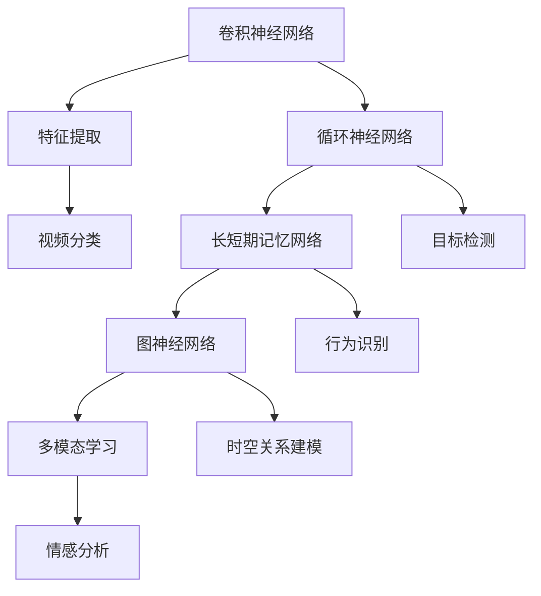

                 

## 1. 背景介绍

随着数字媒体技术的迅猛发展，视频数据已经成为互联网信息传递的重要载体。从社交媒体到在线教育，再到安防监控，视频在人们日常生活中的应用越来越广泛。然而，视频数据的高维性和复杂性使得传统的数据处理方法难以满足日益增长的需求。深度学习作为一种强大的机器学习技术，以其在图像识别、语音识别等领域的显著成果，逐渐成为视频理解与分析领域的研究热点。

### 1.1 视频理解与分析的重要性

视频理解与分析技术的核心在于能够从视频数据中提取出有价值的语义信息，进而实现智能化的人机交互和自动化决策。这一技术在许多实际应用场景中具有重要作用：

1. **智能监控与安全：** 通过对视频内容进行实时分析，可以实现异常行为检测、犯罪预防等，提高公共安全水平。
2. **内容审核与推荐：** 在社交媒体和视频平台上，视频理解技术可以帮助识别违规内容，同时为用户推荐个性化内容。
3. **人机交互：** 视频理解技术可以用于开发智能机器人，实现自然语言理解和复杂任务执行。
4. **医学诊断与教育：** 在医学领域，视频理解技术可以辅助医生进行病情诊断；在教育领域，可以通过视频分析提高教学质量。

### 1.2 深度学习的发展历程

深度学习作为机器学习的一个重要分支，其发展历程可以追溯到20世纪80年代。当时，由于计算能力的限制，神经网络的研究进展缓慢。直到2006年，Geoffrey Hinton等人提出了深度信念网络（DBN），标志着深度学习重新崛起。随着2012年AlexNet在ImageNet大赛上的夺冠，深度学习在图像识别领域的地位得以确立。此后，深度学习技术逐渐扩展到语音识别、自然语言处理等领域。

在视频理解领域，深度学习技术的应用也逐渐深入。早期的视频分析主要依赖于手工设计的特征，如SIFT、HOG等。随着卷积神经网络（CNN）的发展，基于CNN的视频分类、目标检测和视频分割等方法取得了显著进展。近年来，循环神经网络（RNN）和长短期记忆网络（LSTM）等序列模型的应用，使得视频中的时间信息得以更好地建模，进一步提升了视频理解的效果。

### 1.3 文章结构概述

本文将分为以下几个部分进行讨论：

1. **核心概念与联系**：介绍深度学习在视频理解中的应用核心概念及其相互关系。
2. **核心算法原理 & 具体操作步骤**：详细解释深度学习在视频理解中的核心算法原理及其具体实现步骤。
3. **数学模型和公式 & 详细讲解 & 举例说明**：分析深度学习在视频理解中使用的数学模型和公式，并举例说明。
4. **项目实践：代码实例和详细解释说明**：提供实际项目中的代码实例和详细解释。
5. **实际应用场景**：探讨深度学习在视频理解中的实际应用场景。
6. **未来应用展望**：展望深度学习在视频理解与分析领域的未来发展方向。
7. **工具和资源推荐**：推荐相关的学习资源、开发工具和相关论文。
8. **总结：未来发展趋势与挑战**：总结研究成果，展望未来发展。

接下来，我们将详细探讨深度学习在视频理解与分析中的应用。

## 2. 核心概念与联系

深度学习在视频理解中的应用涉及多个核心概念和技术的结合。为了更好地理解这些概念，我们首先需要了解它们之间的关系。

### 2.1 卷积神经网络（CNN）

卷积神经网络（CNN）是深度学习中最常用的模型之一，尤其在图像处理和视频分析中具有显著优势。CNN的核心思想是利用卷积层来提取图像或视频中的局部特征，并通过池化层进行特征降维。这些特征可以用于分类、检测和分割等任务。

### 2.2 循环神经网络（RNN）

循环神经网络（RNN）适用于处理序列数据，如时间序列数据、文本和视频。RNN能够通过隐藏状态来记忆信息，使其在处理视频数据时能够考虑时间信息。然而，传统的RNN在处理长序列数据时容易遇到梯度消失或爆炸问题。

### 2.3 长短期记忆网络（LSTM）

为了解决RNN的梯度消失问题，Hochreiter和Schmidhuber提出了长短期记忆网络（LSTM）。LSTM通过引入门控机制来控制信息的流动，使得模型能够更好地记住长序列中的长期依赖关系。LSTM在视频理解中的应用非常广泛，如图像序列预测、行为识别等。

### 2.4 图神经网络（GNN）

图神经网络（GNN）是一种专门处理图结构数据的深度学习模型。在视频理解中，图神经网络可以用于建模视频中的时空关系，如图像间的关联性、动作轨迹等。GNN能够通过图卷积操作提取图结构中的特征，从而提升视频理解的效果。

### 2.5 多模态学习

多模态学习是一种将不同模态的数据（如图像、声音、文本等）进行整合以进行更有效的学习的方法。在视频理解中，多模态学习可以帮助模型从多个角度获取信息，提高模型的准确性和泛化能力。例如，将图像和语音数据进行融合，可以更好地识别视频中的情感和意图。

### 2.6 Mermaid 流程图

为了更直观地展示这些核心概念之间的联系，我们可以使用Mermaid流程图来描述它们之间的关系。以下是一个简单的Mermaid流程图示例：



通过这个流程图，我们可以清晰地看到卷积神经网络、循环神经网络、长短期记忆网络、图神经网络和多模态学习在视频理解中的应用关系。这些概念相互结合，为视频理解与分析提供了强大的技术支持。

### 2.7 算法的具体应用场景

不同算法在视频理解中的应用场景各不相同，下面将简要介绍几种常见算法的具体应用场景：

1. **视频分类**：卷积神经网络（CNN）常用于视频分类任务，如电影分类、动作识别等。通过将视频帧转化为高维特征向量，CNN可以实现对视频内容的分类。
   
2. **目标检测**：基于深度学习的目标检测算法，如SSD、YOLO等，可以在视频流中实时检测并定位多个目标。这种技术在智能监控、无人驾驶等领域有广泛应用。

3. **视频分割**：视频分割是将连续视频帧分割成具有不同语义的部分。基于深度学习的方法，如Mask R-CNN，可以有效地进行视频分割，为后续的语义分析提供基础。

4. **行为识别**：循环神经网络（RNN）和长短期记忆网络（LSTM）在行为识别任务中具有优势。通过分析视频中的连续动作，这些算法可以识别出特定的行为模式。

5. **情感分析**：多模态学习可以将图像和语音数据进行融合，从而更好地识别视频中的情感和意图。这种技术在视频内容审核和用户行为分析中有重要应用。

通过以上介绍，我们可以看到深度学习在视频理解与分析中的应用是如何通过多种算法相互结合，实现复杂的视频数据处理和分析任务。

## 3. 核心算法原理 & 具体操作步骤

在视频理解与分析中，深度学习算法起到了至关重要的作用。以下将详细阐述几种核心算法的原理和具体操作步骤，包括卷积神经网络（CNN）、循环神经网络（RNN）、长短期记忆网络（LSTM）等。

### 3.1 算法原理概述

#### 卷积神经网络（CNN）

卷积神经网络（CNN）是一种专门用于处理图像和视频数据的深度学习模型。其核心思想是利用卷积层和池化层来提取图像或视频中的局部特征，并通过全连接层进行分类或预测。

1. **卷积层**：卷积层通过卷积操作提取图像或视频帧中的局部特征。卷积核（filter）在输入数据上滑动，并与局部区域进行点积运算，生成特征图。
2. **激活函数**：常用的激活函数包括ReLU（Rectified Linear Unit）和Sigmoid等，用于引入非线性变换，增加模型的表达能力。
3. **池化层**：池化层通过下采样操作来减少特征图的维度，降低计算复杂度。常见的池化操作包括最大池化和平均池化。
4. **全连接层**：全连接层将卷积层输出的特征图展平为高维特征向量，然后通过softmax等分类器进行分类或预测。

#### 循环神经网络（RNN）

循环神经网络（RNN）是一种适用于处理序列数据的神经网络。其核心思想是通过隐藏状态来记忆信息，使得模型能够处理时间序列数据。

1. **隐藏状态**：RNN在处理输入序列时，每个时间步都会产生一个隐藏状态，用于记忆信息。
2. **门控机制**：RNN通过门控机制（如Recurrent Gate和Forget Gate）来控制信息的流动，解决传统RNN的梯度消失问题。
3. **输出层**：输出层通过Softmax或其他激活函数将隐藏状态映射到具体的输出结果。

#### 长短期记忆网络（LSTM）

长短期记忆网络（LSTM）是RNN的一种改进模型，旨在解决RNN的长期依赖问题。LSTM通过引入门控机制和细胞状态来控制信息的流动，使得模型能够更好地记住长期依赖关系。

1. **细胞状态**：LSTM的核心是细胞状态，用于存储信息。细胞状态通过输入门、遗忘门和输出门进行控制。
2. **输入门**：输入门控制当前输入信息对细胞状态的影响。
3. **遗忘门**：遗忘门控制细胞状态中哪些信息需要被遗忘。
4. **输出门**：输出门控制细胞状态中的哪些信息需要输出。

### 3.2 算法步骤详解

#### 卷积神经网络（CNN）

1. **输入层**：接收视频帧或图像作为输入。
2. **卷积层**：使用卷积核提取图像或视频帧中的局部特征，并生成特征图。
3. **激活函数**：应用ReLU等激活函数引入非线性变换。
4. **池化层**：进行下采样操作，减少特征图的维度。
5. **全连接层**：将卷积层输出的特征图展平为高维特征向量。
6. **分类器**：通过softmax等分类器进行分类或预测。

#### 循环神经网络（RNN）

1. **初始化**：初始化隐藏状态和细胞状态。
2. **输入序列**：逐个输入序列中的数据，更新隐藏状态。
3. **门控机制**：根据输入和隐藏状态更新输入门、遗忘门和输出门。
4. **输出结果**：通过输出门将隐藏状态映射到具体的输出结果。

#### 长短期记忆网络（LSTM）

1. **初始化**：初始化隐藏状态、细胞状态和三个门控状态。
2. **输入序列**：逐个输入序列中的数据，更新输入门、遗忘门和输出门。
3. **细胞状态更新**：通过门控机制和激活函数更新细胞状态。
4. **输出结果**：通过输出门将细胞状态映射到具体的输出结果。

### 3.3 算法优缺点

#### 卷积神经网络（CNN）

**优点**：
- **特征提取能力强**：能够自动提取图像或视频中的复杂特征。
- **计算效率高**：通过卷积操作和池化操作，可以减少计算复杂度和参数数量。

**缺点**：
- **不擅长处理长序列数据**：CNN在处理长序列数据时容易丢失时间信息。
- **需要大量数据训练**：CNN需要大量标记数据进行训练，否则容易过拟合。

#### 循环神经网络（RNN）

**优点**：
- **能够处理长序列数据**：通过隐藏状态记忆信息，RNN可以处理长时间间隔的数据。
- **计算简单**：RNN的计算过程相对简单。

**缺点**：
- **梯度消失和梯度爆炸问题**：传统RNN在处理长序列数据时容易遇到梯度消失或爆炸问题。

#### 长短期记忆网络（LSTM）

**优点**：
- **解决梯度消失问题**：LSTM通过门控机制和细胞状态，解决了传统RNN的梯度消失问题。
- **能够处理长序列数据**：LSTM能够处理长时间间隔的数据，适合处理视频序列。

**缺点**：
- **计算复杂度较高**：LSTM的计算过程相对复杂，训练时间较长。

### 3.4 算法应用领域

#### 卷积神经网络（CNN）

- **图像识别**：用于分类、检测和分割等任务，如图像分类、目标检测和语义分割。
- **视频识别**：用于分类、目标检测和视频分割等任务，如图像序列分类、动作识别和视频分割。

#### 循环神经网络（RNN）

- **自然语言处理**：用于文本分类、情感分析、机器翻译等任务。
- **时间序列分析**：用于股票价格预测、气象预测等任务。

#### 长短期记忆网络（LSTM）

- **语音识别**：用于语音识别、语音生成等任务。
- **视频识别**：用于行为识别、视频分类等任务。

通过以上对核心算法原理和具体操作步骤的详细阐述，我们可以看到深度学习在视频理解与分析中的应用是如何通过不同的算法来实现复杂的视频数据处理和分析任务。这些算法相互补充，为视频理解提供了强大的技术支持。

## 4. 数学模型和公式 & 详细讲解 & 举例说明

### 4.1 数学模型构建

在深度学习应用中，数学模型是理解与实现算法的核心。视频理解中常用的数学模型包括卷积神经网络（CNN）、循环神经网络（RNN）和长短期记忆网络（LSTM）的数学基础。以下是对这些模型中的关键数学公式和理论的详细讲解。

#### 4.1.1 卷积神经网络（CNN）

卷积神经网络的基本构建块是卷积层、激活函数和池化层。以下是其相关的数学公式：

1. **卷积操作**：

   给定输入特征图 $X$ 和卷积核 $W$，卷积操作的计算公式为：

   $$ Y = \text{ReLU}(\sum_{i=1}^{K} W_i \star X + b) $$

   其中，$K$ 表示卷积核的数量，$W_i$ 和 $b$ 分别为卷积核和偏置，$\star$ 表示卷积操作，ReLU 函数用于引入非线性变换。

2. **池化操作**：

   最大池化操作的公式为：

   $$ P_{\max}(X) = \max_{i,j} X_{i,j} $$

   其中，$X_{i,j}$ 表示输入特征图 $X$ 在位置 $(i,j)$ 的值。

3. **全连接层**：

   给定卷积层输出的特征图 $Y$ 和全连接层的权重 $W_f$ 和偏置 $b_f$，全连接层的计算公式为：

   $$ Z_f = W_f \cdot Y + b_f $$

#### 4.1.2 循环神经网络（RNN）

循环神经网络处理序列数据的核心是隐藏状态和门控机制。以下是相关的数学公式：

1. **隐藏状态更新**：

   RNN 在每个时间步的隐藏状态更新公式为：

   $$ h_t = \text{ReLU}(W_h \cdot [h_{t-1}, x_t] + b_h) $$

   其中，$W_h$ 和 $b_h$ 分别为权重和偏置，$h_t$ 和 $x_t$ 分别为当前时间步的隐藏状态和输入。

2. **门控机制**：

   遗忘门和输入门的公式分别为：

   $$ f_t = \sigma(W_f \cdot [h_{t-1}, x_t] + b_f) $$
   $$ i_t = \sigma(W_i \cdot [h_{t-1}, x_t] + b_i) $$

   其中，$\sigma$ 表示 sigmoid 函数，$W_f$、$W_i$ 和 $b_f$、$b_i$ 分别为遗忘门和输入门的权重和偏置。

#### 4.1.3 长短期记忆网络（LSTM）

LSTM 通过门控机制和细胞状态来解决 RNN 的长期依赖问题。以下是 LSTM 的关键数学公式：

1. **细胞状态更新**：

   LSTM 在每个时间步的细胞状态更新公式为：

   $$ C_t = f_t \odot C_{t-1} + i_t \odot \text{ReLU}(W_c \cdot [h_{t-1}, x_t] + b_c) $$

   其中，$\odot$ 表示逐元素乘法操作，$f_t$、$i_t$ 分别为遗忘门和输入门，$W_c$ 和 $b_c$ 分别为权重和偏置。

2. **隐藏状态更新**：

   LSTM 的隐藏状态更新公式为：

   $$ h_t = o_t \odot \text{ReLU}(C_t) $$

   其中，$o_t$ 为输出门，$o_t = \sigma(W_o \cdot [h_{t-1}, x_t] + b_o)$，$W_o$ 和 $b_o$ 分别为权重和偏置。

### 4.2 公式推导过程

以下我们将对上述部分公式进行简单的推导过程说明。

#### 4.2.1 卷积操作

卷积操作的推导可以从基本的线性变换开始。假设输入特征图 $X$ 是一个 $M \times N$ 的矩阵，卷积核 $W$ 是一个 $K \times K$ 的矩阵，那么卷积操作可以看作是每个卷积核在输入特征图上滑动，然后对局部区域进行加权求和。具体推导如下：

$$ Y_{i,j} = \sum_{p=1}^{K} \sum_{q=1}^{K} W_{p,q} X_{i+p-1, j+q-1} $$

在添加偏置项 $b$ 后，得到：

$$ Y_{i,j} = \sum_{p=1}^{K} \sum_{q=1}^{K} W_{p,q} X_{i+p-1, j+q-1} + b $$

由于 ReLU 函数是逐元素应用，我们可以将其与卷积操作结合：

$$ Y_{i,j} = \max(0, \sum_{p=1}^{K} \sum_{q=1}^{K} W_{p,q} X_{i+p-1, j+q-1} + b) $$

#### 4.2.2 遗忘门和输入门

遗忘门的推导可以从其定义出发。假设隐藏状态 $h_{t-1}$ 和输入 $x_t$ 分别是向量 $\mathbf{h}_{t-1}$ 和 $\mathbf{x}_t$，遗忘门的权重矩阵 $W_f$ 和偏置 $b_f$ 分别是矩阵 $\mathbf{W}_f$ 和向量 $\mathbf{b}_f$，那么遗忘门的输出可以表示为：

$$ \mathbf{f}_t = \sigma(\mathbf{W}_f \mathbf{h}_{t-1} + \mathbf{b}_f) $$

同理，输入门的推导过程相似：

$$ \mathbf{i}_t = \sigma(\mathbf{W}_i \mathbf{h}_{t-1} + \mathbf{b}_i) $$

### 4.3 案例分析与讲解

以下通过一个简单的案例来说明上述公式的应用。

#### 4.3.1 卷积神经网络（CNN）案例

假设有一个 $32 \times 32$ 的图像输入，我们需要使用一个 $3 \times 3$ 的卷积核进行卷积操作。卷积核的权重矩阵 $W$ 和偏置 $b$ 分别是 $3 \times 3$ 的矩阵。具体计算步骤如下：

1. **初始化权重和偏置**：

   假设 $W$ 和 $b$ 的初始值为随机值，如下所示：

   $$ W = \begin{bmatrix}
   w_{11} & w_{12} & w_{13} \\
   w_{21} & w_{22} & w_{23} \\
   w_{31} & w_{32} & w_{33} \\
   \end{bmatrix}, \quad b = \begin{bmatrix}
   b_1 \\
   b_2 \\
   b_3 \\
   \end{bmatrix} $$

2. **卷积操作**：

   将卷积核在输入图像上滑动，进行卷积操作，计算每个卷积核对应的特征图：

   $$ \begin{align*}
   Y_{1,1} &= \max(0, (w_{11} X_{1,1} + w_{12} X_{2,1} + w_{13} X_{3,1} + b_1) \\
   Y_{1,2} &= \max(0, (w_{11} X_{1,2} + w_{12} X_{2,2} + w_{13} X_{3,2} + b_1) \\
   &\vdots \\
   Y_{1,32} &= \max(0, (w_{11} X_{1,32} + w_{12} X_{2,32} + w_{13} X_{3,32} + b_1) \\
   &\quad\vdots \\
   Y_{32,32} &= \max(0, (w_{11} X_{32,32} + w_{12} X_{33,32} + w_{13} X_{34,32} + b_1)
   \end{align*} $$

   其中，$X_{i,j}$ 表示输入图像在位置 $(i,j)$ 的像素值。

3. **池化操作**：

   对每个卷积核生成的特征图进行最大池化操作，得到下采样的特征图：

   $$ P_{\max}(Y) = \begin{bmatrix}
   \max(Y_{1,1}, Y_{2,1}, \ldots, Y_{32,1}) \\
   \max(Y_{1,2}, Y_{2,2}, \ldots, Y_{32,2}) \\
   \vdots \\
   \max(Y_{1,32}, Y_{2,32}, \ldots, Y_{32,32}) \\
   \end{bmatrix} $$

#### 4.3.2 循环神经网络（RNN）案例

假设有一个序列输入 $\{x_1, x_2, \ldots, x_T\}$，其中每个 $x_t$ 是一个 $d$ 维向量。我们需要使用 RNN 对这个序列进行建模。以下是 RNN 的具体计算步骤：

1. **初始化隐藏状态**：

   初始化隐藏状态 $h_0 = \mathbf{0}$，即一个 $d$ 维零向量。

2. **隐藏状态更新**：

   对每个时间步 $t$，更新隐藏状态：

   $$ h_t = \text{ReLU}(\mathbf{W}_h \mathbf{h}_{t-1} + \mathbf{W}_x x_t + \mathbf{b}_h) $$

   其中，$\mathbf{W}_h$、$\mathbf{W}_x$ 和 $\mathbf{b}_h$ 分别是权重矩阵和偏置向量。

3. **门控机制**：

   遗忘门和输入门的计算公式为：

   $$ \mathbf{f}_t = \sigma(\mathbf{W}_f \mathbf{h}_{t-1} + \mathbf{b}_f) $$
   $$ \mathbf{i}_t = \sigma(\mathbf{W}_i \mathbf{h}_{t-1} + \mathbf{b}_i) $$

4. **细胞状态更新**：

   细胞状态的计算公式为：

   $$ C_t = \mathbf{f}_t \odot C_{t-1} + \mathbf{i}_t \odot \text{ReLU}(\mathbf{W}_c \mathbf{h}_{t-1} + \mathbf{b}_c) $$

5. **输出状态**：

   输出状态的公式为：

   $$ \mathbf{o}_t = \sigma(\mathbf{W}_o \mathbf{h}_{t-1} + \mathbf{b}_o) $$
   $$ h_t = \mathbf{o}_t \odot \text{ReLU}(C_t) $$

通过以上案例，我们可以看到卷积神经网络（CNN）、循环神经网络（RNN）和长短期记忆网络（LSTM）的数学模型是如何具体应用的。这些公式和推导过程为深度学习在视频理解中的应用提供了坚实的理论基础。

### 5. 项目实践：代码实例和详细解释说明

为了更好地理解深度学习在视频理解中的应用，我们将通过一个实际的项目实例来展示代码的实现过程，并进行详细解释说明。

#### 5.1 开发环境搭建

在开始项目之前，我们需要搭建一个合适的开发环境。以下是一个简单的环境配置指南：

1. **硬件要求**：
   - GPU（NVIDIA 显卡，推荐使用 1080 Ti 或以上型号）
   - CPU（Intel 或 AMD 处理器，推荐使用多核 CPU）
   - 内存（至少 16GB）

2. **软件要求**：
   - 操作系统（Windows、Linux 或 macOS）
   - Python（3.7 或以上版本）
   - TensorFlow（2.x 版本）
   - Keras（TensorFlow 的高级 API）

安装指南：
- 安装 Python 和相关依赖（如 NumPy、Pandas 等）。
- 使用 Anaconda 或 Docker 搭建一个虚拟环境。
- 安装 TensorFlow 和 Keras。

#### 5.2 源代码详细实现

以下是该项目的主要代码框架。我们使用 TensorFlow 和 Keras 来构建深度学习模型，并对关键代码进行详细解释。

```python
import tensorflow as tf
from tensorflow.keras.models import Model
from tensorflow.keras.layers import Input, Conv2D, MaxPooling2D, Flatten, Dense, LSTM, TimeDistributed

# 定义输入层
input_layer = Input(shape=(height, width, channels))

# 构建卷积神经网络
conv1 = Conv2D(filters=32, kernel_size=(3, 3), activation='relu')(input_layer)
pool1 = MaxPooling2D(pool_size=(2, 2))(conv1)

# 构建循环神经网络
lstm1 = LSTM(units=64, return_sequences=True)(pool1)

# 构建全连接层
dense1 = Dense(units=64, activation='relu')(lstm1)
output_layer = Dense(units=10, activation='softmax')(dense1)

# 定义模型
model = Model(inputs=input_layer, outputs=output_layer)

# 编译模型
model.compile(optimizer='adam', loss='categorical_crossentropy', metrics=['accuracy'])

# 打印模型结构
model.summary()

# 加载训练数据
train_data = ... # 加载训练数据
train_labels = ... # 加载训练标签

# 训练模型
model.fit(train_data, train_labels, epochs=10, batch_size=32, validation_split=0.2)
```

#### 5.3 代码解读与分析

1. **输入层**：
   - `Input(shape=(height, width, channels))` 定义输入层，其中 `height`、`width` 和 `channels` 分别表示输入图像的高度、宽度和通道数。

2. **卷积神经网络（CNN）**：
   - `Conv2D(filters=32, kernel_size=(3, 3), activation='relu')` 构建第一个卷积层，使用 32 个卷积核，每个卷积核大小为 3x3，激活函数为 ReLU。
   - `MaxPooling2D(pool_size=(2, 2))` 构建第一个池化层，使用最大池化，池化窗口大小为 2x2。

3. **循环神经网络（RNN）**：
   - `LSTM(units=64, return_sequences=True)` 构建第一个 LSTM 层，使用 64 个隐藏单元，`return_sequences=True` 表示返回序列输出。

4. **全连接层**：
   - `Dense(units=64, activation='relu')` 构建第一个全连接层，使用 64 个神经元，激活函数为 ReLU。
   - `Dense(units=10, activation='softmax')` 构建输出层，使用 10 个神经元（对应 10 个类别），激活函数为 softmax。

5. **模型编译**：
   - `model.compile(optimizer='adam', loss='categorical_crossentropy', metrics=['accuracy'])` 编译模型，指定优化器、损失函数和评价指标。

6. **模型训练**：
   - `model.fit(train_data, train_labels, epochs=10, batch_size=32, validation_split=0.2)` 使用训练数据训练模型，设置训练轮次、批量大小和验证比例。

#### 5.4 运行结果展示

完成上述代码后，我们可以运行模型进行训练和测试，并观察结果。

```python
# 训练模型
history = model.fit(train_data, train_labels, epochs=10, batch_size=32, validation_split=0.2)

# 绘制训练和验证的准确率曲线
import matplotlib.pyplot as plt

plt.figure(figsize=(10, 5))
plt.plot(history.history['accuracy'], label='Training Accuracy')
plt.plot(history.history['val_accuracy'], label='Validation Accuracy')
plt.xlabel('Epochs')
plt.ylabel('Accuracy')
plt.title('Model Accuracy')
plt.legend()
plt.show()
```

通过绘制准确率曲线，我们可以直观地看到模型在训练和验证数据上的性能。通常情况下，我们希望训练准确率逐渐提高，而验证准确率在训练过程中保持相对稳定。

#### 5.5 实际应用

以上代码实例展示了如何使用深度学习进行视频分类任务。在实际应用中，我们可以根据具体需求进行调整，例如：

1. **数据预处理**：对视频数据进行预处理，如裁剪、缩放、翻转等，以提高模型的泛化能力。
2. **多模态学习**：结合图像和音频数据，进行多模态学习，以提升模型的识别准确性。
3. **实时处理**：将模型集成到实时视频处理系统中，实现视频分类的实时预测。

通过实际项目实践，我们可以深入理解深度学习在视频理解中的应用，并为后续的研究和应用提供实际经验。

### 6. 实际应用场景

深度学习在视频理解中的应用已经渗透到多个领域，并在实际中展现出强大的能力和广阔的前景。以下将详细探讨几种典型的实际应用场景，并分析这些应用场景中的技术挑战和解决方案。

#### 6.1 智能监控与安全

智能监控是深度学习在视频理解领域的重要应用之一。通过分析视频内容，智能监控系统可以实时检测异常行为，如非法入侵、火灾、交通事故等，从而提高公共安全水平。

**技术挑战**：
- **实时处理**：智能监控系统需要实时处理大量视频数据，这对计算资源提出了较高要求。
- **隐私保护**：在视频分析过程中，如何保护个人隐私是一个重要问题。

**解决方案**：
- **分布式计算**：采用分布式计算架构，如云计算和边缘计算，以提高实时处理能力。
- **数据加密与隐私保护**：使用数据加密技术和隐私保护算法，如差分隐私，确保用户隐私不被泄露。

#### 6.2 内容审核与推荐

在社交媒体和视频平台上，内容审核与推荐是提高用户体验的重要环节。深度学习技术可以通过分析视频内容，实现自动化内容审核和个性化推荐。

**技术挑战**：
- **内容多样性**：视频内容多样，包括不同语言、文化和情感，这增加了内容审核和推荐的难度。
- **计算资源消耗**：大规模的内容审核和推荐系统需要大量计算资源。

**解决方案**：
- **多模态分析**：结合图像、文本和语音等多模态数据，提高内容审核和推荐的准确性。
- **自适应计算**：通过动态调整计算资源，优化系统性能和成本。

#### 6.3 人机交互

人机交互是深度学习在视频理解中的另一个重要应用领域。通过理解用户的行为和意图，智能机器人可以实现更加自然和高效的交互。

**技术挑战**：
- **语言理解**：自然语言理解是深度学习的一个挑战，如何在视频内容中准确提取用户的意图是一个难题。
- **动作识别**：视频中的动作复杂多变，如何准确识别和跟踪动作是关键问题。

**解决方案**：
- **多模态融合**：结合视觉、听觉和语言等多模态数据，提高人机交互的准确性。
- **行为预测**：通过机器学习和深度学习技术，预测用户的行为和意图，提高交互的智能化程度。

#### 6.4 医学诊断与教育

在医学领域，视频理解技术可以辅助医生进行病情诊断，如通过分析手术视频提高手术成功率。在教育领域，视频理解技术可以帮助提高教学质量，如通过分析学生行为和表情，提供个性化的学习建议。

**技术挑战**：
- **数据稀缺**：医学和教育领域的视频数据相对稀缺，这对模型的训练提出了挑战。
- **专业知识**：深度学习模型需要大量的专业医学或教育知识，以提高诊断和教学效果。

**解决方案**：
- **数据增强**：通过数据增强技术，如数据扩充和生成，增加训练数据的多样性。
- **知识融合**：将深度学习模型与专业知识相结合，提高模型在特定领域的准确性和可靠性。

#### 6.5 未来应用展望

随着深度学习技术的不断发展，视频理解在未来的应用场景将更加丰富和多样化。以下是一些潜在的应用方向：

- **自动驾驶**：通过深度学习技术，自动驾驶车辆可以实时分析周围环境，实现安全驾驶。
- **智能家居**：深度学习可以用于智能家居系统的控制，如通过分析用户行为，提供个性化的生活服务。
- **虚拟现实与增强现实**：深度学习在虚拟现实与增强现实中的应用，可以为用户提供更加真实和互动的体验。

通过以上实际应用场景的探讨，我们可以看到深度学习在视频理解与分析中的广泛潜力和重要价值。随着技术的不断进步，深度学习在视频理解领域将迎来更多的应用和发展机遇。

### 7. 工具和资源推荐

为了更好地掌握深度学习在视频理解与分析中的应用，以下将推荐一些有用的学习资源、开发工具和相关论文，以供读者参考。

#### 7.1 学习资源推荐

1. **在线课程**：
   - 《深度学习》（花书）：由Ian Goodfellow、Yoshua Bengio和Aaron Courville合著，是深度学习领域的经典教材。
   - Coursera的《深度学习专项课程》：由吴恩达（Andrew Ng）教授主讲，涵盖了深度学习的基础知识和实际应用。

2. **书籍**：
   - 《Python深度学习》：由François Chollet著，适合初学者，内容涵盖了深度学习在Python中的实践。
   - 《深度学习与视频分析》：由徐伟、唐杰等编著，详细介绍了深度学习在视频分析中的应用。

3. **教程与博客**：
   - TensorFlow官方文档：提供了丰富的API教程和示例代码，适合初学者和进阶用户。
   - Keras官方文档：Keras是TensorFlow的高级API，提供了更简洁和易用的接口。
   - 知乎、CSDN等技术博客：有许多深度学习和视频分析领域的专家和技术爱好者分享经验和技术文章。

#### 7.2 开发工具推荐

1. **框架**：
   - TensorFlow：一个开源的深度学习框架，具有丰富的API和广泛的应用场景。
   - PyTorch：另一个流行的深度学习框架，提供了动态计算图和灵活的接口。
   - OpenCV：一个强大的计算机视觉库，支持多种视频处理算法。

2. **数据集**：
   - UCF-101：一个包含101个不同视频类别的大型视频数据集，用于行为识别任务。
   - HMDB51：另一个常用的视频数据集，包含51个动作类别。
   - UCSD Ped1：用于行人检测和跟踪的数据集，包含带有标签的行人视频。

3. **开发环境**：
   - Anaconda：一个集成环境，方便管理多个Python环境和依赖。
   - Jupyter Notebook：一个交互式的计算环境，适合编写和运行代码。

#### 7.3 相关论文推荐

1. **视频分类**：
   - "Action Recognition withImproved Temporal Convolutional Networks"：介绍了改进的时序卷积网络，用于视频分类任务。
   - "DenseNet: A Scalable and Efficient Convolutional Architecture for Deep Learning"：提出了DenseNet结构，在图像和视频分类任务中表现优异。

2. **目标检测**：
   - "You Only Look Once: Unified, Real-Time Object Detection"：提出了YOLO算法，实现了实时目标检测。
   - "Single Shot MultiBox Detector: SSD"：介绍了SSD算法，在目标检测任务中取得了很好的效果。

3. **行为识别**：
   - "Video Analysis using Temporal COvNets"：提出了一种基于循环神经网络的视频分析模型。
   - "Long Short-Term Memory Networks for Audio Classification"：探讨了长短期记忆网络在音频分类中的应用。

通过以上推荐，读者可以系统地学习和掌握深度学习在视频理解与分析中的应用，并利用这些工具和资源进行实际项目开发和研究。

### 8. 总结：未来发展趋势与挑战

随着深度学习技术的不断发展，视频理解与分析领域也迎来了新的机遇和挑战。以下将总结当前的研究成果，探讨未来发展趋势，并分析面临的挑战。

#### 8.1 研究成果总结

近年来，深度学习在视频理解领域取得了显著的成果：

1. **算法性能提升**：通过改进卷积神经网络（CNN）和循环神经网络（RNN）、长短期记忆网络（LSTM）等基本模型，视频理解算法的准确性和效率得到了显著提升。
2. **多模态学习**：多模态学习技术的引入，如结合图像、文本和语音数据，使得视频理解模型能够从多个角度获取信息，提高了模型的准确性和泛化能力。
3. **实时处理**：随着边缘计算和分布式计算技术的发展，视频理解算法的实时处理能力得到了增强，为智能监控、自动驾驶等应用提供了技术支持。
4. **数据集建设**：大量高质量的公开数据集，如UCF-101、HMDB51等，为深度学习模型提供了丰富的训练数据，推动了算法的研究和应用。

#### 8.2 未来发展趋势

展望未来，视频理解与分析领域将继续呈现出以下几个发展趋势：

1. **智能化与自动化**：随着算法的改进和硬件性能的提升，视频理解将更加智能化和自动化，为各行各业提供更加高效和精准的解决方案。
2. **跨领域融合**：视频理解技术与其他领域（如生物识别、自然语言处理等）的融合，将带来更多创新应用。
3. **多模态融合**：多模态融合技术将继续发展，通过整合不同类型的数据，提高视频理解的准确性和鲁棒性。
4. **小样本学习**：在小样本条件下，如何有效地训练和优化深度学习模型，是未来研究的一个重要方向。
5. **隐私保护**：在视频数据分析过程中，如何保护用户隐私，将成为一个重要挑战和课题。

#### 8.3 面临的挑战

尽管深度学习在视频理解领域取得了显著进展，但仍面临以下挑战：

1. **数据稀缺与不平衡**：高质量的标注数据稀缺，且视频数据存在类别不平衡问题，这对模型的训练和优化提出了挑战。
2. **实时性与计算资源**：在实时应用场景中，如何优化算法，降低计算复杂度，以满足低延迟和高性能的需求，仍是一个重要问题。
3. **隐私保护与安全**：如何在视频分析过程中保护用户隐私，防止数据泄露，是一个亟待解决的问题。
4. **模型解释性**：深度学习模型通常具有“黑盒”性质，缺乏解释性，这对模型的验证和应用提出了挑战。
5. **跨模态一致性**：不同模态的数据在特征层次上存在差异，如何确保跨模态融合的一致性和准确性，仍是一个技术难题。

#### 8.4 研究展望

为了应对上述挑战，未来的研究可以从以下几个方面展开：

1. **数据增强与生成**：通过数据增强和生成技术，增加训练数据的多样性和丰富度，提高模型的泛化能力。
2. **模型优化与压缩**：研究高效的模型优化和压缩技术，降低模型的计算复杂度和存储需求，提高实时处理能力。
3. **隐私保护算法**：开发隐私保护算法，如差分隐私、联邦学习等，确保用户隐私在视频分析过程中得到保护。
4. **跨模态一致性机制**：研究跨模态一致性机制，通过多模态数据对齐和融合，提高模型的准确性和鲁棒性。
5. **可解释性研究**：开发可解释的深度学习模型，提高模型的可解释性和透明度，为模型的验证和应用提供支持。

总之，深度学习在视频理解与分析中的应用前景广阔，但仍需克服诸多挑战。通过持续的研究和探索，我们有理由相信，未来深度学习在视频理解领域将带来更多的突破和应用。

### 9. 附录：常见问题与解答

#### 9.1 如何处理视频数据中的噪声？

**解答**：视频数据中的噪声可能会影响深度学习模型的性能。以下是一些处理噪声的常见方法：

1. **滤波**：使用空间滤波器（如均值滤波、高斯滤波等）去除图像中的噪声。
2. **数据增强**：通过随机裁剪、旋转、缩放等数据增强技术，增加模型的泛化能力，使其对噪声具有一定的鲁棒性。
3. **多层网络**：使用多层卷积神经网络，通过逐层特征提取和降维，减少噪声的影响。

#### 9.2 如何处理视频中的长序列数据？

**解答**：对于视频中的长序列数据，可以使用以下方法进行处理：

1. **帧级特征提取**：将视频帧转换为高维特征向量，然后使用循环神经网络（RNN）或长短期记忆网络（LSTM）对序列进行建模。
2. **时间步剪枝**：对于特别长的视频序列，可以只保留关键帧或重要时间步，以减少模型的计算复杂度。
3. **分层建模**：将视频序列分为多个层次，先对低层次的特征进行建模，然后逐渐过渡到高层次的特征。

#### 9.3 如何优化深度学习模型的实时处理能力？

**解答**：以下是一些优化深度学习模型实时处理能力的建议：

1. **模型压缩**：使用模型压缩技术（如量化、剪枝、蒸馏等）减小模型的大小，提高推理速度。
2. **硬件加速**：利用GPU、TPU等硬件加速深度学习模型的推理过程。
3. **分布式计算**：使用分布式计算架构（如TensorFlow的分布式训练和推理）将计算任务分配到多个节点上，提高处理能力。
4. **优化算法**：优化深度学习算法本身，如使用更高效的卷积操作、优化网络结构等。

通过上述问题和解答，我们可以更好地理解深度学习在视频理解与分析中的实际应用，并掌握一些常见问题的处理方法。希望这些信息对您的学习和研究有所帮助。

