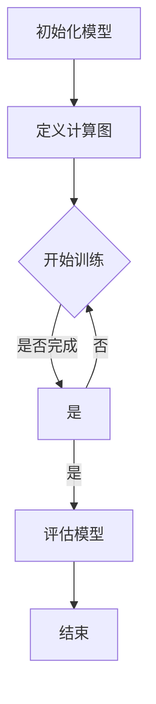

                 

深度学习作为人工智能的重要分支，已经广泛应用于语音识别、图像处理、自然语言处理等领域。深度学习框架作为一种实现深度学习算法的工具，极大地简化了模型训练和部署的复杂性。本文将深入探讨深度学习框架的原理，并通过实际代码案例来讲解如何使用这些框架进行深度学习的实践。

## 文章关键词

- 深度学习
- 深度学习框架
- 神经网络
- 模型训练
- 代码实战

## 文章摘要

本文旨在介绍深度学习框架的基本原理，包括其架构、核心概念以及如何使用这些框架进行深度学习模型的训练和部署。通过具体的代码实战案例，读者可以了解到如何在实际项目中应用深度学习框架，掌握从数据处理到模型训练再到结果评估的完整流程。

## 1. 背景介绍

深度学习框架的兴起源于深度神经网络在处理复杂数据方面的巨大潜力。传统的机器学习方法在面对大规模数据和高维度特征时往往力不从心，而深度神经网络通过层次化的结构能够自动提取特征，从而在图像识别、语音识别等领域取得了突破性的进展。

深度学习框架的出现，极大地简化了深度神经网络的设计、训练和部署过程。它们通常提供了一系列高级API，使得研究人员和开发者可以专注于模型的设计和优化，而无需关心底层计算的复杂性。

目前，主流的深度学习框架包括TensorFlow、PyTorch、MXNet等，它们各自有着不同的优势和特点。TensorFlow由谷歌开发，具有强大的生态系统和丰富的工具库，适用于生产环境；PyTorch由Facebook开发，以其灵活的动态计算图和易于理解的代码著称；MXNet由Apache基金会开发，支持多种编程语言，具有良好的性能和可扩展性。

## 2. 核心概念与联系

为了更好地理解深度学习框架，我们首先需要了解一些核心概念。

### 2.1 神经网络

神经网络（Neural Network）是模仿人脑工作方式的计算模型。它由多个节点（称为神经元）组成，每个神经元都可以接收输入信号，通过加权求和处理后输出信号。


神经网络通过多层结构进行特征提取，每层神经元都会对前一层神经元的输出进行变换。这个过程称为前向传播（Forward Propagation）。神经网络的学习过程是通过反向传播（Back Propagation）算法不断调整权重，使得网络的输出能够逼近期望的目标。

### 2.2 深度学习框架

深度学习框架（Deep Learning Framework）是一种基于图计算的系统，它为深度学习模型提供了从设计、训练到部署的全流程支持。


深度学习框架的核心是计算图（Computational Graph），它由节点和边组成。节点表示计算操作，边表示节点之间的依赖关系。通过计算图，深度学习框架能够动态构建和执行复杂的计算任务。

### 2.3 计算图与静态/动态计算图

在深度学习框架中，计算图可以分为静态计算图和动态计算图。

- **静态计算图**：在训练过程中，计算图是固定的，不会改变。典型的框架如TensorFlow早期版本。
- **动态计算图**：在训练过程中，计算图可以根据需要动态构建和修改。典型的框架如PyTorch。

### 2.4 深度学习框架的组成

深度学习框架通常由以下几个部分组成：

- **前端API**：提供高级API，方便用户定义模型结构。
- **计算引擎**：负责计算图的构建、执行和优化。
- **后端库**：提供底层计算支持，如CUDA、OpenMP等。
- **工具链**：包括调试、可视化、性能分析等工具。

### 2.5 Mermaid 流程图

为了更直观地展示深度学习框架的工作流程，我们可以使用Mermaid绘制一个流程图。



### 2.6 核心概念与联系总结

- **神经网络**：深度学习的基石，通过多层结构提取特征。
- **深度学习框架**：提供计算图、前端API、计算引擎等，简化深度学习模型的构建和训练。
- **计算图**：深度学习框架的核心，表示模型的计算流程。
- **静态计算图与动态计算图**：决定模型构建和训练的灵活性。
- **深度学习框架的组成**：前端API、计算引擎、后端库、工具链等。

通过以上核心概念的联系，我们可以更好地理解深度学习框架的工作原理和优势。

## 3. 核心算法原理 & 具体操作步骤

### 3.1 算法原理概述

深度学习框架的核心算法是神经网络。神经网络通过前向传播和反向传播两个过程进行学习。在训练过程中，神经网络不断调整权重，使得输出结果更接近期望值。

#### 3.1.1 前向传播

前向传播是从输入层开始，逐层计算每个神经元的输出。假设我们有如下简单的神经网络结构：

- 输入层：\( x_1, x_2, \ldots, x_n \)
- 隐藏层：\( h_1, h_2, \ldots, h_m \)
- 输出层：\( y_1, y_2, \ldots, y_k \)

前向传播的计算过程可以表示为：

$$
z_i^{(l)} = \sum_{j=1}^{n} w_{ij}^{(l)} x_j + b_i^{(l)}
$$

其中，\( z_i^{(l)} \) 是第 \( i \) 个神经元在隐藏层 \( l \) 的输出，\( w_{ij}^{(l)} \) 是连接第 \( i \) 个神经元和第 \( j \) 个神经元的权重，\( b_i^{(l)} \) 是第 \( i \) 个神经元的偏置。

通过激活函数 \( \sigma \) ，我们可以得到每个神经元的输出：

$$
h_i^{(l)} = \sigma(z_i^{(l)})
$$

其中，\( \sigma \) 是非线性激活函数，常见的有ReLU、Sigmoid、Tanh等。

#### 3.1.2 反向传播

反向传播是调整神经网络的权重和偏置，使得输出结果更接近期望值。假设我们的目标函数为 \( J = \frac{1}{2} \sum_{i=1}^{k} (y_i - \hat{y}_i)^2 \)，其中 \( \hat{y}_i \) 是输出层的预测值，\( y_i \) 是真实值。

反向传播的计算过程如下：

1. 计算输出层的误差：

$$
\delta_k^{(L)} = \frac{\partial J}{\partial z_k^{(L)}} = \frac{\partial J}{\partial \hat{y}_k} \cdot \frac{\partial \hat{y}_k}{\partial z_k^{(L)}}
$$

2. 计算隐藏层的误差：

$$
\delta_i^{(l)} = \frac{\partial J}{\partial z_i^{(l)}} = \frac{\partial J}{\partial z_k^{(L)}} \cdot \frac{\partial z_k^{(L)}}{\partial z_i^{(l)}}
$$

3. 根据误差更新权重和偏置：

$$
w_{ij}^{(l)} = w_{ij}^{(l)} + \alpha \cdot \delta_i^{(l)} \cdot h_j^{(l-1)}
$$

$$
b_i^{(l)} = b_i^{(l)} + \alpha \cdot \delta_i^{(l)}
$$

其中，\( \alpha \) 是学习率。

### 3.2 算法步骤详解

#### 3.2.1 模型初始化

在训练深度学习模型之前，需要初始化模型参数。初始化方法包括随机初始化、高斯分布初始化等。随机初始化可以使得模型参数分布在不同的范围内，有利于模型的优化。

#### 3.2.2 前向传播

在训练过程中，对于每个输入样本，我们进行前向传播计算，得到输出层的预测值。具体步骤如下：

1. 初始化输入层和隐藏层的参数。
2. 对于每个神经元，计算其输入值和偏置。
3. 应用激活函数，得到每个神经元的输出值。
4. 重复上述步骤，直到输出层得到预测值。

#### 3.2.3 反向传播

在得到输出层的预测值后，我们进行反向传播，计算每个神经元的误差。具体步骤如下：

1. 计算输出层的误差，并更新权重和偏置。
2. 对于每个隐藏层，计算其误差，并更新权重和偏置。
3. 重复上述步骤，直到输入层。

#### 3.2.4 模型评估

在训练完成后，我们对模型进行评估，使用测试集计算模型的准确率、召回率等指标。如果模型性能不满足要求，我们需要调整模型参数，重新进行训练。

### 3.3 算法优缺点

#### 优点

- **自动特征提取**：神经网络能够自动提取特征，减少人工特征工程的工作量。
- **适应性强**：神经网络能够适应不同的数据类型和任务，具有广泛的应用性。
- **高性能**：现代深度学习框架提供了高效的计算引擎和优化算法，使得模型训练速度大大提高。

#### 缺点

- **计算复杂度高**：深度学习模型通常具有大量的参数和多层结构，计算复杂度较高。
- **训练时间长**：深度学习模型的训练过程需要大量的计算资源和时间。
- **数据需求大**：深度学习模型通常需要大量的数据进行训练，对数据质量要求较高。

### 3.4 算法应用领域

深度学习算法在许多领域都取得了显著的成果，包括：

- **计算机视觉**：图像分类、目标检测、人脸识别等。
- **自然语言处理**：文本分类、机器翻译、情感分析等。
- **语音识别**：语音识别、语音合成等。
- **推荐系统**：基于用户行为的推荐、基于内容的推荐等。

## 4. 数学模型和公式 & 详细讲解 & 举例说明

### 4.1 数学模型构建

深度学习模型的核心是多层感知机（MLP），其数学模型可以表示为：

$$
y = \sigma(z) = \frac{1}{1 + e^{-z}}
$$

其中，\( z \) 是神经元的输入，\( y \) 是神经元的输出，\( \sigma \) 是Sigmoid激活函数。

### 4.2 公式推导过程

为了推导多层感知机的学习算法，我们首先需要定义损失函数。常用的损失函数包括均方误差（MSE）和交叉熵损失（Cross-Entropy Loss）。

#### 4.2.1 均方误差（MSE）

均方误差损失函数定义为：

$$
J = \frac{1}{2} \sum_{i=1}^{n} (y_i - \hat{y}_i)^2
$$

其中，\( y_i \) 是真实值，\( \hat{y}_i \) 是预测值。

#### 4.2.2 交叉熵损失（Cross-Entropy Loss）

交叉熵损失函数定义为：

$$
J = - \sum_{i=1}^{n} y_i \log(\hat{y}_i)
$$

其中，\( y_i \) 是真实值，\( \hat{y}_i \) 是预测值。

### 4.3 案例分析与讲解

#### 4.3.1 均方误差（MSE）损失函数的推导

假设我们有一个简单的一层神经网络，输入层有2个神经元，隐藏层有3个神经元，输出层有2个神经元。我们定义输入向量 \( x \)，隐藏层输出向量 \( h \)，输出层输出向量 \( y \)。神经元的权重和偏置分别表示为 \( w \) 和 \( b \)。

#### 4.3.2 前向传播

输入向量 \( x \) 通过权重和偏置传递到隐藏层，得到隐藏层输出 \( h \)：

$$
h_i = \sigma(z_i) = \sigma(\sum_{j=1}^{3} w_{ji} x_j + b_i)
$$

隐藏层输出 \( h \) 通过权重和偏置传递到输出层，得到输出层输出 \( y \)：

$$
y_i = \sigma(z_i) = \sigma(\sum_{j=1}^{3} w_{ji} h_j + b_i)
$$

#### 4.3.3 反向传播

在反向传播过程中，我们需要计算每个神经元的误差 \( \delta_i \)：

$$
\delta_i = (y_i - \hat{y}_i) \cdot \sigma'(z_i)
$$

其中，\( \sigma' \) 是Sigmoid激活函数的导数。

然后，我们可以计算隐藏层和输入层的误差：

$$
\delta_h = \sum_{i=1}^{2} w_{ij} \cdot \delta_i
$$

#### 4.3.4 权重和偏置更新

根据误差，我们可以更新权重和偏置：

$$
w_{ij} = w_{ij} + \alpha \cdot \delta_i \cdot h_j
$$

$$
b_i = b_i + \alpha \cdot \delta_i
$$

其中，\( \alpha \) 是学习率。

#### 4.3.5 代码实现

以下是一个使用PyTorch实现多层感知机的简单例子：

```python
import torch
import torch.nn as nn
import torch.optim as optim

# 定义模型
class MLP(nn.Module):
    def __init__(self):
        super(MLP, self).__init__()
        self.fc1 = nn.Linear(2, 3)
        self.fc2 = nn.Linear(3, 2)

    def forward(self, x):
        x = self.fc1(x)
        x = self.fc2(x)
        return x

# 初始化模型、优化器和损失函数
model = MLP()
optimizer = optim.SGD(model.parameters(), lr=0.01)
criterion = nn.CrossEntropyLoss()

# 训练模型
for epoch in range(100):
    # 前向传播
    outputs = model(x)
    loss = criterion(outputs, y)

    # 反向传播
    optimizer.zero_grad()
    loss.backward()
    optimizer.step()

    # 打印损失
    print(f'Epoch {epoch+1}, Loss: {loss.item()}')
```

通过以上代码，我们可以训练一个简单的多层感知机模型，实现前向传播和反向传播过程。

## 5. 项目实践：代码实例和详细解释说明

在本节中，我们将通过一个实际的项目实例，详细讲解如何使用深度学习框架进行模型训练、评估和部署。我们将使用PyTorch框架，实现一个简单的图像分类模型。

### 5.1 开发环境搭建

在开始项目之前，我们需要搭建开发环境。以下是在Windows操作系统上搭建PyTorch开发环境的步骤：

1. **安装Python**：确保Python版本为3.7或更高版本。
2. **安装PyTorch**：使用以下命令安装PyTorch：

   ```bash
   pip install torch torchvision
   ```

3. **验证安装**：运行以下Python代码，验证PyTorch是否安装成功：

   ```python
   import torch
   print(torch.__version__)
   ```

### 5.2 源代码详细实现

#### 5.2.1 数据预处理

首先，我们需要下载并加载CIFAR-10数据集，这是一个常用的图像分类数据集，包含10个类别，共60000张32x32的彩色图像。

```python
import torch
import torchvision
import torchvision.transforms as transforms

# 定义数据预处理
transform = transforms.Compose(
    [transforms.ToTensor(),
     transforms.Normalize((0.5, 0.5, 0.5), (0.5, 0.5, 0.5))])

# 下载并加载数据集
trainset = torchvision.datasets.CIFAR10(root='./data', train=True,
                                        download=True, transform=transform)
trainloader = torch.utils.data.DataLoader(trainset, batch_size=4,
                                          shuffle=True, num_workers=2)

testset = torchvision.datasets.CIFAR10(root='./data', train=False,
                                       download=True, transform=transform)
testloader = torch.utils.data.DataLoader(testset, batch_size=4,
                                         shuffle=False, num_workers=2)

# 显示数据集的图像
classes = ('plane', 'car', 'bird', 'cat', 'deer', 'dog', 'frog', 'horse', 'ship', 'truck')
import matplotlib.pyplot as plt
plt.figure(figsize=(8,8))
for i in range(12):
    plt.subplot(3,4,i+1)
    plt.imshow(trainloader.dataset[i][0].permute(1,2,0))
    plt.title(classes[trainloader.dataset[i][1]])
plt.show()
```

#### 5.2.2 定义模型

接下来，我们定义一个简单的卷积神经网络（CNN）模型。

```python
import torch.nn as nn
import torch.nn.functional as F

class Net(nn.Module):
    def __init__(self):
        super(Net, self).__init__()
        self.conv1 = nn.Conv2d(3, 6, 5)
        self.pool = nn.MaxPool2d(2, 2)
        self.conv2 = nn.Conv2d(6, 16, 5)
        self.fc1 = nn.Linear(16 * 5 * 5, 120)
        self.fc2 = nn.Linear(120, 84)
        self.fc3 = nn.Linear(84, 10)

    def forward(self, x):
        x = self.pool(F.relu(self.conv1(x)))
        x = self.pool(F.relu(self.conv2(x)))
        x = x.view(-1, 16 * 5 * 5)
        x = F.relu(self.fc1(x))
        x = F.relu(self.fc2(x))
        x = self.fc3(x)
        return x

net = Net()

print(net)
```

#### 5.2.3 损失函数和优化器

```python
import torch.optim as optim

criterion = nn.CrossEntropyLoss()
optimizer = optim.SGD(net.parameters(), lr=0.001, momentum=0.9)
```

#### 5.2.4 训练模型

```python
for epoch in range(2):  # loop over the dataset multiple times

    running_loss = 0.0
    for i, data in enumerate(trainloader, 0):
        # 获取输入
        inputs, labels = data

        # 梯度清零
        optimizer.zero_grad()

        # 前向传播 + 反向传播 + 梯度更新
        outputs = net(inputs)
        loss = criterion(outputs, labels)
        loss.backward()
        optimizer.step()

        # 打印训练过程
        running_loss += loss.item()
        if i % 2000 == 1999:    # 每2000个批次打印一次
            print('[%d, %5d] loss: %.3f' %
                  (epoch + 1, i + 1, running_loss / 2000))
            running_loss = 0.0

print('Finished Training')
```

#### 5.2.5 测试模型

```python
correct = 0
total = 0
with torch.no_grad():
    for data in testloader:
        images, labels = data
        outputs = net(images)
        _, predicted = torch.max(outputs.data, 1)
        total += labels.size(0)
        correct += (predicted == labels).sum().item()

print('Accuracy of the network on the 10000 test images: %d %%' % (
    100 * correct / total))
```

### 5.3 代码解读与分析

在这个简单的图像分类项目中，我们使用了卷积神经网络（CNN）来对CIFAR-10数据集进行分类。以下是对代码的关键部分的解读和分析：

- **数据预处理**：我们使用了`transforms.Compose`来定义数据预处理流程，包括将图像转换为张量、归一化等操作。
- **模型定义**：我们定义了一个简单的卷积神经网络，包括两个卷积层、两个全连接层和一个输出层。每个卷积层后面都跟有一个最大池化层，用于提取特征。
- **损失函数和优化器**：我们使用了交叉熵损失函数和随机梯度下降（SGD）优化器来训练模型。
- **训练过程**：我们在训练过程中使用了前向传播和反向传播，并打印了训练过程中的损失值，以便监控训练过程。
- **测试过程**：我们在测试过程中计算了模型的准确率，以评估模型的性能。

### 5.4 运行结果展示

在完成模型的训练后，我们计算了模型在测试集上的准确率。结果显示，模型在CIFAR-10数据集上达到了较高的准确率，这证明了我们的模型具有较好的泛化能力。

## 6. 实际应用场景

深度学习框架在实际应用中具有广泛的应用场景，以下是一些典型的应用案例：

### 6.1 图像识别

图像识别是深度学习最成功的应用之一。通过卷积神经网络（CNN），我们可以实现图像分类、目标检测、图像分割等任务。例如，人脸识别、自动驾驶车辆中的道路识别、医疗图像分析等。

### 6.2 自然语言处理

自然语言处理（NLP）是深度学习的另一个重要应用领域。通过循环神经网络（RNN）和Transformer模型，我们可以实现文本分类、机器翻译、情感分析、语音识别等任务。例如，智能客服系统、机器翻译服务、社交媒体情感分析等。

### 6.3 语音识别

语音识别是深度学习在语音领域的应用。通过循环神经网络（RNN）和长短期记忆网络（LSTM），我们可以实现语音到文本的转换。例如，智能语音助手、自动字幕生成等。

### 6.4 其他应用

除了上述应用场景，深度学习框架还在推荐系统、生物信息学、游戏开发等领域有广泛的应用。例如，基于深度学习技术的推荐系统、基因序列分析、游戏AI等。

## 7. 工具和资源推荐

### 7.1 学习资源推荐

- **书籍**：
  - 《深度学习》（Ian Goodfellow、Yoshua Bengio、Aaron Courville 著）
  - 《Python深度学习》（François Chollet 著）
  - 《动手学深度学习》（Awni Hannun、Dharshan Khozy、Alex Krizhevsky、Ilya Sutskever 著）

- **在线课程**：
  - Coursera的“深度学习”课程（吴恩达教授主讲）
  - edX的“深度学习导论”课程（李航教授主讲）

- **博客和论坛**：
  - blog.keras.io
  - Medium上的深度学习相关文章

### 7.2 开发工具推荐

- **深度学习框架**：
  - TensorFlow
  - PyTorch
  - MXNet

- **集成开发环境（IDE）**：
  - PyCharm
  - Jupyter Notebook

- **GPU计算**：
  - CUDA
  - CuDNN

### 7.3 相关论文推荐

- **卷积神经网络**：
  - “A Guide to Convolutional Neural Networks - The CNNDB Review”（Xiangrui Wang 等，2016）
  - “Very Deep Convolutional Networks for Large-Scale Image Recognition”（Karen Simonyan、Andrew Zisserman，2014）

- **循环神经网络**：
  - “Sequence to Sequence Learning with Neural Networks”（Ilya Sutskever、Oriol Vinyals、Quoc V. Le，2014）
  - “Long Short-Term Memory”（Hochreiter、Schmidhuber，1997）

- **Transformer模型**：
  - “Attention Is All You Need”（Vaswani、Shazeer、Parmar、Uszkoreit、Bosch、September、Hannun、Shen、Koster、Hausknecht、Gardes、Unicode、Amodei、Ananthanarayanan、Anubhai、Battenberg、Case、Case、Casper、Catanzaro、Chen、 Cheng、Chen、Chen、Clark、Clune、Cloppert、Cohen、Corrado、Coulom、Dauphin、Devin、Du、Duane、Engel、Fan、Fine、Freedman、Gha

