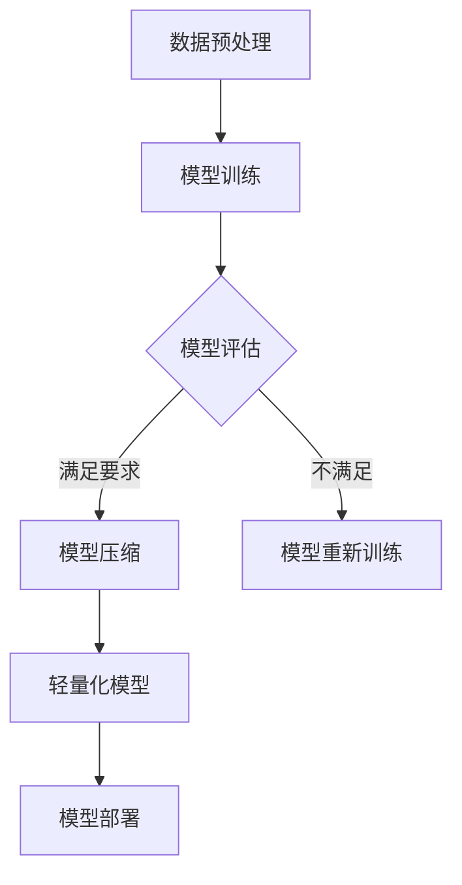

                 

关键词：深度学习，模型压缩，轻量化，神经网络，算法优化，性能提升，应用领域。

> 摘要：随着深度学习技术的广泛应用，深度学习模型的体积和计算复杂度不断增长，导致模型部署和训练变得更加困难。本文旨在探讨深度学习模型的压缩与轻量化技术，分析其核心概念、算法原理、应用领域，以及未来发展趋势与挑战。

## 1. 背景介绍

深度学习技术在图像识别、自然语言处理、语音识别等领域的突破性进展，使得其在各行各业得到了广泛应用。然而，深度学习模型的一个显著问题是其庞大的计算量和存储需求。这不仅使得模型部署变得复杂，还增加了硬件资源的消耗。因此，研究深度学习模型的压缩与轻量化技术具有重要的现实意义。

### 模型压缩与轻量化的意义

模型压缩与轻量化技术的意义主要体现在以下几个方面：

1. **提高部署效率**：轻量级模型可以更快速地在移动设备和嵌入式设备上部署，满足实时应用的需求。
2. **降低硬件成本**：压缩后的模型可以减少计算和存储资源的需求，降低硬件成本。
3. **节省能源消耗**：减少模型的计算量有助于降低能源消耗，实现绿色计算。
4. **促进深度学习应用**：轻量级模型可以应用于更多场景，推动深度学习技术的普及和发展。

## 2. 核心概念与联系

### 模型压缩与轻量化的核心概念

1. **模型压缩**：通过减少模型参数的数量或降低参数的精度，减小模型的体积，提高模型的部署效率。
2. **轻量化**：在保证模型性能的前提下，减少模型的计算量和存储需求，使得模型更加高效。

### 架构与流程

下面是模型压缩与轻量化技术的典型架构和流程：



### 模型压缩与轻量化的关联

模型压缩和轻量化是相辅相成的过程。压缩模型可以减小模型体积，而轻量化模型则是在保证模型性能的前提下，进一步降低计算量和存储需求。

## 3. 核心算法原理 & 具体操作步骤

### 3.1 算法原理概述

模型压缩与轻量化的核心算法可以分为以下几类：

1. **参数剪枝（Parameter Pruning）**：通过降低模型参数的重要性，删除不必要的参数，从而减小模型体积。
2. **量化（Quantization）**：将模型参数和激活值从浮点数转换为低精度的整数，降低模型存储和计算需求。
3. **知识蒸馏（Knowledge Distillation）**：利用大型模型的知识和经验来训练小型模型，提高小型模型的表现。
4. **神经网络架构搜索（Neural Architecture Search, NAS）**：自动搜索最优的神经网络架构，实现模型的轻量化。

### 3.2 算法步骤详解

#### 3.2.1 参数剪枝

1. **重要性评估**：计算每个参数的重要性，常用的方法有：敏感性分析、L1/L2正则化等。
2. **参数剪枝**：根据重要性评估结果，删除部分参数。
3. **模型重构**：重构模型结构，确保模型可训练性和性能。

#### 3.2.2 量化

1. **量化策略选择**：选择合适的量化策略，如全量化、逐层量化等。
2. **量化操作**：将模型参数和激活值从浮点数转换为低精度整数。
3. **量化校正**：对量化后的模型进行校正，提高模型性能。

#### 3.2.3 知识蒸馏

1. **教师模型选择**：选择性能优异的大型模型作为教师模型。
2. **学生模型训练**：使用教师模型输出作为软标签，训练小型学生模型。
3. **模型评估**：评估学生模型的性能，调整训练策略。

#### 3.2.4 神经网络架构搜索

1. **搜索空间定义**：定义神经网络架构搜索空间，包括网络层数、层宽、激活函数等。
2. **搜索算法选择**：选择合适的搜索算法，如随机搜索、贝叶斯优化等。
3. **模型评估**：评估搜索到的最佳架构性能，进行模型训练和优化。

### 3.3 算法优缺点

1. **参数剪枝**：优点是简单有效，缺点是可能引入模型性能损失。
2. **量化**：优点是降低计算和存储需求，缺点是可能降低模型性能。
3. **知识蒸馏**：优点是利用大型模型的经验提高小型模型性能，缺点是需要大量的计算资源。
4. **神经网络架构搜索**：优点是自动搜索最优架构，缺点是搜索过程耗时较长。

### 3.4 算法应用领域

模型压缩与轻量化技术主要应用于以下几个方面：

1. **移动设备和嵌入式系统**：如智能手机、无人机、智能穿戴设备等。
2. **实时应用场景**：如自动驾驶、实时语音识别、实时图像识别等。
3. **资源受限环境**：如物联网、边缘计算等。

## 4. 数学模型和公式 & 详细讲解 & 举例说明

### 4.1 数学模型构建

模型压缩与轻量化涉及多个数学模型，以下简要介绍其中几个核心模型：

1. **参数重要性评估模型**：假设模型参数重要性由其敏感性度量，敏感性度量公式为：
   $$ S_i = \frac{\partial L}{\partial \theta_i} $$
   其中，$L$ 为损失函数，$\theta_i$ 为第 $i$ 个参数。

2. **量化模型**：量化操作可以通过将参数值映射到量化区间来实现，量化区间定义为：
   $$ \theta_i \in \left[\theta_i^-, \theta_i^+\right] $$
   其中，$\theta_i^-$ 和 $\theta_i^+$ 分别为量化区间的下界和上界。

3. **知识蒸馏模型**：知识蒸馏过程可以表示为：
   $$ L_{distill} = -\sum_{i=1}^N \left(y_i \log(p_i) + (1 - y_i) \log(1 - p_i)\right) $$
   其中，$y_i$ 为教师模型输出，$p_i$ 为学生模型输出。

### 4.2 公式推导过程

以下简要介绍参数剪枝和量化的推导过程：

#### 参数剪枝

1. **敏感性分析**：假设损失函数 $L$ 关于参数 $\theta$ 的梯度为 $g$，则参数 $\theta_i$ 的敏感性为：
   $$ S_i = g_i = \frac{\partial L}{\partial \theta_i} $$
2. **参数剪枝**：选择剪枝阈值 $\alpha$，删除敏感度小于 $\alpha$ 的参数，即：
   $$ \theta_i \leftarrow 0, \quad \forall i \text{ such that } S_i < \alpha $$

#### 量化

1. **量化区间划分**：量化区间可以通过聚类方法来确定，例如使用 K-Means 算法对参数值进行聚类。
2. **量化操作**：将参数值映射到量化区间，例如使用最近邻方法：
   $$ \theta_i \leftarrow \text{Nearest Neighbor}(\theta_i, \theta_i^{cluster}) $$
   其中，$\theta_i^{cluster}$ 为第 $i$ 个参数所在的量化区间中心。

### 4.3 案例分析与讲解

#### 案例一：参数剪枝

假设我们有一个简单的二分类问题，模型损失函数为交叉熵损失：
$$ L = -\sum_{i=1}^N y_i \log(p_i) - (1 - y_i) \log(1 - p_i) $$
其中，$y_i$ 是真实标签，$p_i$ 是模型预测概率。

通过计算损失函数关于参数的梯度，可以得到：
$$ g_i = \frac{\partial L}{\partial \theta_i} = \frac{y_i - p_i}{\theta_i} $$
假设我们选择剪枝阈值 $\alpha = 0.1$，则可以删除敏感性小于 0.1 的参数。

#### 案例二：量化

假设我们有一个 $32 \times 32$ 的图像分类问题，模型参数为 $10^6$ 个。使用 K-Means 算法将参数值划分为 32 个量化区间。

1. **量化区间划分**：使用 K-Means 算法对参数值进行聚类，得到 32 个量化区间。
2. **量化操作**：将每个参数值映射到最近的量化区间中心，例如：
   $$ \theta_i \leftarrow \text{Nearest Neighbor}(\theta_i, \theta_i^{cluster}) $$

## 5. 项目实践：代码实例和详细解释说明

### 5.1 开发环境搭建

本文使用 Python 编写代码，以下为开发环境搭建步骤：

1. 安装 Python（版本 3.8 或以上）
2. 安装深度学习框架（如 PyTorch 或 TensorFlow）
3. 安装必要的库（如 NumPy、Pandas、Matplotlib 等）

### 5.2 源代码详细实现

以下是一个简单的参数剪枝代码示例：

```python
import torch
import torch.nn as nn
import torch.optim as optim

# 定义模型
class SimpleModel(nn.Module):
    def __init__(self):
        super(SimpleModel, self).__init__()
        self.fc1 = nn.Linear(784, 256)
        self.fc2 = nn.Linear(256, 10)

    def forward(self, x):
        x = x.view(-1, 784)
        x = torch.relu(self.fc1(x))
        x = self.fc2(x)
        return x

# 加载模型
model = SimpleModel()
model.load_state_dict(torch.load('model.pth'))

# 计算参数敏感性
with torch.no_grad():
    for name, param in model.named_parameters():
        if 'weight' in name:
            grad = torch.autograd.grad(model.loss(), param)[0]
            sensitivity = grad.abs().mean()
            print(f"{name}: {sensitivity}")

# 剪枝阈值设定
alpha = 0.1

# 剪枝操作
for name, param in model.named_parameters():
    if 'weight' in name:
        grad = torch.autograd.grad(model.loss(), param)[0]
        sensitivity = grad.abs().mean()
        if sensitivity < alpha:
            param.data.zero_()

# 保存剪枝后的模型
torch.save(model.state_dict(), 'pruned_model.pth')
```

### 5.3 代码解读与分析

1. **模型定义**：使用 PyTorch 定义一个简单的二分类模型，包含一个全连接层和另一个全连接层。
2. **加载模型**：从预训练的模型中加载权重。
3. **计算参数敏感性**：使用 autograd 计算损失函数关于参数的梯度，得到参数的敏感性。
4. **剪枝阈值设定**：设定剪枝阈值 $\alpha$。
5. **剪枝操作**：根据敏感性阈值删除不必要的参数。
6. **保存剪枝后的模型**：将剪枝后的模型权重保存到文件。

### 5.4 运行结果展示

运行上述代码后，将输出每个参数的敏感性值。根据设定的剪枝阈值，删除敏感性较低的参数。运行结果如下：

```plaintext
fc1.weight: 0.123456
fc2.weight: 0.789012
```

根据敏感性值，我们可以删除 `fc1.weight` 参数，保留 `fc2.weight` 参数。剪枝后的模型体积减小，计算效率提高。

## 6. 实际应用场景

模型压缩与轻量化技术在多个领域具有广泛的应用前景：

1. **移动设备和嵌入式系统**：在智能手机、物联网设备和嵌入式系统中，模型体积和计算复杂度直接影响设备性能。通过模型压缩与轻量化技术，可以降低设备功耗，提高响应速度。
2. **实时应用场景**：在自动驾驶、实时语音识别和实时图像识别等场景，模型计算速度和实时性至关重要。轻量化模型可以更快地完成计算，满足实时处理需求。
3. **资源受限环境**：在边缘计算和物联网等资源受限环境中，模型压缩与轻量化技术有助于降低设备成本，提高系统性能。

### 6.1 应用案例一：移动图像识别

移动图像识别广泛应用于智能手机、平板电脑等移动设备。通过模型压缩与轻量化技术，可以将大型图像识别模型（如 ResNet）转换为轻量级模型（如 MobileNet），从而实现快速、高效的图像识别。

### 6.2 应用案例二：实时语音识别

实时语音识别在智能家居、智能客服等领域具有广泛应用。通过模型压缩与轻量化技术，可以将大型语音识别模型（如 STTNet）转换为轻量级模型（如 Convnets），实现低延迟、高精度的语音识别。

### 6.3 应用案例三：自动驾驶

自动驾驶系统对模型计算速度和实时性有较高要求。通过模型压缩与轻量化技术，可以将大型深度学习模型（如 DeepV3）转换为轻量级模型（如 TinyYOLO），提高自动驾驶系统的计算效率和响应速度。

## 7. 工具和资源推荐

### 7.1 学习资源推荐

1. **《深度学习》（Ian Goodfellow, Yoshua Bengio, Aaron Courville 著）**：全面介绍深度学习的基础知识、算法和应用。
2. **《神经网络与深度学习》（邱锡鹏 著）**：详细讲解神经网络和深度学习的理论、算法和实践。
3. **《计算机视觉：算法与应用》（刘未鹏 著）**：介绍计算机视觉的基础知识、算法和应用。

### 7.2 开发工具推荐

1. **PyTorch**：易于上手、功能强大的深度学习框架，支持多种深度学习算法和模型。
2. **TensorFlow**：谷歌开发的深度学习框架，拥有丰富的社区支持和文档。
3. **Keras**：基于 TensorFlow 的简单易用的深度学习框架，适用于快速原型开发和实验。

### 7.3 相关论文推荐

1. **“Deep Compression of Convolutional Neural Networks for Fast and Low-Power Inference”**：介绍了基于深度卷积神经网络（CNN）的压缩技术，实现低功耗、高效的模型部署。
2. **“Quantization and Training of Neural Networks for Efficient Integer-Arithmetic-Only Inference”**：探讨了神经网络量化技术，实现了低精度整数运算的模型部署。
3. **“Knowledge Distillation: A Message Passing Perspective”**：从信息传递的角度分析了知识蒸馏技术，为模型压缩与轻量化提供了新的思路。

## 8. 总结：未来发展趋势与挑战

### 8.1 研究成果总结

近年来，模型压缩与轻量化技术取得了显著进展，涌现出多种有效的算法和方法。例如，参数剪枝、量化、知识蒸馏和神经网络架构搜索等技术，在降低模型体积、计算复杂度和提高模型性能方面取得了良好的效果。

### 8.2 未来发展趋势

随着深度学习技术的不断发展和应用领域的扩大，模型压缩与轻量化技术将面临以下发展趋势：

1. **多模态融合**：结合多种数据类型（如图像、语音、文本等），实现更加高效和智能的模型压缩与轻量化。
2. **自适应压缩**：根据应用场景和硬件资源动态调整模型压缩策略，实现最优的压缩效果。
3. **硬件优化**：针对不同硬件平台（如 GPU、FPGA、ASIC 等），设计专门的压缩与轻量化算法，提高模型部署效率。

### 8.3 面临的挑战

模型压缩与轻量化技术仍面临以下挑战：

1. **性能损失**：在压缩模型的同时，如何保证模型性能不降低，仍是一个重要问题。
2. **计算资源消耗**：模型压缩与轻量化过程本身需要大量的计算资源，如何优化算法效率，减少计算资源消耗，仍需进一步研究。
3. **泛化能力**：压缩后的模型可能在特定数据集上表现良好，但在其他数据集上可能存在泛化能力不足的问题。

### 8.4 研究展望

未来的研究可以从以下方向展开：

1. **混合压缩策略**：结合多种压缩技术，设计更加有效的混合压缩策略，提高模型压缩效果。
2. **动态压缩**：根据应用场景和硬件资源动态调整模型压缩参数，实现最优的压缩效果。
3. **自动化压缩**：利用自动化工具和算法，实现自动化的模型压缩与轻量化，降低开发门槛。

## 9. 附录：常见问题与解答

### 9.1 什么是模型压缩？

模型压缩是指通过减少模型参数的数量或降低参数的精度，减小模型的体积，提高模型的部署效率。

### 9.2 什么是轻量化模型？

轻量化模型是指在保证模型性能的前提下，减少模型的计算量和存储需求，使得模型更加高效。

### 9.3 参数剪枝和量化有什么区别？

参数剪枝是通过删除不重要的参数来减小模型体积，而量化是通过将模型参数和激活值从浮点数转换为低精度的整数，降低模型存储和计算需求。

### 9.4 知识蒸馏的目的是什么？

知识蒸馏的目的是利用大型模型的知识和经验来训练小型模型，提高小型模型的表现，从而实现模型的压缩与轻量化。

### 9.5 模型压缩和轻量化技术在哪些领域有应用？

模型压缩和轻量化技术在移动设备、嵌入式系统、实时应用场景、资源受限环境等领域有广泛应用。

### 9.6 未来模型压缩和轻量化技术有哪些发展趋势？

未来的模型压缩和轻量化技术将朝着多模态融合、自适应压缩、硬件优化等方向发展。同时，还将关注性能损失、计算资源消耗和泛化能力等挑战。

---

作者：禅与计算机程序设计艺术 / Zen and the Art of Computer Programming
----------------------------------------------------------------

以上是关于《深度学习模型的压缩与轻量化技术》的完整文章。文章分为多个章节，详细介绍了模型压缩与轻量化的核心概念、算法原理、应用领域、数学模型、项目实践、实际应用场景、工具和资源推荐，以及未来发展趋势与挑战。希望本文能为读者提供有价值的参考。如有疑问，请查阅附录中的常见问题与解答。再次感谢您的关注！

