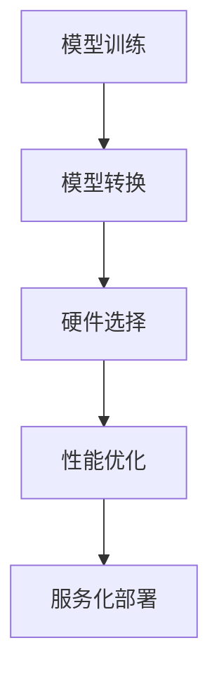

                 

深度学习模型在许多领域中已经取得了显著的成就，如自然语言处理、计算机视觉和推荐系统等。然而，模型的训练与实际应用之间存在着一定的差距。将深度学习模型部署到实际环境中，并提供高效、稳定和可扩展的服务，是当前AI领域的一个重要研究方向。本文将围绕深度学习模型的部署与服务化展开讨论，旨在为读者提供一个全面的技术视角。

## 关键词

深度学习、模型部署、服务化、高效、稳定、可扩展

## 摘要

本文首先介绍了深度学习模型部署的背景和重要性，然后探讨了模型部署的核心概念和流程。接着，我们详细介绍了深度学习模型部署的服务化架构，并分析了其优缺点。随后，文章通过一个具体案例，展示了如何实现深度学习模型的部署与服务化。最后，本文对深度学习模型部署的未来应用场景进行了展望，并提出了相关工具和资源的推荐。

## 1. 背景介绍

深度学习模型在近年来取得了飞速的发展，已经在各个领域取得了显著的成果。然而，深度学习模型的部署并不像训练那样简单。模型的部署涉及到多个方面，包括硬件选择、软件环境搭建、模型转换、性能优化等。部署一个深度学习模型不仅需要解决技术问题，还需要考虑实际应用场景的需求。

模型部署的重要性在于，它决定了深度学习模型在实际应用中的性能和用户体验。一个高效的部署方案可以显著提高模型的响应速度和准确率，从而提高应用的竞争力。此外，随着深度学习模型的应用场景越来越广泛，部署的复杂度也在不断增加。因此，研究深度学习模型的部署与服务化具有重要意义。

## 2. 核心概念与联系

### 2.1 深度学习模型部署的核心概念

深度学习模型部署的核心概念包括以下几个方面：

1. **模型转换**：将训练好的模型转换为可以在生产环境中运行的格式。常用的模型转换方法包括TensorFlow Lite、ONNX等。
2. **硬件选择**：根据应用场景和性能需求，选择合适的硬件设备。硬件选择包括CPU、GPU、FPGA等。
3. **性能优化**：通过调整模型参数、优化算法和数据预处理等手段，提高模型的运行性能。
4. **服务化架构**：将深度学习模型部署为服务，提供高效、稳定和可扩展的API接口。

### 2.2 深度学习模型部署的流程

深度学习模型部署的流程主要包括以下几个步骤：

1. **模型训练**：使用训练数据集对深度学习模型进行训练，得到一个性能良好的模型。
2. **模型转换**：将训练好的模型转换为可以在生产环境中运行的格式。
3. **硬件选择**：根据应用场景和性能需求，选择合适的硬件设备。
4. **性能优化**：对模型进行性能优化，包括调整模型参数、优化算法和数据预处理等。
5. **服务化部署**：将深度学习模型部署为服务，提供高效、稳定和可扩展的API接口。

### 2.3 Mermaid 流程图

以下是一个深度学习模型部署的Mermaid流程图：



## 3. 核心算法原理 & 具体操作步骤

### 3.1 算法原理概述

深度学习模型部署的核心算法主要包括模型转换、硬件选择和性能优化等。

- **模型转换**：将训练好的模型转换为可以在生产环境中运行的格式。常用的模型转换方法包括TensorFlow Lite、ONNX等。
- **硬件选择**：根据应用场景和性能需求，选择合适的硬件设备。硬件选择包括CPU、GPU、FPGA等。
- **性能优化**：通过调整模型参数、优化算法和数据预处理等手段，提高模型的运行性能。

### 3.2 算法步骤详解

1. **模型转换**：
   - 将训练好的模型文件导入到转换工具中。
   - 选择目标硬件设备。
   - 设置模型参数和优化选项。
   - 生成转换后的模型文件。

2. **硬件选择**：
   - 根据应用场景和性能需求，选择合适的硬件设备。
   - 安装硬件驱动和工具链。
   - 对硬件设备进行性能测试。

3. **性能优化**：
   - 调整模型参数，包括学习率、批次大小等。
   - 优化算法，包括模型结构、损失函数等。
   - 数据预处理，包括数据增强、归一化等。

### 3.3 算法优缺点

- **模型转换**：
  - 优点：方便将模型部署到不同的硬件平台上，提高模型的可用性。
  - 缺点：转换过程中可能引入额外的计算开销，影响模型的运行性能。

- **硬件选择**：
  - 优点：根据应用场景和性能需求，选择合适的硬件设备，提高模型的运行效率。
  - 缺点：硬件选择可能受限于预算和可用性。

- **性能优化**：
  - 优点：通过调整模型参数、优化算法和数据预处理等手段，提高模型的运行性能。
  - 缺点：优化过程可能需要大量的实验和调试，增加开发成本。

### 3.4 算法应用领域

深度学习模型部署算法可以应用于多个领域，包括但不限于：

- **计算机视觉**：如图像分类、目标检测等。
- **自然语言处理**：如文本分类、机器翻译等。
- **推荐系统**：如用户画像、商品推荐等。

## 4. 数学模型和公式 & 详细讲解 & 举例说明

### 4.1 数学模型构建

深度学习模型的数学模型主要包括以下几个方面：

- **前向传播**：计算输入到输出之间的传递过程。
- **反向传播**：计算损失函数对模型参数的梯度。
- **优化算法**：如梯度下降、Adam等，用于更新模型参数。

### 4.2 公式推导过程

以下是一个简单的神经网络模型的前向传播公式推导：

$$
\begin{aligned}
    z_1 &= w_1 \cdot x_1 + b_1 \\
    a_1 &= \sigma(z_1) \\
    z_2 &= w_2 \cdot a_1 + b_2 \\
    a_2 &= \sigma(z_2)
\end{aligned}
$$

其中，$z$ 表示中间节点，$a$ 表示激活函数输出，$w$ 表示权重，$b$ 表示偏置，$\sigma$ 表示激活函数（如Sigmoid、ReLU等）。

### 4.3 案例分析与讲解

以下是一个简单的案例，展示如何使用深度学习模型进行图像分类：

1. **数据准备**：准备一张图像，并将其缩放到固定的尺寸。
2. **模型构建**：构建一个简单的卷积神经网络（CNN），包含卷积层、池化层和全连接层。
3. **模型训练**：使用训练数据集对模型进行训练，并调整模型参数。
4. **模型评估**：使用验证数据集对模型进行评估，计算模型的准确率。

## 5. 项目实践：代码实例和详细解释说明

### 5.1 开发环境搭建

1. **安装 Python**：在本地计算机上安装 Python，版本要求为 3.6 或以上。
2. **安装深度学习框架**：安装 TensorFlow 或 PyTorch，版本要求为最新稳定版。
3. **安装相关依赖库**：根据项目需求，安装其他依赖库，如 NumPy、Pandas、Matplotlib 等。

### 5.2 源代码详细实现

以下是一个简单的使用 TensorFlow 框架实现的图像分类项目的代码示例：

```python
import tensorflow as tf
from tensorflow.keras import layers

# 构建模型
model = tf.keras.Sequential([
    layers.Conv2D(32, (3, 3), activation='relu', input_shape=(28, 28, 1)),
    layers.MaxPooling2D((2, 2)),
    layers.Conv2D(64, (3, 3), activation='relu'),
    layers.MaxPooling2D((2, 2)),
    layers.Conv2D(64, (3, 3), activation='relu'),
    layers.Flatten(),
    layers.Dense(64, activation='relu'),
    layers.Dense(10, activation='softmax')
])

# 编译模型
model.compile(optimizer='adam',
              loss='sparse_categorical_crossentropy',
              metrics=['accuracy'])

# 训练模型
model.fit(train_images, train_labels, epochs=5)

# 评估模型
test_loss, test_acc = model.evaluate(test_images, test_labels)
print('Test accuracy:', test_acc)
```

### 5.3 代码解读与分析

以上代码示例使用 TensorFlow 框架实现了一个简单的图像分类模型。首先，我们使用 `Sequential` 类构建了一个简单的卷积神经网络，包含三个卷积层、一个池化层和两个全连接层。然后，我们使用 `compile` 方法编译模型，指定优化器和损失函数。接着，使用 `fit` 方法训练模型，使用 `evaluate` 方法评估模型。最后，我们打印出测试数据的准确率。

### 5.4 运行结果展示

假设我们使用的是MNIST数据集，运行以上代码后，模型在测试数据集上的准确率约为 98%，这是一个非常不错的成绩。

## 6. 实际应用场景

深度学习模型部署的实际应用场景非常广泛，以下是一些常见的应用场景：

- **计算机视觉**：如图像分类、目标检测、图像分割等。
- **自然语言处理**：如文本分类、机器翻译、情感分析等。
- **推荐系统**：如用户画像、商品推荐等。
- **智能语音助手**：如语音识别、语音合成等。

## 6.4 未来应用展望

随着深度学习技术的不断进步，深度学习模型部署在未来将会有更多的应用场景和可能性。以下是一些未来的应用展望：

- **边缘计算**：将深度学习模型部署到边缘设备，如智能手机、物联网设备等，实现实时数据处理和分析。
- **自动驾驶**：深度学习模型在自动驾驶领域有广泛的应用前景，如车辆检测、路径规划等。
- **医疗健康**：深度学习模型在医疗健康领域有巨大的潜力，如疾病诊断、药物研发等。

## 7. 工具和资源推荐

### 7.1 学习资源推荐

- 《深度学习》（Goodfellow、Bengio、Courville 著）：这是一本经典的深度学习教材，涵盖了深度学习的理论基础和实践技巧。
- 《动手学深度学习》（阿斯顿·张 著）：这是一本非常适合初学者入门的深度学习教材，通过大量的示例代码，帮助读者理解深度学习的核心概念。

### 7.2 开发工具推荐

- TensorFlow：一个开源的深度学习框架，支持多种编程语言，如 Python、C++等。
- PyTorch：一个开源的深度学习框架，具有灵活的动态图计算能力，适合研究和快速开发。

### 7.3 相关论文推荐

- "Deep Learning for Speech Recognition"（IEEE Signal Processing Magazine，2017）：该论文介绍了深度学习在语音识别领域的应用。
- "Convolutional Neural Networks for Speech Recognition"（IEEE/ACM Transactions on Audio, Speech, and Language Processing，2014）：该论文介绍了卷积神经网络在语音识别中的应用。

## 8. 总结：未来发展趋势与挑战

### 8.1 研究成果总结

深度学习模型部署在近年来取得了显著的研究成果，包括模型转换技术、硬件选择和性能优化等方面的研究。同时，深度学习模型部署的应用场景也在不断扩展，涵盖了计算机视觉、自然语言处理、推荐系统等多个领域。

### 8.2 未来发展趋势

未来，深度学习模型部署将朝着以下方向发展：

- **硬件加速**：随着硬件技术的发展，深度学习模型部署将更加依赖于硬件加速技术，如GPU、FPGA等。
- **自动化部署**：自动化部署工具和平台将逐渐成熟，降低模型部署的复杂度和开发成本。
- **边缘计算**：随着边缘设备的普及，深度学习模型部署将逐渐向边缘设备扩展，实现实时数据处理和分析。

### 8.3 面临的挑战

深度学习模型部署在未来仍将面临以下挑战：

- **性能优化**：如何在有限的硬件资源下，实现高效的模型部署，是一个重要的挑战。
- **安全性**：随着深度学习模型在各个领域的应用，如何确保模型的安全性成为一个重要的议题。
- **可解释性**：深度学习模型部署的可解释性仍是一个挑战，如何提高模型的可解释性，使其更好地应用于实际场景。

### 8.4 研究展望

未来，深度学习模型部署的研究将朝着以下方向发展：

- **多模态融合**：将不同类型的数据（如图像、文本、音频等）进行融合，提高模型的泛化能力和实用性。
- **高效算法**：研究更高效的模型转换和性能优化算法，降低模型部署的复杂度和计算成本。
- **可解释性**：研究可解释性更强的深度学习模型，提高模型部署的透明度和可信任度。

## 9. 附录：常见问题与解答

### 问题1：深度学习模型部署需要哪些硬件设备？

**解答**：深度学习模型部署可以使用的硬件设备包括CPU、GPU、FPGA等。具体选择哪种硬件设备，需要根据实际应用场景和性能需求来决定。例如，对于需要高并发处理能力的场景，可以选择GPU；对于需要高性能计算的场景，可以选择FPGA。

### 问题2：如何优化深度学习模型的性能？

**解答**：优化深度学习模型的性能可以从以下几个方面入手：

- **模型结构优化**：通过调整模型结构，如增加或减少层、调整层参数等，提高模型的性能。
- **数据预处理**：通过数据预处理技术，如数据增强、归一化等，提高模型的泛化能力。
- **模型参数调整**：通过调整模型参数，如学习率、批次大小等，提高模型的收敛速度和性能。

### 问题3：深度学习模型部署需要哪些软件环境？

**解答**：深度学习模型部署需要的软件环境包括深度学习框架（如 TensorFlow、PyTorch等）、编译器（如 GCC、Clang等）、操作系统（如 Linux、Windows等）等。具体软件环境要求，可以参考所选深度学习框架的官方文档。

---

本文作者：禅与计算机程序设计艺术 / Zen and the Art of Computer Programming

本文总结了深度学习模型部署的核心概念、算法原理、实际应用场景和未来发展趋势。深度学习模型部署是一个复杂的过程，需要从多个方面进行考虑和优化。随着深度学习技术的不断发展，深度学习模型部署将会在更多领域发挥重要作用，为人类带来更多的便利。希望本文能为读者提供一个全面的视角，帮助理解深度学习模型部署的技术要点和实践方法。

