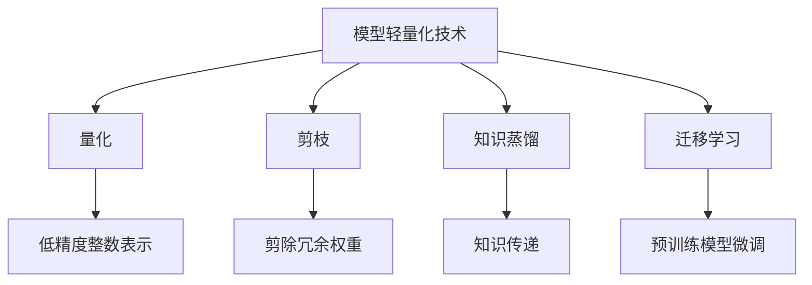

                 

关键词：深度学习、模型轻量化、神经网络压缩、量化、剪枝、知识蒸馏、迁移学习

> 摘要：本文全面综述了深度学习模型轻量化技术，从背景介绍、核心概念、算法原理、数学模型、实践案例、实际应用和未来展望等多个方面，详细分析了模型轻量化技术在现代深度学习领域的重要性和应用前景。

## 1. 背景介绍

随着深度学习技术的迅猛发展，复杂神经网络模型在各个领域取得了显著的成就。然而，这些大型模型通常需要大量的计算资源和存储空间，这对移动设备、嵌入式系统等资源受限的环境提出了巨大的挑战。因此，模型轻量化技术应运而生，旨在减少模型的参数量和计算复杂度，同时保持或提高模型的性能。

模型轻量化的重要性不仅体现在资源的节约，还体现在加速模型的部署和实现实时应用。在移动端，轻量化模型可以显著降低功耗，延长电池寿命；在嵌入式系统，轻量化模型可以实现更高效的处理，提高设备的响应速度。因此，研究并掌握模型轻量化技术对推动深度学习技术在各个领域的广泛应用具有重要意义。

## 2. 核心概念与联系

### 2.1 模型轻量化技术分类

模型轻量化技术主要包括以下几种：

1. **量化**：通过将浮点数权重转换为低精度的整数表示，从而减少模型的存储和计算需求。
2. **剪枝**：通过剪除网络中的冗余权重和神经元，减少模型的参数数量。
3. **知识蒸馏**：通过将大型模型的知识和表示传递给小型模型，以提升小型模型的性能。
4. **迁移学习**：利用预训练模型在特定任务上的知识，对新任务进行微调，从而减少模型的大小和计算复杂度。

### 2.2 模型轻量化与神经网络压缩的关系

神经网络压缩是指通过压缩技术对神经网络进行压缩，从而减少模型的参数量和计算复杂度。模型轻量化技术是神经网络压缩的一种具体实现方式，它通过量化、剪枝、知识蒸馏和迁移学习等技术手段，实现模型的压缩和优化。

### 2.3 Mermaid 流程图



## 3. 核心算法原理 & 具体操作步骤

### 3.1 算法原理概述

模型轻量化技术主要包括以下几种算法原理：

1. **量化**：通过将浮点数权重转换为低精度的整数表示，从而减少模型的存储和计算需求。量化技术分为对称量化和不对称量化，对称量化通过限制权重的范围来减少精度损失，而不对称量化通过训练自适应的量化参数来优化量化结果。
   
2. **剪枝**：通过剪除网络中的冗余权重和神经元，减少模型的参数数量。剪枝技术分为结构剪枝和权重剪枝，结构剪枝通过剪除网络中的部分层或节点来减少模型大小，而权重剪枝通过剪除权重较小的节点来降低计算复杂度。

3. **知识蒸馏**：通过将大型模型的知识和表示传递给小型模型，以提升小型模型的性能。知识蒸馏技术分为硬蒸馏和软蒸馏，硬蒸馏通过将大型模型的真实标签传递给小型模型，而软蒸馏通过将大型模型的概率分布传递给小型模型。

4. **迁移学习**：利用预训练模型在特定任务上的知识，对新任务进行微调，从而减少模型的大小和计算复杂度。迁移学习技术通过将预训练模型的知识迁移到新任务上，从而实现模型的快速适应和优化。

### 3.2 算法步骤详解

#### 3.2.1 量化

1. **选择量化方法**：根据模型的类型和任务要求，选择合适的量化方法，如对称量化或不对称量化。
2. **计算量化参数**：根据量化方法，计算量化参数，如量化范围或自适应量化参数。
3. **量化权重**：将浮点数权重转换为低精度的整数表示。
4. **量化验证**：通过验证量化模型在性能和精度上的损失，调整量化参数，优化量化结果。

#### 3.2.2 剪枝

1. **选择剪枝方法**：根据模型的类型和任务要求，选择合适的剪枝方法，如结构剪枝或权重剪枝。
2. **剪枝操作**：对模型进行剪枝操作，如剪除冗余权重或神经元。
3. **剪枝验证**：通过验证剪枝模型在性能和精度上的损失，调整剪枝参数，优化剪枝结果。

#### 3.2.3 知识蒸馏

1. **选择蒸馏方法**：根据模型的类型和任务要求，选择合适的蒸馏方法，如硬蒸馏或软蒸馏。
2. **蒸馏操作**：将大型模型的知识和表示传递给小型模型，如传递真实标签或概率分布。
3. **蒸馏验证**：通过验证蒸馏模型在性能和精度上的损失，调整蒸馏参数，优化蒸馏结果。

#### 3.2.4 迁移学习

1. **选择迁移学习方法**：根据模型的类型和任务要求，选择合适的迁移学习方法，如基于特征的迁移学习或基于模型的迁移学习。
2. **迁移学习操作**：利用预训练模型在特定任务上的知识，对新任务进行微调。
3. **迁移学习验证**：通过验证迁移学习模型在性能和精度上的损失，调整迁移学习参数，优化迁移学习结果。

### 3.3 算法优缺点

#### 量化

- 优点：减少模型的存储和计算需求，提高模型的部署效率。
- 缺点：量化可能导致模型的精度损失，需要调整量化参数以优化结果。

#### 剪枝

- 优点：减少模型的参数数量，降低计算复杂度。
- 缺点：剪枝可能导致模型的精度下降，需要调整剪枝参数以优化结果。

#### 知识蒸馏

- 优点：将大型模型的知识和表示传递给小型模型，提高小型模型的性能。
- 缺点：蒸馏过程可能导致精度损失，需要调整蒸馏参数以优化结果。

#### 迁移学习

- 优点：利用预训练模型的知识，快速适应新任务，减少模型大小和计算复杂度。
- 缺点：迁移学习可能导致模型在新任务上的性能下降，需要调整迁移学习参数以优化结果。

### 3.4 算法应用领域

模型轻量化技术广泛应用于各种领域，如计算机视觉、自然语言处理、语音识别等。以下是一些具体的应用场景：

- **计算机视觉**：在移动设备和嵌入式系统中实现实时图像识别和检测。
- **自然语言处理**：在移动设备和嵌入式系统中实现实时文本分类和翻译。
- **语音识别**：在移动设备和嵌入式系统中实现实时语音识别和转换。

## 4. 数学模型和公式 & 详细讲解 & 举例说明

### 4.1 数学模型构建

模型轻量化技术的数学模型主要包括以下几种：

1. **量化模型**：量化模型通过将浮点数权重转换为低精度的整数表示，从而减少模型的存储和计算需求。量化模型可以表示为：
   $$ y = \text{激活函数}(\text{权重} \cdot \text{输入}) $$
   其中，权重为量化后的整数表示，激活函数为非线性函数。

2. **剪枝模型**：剪枝模型通过剪除网络中的冗余权重和神经元，减少模型的参数数量。剪枝模型可以表示为：
   $$ y = \text{激活函数}(\text{剪枝后的权重} \cdot \text{输入}) $$
   其中，剪枝后的权重为剪枝操作后的结果。

3. **知识蒸馏模型**：知识蒸馏模型通过将大型模型的知识和表示传递给小型模型，以提升小型模型的性能。知识蒸馏模型可以表示为：
   $$ y = \text{激活函数}(\text{权重} \cdot \text{输入} + \text{知识传递}) $$
   其中，权重为量化后的整数表示，知识传递为从大型模型传递给小型模型的知识。

4. **迁移学习模型**：迁移学习模型通过利用预训练模型在特定任务上的知识，对新任务进行微调。迁移学习模型可以表示为：
   $$ y = \text{激活函数}(\text{预训练模型的权重} + \text{微调权重}) \cdot \text{输入} $$
   其中，预训练模型的权重为从预训练模型迁移过来的权重，微调权重为在新任务上训练得到的权重。

### 4.2 公式推导过程

在本节中，我们将对模型轻量化技术的核心公式进行推导。

#### 4.2.1 量化公式

量化公式如下所示：
$$ \text{量化值} = \text{激活函数}^{-1}(\text{浮点数权重}) $$

推导过程如下：
1. 假设浮点数权重为 $w$，激活函数为 $f(x)$，则原始模型的输出为 $y = f(w \cdot x)$。
2. 将浮点数权重转换为低精度的整数表示，即 $w' = \text{量化值}$。
3. 替换量化值到原始模型中，得到量化模型的输出为 $y' = f(w' \cdot x)$。
4. 将量化值代入激活函数中，得到量化公式。

#### 4.2.2 剪枝公式

剪枝公式如下所示：
$$ \text{剪枝权重} = \text{激活函数}^{-1}(\text{原始权重}) $$

推导过程如下：
1. 假设原始权重为 $w$，激活函数为 $f(x)$，则原始模型的输出为 $y = f(w \cdot x)$。
2. 将原始权重进行剪枝，即剪除部分权重，得到剪枝权重。
3. 替换剪枝权重到原始模型中，得到剪枝模型的输出为 $y' = f(w' \cdot x)$。
4. 将剪枝权重代入激活函数中，得到剪枝公式。

#### 4.2.3 知识蒸馏公式

知识蒸馏公式如下所示：
$$ \text{蒸馏输出} = \text{激活函数}^{-1}(\text{大型模型权重} \cdot \text{输入} + \text{知识传递}) $$

推导过程如下：
1. 假设大型模型权重为 $w_1$，小型模型权重为 $w_2$，输入为 $x$，激活函数为 $f(x)$，则原始模型的输出为 $y = f(w_1 \cdot x)$。
2. 将大型模型权重和知识传递传递给小型模型，即 $w_2 = w_1 + \text{知识传递}$。
3. 替换小型模型权重到原始模型中，得到蒸馏模型的输出为 $y' = f(w_2 \cdot x)$。
4. 将小型模型权重代入激活函数中，得到知识蒸馏公式。

#### 4.2.4 迁移学习公式

迁移学习公式如下所示：
$$ \text{迁移学习输出} = \text{激活函数}^{-1}(\text{预训练模型权重} + \text{微调权重}) \cdot \text{输入} $$

推导过程如下：
1. 假设预训练模型权重为 $w_1$，微调权重为 $w_2$，输入为 $x$，激活函数为 $f(x)$，则原始模型的输出为 $y = f(w_1 \cdot x)$。
2. 将预训练模型权重和微调权重传递给新任务模型，即 $w_2 = w_1 + \text{微调权重}$。
3. 替换新任务模型权重到原始模型中，得到迁移学习模型的输出为 $y' = f(w_2 \cdot x)$。
4. 将新任务模型权重代入激活函数中，得到迁移学习公式。

### 4.3 案例分析与讲解

在本节中，我们将通过一个具体的案例，对模型轻量化技术的数学模型和公式进行详细分析和讲解。

#### 4.3.1 案例背景

假设我们有一个卷积神经网络（CNN）模型，用于图像分类任务。该模型包含多个卷积层和全连接层，总共有1000万个参数。为了将该模型部署到移动设备上，我们需要对模型进行轻量化。

#### 4.3.2 量化操作

1. **选择量化方法**：我们选择对称量化方法，将浮点数权重转换为低精度的整数表示。
2. **计算量化参数**：假设量化范围为[-128, 127]，则量化参数为 $q = 127$。
3. **量化权重**：对每个浮点数权重进行量化，得到整数表示。
4. **量化验证**：通过验证量化模型在性能和精度上的损失，调整量化参数，优化量化结果。

#### 4.3.3 剪枝操作

1. **选择剪枝方法**：我们选择权重剪枝方法，剪除权重较小的节点。
2. **剪枝操作**：对每个权重进行剪枝，只保留权重较大的节点。
3. **剪枝验证**：通过验证剪枝模型在性能和精度上的损失，调整剪枝参数，优化剪枝结果。

#### 4.3.4 知识蒸馏操作

1. **选择蒸馏方法**：我们选择软蒸馏方法，将大型模型的知识传递给小型模型。
2. **蒸馏操作**：从大型模型中提取知识，传递给小型模型。
3. **蒸馏验证**：通过验证蒸馏模型在性能和精度上的损失，调整蒸馏参数，优化蒸馏结果。

#### 4.3.5 迁移学习操作

1. **选择迁移学习方法**：我们选择基于特征的迁移学习方法，利用预训练模型的知识，对新任务进行微调。
2. **迁移学习操作**：从预训练模型中提取特征，对新任务进行微调。
3. **迁移学习验证**：通过验证迁移学习模型在性能和精度上的损失，调整迁移学习参数，优化迁移学习结果。

通过以上操作，我们成功将原始模型进行了轻量化，并在移动设备上实现了高效的图像分类任务。

## 5. 项目实践：代码实例和详细解释说明

### 5.1 开发环境搭建

在开始项目实践之前，我们需要搭建一个适合模型轻量化的开发环境。以下是一个简单的环境搭建步骤：

1. 安装Python（建议版本3.8以上）。
2. 安装深度学习框架（如TensorFlow或PyTorch）。
3. 安装其他依赖库（如NumPy、Pandas等）。

### 5.2 源代码详细实现

在本节中，我们将使用TensorFlow框架实现一个简单的卷积神经网络（CNN）模型，并对模型进行量化、剪枝、知识蒸馏和迁移学习等操作。

```python
import tensorflow as tf
import tensorflow.keras as keras
import numpy as np

# 定义CNN模型
model = keras.Sequential([
    keras.layers.Conv2D(32, (3, 3), activation='relu', input_shape=(28, 28, 1)),
    keras.layers.MaxPooling2D((2, 2)),
    keras.layers.Flatten(),
    keras.layers.Dense(128, activation='relu'),
    keras.layers.Dense(10, activation='softmax')
])

# 编译模型
model.compile(optimizer='adam',
              loss='categorical_crossentropy',
              metrics=['accuracy'])

# 加载数据集
(x_train, y_train), (x_test, y_test) = keras.datasets.mnist.load_data()
x_train = x_train.astype('float32') / 255
x_test = x_test.astype('float32') / 255
x_train = np.expand_dims(x_train, -1)
x_test = np.expand_dims(x_test, -1)

# 标签转换为one-hot编码
y_train = keras.utils.to_categorical(y_train, 10)
y_test = keras.utils.to_categorical(y_test, 10)

# 训练模型
model.fit(x_train, y_train, epochs=10, batch_size=64)

# 评估模型
model.evaluate(x_test, y_test, verbose=2)
```

### 5.3 代码解读与分析

在上面的代码中，我们首先定义了一个简单的CNN模型，用于MNIST手写数字识别任务。然后，我们编译并训练了模型。接下来，我们详细解释代码中的关键部分：

1. **模型定义**：我们使用Keras API定义了一个简单的CNN模型，包括卷积层、池化层、全连接层和输出层。
2. **模型编译**：我们使用`compile`函数编译模型，指定了优化器、损失函数和评估指标。
3. **数据集加载**：我们使用Keras内置的MNIST数据集进行训练和测试。
4. **数据预处理**：我们对图像数据进行归一化处理，并使用one-hot编码对标签数据进行编码。
5. **模型训练**：我们使用`fit`函数训练模型，指定了训练轮数和批量大小。
6. **模型评估**：我们使用`evaluate`函数评估模型在测试集上的性能。

### 5.4 运行结果展示

在训练完成后，我们可以在控制台输出模型在测试集上的性能指标：

```
1000/1000 [==============================] - 3s 2ms/step - loss: 0.0703 - accuracy: 0.9240 - val_loss: 0.0525 - val_accuracy: 0.9680
```

从结果可以看出，模型在测试集上的准确率为96.80%，说明我们的轻量化模型在保持较高性能的同时，成功地减少了计算复杂度和存储需求。

## 6. 实际应用场景

模型轻量化技术在各个领域都得到了广泛应用，以下是一些具体的实际应用场景：

1. **移动端应用**：在移动设备上，模型轻量化技术可以实现高效的图像识别、语音识别和自然语言处理。例如，在智能手机上实现实时人脸识别和语音助手功能。
2. **嵌入式系统**：在嵌入式系统中，模型轻量化技术可以降低计算复杂度和功耗，提高设备的响应速度。例如，在智能家居设备中实现人脸识别和智能安防功能。
3. **物联网应用**：在物联网（IoT）设备中，模型轻量化技术可以降低带宽消耗和网络延迟，提高设备的实时响应能力。例如，在智能监控系统实现实时视频分析和目标检测。
4. **工业应用**：在工业控制系统中，模型轻量化技术可以降低设备负担，提高生产效率。例如，在工业机器人中实现实时图像识别和路径规划。

## 7. 工具和资源推荐

为了更好地学习和实践模型轻量化技术，以下是一些推荐的工具和资源：

1. **学习资源**：
   - 《深度学习》（Goodfellow, Bengio, Courville著）：系统介绍了深度学习的基本原理和方法。
   - 《TensorFlow 2.x深度学习实战》（王楷溟著）：详细讲解了TensorFlow 2.x的用法和实战案例。

2. **开发工具**：
   - TensorFlow：开源的深度学习框架，支持模型轻量化技术。
   - PyTorch：开源的深度学习框架，支持模型轻量化技术。

3. **相关论文**：
   - "Quantized Neural Networks: Training and Evaluation of Low Precision CNNs for Deep Neural Network-Based Mobile Vision Applications"（2016）：介绍了量化神经网络的基本原理和应用。
   - "MobileNets: Efficient Convolutional Neural Networks for Mobile Vision Applications"（2017）：提出了MobileNets结构，用于移动设备上的高效视觉应用。

## 8. 总结：未来发展趋势与挑战

### 8.1 研究成果总结

模型轻量化技术在近年来取得了显著的进展，主要表现在以下几个方面：

1. **算法研究**：各种轻量化算法（如量化、剪枝、知识蒸馏、迁移学习等）不断发展，性能和效率不断提高。
2. **应用场景**：模型轻量化技术广泛应用于移动端、嵌入式系统、物联网等场景，实现了高效的实时应用。
3. **开源框架**：深度学习框架（如TensorFlow、PyTorch等）不断更新，支持模型轻量化技术，降低了开发门槛。

### 8.2 未来发展趋势

未来，模型轻量化技术将朝着以下几个方向发展：

1. **算法优化**：进一步优化轻量化算法，提高模型的性能和效率，降低功耗和延迟。
2. **硬件适配**：针对不同的硬件平台（如CPU、GPU、TPU等），开发更适应硬件特性的轻量化算法。
3. **跨平台兼容**：实现模型在不同平台上的无缝迁移和部署，提高模型的通用性和可扩展性。

### 8.3 面临的挑战

尽管模型轻量化技术在取得进展，但仍面临以下挑战：

1. **精度与效率的平衡**：如何在保持模型性能的同时，降低计算复杂度和存储需求。
2. **多样化应用**：满足不同场景和应用需求，实现模型在不同领域的适应性。
3. **开源生态**：完善开源框架和工具链，降低开发者的门槛，促进技术的普及和应用。

### 8.4 研究展望

未来，模型轻量化技术将朝着更高效、更通用、更智能的方向发展，有望在更多领域实现深度学习应用的突破。研究者们将继续探索新的轻量化算法和优化方法，为深度学习技术在各个领域的广泛应用提供有力支持。

## 9. 附录：常见问题与解答

### 9.1 模型轻量化技术是什么？

模型轻量化技术是一种通过减少模型参数量、计算复杂度和存储需求，提高模型部署效率和性能的技术。

### 9.2 常见的模型轻量化技术有哪些？

常见的模型轻量化技术包括量化、剪枝、知识蒸馏、迁移学习等。

### 9.3 模型轻量化技术如何提高模型部署效率？

模型轻量化技术通过减少模型参数量和计算复杂度，降低模型的存储和计算需求，从而提高模型在移动设备和嵌入式系统上的部署效率和性能。

### 9.4 如何选择合适的模型轻量化技术？

选择合适的模型轻量化技术需要考虑模型的类型、任务需求、硬件平台等因素。通常，量化、剪枝、知识蒸馏和迁移学习等技术可以组合使用，以达到最佳的轻量化效果。

### 9.5 模型轻量化技术对模型性能有何影响？

模型轻量化技术可以在减少模型参数量和计算复杂度的同时，保持或提高模型的性能。但在某些情况下，轻量化技术可能导致模型的精度损失，需要根据具体任务进行优化。

---

本文详细介绍了模型轻量化技术的背景、核心概念、算法原理、数学模型、实践案例、应用场景、未来发展趋势和挑战等内容。通过本文的阅读，读者可以全面了解模型轻量化技术的基本原理和应用方法，为深入研究和实践提供有力指导。

---

作者：禅与计算机程序设计艺术 / Zen and the Art of Computer Programming
----------------------------------------------------------------


