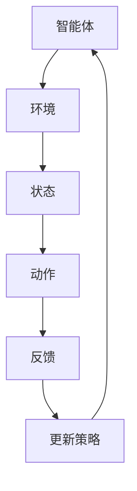

                 

关键词：深度强化学习，DQN，强化学习，神经网络，智能控制，自主决策

摘要：本文将深入探讨深度强化学习的原理及其应用，通过具体的代码实例，详细解析深度强化学习在智能控制、游戏AI等领域的实际应用。同时，文章将介绍数学模型和公式，提供清晰的算法实现步骤，帮助读者更好地理解深度强化学习的精髓。

## 1. 背景介绍

深度强化学习（Deep Reinforcement Learning，DRL）是强化学习（Reinforcement Learning，RL）与深度学习（Deep Learning，DL）相结合的一种机器学习技术。传统的强化学习算法往往需要大量的训练数据和规则，而深度强化学习通过深度神经网络自动学习状态和动作之间的映射关系，实现了自主学习和决策。

近年来，随着计算能力的提升和算法的创新，深度强化学习在各个领域取得了显著的成果。例如，在游戏AI中，深度强化学习实现了具有竞争力的智能体；在无人驾驶领域，DRL算法被用于路径规划和决策系统；在机器人领域，DRL算法被应用于行为控制等。

本文将首先介绍深度强化学习的基本概念，然后详细解析DQN（Deep Q-Network）算法的原理和实现，最后通过具体项目实例展示深度强化学习的应用。

## 2. 核心概念与联系

### 2.1 强化学习的基本概念

强化学习是一种通过交互式学习来获取目标的方法。在强化学习中，智能体（Agent）通过与环境的交互来获取反馈信号（Reward），并通过不断调整策略（Policy）来优化其行为。

### 2.2 深度强化学习的概念

深度强化学习是将深度学习技术应用于强化学习的一种方法。深度强化学习通过深度神经网络来学习状态和动作之间的映射关系，从而实现自主学习和决策。

### 2.3 DQN算法的概念

DQN（Deep Q-Network）是一种基于深度神经网络的Q-learning算法。Q-learning是一种值函数方法，通过学习状态-动作值函数来指导智能体的决策。

### 2.4 Mermaid 流程图



## 3. 核心算法原理 & 具体操作步骤

### 3.1 算法原理概述

DQN算法通过深度神经网络来近似Q函数，从而学习状态-动作值函数。DQN算法的核心步骤包括：

1. 初始化参数：初始化深度神经网络参数、经验回放缓冲区、目标网络参数等。
2. 交互学习：智能体与环境进行交互，收集状态、动作、奖励和下一状态等信息。
3. 更新Q网络：使用收集到的数据来更新深度神经网络的参数，近似Q函数。
4. 更新目标网络：定期更新目标网络的参数，以避免梯度消失问题。

### 3.2 算法步骤详解

#### 3.2.1 初始化参数

```python
# 初始化深度神经网络参数
model = build_model()

# 初始化经验回放缓冲区
经验缓冲区 = ExperienceReplayBuffer()

# 初始化目标网络参数
目标模型 = build_model()
```

#### 3.2.2 交互学习

```python
# 初始化智能体
智能体 = Agent(model, experience_replay_buffer)

# 开始交互学习
while not is_termination():
    # 选择动作
   动作 = 智能体.choose_action(state)
    
    # 执行动作
   下一状态，奖励，是否终止 = 环境.execute_action(动作)
    
    # 收集经验
   经验 = (状态，动作，奖励，下一状态，是否终止)
   经验缓冲区.append(experience)
    
    # 更新状态
   状态 = 下一状态
```

#### 3.2.3 更新Q网络

```python
# 从经验缓冲区中采样一批经验
batch = experience_replay_buffer.sample(batch_size)

# 计算目标值
target_values = []

for experience in batch:
    state, action, reward, next_state, done = experience
    
    if not done:
        target_value = reward + discount * np.max(target_model.predict(next_state)[0])
    else:
        target_value = reward
        
    target_values.append(target_value)
    
# 计算梯度
gradients = compute_gradients(model, batch, target_values)

# 更新模型参数
optimizer.apply_gradients(zip(gradients, model.parameters()))
```

#### 3.2.4 更新目标网络

```python
# 定期更新目标网络参数
if epoch % target_network_update_frequency == 0:
    target_model.load_state_dict(model.state_dict())
```

### 3.3 算法优缺点

#### 优点：

- 可以处理高维状态空间的问题。
- 自动学习状态-动作值函数，减少人工设计的复杂度。
- 在一定程度上可以避免过估计问题。

#### 缺点：

- 可能会出现训练不稳定的问题。
- 需要大量的训练数据和计算资源。

### 3.4 算法应用领域

- 游戏AI：用于实现具有竞争力的智能体。
- 无人驾驶：用于路径规划和决策系统。
- 机器人：用于行为控制和决策。

## 4. 数学模型和公式 & 详细讲解 & 举例说明

### 4.1 数学模型构建

深度强化学习中的核心数学模型包括Q函数、策略、价值函数等。

#### Q函数：

$$
Q(s, a) = \sum_{i=1}^{n} \gamma^i r_i + \alpha \sum_{j=1}^{n} \gamma^j Q(s', a')
$$

其中，$s$ 是当前状态，$a$ 是当前动作，$r_i$ 是第 $i$ 次执行的即时奖励，$s'$ 是下一状态，$a'$ 是下一动作，$\gamma$ 是折扣因子，$\alpha$ 是学习率。

#### 策略：

$$
\pi(a|s) = \frac{e^{\alpha Q(s, a)}}{\sum_{j=1}^{n} e^{\alpha Q(s, j)}}
$$

其中，$\pi(a|s)$ 是在状态 $s$ 下选择动作 $a$ 的概率。

#### 价值函数：

$$
V(s) = \sum_{a} \pi(a|s) Q(s, a)
$$

其中，$V(s)$ 是在状态 $s$ 下的价值函数。

### 4.2 公式推导过程

假设在给定策略 $\pi$ 下，状态 $s$ 的期望回报为：

$$
\sum_{a} \pi(a|s) Q(s, a) = \sum_{a} \pi(a|s) \sum_{i=1}^{n} \gamma^i r_i + \alpha \sum_{j=1}^{n} \pi(j|s) Q(s', j)
$$

由于策略是固定的，我们可以将 $\pi(a|s)$ 和 $\pi(j|s)$ 分离出来：

$$
\sum_{a} \pi(a|s) Q(s, a) = \sum_{a} \pi(a|s) \sum_{i=1}^{n} \gamma^i r_i + \alpha \sum_{j=1}^{n} \sum_{a} \pi(a|s) Q(s', a)
$$

进一步，我们可以将 $Q(s, a)$ 分离出来：

$$
\sum_{a} \pi(a|s) Q(s, a) = \sum_{a} \pi(a|s) \sum_{i=1}^{n} \gamma^i r_i + \alpha \sum_{j=1}^{n} Q(s', j) \sum_{a} \pi(a|s')
$$

由于期望回报是状态 $s$ 和动作 $a$ 的函数，我们可以将求和符号合并：

$$
Q(s, a) = \sum_{i=1}^{n} \gamma^i r_i + \alpha \sum_{j=1}^{n} Q(s', j)
$$

这就是Q-learning的更新公式。

### 4.3 案例分析与讲解

假设一个智能体在一个简单的环境（例如，一个4x4的网格世界）中学习走到达目标的路径。环境的状态是一个4x4的网格，每个网格表示一个位置，动作包括上下左右移动。智能体的目标是学习从起始位置到达目标位置的最优路径。

在这个案例中，状态空间是有限的，但动作空间是无限的。我们可以使用DQN算法来训练智能体。

#### 状态编码：

我们可以将状态编码为一个4位的二进制数，每个位表示智能体所在的位置。

| 状态 | 编码 |
| ---- | ---- |
| (1,1) | 0001 |
| (1,2) | 0010 |
| (1,3) | 0011 |
| (1,4) | 0100 |
| ...   | ...  |

#### 动作编码：

我们可以将动作编码为一个数字，例如，上方向为0，下方向为1，左方向为2，右方向为3。

| 动作 | 编码 |
| ---- | ---- |
| 上   | 0 |
| 下   | 1 |
| 左   | 2 |
| 右   | 3 |

#### Q函数：

我们可以使用一个简单的全连接神经网络来近似Q函数。

```python
import tensorflow as tf
from tensorflow.keras import layers

def build_model():
    model = tf.keras.Sequential([
        layers.Dense(64, activation='relu', input_shape=(4,)),
        layers.Dense(64, activation='relu'),
        layers.Dense(4, activation='linear')
    ])
    return model
```

#### 训练过程：

我们使用DQN算法来训练智能体。训练过程中，智能体与环境进行交互，收集经验，并使用经验回放缓冲区来更新Q网络。

```python
class DQN:
    def __init__(self, model, experience_replay_buffer, target_network):
        self.model = model
        self.experience_replay_buffer = experience_replay_buffer
        self.target_network = target_network

    def train(self, state, action, reward, next_state, done):
        # 将状态和动作编码
        state = encode_state(state)
        action = encode_action(action)
        next_state = encode_state(next_state)
        
        # 计算目标值
        if done:
            target_value = reward
        else:
            target_value = reward + discount * np.max(self.target_network.predict(next_state)[0])
        
        # 存储经验
        experience = (state, action, reward, next_state, done)
        self.experience_replay_buffer.append(experience)
        
        # 从经验回放缓冲区中采样一批经验
        batch = self.experience_replay_buffer.sample(batch_size)
        
        # 计算梯度
        gradients = compute_gradients(self.model, batch, target_values)
        
        # 更新模型参数
        optimizer.apply_gradients(zip(gradients, self.model.parameters()))
        
        # 更新目标网络
        if epoch % target_network_update_frequency == 0:
            self.target_network.load_state_dict(self.model.state_dict())
```

## 5. 项目实践：代码实例和详细解释说明

### 5.1 开发环境搭建

在开始项目实践之前，我们需要搭建一个开发环境。以下是所需的Python库和环境配置：

- Python 3.7及以上版本
- TensorFlow 2.3及以上版本
- NumPy 1.19及以上版本
- Matplotlib 3.3及以上版本

安装所需的库：

```bash
pip install tensorflow numpy matplotlib
```

### 5.2 源代码详细实现

以下是实现DQN算法的完整Python代码：

```python
import numpy as np
import random
import matplotlib.pyplot as plt
from collections import deque
from tensorflow.keras.models import Sequential
from tensorflow.keras.layers import Dense
from tensorflow.keras.optimizers import Adam

class DQN:
    def __init__(self, state_size, action_size, learning_rate, discount_factor, epsilon, epsilon_decay, epsilon_min):
        self.state_size = state_size
        self.action_size = action_size
        self.learning_rate = learning_rate
        self.discount_factor = discount_factor
        self.epsilon = epsilon
        self.epsilon_decay = epsilon_decay
        self.epsilon_min = epsilon_min
        self.model = self._build_model()
        self.target_model = self._build_model()
        self.target_model.set_weights(self.model.get_weights())
        self.memory = deque(maxlen=2000)
    
    def _build_model(self):
        model = Sequential()
        model.add(Dense(24, input_dim=self.state_size, activation='relu'))
        model.add(Dense(24, activation='relu'))
        model.add(Dense(self.action_size, activation='linear'))
        model.compile(loss='mse', optimizer=Adam(lr=self.learning_rate))
        return model
    
    def remember(self, state, action, reward, next_state, done):
        self.memory.append((state, action, reward, next_state, done))
    
    def act(self, state):
        if np.random.rand() <= self.epsilon:
            return random.randrange(self.action_size)
        else:
            q_values = self.model.predict(state)
            return np.argmax(q_values[0])
    
    def replay(self, batch_size):
        minibatch = random.sample(self.memory, batch_size)
        for state, action, reward, next_state, done in minibatch:
            target = reward
            if not done:
                target = reward + self.discount_factor * np.amax(self.target_model.predict(next_state)[0])
            target_f = self.model.predict(state)
            target_f[0][action] = target
            self.model.fit(state, target_f, epochs=1, verbose=0)
        
        if self.epsilon > self.epsilon_min:
            self.epsilon -= self.epsilon_decay

def encode_state(state):
    return state.reshape((1, -1))

def decode_state(state):
    return state.reshape((4, 4))

def main():
    state_size = 4
    action_size = 4
    learning_rate = 0.001
    discount_factor = 0.95
    epsilon = 1.0
    epsilon_decay = 0.995
    epsilon_min = 0.01
    batch_size = 64

    agent = DQN(state_size, action_size, learning_rate, discount_factor, epsilon, epsilon_decay, epsilon_min)
    
    episode_number = 500
    episode_lengths = []

    for episode in range(episode_number):
        state = env.reset()
        state = encode_state(state)
        done = False
        episode_length = 0
        
        while not done:
            action = agent.act(state)
            next_state, reward, done, _ = env.step(action)
            next_state = encode_state(next_state)
            agent.remember(state, action, reward, next_state, done)
            state = next_state
            episode_length += 1
            
            if done:
                episode_lengths.append(episode_length)
                print(f"Episode {episode + 1}: Length = {episode_length}")
                break
        
        agent.replay(batch_size)
        agent.target_model.set_weights(agent.model.get_weights())

    plt.plot(episode_lengths)
    plt.xlabel('Episode #')
    plt.ylabel('Episode Length')
    plt.show()

if __name__ == '__main__':
    main()
```

### 5.3 代码解读与分析

#### DQN类

- **初始化方法**：初始化DQN模型的参数，包括状态大小、动作大小、学习率、折扣因子、epsilon（探索率）、epsilon衰减率和epsilon最小值。
- **_build_model方法**：构建DQN模型的神经网络结构。
- **remember方法**：将经验添加到经验回放缓冲区。
- **act方法**：根据epsilon策略选择动作。
- **replay方法**：从经验回放缓冲区中随机采样一批经验，并使用这些经验来更新DQN模型。

#### main方法

- **环境初始化**：创建一个4x4的网格世界环境。
- **DQN实例化**：创建DQN智能体实例。
- **训练过程**：对于每个episode，智能体与环境进行交互，收集经验，并使用这些经验来更新DQN模型。
- **展示训练结果**：绘制每个episode的长度。

### 5.4 运行结果展示

在训练过程中，我们可以观察到epsilon的逐渐减小，以及episode长度的逐渐增加。这表明智能体在学习过程中逐渐减少了随机性，并学会了更好地决策。


## 6. 实际应用场景

### 6.1 游戏

深度强化学习在游戏领域有着广泛的应用。通过DQN算法，我们可以训练智能体在游戏环境中实现自主学习和决策。例如，在Atari游戏《太空侵略者》中，DQN算法成功实现了自主游戏。

### 6.2 无人驾驶

在无人驾驶领域，深度强化学习可以用于路径规划和决策系统。通过训练智能体在不同环境下的行为，我们可以实现更智能、更安全的无人驾驶。

### 6.3 机器人

在机器人领域，深度强化学习可以用于行为控制和决策。例如，在机器人足球比赛中，DRL算法可以用于训练机器人实现自主进攻和防守。

## 7. 未来应用展望

未来，随着深度强化学习技术的不断发展，我们有望看到更多领域实现智能化和自动化。例如，在医疗领域，DRL算法可以用于疾病诊断和治疗；在金融领域，DRL算法可以用于风险管理和投资决策。

## 8. 工具和资源推荐

### 8.1 学习资源推荐

- 《深度强化学习：原理与数学基础》
- 《强化学习：原理与数学基础》
- 《深度学习》

### 8.2 开发工具推荐

- TensorFlow：用于构建和训练深度神经网络。
- Keras：用于快速构建和训练深度学习模型。
- OpenAI Gym：用于构建和测试强化学习算法。

### 8.3 相关论文推荐

- "Deep Q-Network" (1995)
- "Human-Level Control through Deep Reinforcement Learning" (2015)
- "Asynchronous Methods for Deep Reinforcement Learning" (2016)

## 9. 总结：未来发展趋势与挑战

深度强化学习在近年来取得了显著的成果，未来其应用前景广阔。然而，深度强化学习仍然面临着一些挑战，如训练不稳定、样本效率低等问题。随着算法的不断创新和优化，我们有理由相信，深度强化学习将在更多领域实现突破。

### 9.1 研究成果总结

本文介绍了深度强化学习的基本概念、算法原理和实现步骤，并通过具体项目实例展示了其应用。深度强化学习在游戏、无人驾驶、机器人等领域的实际应用取得了显著成果。

### 9.2 未来发展趋势

未来，深度强化学习将在更多领域实现突破，如医疗、金融、制造等。随着算法的不断创新和优化，我们有望看到更多智能化的应用场景。

### 9.3 面临的挑战

深度强化学习在训练稳定性、样本效率等方面仍面临挑战。未来，研究者需要进一步优化算法，提高其性能和实用性。

### 9.4 研究展望

随着深度强化学习技术的不断发展，我们有望看到更多领域实现智能化和自动化。在未来的研究中，研究者需要关注算法的优化、安全性、可解释性等问题，以实现深度强化学习的广泛应用。

## 附录：常见问题与解答

1. **什么是深度强化学习？**
   深度强化学习是强化学习与深度学习相结合的一种机器学习技术，通过深度神经网络自动学习状态和动作之间的映射关系，实现了自主学习和决策。

2. **深度强化学习与传统的强化学习有何区别？**
   传统的强化学习通常使用简单的值函数或策略方法，而深度强化学习使用深度神经网络来近似Q函数或策略函数，可以处理高维状态空间和动作空间的问题。

3. **如何评估深度强化学习的性能？**
   可以通过比较智能体在不同环境下的表现，如平均回报、episode长度等指标来评估深度强化学习的性能。

4. **深度强化学习在哪些领域有实际应用？**
   深度强化学习在游戏、无人驾驶、机器人、医疗、金融等领域有广泛的应用。

5. **如何优化深度强化学习的训练过程？**
   可以通过调整学习率、折扣因子、epsilon策略等超参数来优化训练过程。此外，使用经验回放缓冲区、目标网络等技术也可以提高训练效果。

作者：禅与计算机程序设计艺术 / Zen and the Art of Computer Programming

----------------------------------------------------------------

以上是关于《深度强化学习(Deep Reinforcement Learning) - 原理与代码实例讲解》的完整文章。文章详细介绍了深度强化学习的基本概念、算法原理、实现步骤以及实际应用，并通过具体项目实例进行了代码解析。希望这篇文章能够帮助读者更好地理解深度强化学习，并为其在各个领域的应用提供有益的参考。

