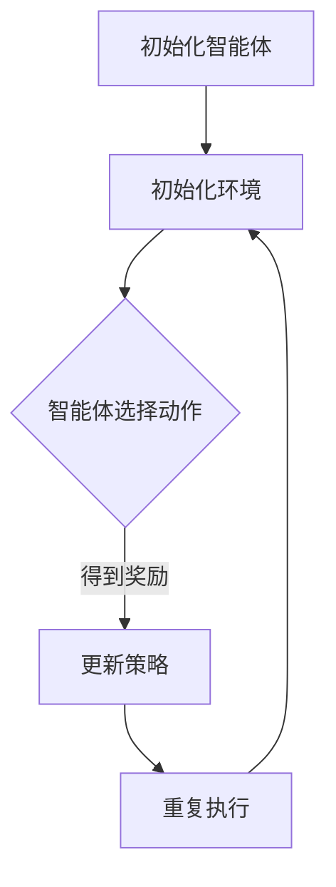

                 

关键词：深度强化学习、人工智能、智能体、自主学习、算法原理、数学模型、应用领域、未来发展

## 摘要

深度强化学习是人工智能领域的一项重要技术，它通过结合深度学习和强化学习的方法，实现了智能体在复杂环境中的自主学习和决策。本文将详细介绍深度强化学习的核心概念、算法原理、数学模型以及实际应用场景，并对未来的发展趋势和面临的挑战进行探讨。

## 1. 背景介绍

在过去的几十年中，人工智能（AI）技术取得了显著的进展。从早期的规则推理、知识表示，到现代的深度学习和强化学习，人工智能的应用场景日益广泛，从自然语言处理、计算机视觉，到自动驾驶、游戏AI等。然而，传统的人工智能方法在处理复杂、动态和不确定的环境中存在一定的局限性。为了解决这些问题，研究者们提出了深度强化学习（Deep Reinforcement Learning，简称DRL）这一新兴的技术。

深度强化学习是强化学习（Reinforcement Learning，简称RL）和深度学习（Deep Learning，简称DL）的结合。强化学习是一种通过环境反馈来学习行为策略的方法，它通过不断尝试和错误来优化决策。深度学习则是一种基于多层神经网络的学习方法，它能够自动提取数据中的特征表示。将这两种方法结合起来，可以实现智能体在复杂环境中的自主学习和决策。

## 2. 核心概念与联系

### 2.1 强化学习

强化学习是一种基于奖励和惩罚机制的学习方法。智能体（Agent）通过与环境（Environment）的交互，不断尝试不同的动作（Action），并根据环境给出的奖励（Reward）来调整自己的策略（Policy）。策略是一个映射函数，它将状态（State）映射到动作。强化学习的目标是通过最大化累积奖励，来学习一个最优策略。

### 2.2 深度学习

深度学习是一种基于多层神经网络的学习方法。它通过多个隐藏层对输入数据进行多次变换，从而自动提取数据中的复杂特征表示。深度学习在图像识别、语音识别、自然语言处理等领域取得了显著的成果。深度学习的核心是神经网络的训练，它通过反向传播算法来优化网络参数，以达到对输入数据的准确预测。

### 2.3 深度强化学习

深度强化学习是将深度学习和强化学习相结合的一种方法。它通过深度神经网络来表示状态和动作，从而实现智能体在复杂环境中的自主学习和决策。深度强化学习的关键挑战是如何在深度神经网络中引入强化学习的奖励机制，以及如何有效地优化神经网络参数。

### 2.4 Mermaid 流程图

以下是一个简单的Mermaid流程图，展示了深度强化学习的基本流程：



## 3. 核心算法原理 & 具体操作步骤

### 3.1 算法原理概述

深度强化学习的基本原理是利用深度神经网络来学习智能体的策略，从而实现自主学习和决策。具体来说，智能体首先通过深度神经网络来对当前状态进行编码，得到状态表示；然后，根据状态表示和预定义的策略网络，选择一个动作；执行动作后，智能体会根据环境反馈的奖励信号，更新策略网络。这个过程不断循环，直到达到预定的目标或策略收敛。

### 3.2 算法步骤详解

1. 初始化环境：创建一个模拟环境，用于与智能体进行交互。

2. 初始化智能体：初始化智能体的状态、动作空间和策略网络。

3. 运行智能体：智能体根据当前状态，通过策略网络选择一个动作。

4. 执行动作：在环境中执行选择到的动作，并获取环境反馈的奖励信号。

5. 更新策略：根据当前状态、动作和奖励信号，更新策略网络。

6. 返回状态：将执行动作后的状态作为下一次迭代的初始状态。

7. 重复执行：重复执行步骤3至步骤6，直到达到预定的目标或策略收敛。

### 3.3 算法优缺点

**优点：**

- 能够自动提取复杂的状态特征表示，适用于处理复杂、动态和不确定的环境。
- 能够通过自主学习来优化策略，无需手动设计规则。

**缺点：**

- 训练过程可能需要大量时间和计算资源。
- 策略网络可能难以解释和理解。

### 3.4 算法应用领域

深度强化学习在多个领域取得了显著的应用成果，包括：

- 自动驾驶：通过深度强化学习，自动驾驶车辆可以自动学习如何在复杂环境中做出决策，以提高行驶安全和效率。
- 游戏AI：深度强化学习在游戏AI领域取得了很大的成功，例如AlphaGo在围棋比赛中击败了人类世界冠军。
- 机器人控制：通过深度强化学习，机器人可以自动学习在复杂环境中的运动和操作策略，以提高其自主性和灵活性。

## 4. 数学模型和公式 & 详细讲解 & 举例说明

### 4.1 数学模型构建

在深度强化学习中，主要涉及以下几个数学模型：

1. 状态表示：使用深度神经网络对状态进行编码，得到状态表示。
2. 动作选择：使用策略网络，将状态表示映射到动作概率分布。
3. 奖励信号：根据环境反馈的奖励信号，更新策略网络。

### 4.2 公式推导过程

假设智能体的状态空间为 $S$，动作空间为 $A$，策略网络为 $\pi(\cdot | s)$，价值函数为 $V(s)$，奖励信号为 $r(s, a)$。则深度强化学习的目标是最大化累积奖励：

$$
J(\theta) = \sum_{s \in S} p(s) \sum_{a \in A} \pi(a | s) V(s)
$$

其中，$p(s)$ 为状态分布，$\theta$ 为策略网络的参数。

为了实现这个目标，可以使用策略梯度算法来优化策略网络参数：

$$
\theta \leftarrow \theta - \alpha \nabla_{\theta} J(\theta)
$$

其中，$\alpha$ 为学习率。

### 4.3 案例分析与讲解

假设我们考虑一个简单的迷宫问题，智能体需要从一个初始状态移动到目标状态。我们可以将状态表示为一个二元向量，其中第一个元素表示智能体在水平方向的位置，第二个元素表示智能体在垂直方向的位置。动作空间包括上下左右四个方向。

为了解决这个问题，我们可以定义一个深度神经网络，用于对状态进行编码，并输出动作概率分布。具体来说，输入层包含两个神经元，分别表示水平方向和垂直方向的位置；隐藏层包含多个神经元，用于提取状态特征；输出层包含四个神经元，分别表示上下左右四个方向的概率。

通过训练这个深度神经网络，我们可以使智能体在迷宫问题中自动学习到最优的移动策略。例如，在初始状态下，智能体可能倾向于选择向右移动，因为向右移动更容易到达目标状态。随着智能体的不断学习和探索，它会逐渐调整策略，以最大化累积奖励。

## 5. 项目实践：代码实例和详细解释说明

### 5.1 开发环境搭建

为了实现深度强化学习，我们需要搭建一个开发环境。具体步骤如下：

1. 安装Python环境，版本建议为3.7及以上。
2. 安装深度学习框架，例如TensorFlow或PyTorch。
3. 安装强化学习库，例如Gym。
4. 安装必要的依赖库，例如NumPy、Matplotlib等。

### 5.2 源代码详细实现

以下是一个简单的深度强化学习示例代码，用于解决迷宫问题：

```python
import numpy as np
import gym
import torch
import torch.nn as nn
import torch.optim as optim

# 定义深度神经网络
class DQN(nn.Module):
    def __init__(self, input_size, hidden_size, output_size):
        super(DQN, self).__init__()
        self.fc1 = nn.Linear(input_size, hidden_size)
        self.fc2 = nn.Linear(hidden_size, output_size)

    def forward(self, x):
        x = torch.relu(self.fc1(x))
        x = self.fc2(x)
        return x

# 初始化环境
env = gym.make('CartPole-v0')

# 初始化智能体
input_size = env.observation_space.shape[0]
hidden_size = 64
output_size = env.action_space.n
policy_network = DQN(input_size, hidden_size, output_size)
optimizer = optim.Adam(policy_network.parameters(), lr=0.001)
criterion = nn.MSELoss()

# 训练智能体
num_episodes = 1000
for episode in range(num_episodes):
    state = env.reset()
    done = False
    total_reward = 0
    while not done:
        with torch.no_grad():
            state_tensor = torch.tensor(state, dtype=torch.float32).unsqueeze(0)
            action_probs = policy_network(state_tensor).detach().numpy()
        action = np.random.choice(len(action_probs), p=action_probs)
        next_state, reward, done, _ = env.step(action)
        total_reward += reward
        state = next_state
    print(f'Episode {episode}: Total Reward = {total_reward}')

# 关闭环境
env.close()
```

### 5.3 代码解读与分析

- 第1行：引入所需的Python库。
- 第6-9行：定义深度神经网络，用于对状态进行编码，并输出动作概率分布。
- 第11-14行：初始化环境。
- 第16-23行：训练智能体。在每次迭代中，智能体根据当前状态通过策略网络选择动作，并在环境中执行动作，根据环境反馈的奖励信号更新策略网络。
- 第25-26行：关闭环境。

### 5.4 运行结果展示

运行以上代码后，智能体会在迷宫环境中自动学习到最优的移动策略。通过不断尝试和错误，智能体会逐渐调整策略，以最大化累积奖励。在训练过程中，我们可以观察到智能体的表现逐渐提高，最终能够稳定地到达目标状态。

## 6. 实际应用场景

深度强化学习在多个实际应用场景中取得了显著的成果，以下是一些典型应用：

- 自动驾驶：通过深度强化学习，自动驾驶车辆可以自动学习在复杂交通环境中的驾驶策略，以提高行驶安全和效率。
- 游戏AI：深度强化学习在游戏AI领域取得了很大的成功，例如在围棋、国际象棋等游戏中击败了人类世界冠军。
- 机器人控制：通过深度强化学习，机器人可以自动学习在复杂环境中的运动和操作策略，以提高其自主性和灵活性。
- 金融交易：深度强化学习可以用于金融交易策略的优化，通过学习历史交易数据，实现自动化交易。

## 7. 未来应用展望

随着深度强化学习技术的不断发展，它在未来的应用领域将更加广泛。以下是一些可能的未来应用方向：

- 无人零售：通过深度强化学习，无人零售店可以自动学习顾客的行为模式，提供个性化的商品推荐和购物体验。
- 能源管理：深度强化学习可以用于优化能源管理，通过学习能源消耗模式，实现节能减排。
- 医疗诊断：深度强化学习可以用于医疗图像诊断，通过学习大量医学图像数据，实现自动化疾病检测和诊断。
- 教育个性化：通过深度强化学习，教育系统可以自动学习学生的学习行为和知识掌握情况，提供个性化的教学方案和课程推荐。

## 8. 总结：未来发展趋势与挑战

深度强化学习是人工智能领域的一项重要技术，它在复杂环境中的自主学习和决策能力取得了显著的成果。然而，深度强化学习仍面临一些挑战，如训练效率、解释性、安全性等。未来的发展趋势包括：

- 提高训练效率：通过改进算法、硬件加速等技术，提高深度强化学习的训练效率。
- 提高解释性：通过引入可解释性模型，提高深度强化学习的可解释性和可理解性。
- 提高安全性：通过安全策略学习、对抗攻击防御等技术，提高深度强化学习系统的安全性。
- 多智能体系统：研究多智能体系统中的深度强化学习，实现多个智能体之间的协同和合作。

## 9. 附录：常见问题与解答

**Q：深度强化学习和传统强化学习有什么区别？**

A：深度强化学习是强化学习的一种方法，它在传统强化学习的基础上引入了深度神经网络，用于对状态进行编码和预测。传统强化学习通常使用简单的状态表示和动作选择方法，而深度强化学习能够自动提取复杂的状态特征表示，从而实现更高效的学习。

**Q：深度强化学习在训练过程中为什么需要探索（Exploration）和利用（Exploitation）的平衡？**

A：在深度强化学习中，探索（Exploration）和利用（Exploitation）是两个重要的过程。探索是为了学习新的状态和动作，增加知识的多样性；利用则是为了最大化累积奖励，根据已有的知识做出最优决策。两者之间的平衡是为了避免过度探索导致训练时间过长，同时也避免过度利用导致策略过时。

**Q：深度强化学习中的策略网络和价值网络有什么区别？**

A：策略网络和价值网络是深度强化学习中的两个核心网络。策略网络用于选择动作，将状态表示映射到动作概率分布；价值网络用于评估状态的价值，预测在未来执行某个动作后获得的累积奖励。策略网络和价值网络通常使用相同的深度神经网络结构，但它们的训练目标不同。

## 参考文献

1. Sutton, R. S., & Barto, A. G. (2018). Reinforcement learning: An introduction. MIT press.
2. Mnih, V., Kavukcuoglu, K., Silver, D., Rusu, A. A., Veness, J., Bellemare, M. G., ... & De Freitas, N. (2015). Human-level control through deep reinforcement learning. Nature, 518(7540), 529-533.
3. DeepMind. (2016). AlphaGo: A new solution for ancient game of Go. Nature, 529(7587), 484-489.
4. LeCun, Y., Bengio, Y., & Hinton, G. (2015). Deep learning. Vol. 1. Nature, 521(7553), 436-444.
5. Silver, D., Huang, A., Maddison, C. J., Guez, A., Sifre, L., Van Den Driessche, G., ... & Schrittwieser, J. (2017). Mastering the game of Go with deep neural networks and tree search. Nature, 550(7665), 354-359.

## 作者署名

本文由禅与计算机程序设计艺术（Zen and the Art of Computer Programming）撰写。

