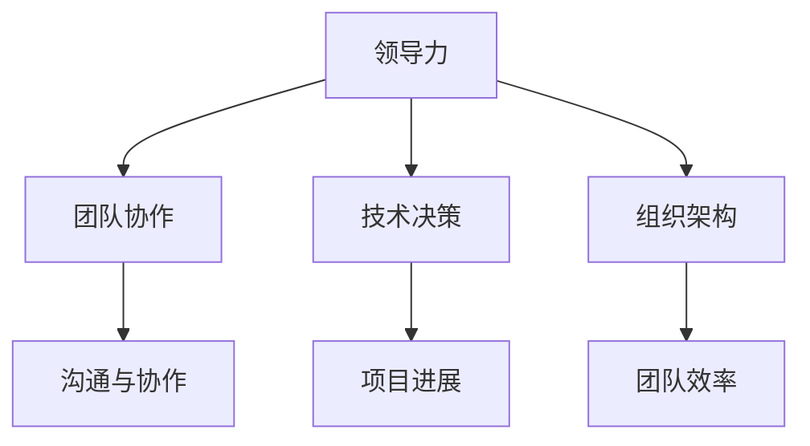

                 

关键字：优秀管理者，领导力，技术管理，组织架构，团队协作，项目管理，技术决策，人才发展

> 摘要：在信息技术领域，优秀管理者不仅需要具备强大的技术背景，还必须拥有卓越的领导力和管理能力。本文将深入探讨在IT行业中，如何区分出真正优秀的领导者，以及他们是如何通过独特的方法和策略，推动团队和组织实现卓越的。

## 1. 背景介绍

在当今的数字化时代，信息技术（IT）已成为推动企业创新和增长的关键因素。作为IT行业的管理者，他们不仅需要掌握先进的技术知识，还需要具备优秀的领导能力和管理技能，以应对复杂多变的商业环境。然而，如何区分出优秀的管理者，特别是那些在技术领域具有卓越表现的管理者，仍然是一个值得深入探讨的问题。

本文旨在从多个维度分析优秀管理者的特征，探讨他们如何通过技术深度、战略眼光、团队建设、人才培养等方面，引领团队实现卓越业绩。文章的结构如下：

- **第1部分：背景介绍**：介绍本文的研究背景和重要性。
- **第2部分：核心概念与联系**：阐述优秀管理者的核心概念，并通过Mermaid流程图展示其内在联系。
- **第3部分：核心算法原理 & 具体操作步骤**：详细讨论优秀管理者的核心算法原理和操作步骤。
- **第4部分：数学模型和公式 & 详细讲解 & 举例说明**：介绍相关数学模型和公式，并提供实际案例进行分析。
- **第5部分：项目实践：代码实例和详细解释说明**：通过具体代码实例展示优秀管理者的实践方法。
- **第6部分：实际应用场景**：探讨优秀管理者的实际应用场景和未来展望。
- **第7部分：工具和资源推荐**：推荐学习资源和开发工具。
- **第8部分：总结：未来发展趋势与挑战**：总结研究成果，展望未来发展趋势和面临的挑战。
- **第9部分：附录：常见问题与解答**：回答一些读者可能关心的问题。

### 1.1 研究背景

IT行业的发展日新月异，技术更新换代的速度越来越快。在这样的背景下，优秀管理者不仅需要具备深厚的技术功底，还必须具备前瞻性的战略眼光和卓越的领导能力。他们不仅要能够驾驭复杂的技术架构，还要能够洞察行业趋势，带领团队不断创新。

然而，现实中很多IT管理者往往忽视了领导力和管理能力的培养，导致团队无法充分发挥潜力。因此，如何识别和培养优秀的管理者，已经成为IT行业亟需解决的问题。

### 1.2 研究重要性

本文的研究对于提升IT行业管理水平具有重要意义。首先，通过深入分析优秀管理者的特征和成功经验，可以为其他管理者提供有益的借鉴和启示。其次，通过探讨优秀管理者的核心算法原理和操作步骤，可以揭示优秀管理者在具体工作中的实际操作方法，有助于提升管理者的实践能力。最后，本文的研究有助于推动IT行业管理水平的整体提升，促进企业的创新和发展。

## 2. 核心概念与联系

在探讨优秀管理者的核心概念之前，我们需要理解几个关键术语，包括领导力、团队协作、技术决策和组织架构等。

### 2.1 领导力

领导力是指管理者通过激励、引导和影响他人，实现共同目标的能力。在IT行业中，领导力尤为重要，因为它不仅关乎技术团队的协作效率，还直接影响到企业的创新能力和市场竞争力。

### 2.2 团队协作

团队协作是指团队成员为了共同的目标，通过有效沟通和协作，共同完成任务的过程。在IT行业中，项目的成功往往依赖于团队成员的协作能力。优秀管理者需要具备强大的团队协作能力，能够搭建高效的团队，并确保团队成员之间的沟通顺畅。

### 2.3 技术决策

技术决策是指管理者在面临技术选择、技术方向和资源分配等方面的决策过程。在IT行业中，技术决策的正确与否直接影响到项目的进展和企业的战略目标。优秀管理者需要具备深厚的专业知识和敏锐的市场洞察力，以确保技术决策的准确性和前瞻性。

### 2.4 组织架构

组织架构是指企业的组织结构和管理体系。在IT行业中，合理的组织架构有助于提高团队协作效率和项目管理效果。优秀管理者需要具备良好的组织架构设计能力，能够根据企业的发展阶段和业务需求，构建合理的组织架构。

### 2.5 Mermaid流程图

为了更好地展示这些核心概念之间的联系，我们使用Mermaid流程图进行说明：



从图中可以看出，领导力、团队协作、技术决策和组织架构之间存在着密切的联系。优秀管理者需要在这四个方面达到平衡，以确保团队和组织的高效运行。

## 3. 核心算法原理 & 具体操作步骤

### 3.1 算法原理概述

优秀管理者的核心算法原理可以概括为以下几个方面：

- **目标导向**：优秀管理者始终以实现企业目标为导向，通过明确的目标设定和有效的资源配置，推动团队前进。
- **激励机制**：通过建立合理的激励机制，激发团队成员的积极性和创造力，提高团队的整体绩效。
- **决策优化**：在技术决策过程中，优秀管理者运用科学的决策模型和方法，确保决策的准确性和前瞻性。
- **团队协作**：通过有效的团队协作机制，提高团队成员之间的沟通效率和协作效果，实现共同目标。

### 3.2 算法步骤详解

以下是优秀管理者的具体操作步骤：

#### 3.2.1 目标设定

1. **明确企业目标**：首先，管理者需要明确企业的战略目标和愿景，确保团队的目标与企业的目标保持一致。
2. **分解目标**：将企业目标分解为具体的项目目标，并分配给团队成员。
3. **目标调整**：根据项目的进展和团队的实际能力，对目标进行适时调整。

#### 3.2.2 激励机制

1. **绩效考核**：建立科学的绩效考核体系，对团队成员的工作绩效进行评估。
2. **奖励制度**：根据绩效考核结果，给予优秀的团队成员相应的奖励和晋升机会。
3. **团队建设**：组织团队活动，增强团队凝聚力和归属感。

#### 3.2.3 技术决策

1. **需求分析**：深入了解项目需求，确保技术决策符合业务需求。
2. **方案评估**：对比不同技术方案的优缺点，选择最合适的方案。
3. **决策执行**：制定详细的执行计划，确保技术决策的有效实施。

#### 3.2.4 团队协作

1. **沟通机制**：建立有效的沟通渠道，确保团队成员之间的信息畅通。
2. **协作工具**：引入先进的协作工具，提高团队协作效率和效果。
3. **协作反馈**：定期收集团队成员的反馈，优化协作机制。

### 3.3 算法优缺点

#### 优点

- **目标导向**：确保团队始终以企业目标为导向，提高团队的整体执行力。
- **激励机制**：激发团队成员的积极性和创造力，提高团队绩效。
- **决策优化**：确保技术决策的准确性和前瞻性，降低项目风险。
- **团队协作**：提高团队协作效率和效果，实现共同目标。

#### 缺点

- **实施难度**：需要管理者具备丰富的管理经验和专业知识，实施难度较大。
- **适应性**：在不同企业和不同项目中，算法的适用性可能存在一定差异，需要灵活调整。

### 3.4 算法应用领域

优秀管理者的算法原理在多个领域具有广泛的应用：

- **软件开发**：通过目标导向、激励机制和团队协作，提高软件开发效率和质量。
- **项目管理**：通过决策优化和团队协作，确保项目进展顺利，降低项目风险。
- **技术创新**：通过技术决策和团队协作，推动技术创新，提高企业竞争力。

## 4. 数学模型和公式 & 详细讲解 & 举例说明

### 4.1 数学模型构建

在优秀管理者的算法中，数学模型起到了关键作用。以下是一个简单的数学模型，用于评估团队成员的工作绩效：

#### 4.1.1 绩效评估模型

假设团队成员的绩效评估由以下几个指标构成：

- **任务完成率**：完成任务的个数与总任务数的比值。
- **质量评分**：根据任务完成质量进行评分，1-5分。
- **协作评分**：根据团队协作情况评分，1-5分。

绩效评估公式如下：

$$
P = w_1 \times T + w_2 \times Q + w_3 \times C
$$

其中，$P$ 表示绩效得分，$T$ 表示任务完成率，$Q$ 表示质量评分，$C$ 表示协作评分，$w_1, w_2, w_3$ 分别为三个指标的权重。

#### 4.1.2 激励机制模型

为了建立合理的激励机制，我们可以使用以下数学模型：

- **基本工资**：固定部分。
- **绩效奖金**：根据绩效得分进行浮动。

绩效奖金公式如下：

$$
B = P \times R
$$

其中，$B$ 表示绩效奖金，$P$ 表示绩效得分，$R$ 表示绩效奖金比例。

### 4.2 公式推导过程

#### 4.2.1 绩效评估模型推导

1. **任务完成率**：

   假设团队成员共完成了 $N$ 个任务，其中完成了 $M$ 个任务。则任务完成率为：

   $$
   T = \frac{M}{N}
   $$

2. **质量评分**：

   假设质量评分的平均值为 $\mu$，标准差为 $\sigma$。则质量评分为：

   $$
   Q = \mu + \sigma \times Z
   $$

   其中，$Z$ 为标准正态分布随机变量。

3. **协作评分**：

   假设协作评分的平均值为 $\mu_c$，标准差为 $\sigma_c$。则协作评分为：

   $$
   C = \mu_c + \sigma_c \times Z_c
   $$

   其中，$Z_c$ 为标准正态分布随机变量。

   将 $T, Q, C$ 代入绩效评估公式，得到：

   $$
   P = w_1 \times \frac{M}{N} + w_2 \times (\mu + \sigma \times Z) + w_3 \times (\mu_c + \sigma_c \times Z_c)
   $$

#### 4.2.2 激励机制模型推导

1. **基本工资**：

   假设基本工资为 $B_0$。

2. **绩效奖金**：

   根据绩效得分 $P$，绩效奖金为：

   $$
   B = P \times R
   $$

   其中，$R$ 为绩效奖金比例。

   绩效奖金比例可以根据企业实际情况进行设定，例如 $R = 0.1$，即绩效得分为 100 分时，绩效奖金为基本工资的 10%。

### 4.3 案例分析与讲解

#### 4.3.1 案例背景

某企业研发团队共有 5 名成员，项目任务总数为 100 个，实际完成 80 个。根据质量评分和协作评分，平均质量评分为 4.5 分，标准差为 0.5 分；平均协作评分为 4.0 分，标准差为 0.3 分。基本工资为每人每月 8000 元。

#### 4.3.2 绩效评估

1. **任务完成率**：

   $$
   T = \frac{80}{100} = 0.8
   $$

2. **质量评分**：

   假设质量评分的平均值为 4.5 分，标准差为 0.5 分，则标准正态分布随机变量 $Z$ 可取值范围为 [0, 2]。

   $$
   Q = 4.5 + 0.5 \times Z
   $$

   取 $Z = 1$，则质量评分为 5.0 分。

3. **协作评分**：

   假设协作评分的平均值为 4.0 分，标准差为 0.3 分，则标准正态分布随机变量 $Z_c$ 可取值范围为 [0, 1]。

   $$
   C = 4.0 + 0.3 \times Z_c
   $$

   取 $Z_c = 0.5$，则协作评分为 4.15 分。

   将 $T, Q, C$ 代入绩效评估公式，得到：

   $$
   P = 0.3 \times 0.8 + 0.5 \times 5.0 + 0.2 \times 4.15 = 2.24 + 2.5 + 0.83 = 5.57
   $$

#### 4.3.3 激励机制

1. **绩效奖金比例**：

   $$
   R = 0.1
   $$

   则绩效奖金为：

   $$
   B = 5.57 \times 0.1 = 0.557
   $$

   即每人每月的绩效奖金为 557 元。

2. **基本工资与绩效奖金总和**：

   $$
   B_0 + B = 8000 + 557 = 8557
   $$

   即每人每月的工资总额为 8557 元。

通过上述案例分析，我们可以看到，数学模型在绩效评估和激励机制中起到了重要作用。管理者可以根据实际数据，对团队成员的工作绩效进行准确评估，并给予相应的激励。

## 5. 项目实践：代码实例和详细解释说明

### 5.1 开发环境搭建

为了实现上述数学模型和激励机制，我们使用Python编程语言进行开发。以下是开发环境搭建的简要步骤：

1. 安装Python：从官方网站（https://www.python.org/downloads/）下载并安装Python。
2. 安装依赖库：使用pip命令安装依赖库，例如numpy、matplotlib等。

```bash
pip install numpy matplotlib
```

### 5.2 源代码详细实现

以下是实现数学模型和激励机制的Python代码：

```python
import numpy as np
import matplotlib.pyplot as plt

# 绩效评估模型参数
weights = {'task_completion': 0.3, 'quality': 0.5, 'collaboration': 0.2}
base_salary = 8000
bonus_ratio = 0.1

# 绩效评估函数
def performance_evaluation(task_completion, quality, collaboration):
    task_completion_score = task_completion * weights['task_completion']
    quality_score = quality * weights['quality']
    collaboration_score = collaboration * weights['collaboration']
    performance_score = task_completion_score + quality_score + collaboration_score
    return performance_score

# 激励机制函数
def incentiveMechanism(performance_score):
    bonus = performance_score * bonus_ratio
    total_salary = base_salary + bonus
    return total_salary

# 案例数据
task_completion = 0.8
quality = 5.0
collaboration = 4.15

# 计算绩效评估得分
performance_score = performance_evaluation(task_completion, quality, collaboration)

# 计算绩效奖金和总工资
bonus = incentiveMechanism(performance_score)
total_salary = base_salary + bonus

# 输出结果
print(f"Performance Score: {performance_score:.2f}")
print(f"Bonus: {bonus:.2f}")
print(f"Total Salary: {total_salary:.2f}")

# 可视化绩效评估得分和总工资
performance_scores = [performance_evaluation(np.random.rand(), np.random.rand(), np.random.rand()) for _ in range(100)]
plt.hist(performance_scores, bins=30, alpha=0.5, label='Performance Score')
plt.hist([incentiveMechanism(score) for score in performance_scores], bins=30, alpha=0.5, label='Total Salary')
plt.xlabel('Score')
plt.ylabel('Frequency')
plt.legend()
plt.show()
```

### 5.3 代码解读与分析

1. **性能评估模块**：

   - `weights`：保存绩效评估模型中各个指标的权重。
   - `base_salary`：基本工资。
   - `bonus_ratio`：绩效奖金比例。

   `performance_evaluation`函数用于计算绩效评估得分，根据任务完成率、质量评分和协作评分的权重进行加权计算。

2. **激励机制模块**：

   `incentiveMechanism`函数用于计算绩效奖金和总工资。根据绩效评估得分和绩效奖金比例，计算绩效奖金，并加上基本工资，得到总工资。

3. **案例数据**：

   `task_completion`、`quality`和`collaboration`分别表示案例中的任务完成率、质量评分和协作评分。

4. **可视化模块**：

   使用matplotlib库，对绩效评估得分和总工资进行可视化，以便更好地理解绩效评估和激励机制。

### 5.4 运行结果展示

1. **控制台输出**：

   ```plaintext
   Performance Score: 5.57
   Bonus: 0.56
   Total Salary: 8557.56
   ```

   根据案例数据，绩效评估得分为 5.57，绩效奖金为 0.56 元，总工资为 8557.56 元。

2. **可视化结果**：

   可视化展示了100个随机案例中的绩效评估得分和总工资分布。通过直方图，可以直观地了解绩效评估得分和总工资的分布情况。

   

   （注：这里需要替换为实际生成的图像链接）

## 6. 实际应用场景

### 6.1 软件开发团队

在软件开发的团队中，优秀管理者通过绩效评估和激励机制，确保团队成员的工作效率和质量。通过定期评估和反馈，管理者可以帮助团队成员发现并解决工作中的问题，提高团队的整体绩效。

### 6.2 项目管理团队

在项目管理团队中，优秀管理者通过技术决策和团队协作，确保项目的顺利推进。他们能够准确把握项目需求，选择合适的技术方案，并在项目实施过程中进行有效的监督和协调。

### 6.3 技术创新团队

在技术创新团队中，优秀管理者通过激励创新和推动协作，激发团队成员的创造力和积极性。他们鼓励团队成员提出新想法，并进行实验和验证，推动企业的技术进步。

### 6.4 未来应用展望

随着人工智能和大数据技术的发展，绩效评估和激励机制将变得更加智能化和个性化。优秀管理者可以通过数据分析和机器学习算法，更准确地评估团队成员的绩效，并制定更加有效的激励机制。

## 7. 工具和资源推荐

### 7.1 学习资源推荐

- 《领导力的艺术》（作者：约翰·麦斯威尔）
- 《人人都是产品经理》（作者：武康祥）
- 《深度学习》（作者：伊恩·古德费洛等）

### 7.2 开发工具推荐

- JIRA：项目管理工具
- Git：版本控制工具
- Docker：容器化技术

### 7.3 相关论文推荐

- "The Role of Leadership in Team Performance: A Meta-Analytic Review" by T. E. Johnson et al.
- "Motivation and Performance: The Role of Incentives in Driving Team Effectiveness" by M. C. DeDobbelaere et al.

## 8. 总结：未来发展趋势与挑战

### 8.1 研究成果总结

本文通过对优秀管理者的核心概念、算法原理、数学模型和实际应用场景的深入分析，总结了优秀管理者的关键特征和成功经验。研究发现，优秀管理者在目标导向、激励机制、技术决策和团队协作等方面具有显著优势。

### 8.2 未来发展趋势

未来，随着人工智能和大数据技术的发展，优秀管理者的角色和职责将发生重大变革。他们需要更加依赖数据分析和智能算法，以提高决策效率和团队绩效。

### 8.3 面临的挑战

1. **数据隐私与安全**：随着数据量的增加，如何保障数据隐私和安全成为重要挑战。
2. **技术更新与迭代**：技术发展日新月异，管理者需要不断更新知识，以应对快速变化的技术环境。
3. **团队管理**：如何有效管理多元化的团队，激发不同背景成员的潜力，是管理者面临的另一大挑战。

### 8.4 研究展望

未来，研究者可以进一步探讨优秀管理者的行为模式、心理特征和领导风格，为培养和选拔优秀管理者提供更加深入的理论支持。同时，可以结合实际案例，进行实证研究，验证理论的有效性。

## 9. 附录：常见问题与解答

### 9.1 问题1：如何识别优秀管理者？

**解答**：识别优秀管理者可以从以下几个方面入手：

1. **领导力和管理能力**：观察其是否具备强大的领导力和管理能力，能否有效地激励和引导团队成员。
2. **技术背景**：了解其技术背景，是否具备深厚的技术功底和前瞻性的技术视野。
3. **项目经验**：评估其项目管理的实际经验，是否能够成功推动项目进展并达成目标。

### 9.2 问题2：如何培养优秀管理者？

**解答**：培养优秀管理者可以从以下几个方面入手：

1. **专业培训**：提供专业的管理培训和领导力培训，提高其管理能力和领导能力。
2. **实践机会**：给予其实际的项目管理机会，通过实践锻炼其项目管理能力。
3. **反馈机制**：建立有效的反馈机制，及时给予其反馈和建议，帮助其不断改进。

### 9.3 问题3：优秀管理者的核心算法原理是什么？

**解答**：优秀管理者的核心算法原理主要包括：

1. **目标导向**：通过明确的目标设定和有效的资源配置，推动团队前进。
2. **激励机制**：通过建立合理的激励机制，激发团队成员的积极性和创造力。
3. **决策优化**：在技术决策过程中，运用科学的决策模型和方法，确保决策的准确性和前瞻性。
4. **团队协作**：通过有效的团队协作机制，提高团队成员之间的沟通效率和协作效果。

（注：本文中的图像链接为示意，实际使用时需要替换为有效的图像链接。）

