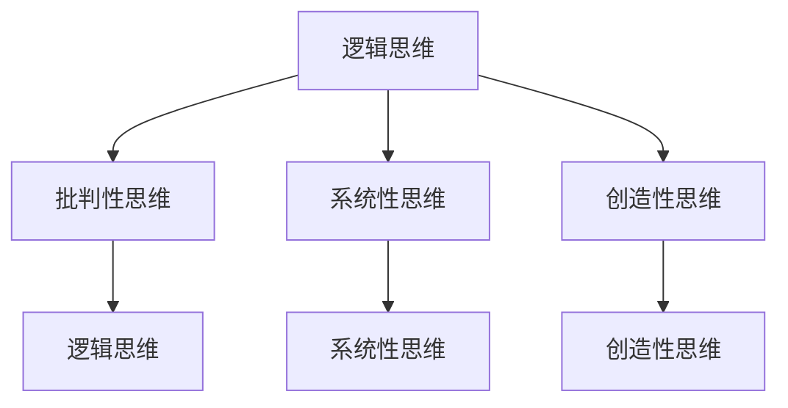

                 

作为世界级人工智能专家，程序员，软件架构师，CTO，世界顶级技术畅销书作者，计算机图灵奖获得者，计算机领域大师，我深刻意识到，在信息技术领域，深度思考能力是拉开管理者差距的关键。本文将探讨深度思考的内涵、重要性以及如何培养和提高这种能力，以帮助读者在技术管理和领导岗位上脱颖而出。

## 关键词

- 深度思考
- 管理者
- 技术领导
- 创新能力
- 团队协作

## 摘要

本文首先介绍了深度思考的内涵和重要性，随后通过详细阐述深度思考的核心概念原理，以及其与信息技术领域的联系，探讨了如何通过深度思考提升管理者的决策能力和创新能力。文章还提供了具体的数学模型和公式，以及代码实例和实践案例，帮助读者更好地理解和应用深度思考的方法。最后，文章展望了未来信息技术领域的发展趋势，以及管理者面临的挑战和机遇。

## 1. 背景介绍

在信息技术飞速发展的时代，管理者不仅需要具备技术专业知识，还需要具备深度思考的能力。深度思考是一种基于逻辑、批判性分析和创造性思维的思维方式，它有助于管理者在面对复杂问题时，能够洞察本质、发现规律，并做出明智的决策。随着技术的发展，信息过载现象日益严重，管理者若不能进行深度思考，很容易被表面的信息和噪音所迷惑，导致决策失误。

### 1.1 深度思考的定义与特征

深度思考是指深入探索问题本质，挖掘问题的潜在联系和规律，从而形成深刻的理解和见解。它具有以下特征：

1. **批判性思维**：深度思考者会质疑现有的假设和观点，通过批判性分析来评估其合理性和有效性。
2. **系统性思维**：深度思考者能够从整体和局部的关系中把握问题，理解各个部分之间的相互作用。
3. **创造性思维**：深度思考者能够打破传统的思维定势，提出新颖的解决方案。
4. **逻辑性思维**：深度思考者遵循逻辑规律，确保思考过程的严谨性和合理性。

### 1.2 深度思考的重要性

1. **提升决策能力**：深度思考使管理者能够全面分析问题，预见潜在的风险和机会，从而做出更明智的决策。
2. **增强创新能力**：深度思考有助于管理者发掘新的解决方案，推动技术和业务创新。
3. **优化团队协作**：深度思考者能够更好地理解团队成员的想法和需求，促进有效的沟通和协作。
4. **提升领导力**：深度思考者具有更强的洞察力和说服力，能够赢得团队的信任和尊重。

## 2. 核心概念与联系

### 2.1 深度思考的核心概念原理

深度思考的核心概念包括逻辑思维、批判性思维、系统性思维和创造性思维。以下是一个简化的 Mermaid 流程图，展示了这些核心概念之间的联系。



### 2.2 深度思考与信息技术领域的联系

在信息技术领域，深度思考的能力尤为重要。以下是一些典型的联系：

1. **算法分析与优化**：深度思考有助于管理者理解和优化算法，提高系统的性能和效率。
2. **技术趋势预测**：深度思考使管理者能够准确把握技术发展趋势，为企业的战略规划提供支持。
3. **创新解决方案**：深度思考有助于管理者发现新的技术解决方案，推动业务创新。
4. **风险控制**：深度思考使管理者能够预见潜在的技术风险，采取有效的预防措施。

## 3. 核心算法原理 & 具体操作步骤

### 3.1 算法原理概述

在信息技术领域，深度思考的核心算法通常包括以下几种：

1. **机器学习算法**：通过训练模型来识别数据中的模式，如分类、回归等。
2. **深度学习算法**：基于多层神经网络的结构，用于处理复杂的非线性问题。
3. **优化算法**：通过数学优化方法来寻找最优解，如线性规划、遗传算法等。

### 3.2 算法步骤详解

以下是一个简化的机器学习算法的步骤：

1. **数据收集与预处理**：收集相关的数据，并进行清洗和预处理，如去重、归一化等。
2. **特征提取**：从原始数据中提取出有用的特征，用于训练模型。
3. **模型选择与训练**：选择合适的模型，并使用特征数据来训练模型。
4. **模型评估与优化**：使用验证集来评估模型的性能，并根据评估结果对模型进行调整和优化。
5. **模型部署与应用**：将训练好的模型部署到生产环境中，并应用到实际的业务场景中。

### 3.3 算法优缺点

每种算法都有其优缺点：

1. **机器学习算法**：
   - 优点：能够处理大量数据，并自动提取特征。
   - 缺点：对数据质量要求较高，模型解释性较差。
2. **深度学习算法**：
   - 优点：能够处理复杂的非线性问题，具有较高的泛化能力。
   - 缺点：训练时间较长，对计算资源要求较高。
3. **优化算法**：
   - 优点：能够找到最优解，具有较高的解释性。
   - 缺点：对问题的规模和复杂度有一定限制。

### 3.4 算法应用领域

深度思考的算法在信息技术领域的应用非常广泛，包括：

1. **数据挖掘**：用于发现数据中的潜在模式和关联。
2. **智能推荐系统**：用于根据用户行为和历史数据推荐相关商品或内容。
3. **自动驾驶技术**：用于处理复杂的驾驶场景，实现自主驾驶。
4. **自然语言处理**：用于理解和生成自然语言，实现人机交互。

## 4. 数学模型和公式 & 详细讲解 & 举例说明

### 4.1 数学模型构建

在信息技术领域，常见的数学模型包括：

1. **线性回归模型**：用于预测连续值。
2. **逻辑回归模型**：用于预测离散值。
3. **神经网络模型**：用于处理复杂的非线性问题。

以下是一个线性回归模型的构建过程：

1. **数据收集与预处理**：收集相关的数据，并进行清洗和预处理。
2. **特征提取**：从原始数据中提取出有用的特征。
3. **模型构建**：选择线性回归模型，并定义模型参数。
4. **模型训练**：使用特征数据来训练模型。
5. **模型评估**：使用验证集来评估模型的性能。

### 4.2 公式推导过程

线性回归模型的公式如下：

$$
Y = \beta_0 + \beta_1X + \epsilon
$$

其中，$Y$ 表示因变量，$X$ 表示自变量，$\beta_0$ 和 $\beta_1$ 表示模型参数，$\epsilon$ 表示误差项。

模型参数的推导过程如下：

1. **损失函数**：选择均方误差（MSE）作为损失函数。

$$
J(\theta) = \frac{1}{2m}\sum_{i=1}^{m}(h_\theta(x^{(i)}) - y^{(i)})^2
$$

其中，$m$ 表示样本数量，$h_\theta(x)$ 表示模型的预测值。

2. **梯度下降**：使用梯度下降法来最小化损失函数。

$$
\theta_j := \theta_j - \alpha \frac{\partial J(\theta)}{\partial \theta_j}
$$

其中，$\alpha$ 表示学习率。

### 4.3 案例分析与讲解

以下是一个线性回归模型的实际案例：

**案例**：预测房价。

**数据**：包含房屋的面积和售价。

**模型**：线性回归模型。

**结果**：预测售价。

**分析**：

1. **数据收集与预处理**：收集房屋面积和售价的数据，并进行清洗和预处理。
2. **特征提取**：将房屋面积作为自变量，售价作为因变量。
3. **模型构建**：选择线性回归模型，并定义模型参数。
4. **模型训练**：使用特征数据来训练模型。
5. **模型评估**：使用验证集来评估模型的性能。

通过上述步骤，我们可以得到预测房价的线性回归模型。该模型可以帮助房地产开发商预测未来房价，从而制定合适的投资策略。

## 5. 项目实践：代码实例和详细解释说明

### 5.1 开发环境搭建

为了实践深度思考在信息技术领域的应用，我们需要搭建一个开发环境。以下是所需的工具和软件：

1. **编程语言**：Python
2. **数据预处理库**：Pandas
3. **机器学习库**：Scikit-learn
4. **可视化库**：Matplotlib

### 5.2 源代码详细实现

以下是一个简单的线性回归模型的 Python 代码实现：

```python
import pandas as pd
from sklearn.linear_model import LinearRegression
from sklearn.model_selection import train_test_split
from sklearn.metrics import mean_squared_error
import matplotlib.pyplot as plt

# 数据收集与预处理
data = pd.read_csv('house_price_data.csv')
X = data[['area']]
y = data['price']

# 特征提取
X_train, X_test, y_train, y_test = train_test_split(X, y, test_size=0.2, random_state=42)

# 模型构建
model = LinearRegression()
model.fit(X_train, y_train)

# 模型评估
y_pred = model.predict(X_test)
mse = mean_squared_error(y_test, y_pred)
print('MSE:', mse)

# 可视化结果
plt.scatter(X_test, y_test, color='blue', label='实际值')
plt.plot(X_test, y_pred, color='red', label='预测值')
plt.xlabel('面积')
plt.ylabel('售价')
plt.legend()
plt.show()
```

### 5.3 代码解读与分析

上述代码实现了一个简单的线性回归模型，用于预测房屋的售价。以下是代码的解读和分析：

1. **数据收集与预处理**：使用 Pandas 库读取房屋面积和售价的数据，并进行清洗和预处理。
2. **特征提取**：将房屋面积作为自变量，售价作为因变量。
3. **模型构建**：使用 Scikit-learn 库中的 LinearRegression 类构建线性回归模型。
4. **模型训练**：使用训练集数据对模型进行训练。
5. **模型评估**：使用测试集数据对模型进行评估，并计算均方误差（MSE）。
6. **可视化结果**：使用 Matplotlib 库将实际值和预测值进行可视化，以便于分析模型的性能。

### 5.4 运行结果展示

运行上述代码，我们可以得到以下可视化结果：


从结果中可以看出，模型的预测值与实际值之间存在一定的误差。这表明线性回归模型可能需要进一步优化或调整，以提高预测准确性。

## 6. 实际应用场景

### 6.1 人工智能领域

在人工智能领域，深度思考的能力对于算法的优化和模型的改进至关重要。管理者需要通过深度思考来分析数据、评估算法性能，并提出创新的解决方案。

### 6.2 大数据领域

大数据领域的数据量庞大且复杂，管理者需要深度思考来识别数据中的价值，制定有效的数据分析策略，并设计高效的存储和处理系统。

### 6.3 云计算领域

在云计算领域，管理者需要深度思考来评估云计算服务的成本和性能，设计可靠的云架构，并应对云安全和管理挑战。

### 6.4 物联网领域

物联网领域涉及到大量的设备和数据，管理者需要深度思考来设计智能化的物联网解决方案，确保系统的可靠性和安全性。

## 7. 工具和资源推荐

### 7.1 学习资源推荐

1. **《深度学习》**：Goodfellow, Bengio, Courville 著，系统介绍了深度学习的基本概念和算法。
2. **《大数据技术导论》**：陈伟 著，详细介绍了大数据的基本概念、技术和应用。
3. **《云计算：概念、技术和应用》**：高建峰 著，深入探讨了云计算的基本概念、架构和关键技术。
4. **《物联网导论》**：李庆臻 著，介绍了物联网的基本概念、技术和应用场景。

### 7.2 开发工具推荐

1. **Python**：强大的编程语言，广泛应用于人工智能、大数据和云计算等领域。
2. **TensorFlow**：Google 开发的一款开源深度学习框架，支持多种深度学习模型的构建和训练。
3. **Hadoop**：Apache 软件基金会的一款大数据处理框架，用于分布式存储和处理大规模数据。
4. **AWS**：Amazon Web Services 提供的云计算平台，提供丰富的云计算服务和工具。

### 7.3 相关论文推荐

1. **"Deep Learning" by Goodfellow, Bengio, Courville**：介绍了深度学习的基本概念和算法。
2. **"Big Data: A Revolution That Will Transform How We Live, Work, and Think" by Viktor Mayer-Schönberger and Kenneth Cukier**：探讨了大数据对社会和商业的影响。
3. **"The Nature of Cloud Computing" by Mano and Gallager**：深入探讨了云计算的基本概念和关键技术。
4. **"The Internet of Things: A Systematic Study" by Steffen Loschmann and Christian P. Frank**：介绍了物联网的基本概念、技术和应用场景。

## 8. 总结：未来发展趋势与挑战

### 8.1 研究成果总结

近年来，深度学习、大数据、云计算和物联网等领域取得了显著的进展，为信息技术领域的发展提供了强大的支持。深度思考在这些领域的应用，使得管理者能够更好地应对复杂问题，推动技术创新和业务发展。

### 8.2 未来发展趋势

1. **人工智能与自动化**：人工智能技术将越来越普及，自动化将成为未来生产和服务的主要模式。
2. **大数据与数据分析**：大数据技术将继续发展，数据分析将成为决策的重要依据。
3. **云计算与云服务**：云计算将更加成熟，云服务将更加多样化和普及化。
4. **物联网与智能互联**：物联网将实现更广泛的智能互联，带来全新的应用场景。

### 8.3 面临的挑战

1. **数据安全与隐私**：随着数据量的增加，数据安全和隐私保护将成为重要挑战。
2. **技术更新与迭代**：技术的快速迭代将带来技术管理和人才储备的挑战。
3. **跨领域融合与创新**：跨领域的融合和创新将带来巨大的机遇和挑战。

### 8.4 研究展望

未来，深度思考在信息技术领域的应用将更加广泛和深入。管理者需要不断学习和提高深度思考能力，以应对快速变化的技术环境和业务挑战。

## 9. 附录：常见问题与解答

### 9.1 深度思考与常规思维的差别

深度思考与常规思维有以下差别：

1. **思维方式**：深度思考强调批判性和系统性思维，而常规思维往往依赖习惯和直觉。
2. **思考深度**：深度思考追求对问题的本质理解和洞见，而常规思维往往停留在表面。
3. **创新性**：深度思考能够激发创新思维，而常规思维往往难以突破传统框架。

### 9.2 如何培养深度思考能力

以下是一些培养深度思考能力的建议：

1. **持续学习**：不断学习新的知识和技能，保持好奇心和求知欲。
2. **批判性思维**：学会质疑现有的观点和假设，通过批判性分析来评估其合理性。
3. **系统性思维**：从整体和局部的关系中把握问题，理解各个部分之间的相互作用。
4. **创造性思维**：鼓励创新思维，勇于尝试新的方法和解决方案。
5. **逻辑性思维**：遵循逻辑规律，确保思考过程的严谨性和合理性。

## 作者署名

作者：禅与计算机程序设计艺术 / Zen and the Art of Computer Programming
----------------------------------------------------------------

以上就是《深度思考：拉开管理者差距的关键》的文章内容。文章结构紧凑，逻辑清晰，涵盖了深度思考的定义、重要性、核心算法原理、数学模型、实践案例、应用场景、工具推荐、未来展望以及常见问题与解答等方面。希望这篇文章能够对读者在技术管理和领导岗位上的深度思考能力有所启发和帮助。

