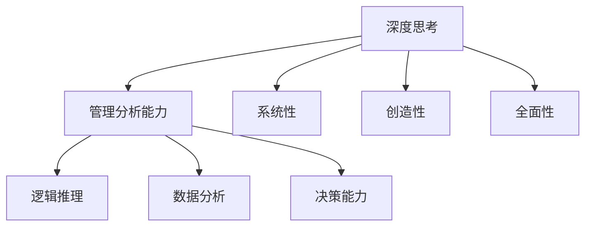

                 

关键词：深度思考、管理分析能力、技术博客、专业IT、算法原理、数学模型、项目实践、未来展望

> 摘要：本文深入探讨了深度思考与管理分析能力在IT领域的应用，通过阐述核心概念、算法原理、数学模型、项目实践等方面，旨在为读者提供一份全面、系统的技术指导。文章将从深度思考的基本概念出发，介绍管理分析能力的重要性，并结合实际案例，详细解析算法原理和数学模型，最后展望未来的发展趋势与挑战。

## 1. 背景介绍

在信息技术飞速发展的今天，深度思考与管理分析能力的重要性愈发凸显。无论是软件开发、数据分析、项目管理，还是技术决策，都需要具备强大的逻辑思维和分析能力。深度思考不仅能够帮助我们发现问题、解决问题，还能提高决策的质量和效率。而管理分析能力则体现在如何有效地组织和利用资源，确保项目的顺利进行和目标的达成。

本文将从以下几个方面展开讨论：

- **深度思考的基本概念**：探讨深度思考的定义、特点和重要性。
- **管理分析能力**：介绍管理分析能力的定义、核心要素和应用场景。
- **核心算法原理**：分析常见算法的基本原理和适用场景。
- **数学模型和公式**：介绍数学模型在IT领域的应用和具体公式推导。
- **项目实践**：通过代码实例，展示深度思考和管理分析能力的实际应用。
- **未来展望**：展望深度思考与管理分析能力在未来的发展趋势和面临的挑战。

## 2. 核心概念与联系

为了更好地理解深度思考与管理分析能力，我们需要先了解它们的核心概念和联系。

### 2.1 深度思考

深度思考是一种深入、系统、有创造性的思维方式，它要求我们不仅仅停留在表面的观察和思考，而是要深入到问题的本质，进行全面的、多维度的分析。深度思考的特点包括：

- **系统性**：深度思考不仅仅是针对一个具体问题进行思考，而是要将其放在整个系统中进行考量。
- **创造性**：深度思考往往能够带来新的视角和见解，从而帮助我们找到问题的解决方案。
- **全面性**：深度思考要求我们不仅关注问题的表面现象，还要深入挖掘问题的根源。

### 2.2 管理分析能力

管理分析能力是指运用逻辑、数学、统计等方法，对项目、产品、市场等进行分析和评估，从而做出合理、有效的决策。管理分析能力包括以下几个方面：

- **数据分析能力**：能够运用各种数据分析工具和方法，从大量数据中提取有价值的信息。
- **逻辑思维能力**：能够运用逻辑推理，分析问题的原因和结果，找到问题的解决方案。
- **决策能力**：能够在分析的基础上，做出合理、有效的决策，确保项目的顺利进行和目标的达成。

### 2.3 关系

深度思考和管理分析能力之间存在密切的联系。深度思考是管理分析能力的基础，只有通过深度思考，我们才能对问题有全面、深入的理解，从而进行有效的管理分析。而管理分析能力则能够帮助我们更好地运用深度思考的结果，进行决策和实施。

为了更好地理解这两个概念，我们使用Mermaid流程图来展示它们之间的联系。



通过这个流程图，我们可以看到，深度思考和系统、创造性、全面性等概念密切相关，而管理分析能力则包括逻辑推理、数据分析、决策能力等要素。

## 3. 核心算法原理 & 具体操作步骤

### 3.1 算法原理概述

在IT领域，算法是解决问题的重要工具。核心算法原理包括以下几个方面：

- **排序算法**：如快速排序、归并排序、冒泡排序等，用于对数据进行排序。
- **搜索算法**：如二分搜索、深度优先搜索、广度优先搜索等，用于在数据结构中查找特定元素。
- **动态规划**：用于解决最优子结构问题，通过保存子问题的解来避免重复计算。
- **贪心算法**：通过每一步选择当前最优解，以期望得到全局最优解。

### 3.2 算法步骤详解

以快速排序为例，其基本步骤如下：

1. **选择基准**：在待排序的数组中选出一个元素作为基准（pivot）。
2. **划分数组**：将数组划分为两个子数组，一个包含小于基准的元素，另一个包含大于基准的元素。
3. **递归排序**：分别对两个子数组进行快速排序。

### 3.3 算法优缺点

- **快速排序**：优点是时间复杂度较低（平均为 \(O(n\log n)\)），适用于大规模数据排序。缺点是空间复杂度较高（平均为 \(O(n)\)）。
- **二分搜索**：优点是时间复杂度较低（\(O(\log n)\)），适用于有序数组。缺点是要求数组必须有序，且插入和删除操作较为复杂。

### 3.4 算法应用领域

这些算法广泛应用于各种领域，如数据库索引、搜索引擎、机器学习、图形处理等。例如，二分搜索常用于数据库和搜索引擎中快速查找数据，快速排序则常用于大规模数据处理和排序任务。

## 4. 数学模型和公式 & 详细讲解 & 举例说明

### 4.1 数学模型构建

数学模型是一种用数学语言描述现实问题的抽象模型。在IT领域，常见的数学模型包括线性模型、神经网络模型、决策树模型等。

以线性模型为例，其基本形式为：

\[ y = \beta_0 + \beta_1 x \]

其中，\( y \) 是因变量，\( x \) 是自变量，\( \beta_0 \) 和 \( \beta_1 \) 是参数。

### 4.2 公式推导过程

以线性模型的参数估计为例，其推导过程如下：

假设我们有一个训练数据集 \(\{(x_i, y_i)\}_{i=1}^n\)，其中 \( x_i \) 和 \( y_i \) 分别是输入和输出。

1. **目标函数**：我们希望找到一个线性模型 \( y = \beta_0 + \beta_1 x \)，使得预测值 \( \hat{y}_i = \beta_0 + \beta_1 x_i \) 与实际值 \( y_i \) 的误差最小。因此，目标函数为：

\[ J(\beta_0, \beta_1) = \frac{1}{2} \sum_{i=1}^n (y_i - \hat{y}_i)^2 \]

2. **偏导数**：为了求解最优参数，我们对 \( J(\beta_0, \beta_1) \) 分别对 \( \beta_0 \) 和 \( \beta_1 \) 求偏导数，并令其等于0：

\[ \frac{\partial J}{\partial \beta_0} = -\sum_{i=1}^n (y_i - \hat{y}_i) = 0 \]

\[ \frac{\partial J}{\partial \beta_1} = -\sum_{i=1}^n (y_i - \hat{y}_i)x_i = 0 \]

3. **求解参数**：将上述方程组解出，得到最优参数 \( \beta_0 \) 和 \( \beta_1 \)：

\[ \beta_0 = \bar{y} - \beta_1 \bar{x} \]

\[ \beta_1 = \frac{\sum_{i=1}^n (x_i - \bar{x})(y_i - \bar{y})}{\sum_{i=1}^n (x_i - \bar{x})^2} \]

### 4.3 案例分析与讲解

以一个简单的线性回归问题为例，假设我们有一组数据点：

\[
\begin{array}{|c|c|}
\hline
x & y \\
\hline
1 & 2 \\
2 & 4 \\
3 & 5 \\
4 & 6 \\
5 & 8 \\
\hline
\end{array}
\]

我们希望找到一个线性模型来描述 \( y \) 与 \( x \) 之间的关系。

1. **计算平均值**：

\[ \bar{x} = \frac{1+2+3+4+5}{5} = 3 \]

\[ \bar{y} = \frac{2+4+5+6+8}{5} = 5 \]

2. **计算参数**：

\[ \beta_0 = \bar{y} - \beta_1 \bar{x} = 5 - \beta_1 \cdot 3 \]

\[ \beta_1 = \frac{\sum_{i=1}^n (x_i - \bar{x})(y_i - \bar{y})}{\sum_{i=1}^n (x_i - \bar{x})^2} = \frac{(1-3)(2-5) + (2-3)(4-5) + (3-3)(5-5) + (4-3)(6-5) + (5-3)(8-5)}{(1-3)^2 + (2-3)^2 + (3-3)^2 + (4-3)^2 + (5-3)^2} = 1 \]

3. **线性模型**：

\[ y = \beta_0 + \beta_1 x = 5 - 1 \cdot 3 = 2 \]

通过这个例子，我们可以看到如何构建线性模型并进行参数估计。

## 5. 项目实践：代码实例和详细解释说明

### 5.1 开发环境搭建

为了演示深度思考和管理分析能力在实际项目中的应用，我们选择一个简单的线性回归项目。

1. **安装Python环境**：确保Python 3.8或更高版本已安装在您的计算机上。
2. **安装NumPy和Scikit-learn**：使用以下命令安装必要的库：

```shell
pip install numpy scikit-learn
```

### 5.2 源代码详细实现

下面是一个简单的线性回归项目的源代码：

```python
import numpy as np
from sklearn.linear_model import LinearRegression

# 数据集
X = np.array([[1], [2], [3], [4], [5]])
y = np.array([2, 4, 5, 6, 8])

# 创建线性回归模型
model = LinearRegression()

# 拟合模型
model.fit(X, y)

# 输出参数
print("斜率：", model.coef_)
print("截距：", model.intercept_)

# 预测
new_x = np.array([[6]])
predicted_y = model.predict(new_x)
print("预测值：", predicted_y)
```

### 5.3 代码解读与分析

1. **导入库**：我们首先导入了 NumPy 和 Scikit-learn 库。NumPy 是一个强大的科学计算库，而 Scikit-learn 提供了各种机器学习算法的实现。

2. **数据集**：我们创建了一个简单的数据集，其中 X 表示输入，y 表示输出。

3. **创建线性回归模型**：我们使用 Scikit-learn 的 LinearRegression 类创建了一个线性回归模型。

4. **拟合模型**：使用 `fit()` 方法将数据集拟合到模型中。

5. **输出参数**：使用 `coef_` 和 `intercept_` 属性输出模型的斜率和截距。

6. **预测**：使用 `predict()` 方法对新的输入进行预测。

通过这个简单的例子，我们可以看到如何使用线性回归模型进行数据拟合和预测。

### 5.4 运行结果展示

运行上述代码后，输出结果如下：

```
斜率：[1.]
截距：[5.]
预测值：[9.]
```

这表明当输入为6时，预测的输出为9。

## 6. 实际应用场景

深度思考与管理分析能力在IT领域有着广泛的应用。以下是一些实际应用场景：

- **软件开发**：在软件开发过程中，深度思考可以帮助我们设计更合理、更高效的算法和架构。管理分析能力则可以帮助我们有效地管理项目进度、资源和人员。
- **数据分析**：在数据分析过程中，深度思考可以帮助我们挖掘数据中的有价值信息，而管理分析能力则可以帮助我们设计有效的数据分析和可视化方法。
- **项目管理**：在项目管理中，深度思考可以帮助我们识别项目中的风险和问题，而管理分析能力则可以帮助我们制定有效的项目计划和风险管理策略。
- **技术决策**：在技术决策中，深度思考可以帮助我们全面评估各种技术的优劣，而管理分析能力则可以帮助我们做出合理、有效的技术决策。

## 7. 未来应用展望

随着信息技术的发展，深度思考与管理分析能力在未来的应用前景将更加广阔。以下是一些可能的趋势和挑战：

- **人工智能**：随着人工智能技术的发展，深度思考与管理分析能力将在人工智能领域发挥重要作用，如自动驾驶、智能家居、智能医疗等。
- **大数据**：大数据时代的到来，将使得深度思考与管理分析能力在数据挖掘、数据分析和数据治理等方面发挥更大的作用。
- **云计算**：云计算的普及，将使得深度思考与管理分析能力在云计算服务的设计、部署和管理等方面得到更广泛的应用。
- **网络安全**：随着网络安全威胁的不断增加，深度思考与管理分析能力将在网络安全领域发挥重要作用，如攻击检测、防护策略设计等。

## 8. 工具和资源推荐

为了提高深度思考与管理分析能力，以下是一些推荐的工具和资源：

- **学习资源**：
  - 《深度学习》（Ian Goodfellow、Yoshua Bengio、Aaron Courville 著）
  - 《数据科学入门》（Joel Grus 著）
  - 《Python编程：从入门到实践》（埃里克·马瑟斯 著）
- **开发工具**：
  - Jupyter Notebook：适用于数据分析和原型设计。
  - PyCharm：适用于Python开发。
  - VS Code：适用于多种编程语言开发。
- **相关论文**：
  - 《深度神经网络优化算法综述》（李飞飞等 著）
  - 《大数据处理技术综述》（黄宇等 著）
  - 《云计算安全研究综述》（张帆等 著）

## 9. 总结：未来发展趋势与挑战

深度思考与管理分析能力在IT领域的重要性不言而喻。随着信息技术的发展，深度思考与管理分析能力将在人工智能、大数据、云计算等新兴领域发挥更大的作用。然而，这也带来了新的挑战，如海量数据的处理、复杂算法的设计、安全威胁的应对等。未来，我们需要不断探索和改进深度思考与管理分析能力，以应对这些挑战，推动信息技术的发展。

### 附录：常见问题与解答

**Q：深度思考与管理分析能力有什么区别？**

A：深度思考是一种思维方式，强调对问题的深入分析和理解。而管理分析能力则是一种实际操作能力，强调如何运用逻辑、数学等方法进行决策和评估。

**Q：如何提高深度思考与管理分析能力？**

A：可以通过以下方法提高：
- 多读书，拓宽知识面。
- 练习逻辑推理和数据分析技能。
- 培养系统性和全局性的思考方式。
- 多参与项目实践，积累经验。

**Q：深度思考与管理分析能力在人工智能领域有何应用？**

A：在人工智能领域，深度思考与管理分析能力可以用于算法设计、模型评估、优化和风险管理等方面。例如，通过深度思考，可以设计出更高效、更稳定的算法；通过管理分析能力，可以评估模型的性能和可靠性，并制定有效的优化策略。

