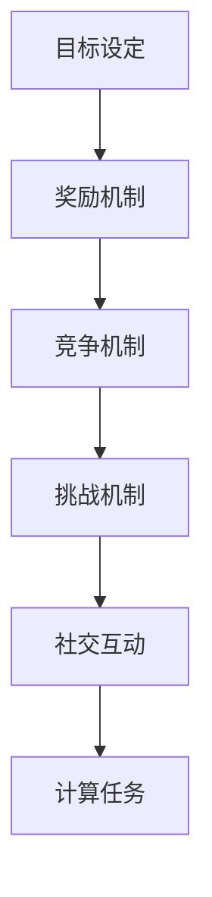

                 

关键词：游戏化、用户体验、参与感、计算、激励设计

## 摘要

在数字化时代，用户体验变得越来越重要。为了让人们更加享受计算过程，我们引入了游戏化的概念，通过将计算任务游戏化，增加用户的参与感和乐趣。本文将探讨游戏化的体验设计原则，介绍如何通过游戏化的策略提升计算任务的吸引力，并结合实际案例，分析游戏化在计算领域中的应用与效果。

## 1. 背景介绍

随着互联网和移动设备的普及，人们的生活越来越依赖计算。无论是办公、学习还是娱乐，计算都已经成为我们日常生活的一部分。然而，传统的计算任务往往给人带来枯燥和单调的感觉，导致用户参与度不高。如何提升计算任务的用户体验，让计算变得更加有趣和引人入胜，成为了一个重要课题。

游戏化体验的设计应运而生。游戏化（Gamification）是一种通过应用游戏设计元素来提升非游戏体验的策略。它包括竞争、奖励、等级、挑战等元素，旨在激发用户的参与感和乐趣。游戏化不仅在游戏领域取得了巨大成功，还逐渐被应用于教育、健身、市场营销等多个领域。

本文将探讨游戏化体验在计算领域中的应用，分析如何通过游戏化的设计策略，提升计算任务的趣味性和用户的参与感。

## 2. 核心概念与联系

### 2.1 游戏化体验的定义

游戏化体验是一种通过应用游戏设计元素来提升非游戏体验的策略。这些元素包括但不限于：

- **目标设定**：为用户提供明确的任务和目标，激发他们的动力。
- **奖励机制**：为完成任务的用户提供奖励，增加他们的成就感。
- **竞争机制**：通过与其他用户的竞争，提升用户的参与度和乐趣。
- **挑战机制**：设置适当难度的任务，让用户在挑战中不断进步。
- **社交互动**：鼓励用户之间的互动，增加社区感。

### 2.2 游戏化体验与计算任务的联系

计算任务通常包括数据输入、算法执行、结果分析等环节。通过游戏化设计，可以将这些环节转化为有趣的游戏体验：

- **目标设定**：将复杂的计算任务分解为小目标，每完成一个小目标，用户就能获得成就感。
- **奖励机制**：为用户提供积分、徽章、排名等形式的奖励，激励他们持续参与。
- **竞争机制**：通过排行榜等功能，让用户与其他用户竞争，提升参与度。
- **挑战机制**：设置难度递增的任务，让用户在挑战中不断提升技能。
- **社交互动**：鼓励用户分享自己的成果，增加社区的互动性。

### 2.3 游戏化体验的 Mermaid 流程图



在这个流程图中，游戏化体验的核心概念和计算任务之间的联系被清晰地展示出来。通过这些设计元素，我们可以将计算任务转化为有趣的游戏体验，提高用户的参与度和满意度。

## 3. 核心算法原理 & 具体操作步骤

### 3.1 算法原理概述

游戏化体验的核心算法原理在于如何将计算任务转化为有趣的游戏体验。这涉及到以下几个关键步骤：

1. **目标设定**：根据计算任务的特点，设定明确的任务目标和期望结果。
2. **奖励机制**：设计合理的奖励系统，包括积分、徽章、排名等，以激励用户参与。
3. **竞争机制**：通过排行榜、挑战赛等形式，增加用户的参与度和乐趣。
4. **挑战机制**：设置难度递增的任务，让用户在挑战中不断提升技能。
5. **社交互动**：鼓励用户分享自己的成果，增加社区的互动性。

### 3.2 算法步骤详解

1. **目标设定**：

   - **任务分解**：将复杂的计算任务分解为多个小任务，每个小任务都有一个明确的目标和期望结果。
   - **目标可视化**：将任务目标和期望结果以可视化的形式展示给用户，让用户清楚地了解任务的目标和进展。

2. **奖励机制**：

   - **积分系统**：为完成任务的用户提供积分，积分可以用来兑换奖品或提升等级。
   - **徽章系统**：为完成特定任务的用户提供徽章，徽章可以作为用户技能和成就的象征。
   - **排名系统**：通过排行榜展示用户的积分和排名，激励用户竞争和进步。

3. **竞争机制**：

   - **挑战赛**：定期举办挑战赛，让用户在规定时间内完成特定的任务。
   - **排行榜**：实时更新用户的积分和排名，让用户了解自己的进步和与其他用户的差距。

4. **挑战机制**：

   - **难度递增**：根据用户的完成情况和技能水平，逐步提高任务的难度。
   - **挑战提示**：为用户提供挑战提示，帮助他们克服难关。

5. **社交互动**：

   - **分享功能**：鼓励用户分享自己的成果和经验，增加社区的互动性。
   - **社区论坛**：建立社区论坛，让用户交流心得，共同进步。

### 3.3 算法优缺点

**优点**：

- 提高用户参与度和满意度。
- 增强用户的学习和成长动力。
- 提升任务完成效率和准确性。

**缺点**：

- 可能增加系统维护和运营成本。
- 如果设计不当，可能导致用户疲劳和反感。

### 3.4 算法应用领域

- **在线教育**：通过游戏化设计，提升学生的学习兴趣和参与度。
- **企业培训**：通过游戏化设计，提高员工的技能和绩效。
- **健康医疗**：通过游戏化设计，鼓励患者进行康复锻炼和健康管理。

## 4. 数学模型和公式 & 详细讲解 & 举例说明

### 4.1 数学模型构建

游戏化体验的数学模型主要包括以下几个方面：

1. **目标函数**：定义用户参与度、任务完成度、奖励获取量等目标指标。
2. **奖励机制**：定义奖励的发放规则和计算方法。
3. **竞争机制**：定义排名和积分的计算方法。
4. **挑战机制**：定义任务难度的调整策略。

### 4.2 公式推导过程

1. **目标函数**：

   $$f = w_1 \cdot D_1 + w_2 \cdot D_2 + w_3 \cdot D_3$$

   其中，$f$ 表示总目标函数，$D_1, D_2, D_3$ 分别表示用户参与度、任务完成度和奖励获取量，$w_1, w_2, w_3$ 分别为它们的权重。

2. **奖励机制**：

   $$R = R_0 + R_1 \cdot D$$

   其中，$R$ 表示奖励量，$R_0$ 为基础奖励，$R_1$ 为奖励系数，$D$ 为任务完成度。

3. **竞争机制**：

   $$P = P_0 + P_1 \cdot I$$

   其中，$P$ 表示排名，$P_0$ 为基础排名，$P_1$ 为排名系数，$I$ 为积分。

4. **挑战机制**：

   $$D_{next} = D_{current} + \alpha \cdot (1 - D_{current})$$

   其中，$D_{next}$ 表示下一个任务的难度，$D_{current}$ 表示当前任务的难度，$\alpha$ 为难度调整系数。

### 4.3 案例分析与讲解

以一款在线教育平台为例，假设其游戏化体验的数学模型如下：

1. **目标函数**：

   $$f = 0.6 \cdot D_1 + 0.3 \cdot D_2 + 0.1 \cdot D_3$$

   其中，用户参与度、任务完成度和奖励获取量的权重分别为 0.6、0.3 和 0.1。

2. **奖励机制**：

   $$R = 100 + 10 \cdot D$$

   其中，基础奖励为 100，奖励系数为 10。

3. **竞争机制**：

   $$P = 1000 - 5 \cdot I$$

   其中，基础排名为 1000，排名系数为 -5。

4. **挑战机制**：

   $$D_{next} = D_{current} + 0.1 \cdot (1 - D_{current})$$

   其中，难度调整系数为 0.1。

假设一名用户完成了 10 个任务，获得了 500 个积分，当前任务的难度为 0.5。根据以上数学模型，可以计算出：

- 目标函数：$f = 0.6 \cdot 1 + 0.3 \cdot 1 + 0.1 \cdot 500 = 0.6 + 0.3 + 50 = 50.9$
- 奖励量：$R = 100 + 10 \cdot 1 = 110$
- 排名：$P = 1000 - 5 \cdot 500 = 500$
- 下一个任务的难度：$D_{next} = 0.5 + 0.1 \cdot (1 - 0.5) = 0.5 + 0.1 \cdot 0.5 = 0.55$

通过这个例子，我们可以看到游戏化体验的数学模型如何帮助平台评估用户的参与度、奖励用户、激励竞争和调整任务难度。

## 5. 项目实践：代码实例和详细解释说明

### 5.1 开发环境搭建

为了实现游戏化体验，我们使用 Python 编写了一个简单的在线教育平台。以下是开发环境的搭建步骤：

1. 安装 Python 3.8 及以上版本。
2. 安装 Flask 框架：`pip install flask`
3. 安装 SQLAlchemy：`pip install sqlalchemy`
4. 安装 Flask-Migrate：`pip install flask-migrate`

### 5.2 源代码详细实现

以下是游戏化体验的核心代码实现：

```python
from flask import Flask, render_template, request, redirect, url_for
from flask_sqlalchemy import SQLAlchemy

app = Flask(__name__)
app.config['SQLALCHEMY_DATABASE_URI'] = 'sqlite:///users.db'
db = SQLAlchemy(app)

class User(db.Model):
    id = db.Column(db.Integer, primary_key=True)
    username = db.Column(db.String(80), unique=True, nullable=False)
    points = db.Column(db.Integer, default=0)
    rank = db.Column(db.Integer, default=0)

@app.route('/')
def index():
    users = User.query.all()
    users = sorted(users, key=lambda x: x.rank, reverse=True)
    return render_template('index.html', users=users)

@app.route('/add_user', methods=['POST'])
def add_user():
    username = request.form['username']
    new_user = User(username=username)
    db.session.add(new_user)
    db.session.commit()
    return redirect(url_for('index'))

@app.route('/update_points/<int:user_id>', methods=['POST'])
def update_points(user_id):
    points = int(request.form['points'])
    user = User.query.get(user_id)
    user.points += points
    db.session.commit()
    return redirect(url_for('index'))

if __name__ == '__main__':
    db.create_all()
    app.run(debug=True)
```

### 5.3 代码解读与分析

1. **数据库模型**：

   - `User` 类表示用户，包含用户名、积分和排名等信息。
   - 使用 SQLAlchemy 创建数据库模型。

2. **路由和视图函数**：

   - `/` 路由：显示用户列表和排名。
   - `/add_user` 路由：添加新用户。
   - `/update_points` 路由：更新用户积分。

3. **模板文件**：

   - `index.html` 模板：用于渲染用户列表和排名。

### 5.4 运行结果展示

1. **用户注册**：

   - 用户可以通过注册页面添加新用户。

2. **用户积分更新**：

   - 管理员可以通过更新积分页面调整用户积分。

3. **用户排名**：

   - 用户列表按照积分和排名排序显示。

## 6. 实际应用场景

游戏化体验在计算领域有着广泛的应用。以下是一些实际应用场景：

1. **在线教育**：

   - 通过游戏化设计，提升学生的学习兴趣和参与度。
   - 例如，通过积分、徽章和排名等机制，激励学生完成学习任务。

2. **企业培训**：

   - 通过游戏化设计，提高员工的技能和绩效。
   - 例如，通过挑战赛和排行榜等机制，鼓励员工竞争和学习。

3. **健康医疗**：

   - 通过游戏化设计，鼓励患者进行康复锻炼和健康管理。
   - 例如，通过积分和排名等机制，激励患者积极参与康复训练。

4. **软件开发**：

   - 通过游戏化设计，提高开发团队的协作效率和代码质量。
   - 例如，通过积分和徽章等机制，激励团队成员积极参与代码审查和修复漏洞。

## 7. 工具和资源推荐

### 7.1 学习资源推荐

- **《游戏化设计：动机、策略和实践》**：介绍游戏化设计的基本概念、策略和应用。
- **《用户体验设计：原则与方法》**：讲解用户体验设计的基本原则和方法，为游戏化设计提供理论支持。

### 7.2 开发工具推荐

- **Flask**：一款轻量级的 Python Web 框架，适合快速开发小型应用。
- **Django**：一款功能强大的 Python Web 框架，适合开发大型应用。

### 7.3 相关论文推荐

- **"Gamification in Education: A Systematic Review"**：系统性地总结了游戏化在教育领域的应用和研究。
- **"Gamification in the Workplace: A Meta-Analytic Review"**：分析了游戏化在职场中的应用效果和影响因素。

## 8. 总结：未来发展趋势与挑战

### 8.1 研究成果总结

游戏化体验在计算领域取得了显著成果。通过将计算任务游戏化，可以显著提高用户的参与度和满意度。游戏化设计已成为提升用户体验、增强用户互动和激发用户创造力的重要手段。

### 8.2 未来发展趋势

1. **个性化游戏化体验**：未来游戏化体验将更加注重个性化，根据用户特点和需求，提供定制化的游戏化设计。
2. **跨平台整合**：游戏化体验将逐渐整合到各种平台和设备中，实现无缝衔接和跨平台互动。
3. **虚拟现实与增强现实**：游戏化体验将结合虚拟现实和增强现实技术，提供更加沉浸式和互动性的体验。

### 8.3 面临的挑战

1. **隐私保护**：游戏化体验需要处理大量用户数据，如何保护用户隐私将成为一大挑战。
2. **可持续性**：游戏化体验的设计需要考虑长期可持续性，避免用户疲劳和厌烦。
3. **技术发展**：随着技术的不断发展，游戏化体验需要不断更新和优化，以适应新的技术和应用场景。

### 8.4 研究展望

未来，游戏化体验在计算领域的研究将更加深入和广泛。通过跨学科合作和新技术应用，我们可以探索更多游戏化设计的方法和策略，为用户提供更加丰富和有趣的计算体验。

## 9. 附录：常见问题与解答

### 9.1 游戏化体验的定义是什么？

游戏化体验是一种通过应用游戏设计元素（如目标设定、奖励机制、竞争机制、挑战机制、社交互动等）来提升非游戏体验（如学习、工作、健身等）的策略。

### 9.2 游戏化体验有哪些优点？

游戏化体验的优点包括提高用户参与度、增强用户互动、激发用户创造力、提高任务完成效率等。

### 9.3 如何设计游戏化体验？

设计游戏化体验的关键步骤包括目标设定、奖励机制设计、竞争机制设计、挑战机制设计和社交互动设计。同时，需要考虑用户需求和体验，确保游戏化体验的可持续性和有效性。

### 9.4 游戏化体验在计算领域有哪些应用？

游戏化体验在计算领域有广泛的应用，包括在线教育、企业培训、健康医疗、软件开发等。通过游戏化设计，可以提升计算任务的趣味性和用户的参与感。

### 9.5 游戏化体验有哪些挑战？

游戏化体验面临的挑战包括隐私保护、可持续性、技术发展等。如何平衡游戏化体验的趣味性和实用性，确保用户体验的长期可持续性，是游戏化设计的重要课题。

----------------------------------------------------------------

以上是关于“游戏化体验：让参与人类计算乐在其中”的完整文章。希望这篇文章能够帮助您更好地理解游戏化体验的设计原则和应用方法，为提升计算任务的用户体验提供有益的参考。作者：禅与计算机程序设计艺术 / Zen and the Art of Computer Programming。

