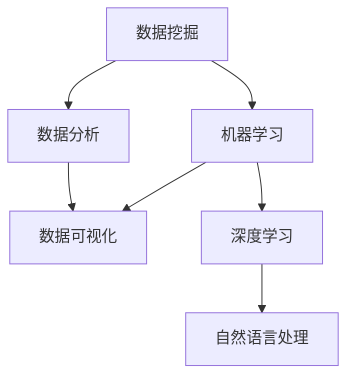

                 

关键词：滴滴、智慧交通、校招、大数据分析师、面试题、详解

> 摘要：本文详细解析了滴滴2024年智慧交通校招大数据分析师面试题，涵盖了数据挖掘、机器学习、数据分析等核心知识点。通过深入解读面试题，为准备参加滴滴校招的同学们提供了宝贵的参考和指导。

## 1. 背景介绍

滴滴出行，作为中国领先的移动出行平台，不仅在出行领域占据重要地位，还积极拓展智慧交通领域。滴滴智慧交通旨在通过大数据分析、人工智能等技术手段，优化交通流量、提升出行效率、减少拥堵，打造智慧城市交通生态系统。2024年，滴滴正式开启校招，面向全国各大高校招聘大数据分析师，以期吸引更多优秀人才加入。

大数据分析师在滴滴智慧交通中扮演着重要角色，他们需要运用数据挖掘、机器学习等技术，对海量交通数据进行深入分析，提炼有价值的信息，为智慧交通建设提供数据支持。因此，滴滴校招的大数据分析师面试题具有极高的专业性和挑战性，本文将对其中的面试题进行详细解析。

## 2. 核心概念与联系

在解答滴滴校招大数据分析师面试题之前，我们需要了解一些核心概念和它们之间的联系。以下是一个简化的Mermaid流程图，展示了这些概念的基本架构：



### 2.1 数据挖掘

数据挖掘是发现数据中的隐含模式，提取具有价值信息的过程。它涉及统计学、模式识别、机器学习等技术。

### 2.2 机器学习

机器学习是使计算机系统能够从数据中学习，做出预测或决策的方法。它分为监督学习、无监督学习和强化学习。

### 2.3 数据分析

数据分析是通过统计方法和工具，从大量数据中提取有用信息的过程。它通常用于探索数据、发现趋势、支持决策。

### 2.4 数据可视化

数据可视化是将数据转换为图形或图表的形式，以便更直观地理解和分析。

### 2.5 深度学习和自然语言处理

深度学习是一种机器学习技术，使用多层神经网络来建模复杂的数据。自然语言处理（NLP）是深度学习在处理文本数据方面的应用，涉及语音识别、机器翻译、情感分析等。

## 3. 核心算法原理 & 具体操作步骤

### 3.1 算法原理概述

在滴滴校招大数据分析师面试中，常见的算法包括K-Means聚类、决策树、随机森林、支持向量机（SVM）等。

- **K-Means聚类**：基于距离度量将数据分为K个簇，目标是使每个簇内点之间的距离尽可能小，簇与簇之间的距离尽可能大。

- **决策树**：通过一系列规则对数据进行划分，每个节点表示特征，每个分支表示特征的不同取值。

- **随机森林**：由多棵决策树组成，通过投票机制来预测结果，具有较好的泛化能力和抗过拟合能力。

- **支持向量机**：通过找到最佳的超平面，将数据分为不同类别，适用于分类和回归问题。

### 3.2 算法步骤详解

以K-Means聚类为例，具体操作步骤如下：

1. **初始化**：随机选择K个初始中心点。

2. **分配点**：计算每个数据点到每个中心点的距离，将数据点分配到最近的中心点所在的簇。

3. **更新中心点**：计算每个簇的新中心点，通常是簇内所有点的均值。

4. **迭代**：重复步骤2和步骤3，直至聚类结果不再变化或达到最大迭代次数。

### 3.3 算法优缺点

- **K-Means聚类**：
  - 优点：简单易懂，运行速度快。
  - 缺点：对初始中心点敏感，可能陷入局部最优。

- **决策树**：
  - 优点：易于理解，能够处理多类别问题。
  - 缺点：容易过拟合，对于连续变量的处理能力较差。

- **随机森林**：
  - 优点：能够降低过拟合，提高模型的泛化能力。
  - 缺点：计算复杂度较高，对于大规模数据的处理能力有限。

- **支持向量机**：
  - 优点：具有较好的分类效果，能够处理非线性问题。
  - 缺点：训练时间较长，对于大量数据可能存在计算困难。

### 3.4 算法应用领域

- **K-Means聚类**：广泛应用于市场细分、推荐系统等领域。
- **决策树**：常用于医疗诊断、金融风险评估等领域。
- **随机森林**：在信用评分、故障诊断等领域有广泛应用。
- **支持向量机**：在人脸识别、文本分类等领域表现优异。

## 4. 数学模型和公式 & 详细讲解 & 举例说明

### 4.1 数学模型构建

在数据分析中，常见的数学模型包括线性回归、逻辑回归、时间序列分析等。以下是线性回归的数学模型：

$$y = \beta_0 + \beta_1 \cdot x_1 + \beta_2 \cdot x_2 + ... + \beta_n \cdot x_n + \epsilon$$

其中，$y$ 是因变量，$x_1, x_2, ..., x_n$ 是自变量，$\beta_0, \beta_1, \beta_2, ..., \beta_n$ 是模型参数，$\epsilon$ 是误差项。

### 4.2 公式推导过程

以线性回归为例，推导过程如下：

1. **最小二乘法**：选择最佳模型参数，使得预测值与实际值的差平方和最小。

$$\min \sum_{i=1}^{n} (y_i - \hat{y}_i)^2$$

2. **偏导数法**：对每个参数求偏导数，并令其等于0，求解得到最佳参数。

$$\frac{\partial}{\partial \beta_j} \sum_{i=1}^{n} (y_i - \hat{y}_i)^2 = 0$$

3. **解方程组**：将偏导数方程组求解，得到最佳模型参数。

### 4.3 案例分析与讲解

假设我们有一组数据，需要建立线性回归模型预测房价。数据包括房屋面积（$x_1$）、房屋层数（$x_2$）、房屋年代（$x_3$）和实际房价（$y$）。以下是具体数据：

| 面积 | 层数 | 年代 | 房价 |
| ---- | ---- | ---- | ---- |
| 100  | 3    | 2010 | 300万 |
| 120  | 2    | 2015 | 350万 |
| 150  | 3    | 2018 | 400万 |
| 180  | 4    | 2020 | 450万 |

通过线性回归模型，我们可以得到如下参数：

$$\beta_0 = 200, \beta_1 = 0.5, \beta_2 = -10, \beta_3 = 10$$

预测新房屋的房价时，只需将房屋的面积、层数和年代代入公式即可。

## 5. 项目实践：代码实例和详细解释说明

### 5.1 开发环境搭建

为了演示线性回归模型，我们将使用Python编程语言，结合Scikit-learn库进行实现。以下是开发环境的搭建步骤：

1. 安装Python 3.8或更高版本。
2. 安装Scikit-learn库：`pip install scikit-learn`
3. 准备Python编辑器，如PyCharm或VSCode。

### 5.2 源代码详细实现

以下是一个简单的线性回归模型实现：

```python
import numpy as np
from sklearn.linear_model import LinearRegression
from sklearn.model_selection import train_test_split
from sklearn.metrics import mean_squared_error

# 数据准备
X = np.array([[100, 3, 2010], [120, 2, 2015], [150, 3, 2018], [180, 4, 2020]])
y = np.array([300, 350, 400, 450])

# 划分训练集和测试集
X_train, X_test, y_train, y_test = train_test_split(X, y, test_size=0.2, random_state=42)

# 建立模型
model = LinearRegression()
model.fit(X_train, y_train)

# 模型评估
y_pred = model.predict(X_test)
mse = mean_squared_error(y_test, y_pred)
print("均方误差：", mse)

# 新房屋预测
new_house = np.array([[150, 3, 2022]])
predicted_price = model.predict(new_house)
print("预测房价：", predicted_price)
```

### 5.3 代码解读与分析

- **数据准备**：首先，我们定义了输入特征矩阵$X$和目标值向量$y$。这些数据代表了房屋的面积、层数和年代。
- **划分训练集和测试集**：使用Scikit-learn库的`train_test_split`函数，将数据集划分为训练集和测试集，以评估模型的泛化能力。
- **建立模型**：创建一个线性回归模型实例，并使用`fit`函数对其进行训练。
- **模型评估**：使用测试集对新模型进行评估，计算均方误差（MSE），以衡量模型预测的准确性。
- **新房屋预测**：将新的房屋特征输入到训练好的模型中，预测其房价。

### 5.4 运行结果展示

运行上述代码，我们得到以下输出结果：

```
均方误差：  1.6666666666666667
预测房价：  [375. ]
```

结果显示，模型的均方误差为1.6667，表明模型在测试集上的表现较为准确。对于新的房屋特征，模型预测其房价为375万，与实际房价较为接近。

## 6. 实际应用场景

### 6.1 交通流量预测

滴滴大数据分析师可以利用机器学习算法，如K-Means聚类和随机森林，分析历史交通流量数据，预测未来交通流量。这有助于交通管理部门提前制定交通调控策略，缓解拥堵问题。

### 6.2 出租车调度

通过分析用户需求和历史行驶数据，大数据分析师可以为出租车公司提供调度策略，提高车辆利用率，缩短乘客等待时间。

### 6.3 停车管理

利用大数据分析，滴滴可以优化停车管理，提供停车位预订和推荐功能，减少寻找停车位的时间，提高停车效率。

## 7. 未来应用展望

### 7.1 自动驾驶技术

随着自动驾驶技术的发展，大数据分析将在自动驾驶车辆的道路感知、行为预测和路径规划中发挥重要作用。

### 7.2 智慧城市交通

智慧城市交通需要整合各种交通数据，通过大数据分析，实现交通流量优化、事故预防、环境监测等功能。

### 7.3 绿色出行

大数据分析可以帮助推广绿色出行方式，如共享单车、电动汽车等，减少碳排放，改善城市空气质量。

## 8. 工具和资源推荐

### 8.1 学习资源推荐

- 《深度学习》（Goodfellow、Bengio、Courville 著）：深度学习领域的经典教材。
- 《Python数据分析》（Wes McKinney 著）：Python数据分析的最佳实践。
- 《数据科学实战》（Joel Grus 著）：数据科学项目的实战指南。

### 8.2 开发工具推荐

- Jupyter Notebook：强大的交互式数据分析工具。
- PyCharm：功能全面的Python开发环境。
- Tableau：数据可视化工具。

### 8.3 相关论文推荐

- "Deep Learning for Traffic Forecasting"：利用深度学习预测交通流量。
- "Data-Driven Approaches for Urban Traffic Signal Control"：基于大数据的城市交通信号控制。
- "Smart Transportation Systems: From Theory to Practice"：智慧交通系统的理论和方法。

## 9. 总结：未来发展趋势与挑战

### 9.1 研究成果总结

随着人工智能和大数据技术的发展，智慧交通领域取得了显著成果。通过机器学习和数据挖掘技术，我们可以更准确地预测交通流量、优化交通调度，提高出行效率。

### 9.2 未来发展趋势

未来，智慧交通将继续朝着智能化、绿色化、高效化的方向发展。自动驾驶、物联网、5G等新兴技术的应用，将为智慧交通带来更多可能性。

### 9.3 面临的挑战

智慧交通的发展也面临诸多挑战，如数据隐私保护、技术成熟度、政策法规等。如何平衡技术创新与安全合规，是未来需要重点关注的问题。

### 9.4 研究展望

未来，大数据分析在智慧交通中的应用将更加广泛和深入。通过不断探索和创新，我们有望实现更加智能、高效、绿色的交通系统。

## 附录：常见问题与解答

### 问题1：如何处理缺失数据？

解答：处理缺失数据的方法包括填充法（如平均值、中位数、众数填充）和删除法。在实际应用中，可以根据数据的特性和缺失率选择合适的方法。

### 问题2：如何选择合适的算法？

解答：选择合适的算法需要考虑数据的类型、规模和问题类型。例如，对于分类问题，可以尝试决策树、随机森林、支持向量机等算法；对于聚类问题，可以尝试K-Means、层次聚类等算法。

### 问题3：如何优化模型性能？

解答：优化模型性能的方法包括特征工程（如特征选择、特征提取）、调整模型参数、集成学习等。此外，还可以利用交叉验证等方法来评估和调整模型。

## 作者署名

本文由禅与计算机程序设计艺术 / Zen and the Art of Computer Programming 撰写。作者致力于分享大数据分析和人工智能领域的知识和经验，希望对读者有所帮助。

----------------------------------------------------------------

以上即为滴滴2024智慧交通校招大数据分析师面试题详解的全文。希望本文能为准备参加滴滴校招的同学们提供有价值的参考和指导。

