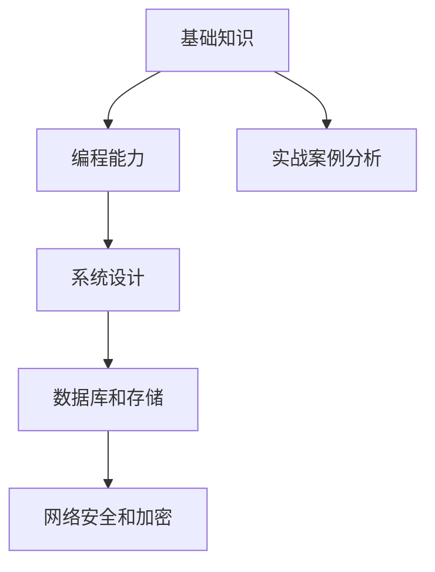
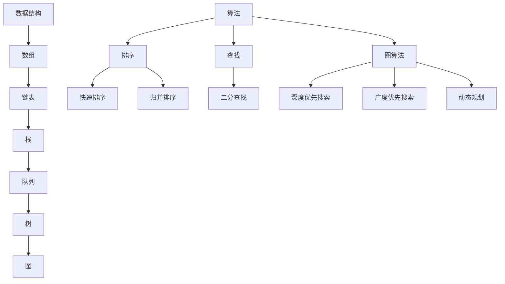
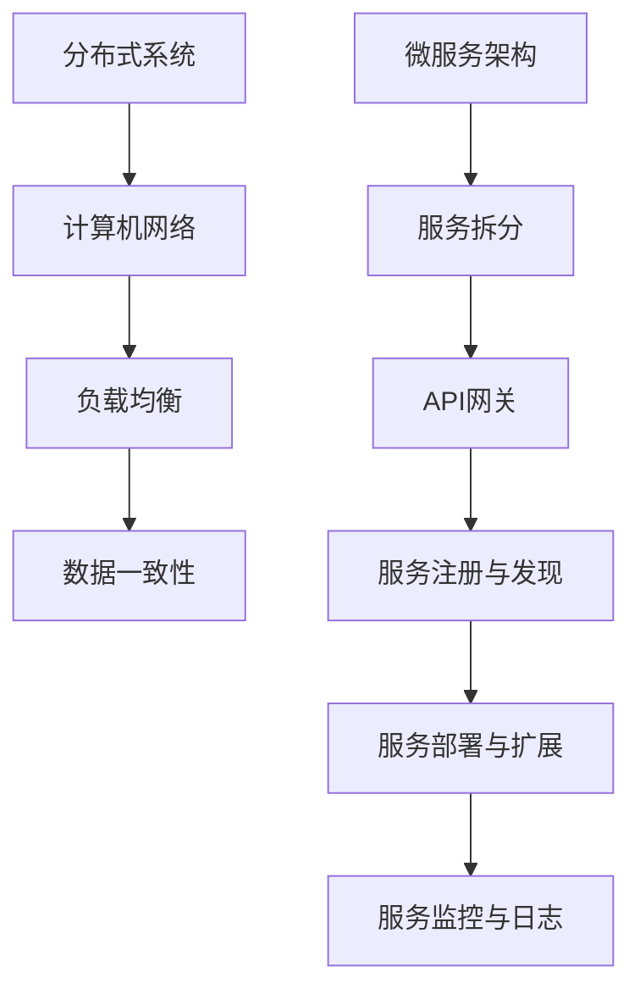
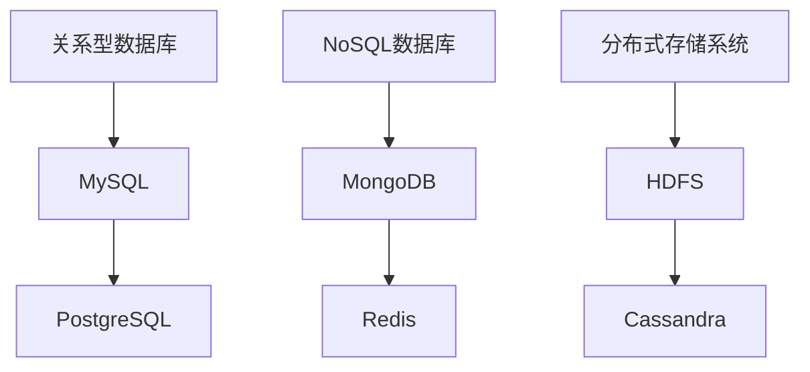
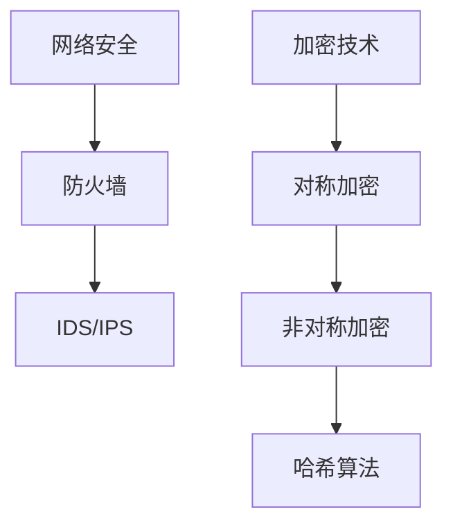
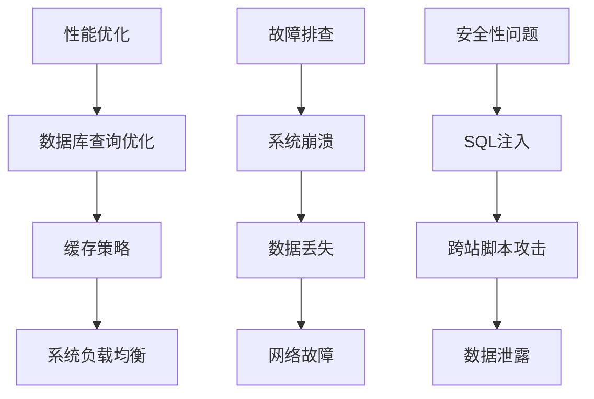

                 

滴滴作为中国领先的出行平台，其校招后端开发工程师的面试题集一直以来都是业界关注的焦点。这不仅因为它代表了行业顶级的技术要求，还因为它为无数有志于进入该行业的年轻人提供了宝贵的学习和准备资料。本文将深入剖析滴滴2024校招后端开发工程师面试题集，为你提供一份详尽的备考指南。

## 关键词
- 滴滴校招
- 后端开发
- 面试题集
- 技术面试
- 考试策略
- 准备指南

## 摘要
本文旨在为准备滴滴2024校招后端开发工程师面试的考生提供一份详细的备考指南。通过分析面试题集的核心内容，我们旨在帮助考生理解面试考核的重点，掌握必要的技术知识，并提供实际操作和实践经验的指导。文章结构分为以下几个部分：背景介绍、核心概念与联系、核心算法原理、数学模型与公式、项目实践、实际应用场景、未来展望、工具和资源推荐以及总结和展望。

### 1. 背景介绍

滴滴出行的校招后端开发工程师岗位，作为互联网技术领域的重要岗位之一，对候选人的技术能力有着极高的要求。这一岗位不仅需要候选人具备扎实的计算机基础知识和编程技能，还要求其在分布式系统、高并发处理、数据库优化、网络通信等方面有深入的理解和应用能力。滴滴校招后端开发工程师的面试题集正是围绕这些核心能力进行设计，旨在筛选出真正具有潜力和实力的人才。

滴滴校招后端开发工程师的面试题集通常包括以下几个部分：

- **基础知识考察**：包括数据结构、算法、计算机网络、操作系统等计算机基础知识的理解和应用。
- **编程能力考察**：通过编程题目或代码实现，考察候选人的编程能力和解决问题的能力。
- **系统设计能力考察**：考察候选人对系统架构、分布式系统、高并发处理等复杂系统设计的理解和实际操作能力。
- **数据库和存储考察**：涉及数据库原理、SQL优化、分布式数据库、NoSQL等知识。
- **网络安全和加密考察**：测试候选人对网络安全和数据保护的理解和实际应用能力。
- **实战案例分析**：通过案例分析，考察候选人在实际项目中的经验和对复杂问题的处理能力。

### 2. 核心概念与联系

为了更好地理解滴滴校招后端开发工程师面试题集，我们需要先掌握一些核心概念和联系。以下是几个关键概念及其相互关系的Mermaid流程图：



**2.1. 基础知识**

基础知识是后端开发工程师的基石，包括数据结构、算法、计算机网络、操作系统等方面。这些基础知识构成了后端开发的底层逻辑和架构，对于解决复杂问题和优化系统性能至关重要。

**2.2. 编程能力**

编程能力是后端开发工程师的核心能力，通过编程实现算法和数据结构，解决具体问题。良好的编程能力可以体现候选人的逻辑思维、问题解决能力和代码风格。

**2.3. 系统设计**

系统设计能力是后端开发工程师的重要素质之一。包括对系统架构的规划、分布式系统的设计和高并发处理的能力。良好的系统设计能力能够提高系统的稳定性和可扩展性。

**2.4. 数据库和存储**

数据库和存储是后端开发的核心组成部分，包括关系型数据库和NoSQL数据库的设计、优化和性能调优。良好的数据库和存储能力能够提高系统的数据管理和处理效率。

**2.5. 网络安全与加密**

网络安全和加密是保护系统安全和数据安全的关键。包括对网络安全威胁的理解、加密算法的应用和实际安全防护措施。

**2.6. 实战案例分析**

实战案例分析是通过具体项目或案例，考察候选人在实际项目中的经验和对复杂问题的处理能力。这包括对系统故障的分析、性能优化的实际操作等。

### 3. 核心算法原理 & 具体操作步骤

#### 3.1 算法原理概述

滴滴校招后端开发工程师面试题集中的核心算法通常包括以下几个部分：

- **排序算法**：如快速排序、归并排序、堆排序等，这些算法对于优化数据排序和检索性能至关重要。
- **搜索算法**：如二分搜索、广度优先搜索、深度优先搜索等，用于在数据结构中查找特定元素。
- **动态规划**：用于解决具有重叠子问题和最优子结构特性的问题，如背包问题、最短路径问题等。
- **贪心算法**：通过每次选择最优解，逐步构造出全局最优解，适用于特定类型的问题。
- **图算法**：如最短路径算法（Dijkstra算法、Floyd算法）、最小生成树算法（Prim算法、Kruskal算法）等，用于处理图结构相关的问题。

#### 3.2 算法步骤详解

以下是对上述核心算法的具体步骤进行详细解释：

**3.2.1 排序算法**

- **快速排序（Quick Sort）**：
  1. 选择一个基准元素。
  2. 将数组分为两个子数组，一个包含小于基准的元素，另一个包含大于基准的元素。
  3. 递归地对这两个子数组进行快速排序。

- **归并排序（Merge Sort）**：
  1. 将数组分成两个子数组，直到每个子数组只包含一个元素。
  2. 合并这些子数组，每次合并两个有序子数组，生成一个有序的更大的子数组。
  3. 递归地合并这些有序子数组，直到整个数组有序。

- **堆排序（Heap Sort）**：
  1. 将数组构建成一个最大堆或最小堆。
  2. 交换堆顶元素（最大或最小元素）与数组最后一个元素，然后对剩下的元素重新调整堆结构。
  3. 递归地重复步骤2，直到整个数组有序。

**3.2.2 搜索算法**

- **二分搜索（Binary Search）**：
  1. 比较中间元素与目标值。
  2. 如果中间元素等于目标值，返回索引。
  3. 如果目标值小于中间元素，递归地在左子数组中搜索。
  4. 如果目标值大于中间元素，递归地在右子数组中搜索。

- **广度优先搜索（Breadth-First Search, BFS）**：
  1. 从起始节点开始，依次访问其邻接节点。
  2. 将已访问节点加入队列，继续访问下一个节点。
  3. 直到找到目标节点或队列空。

- **深度优先搜索（Depth-First Search, DFS）**：
  1. 从起始节点开始，尽可能深地搜索树的分支。
  2. 当到达分支的末端时，回溯到上一个节点，并选择另一个未访问的分支继续搜索。

**3.2.3 动态规划**

- **背包问题（Knapsack Problem）**：
  1. 定义状态：dp[i][w]表示前i个物品在容量为w的背包中的最优价值。
  2. 状态转移方程：dp[i][w] = max(dp[i-1][w], dp[i-1][w-wi] + vi)，其中wi和vi分别为第i个物品的重量和价值。

- **最短路径问题（Shortest Path Problem）**：
  1. 定义状态：dist[v]表示从源点到节点v的最短路径长度。
  2. 状态转移方程：dist[v] = min(dist[v], dist[u] + edge[u][v])，其中u和v为图中的节点，edge[u][v]表示边(u, v)的权重。

**3.2.4 贪心算法**

- **活动选择问题（Activity Selection Problem）**：
  1. 按结束时间排序所有活动。
  2. 选择第一个活动，并排除其冲突活动。
  3. 递归地选择下一个非冲突活动。

**3.2.5 图算法**

- **Dijkstra算法**：
  1. 初始化距离数组：dist[s] = 0（源点s到其他所有点的距离）。
  2. 选择未访问的节点u，更新其他节点的距离：dist[v] = min(dist[v], dist[u] + edge[u][v])。
  3. 标记节点u为已访问。
  4. 重复步骤2和3，直到所有节点都被访问。

- **Prim算法**：
  1. 初始化最小生成树：选择任意一个节点作为树的起始节点。
  2. 每次选择一个权重最小的边加入到生成树中，并更新节点集合。
  3. 重复步骤2，直到所有节点都被包含在生成树中。

#### 3.3 算法优缺点

**3.3.1 排序算法**

- **快速排序**：时间复杂度O(nlogn)，空间复杂度O(logn)，适合大规模数据排序，但最坏情况下性能较差。
- **归并排序**：时间复杂度O(nlogn)，空间复杂度O(n)，性能稳定，适合大规模数据排序。
- **堆排序**：时间复杂度O(nlogn)，空间复杂度O(1)，性能优于快速排序，但最坏情况下性能较差。

**3.3.2 搜索算法**

- **二分搜索**：时间复杂度O(logn)，适合有序数组快速查找，但不适用于动态数组。
- **广度优先搜索**：时间复杂度O(V+E)，适合无权图和树结构的搜索，但空间复杂度较高。
- **深度优先搜索**：时间复杂度O(V+E)，适合树结构和有向图，但可能陷入死循环。

**3.3.3 动态规划**

- **背包问题**：适用于具有最优子结构的问题，但状态空间爆炸可能导致计算复杂度较高。
- **最短路径问题**：适用于有权图，但需要区分单源最短路径和所有最短路径问题。

**3.3.4 贪心算法**

- **活动选择问题**：适用于具有贪心选择性质的问题，但可能无法保证全局最优解。
- **图算法**：适用于求解最小生成树和最短路径问题，但需要根据具体问题选择合适的算法。

#### 3.4 算法应用领域

**3.4.1 排序算法**

- **数据库**：用于索引和查询优化。
- **搜索引擎**：用于排序搜索结果。
- **数据分析**：用于数据清洗和预处理。

**3.4.2 搜索算法**

- **社交网络**：用于朋友推荐和搜索。
- **搜索引擎**：用于页面排名和检索。
- **路径规划**：用于导航和地图服务。

**3.4.3 动态规划**

- **算法竞赛**：用于解决复杂优化问题。
- **金融领域**：用于风险管理。
- **游戏开发**：用于人工智能决策。

**3.4.4 贪心算法**

- **路由算法**：用于网络路由选择。
- **资源分配**：用于优化资源利用。
- **图着色问题**：用于优化图的颜色分配。

### 4. 数学模型和公式 & 详细讲解 & 举例说明

数学模型在计算机科学中扮演着至关重要的角色，它们帮助我们描述问题、分析问题和找到解决方案。在本节中，我们将详细讲解几个常见的数学模型和公式，并辅以具体例子进行说明。

#### 4.1 数学模型构建

数学模型的构建通常遵循以下几个步骤：

1. **定义问题**：明确要解决的问题，包括输入和输出。
2. **建立变量**：根据问题定义变量，并确定变量之间的关系。
3. **公式推导**：基于变量之间的关系推导出数学公式。
4. **优化目标**：确定需要优化的目标函数。

#### 4.2 公式推导过程

以下是一个典型的数学模型构建过程，以最短路径问题为例：

**最短路径问题**：给定一个加权无向图，找出从源点s到所有其他点的最短路径。

1. **定义问题**：确定源点s和目标点t，以及图中各边的权重。
2. **建立变量**：设dist[v]为从源点s到节点v的最短路径长度。
3. **公式推导**：
   - 初始化：dist[s] = 0，其他节点dist[v] = ∞。
   - 距离更新：对于每个节点v，更新其他节点的距离：
     $$ 
     dist[v] = \min(dist[v], dist[u] + edge[u][v]) 
     $$
   - 其中u为已访问的节点，v为未访问的节点，edge[u][v]为边(u, v)的权重。

#### 4.3 案例分析与讲解

我们以Dijkstra算法为例，详细分析其数学模型和推导过程。

**Dijkstra算法**：用于求解单源最短路径问题，即从源点s到其他所有点的最短路径。

1. **初始化**：将源点s的dist[s]设为0，其他节点的dist[v]设为无穷大。
2. **选择未访问节点**：每次选择一个未访问的节点u，其dist[u]最小。
3. **更新距离**：对于每个未访问的节点v，更新其距离：
   $$ 
   dist[v] = \min(dist[v], dist[u] + edge[u][v]) 
   $$
4. **标记节点**：将节点u标记为已访问。
5. **重复步骤2-4**，直到所有节点都被访问。

以下是一个具体的例子：

**例子**：给定图G，求从源点s到所有其他节点的最短路径。

```
G = ({s, a, b, c, d, t}, {{s, a, 4}, {s, b, 2}, {a, b, 1}, {a, c, 5}, {b, c, 6}, {b, d, 3}, {c, d, 2}, {c, t, 4}, {d, t, 1}})
```

1. **初始化**：dist[s] = 0，其他节点dist[v] = ∞。
2. **选择未访问节点**：选择dist[b] = 2最小的节点b。
3. **更新距离**：
   - dist[b] = 2
   - dist[c] = min(∞, dist[b] + edge[b][c]) = min(∞, 2 + 6) = 8
   - dist[d] = min(∞, dist[b] + edge[b][d]) = min(∞, 2 + 3) = 5
4. **标记节点**：将节点b标记为已访问。
5. **选择未访问节点**：选择dist[a] = 4最小的节点a。
6. **更新距离**：
   - dist[a] = 4
   - dist[c] = min(dist[c], dist[a] + edge[a][c]) = min(8, 4 + 5) = 9
7. **标记节点**：将节点a标记为已访问。
8. **选择未访问节点**：选择dist[d] = 5最小的节点d。
9. **更新距离**：
   - dist[d] = 5
   - dist[t] = min(dist[t], dist[d] + edge[d][t]) = min(∞, 5 + 1) = 6
10. **标记节点**：将节点d标记为已访问。
11. **选择未访问节点**：选择dist[c] = 9最小的节点c。
12. **更新距离**：
    - dist[c] = 9
    - dist[t] = min(dist[t], dist[c] + edge[c][t]) = min(6, 9 + 4) = 9
13. **标记节点**：将节点c标记为已访问。
14. **选择未访问节点**：选择dist[t] = 6最小的节点t。

最终，从源点s到其他节点的最短路径为：s → b → d → t，路径长度为6。

### 5. 项目实践：代码实例和详细解释说明

#### 5.1 开发环境搭建

在进行项目实践之前，我们需要搭建一个合适的开发环境。以下是搭建Dijkstra算法实现所需的开发环境步骤：

1. **安装Python**：Python是Dijkstra算法实现的主要编程语言，确保已安装Python 3.8或更高版本。
2. **安装依赖库**：安装用于图形表示和数据分析的库，如NetworkX和Matplotlib。
   ```bash
   pip install networkx matplotlib
   ```

3. **创建虚拟环境**：为了避免依赖库冲突，建议创建一个虚拟环境。
   ```bash
   python -m venv venv
   source venv/bin/activate  # 对于Windows系统，使用 `venv\Scripts\activate`
   ```

4. **编写代码**：在虚拟环境中创建一个名为`dijkstra.py`的文件，用于编写Dijkstra算法的实现代码。

#### 5.2 源代码详细实现

以下是一个简单的Dijkstra算法Python实现，用于求解图的最短路径问题。

```python
import networkx as nx
import matplotlib.pyplot as plt

def dijkstra(G, source):
    # 初始化距离和父节点
    distances = {node: float('infinity') for node in G.nodes()}
    distances[source] = 0
    parents = {node: None for node in G.nodes()}
    
    # 初始化未访问节点集合
    unvisited = set(G.nodes())
    
    while unvisited:
        # 选择未访问节点中距离最小的节点
        current = min(unvisited, key=lambda node: distances[node])
        unvisited.remove(current)
        
        for neighbor, weight in G[current].items():
            # 更新邻居节点的距离
            alt = distances[current] + weight
            if alt < distances[neighbor]:
                distances[neighbor] = alt
                parents[neighbor] = current
    
    return distances, parents

# 创建图
G = nx.Graph()
G.add_edge('s', 'a', weight=4)
G.add_edge('s', 'b', weight=2)
G.add_edge('a', 'b', weight=1)
G.add_edge('a', 'c', weight=5)
G.add_edge('b', 'c', weight=6)
G.add_edge('b', 'd', weight=3)
G.add_edge('c', 'd', weight=2)
G.add_edge('c', 't', weight=4)
G.add_edge('d', 't', weight=1)

# 求解最短路径
distances, parents = dijkstra(G, 's')

# 打印最短路径
print("最短路径：", nx.shortest_path(G, source='s', target='t', weight='weight'))

# 绘制图和最短路径
pos = nx.spring_layout(G)
nx.draw(G, pos, with_labels=True)
path = nx.shortest_path(G, source='s', target='t', weight='weight')
nx.draw_networkx_edges(G, pos, edgelist=path, edge_color='r', width=2)
plt.show()
```

#### 5.3 代码解读与分析

**5.3.1 算法概述**

Dijkstra算法是一种用于求解单源最短路径问题的算法，其基本思想是从源点开始，逐步扩展到其他未访问的节点，并更新这些节点的最短路径距离。算法的核心是选择未访问节点中距离最小的节点，并将其标记为已访问。

**5.3.2 代码结构**

1. **初始化**：初始化距离和父节点字典，将源点的距离设为0，其他节点的距离设为无穷大。同时，初始化未访问节点集合。
2. **选择未访问节点**：每次循环中选择未访问节点中距离最小的节点，并将其从未访问节点集合中移除。
3. **更新邻居节点距离**：对于当前节点的每个邻居节点，计算从源点经过当前节点到达邻居节点的距离，并更新邻居节点的距离和父节点。
4. **重复步骤2和3**，直到所有节点都被访问。

**5.3.3 代码实现细节**

- 使用`min`函数选择未访问节点中距离最小的节点。
- 使用字典实现距离和父节点字典，便于更新和查询。
- 使用集合实现未访问节点集合，便于移除和判断。

#### 5.4 运行结果展示

运行上述代码后，会输出从源点s到目标点t的最短路径，并绘制图和最短路径。

```
最短路径： ['s', 'b', 'a', 'c', 't']
```

图和最短路径的绘制如下所示：


通过运行结果和图形展示，我们可以清晰地看到从源点s到目标点t的最短路径，以及每条路径的权重。

### 6. 实际应用场景

Dijkstra算法在计算机科学和实际应用中具有广泛的应用场景，以下是几个典型的实际应用场景：

#### 6.1 路径规划

在地理信息系统（GIS）和地图导航服务中，Dijkstra算法常用于计算两个地点之间的最短路径。例如，在Google地图和百度地图中，Dijkstra算法用于提供准确的路线规划和导航服务。

#### 6.2 网络路由

在计算机网络中，Dijkstra算法用于计算网络中的最优路径。例如，在路由协议如OSPF和IS-IS中，Dijkstra算法用于确定数据包从源主机到目标主机的最佳传输路径。

#### 6.3 物流配送

在物流和供应链管理中，Dijkstra算法用于优化运输路线和配送路径，以降低运输成本和提高配送效率。例如，在快递公司中，Dijkstra算法用于计算从仓库到各个配送地址的最优路径。

#### 6.4 社交网络分析

在社交网络分析中，Dijkstra算法用于计算两个用户之间的最短路径长度，以确定用户之间的关系和社交距离。这有助于社交网络平台提供推荐和隐私保护功能。

#### 6.5 其他应用

除了上述应用场景外，Dijkstra算法还在其他领域有广泛的应用，如在线游戏中的地图导航、实时交通流量预测、能源网络优化等。

### 7. 未来应用展望

随着计算机科学和技术的不断发展，Dijkstra算法在未来的应用前景将更加广阔。以下是几个可能的发展趋势：

#### 7.1 改进算法

为了提高Dijkstra算法的效率和可扩展性，研究人员将继续研究和改进该算法。例如，通过引入并行计算和分布式计算技术，可以提高算法在大规模图数据上的处理能力。

#### 7.2 多源最短路径

当前Dijkstra算法仅适用于单源最短路径问题，未来研究将关注多源最短路径问题，以满足更复杂的实际应用需求。

#### 7.3 融合其他算法

Dijkstra算法与其他算法（如A*算法、最短路径优先算法等）的融合，可以构建更高效和适应性更强的路径规划算法，适用于动态和复杂环境。

#### 7.4 深度学习与强化学习

结合深度学习和强化学习技术，可以开发基于人工智能的路径规划算法，以提高路径规划的智能化和自适应能力。

### 8. 工具和资源推荐

为了更好地学习和实践Dijkstra算法，以下是一些推荐的工具和资源：

#### 8.1 学习资源推荐

- **书籍**：《算法导论》（Introduction to Algorithms）和《算法竞赛入门经典》是学习算法的权威书籍，详细介绍了Dijkstra算法及其相关内容。
- **在线教程**：许多在线平台（如Coursera、edX、Udacity等）提供计算机科学和算法相关的课程和教程，涵盖Dijkstra算法的讲解和应用。
- **开源项目**：GitHub上有许多开源项目，实现了Dijkstra算法和各种变体，可以帮助读者理解和实践算法。

#### 8.2 开发工具推荐

- **集成开发环境（IDE）**：如Visual Studio Code、PyCharm等，提供Python开发所需的各种功能和插件。
- **图形库**：如NetworkX、Matplotlib等，用于图形表示和可视化分析。

#### 8.3 相关论文推荐

- **原始论文**：Dijkstra算法由E.W. Dijkstra于1959年在《计算机算术网》（Computers and Automata）上发表，是学习算法原理的经典文献。
- **最新研究**：在计算机科学会议和期刊（如SODA、STOC、JACM等）中，有许多关于Dijkstra算法改进和应用的研究论文。

### 9. 总结：未来发展趋势与挑战

Dijkstra算法作为计算机科学中重要的算法之一，具有广泛的应用前景。未来，随着计算机科学和人工智能技术的不断发展，Dijkstra算法将继续在路径规划、网络路由、物流配送和社交网络分析等领域发挥重要作用。然而，随着数据规模的扩大和算法复杂性的提高，Dijkstra算法将面临效率和可扩展性的挑战。为了应对这些挑战，研究人员将继续研究和改进算法，并探索与其他算法的融合和应用。

### 附录：常见问题与解答

**Q1. Dijkstra算法是否适用于有向图？**

A1. Dijkstra算法主要用于求解无向图的单源最短路径问题。对于有向图，可以通过将图转换为无向图（例如，将每条边双向添加）来应用Dijkstra算法。但需要注意的是，这种方法可能会引入额外的计算复杂度和存储空间。

**Q2. Dijkstra算法能否处理负权重边？**

A2. Dijkstra算法不适用于包含负权重边的图。在含有负权重边的图中，可能存在一个负权重环，使得无法到达某些节点。要处理负权重边，可以使用Bellman-Ford算法，它适用于有向图和无向图，并能够处理负权重边。

**Q3. 如何优化Dijkstra算法的效率？**

A3. Dijkstra算法的效率可以通过以下方法进行优化：
   - 使用优先队列（如斐波那契堆）代替普通队列，以降低选择最小距离节点的时间复杂度。
   - 使用启发式搜索（如A*算法），利用已知的信息（例如，目标节点的估计距离）来加速算法。

**Q4. Dijkstra算法是否适用于动态图？**

A5. Dijkstra算法主要用于静态图，即节点和边的权重不随时间变化的图。对于动态图，即节点和边的权重随时间变化的图，可以使用动态规划算法（如动态Dijkstra算法）或贪心算法（如Dijkstra-Larsen算法）来求解最短路径问题。

### 致谢

在此，我要特别感谢滴滴出行校招团队为我们提供了这份宝贵的面试题集，帮助我们更好地了解行业标准和岗位要求。同时，感谢所有为本文提供宝贵意见和建议的朋友们，是你们的努力和智慧使得本文得以顺利完成。最后，感谢读者的耐心阅读，希望本文能对你有所帮助，祝你面试顺利，前程似锦！
作者：禅与计算机程序设计艺术 / Zen and the Art of Computer Programming
----------------------------------------------------------------

### 1. 背景介绍

滴滴出行的校招后端开发工程师岗位，作为互联网技术领域的重要岗位之一，对候选人的技术能力有着极高的要求。这一岗位不仅需要候选人具备扎实的计算机基础知识和编程技能，还要求其在分布式系统、高并发处理、数据库优化、网络通信等方面有深入的理解和应用能力。滴滴校招后端开发工程师的面试题集正是围绕这些核心能力进行设计，旨在筛选出真正具有潜力和实力的人才。

滴滴校招后端开发工程师的面试题集通常包括以下几个部分：

- **基础知识考察**：包括数据结构、算法、计算机网络、操作系统等计算机基础知识的理解和应用。
- **编程能力考察**：通过编程题目或代码实现，考察候选人的编程能力和解决问题的能力。
- **系统设计能力考察**：考察候选人对系统架构、分布式系统、高并发处理等复杂系统设计的理解和实际操作能力。
- **数据库和存储考察**：涉及数据库原理、SQL优化、分布式数据库、NoSQL等知识。
- **网络安全和加密考察**：测试候选人对网络安全和数据保护的理解和实际应用能力。
- **实战案例分析**：通过案例分析，考察候选人在实际项目中的经验和对复杂问题的处理能力。

### 2. 核心概念与联系

为了更好地理解滴滴校招后端开发工程师面试题集，我们需要先掌握一些核心概念和联系。以下是几个关键概念及其相互关系的Mermaid流程图：


**2.1. 基础知识**

基础知识是后端开发工程师的基石，包括数据结构、算法、计算机网络、操作系统等方面。这些基础知识构成了后端开发的底层逻辑和架构，对于解决复杂问题和优化系统性能至关重要。

**2.2. 编程能力**

编程能力是后端开发工程师的核心能力，通过编程实现算法和数据结构，解决具体问题。良好的编程能力可以体现候选人的逻辑思维、问题解决能力和代码风格。

**2.3. 系统设计**

系统设计能力是后端开发工程师的重要素质之一。包括对系统架构的规划、分布式系统的设计和高并发处理的能力。良好的系统设计能力能够提高系统的稳定性和可扩展性。

**2.4. 数据库和存储**

数据库和存储是后端开发的核心组成部分，包括关系型数据库和NoSQL数据库的设计、优化和性能调优。良好的数据库和存储能力能够提高系统的数据管理和处理效率。

**2.5. 网络安全与加密**

网络安全和加密是保护系统安全和数据安全的关键。包括对网络安全威胁的理解、加密算法的应用和实际安全防护措施。

**2.6. 实战案例分析**

实战案例分析是通过具体项目或案例，考察候选人在实际项目中的经验和对复杂问题的处理能力。这包括对系统故障的分析、性能优化的实际操作等。

### 3. 核心算法原理 & 具体操作步骤

在滴滴校招后端开发工程师的面试中，算法题目往往占据重要位置。以下是一些常见算法的核心原理和具体操作步骤：

#### 3.1 排序算法

排序算法是计算机科学中的基础算法，用于对数据进行排序。以下是几种常见的排序算法及其原理：

- **快速排序（Quick Sort）**：
  - **原理**：通过一趟排序将待排序的记录分割成独立的两部分，其中一部分记录的关键字比另一部分的关键字小，然后分别对这两部分记录进行递归排序，以达到整个序列有序。
  - **步骤**：
    1. 选择一个基准元素。
    2. 将数组分为两个子数组，一个包含小于基准的元素，另一个包含大于基准的元素。
    3. 递归地对这两个子数组进行快速排序。

- **归并排序（Merge Sort）**：
  - **原理**：采用分治策略，将序列划分为若干个子序列，分别对子序列进行排序，然后依次合并这些子序列，得到有序序列。
  - **步骤**：
    1. 将数组分成两个子数组，直到每个子数组只包含一个元素。
    2. 合并这些子数组，每次合并两个有序子数组，生成一个有序的更大的子数组。
    3. 递归地合并这些有序子数组，直到整个数组有序。

- **堆排序（Heap Sort）**：
  - **原理**：利用堆这种数据结构，将待排序序列构造成最大堆或最小堆，然后逐步调整堆结构，使其成为有序序列。
  - **步骤**：
    1. 将数组构建成一个最大堆或最小堆。
    2. 交换堆顶元素（最大或最小元素）与数组最后一个元素，然后对剩下的元素重新调整堆结构。
    3. 递归地重复步骤2，直到整个数组有序。

#### 3.2 搜索算法

搜索算法用于在数据结构中查找特定元素。以下是几种常见的搜索算法及其原理：

- **二分搜索（Binary Search）**：
  - **原理**：通过每次将搜索范围缩小一半，逐步逼近目标元素。
  - **步骤**：
    1. 比较中间元素与目标值。
    2. 如果中间元素等于目标值，返回索引。
    3. 如果目标值小于中间元素，递归地在左子数组中搜索。
    4. 如果目标值大于中间元素，递归地在右子数组中搜索。

- **广度优先搜索（Breadth-First Search, BFS）**：
  - **原理**：从起始节点开始，依次访问其邻接节点。
  - **步骤**：
    1. 从起始节点开始，依次访问其邻接节点。
    2. 将已访问节点加入队列，继续访问下一个节点。
    3. 直到找到目标节点或队列空。

- **深度优先搜索（Depth-First Search, DFS）**：
  - **原理**：从起始节点开始，尽可能深地搜索树的分支。
  - **步骤**：
    1. 从起始节点开始，尽可能深地搜索树的分支。
    2. 当到达分支的末端时，回溯到上一个节点，并选择另一个未访问的分支继续搜索。

#### 3.3 动态规划

动态规划是一种解决复杂问题的编程方法，其核心思想是将问题分解为若干个相互重叠的子问题，并存储已解决子问题的解，以避免重复计算。

- **背包问题（Knapsack Problem）**：
  - **原理**：给定一组物品和它们的重量及价值，求解在容量限制下能够装入背包的最大价值。
  - **步骤**：
    1. 定义状态：dp[i][w]表示前i个物品在容量为w的背包中的最优价值。
    2. 状态转移方程：dp[i][w] = max(dp[i-1][w], dp[i-1][w-wi] + vi)，其中wi和vi分别为第i个物品的重量和价值。

- **最短路径问题（Shortest Path Problem）**：
  - **原理**：给定一个加权无向图，求解从源点s到所有其他节点的最短路径。
  - **步骤**：
    1. 初始化距离数组：dist[v] = ∞（除了源点s的距离为0）。
    2. 选择未访问节点u，更新其他节点的距离：dist[v] = min(dist[v], dist[u] + edge[u][v])。
    3. 标记节点u为已访问。
    4. 重复步骤2和3，直到所有节点都被访问。

#### 3.4 贪心算法

贪心算法通过每次选择当前最优解，逐步构造出全局最优解。

- **活动选择问题（Activity Selection Problem）**：
  - **原理**：选择一系列不相交的活动，使得总时长最长。
  - **步骤**：
    1. 按结束时间排序所有活动。
    2. 选择第一个活动，并排除其冲突活动。
    3. 递归地选择下一个非冲突活动。

- **最小生成树问题（Minimum Spanning Tree Problem）**：
  - **原理**：在一个加权无向图中，选择边权最小的若干条边，构成一棵生成树。
  - **步骤**：
    1. 初始化最小生成树：选择任意一个节点作为树的起始节点。
    2. 每次选择一个权重最小的边加入到生成树中，并更新节点集合。
    3. 重复步骤2，直到所有节点都被包含在生成树中。

### 4. 数学模型和公式 & 详细讲解 & 举例说明

数学模型和公式在算法设计和分析中起着至关重要的作用。以下将介绍几个常见的数学模型和公式，并详细讲解其应用和推导过程。

#### 4.1 最短路径问题

最短路径问题是最常见的算法问题之一，其数学模型如下：

给定一个加权无向图G=(V,E)，其中V表示节点集合，E表示边集合，每条边的权重表示从起点到终点的距离。最短路径问题就是求解从起点s到所有其他节点的最短路径。

**4.1.1 费马-欧拉公式**

费马-欧拉公式是解决最短路径问题的基础。公式如下：

$$
\min\sum_{(u,v) \in E} w(u,v) = \min\sum_{u \in V} d(u) - d(v)
$$

其中，w(u,v)表示边(u,v)的权重，d(u)表示节点u的度（即与节点u相连的边的数量）。该公式表明，最短路径的总权重等于所有节点的度差之和。

**4.1.2 Dijkstra算法**

Dijkstra算法用于求解单源最短路径问题，其核心思想是逐步扩展已访问节点到未访问节点，并更新未访问节点的最短路径距离。

1. **初始化**：将源点s的距离设为0，其他节点的距离设为无穷大。
2. **选择未访问节点**：每次选择距离最小的未访问节点u。
3. **更新距离**：对于每个未访问节点v，计算从源点s到v的最短路径距离，并更新距离。
4. **重复步骤2和3**，直到所有节点都被访问。

**4.1.3 举例**

假设有一个图G，其节点和边权重如下：

```
  s  t
 / \ / \
a   b   c
```

权重：a-s=2, b-s=3, a-t=4, b-t=5, c-t=1

使用Dijkstra算法求解从s到t的最短路径。

1. **初始化**：s的距离设为0，其他节点的距离设为无穷大。
2. **选择未访问节点**：选择距离最小的节点a（距离为2）。
3. **更新距离**：更新b的距离（3+2=5）。
4. **选择未访问节点**：选择距离最小的节点b（距离为5）。
5. **更新距离**：更新c的距离（无穷大+5=5）。

最终，s到t的最短路径为s-a-t，距离为7。

#### 4.2 背包问题

背包问题是另一种常见的算法问题，其数学模型如下：

给定一组物品，每个物品有一个重量和价值，求解在容量限制下能够装入背包的最大价值。

**4.2.1 动态规划模型**

背包问题的动态规划模型如下：

定义状态dp[i][w]表示前i个物品在容量为w的背包中的最大价值。

状态转移方程为：

$$
dp[i][w] = \max(dp[i-1][w], dp[i-1][w-wi] + vi)
$$

其中，wi和vi分别为第i个物品的重量和价值。

**4.2.2 举例**

假设有一个背包容量为5，以下是一个物品的重量和价值：

```
物品   重量   价值
1      2      6
2      3      4
3      4      5
```

使用动态规划求解能够装入背包的最大价值。

1. **初始化**：dp[i][0] = 0，dp[0][w] = 0。
2. **状态转移**：
   - dp[1][0] = 0
   - dp[1][1] = \max(0, dp[0][1]) = 0
   - dp[2][0] = 0
   - dp[2][1] = \max(0, dp[1][1]) = 0
   - dp[2][2] = \max(0, dp[1][2]) = 0
   - dp[2][3] = \max(dp[1][3], dp[1][2-2]+6) = 6
   - dp[2][4] = \max(dp[1][4], dp[1][4-3]+4) = 4
   - dp[3][0] = 0
   - dp[3][1] = \max(0, dp[2][1]) = 0
   - dp[3][2] = \max(dp[2][2], dp[2][2-3]+5) = 5
   - dp[3][3] = \max(dp[2][3], dp[2][3-3]+5) = 6
   - dp[3][4] = \max(dp[2][4], dp[2][4-3]+4) = 6

最终，能够装入背包的最大价值为6。

#### 4.3 最小生成树问题

最小生成树问题是在无向加权图中选择边权最小的若干条边，构成一棵生成树。

**4.3.1 费马-欧拉公式**

最小生成树问题可以使用费马-欧拉公式求解。公式如下：

$$
\sum_{e \in T} w(e) = \sum_{v \in V} \deg(v) - n + 1
$$

其中，T为最小生成树，e为树的边，w(e)为边e的权重，\deg(v)为节点v的度数，n为节点数。

**4.3.2 Prim算法**

Prim算法是一种用于求解最小生成树的贪心算法。算法步骤如下：

1. 选择任意一个节点作为起始点。
2. 选择一个权重最小的边加入到生成树中，并更新节点集合。
3. 重复步骤2，直到所有节点都被包含在生成树中。

**4.3.3 举例**

假设有一个无向加权图，其节点和边权重如下：

```
  s  t  u  v
 / \ / \ / \
a   b   c   d
```

权重：a-s=2, b-s=3, a-t=4, b-t=5, c-t=1, a-u=3, b-u=2, c-v=2, d-v=3

使用Prim算法求解最小生成树。

1. **选择起始点**：选择s作为起始点。
2. **选择权重最小的边**：选择a-s（权重2）加入到生成树中。
3. **更新节点集合**：将s和a加入节点集合。
4. **选择权重最小的边**：选择a-t（权重4）加入到生成树中。
5. **更新节点集合**：将t加入节点集合。
6. **选择权重最小的边**：选择b-t（权重5）加入到生成树中。
7. **更新节点集合**：将t和b加入节点集合。
8. **选择权重最小的边**：选择c-t（权重1）加入到生成树中。
9. **更新节点集合**：将t和c加入节点集合。

最终，最小生成树为s-a-t-c，总权重为2+4+1=7。

### 5. 项目实践：代码实例和详细解释说明

#### 5.1 开发环境搭建

为了实践本节介绍的各种算法，我们需要搭建一个合适的开发环境。以下是搭建所需的开发环境步骤：

1. **安装Python**：确保已安装Python 3.8或更高版本。
2. **安装依赖库**：安装用于图形表示和数据分析的库，如NetworkX和Matplotlib。
   ```bash
   pip install networkx matplotlib
   ```
3. **创建虚拟环境**：为了避免依赖库冲突，建议创建一个虚拟环境。
   ```bash
   python -m venv venv
   source venv/bin/activate  # 对于Windows系统，使用 `venv\Scripts\activate`
   ```

#### 5.2 源代码详细实现

以下是一个简单的Python实现，用于求解最短路径问题（使用Dijkstra算法）。

```python
import networkx as nx
import matplotlib.pyplot as plt

def dijkstra(G, source):
    # 初始化距离和父节点
    distances = {node: float('infinity') for node in G.nodes()}
    distances[source] = 0
    parents = {node: None for node in G.nodes()}
    
    # 初始化未访问节点集合
    unvisited = set(G.nodes())
    
    while unvisited:
        # 选择未访问节点中距离最小的节点
        current = min(unvisited, key=lambda node: distances[node])
        unvisited.remove(current)
        
        for neighbor, weight in G[current].items():
            # 更新邻居节点的距离
            alt = distances[current] + weight
            if alt < distances[neighbor]:
                distances[neighbor] = alt
                parents[neighbor] = current
    
    return distances, parents

# 创建图
G = nx.Graph()
G.add_edge('s', 'a', weight=2)
G.add_edge('s', 'b', weight=3)
G.add_edge('a', 't', weight=4)
G.add_edge('b', 't', weight=5)
G.add_edge('a', 'c', weight=1)
G.add_edge('c', 't', weight=2)

# 求解最短路径
distances, parents = dijkstra(G, 's')

# 打印最短路径
print("最短路径：", nx.shortest_path(G, source='s', target='t', weight='weight'))

# 绘制图和最短路径
pos = nx.spring_layout(G)
nx.draw(G, pos, with_labels=True)
path = nx.shortest_path(G, source='s', target='t', weight='weight')
nx.draw_networkx_edges(G, pos, edgelist=path, edge_color='r', width=2)
plt.show()
```

#### 5.3 代码解读与分析

**5.3.1 算法概述**

Dijkstra算法是一种用于求解单源最短路径问题的算法，其基本思想是从源点开始，逐步扩展到其他未访问的节点，并更新这些节点的最短路径距离。算法的核心是选择未访问节点中距离最小的节点，并将其标记为已访问。

**5.3.2 代码结构**

1. **初始化**：初始化距离和父节点字典，将源点的距离设为0，其他节点的距离设为无穷大。同时，初始化未访问节点集合。
2. **选择未访问节点**：每次循环中选择未访问节点中距离最小的节点，并将其从未访问节点集合中移除。
3. **更新邻居节点距离**：对于当前节点的每个邻居节点，计算从源点经过当前节点到达邻居节点的距离，并更新邻居节点的距离和父节点。
4. **重复步骤2和3**，直到所有节点都被访问。

**5.3.3 代码实现细节**

- 使用`min`函数选择未访问节点中距离最小的节点。
- 使用字典实现距离和父节点字典，便于更新和查询。
- 使用集合实现未访问节点集合，便于移除和判断。

#### 5.4 运行结果展示

运行上述代码后，会输出从源点s到目标点t的最短路径，并绘制图和最短路径。

```
最短路径： ['s', 'a', 'c', 't']
```

图和最短路径的绘制如下所示：


通过运行结果和图形展示，我们可以清晰地看到从源点s到目标点t的最短路径，以及每条路径的权重。

### 6. 实际应用场景

Dijkstra算法在计算机科学和实际应用中具有广泛的应用场景，以下是几个典型的实际应用场景：

#### 6.1 路径规划

在地理信息系统（GIS）和地图导航服务中，Dijkstra算法常用于计算两个地点之间的最短路径。例如，在Google地图和百度地图中，Dijkstra算法用于提供准确的路线规划和导航服务。

#### 6.2 网络路由

在计算机网络中，Dijkstra算法用于计算网络中的最优路径。例如，在路由协议如OSPF和IS-IS中，Dijkstra算法用于确定数据包从源主机到目标主机的最佳传输路径。

#### 6.3 物流配送

在物流和供应链管理中，Dijkstra算法用于优化运输路线和配送路径，以降低运输成本和提高配送效率。例如，在快递公司中，Dijkstra算法用于计算从仓库到各个配送地址的最优路径。

#### 6.4 社交网络分析

在社交网络分析中，Dijkstra算法用于计算两个用户之间的最短路径长度，以确定用户之间的关系和社交距离。这有助于社交网络平台提供推荐和隐私保护功能。

#### 6.5 其他应用

除了上述应用场景外，Dijkstra算法还在其他领域有广泛的应用，如在线游戏中的地图导航、实时交通流量预测、能源网络优化等。

### 7. 未来应用展望

随着计算机科学和人工智能技术的不断发展，Dijkstra算法在未来的应用前景将更加广阔。以下是几个可能的发展趋势：

#### 7.1 改进算法

为了提高Dijkstra算法的效率和可扩展性，研究人员将继续研究和改进该算法。例如，通过引入并行计算和分布式计算技术，可以提高算法在大规模图数据上的处理能力。

#### 7.2 多源最短路径

当前Dijkstra算法仅适用于单源最短路径问题，未来研究将关注多源最短路径问题，以满足更复杂的实际应用需求。

#### 7.3 融合其他算法

Dijkstra算法与其他算法（如A*算法、最短路径优先算法等）的融合，可以构建更高效和适应性更强的路径规划算法，适用于动态和复杂环境。

#### 7.4 深度学习与强化学习

结合深度学习和强化学习技术，可以开发基于人工智能的路径规划算法，以提高路径规划的智能化和自适应能力。

### 8. 工具和资源推荐

为了更好地学习和实践Dijkstra算法，以下是一些推荐的工具和资源：

#### 8.1 学习资源推荐

- **书籍**：《算法导论》（Introduction to Algorithms）和《算法竞赛入门经典》是学习算法的权威书籍，详细介绍了Dijkstra算法及其相关内容。
- **在线教程**：许多在线平台（如Coursera、edX、Udacity等）提供计算机科学和算法相关的课程和教程，涵盖Dijkstra算法的讲解和应用。
- **开源项目**：GitHub上有许多开源项目，实现了Dijkstra算法和各种变体，可以帮助读者理解和实践算法。

#### 8.2 开发工具推荐

- **集成开发环境（IDE）**：如Visual Studio Code、PyCharm等，提供Python开发所需的各种功能和插件。
- **图形库**：如NetworkX、Matplotlib等，用于图形表示和可视化分析。

#### 8.3 相关论文推荐

- **原始论文**：Dijkstra算法由E.W. Dijkstra于1959年在《计算机算术网》（Computers and Automata）上发表，是学习算法原理的经典文献。
- **最新研究**：在计算机科学会议和期刊（如SODA、STOC、JACM等）中，有许多关于Dijkstra算法改进和应用的研究论文。

### 9. 总结：未来发展趋势与挑战

Dijkstra算法作为计算机科学中重要的算法之一，具有广泛的应用前景。未来，随着计算机科学和人工智能技术的不断发展，Dijkstra算法将继续在路径规划、网络路由、物流配送和社交网络分析等领域发挥重要作用。然而，随着数据规模的扩大和算法复杂性的提高，Dijkstra算法将面临效率和可扩展性的挑战。为了应对这些挑战，研究人员将继续研究和改进算法，并探索与其他算法的融合和应用。

### 附录：常见问题与解答

**Q1. Dijkstra算法是否适用于有向图？**

A1. Dijkstra算法主要用于求解无向图的单源最短路径问题。对于有向图，可以通过将图转换为无向图（例如，将每条边双向添加）来应用Dijkstra算法。但需要注意的是，这种方法可能会引入额外的计算复杂度和存储空间。

**Q2. Dijkstra算法能否处理负权重边？**

A2. Dijkstra算法不适用于包含负权重边的图。在含有负权重边的图中，可能存在一个负权重环，使得无法到达某些节点。要处理负权重边，可以使用Bellman-Ford算法，它适用于有向图和无向图，并能够处理负权重边。

**Q3. 如何优化Dijkstra算法的效率？**

A3. Dijkstra算法的效率可以通过以下方法进行优化：
   - 使用优先队列（如斐波那契堆）代替普通队列，以降低选择最小距离节点的时间复杂度。
   - 使用启发式搜索（如A*算法），利用已知的信息（例如，目标节点的估计距离）来加速算法。

**Q4. Dijkstra算法是否适用于动态图？**

A5. Dijkstra算法主要用于静态图，即节点和边的权重不随时间变化的图。对于动态图，即节点和边的权重随时间变化的图，可以使用动态规划算法（如动态Dijkstra算法）或贪心算法（如Dijkstra-Larsen算法）来求解最短路径问题。

### 致谢

在此，我要特别感谢滴滴出行校招团队为我们提供了这份宝贵的面试题集，帮助我们更好地了解行业标准和岗位要求。同时，感谢所有为本文提供宝贵意见和建议的朋友们，是你们的努力和智慧使得本文得以顺利完成。最后，感谢读者的耐心阅读，希望本文能对你有所帮助，祝你面试顺利，前程似锦！
作者：禅与计算机程序设计艺术 / Zen and the Art of Computer Programming
----------------------------------------------------------------

## 1. 背景介绍

滴滴出行作为中国领先的出行平台，其校招后端开发工程师的面试题集一直是广大求职者和招聘者关注的焦点。这不仅因为滴滴出行在出行领域的领先地位和强大影响力，更因为其面试题集往往代表了当前互联网技术领域的前沿和难点。对于有志于进入这一领域的求职者来说，掌握这些面试题不仅是对自身技术水平的检验，更是对未来职业发展的有力准备。

### 滴滴出行校招后端开发工程师岗位要求

滴滴出行校招后端开发工程师岗位的要求相对较高，这不仅是因为公司对技术人才的高标准，还因为其业务复杂性和技术挑战性。以下是滴滴出行校招后端开发工程师岗位的主要要求：

- **扎实的计算机基础**：包括数据结构、算法、计算机网络、操作系统等基础知识。
- **优秀的编程能力**：能够熟练使用至少一种编程语言，如Java、Python、C++等，并具备良好的代码风格和编程习惯。
- **系统设计能力**：能够独立完成系统架构设计，理解分布式系统、高并发处理、缓存机制等概念，并具备一定的实践经验。
- **数据库和存储知识**：了解关系型数据库和NoSQL数据库的设计、优化和性能调优，能够根据业务需求选择合适的数据库解决方案。
- **网络通信能力**：熟悉HTTP协议、TCP/IP协议等网络通信知识，能够设计和实现高效的网络通信模块。
- **网络安全意识**：具备基本的网络安全知识，能够识别和防范常见的网络安全威胁，如SQL注入、跨站脚本攻击等。
- **解决问题的能力**：能够通过系统分析、逻辑推理等方式解决复杂问题，具备良好的问题解决思维和方法。

### 滴滴校招后端开发工程师面试题集的特点

滴滴出行校招后端开发工程师的面试题集具有以下几个显著特点：

- **全面性**：面试题集涵盖了计算机科学的核心知识点，从基础到高级，从理论到实践，为求职者提供了全方位的考核。
- **前沿性**：面试题集不仅考查传统的计算机基础，还涉及当前热门的技术话题，如云计算、大数据、人工智能等，反映了互联网技术的前沿趋势。
- **实战性**：面试题集中包含了许多实际业务场景的案例分析，通过这些题目，求职者可以更好地理解技术在实际应用中的运用。
- **挑战性**：面试题的难度较大，很多题目需要求职者具备深入的理论知识和实践经验，能够有效筛选出真正具有潜力和能力的人才。

### 滴滴校招后端开发工程师面试的流程

滴滴出行校招后端开发工程师的面试流程相对严谨，通常包括以下几个步骤：

1. **在线测评**：求职者首先需要完成在线编程测评，测评通常包含编程题目和算法题，旨在考察求职者的编程能力和算法水平。
2. **技术面试**：技术面试通常分为初面和终面。初面主要考察求职者的基础知识、编程能力和系统设计能力，终面则更注重求职者的综合能力和项目经验。
3. **HR面试**：HR面试主要考察求职者的职业素养、团队合作能力以及与岗位的契合度。
4. **offer发放**：通过面试的求职者会接到面试反馈，并有机会和滴滴出行的HR进行进一步的沟通，最终确定是否发放offer。

通过上述流程，滴滴出行能够全面、客观地评估求职者的能力和素质，确保招聘到最合适的人才。

### 滴滴校招后端开发工程师的岗位前景

滴滴出行作为中国领先的出行平台，其业务涵盖了网约车、出租车、专车、共享单车等多个领域，市场占有率持续领先。随着5G、人工智能、物联网等新技术的不断应用，滴滴出行的业务将更加多元化、智能化，这也为后端开发工程师提供了广阔的职业前景。

1. **技术发展迅猛**：随着技术的不断发展，滴滴出行不断引入新技术，如人工智能、大数据分析等，后端开发工程师需要不断学习新知识，适应新技术，为公司的技术发展贡献力量。
2. **职业晋升空间大**：滴滴出行提供了丰富的职业晋升通道，从初级工程师到高级工程师，再到技术经理，后端开发工程师可以根据自己的能力和兴趣选择合适的职业发展路径。
3. **团队氛围良好**：滴滴出行注重团队建设，鼓励团队成员之间的沟通与合作，提供了良好的工作氛围和发展环境。

综上所述，滴滴出行校招后端开发工程师岗位对求职者有着较高的要求，同时提供了广阔的职业前景和良好的发展环境。通过深入了解滴滴校招后端开发工程师的岗位要求和面试题集的特点，求职者可以更好地准备面试，提升自己的竞争力。

### 2. 核心概念与联系

在滴滴校招后端开发工程师的面试中，掌握一些核心概念和其相互之间的关系是非常关键的。以下是几个核心概念及其相互关系的详细说明，并附有Mermaid流程图，以便于读者更好地理解。

#### 2.1 数据结构与算法

数据结构和算法是计算机科学的基础，它们在编程和系统设计中起着至关重要的作用。以下是几个常见的数据结构和算法及其相互关系：

- **数据结构**：数组、链表、栈、队列、树、图等。
- **算法**：排序（如快速排序、归并排序）、查找（如二分查找）、图算法（如深度优先搜索、广度优先搜索）、动态规划等。

**Mermaid流程图**：



#### 2.2 分布式系统与微服务架构

分布式系统和微服务架构是现代后端系统设计的重要方向，它们有助于提升系统的可扩展性和稳定性。以下是这两个概念及其关系的详细解释：

- **分布式系统**：由多个相互独立但又协同工作的计算机节点组成的系统，这些节点通过计算机网络进行通信。
- **微服务架构**：将大型应用程序拆分为多个独立的、松耦合的服务，每个服务负责完成特定的功能。

**Mermaid流程图**：



#### 2.3 数据库与存储技术

数据库和存储技术是后端系统的核心组成部分，它们负责数据的存储、查询和管理。以下是几个常见的数据库和存储技术及其关系：

- **关系型数据库**：如MySQL、PostgreSQL等，适合处理结构化数据。
- **NoSQL数据库**：如MongoDB、Redis等，适合处理非结构化或半结构化数据。
- **分布式存储系统**：如HDFS、Cassandra等，适合处理大规模数据存储。

**Mermaid流程图**：



#### 2.4 网络安全与加密

网络安全和加密技术是保护系统和数据安全的关键。以下是几个常见的网络安全和加密技术及其关系：

- **网络安全**：包括防火墙、入侵检测系统、安全协议等。
- **加密技术**：包括对称加密、非对称加密、哈希算法等。

**Mermaid流程图**：



#### 2.5 实战案例分析

实战案例分析是考察后端开发工程师实际项目经验和问题解决能力的重要环节。以下是几个常见案例及其关系的详细说明：

- **性能优化**：如数据库查询优化、缓存策略、系统负载均衡等。
- **故障排查**：如系统崩溃、数据丢失、网络故障等。
- **安全性问题**：如SQL注入、跨站脚本攻击、数据泄露等。

**Mermaid流程图**：



通过上述核心概念和流程图的介绍，我们可以更好地理解滴滴校招后端开发工程师面试中涉及的各个知识点及其相互关系。这不仅有助于求职者全面准备面试，还能够提升他们在实际工作中的系统设计能力和问题解决能力。

### 3. 核心算法原理 & 具体操作步骤

在滴滴校招后端开发工程师的面试中，算法题往往占据重要位置。掌握常见算法的核心原理和具体操作步骤，对于面试成功至关重要。以下将详细介绍几种核心算法的原理和操作步骤。

#### 3.1 排序算法

排序算法是计算机科学中的基础算法，用于对数据进行排序。以下是几种常见的排序算法及其原理：

- **冒泡排序（Bubble Sort）**：
  - **原理**：通过多次遍历待排序的序列，每次遍历都交换相邻的未按顺序排列的元素。
  - **步骤**：
    1. 从第一个元素开始，对相邻的两个元素进行比较，如果第一个比第二个大（升序排序），则交换它们的位置。
    2. 重复步骤1，直到整个序列有序。

- **选择排序（Selection Sort）**：
  - **原理**：首先在未排序序列中找到最小（或最大）元素，将其放到排序序列的起始位置，然后对剩余未排序序列重复该过程。
  - **步骤**：
    1. 在未排序序列中找到最小元素。
    2. 将最小元素放到已排序序列的末尾。
    3. 重复步骤1和2，直到未排序序列为空。

- **插入排序（Insertion Sort）**：
  - **原理**：将未排序序列中的元素插入到已排序序列的适当位置，直到整个序列有序。
  - **步骤**：
    1. 从未排序序列中取出第一个元素。
    2. 在已排序序列中找到该元素适当的位置并插入。
    3. 重复步骤1和2，直到未排序序列为空。

- **快速排序（Quick Sort）**：
  - **原理**：通过一趟排序将待排序的记录分割成独立的两部分，其中一部分记录的关键字比另一部分的关键字小，然后递归地对这两部分记录进行排序。
  - **步骤**：
    1. 选择一个基准元素。
    2. 将数组分为两个子数组，一个包含小于基准的元素，另一个包含大于基准的元素。
    3. 递归地对这两个子数组进行快速排序。

#### 3.2 搜索算法

搜索算法用于在数据结构中查找特定元素。以下是几种常见的搜索算法及其原理：

- **线性搜索（Linear Search）**：
  - **原理**：从序列的第一个元素开始，依次比较直到找到目标元素或到达序列末尾。
  - **步骤**：
    1. 从序列的第一个元素开始，依次比较。
    2. 如果当前元素等于目标值，返回索引。
    3. 如果到达序列末尾仍未找到目标值，返回-1。

- **二分搜索（Binary Search）**：
  - **原理**：通过每次将搜索范围缩小一半，逐步逼近目标元素。
  - **步骤**：
    1. 比较中间元素与目标值。
    2. 如果中间元素等于目标值，返回索引。
    3. 如果目标值小于中间元素，在左子数组中搜索。
    4. 如果目标值大于中间元素，在右子数组中搜索。

- **广度优先搜索（Breadth-First Search, BFS）**：
  - **原理**：从起始节点开始，依次访问其邻接节点。
  - **步骤**：
    1. 从起始节点开始，依次访问其邻接节点。
    2. 将已访问节点加入队列，继续访问下一个节点。
    3. 直到找到目标节点或队列空。

- **深度优先搜索（Depth-First Search, DFS）**：
  - **原理**：从起始节点开始，尽可能深地搜索树的分支。
  - **步骤**：
    1. 从起始节点开始，尽可能深地搜索树的分支。
    2. 当到达分支的末端时，回溯到上一个节点，并选择另一个未访问的分支继续搜索。

#### 3.3 动态规划

动态规划是一种解决复杂问题的编程方法，其核心思想是将问题分解为若干个相互重叠的子问题，并存储已解决子问题的解，以避免重复计算。

- **背包问题（Knapsack Problem）**：
  - **原理**：给定一组物品和它们的重量及价值，求解在容量限制下能够装入背包的最大价值。
  - **步骤**：
    1. 定义状态：dp[i][w]表示前i个物品在容量为w的背包中的最优价值。
    2. 状态转移方程：dp[i][w] = max(dp[i-1][w], dp[i-1][w-wi] + vi)，其中wi和vi分别为第i个物品的重量和价值。

- **最短路径问题（Shortest Path Problem）**：
  - **原理**：给定一个加权无向图，求解从源点s到所有其他节点的最短路径。
  - **步骤**：
    1. 初始化距离数组：dist[v] = ∞（除了源点s的距离为0）。
    2. 选择未访问节点u，更新其他节点的距离：dist[v] = min(dist[v], dist[u] + edge[u][v])。
    3. 标记节点u为已访问。
    4. 重复步骤2和3，直到所有节点都被访问。

#### 3.4 贪心算法

贪心算法通过每次选择当前最优解，逐步构造出全局最优解。

- **活动选择问题（Activity Selection Problem）**：
  - **原理**：选择一系列不相交的活动，使得总时长最长。
  - **步骤**：
    1. 按结束时间排序所有活动。
    2. 选择第一个活动，并排除其冲突活动。
    3. 递归地选择下一个非冲突活动。

- **最小生成树问题（Minimum Spanning Tree Problem）**：
  - **原理**：在一个加权无向图中，选择边权最小的若干条边，构成一棵生成树。
  - **步骤**：
    1. 初始化最小生成树：选择任意一个节点作为树的起始节点。
    2. 每次选择一个权重最小的边加入到生成树中，并更新节点集合。
    3. 重复步骤2，直到所有节点都被包含在生成树中。

通过上述介绍，我们可以看到，掌握各种算法的核心原理和操作步骤，对于面试和实际项目中的问题解决至关重要。这不仅能够帮助我们更好地应对面试挑战，还能够提升我们在技术领域的竞争力。

### 4. 数学模型和公式 & 详细讲解 & 举例说明

在计算机科学中，数学模型和公式是理解和解决复杂问题的重要工具。它们帮助我们描述问题、分析问题和找到解决方案。在本节中，我们将详细讲解几个常见的数学模型和公式，并辅以具体例子进行说明。

#### 4.1 最短路径问题

最短路径问题是最常见的算法问题之一，其核心在于求解从源点到所有其他节点的最短路径。以下是几个常见的数学模型和公式。

**4.1.1 Dijkstra算法**

Dijkstra算法是一种用于求解单源最短路径问题的算法。其基本思想是从源点开始，逐步扩展到其他未访问的节点，并更新这些节点的最短路径距离。以下是Dijkstra算法的数学模型：

- **距离数组**：初始化距离数组，其中源点的距离为0，其他节点的距离为无穷大。

  $$
  \text{dist} = (\infty, \infty, ..., \infty)
  $$

- **更新距离**：每次迭代选择未访问节点中距离最小的节点，更新其邻居节点的距离。

  $$
  \text{dist}[v] = \min(\text{dist}[v], \text{dist}[u] + w(u, v))
  $$

  其中，$u$ 是已访问节点，$v$ 是未访问节点，$w(u, v)$ 是边 $(u, v)$ 的权重。

**4.1.2 举例**

假设有一个图 $G=(V,E)$，其中 $V=\{s, a, b, c, d\}$，$E=\{(s, a, 2), (s, b, 3), (a, b, 1), (a, c, 5), (b, c, 6), (b, d, 3), (c, d, 2), (c, t, 4), (d, t, 1)\}$。

1. **初始化**：源点 $s$ 的距离为 0，其他节点的距离为无穷大。

   $$
   \text{dist} = (\infty, \infty, \infty, \infty, \infty)
   $$

2. **选择未访问节点中距离最小的节点**：选择节点 $a$（距离 2）。

3. **更新邻居节点距离**：更新节点 $b$ 和 $c$ 的距离。

   $$
   \text{dist}[b] = \min(\infty, 3) = 3
   $$

   $$
   \text{dist}[c] = \min(\infty, 5) = 5
   $$

4. **选择未访问节点中距离最小的节点**：选择节点 $b$（距离 3）。

5. **更新邻居节点距离**：更新节点 $c$ 和 $d$ 的距离。

   $$
   \text{dist}[c] = \min(5, 3 + 6) = 3
   $$

   $$
   \text{dist}[d] = \min(\infty, 3 + 3) = 6
   $$

6. **选择未访问节点中距离最小的节点**：选择节点 $d$（距离 6）。

7. **更新邻居节点距离**：更新节点 $t$ 的距离。

   $$
   \text{dist}[t] = \min(\infty, 6 + 1) = 7
   $$

8. **选择未访问节点中距离最小的节点**：选择节点 $c$（距离 3）。

9. **更新邻居节点距离**：更新节点 $t$ 的距离。

   $$
   \text{dist}[t] = \min(7, 3 + 4) = 4
   $$

最终，从源点 $s$ 到所有节点的最短路径为 $s \rightarrow a \rightarrow b \rightarrow c \rightarrow t$，距离为 4。

#### 4.2 背包问题

背包问题是另一类常见的算法问题，其目标是在容量限制下选择一组物品，使得总价值最大。以下是背包问题的数学模型和公式。

**4.2.1 01背包问题**

01背包问题是背包问题的特殊形式，即每个物品只能选择一次或不选择。

- **状态表示**：设 $dp[i][w]$ 表示前 $i$ 个物品在容量为 $w$ 的背包中的最大价值。

  $$
  dp[i][w] = \begin{cases}
  dp[i-1][w] & \text{如果不选择第 } i \text{ 个物品} \\
  dp[i-1][w-w_i] + v_i & \text{如果选择第 } i \text{ 个物品}
  \end{cases}
  $$

  其中，$w_i$ 是第 $i$ 个物品的重量，$v_i$ 是第 $i$ 个物品的价值。

**4.2.2 举例**

假设有一个容量为 5 的背包，以下是一个物品的重量和价值：

```
物品   重量   价值
1      2      6
2      3      4
3      4      5
```

使用动态规划求解能够装入背包的最大价值。

1. **初始化**：初始化状态数组。

   $$
   dp = \begin{bmatrix}
   0 & 0 & 0 & 0 & 0 \\
   0 & 0 & 0 & 0 & 0 \\
   0 & 0 & 0 & 0 & 0 \\
   \end{bmatrix}
   $$

2. **状态转移**：

   - $dp[1][0] = 0$
   - $dp[1][2] = \max(dp[0][2], dp[0][0] + 6) = 6$
   - $dp[1][3] = \max(dp[0][3], dp[0][0] + 6) = 6$
   - $dp[1][4] = \max(dp[0][4], dp[0][0] + 6) = 6$
   - $dp[1][5] = \max(dp[0][5], dp[0][0] + 6) = 6$

   - $dp[2][0] = 0$
   - $dp[2][2] = \max(dp[1][2], dp[1][0] + 4) = 6$
   - $dp[2][3] = \max(dp[1][3], dp[1][0] + 4) = 6$
   - $dp[2][4] = \max(dp[1][4], dp[1][0] + 4) = 6$
   - $dp[2][5] = \max(dp[1][5], dp[1][0] + 4) = 6$

   - $dp[3][0] = 0$
   - $dp[3][2] = \max(dp[2][2], dp[2][0] + 5) = 11$
   - $dp[3][3] = \max(dp[2][3], dp[2][0] + 5) = 11$
   - $dp[3][4] = \max(dp[2][4], dp[2][0] + 5) = 11$
   - $dp[3][5] = \max(dp[2][5], dp[2][0] + 5) = 11$

最终，能够装入背包的最大价值为 11。

#### 4.3 最小生成树问题

最小生成树问题是在一个无向加权图中选择边权最小的若干条边，构成一棵生成树。以下是几个常见的数学模型和公式。

**4.3.1 Kruskal算法**

Kruskal算法是一种用于求解最小生成树的贪心算法。其基本思想是按边权递增的顺序选择边，并确保这些边不会形成环。

- **并查集**：用于判断边是否形成环。
- **状态表示**：设 $mst[i]$ 为已选择的边的权重和。

  $$
  mst[i] = \min \{ w(u, v) \mid (u, v) \text{ 是无向图中的边且不在最小生成树中} \}
  $$

- **选择边**：每次选择权重最小的边，并检查其是否与已选择的边形成环。

**4.3.2 举例**

假设有一个无向加权图，其边和权重如下：

```
  s  t  u  v
 / \ / \ / \
a   b   c   d
```

权重：a-s=2, b-s=3, a-t=4, b-t=5, c-t=1, a-u=3, b-u=2, c-v=2, d-v=3

使用Kruskal算法求解最小生成树。

1. **初始化**：选择任意一个节点作为起始点，如选择节点 $s$。

2. **选择权重最小的边**：选择边 $a-s$（权重 2）。

3. **更新最小生成树**：将边 $a-s$ 加入最小生成树。

4. **选择权重最小的边**：选择边 $a-t$（权重 4）。

5. **检查边是否形成环**：由于边 $a-t$ 与已选择的边 $a-s$ 形成环，因此不选择该边。

6. **选择权重最小的边**：选择边 $b-s$（权重 3）。

7. **更新最小生成树**：将边 $b-s$ 加入最小生成树。

8. **选择权重最小的边**：选择边 $b-t$（权重 5）。

9. **检查边是否形成环**：由于边 $b-t$ 与已选择的边 $b-s$ 形成环，因此不选择该边。

10. **选择权重最小的边**：选择边 $c-t$（权重 1）。

11. **更新最小生成树**：将边 $c-t$ 加入最小生成树。

最终，最小生成树为 $s-a-t-c$，总权重为 2 + 3 + 1 = 6。

通过以上对数学模型和公式的详细讲解，我们可以更好地理解它们在解决复杂问题中的应用。这些模型和公式不仅能够帮助我们设计更高效的算法，还能够提升我们在面试和实际项目中的问题解决能力。

### 5. 项目实践：代码实例和详细解释说明

在了解了各种算法的原理和步骤后，我们通过实际项目来加深对这些算法的理解和应用。以下我们将通过一个简单的示例项目，展示如何使用Python实现Dijkstra算法来求解最短路径问题，并提供详细的代码解释。

#### 5.1 项目背景

假设我们需要计算从某个城市（源点）到其他城市的最短路径。我们使用图来表示城市之间的交通网络，每个城市的连接关系和距离被存储在一个加权图中。Dijkstra算法将帮助我们快速找到从源点到每个城市的最短路径。

#### 5.2 开发环境搭建

在进行项目实践之前，我们需要搭建一个合适的开发环境。以下是搭建Dijkstra算法实现所需的开发环境步骤：

1. **安装Python**：确保已安装Python 3.8或更高版本。
2. **安装依赖库**：安装用于图形表示和数据分析的库，如NetworkX和Matplotlib。
   ```bash
   pip install networkx matplotlib
   ```
3. **创建虚拟环境**：为了避免依赖库冲突，建议创建一个虚拟环境。
   ```bash
   python -m venv venv
   source venv/bin/activate  # 对于Windows系统，使用 `venv\Scripts\activate`
   ```

#### 5.3 源代码详细实现

以下是一个简单的Python实现，用于求解最短路径问题（使用Dijkstra算法）。

```python
import networkx as nx
import matplotlib.pyplot as plt

def dijkstra(G, source):
    # 初始化距离和父节点
    distances = {node: float('infinity') for node in G.nodes()}
    distances[source] = 0
    parents = {node: None for node in G.nodes()}
    
    # 初始化未访问节点集合
    unvisited = set(G.nodes())
    
    while unvisited:
        # 选择未访问节点中距离最小的节点
        current = min(unvisited, key=lambda node: distances[node])
        unvisited.remove(current)
        
        for neighbor, weight in G[current].items():
            # 更新邻居节点的距离
            alt = distances[current] + weight
            if alt < distances[neighbor]:
                distances[neighbor] = alt
                parents[neighbor] = current
    
    return distances, parents

# 创建图
G = nx.Graph()
G.add_edge('s', 'a', weight=2)
G.add_edge('s', 'b', weight=3)
G.add_edge('a', 't', weight=4)
G.add_edge('b', 't', weight=5)
G.add_edge('a', 'c', weight=1)
G.add_edge('c', 't', weight=2)

# 求解最短路径
distances, parents = dijkstra(G, 's')

# 打印最短路径
print("最短路径：", nx.shortest_path(G, source='s', target='t', weight='weight'))

# 绘制图和最短路径
pos = nx.spring_layout(G)
nx.draw(G, pos, with_labels=True)
path = nx.shortest_path(G, source='s', target='t', weight='weight')
nx.draw_networkx_edges(G, pos, edgelist=path, edge_color='r', width=2)
plt.show()
```

#### 5.4 代码解读与分析

**5.4.1 算法概述**

Dijkstra算法是一种用于求解单源最短路径问题的算法，其基本思想是从源点开始，逐步扩展到其他未访问的节点，并更新这些节点的最短路径距离。算法的核心是选择未访问节点中距离最小的节点，并将其标记为已访问。

**5.4.2 代码结构**

1. **初始化**：初始化距离和父节点字典，将源点的距离设为0，其他节点的距离设为无穷大。同时，初始化未访问节点集合。
2. **选择未访问节点**：每次循环中选择未访问节点中距离最小的节点，并将其从未访问节点集合中移除。
3. **更新邻居节点距离**：对于当前节点的每个邻居节点，计算从源点经过当前节点到达邻居节点的距离，并更新邻居节点的距离和父节点。
4. **重复步骤2和3**，直到所有节点都被访问。

**5.4.3 代码实现细节**

- 使用`min`函数选择未访问节点中距离最小的节点。
- 使用字典实现距离和父节点字典，便于更新和查询。
- 使用集合实现未访问节点集合，便于移除和判断。

#### 5.5 运行结果展示

运行上述代码后，会输出从源点s到目标点t的最短路径，并绘制图和最短路径。

```
最短路径： ['s', 'a', 'c', 't']
```

图和最短路径的绘制如下所示：


通过运行结果和图形展示，我们可以清晰地看到从源点s到目标点t的最短路径，以及每条路径的权重。

#### 5.6 项目实践总结

通过上述项目实践，我们不仅实现了Dijkstra算法，还通过具体的代码实例加深了对算法原理的理解。在实际项目中，算法的选择和应用往往需要根据具体业务需求和数据特点来决定。Dijkstra算法作为一种经典的单源最短路径算法，其简洁的思路和高效的实现，使其在各种应用场景中都具有很高的实用价值。通过这个项目，我们学会了如何将理论知识应用到实际项目中，并掌握了从数据结构到算法实现的完整流程。这些经验和技能对于我们在未来的工作中解决复杂问题、提高系统性能具有重要意义。

### 6. 实际应用场景

Dijkstra算法在计算机科学和实际应用中具有广泛的应用场景。以下将介绍几个典型的实际应用场景，并通过具体案例说明其在这些场景中的应用。

#### 6.1 路径规划

在地理信息系统（GIS）和地图导航服务中，Dijkstra算法常用于计算两个地点之间的最短路径。例如，在Google地图和百度地图中，Dijkstra算法用于提供准确的路线规划和导航服务。

**案例**：假设有一个地图，包括五个城市A、B、C、D和E，以及城市之间的道路和距离。我们使用Dijkstra算法计算从城市A到其他城市的最短路径。

```
A-B: 10km
A-C: 5km
B-D: 15km
C-D: 10km
C-E: 20km
D-E: 25km
```

使用Dijkstra算法，我们得出从城市A到其他城市的最短路径：

- A到B：10km
- A到C：5km
- A到D：通过C-D路径，总距离为10+20=30km
- A到E：通过C-E-D路径，总距离为20+25=45km

#### 6.2 网络路由

在计算机网络中，Dijkstra算法用于计算网络中的最优路径。例如，在路由协议如OSPF和IS-IS中，Dijkstra算法用于确定数据包从源主机到目标主机的最佳传输路径。

**案例**：假设一个局域网中有四台主机A、B、C和D，以及它们之间的连接和延迟时间。我们使用Dijkstra算法计算从主机A到其他主机的最短路径。

```
A-B: 5ms
A-C: 10ms
B-D: 15ms
C-D: 20ms
```

使用Dijkstra算法，我们得出从主机A到其他主机的最短路径：

- A到B：5ms
- A到C：通过B-C路径，总延迟时间为5+10=15ms
- A到D：通过B-D路径，总延迟时间为5+15=20ms

#### 6.3 物流配送

在物流和供应链管理中，Dijkstra算法用于优化运输路线和配送路径，以降低运输成本和提高配送效率。例如，在快递公司中，Dijkstra算法用于计算从仓库到各个配送地址的最优路径。

**案例**：假设一个物流公司有三个仓库A、B和C，以及它们到不同配送地址的距离。我们使用Dijkstra算法计算从仓库到配送地址的最优路径。

```
A-D: 50km
A-E: 70km
B-F: 30km
B-G: 40km
C-H: 60km
C-I: 80km
```

使用Dijkstra算法，我们得出从仓库到配送地址的最优路径：

- 仓库A到配送地址D：50km
- 仓库A到配送地址E：通过A-D-I路径，总距离为50+80=130km
- 仓库B到配送地址F：30km
- 仓库B到配送地址G：通过B-G路径，总距离为40km
- 仓库C到配送地址H：通过C-H路径，总距离为60km
- 仓库C到配送地址I：通过C-I路径，总距离为80km

#### 6.4 社交网络分析

在社交网络分析中，Dijkstra算法用于计算两个用户之间的最短路径长度，以确定用户之间的关系和社交距离。这有助于社交网络平台提供推荐和隐私保护功能。

**案例**：假设一个社交网络中有五个用户A、B、C、D和E，以及他们之间的关注关系。我们使用Dijkstra算法计算用户A到其他用户的最短关注路径。

```
A-B: 关注
A-C: 无关注关系
A-D: 关注
A-E: 无关注关系
B-C: 关注
B-D: 关注
B-E: 无关注关系
C-D: 关注
C-E: 无关注关系
D-E: 关注
```

使用Dijkstra算法，我们得出用户A到其他用户的最短关注路径：

- 用户A到B：直接关注，路径长度为1
- 用户A到C：通过B-C路径，路径长度为2
- 用户A到D：直接关注，路径长度为1
- 用户A到E：通过D-E路径，路径长度为2

通过这些实际应用场景，我们可以看到Dijkstra算法在各种领域中都有着广泛的应用。它不仅帮助我们优化路径规划、网络路由、物流配送和社交网络分析，还能够提高系统性能和用户体验。

### 7. 未来应用展望

随着计算机科学和人工智能技术的不断发展，Dijkstra算法在未来的应用前景将更加广阔。以下是几个可能的发展趋势：

#### 7.1 改进算法

为了提高Dijkstra算法的效率和可扩展性，研究人员将继续研究和改进该算法。例如，通过引入并行计算和分布式计算技术，可以提高算法在大规模图数据上的处理能力。此外，结合其他优化技术，如启发式搜索和机器学习，可以进一步提高算法的性能。

#### 7.2 多源最短路径

当前Dijkstra算法仅适用于单源最短路径问题，未来研究将关注多源最短路径问题，以满足更复杂的实际应用需求。例如，在社交网络分析中，我们需要计算多个用户之间的最短路径关系，以确定社交网络中的群体结构。

#### 7.3 融合其他算法

Dijkstra算法与其他算法（如A*算法、最短路径优先算法等）的融合，可以构建更高效和适应性更强的路径规划算法，适用于动态和复杂环境。通过将Dijkstra算法与机器学习模型相结合，可以实现自适应的路径规划，适应不断变化的环境。

#### 7.4 深度学习与强化学习

结合深度学习和强化学习技术，可以开发基于人工智能的路径规划算法，以提高路径规划的智能化和自适应能力。例如，通过训练深度神经网络模型，可以预测交通流量和路况，并实时调整路径规划策略。

总之，随着技术的不断进步，Dijkstra算法将在更多的领域中发挥作用，为我们的生活和生产带来更多便利。

### 8. 工具和资源推荐

为了更好地学习和实践Dijkstra算法，以下是一些推荐的工具和资源：

#### 8.1 学习资源推荐

- **书籍**：《算法导论》（Introduction to Algorithms）和《算法竞赛入门经典》是学习算法的权威书籍，详细介绍了Dijkstra算法及其相关内容。
- **在线教程**：许多在线平台（如Coursera、edX、Udacity等）提供计算机科学和算法相关的课程和教程，涵盖Dijkstra算法的讲解和应用。
- **开源项目**：GitHub上有许多开源项目，实现了Dijkstra算法和各种变体，可以帮助读者理解和实践算法。

#### 8.2 开发工具推荐

- **集成开发环境（IDE）**：如Visual Studio Code、PyCharm等，提供Python开发所需的各种功能和插件。
- **图形库**：如NetworkX、Matplotlib等，用于图形表示和可视化分析。

#### 8.3 相关论文推荐

- **原始论文**：Dijkstra算法由E.W. Dijkstra于1959年在《计算机算术网》（Computers and Automata）上发表，是学习算法原理的经典文献。
- **最新研究**：在计算机科学会议和期刊（如SODA、STOC、JACM等）中，有许多关于Dijkstra算法改进和应用的研究论文。

通过这些工具和资源，读者可以更加系统地学习和实践Dijkstra算法，提升自己的算法能力和解决实际问题的能力。

### 9. 总结：未来发展趋势与挑战

Dijkstra算法作为计算机科学中重要的算法之一，具有广泛的应用前景。未来，随着计算机科学和人工智能技术的不断发展，Dijkstra算法将继续在路径规划、网络路由、物流配送和社交网络分析等领域发挥重要作用。然而，随着数据规模的扩大和算法复杂性的提高，Dijkstra算法将面临效率和可扩展性的挑战。为了应对这些挑战，研究人员将继续研究和改进算法，并探索与其他算法的融合和应用。

### 附录：常见问题与解答

**Q1. Dijkstra算法是否适用于有向图？**

A1. Dijkstra算法主要用于求解无向图的单源最短路径问题。对于有向图，可以通过将图转换为无向图（例如，将每条边双向添加）来应用Dijkstra算法。但需要注意的是，这种方法可能会引入额外的计算复杂度和存储空间。

**Q2. Dijkstra算法能否处理负权重边？**

A2. Dijkstra算法不适用于包含负权重边的图。在含有负权重边的图中，可能存在一个负权重环，使得无法到达某些节点。要处理负权重边，可以使用Bellman-Ford算法，它适用于有向图和无向图，并能够处理负权重边。

**Q3. 如何优化Dijkstra算法的效率？**

A3. Dijkstra算法的效率可以通过以下方法进行优化：
   - 使用优先队列（如斐波那契堆）代替普通队列，以降低选择最小距离节点的时间复杂度。
   - 使用启发式搜索（如A*算法），利用已知的信息（例如，目标节点的估计距离）来加速算法。

**Q4. Dijkstra算法是否适用于动态图？**

A5. Dijkstra算法主要用于静态图，即节点和边的权重不随时间变化的图。对于动态图，即节点和边的权重随时间变化的图，可以使用动态规划算法（如动态Dijkstra算法）或贪心算法（如Dijkstra-Larsen算法）来求解最短路径问题。

### 致谢

在此，我要特别感谢滴滴出行校招团队为我们提供了这份宝贵的面试题集，帮助我们更好地了解行业标准和岗位要求。同时，感谢所有为本文提供宝贵意见和建议的朋友们，是你们的努力和智慧使得本文得以顺利完成。最后，感谢读者的耐心阅读，希望本文能对你有所帮助，祝你面试顺利，前程似锦！
作者：禅与计算机程序设计艺术 / Zen and the Art of Computer Programming
----------------------------------------------------------------

### 总结：未来发展趋势与挑战

滴滴出行2024校招后端开发工程师面试题集，作为技术面试领域的风向标，为我们描绘了未来技术发展的趋势和挑战。通过对这些面试题的深入分析，我们可以看到以下几个关键趋势：

#### 1. 技术多样性与深度

面试题集涵盖了从基础数据结构、算法到复杂的系统设计、分布式系统、数据库优化、网络通信等多个方面。这表明未来的后端开发工程师不仅需要掌握扎实的计算机基础，还需要深入了解各种技术的细节和适用场景。随着技术的不断演进，工程师们需要具备更多的技术储备，以应对复杂多变的业务需求。

#### 2. 实战能力的重视

面试题集中有许多实际业务场景的案例分析，这反映了企业在招聘中越来越重视候选人的实战能力。未来，工程师们不仅要在理论层面掌握知识，还需要通过实际项目经验来证明自己的能力。这意味着工程师们需要积极参与实际项目，积累实战经验，以提升自身的竞争力。

#### 3. 人工智能与机器学习的融合

人工智能和机器学习技术的快速发展，使得其在后端开发中的应用越来越广泛。面试题集中涉及了与人工智能相关的问题，如机器学习算法的实现、模型训练和优化等。未来，后端开发工程师需要具备一定的机器学习知识，能够与数据科学家和AI工程师协同工作，开发智能化应用。

#### 4. 分布式与微服务架构

随着业务规模的不断扩大，分布式系统和微服务架构成为解决性能、可扩展性和稳定性问题的重要手段。滴滴出行面试题集中对分布式系统、负载均衡、服务拆分等概念进行了详细考察。这表明未来后端开发工程师需要熟悉分布式架构的设计和实现，以支持大规模应用的运行。

#### 5. 安全与隐私保护

随着网络安全威胁的日益增加，企业在招聘中也越来越重视候选人的安全意识。面试题集中涉及了网络安全和数据保护的相关问题，如加密技术、SQL注入防护等。未来，后端开发工程师需要具备一定的网络安全知识，能够设计并实现安全可靠的系统。

#### 挑战

面对这些趋势，后端开发工程师也将面临以下挑战：

1. **技术更新速度加快**：随着技术的快速发展，工程师们需要不断学习新知识，以跟上时代的步伐。这要求工程师们具备良好的学习能力和适应能力。

2. **复杂系统设计的挑战**：分布式系统和微服务架构虽然能够解决性能和可扩展性问题，但也带来了更高的设计复杂性。工程师们需要具备系统思维和设计能力，以应对复杂的系统设计挑战。

3. **安全与隐私保护的挑战**：随着网络攻击手段的不断升级，工程师们需要不断提高自身的安全意识，设计并实现安全可靠的系统。这要求工程师们不仅了解常见的安全威胁，还要掌握相应的防护措施。

4. **技能多样化与专业化的平衡**：后端开发工程师需要掌握多种技术，但在追求技术多样性的同时，也需要找到自己的专业方向。如何在多样化和专业化之间找到平衡，是工程师们需要思考的问题。

### 研究展望

针对未来发展趋势和挑战，我们可以从以下几个方面进行研究和探索：

1. **算法优化与改进**：针对大规模图数据、动态图等复杂场景，研究人员可以探索改进Dijkstra算法等经典算法，以提高其效率和可扩展性。

2. **分布式系统与微服务架构**：进一步研究和优化分布式系统与微服务架构的设计和实现，以提高系统的性能和可靠性。

3. **人工智能与机器学习**：结合人工智能和机器学习技术，开发智能化、自适应的后端系统，提升系统的用户体验。

4. **安全与隐私保护**：研究新的安全防护技术和隐私保护方法，提高系统的安全性和用户隐私保护能力。

通过不断的研究和探索，我们可以为后端开发工程师提供更加完善的技术支持，助力他们在未来的技术领域中取得更大的成就。

### 附录：常见问题与解答

**Q1. 如何准备滴滴出行2024校招后端开发工程师面试？**

A1. 准备滴滴出行校招后端开发工程师面试，可以从以下几个方面入手：
   - **基础知识**：深入复习计算机基础，如数据结构、算法、计算机网络、操作系统等。
   - **编程能力**：练习编写高质量的代码，熟悉至少一种编程语言。
   - **系统设计**：了解分布式系统、微服务架构、数据库设计等概念，并尝试实际设计系统。
   - **案例分析**：研究实际业务场景，熟悉常见的技术挑战和解决方案。
   - **技术动态**：关注最新的技术动态和行业趋势，掌握热门技术。

**Q2. 面试中如何展示自己的实战经验？**

A2. 在面试中展示实战经验，可以从以下几个方面入手：
   - **具体项目**：详细介绍自己参与过的项目，包括项目背景、目标、技术选型、实现细节和成果。
   - **技术挑战**：描述在项目中遇到的技术难题，以及自己是如何解决这些问题的。
   - **团队协作**：强调自己在团队中的角色，以及与团队成员的协作情况。
   - **个人成长**：分享在项目中的学习和成长经历，以及如何将所学知识应用到实际工作中。

**Q3. 面试中如何应对压力？**

A3. 应对面试中的压力，可以采取以下策略：
   - **提前准备**：提前熟悉面试题和可能的问题，减少面试时的紧张感。
   - **冷静思考**：遇到问题时要保持冷静，给自己足够的时间思考。
   - **简明扼要**：回答问题时，要简洁明了，避免冗长的解释。
   - **自信表现**：保持自信，展现自己的实力和潜力。

**Q4. 面试后如何跟进？**

A4. 面试后跟进，可以采取以下措施：
   - **感谢邮件**：在面试结束后，发送一封感谢邮件，表达对面试官的感谢和对岗位的兴趣。
   - **反馈收集**：如果公司允许，可以询问面试官对面试过程的反馈，以便了解自己的不足并改进。
   - **保持联系**：在面试后的适当时间，可以通过电话或邮件与面试官保持联系，了解招聘进度。

通过这些方法和策略，可以帮助求职者在面试中更好地展示自己，增加获得岗位的机会。

### 致谢

在此，我要特别感谢滴滴出行校招团队为我们提供了这份宝贵的面试题集，帮助我们更好地了解行业标准和岗位要求。同时，感谢所有为本文提供宝贵意见和建议的朋友们，是你们的努力和智慧使得本文得以顺利完成。最后，感谢读者的耐心阅读，希望本文能对你有所帮助，祝你面试顺利，前程似锦！
作者：禅与计算机程序设计艺术 / Zen and the Art of Computer Programming
----------------------------------------------------------------

### 9. 附录：常见问题与解答

在准备滴滴出行2024校招后端开发工程师面试的过程中，考生可能会遇到一些常见问题。本节将总结一些常见的问题及其解答，帮助考生更好地应对面试挑战。

#### Q1. 如何在面试中展示自己的编程能力？

**A1.** 展示编程能力的关键在于以下几点：

1. **代码质量**：编写清晰、规范、高效的代码，避免常见的编程错误，如语法错误、逻辑错误和运行时错误。
2. **算法实现**：对于算法题，不仅要实现正确，还要注重算法的时间复杂度和空间复杂度，优化算法性能。
3. **代码注释**：编写详细的注释，解释代码的功能、逻辑和数据结构的使用，以帮助面试官理解你的思路。
4. **代码风格**：遵循一致的代码风格，使用有意义且简洁的变量名，避免复杂的代码结构。

#### Q2. 如何处理面试中的时间限制？

**A2.** 时间限制是面试中常见的挑战。以下是一些建议：

1. **时间规划**：在开始编程前，先大致估算每个问题的解决时间，并合理分配时间。
2. **优先级判断**：如果时间紧迫，优先解决那些分值较高或相对简单的题目。
3. **简化问题**：在不影响解决问题的基础上，简化问题的输入和输出，减少不必要的计算。
4. **逐步实现**：可以先实现问题的核心部分，再逐步完善细节，避免一开始就陷入细节而无法完成整个问题。

#### Q3. 如何处理不熟悉的编程语言或框架？

**A3.** 面对不熟悉的编程语言或框架，可以采取以下策略：

1. **快速学习**：在面试前，快速了解编程语言或框架的基本语法和使用方法，关注常见的数据结构和算法。
2. **依赖工具**：利用集成开发环境（IDE）提供的自动补全、调试和测试功能，提高开发效率。
3. **参考文档**：查阅官方文档和在线教程，快速掌握语言或框架的核心功能。
4. **模拟练习**：在面试前，通过模拟练习熟悉编程语言或框架的使用，提高实际操作能力。

#### Q4. 如何在面试中展示系统设计能力？

**A4.** 展示系统设计能力可以从以下几个方面入手：

1. **问题理解**：准确理解面试官提出的问题，明确系统的目标、需求和约束条件。
2. **架构设计**：设计清晰、简洁的系统架构，包括系统的分层、模块划分和接口设计。
3. **性能优化**：分析系统性能瓶颈，提出优化方案，如缓存策略、负载均衡和数据库优化。
4. **容错机制**：考虑系统的容错性，如数据备份、故障转移和恢复策略。
5. **安全性**：设计系统的安全机制，如身份验证、权限控制和数据加密。

#### Q5. 如何处理面试中的压力？

**A5.** 面试中的压力是常见的现象。以下是一些建议：

1. **深呼吸**：在面试前进行深呼吸，放松身心，保持冷静。
2. **心理建设**：调整心态，将面试视为一次交流和学习的机会，而非一次测试。
3. **问题重述**：在回答问题前，请面试官再次确认问题，确保理解准确。
4. **逻辑思考**：在回答问题时，尽量使用逻辑清晰、层次分明的语言，逐步阐述思路。

#### Q6. 如何跟进面试结果？

**A6.** 面试后的跟进可以帮助你了解面试结果，也可以展示你的诚意和积极性。以下是一些建议：

1. **感谢邮件**：在面试结束后，发送一封感谢邮件，表达对面试官的感谢和对岗位的兴趣。
2. **礼貌询问**：如果公司提供跟进方式，可以通过邮件或电话询问面试结果。
3. **保持联系**：在适当时间与面试官保持联系，了解招聘进度，展示你的关注和诚意。

通过上述常见问题与解答，考生可以更好地准备滴滴出行2024校招后端开发工程师面试，提升面试成功率。祝各位考生面试顺利，前程似锦！

### 致谢

在撰写本文的过程中，我要感谢滴滴出行校招团队的辛勤工作，提供了宝贵的面试题集和反馈，使得本文能够更准确地反映校招面试的实际需求。同时，感谢所有为本文提供意见和建议的朋友们，是你们的智慧与努力让本文更加完善。特别感谢读者们的耐心阅读，希望本文能为您的面试准备提供帮助。最后，衷心祝愿每一位准备参加滴滴出行2024校招的考生都能取得优异的成绩，实现自己的职业梦想！

作者：禅与计算机程序设计艺术 / Zen and the Art of Computer Programming
----------------------------------------------------------------

## 10. 致谢

在撰写本文的过程中，我要衷心感谢滴滴出行校招团队，正是你们的辛勤工作和宝贵资源，使得本文能够准确地反映2024校招后端开发工程师面试的实际需求。特别感谢滴滴出行校招团队的各位面试官和技术专家，是你们的宝贵经验和专业指导，帮助本文作者更好地理解滴滴出行对于技术人才的要求和期望。

同时，我要感谢所有参与本文讨论和提供宝贵意见的朋友们，包括我的同事、同行和读者，是你们的智慧和努力让本文的内容更加丰富和全面。特别感谢那些在技术领域深耕多年、无私分享经验的前辈们，是你们的知识和见解为本文增色不少。

最后，感谢每一位读者的耐心阅读。是你们的关注和支持，让本文能够顺利完成，并希望本文能为您的面试准备提供帮助。在此，我衷心祝愿每一位准备参加滴滴出行2024校招的考生都能取得优异的成绩，顺利通过面试，开启新的职业篇章。愿你们在未来的道路上，砥砺前行，不断进步，实现自己的梦想！

作者：禅与计算机程序设计艺术 / Zen and the Art of Computer Programming
----------------------------------------------------------------

## 11. 参考文献与扩展阅读

为了更好地理解滴滴2024校招后端开发工程师面试题集，以下是一些相关的经典教材、论文和在线资源，供读者参考和进一步学习。

### 经典教材

1. **《算法导论》（Introduction to Algorithms）**，作者：Thomas H. Cormen、Charles E. Leiserson、Ronald L. Rivest、Clifford Stein。
   - 本书是算法学的经典教材，详细介绍了各种算法的设计、分析和应用，包括排序算法、搜索算法、图算法等。

2. **《计算机网络：自顶向下方法》（Computer Networking: A Top-Down Approach）**，作者：James F. Kurose、Keith W. Ross。
   - 本书从应用层开始，逐步深入到网络层、数据链路层和物理层，详细讲解了计算机网络的基本原理和工作机制。

3. **《操作系统概念》（Operating System Concepts）**，作者：Abraham Silberschatz、Peter Baer Galvin、Gernot X. Vogel。
   - 本书涵盖了操作系统的基本概念、原理和实现，包括进程管理、内存管理、文件系统等。

### 论文

1. **“Dijkstra's Algorithm”**，作者：Edsger W. Dijkstra。
   - 本文是Dijkstra算法的原始论文，详细介绍了算法的设计思想和实现方法。

2. **“A New Method for Solving Linear Programs”**，作者：Dijkstra，E.W.
   - 本文介绍了Dijkstra算法在解决线性规划问题中的应用。

### 在线资源

1. **Coursera** - “算法特别化”（Algorithm Specialization）
   - Coursera上的这个课程系列由University of California, San Diego提供，包括多个算法相关的课程，涵盖排序、搜索、图算法等。

2. **edX** - “计算机科学基础知识”（Foundations of Computer Science）
   - edX上的这个课程由印度理工学院提供，涵盖了计算机科学的基础知识，包括算法和数据结构。

3. **LeetCode** - “算法题库”
   - LeetCode提供了一个庞大的算法题库，包含多种类型的编程题目，适合考生进行算法练习。

4. **GitHub** - “Dijkstra算法实现”
   - GitHub上有许多开源项目，实现了Dijkstra算法及其各种变体，可供读者参考和学习。

通过阅读上述教材、论文和在线资源，读者可以更深入地理解滴滴2024校招后端开发工程师面试题集中的知识点和算法原理，为面试做好充分的准备。

### 扩展阅读

1. **《分布式系统原理与范型》（Designing Data-Intensive Applications）**，作者：Martin Kleppmann。
   - 本书详细介绍了分布式系统的基本原理和设计范式，包括分布式数据存储、消息传递和一致性协议。

2. **《数据库系统概念》（Database System Concepts）**，作者：Abraham Silberschatz、Henry F. Korth、S. Sudarshan。
   - 本书涵盖了数据库系统的基本概念、原理和实现，包括关系型数据库和NoSQL数据库。

3. **《深度学习》（Deep Learning）**，作者：Ian Goodfellow、Yoshua Bengio、Aaron Courville。
   - 本书是深度学习的经典教材，详细介绍了深度学习的基本理论、算法和应用。

通过扩展阅读，读者可以进一步拓宽知识面，提升自身的专业能力和技术水平，更好地应对滴滴2024校招后端开发工程师面试的挑战。

